# Android 布局系统概述

> **一句话定义**：Android 布局系统是通过 XML 或代码定义 UI 视图层级结构的框架，决定了界面元素如何排列和显示。

**术语解释：**
- **布局系统（Layout System）**：Android 提供的一套用于组织和排列 UI 元素的机制。就像建筑师用蓝图规划房间一样，布局系统用 XML 或 Kotlin/Java 代码来规划界面中每个按钮、文字、图片应该放在哪里、占多大空间。
- **XML（eXtensible Markup Language）**：可扩展标记语言，一种用标签描述数据结构的文本格式。在 Android 中，XML 用来声明式地描述界面长什么样，类似于 HTML 描述网页。
- **UI（User Interface）**：用户界面，即用户能看到和交互的屏幕内容，包括按钮、文字、图片等一切可视元素。
- **视图层级结构（View Hierarchy）**：UI 元素按照父子关系组成的树形结构。就像公司组织架构一样，每个"部门"（布局容器）下面可以有多个"员工"（子视图）。

---

## 📋 教学信息

| 属性 | 值 |
|------|-----|
| **难度分级** | 00 = ⭐入门 |
| **时间预估** | 30 分钟 |
| **前置知识** | Android Studio 基本使用、Activity 概念 |
| **学习目标** | 理解 View Tree 概念、掌握布局文件位置与加载方式、了解六大布局特点 |

**术语解释：**
- **Android Studio**：Google 官方提供的 Android 应用开发集成开发环境（IDE），基于 IntelliJ IDEA，包含代码编辑、调试、布局预览、性能分析等全套工具。
- **Activity（活动）**：Android 应用中的一个"页面"或"屏幕"。每个 Activity 对应用户看到的一个完整界面，比如登录页、主页、设置页都是一个 Activity。

---

## 1. 一句话定义

Android 布局系统是一个 **视图树（View Tree）** 管理框架，它将 UI 元素组织成树形层级结构，每个节点控制其子节点的位置和大小，最终渲染出用户看到的界面。

**术语解释：**
- **视图树（View Tree）**：一种数据结构，类似于家族树/族谱。最顶层是"祖先"（DecorView），下面是"后代"（各种 View 和 ViewGroup）。每个节点只知道自己的直接子节点，不知道更远的后代。
- **节点（Node）**：树形结构中的每一个元素。在 View Tree 中，每个 View 或 ViewGroup 就是一个节点。
- **渲染（Render）**：将代码/数据转换为屏幕上可见的像素的过程。就像画家把草稿变成画作一样，Android 把 XML 代码变成你看到的界面。
- **View**：Android 中所有 UI 元素的基类。TextView（文字）、Button（按钮）、ImageView（图片）都是 View 的子类。
- **ViewGroup**：可以包含其他 View 的特殊 View，就像一个"容器"。LinearLayout、FrameLayout、RelativeLayout 都是 ViewGroup 的子类。

---

## 2. 为什么需要

### 问题引入

想象一下：如果没有布局系统，你必须为每个设备手动计算每个按钮、文字的像素坐标。

```
btnLogin.x = 100;
btnLogin.y = 300;
btnLogin.width = 200;
btnLogin.height = 50;
// 然后发现另一款手机屏幕不一样...重新计算 😰
```

### 布局系统解决了什么

| 问题 | 布局系统方案 |
|------|-------------|
| 适配不同屏幕尺寸 | 声明式布局 + 约束关系 |
| UI 与逻辑分离 | XML 定义界面，Kotlin/Java 处理逻辑 |
| 声明式 vs 命令式 | XML 描述"是什么"而非"怎么做" |
| 性能优化 | 系统预编译布局，渲染效率更高 |

**术语解释：**
- **适配（Adaptation）**：让同一个 App 在不同设备（手机、平板、折叠屏）上都能正常显示。就像同一套衣服要能适应不同身材的人。
- **声明式（Declarative）**：描述"你想要什么结果"，而不是"怎么一步步实现"。比如你说"我要一件红色T恤"（声明式），而不是"先裁布、再缝线、再染色..."（命令式）。
- **命令式（Imperative）**：描述具体的执行步骤。在代码中就是一步步告诉计算机做什么，比如"先创建按钮、再设置文字、再设置颜色"。
- **约束关系（Constraint）**：定义 View 之间或 View 与父容器之间的位置关系。比如"按钮在文本下方 16dp 处"就是一个约束。
- **预编译（Pre-compilation）**：在应用安装时就把 XML 布局解析成二进制格式，运行时直接使用，比每次运行时解析 XML 更快。

---

## 3. 核心概念

### 3.1 View Tree 视图树

每个 Android 界面都是一个 **View Tree**，从根节点开始层层嵌套：

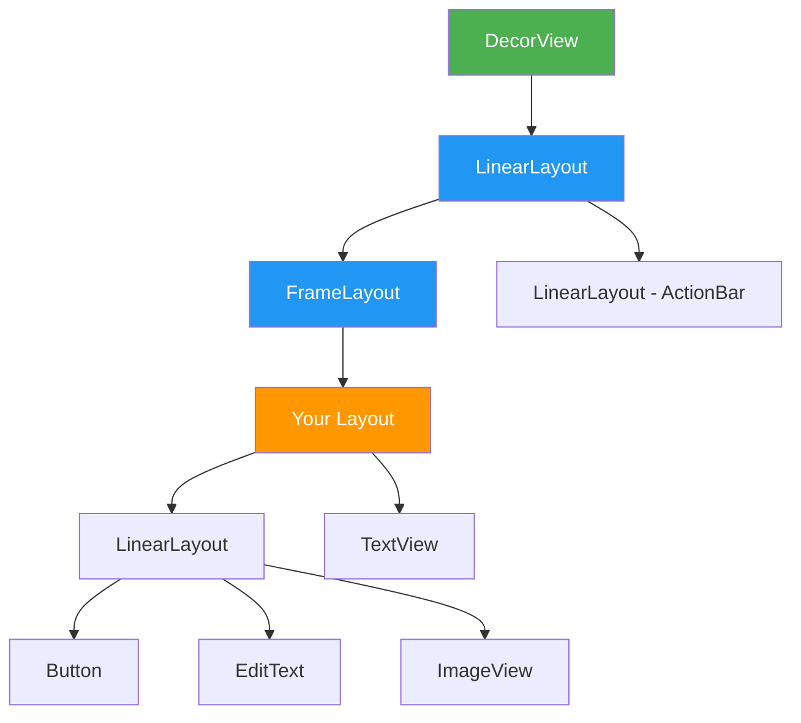

**关键节点说明：**

| 节点类型 | 说明 | 谁创建的 |
|---------|------|---------|
| `DecorView` | 最顶层视图，包含状态栏和导航栏 | 系统 |
| `FrameLayout` | 根容器，承载应用内容 | 系统 |
| `Your Layout` | 你在 `setContentView` 加载的布局 | 开发者 |

**术语解释：**
- **DecorView**：装饰视图，是整个 View Tree 的根节点（最顶层的祖先）。它由 Android 系统自动创建，包含了状态栏（显示时间、电量的顶部条）、导航栏（底部的返回/Home/多任务按钮）和你的应用内容。你无法直接控制 DecorView，但可以通过 `setContentView` 往里面添加内容。
- **FrameLayout（帧布局）**：最简单的 ViewGroup，所有子 View 从左上角开始层叠堆放。系统默认用它作为 Activity 内容的根容器。
- **LinearLayout（线性布局）**：按照水平或垂直方向依次排列子 View 的容器。就像排队一样，一个接一个。
- **ActionBar**：应用顶部的操作栏，显示标题、返回按钮、菜单等。现代应用中常被 Toolbar 取代。
- **TextView**：用于显示文字的 View，是 Android 中最常用的 UI 元素之一。
- **Button**：按钮，用户可以点击触发事件。本质上是一个特殊样式的 TextView。
- **EditText**：可编辑的文本框，用户可以在里面输入文字，比如登录时输入用户名和密码。
- **ImageView**：用于显示图片的 View，支持多种图片缩放方式。

### 3.2 XML 布局文件位置

```
app/
├── src/
│   ├── main/
│   │   ├── java/          # Kotlin/Java 代码
│   │   ├── res/
│   │   │   ├── layout/    # ⭐ 布局文件目录（常用）
│   │   │   ├── layout-land/  # 横屏布局
│   │   │   ├── layout-sw600dp/  # 平板布局
│   │   │   ├── values/
│   │   │   └── ...
│   │   └── AndroidManifest.xml
```

**术语解释：**
- **app/src/main/**：Android 项目的主要源代码目录。`app` 是模块名，`src/main` 是主源集（区别于 test 测试源集）。
- **java/**：存放 Kotlin 或 Java 源代码的目录。虽然叫 `java`，但现在主要放 Kotlin 代码。
- **res/**：资源（Resources）目录，存放所有非代码资源：布局 XML、图片、字符串、颜色、样式等。
- **layout/**：专门存放布局 XML 文件的目录。系统会根据文件名（如 `activity_main`）自动生成 `R.layout.activity_main` 资源 ID。
- **layout-land/**：横屏（landscape）模式下的布局文件。`-land` 是资源限定符，表示"当设备横屏时使用此目录的资源"。
- **layout-sw600dp/**：最小宽度 600dp 的设备使用的布局。`sw` = smallest width（最小宽度），600dp 通常对应 7 英寸平板。
- **values/**：存放字符串（strings.xml）、颜色（colors.xml）、样式（themes.xml）等值资源的目录。
- **AndroidManifest.xml**：应用的"身份证"，声明应用的包名、权限、Activity、主题等核心信息。系统启动 Activity 时首先读取这个文件。

**布局文件命名规范：**

```xml
<!-- ✅ 推荐：使用小写下划线 -->
activity_main.xml
fragment_home.xml
item_list.xml
dialog_confirm.xml

<!-- ❌ 避免：大写或特殊字符 -->
MainLayout.xml
my-layout.xml
```

### 3.3 加载方式

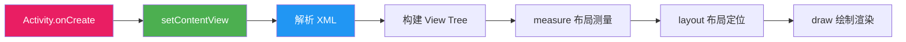

**术语解释：**
- **Activity.onCreate()**：Activity 生命周期中的第一个回调方法。当系统创建 Activity 时调用，类似于"初始化"阶段。在这里设置布局、初始化变量、绑定事件监听器。
- **setContentView()**：将 XML 布局文件加载到 Activity 中的核心方法。它接收一个布局资源 ID（如 `R.layout.activity_main`），然后通过 LayoutInflater 将 XML 解析为 View 对象树。
- **LayoutInflater**：布局解析器，负责读取 XML 文件并创建对应的 View 对象。它是 Android 框架中的一个系统服务，你不需要手动创建。
- **measure（测量）**：渲染管线的第一阶段。系统递归遍历 View Tree，计算每个 View 应该有多宽、多高。就像裁缝量体裁衣前先量尺寸。
- **layout（布局）**：渲染管线的第二阶段。在测量完成后，系统确定每个 View 应该放在屏幕的什么位置（左上角坐标、右下角坐标）。
- **draw（绘制）**：渲染管线的第三阶段。系统将每个 View 的内容绘制到 Canvas（画布）上，最终显示到屏幕上。就像画家在画布上作画。
- **Canvas（画布）**：Android 绘图系统中的核心概念，代表一块可以绘制图形、文字、图片的区域。所有 View 最终都在 Canvas 上绘制自己。

**两种加载方式对比：**

```kotlin
// Kotlin 代码示例：展示两种布局加载方式
class MainActivity : AppCompatActivity() {
    // AppCompatActivity 是 AndroidX 提供的兼容性 Activity 基类
    // 它让新版本的 Activity 特性可以在旧版本 Android 上运行
    
    override fun onCreate(savedInstanceState: Bundle?) {
        // onCreate() 是 Activity 生命周期方法，在 Activity 创建时调用
        // savedInstanceState 是一个 Bundle 对象，存储了 Activity 被销毁前的状态数据
        // 比如用户旋转屏幕时，系统会先销毁再重建 Activity，这个参数就携带了之前的状态
        super.onCreate(savedInstanceState)
        // 调用父类的 onCreate()，这是必须的，父类会做一些初始化工作
        
        // 方式1：XML 布局（推荐 ✅）
        // R.layout.activity_main 是系统自动生成的资源 ID
        // R 是自动生成的资源索引类，layout 是内部类，activity_main 是布局文件名
        setContentView(R.layout.activity_main)
        
        // 方式2：代码动态创建（特殊场景）
        // 这种方式在简单场景或需要动态改变布局时使用
        // 大多数情况下推荐使用 XML 方式，因为更清晰、更容易维护
        val layout = LinearLayout(this)
        // this 代表当前 Activity 的 Context（上下文）
        // Context 是 Android 中非常重要的概念，提供了应用运行环境的访问接口
        // 包括访问资源、启动组件、获取系统服务等能力
        
        layout.addView(TextView(this).apply {
            // apply 是 Kotlin 的作用域函数，允许在对象创建后立即配置属性
            // 等价于：
            // val tv = TextView(this)
            // tv.text = "Hello"
            text = "Hello"
        })
        setContentView(layout)
    }
}
```

---

## 4. 基础用法

### XML 基本结构

```xml
<?xml version="1.0" encoding="utf-8"?>
<!-- XML 声明：指定 XML 版本和字符编码 -->
<!-- version="1.0" 表示使用 XML 1.0 标准 -->
<!-- encoding="utf-8" 表示使用 UTF-8 字符编码（支持中文等多语言） -->

<!-- 根布局：选择合适的布局类型 -->
<!-- xmlns:android 是 XML 命名空间声明 -->
<!-- 命名空间让 Android 系统知道 android: 前缀的属性属于 Android 框架 -->
<LinearLayout xmlns:android="http://schemas.android.com/apk/res/android"
    android:layout_width="match_parent"
    <!-- layout_width: 定义 View 的宽度 -->
    <!-- match_parent 表示填满父容器的宽度 -->
    <!-- 还可以是 wrap_content（包裹内容）或具体数值如 100dp -->
    
    android:layout_height="match_parent"
    <!-- layout_height: 定义 View 的高度 -->
    <!-- 所有 View 都必须设置 layout_width 和 layout_height -->
    
    android:orientation="vertical">
    <!-- orientation: LinearLayout 的专有属性 -->
    <!-- vertical 表示子 View 垂直排列（从上到下） -->
    <!-- horizontal 表示子 View 水平排列（从左到右） -->

    <!-- 子视图 -->
    <TextView
        android:layout_width="wrap_content"
        <!-- wrap_content: 宽度由内容决定 -->
        <!-- 如果文字是"Hello World"，宽度就是文字的宽度 -->
        
        android:layout_height="wrap_content"
        <!-- wrap_content: 高度由内容决定 -->
        
        android:text="Hello World" />
        <!-- text: TextView 显示的文字内容 -->
        <!-- 注意：实际开发中文字应该放在 strings.xml 中，方便多语言适配 -->

</LinearLayout>
```

### 三大尺寸值

| 值 | 含义 | 使用场景 |
|-----|------|---------|
| `match_parent` | 填满父容器 | 宽度/高度占满 |
| `wrap_content` | 包裹内容 | 按内容自适应 |
| `具体dp值` | 固定尺寸 | 精确控制（如 16dp 间距） |

**术语解释：**
- **match_parent**：让 View 的尺寸等于父容器的尺寸。如果父容器宽 1080px，子 View 也宽 1080px。旧版本叫 `fill_parent`，功能相同，现在推荐用 `match_parent`。
- **wrap_content**：让 View 的尺寸刚好包裹住它的内容。如果 TextView 里只有"Hello"五个字，宽度就是这五个字的宽度；如果有 100 个字，宽度就是 100 个字的宽度。
- **dp（density-independent pixel）**：密度无关像素，是 Android 中推荐的尺寸单位。它会根据屏幕密度自动缩放，确保在不同屏幕上显示相同的物理尺寸。公式：`实际像素 = dp × (dpi / 160)`。例如 16dp 在 mdpi（160dpi）屏幕上是 16px，在 xxhdpi（320dpi）屏幕上是 32px，但物理尺寸相同。
- **sp（scale-independent pixel）**：可缩放像素，专门用于字体大小。和 dp 类似，但额外会根据用户在系统设置中选择的字体大小进行缩放。比如用户设置"大字体"，sp 单位的文字会变大，dp 单位的不会。
- **dpi（dots per inch）**：每英寸点数，衡量屏幕像素密度的指标。 dpi 越高，屏幕越清晰（同样物理尺寸下像素更多）。

---

## 5. 实战场景示例

### 六大布局选择指南

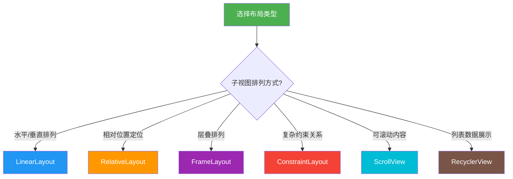

### 布局特点速查表

```plaintext
┌─────────────────────────────────────────────────────────────────┐
│                    六大布局特点速查卡                             │
├──────────────┬──────────────────────────────────────────────────┤
│ Layout       │ 特点 / 适用场景                                  │
├──────────────┼──────────────────────────────────────────────────┤
│ LinearLayout │ 线性排列，支持权重分配，简单高效                    │
│ RelativeLayout│ 相对定位，减少嵌套，但属性较多                     │
│ FrameLayout  │ 层叠排列，适合容器/Fragment/浮层                   │
│ ConstraintLayout│ 强大约束，性能最优，复杂界面首选                  │
│ ScrollView   │ 可滚动容器，嵌套子布局使用                         │
│ RecyclerView │ 列表展示，ViewHolder 复用，大数据量必备             │
└──────────────┴──────────────────────────────────────────────────┘
```

---

## 6. 常见错误与避坑

### 错误信息速查表

| 错误信息 | 原因 | 解决方案 |
|---------|------|---------|
| `The specified child already has a parent` | View 已有父容器 | 先 `removeView` 或重新创建 |
| `InflateException` | XML 语法错误 | 检查标签闭合、属性拼写 |
| `NullPointerException` | `findViewById` 返回 null | 确认 ID 正确，检查布局加载时机 |
| `StackOverflowError` | 布局嵌套过深 | 减少层级，使用 ConstraintLayout |

**术语解释：**
- **The specified child already has a parent**：一个 View 只能有一个父容器。就像一个人不能同时属于两个部门。如果你想把一个 View 从旧容器移到新容器，必须先用 `removeView()` 把它从旧容器移除。
- **InflateException**：布局解析异常。当 XML 文件有语法错误（比如标签没闭合、属性名拼写错误）时，LayoutInflater 无法正确解析 XML，就会抛出这个异常。
- **NullPointerException（NPE，空指针异常）**：尝试访问一个为 null 的对象时抛出。在布局中常见于 `findViewById()` 返回 null，通常是因为布局还没加载就尝试访问 View，或者 ID 写错了。
- **StackOverflowError（栈溢出错误）**：递归调用过深导致调用栈溢出。在布局中通常是 View 嵌套层级太深，measure/layout/draw 的递归调用超出了栈的容量。
- **removeView()**：从 ViewGroup 中移除指定的子 View。调用后，该 View 不再显示也不再占据空间。
- **findViewById()**：通过 ID 查找布局中的 View 对象。比如 `findViewById<TextView>(R.id.tvName)` 会找到 ID 为 `tvName` 的 TextView。现代开发中推荐使用 ViewBinding 替代。

### Before/After 对比

```xml
<!-- ❌ Bad: 过深嵌套 -->
<!-- 每层 LinearLayout 都需要被 measure 和 layout -->
<!-- 3层嵌套意味着 measure 可能被调用 3 次以上 -->
<LinearLayout>
  <LinearLayout>
    <LinearLayout>
      <TextView />
    </LinearLayout>
  </LinearLayout>
</LinearLayout>

<!-- ✅ Good: 扁平化结构 -->
<!-- ConstraintLayout 用约束关系替代嵌套 -->
<!-- 所有 View 都是 ConstraintLayout 的直接子 View，只需 1 次 measure -->
<ConstraintLayout>
  <TextView
    app:layout_constraintTop_toTopOf="parent"
    <!-- 约束 TextView 的顶部对齐父容器的顶部 -->
    <!-- "parent" 代表父容器 ConstraintLayout -->
    
    app:layout_constraintStart_toStartOf="parent" />
    <!-- 约束 TextView 的左侧对齐父容器的左侧 -->
    <!-- start/end 替代 left/right，是为了适配 RTL（从右到左）语言 -->
</ConstraintLayout>
```

---

## 7. 优势与局限

| 优势 | 局限 |
|------|------|
| 声明式 UI，易于维护 | 复杂布局 XML 文件较大 |
| 系统预编译优化 | 动态修改需要代码介入 |
| 资源限定符适配 | 学习曲线（ConstraintLayout） |
| 工具支持（可视化编辑器） | 深层嵌套影响性能 |

---

## 8. 进阶技巧

### 8.1 技术演进时间线

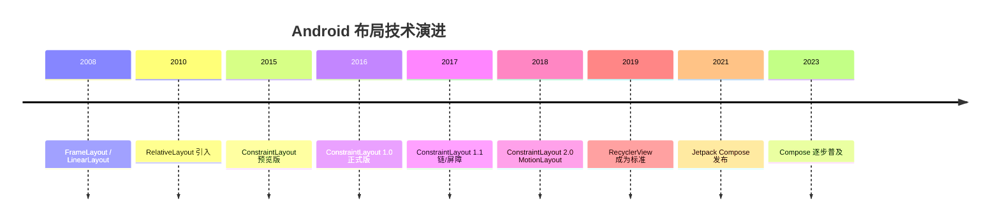

### 8.2 项目文件结构建议

```
app/src/main/res/layout/
├── activity_main.xml          # Activity 布局
├── activity_detail.xml        # 详情页布局
├── fragment_home.xml          # Fragment 布局
├── fragment_profile.xml       # 个人中心
├── item_list.xml              # 列表项
├── item_grid.xml              # 网格项
├── layout_toolbar.xml         # 公共组件
├── layout_loading.xml         # 公共加载
└── dialog_confirm.xml         # 对话框
```

---

## 9. 面试高频考点

### Q1：View Tree 的测量流程是什么？

**答：** View Tree 的渲染遵循三个阶段：

```
measure → layout → draw
  ↓         ↓       ↓
测量大小   确定位置  绘制内容
```

1. **measure**：从根节点向下递归，计算每个 View 的宽高
2. **layout**：从根节点向下递归，确定每个 View 的位置 (left, top, right, bottom)
3. **draw**：从根节点向下递归，绘制每个 View 的内容

**术语解释：**
- **递归（Recursion）**：函数调用自身的过程。View Tree 的渲染就是递归的：DecorView 调用 LinearLayout 的 onMeasure()，LinearLayout 调用 TextView 的 onMeasure()，TextView 再调用自己的 onMeasure()...直到所有 View 都被测量完毕。
- **left, top, right, bottom**：View 在父容器中的四个坐标值。left 是左边缘到父容器左边缘的距离，top 是上边缘到父容器上边缘的距离，以此类推。这四个值共同确定了 View 的位置和大小（宽度 = right - left，高度 = bottom - top）。

### Q2：为什么推荐使用 ConstraintLayout？

**答：**
- 扁平化布局结构，减少嵌套层级
- 约束系统灵活，支持链式布局
- 性能优于多层 LinearLayout/RelativeLayout 嵌套
- 官方推荐，与 Android Studio 工具链深度集成

**术语解释：**
- **扁平化（Flattening）**：减少布局的嵌套层级。扁平化的布局就像一个扁平的组织结构（所有员工直接向 CEO 汇报），而深层嵌套就像层级森严的官僚结构（CEO → 副总 → 总监 → 经理 → 主管 → 员工）。扁平化布局的 measure/layout 更快，因为递归调用次数更少。
- **链式布局（Chain）**：ConstraintLayout 中的一种布局模式，将多个 View 连成一条"链"，可以均匀分布、紧凑排列或首尾贴边。类似于 LinearLayout 的 weight，但更灵活。
- **工具链（Toolchain）**：Android Studio 提供的一系列配套工具，包括可视化布局编辑器（可以拖拽调整约束）、Layout Inspector（查看 View Tree）、性能分析器等。

### Q3：setContentView 的作用是什么？

**答：** `setContentView` 负责将 XML 布局文件解析并加载到 Activity 中，触发以下流程：

```
XML → LayoutInflater 解析 → 创建 View 对象 → 构建 View Tree → 挂载到 DecorView
```

**术语解释：**
- **挂载（Mount）**：将 View Tree 添加到 DecorView 中，使其成为屏幕显示内容的一部分。就像把一棵树栽到土里，让它生长并被看见。
- **R.layout.activity_main**：这是 Android 资源系统生成的引用。`R` 是自动生成的类，`layout` 是内部类，`activity_main` 是布局文件名对应的整数 ID。系统通过这个 ID 找到对应的 XML 文件。

---

## 10. 小结与下一步

### 核心要点回顾

| 概念 | 关键点 |
|------|--------|
| View Tree | 树形层级结构，根节点是 DecorView |
| XML 布局 | 存放 `res/layout/` 目录，声明式定义 UI |
| 加载方式 | `setContentView(R.layout.xxx)` |
| 六大布局 | 各有适用场景，按需选择 |

### 下一步学习路径

```
本文（概述）
    ↓
├─→ 01-LinearLayout （入门）
├─→ 02-RelativeLayout （进阶）
├─→ ConstraintLayout 完全指南
├─→ RecyclerView 高级用法
└─→ Jetpack Compose 入门
```

---

## 📚 术语表

| 术语 | 英文 | 说明 |
|------|------|------|
| 视图树 | View Tree | UI 元素的树形层级结构，从 DecorView 根节点开始，层层嵌套 |
| 布局 | Layout | 定义 View 排列方式的容器，如 LinearLayout、ConstraintLayout |
| 声明式 | Declarative | 描述"要什么"而非"怎么做"，XML 和 Compose 都是声明式 |
| 测量 | Measure | 计算 View 大小的过程，从根节点递归向下 |
| 绘制 | Draw | 在屏幕上渲染 View 的过程，包括背景、内容、子View、装饰 |
| View | View | Android 中所有 UI 元素的基类 |
| ViewGroup | ViewGroup | 可以包含其他 View 的容器，如 LinearLayout |
| DecorView | DecorView | View Tree 的根节点，包含状态栏和导航栏 |
| Context | Context | 应用运行环境的访问接口，提供资源、系统服务等 |
| Resource | Resource | 非代码资源，包括布局、图片、字符串、颜色等 |
| dp | density-independent pixel | 密度无关像素，适配不同屏幕密度 |
| sp | scale-independent pixel | 可缩放像素，用于字体大小 |
| inflate | inflate | 将 XML 布局文件解析为 View 对象的过程 |
| 嵌套 | Nesting | 布局中包含其他布局，层级越深性能越差 |
| 扁平化 | Flattening | 减少布局嵌套层级的优化手段 |

---

## 📝 课后练习

1. 在 Android Studio 中创建一个新的 Layout 文件，使用 LinearLayout 包含一个 TextView 和一个 Button
2. 使用 Layout Inspector 工具查看你应用的 View Tree 结构
3. 思考：你的应用主界面适合用哪种布局类型？为什么？

---

## ✅ 自测题

1. XML 布局文件应该放在哪个目录？
2. `match_parent` 和 `wrap_content` 的区别是什么？
3. View Tree 的三个渲染阶段是什么？

---

## 🎯 常见学生错误

| 错误 | 正确做法 |
|------|---------|
| 在 XML 中使用 `px` 单位 | 使用 `dp` 适配不同屏幕 |
| 忽略布局嵌套层级 | 尽量扁平化，使用 ConstraintLayout |
| Activity 中手动 new View | 优先使用 XML 布局 |

---

## 💡 教学提示

> 建议先让学生用 Layout Inspector 观察真实 View Tree，再讲解理论概念，这样更直观。

---

## 🎬 渲染逻辑详解

### 从 XML 到屏幕：完整的渲染管线

当你调用 `setContentView(R.layout.activity_main)` 时，Android 系统执行以下完整流程：

```
XML 文件
  ↓ LayoutInflater 解析
View 对象树（内存中的 View 实例）
  ↓ measure（测量阶段）
每个 View 确定自己的宽高
  ↓ layout（布局阶段）
每个 View 确定自己的位置 (left, top, right, bottom)
  ↓ draw（绘制阶段）
每个 View 将自己绘制到 Canvas 上
  ↓ SurfaceFlinger 合成
最终像素显示到屏幕
```

### measure 测量阶段详解

measure 是递归过程，从 DecorView 开始向下遍历整棵 View Tree：

```plaintext
DecorView.onMeasure()
  └─ LinearLayout.onMeasure()
       ├─ TextView.onMeasure()    ← 测量文字需要多宽多高
       ├─ Button.onMeasure()      ← 测量按钮需要多宽多高
       └─ ImageView.onMeasure()   ← 测量图片需要多宽多高
```

**关键概念：MeasureSpec**

每个 View 收到一个 `MeasureSpec`，它是一个 32 位整数，包含：
- **模式（Mode）**：`EXACTLY`（精确值）、`AT_MOST`（最大值）、`UNSPECIFIED`（无限制）
- **大小（Size）**：具体的像素值

```kotlin
// 开发者设置的 layout_width/height 决定了 MeasureSpec 的模式
// match_parent → EXACTLY（父容器多大我就多大）
// wrap_content → AT_MOST（不超过父容器的最大值）
// 100dp        → EXACTLY（精确值）
```

### layout 布局阶段详解

测量完成后，父容器根据子 View 的测量结果确定每个子 View 的位置：

```plaintext
DecorView.layout(0, 0, 1080, 2340)    // 整个屏幕
  └─ LinearLayout.layout(0, 0, 1080, 2340)
       ├─ TextView.layout(0, 0, 200, 80)      // 左上角
       ├─ Button.layout(0, 80, 1080, 160)     // 按钮区域
       └─ ImageView.layout(0, 160, 1080, 500) // 图片区域
```

**各布局的 layout 策略差异：**

| 布局类型 | layout 策略 | 测量轮次 |
|---------|------------|---------|
| LinearLayout | 按顺序排列，weight 参与计算 | 1-2 次 |
| RelativeLayout | 根据相对关系定位 | 2 次（水平+垂直） |
| FrameLayout | 全部从左上角开始堆叠 | 1 次 |
| ConstraintLayout | 根据约束关系求解 | 1 次 |

### draw 绘制阶段详解

绘制遵循 6 个步骤（SurfaceView 等特殊情况除外）：

```plaintext
draw() 的 6 个步骤：
  1. 绘制背景        → canvas.drawColor(background)
  2. 保存图层        → (如果有必要)
  3. 绘制自身内容    → onDraw() — TextView 在这里画文字
  4. 绘制子 View     → dispatchDraw() — ViewGroup 在这里递归
  5. 绘制装饰        → 如滚动条
  6. 绘制前景        → 如前景 drawable
```

**过度绘制（Overdraw）原理：**

```plaintext
像素被绘制的次数：
  背景(1次) → 父容器背景(2次) → 子View背景(3次) → 文字(4次)
  如果一个像素在同一帧被绘制 3 次以上，就产生了过度绘制

开发者选项 → 调试 GPU 过度绘制：
  无色 = 0次过度绘制（理想）
  蓝色 = 1次过度绘制（可接受）
  绿色 = 2次过度绘制（需关注）
  粉色 = 3次过度绘制（需优化）
  红色 = 4次+过度绘制（严重问题）
```

### 渲染性能的关键指标

| 指标 | 目标值 | 超过说明 |
|------|--------|---------|
| 帧率 | ≥55 FPS | 低于此值用户可感知卡顿 |
| 单帧渲染时间 | ≤16ms | 超过则掉帧 |
| View 层级深度 | ≤10 层 | 过深导致 measure 耗时 |
| measure 次数 | ≤2 次 | 每层嵌套增加 1 次 |
| 过度绘制 | ≤1x | 同一像素最多画 2 次 |

---

## 🔗 知识依赖图

### 本章在课程体系中的位置

本章是整个布局系统课程的**入口和总纲**，后续所有章节都建立在本章的基础概念之上：

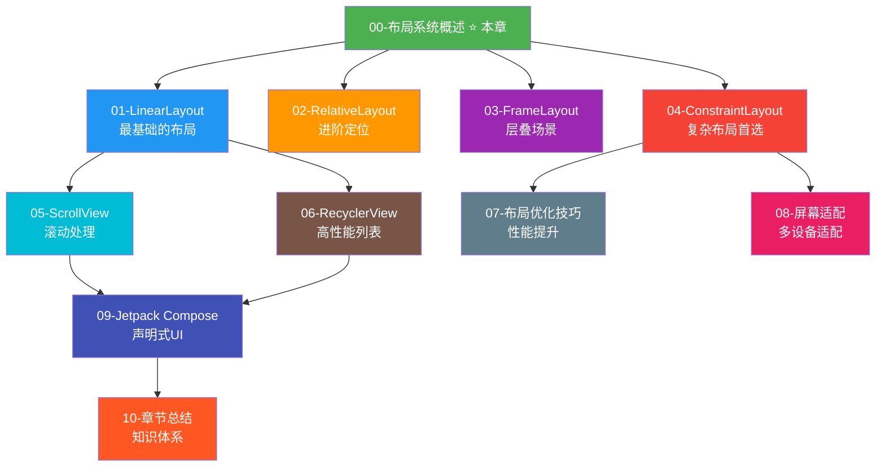

### 核心渲染管线在各章节的体现

| 渲染阶段 | 本章引入 | 后续章节深入 |
|---------|---------|------------|
| **measure** | View Tree 递归测量 | 01-LinearLayout weight 的两轮测量、02-RelativeLayout 多轮测量、04-ConstraintLayout 单次测量 |
| **layout** | 确定 View 位置 | 03-FrameLayout 层叠定位、05-ScrollView 滚动偏移 |
| **draw** | 绘制到 Canvas | 06-RecyclerView ViewHolder 复用绘制、09-Compose 按需组合绘制 |

### 组件关系总览

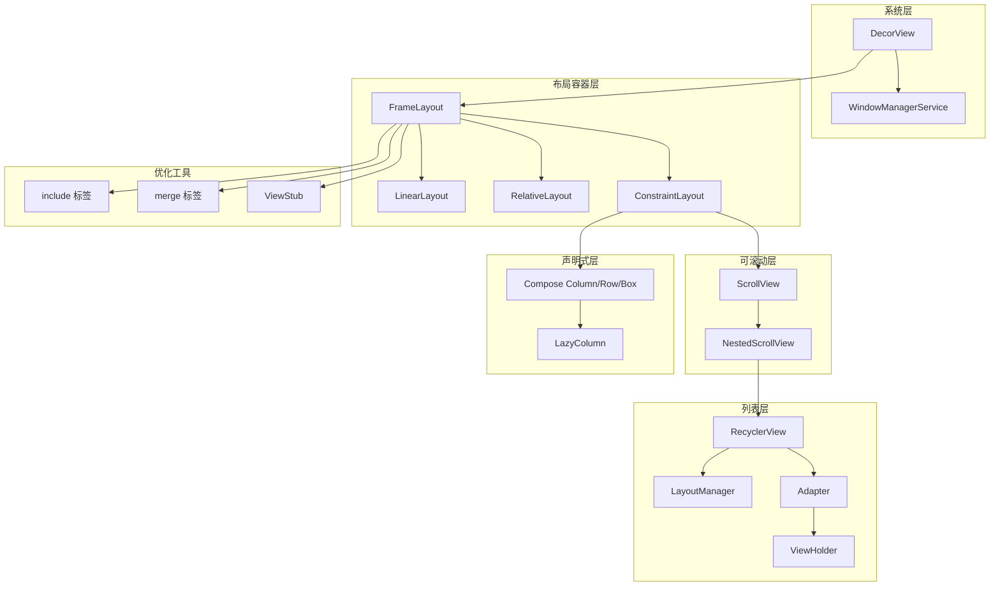

### 本章核心组件说明

| 组件 | 本章角色 | 后续章节详解 |
|------|---------|------------|
| **DecorView** | View Tree 的根节点 | 00-概述介绍，后续章节隐式使用 |
| **FrameLayout** | 系统默认的根容器 | 03-FrameLayout 详解 |
| **LinearLayout** | 最简单的布局容器 | 01-LinearLayout 完全指南 |
| **setContentView** | 加载 XML 布局的入口 | 00-概述介绍，每章都会用到 |
| **LayoutInflater** | XML → View 对象的解析器 | 00-概述介绍，07-优化中 include/merge 相关 |

---

## 🛠 实战项目建议

**项目：** 个人名片页面
- 使用 LinearLayout 或 ConstraintLayout
- 包含头像、姓名、职位、联系方式
- 练习基本属性设置

---

## ✅ 代码审查清单

- [ ] 布局文件命名是否符合规范（小写下划线）
- [ ] 根布局类型选择是否合适
- [ ] 是否避免了过深嵌套（>4层）
- [ ] 尺寸单位是否使用 dp/sp
- [ ] 是否适配了横屏/平板布局

---

## 🔬 渲染管线底层深度解析

> 本章节从 Android 渲染管线的最底层机制出发，深入剖析一帧画面从 VSYNC 信号到屏幕像素更新的完整链路。内容面向希望理解"系统底层如何工作"的开发者。

### 1. Choreographer 与 VSYNC 信号同步机制

#### 1.1 什么是 VSYNC

**VSYNC（Vertical Synchronization，垂直同步信号）** 是由显示硬件（屏幕）发出的周期性电信号。你可以把它理解为屏幕的"心跳"——每次心跳代表屏幕刷新一帧的准备时刻。大多数 Android 设备的屏幕刷新率是 60Hz，也就是每秒发出 60 次 VSYNC 信号，每两次信号间隔约 16.6ms。

**术语解释：**
- **VSYNC 信号**：屏幕硬件在每次刷新周期开始时发出的同步信号。就像工厂流水线的节拍器，每个节拍代表"可以开始生产下一件产品了"。Android 的渲染工作必须跟随这个节拍，否则就会出现画面撕裂（Tearing）或掉帧（Jank）。
- **画面撕裂（Tearing）**：当 GPU 渲染速度和屏幕刷新速度不同步时，屏幕上半部分显示前一帧、下半部分显示后一帧，导致画面出现"裂缝"的视觉缺陷。
- **掉帧（Jank）**：一帧渲染未能在 16.6ms 内完成，导致该帧被跳过，用户感知到卡顿。
- **刷新率（Refresh Rate）**：屏幕每秒刷新画面的次数，单位 Hz。60Hz = 每秒 60 帧。部分高端设备支持 90Hz、120Hz 甚至更高。

#### 1.2 Choreographer 的角色

**Choreographer（编舞者）** 是 Android 渲染体系的"总调度"。它接收来自底层 SurfaceFlinger 的 VSYNC 信号，然后按照固定顺序调度各类回调任务，驱动整个 View Tree 的测量、布局和绘制。

可以把 Choreographer 想象成一位交响乐团的指挥：VSYNC 信号就是指挥的指挥棒落下，乐手（各种回调任务）按照乐谱顺序依次演奏。

**Choreordinator 调度的四类回调（按执行顺序）：**

| 回调类型 | 英文常量 | 作用 | 类比 |
|---------|---------|------|------|
| INPUT | `CALLBACK_INPUT` | 处理输入事件（触摸、按键） | 先收集观众的点单 |
| ANIMATION | `CALLBACK_ANIMATION` | 执行动画计算（属性动画、ValueAnimator） | 计算菜品的变化 |
| TRAVERSAL | `CALLBACK_TRAVERSAL` | 执行 View Tree 的 measure/layout/draw | 正式烹饪和上菜 |
| COMMIT | `CALLBACK_COMMIT` | 提交帧，记录帧信息 | 清理餐桌，准备下一轮 |

**术语解释：**
- **Choreographer**：Android 框架类（`android.view.Choreographer`），每个 UI 线程有一个实例。它通过 `postCallback()` 方法接收任务，在 VSYNC 信号到来时按优先级执行。名字来源于"编舞者"——它编排各类渲染任务的"舞步"。
- **doFrame()**：Choreographer 在收到 VSYNC 信号后调用的核心方法。它内部会依次执行上述四类回调。可以理解为"开始执行这一帧的所有工作"。
- **UI 线程（主线程）**：Android 应用中负责处理界面交互和渲染的线程。所有 View 的 measure/layout/draw 都在 UI 线程执行。Choreographer 也运行在 UI 线程上。

#### 1.3 VSYNC → Choreographer → ViewRootImpl 调用链

当 VSYNC 信号到达时，整个渲染流程的调用链如下：

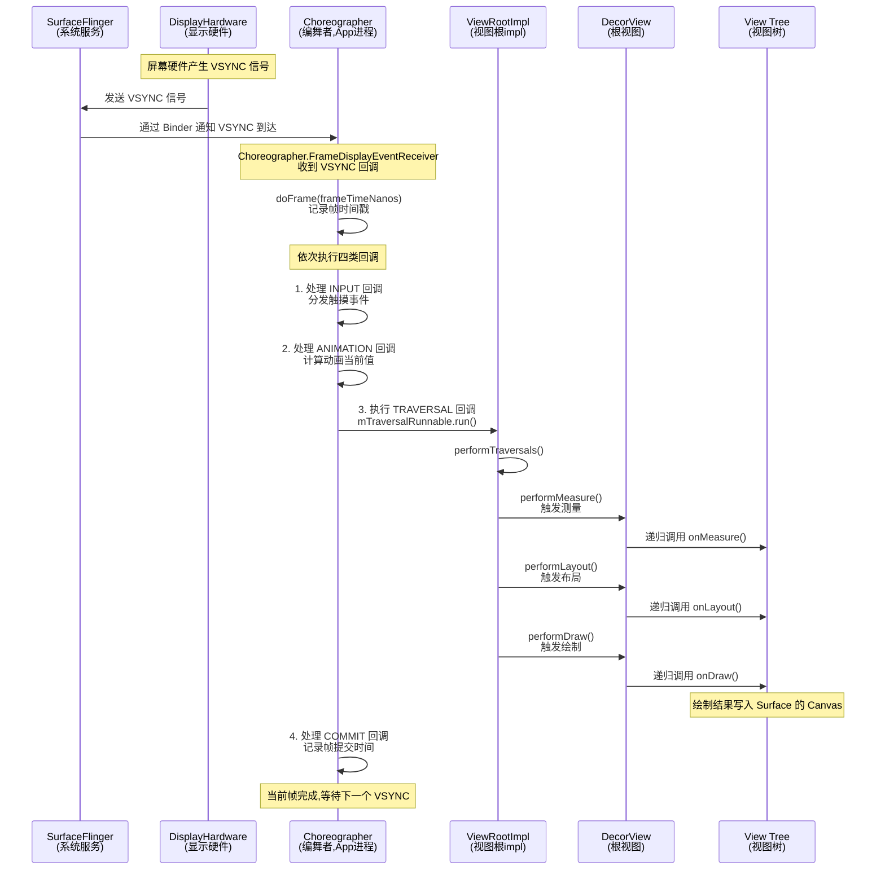

**术语解释：**
- **SurfaceFlinger**：Android 系统级的图像合成服务进程。它负责收集所有 App 产生的 Surface 图像数据，合成最终的画面交给屏幕显示。可以理解为"印刷厂总装车间"，把各个印刷页组装成完整报纸。
- **ViewRootImpl**：View Tree 和 WindowManager 之间的桥梁。每个 Window 对应一个 ViewRootImpl，它管理 DecorView 的 measure/layout/draw 三大流程。`performTraversals()` 是它的核心方法，触发整个渲染管线。
- **Binder**：Android 的跨进程通信（IPC）机制。VSYNC 信号从 SurfaceFlinger 进程传递到 App 进程就是通过 Binder 实现的。可以类比为"跨部门传递文件的快递员"。
- **frameTimeNanos**：当前帧的时间戳（纳秒级）。Choreographer 用它来计算动画插值、判断是否掉帧等。

### 2. performTraversals() 内部执行流程

`ViewRootImpl.performTraversals()` 是整个渲染管线的"心脏"方法。它内部按顺序执行三个阶段，每个阶段对应一个 `perform*` 方法：

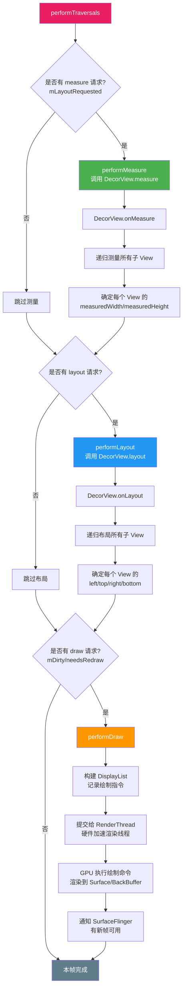

**三个 perform 方法与三阶段的对应关系：**

| perform 方法 | 对应阶段 | 作用 | 递归入口 |
|-------------|---------|------|---------|
| `performMeasure()` | measure 测量 | 计算所有 View 的宽高 | `DecorView.measure()` → `onMeasure()` |
| `performLayout()` | layout 布局 | 确定所有 View 的位置 | `DecorView.layout()` → `onLayout()` |
| `performDraw()` | draw 绘制 | 绘制内容到 Canvas/Surface | `DecorView.draw()` → `onDraw()` |

**术语解释：**
- **performMeasure/performLayout/performDraw**：ViewRootImpl 中的三个方法，分别触发 View Tree 的测量、布局、绘制。它们是 `performTraversals()` 内部的三个主要步骤。
- **mLayoutRequested**：ViewRootImpl 的标志位，表示是否有 layout 请求待处理。只有当此标志为 true 时才执行 measure 和 layout。调用 `requestLayout()` 会设置此标志。
- **DisplayList**：硬件加速绘制时记录的一系列绘制指令（如"画一个矩形"、"画一段文字"）。它先在 UI 线程构建，再交给 RenderThread 执行。可以类比为"菜谱"——先写好做菜步骤，再交给厨师执行。
- **RenderThread（渲染线程）**：Android 5.0 引入的独立渲染线程，专门负责执行 DisplayList 中的 GPU 绘制命令。它让 UI 线程可以继续响应用户操作，而绘制工作在后台并行进行。
- **mDirty（脏区域）**：记录需要重绘的屏幕区域。只有脏区域内的 View 才会被重新绘制，避免整屏重绘的开销。可以类比为"只擦改错的部分，不重写整页作业"。

**重要细节：三阶段并非总是全部执行**

`performTraversals()` 内部有多个条件判断，并非每次都执行全部三阶段：
- 只有调用过 `requestLayout()`（设置了 `mLayoutRequested`）才会执行 measure 和 layout
- 只有有脏区域（`mDirty`）或首次绘制时才会执行 draw
- 这就是为什么修改 View 属性后要调用 `invalidate()`（触发重绘）或 `requestLayout()`（触发重新测量布局）的原因

### 3. SurfaceFlinger 与 Hardware Composer 合成机制

当 draw 阶段完成后，App 进程渲染出的图像数据并不会直接显示到屏幕上，而是要经过 SurfaceFlinger 和 Hardware Composer 的合成环节。

#### 3.1 完整合成链路


**各环节详解：**

| 环节 | 所在进程 | 作用 | 类比 |
|------|---------|------|------|
| App 进程 | 应用进程 | GPU 将绘制指令渲染成像素数据，写入 Surface 的 BackBuffer | 各车间生产零部件 |
| BufferQueue | 应用进程（生产者侧）| 管理 BackBuffer 和 FrontBuffer 的交替，提供缓冲 | 零部件暂存仓库 |
| SurfaceFlinger | 系统进程（`system_server`）| 收集所有 App 的 Surface 图层，按 Z 序排列并合成 | 总装车间组装整机 |
| Hardware Composer | 硬件模块（HWC）| 用专用硬件合成图层，比 GPU 合成更省电 | 自动化装配流水线 |
| Display | 硬件 | 从 FrameBuffer 读取最终像素并点亮屏幕 | 成品展示柜 |

**术语解释：**
- **Surface**：Android 中代表一块可用于绘制图像的缓冲区。每个 Window（窗口）对应一个 Surface。App 的绘制结果最终写入 Surface 对应的 BackBuffer 中。可以类比为"画家的一块画板"。
- **BufferQueue**：Android 图形系统的核心数据结构，采用生产者-消费者模式管理图形缓冲区。App 是生产者（写入图像），SurfaceFlinger 是消费者（读取并合成图像）。可以类比为"快递柜"——寄件人放进去，取件人取出来。
- **SurfaceFlinger**：系统级图像合成服务。它管理所有 App 的 Surface 图层，将它们按 Z 轴顺序（前后层次）合成成一张完整画面。就像 Photoshop 中把多个图层合并为一张图片。
- **Hardware Composer（HWC）**：硬件合成器，是手机 SoC 中的专用硬件模块。它能用极低的功耗将多个图层合成为最终画面，比 GPU 合成省电得多。当图层简单时用 HWC，复杂时回退到 GPU 合成。
- **Layer（图层）**：SurfaceFlinger 中对每个 Surface 的抽象。状态栏是一个 Layer，导航栏是一个 Layer，你的 App 界面是一个 Layer，多窗口时每个 App 都是独立 Layer。
- **Z 序（Z-order）**：图层在垂直于屏幕方向（Z 轴）上的排列顺序。Z 值大的图层在上层，会覆盖下层。比如悬浮窗的 Z 序高于普通 App 窗口。

#### 3.2 数据传递流程

1. App 进程中 RenderThread 执行 GPU 绘制命令，将像素写入 BackBuffer
2. App 通过 `queueBuffer()` 将渲染完的 BackBuffer 提交给 BufferQueue
3. SurfaceFlinger 通过 `acquireBuffer()` 获取该缓冲区作为 Layer 数据
4. SurfaceFlinger 将所有 Layer 提交给 HWC，HWC 计算合成策略
5. HWC 用硬件合成各 Layer，将结果写入 FrameBuffer
6. Display 从 FrameBuffer 读取像素并显示

**术语解释：**
- **queueBuffer()**：生产者（App）将渲染完毕的图形缓冲区放入 BufferQueue 的方法。相当于"把做好的菜放进传菜口"。
- **acquireBuffer()**：消费者（SurfaceFlinger）从 BufferQueue 取出图形缓冲区的方法。相当于"服务员从传菜口取菜"。
- **FrameBuffer（帧缓冲区）**：屏幕直接读取的最终图像数据存储区。HWC 合成后的最终画面写入此处，屏幕硬件逐行读取其内容并点亮像素。

### 4. 双缓冲与三缓冲机制

#### 4.1 双缓冲机制

**双缓冲（Double Buffering）** 是解决画面撕裂的核心技术。它使用两块缓冲区：

- **BackBuffer（后缓冲）**：GPU 正在写入的缓冲区，存储正在渲染的下一帧
- **FrontBuffer（前缓冲）**：屏幕正在读取的缓冲区，存储当前显示的画面

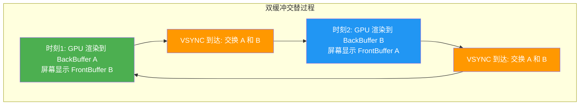

**双缓冲的交换时机**：只有在 VSYNC 信号到达时才交换 BackBuffer 和 FrontBuffer，确保屏幕刷新和 GPU 写入不会同时操作同一块缓冲区，从而避免画面撕裂。

**术语解释：**
- **双缓冲（Double Buffering）**：使用两块缓冲区交替工作的机制。一块给 GPU 写入（BackBuffer），一块给屏幕读取（FrontBuffer），VSYNC 时交换。就像厨师有两口锅交替炒菜，一口在炒的同时另一口在上菜。
- **BackBuffer**：GPU 正在写入渲染数据的缓冲区。当前帧的绘制结果先写入这里，等下一帧才显示。
- **FrontBuffer**：屏幕正在读取显示的缓冲区。里面是上一帧已渲染好的画面。
- **Buffer Swap（缓冲交换）**：在 VSYNC 信号到达时，BackBuffer 和 FrontBuffer 角色互换。原来的 BackBuffer 变成 FrontBuffer 被屏幕读取，原来的 FrontBuffer 变成 BackBuffer 接受新的渲染。

#### 4.2 双缓冲的局限与三缓冲

双缓冲有一个问题：如果某一帧的渲染超过 16.6ms（掉帧），GPU 在下一帧就没有可用的 BackBuffer（因为前一个 BackBuffer 还没交换成 FrontBuffer），导致 GPU 空闲等待，造成连续掉帧。

**三缓冲（Triple Buffering）** 增加了一块缓冲区，让 GPU 在掉帧时也能继续渲染下一帧，减少连续掉帧：

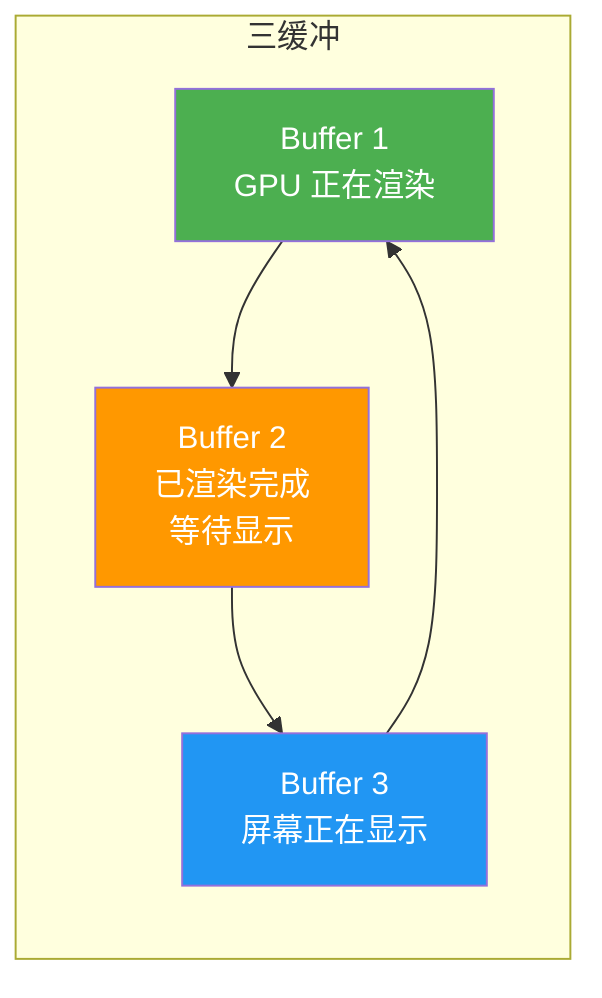

**术语解释：**
- **三缓冲（Triple Buffering）**：使用三块缓冲区交替工作的机制。Android 4.1（Project Butter）引入。第三块缓冲区让 GPU 在掉帧时也能继续工作，减少连续掉帧。可以类比为"厨师有三口锅，即使一口锅的菜还没上，另外两口锅也能继续炒"。
- **Project Butter（黄油计划）**：Android 4.1 引入的渲染性能优化项目，核心是 VSYNC 同步 + 三缓冲 + Choreographer，目标是让 UI 操作如"黄油般顺滑"。

#### 4.3 双缓冲 vs 三缓冲对比

| 特性 | 双缓冲 | 三缓冲 |
|------|--------|--------|
| 缓冲区数量 | 2 块 | 3 块 |
| 内存占用 | 较低 | 较高（多一块缓冲区） |
| 掉帧恢复 | 较慢（可能连续掉帧） | 较快（GPU 可持续渲染） |
| 输入延迟 | 较低 | 略高（多一帧缓冲） |
| 引入版本 | Android 早期 | Android 4.1（Project Butter） |

### 5. 完整一帧渲染流程时序图

以下时序图展示从 VSYNC 信号到屏幕像素更新的完整一帧渲染流程：

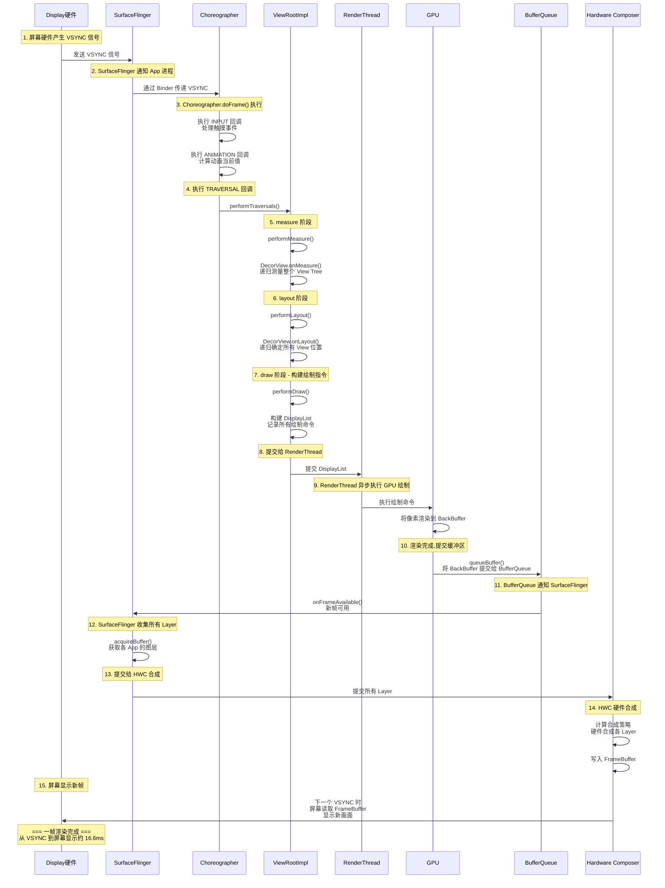

**关键时间节点说明：**

| 阶段 | 耗时占比 | 关键操作 |
|------|---------|---------|
| VSYNC 传递 | 极短（<1ms） | 硬件信号到 App 进程的 Binder 传递 |
| INPUT + ANIMATION | 较短（1-3ms） | 输入事件处理和动画值计算 |
| measure + layout | 中等（2-8ms） | View Tree 递归测量和布局 |
| draw（构建 DisplayList） | 中等（2-5ms） | 遍历 View Tree 记录绘制指令 |
| GPU 渲染 | 中等（2-6ms） | RenderThread 执行 GPU 命令 |
| SurfaceFlinger 合成 | 较短（1-3ms） | 图层收集和 HWC 合成 |
| 屏幕显示 | 等待下一个 VSYNC | 帧缓冲区内容刷新到屏幕 |

**术语解释：**
- **DisplayList（显示列表）**：一组记录好的 GPU 绘制指令序列。Android 4.1+ 硬件加速渲染时，UI 线程先构建 DisplayList（记录"画什么"），再交给 RenderThread 执行（真正"画"）。好处是构建和执行可以并行。
- **onFrameAvailable()**：BufferQueue 的回调方法，当生产者（App）提交新缓冲区时被调用，通知消费者（SurfaceFlinger）有新数据可取。相当于"快递柜满了，通知取件"。
- **RenderThread**：Android 5.0（Lollipop）引入的独立渲染线程。它从 UI 线程接收 DisplayList 并执行 GPU 绘制，使 UI 线程不必等待 GPU 完成就能继续处理用户交互。这是 Android 渲染性能的重要里程碑。

---

## 📐 设计理念与架构图

> 本章节从软件架构设计角度剖析 Android 布局系统，理解其背后的设计哲学、设计模式选择，以及从代码到屏幕的完整窗口体系架构。

### 1. Android 布局系统的设计哲学

#### 1.1 声明式与命令式的权衡

Android 布局系统在发展历程中始终在**声明式（Declarative）** 与**命令式（Imperative）** 之间寻找平衡：

| 维度 | 声明式（XML 布局） | 命令式（代码动态创建） | 声明式（Jetpack Compose） |
|------|-------------------|---------------------|--------------------------|
| 描述方式 | 描述"界面长什么样" | 描述"如何一步步构建界面" | 描述"界面长什么样" |
| 可读性 | 高（结构清晰） | 低（逻辑与结构混杂） | 高（Kotlin DSL 简洁） |
| 可维护性 | 高（UI 与逻辑分离） | 低（UI 与逻辑耦合） | 高（组合函数封装） |
| 动态性 | 低（需代码介入修改） | 高（完全代码控制） | 高（状态驱动自动更新） |
| 工具支持 | 强（可视化编辑器） | 弱（无法预览） | 中（Compose 预览） |
| 性能 | 高（预编译为二进制 XML） | 中（运行时创建对象） | 高（智能跳过未变部分） |

**术语解释：**
- **声明式 UI（Declarative UI）**：开发者只需描述界面在不同状态下的样子，系统自动负责状态变化时的界面更新。XML 布局和 Jetpack Compose 都属于声明式。可以类比为"点菜"——你说想要什么菜，厨房负责做好。
- **命令式 UI（Imperative UI）**：开发者需要手动控制每一步 UI 变化，如"设置文字"、"改变颜色"、"显示/隐藏"。代码动态创建 View 就是命令式。可以类比为"自己做饭"——每一步都要自己操作。
- **Jetpack Compose**：Google 推出的现代声明式 UI 工具包，使用 Kotlin 编写，是 XML 布局的继任者。它通过 `@Composable` 函数描述界面，状态变化时自动重新组合（Recomposition）。
- **Recomposition（重组）**：Compose 中当状态（State）变化时，系统自动重新执行受影响的 `@Composable` 函数来更新界面。类似于 React 的重新渲染。

#### 1.2 View 与 ViewGroup 的组合模式（Composite Pattern）

Android 布局系统采用了经典的**组合模式（Composite Pattern）**，将单个 View 和 View 容器（ViewGroup）统一抽象：

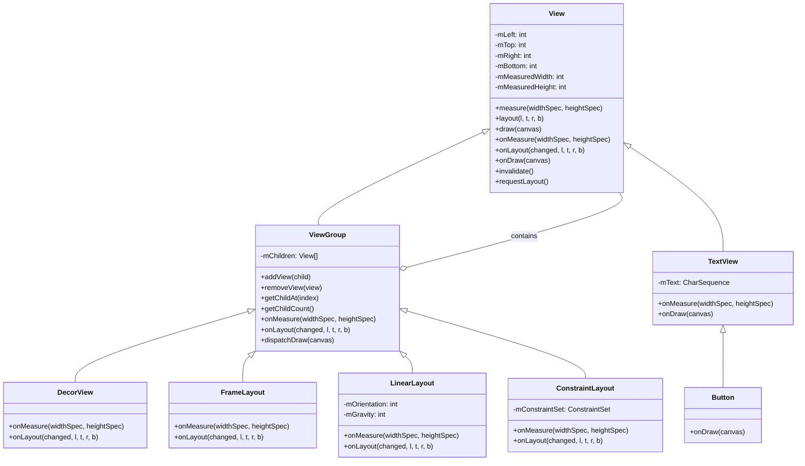

**术语解释：**
- **组合模式（Composite Pattern）**：一种设计模式，将对象组合成树形结构以表示"部分-整体"的层次。在 Android 中，View（叶子节点）和 ViewGroup（容器节点）都继承自同一个 View 基类，ViewGroup 可以包含其他 View 或 ViewGroup，形成树形结构。可以类比为"文件夹和文件"——文件夹可以包含子文件夹和文件，但它们都是"文件系统条目"。
- **叶子节点（Leaf）**：组合模式中不再包含子节点的节点。在 View Tree 中，TextView、Button、ImageView 等直接继承自 View 的类就是叶子节点。
- **容器节点（Composite）**：组合模式中可以包含子节点的节点。ViewGroup 就是容器节点，它可以添加、移除、管理子 View。

#### 1.3 LayoutInflater 的解析器模式

**LayoutInflater** 采用了**解析器模式（Parser Pattern）** 和**工厂模式（Factory Pattern）** 的结合：

```mermaid
flowchart LR
    A["XML 文件<br/>activity_main.xml"] --> B["LayoutInflater<br/>解析器入口"]
    B --> C["XmlPullParser<br/>逐标签解析 XML"]
    C --> D["createViewFromTag()<br/>根据标签名创建 View"]
    D --> E["反射 Class.forName<br/>实例化 View 对象"]
    E --> F["设置 XML 属性<br/>context.obtainStyledAttributes"]
    F --> G["递归处理子标签"]
    G --> H["返回完整 View Tree"]
    
    style A fill:#E91E63,color:#fff
    style B fill:#4CAF50,color:#fff
    style C fill:#2196F3,color:#fff
    style D fill:#FF9800,color:#fff
    style E fill:#9C27B0,color:#fff
    style F fill:#00BCD4,color:#fff
    style G fill:#795548,color:#fff
    style H fill:#607D8B,color:#fff
```

**术语解释：**
- **解析器模式（Parser Pattern）**：一种将结构化文本（如 XML、JSON）解析为对象树的设计模式。LayoutInflater 就是 XML 文本的解析器，它逐标签读取 XML，为每个标签创建对应的 View 对象。
- **工厂模式（Factory Pattern）**：通过工厂方法创建对象而非直接 new。LayoutInflater 的 `createViewFromTag()` 就是工厂方法，根据 XML 标签名（如 `TextView`、`LinearLayout`）通过反射创建对应的 View 实例。
- **反射（Reflection）**：程序在运行时动态获取类信息并创建对象、调用方法的机制。LayoutInflater 用 `Class.forName("android.widget.TextView").newInstance()` 来创建 View 对象，而非硬编码 `new TextView()`。
- **obtainStyledAttributes()**：从 XML 属性集中提取类型化值的方法。它将 XML 中的字符串属性值（如 `android:text="Hello"`）转换为对应的类型（String、int、color 等）。

### 2. 窗口体系架构

Android 的窗口体系是一个从应用层到系统服务层再到硬件层的完整链路：

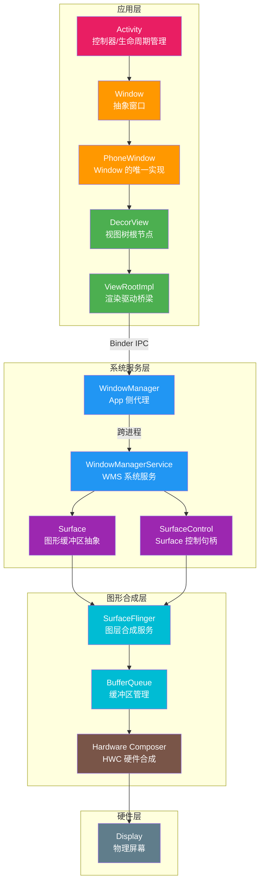

**各层详解：**

| 层级 | 组件 | 所在进程 | 职责 | 类比 |
|------|------|---------|------|------|
| 应用层 | Activity | App 进程 | 生命周期管理、用户交互处理 | 剧场导演 |
| 应用层 | Window | App 进程 | 窗口行为的抽象接口 | 舞台的概念定义 |
| 应用层 | PhoneWindow | App 进程 | Window 的唯一具体实现 | 舞台的实体搭建 |
| 应用层 | DecorView | App 进程 | View Tree 根节点，承载状态栏+内容 | 舞台主体结构 |
| 应用层 | ViewRootImpl | App 进程 | 连接 View Tree 和 WindowManager，驱动渲染 | 舞台技术总监 |
| 系统服务层 | WindowManager | App 进程 | App 侧的 WindowManagerService 代理 | 剧场联络员 |
| 系统服务层 | WindowManagerService | system_server | 管理所有窗口的创建、层级、焦点、动画 | 剧场管理委员会 |
| 系统服务层 | Surface | App/System | 图形缓冲区的抽象，可绘制区域 | 一块画布 |
| 系统服务层 | SurfaceControl | App/System | 控制 Surface 的句柄（位置、大小、可见性）| 画布的控制面板 |
| 图形合成层 | SurfaceFlinger | 独立进程 | 收集所有 Surface 图层并合成 | 印刷厂总装车间 |
| 图形合成层 | BufferQueue | App/SF 共享 | 管理图形缓冲区交替 | 零部件仓库 |
| 图形合成层 | HWC | 硬件 | 硬件合成图层，低功耗 | 自动化装配线 |
| 硬件层 | Display | 硬件 | 显示最终像素 | 成品展示柜 |

**术语解释：**
- **Window**：Android 中窗口的抽象类，代表一个可绘制区域。每个 Activity 对应一个 Window（实际是 PhoneWindow）。Window 是 View Tree 的容器，也是与 WMS 交互的接口。可以类比为"舞台"——View 是演员，Window 是舞台。
- **PhoneWindow**：Window 类的唯一具体实现。Android 中所有窗口都使用 PhoneWindow，它管理 DecorView 的创建和内容设置。
- **WindowManager**：App 进程中的接口对象，它是 WindowManagerService 在 App 进程中的代理。App 通过 WindowManager 向 WMS 发起添加/移除/更新窗口的请求。
- **WindowManagerService（WMS）**：运行在 `system_server` 进程的系统服务，负责管理所有窗口的创建、销毁、层级排列、焦点分配、动画执行等。它是窗口管理的"总指挥"。
- **Surface**：代表一块可用于绘制图形的缓冲区。每个 Window 拥有一个 Surface，App 的绘制操作最终写入 Surface 对应的缓冲区。可以类比为"画布"——Canvas 是画笔，Surface 是画布。
- **SurfaceControl**：控制 Surface 的句柄对象，可以设置 Surface 的位置、大小、层级、可见性等属性。App 通过 SurfaceControl 向 SurfaceFlinger 发送图层控制命令。

### 3. View 系统的 MVC 隐含模式

Android 传统的 View 系统隐含地遵循了 **MVC（Model-View-Controller）** 架构模式：

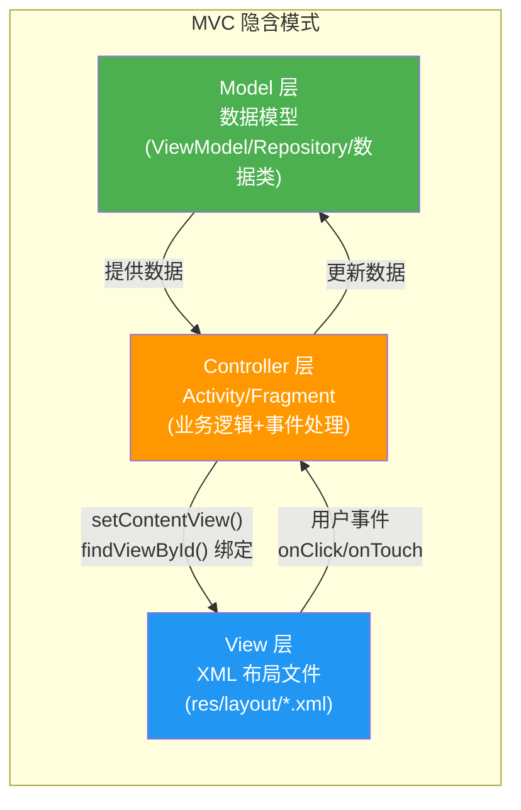

**各层职责：**

| MVC 层 | Android 对应 | 职责 | 典型代码 |
|--------|-------------|------|---------|
| **Model（模型）** | 数据类、ViewModel、Repository | 管理应用数据和业务逻辑，与 UI 无关 | `data class User(name, age)` |
| **View（视图）** | XML 布局文件 | 纯粹描述界面长什么样，不含逻辑 | `activity_main.xml` |
| **Controller（控制器）** | Activity / Fragment | 处理用户事件、调用 Model、更新 View | `MainActivity.kt` |

**术语解释：**
- **MVC（Model-View-Controller）**：一种将应用分为数据模型（Model）、视图（View）、控制器（Controller）三层的架构模式。Model 负责数据，View 负责显示，Controller 负责协调。Android 的 XML+Activity 结构隐含地遵循了这个模式。
- **ViewModel**：Jetpack 架构组件之一，负责为 UI 准备和管理数据。它能在屏幕旋转等配置变化时存活，避免数据丢失。属于 Model 层的一部分。
- **Repository**：数据仓库模式，作为数据的唯一来源，封装了本地数据库（Room）和远程数据源（Retrofit）的访问逻辑。属于 Model 层。

### 4. 为什么选择 XML 声明式布局

Android 选择 XML 作为布局描述语言而非纯代码命令式布局，是基于以下设计考量：

| 考量维度 | XML 声明式优势 | 纯代码命令式劣势 |
|---------|---------------|-----------------|
| 关注点分离 | UI 结构（XML）与业务逻辑（Kotlin/Java）物理分离 | UI 与逻辑混在同一文件，难以维护 |
| 可视化编辑 | Android Studio Layout Editor 可直接拖拽预览 | 无法可视化预览 |
| 预编译优化 | 构建时将 XML 编译为二进制格式，运行时加载更快 | 每次运行时动态创建对象 |
| 资源适配 | 通过资源限定符（`-land`、`-sw600dp`）自动选择不同布局 | 需要大量 if-else 判断屏幕配置 |
| 团队协作 | 设计师可独立编辑 XML，开发者处理逻辑 | 设计师无法参与布局开发 |
| 热重载 | Layout Inspector 实时检查布局结构 | 修改需重新编译运行 |
| 代码体积 | UI 代码以资源文件形式存在，不膨胀逻辑代码 | 大量 View 创建代码使类文件膨胀 |

**术语解释：**
- **关注点分离（Separation of Concerns）**：软件设计原则，将不同职责的代码放在不同模块中。Android 中 XML 负责"界面长什么样"，Kotlin/Java 负责"界面怎么工作"，两者分离便于维护和测试。
- **资源限定符（Resource Qualifier）**：资源目录名的后缀，指示该资源在什么设备配置下使用。如 `layout-land/` 表示横屏布局，`layout-sw600dp/` 表示最小宽度 600dp 设备布局。系统在运行时根据设备配置自动选择最匹配的资源。
- **二进制 XML（Binary XML）**：Android 构建时将文本 XML 编译为二进制格式（`.flat` 文件），运行时解析速度更快，内存占用更小。这是 Android 布局性能优化的基础。

**设计演进的思考：**

虽然 XML 声明式布局有诸多优势，但随着应用复杂度提升，XML+Activity 的 MVC 模式暴露了一些问题（如 View 状态管理困难、UI 更新需手动调用）。这正是 Jetpack Compose 出现的背景——Compose 用 Kotlin 声明式地描述 UI，状态变化自动驱动界面更新，解决了传统 View 体系的核心痛点，同时保留了声明式的优势。

---

## 📝 跨章节综合考核训练

> 以下考核题需要综合运用多个章节的知识，每道题至少关联 2 个章节。建议先独立思考再查看参考答案。

### 考核题 1：View Tree 渲染管线与各布局测量次数的关系

**涉及章节**：00-概述 + 01-LinearLayout + 02-RelativeLayout + 04-ConstraintLayout

**题目**：假设你有一个包含 10 个子 View 的界面，分别用以下三种方式实现：(A) 嵌套 3 层 LinearLayout（每层含 weight）、(B) RelativeLayout（子 View 间有横向和纵向依赖关系）、(C) ConstraintLayout（扁平结构）。请从渲染管线的 measure 阶段出发，分析三种实现方式下 View Tree 的测量次数差异，并解释为什么 ConstraintLayout 在测量阶段性能更优。

**参考答案要点**：
- LinearLayout（含 weight）会对子 View 进行两轮测量：第一轮测量所有子 View 的自然大小，第二轮根据 weight 比例分配剩余空间；3 层嵌套导致测量次数指数级增长
- RelativeLayout 会对子 View 进行两轮测量（横向 + 纵向各一次），因为有横向和纵向两种依赖关系需要分别求解
- ConstraintLayout 通过 Cassowary 约束求解器在单次测量中同时处理所有约束关系，只需 1 轮测量
- 扁平化结构减少了递归深度，ConstraintLayout 直接管理所有子 View，避免了多层嵌套的递归开销

---

### 考核题 2：扁平化在性能优化中的角色

**涉及章节**：00-概述 + 07-布局优化技巧

**题目**：你的应用主界面布局嵌套了 6 层 LinearLayout，导致滚动时出现明显卡顿。请结合渲染管线中 measure/layout/draw 三阶段的工作原理，解释布局嵌套层级过深为什么会导致性能问题。并说明使用 ConstraintLayout 扁平化后，每个阶段分别减少了哪些开销。

**参考答案要点**：
- measure 阶段：每层嵌套增加递归调用深度，含 weight 的 LinearLayout 还会触发多轮测量，6 层嵌套可能产生数十次递归
- layout 阶段：每层 ViewGroup 的 onLayout() 都需要遍历子 View，层级越深遍历次数越多
- draw 阶段：虽然绘制本身按 View 数量计算，但深层嵌套增加了 dispatchDraw() 的递归层级
- ConstraintLayout 扁平化后：measure 从多轮递归降为单轮约束求解，layout 遍历深度从 6 层降为 1 层，draw 递归深度大幅减少

---

### 考核题 3：声明式 UI 从 XML 到 Compose 的演进

**涉及章节**：00-概述 + 09-Compose

**题目**：Android 布局系统经历了"XML 声明式 → 代码命令式（动态创建）→ Jetpack Compose 声明式"的演进。请从设计理念和渲染管线的角度，分析：(1) XML 声明式和 Compose 声明式有什么共同点和本质区别？(2) Compose 的 Recomposition 机制相比传统 View 的 invalidate()/requestLayout() 有什么优势？(3) Compose 是否还使用 Choreographer 驱动的 measure/layout/draw 三阶段渲染管线？

**参考答案要点**：
- 共同点：都是声明式（描述"是什么"而非"怎么做"），都实现了 UI 与逻辑分离；本质区别：XML 需要额外的 inflate 过程且 UI 更新需手动调用，Compose 直接用 Kotlin 描述且状态变化自动驱动 UI 更新
- Compose 的 Recomposition 是细粒度的——只重新执行状态变化的 Composable 函数，而传统 View 的 invalidate() 可能触发整个脏区域重绘
- Compose 底层仍然使用 Android 的渲染管线（Choreographer → measure/layout/draw → SurfaceFlinger），但其 measure/layout/draw 由 Compose 的 LayoutNode 树驱动而非传统 View 树

---

### 考核题 4：measure/layout/draw 三阶段在不同布局中的差异

**涉及章节**：00-概述 + 01-LinearLayout + 03-FrameLayout + 06-RecyclerView

**题目**：以下是四种布局的 measure 阶段策略：LinearLayout（1-2 轮，受 weight 影响）、FrameLayout（1 轮，测量所有子 View 取最大值）、RecyclerView（按需测量可见 Item）。请分析：(1) 为什么 RecyclerView 的 measure 只测量可见的 Item 而不测量全部？(2) RecyclerView 在 scroll 过程中，新增 Item 的 View 是从哪里来的？这对 draw 阶段有什么影响？(3) FrameLayout 的 measure 策略为什么是"取子 View 最大值"？

**参考答案要点**：
- RecyclerView 只测量可见 Item 是因为 ViewHolder 复用机制——只有屏幕可见范围内的 Item 需要测量和绑定数据，不可见的 Item 被回收复用，大幅减少 measure 次数
- 新增 Item 的 View 从 Recycler 缓存池中复用（ViewHolder 复用），不需要重新 inflate；对 draw 阶段的影响是新增 Item 只需 onDraw() 绘制内容，不需要重新构建整个 View 树
- FrameLayout 是层叠布局，所有子 View 从同一原点堆叠，父容器尺寸取决于最大的子 View，因此需要测量所有子 View 并取最大值作为自身尺寸

---

### 考核题 5：dp 单位在渲染管线中的转换过程

**涉及章节**：00-概述 + 08-屏幕适配

**题目**：你在 XML 中设置了 `android:layout_width="16dp"`，请追踪这个 16dp 值从 XML 到屏幕像素的完整转换链路：(1) LayoutInflater 解析 XML 时，16dp 是如何被读取的？(2) 在 measure 阶段，16dp 是如何转换为 MeasureSpec 中的 Size 的？(3) 在 draw 阶段，最终的像素值是如何影响 GPU 绘制的？请写出转换公式并解释 dpi 和 density 的作用。

**参考答案要点**：
- LayoutInflater 通过 `obtainStyledAttributes()` 读取 16dp，存储为 `TypedValue`（类型为 TYPE_DIMENSION，值为 16dp）
- measure 阶段通过 `View.resolveSize()` 和 `MeasureSpec` 将 16dp 转换为像素：`像素 = dp × density`，其中 `density = dpi / 160`，在 xxhdpi（480dpi）设备上 16dp = 16 × 3 = 48px
- draw 阶段 GPU 绘制时直接使用像素坐标，48px 对应屏幕上 48 个物理像素的宽度；dp 的设计确保了不同 dpi 设备上 16dp 对应的物理尺寸相同

---

### 考核题 6：setContentView 与 LayoutInflater 的协作机制

**涉及章节**：00-概述 + 07-布局优化技巧（include/merge）

**题目**：当你调用 `setContentView(R.layout.activity_main)` 时，如果 `activity_main.xml` 中使用了 `<include layout="@layout/layout_toolbar"/>` 和 `<merge>` 标签，请分析：(1) setContentView 内部是如何调用 LayoutInflater 的？(2) 遇到 `<include>` 标签时 LayoutInflater 如何处理？(3) `<merge>` 标签为什么能减少一层 View 嵌套？它的工作原理是什么？

**参考答案要点**：
- setContentView 内部调用 PhoneWindow.setContentView()，再通过 `LayoutInflater.from(context).inflate(resourceId, contentParent)` 解析 XML 并挂载到 DecorView 的 contentParent 容器中
- 遇到 `<include>` 标签时，LayoutInflater 递归调用 `inflate()` 解析被包含的布局文件，将其 View Tree 插入到 include 标签所在位置
- `<merge>` 标签本身不创建任何 View，LayoutInflater 遇到 merge 时直接将其子 View 添加到父容器中，跳过了 merge 这一层，因此减少了布局嵌套层级（常与 include 配合避免多一层无用的 ViewGroup）

---

### 考核题 7：过度绘制与 draw 阶段的关系

**涉及章节**：00-概述 + 07-布局优化技巧

**题目**：你在开发者选项中开启了"调试 GPU 过度绘制"，发现界面大面积呈现红色（4 次+过度绘制）。请结合 draw 阶段的绘制流程分析：(1) 过度绘制是在 draw 阶段的哪个步骤产生的？(2) 哪些布局实践会导致过度绘制？(3) 如何从布局层面优化以降低过度绘制次数？

**参考答案要点**：
- 过度绘制在 draw 阶段的步骤 1（绘制背景）产生——如果父容器和子 View 都设置了不透明的 background，同一像素会被多次绘制背景
- 常见原因：Activity 主题设置了 windowBackground，DecorView 有背景，根布局设置了背景，子 View 也设置了背景，多层不透明背景叠加
- 优化方案：移除不必要的 background、使用 `@null` 或透明色、设置 `android:windowBackground` 为空、利用 `clipToPadding` 和 `clipChildren` 减少无效绘制区域

---

### 考核题 8：DecorView 到 RecyclerView 的继承链

**涉及章节**：00-概述 + 06-RecyclerView

**题目**：请写出从 DecorView 到 RecyclerView 的完整类继承链，并分析：(1) RecyclerView 继承自 ViewGroup，它的 onMeasure/onLayout 实现与普通 ViewGroup 有什么特殊之处？(2) RecyclerView 的LayoutManager 在 layout 阶段扮演什么角色？(3) 为什么 RecyclerView 被设计为继承 ViewGroup 而非 ScrollView？

**参考答案要点**：
- 继承链：`Object → View → ViewGroup → RecyclerView`（DecorView 在 View Tree 中的位置：`DecorView → LinearLayout → FrameLayout(contentParent) → 你的布局 → RecyclerView`）
- RecyclerView 的 onMeasure 委托给 LayoutManager 处理（如 LinearLayoutManager 测量可见 Item），onLayout 也由 LayoutManager 的 `onLayoutChildren()` 决定 Item 的排列方式
- RecyclerView 继承 ViewGroup 而非 ScrollView 是因为它需要支持多种布局（线性、网格、瀑布流）且需要回收复用机制；ScrollView 只支持垂直滚动且一次性加载所有子 View，不适合大数据列表

---

### 考核题 9：VSYNC 信号同步与布局性能的关联

**涉及章节**：00-概述（渲染管线深度解析） + 01-LinearLayout + 04-ConstraintLayout

**题目**：假设屏幕刷新率为 60Hz（每帧 16.6ms），你的布局在某次 performTraversals() 中 measure 阶段耗时 12ms。如果此时使用的是含 3 层 weight 的 LinearLayout 嵌套，切换为 ConstraintLayout 后 measure 降至 3ms。请分析：(1) 在 LinearLayout 方案下，12ms 的 measure 加上 layout 和 draw 阶段是否能在一帧内完成？(2) 如果不能完成，Choreographer 会如何处理？用户会感知到什么现象？(3) ConstraintLayout 方案下节省的 9ms 对帧率有什么实际影响？

**参考答案要点**：
- LinearLayout 方案：measure 12ms + layout 约 3ms + draw 构建 DisplayList 约 3ms = 18ms，超过 16.6ms 的单帧预算，无法在一帧内完成
- 超时后该帧被延迟到下一个 VSYNC 信号，造成掉帧（Jank）；如果连续超时则形成连续掉帧，用户感知为卡顿；三缓冲机制可以在一定程度上缓解连续掉帧
- ConstraintLayout 方案：measure 3ms + layout + draw 总计约 9ms，在 16.6ms 内完成，每帧都能按时提交，用户感知到流畅的 60FPS

---

### 考核题 10：从窗口体系到布局渲染的全链路分析

**涉及章节**：00-概述（渲染管线深度解析 + 设计理念与架构图） + 03-FrameLayout

**题目**：请描述从你调用 `setContentView(R.layout.activity_main)` 到界面最终显示在屏幕上的完整链路，要求覆盖以下所有环节：(1) setContentView 如何将 XML 变成 View Tree 并挂载到 DecorView？(2) ViewRootImpl 如何通过 Choreographer 驱动 measure/layout/draw？(3) draw 阶段产生的图像数据如何通过 Surface → BufferQueue → SurfaceFlinger → HWC 最终到达屏幕？(4) 在这个链路中，FrameLayout 作为 contentParent 扮演了什么角色？

**参考答案要点**：
- setContentView → PhoneWindow.setContentView → LayoutInflater.inflate 解析 XML 构建 View Tree → 添加到 DecorView 的 contentParent（一个 FrameLayout）中 → 通过 WindowManager.addView 注册到 WMS
- ViewRootImpl 注册 Choreographer 的 TRAVERSAL 回调；VSYNC 信号到达时 Choreographer 调用 doFrame() → ViewRootImpl.performTraversals() → performMeasure/performLayout/performDraw 递归遍历 View Tree
- draw 阶段构建 DisplayList → 提交给 RenderThread → GPU 渲染到 Surface 的 BackBuffer → queueBuffer 提交给 BufferQueue → SurfaceFlinger acquireBuffer 获取图层 → HWC 硬件合成 → 写入 FrameBuffer → 屏幕显示
- FrameLayout 作为 contentParent 是系统预留的内容容器，所有开发者的布局都挂载在它下面；它提供了标准的 measure（取子 View 最大值）和 layout（子 View 从左上角堆叠）实现，作为 View Tree 中系统层与开发者层的分界点

---

## 参考文献与延伸阅读

### 官方文档与源码
1. **[Android 官方文档 - 窗口与视图架构]**(https://developer.android.com/guide/topics/ui/declaring-layout)
   - Google 官方布局系统指南，涵盖 XML 布局声明、视图层级结构及布局性能最佳实践。
2. **[AOSP 源码 - ViewRootImpl.java](https://cs.android.com/android/platform/superproject/+/main:frameworks/base/core/java/android/view/ViewRootImpl.java)**
   - Android Open Source Project 中 ViewRootImpl 的源码，包含 performTraversals()、scheduleTraversals() 等核心渲染方法。
3. **[AOSP 源码 - Choreographer.java](https://cs.android.com/android/platform/superproject/+/main:frameworks/base/core/java/android/view/Choreographer.java)**
   - Choreographer 类的 AOSP 源码，实现了 VSYNC 信号监听与 doFrame() 回调调度。
4. **[AOSP 源码 - View.java](https://cs.android.com/android/platform/superproject/+/main:frameworks/base/core/java/android/view/View.java)**
   - View 类的 AOSP 源码，包含 measure/layout/draw 三阶段的核心实现。

### 渲染管线与 VSYNC 机制
5. **[Android 15 显示子系统深度解析：Vsync 机制与显示性能 - 掘金](https://juejin.cn/post/7596906923892228106)**
   - 系统性解析 Android 15 中 Vsync 信号机制、Choreographer#doFrame 调度及 SurfaceFlinger 合成流程。
6. **[Android VSYNC (Choreographer) 与 UI 刷新原理分析 - 腾讯云开发者社区](https://cloud.tencent.com/developer/article/1582588)**
   - 深入讲解 VSYNC 信号驱动 UI 刷新的原理，分析 16ms 帧间隔与双缓冲/三缓冲机制。

### SurfaceFlinger 与图形合成
7. **[Android 系统技术探索：SurfaceFlinger 与图形栈 - CSDN](https://blog.csdn.net/xhxh510573522125/article/details/155658995)**
   - 详解 SurfaceFlinger 的合成算法、HWC(Hardware Composer) 硬件叠加原理及 BufferQueue 机制。
8. **[深入浅出剖析 SurfaceFlinger - CSDN](https://blog.csdn.net/lonewolf521125/article/details/154024678)**
   - 系统性分析 SurfaceFlinger 的架构设计，包括 Layer 合成、VSYNC 信号分发与帧缓冲管理。

### 视图体系架构
9. **[深入理解 Android - ViewRootImpl - 掘金](https://juejin.cn/post/6921649752668897288)**
   - 详细解析 ViewRootImpl 作为 View 树根部的职责，包括控件树的测量、布局、绘制及输入事件分发。
10. **[Android 高级工程师面试：ViewRootImpl、VSYNC 与首帧显示 - 今日头条](http://m.toutiao.com/group/7654459776407044608/)**
    - 面试级深度文章，覆盖 onResume → scheduleTraversals → VSYNC → performTraversals → RenderThread → SurfaceFlinger 全链路。
