# LinearLayout 线性布局完全指南

> **一句话定义**：LinearLayout 是将子视图按水平或垂直方向线性排列的布局容器，支持权重分配机制。

---

## 📋 教学信息

| 属性 | 值 |
|------|-----|
| **难度分级** | 01 = ⭐入门 |
| **时间预估** | 45 分钟 |
| **前置知识** | 00-布局系统概述、Activity 基础 |
| **学习目标** | 掌握 orientation、layout_weight、gravity 属性，理解嵌套性能问题 |

---

## 1. 一句话定义

LinearLayout（线性布局）按照指定方向（水平或垂直）依次排列子视图，每个子视图占据一"行"或一"列"，并通过 `layout_weight` 属性实现弹性空间分配。

---

## 2. 为什么需要

### 场景引入

假设你需要做一个登录表单：

```plaintext
┌────────────────────────────┐
│         Logo 图标          │
│                            │
│   ┌────────────────────┐   │
│   │   用户名输入框      │   │
│   └────────────────────┘   │
│   ┌────────────────────┐   │
│   │   密码输入框        │   │
│   └────────────────────┘   │
│                            │
│   ┌────────────────────┐   │
│   │      登录按钮       │   │
│   └────────────────────┘   │
└────────────────────────────┘
```

**LinearLayout 是最简单的解决方案：** 所有元素垂直排列，每个元素占一行。

---

## 3. 核心概念

### 3.1 orientation 属性

`orientation` 决定子视图的排列方向：

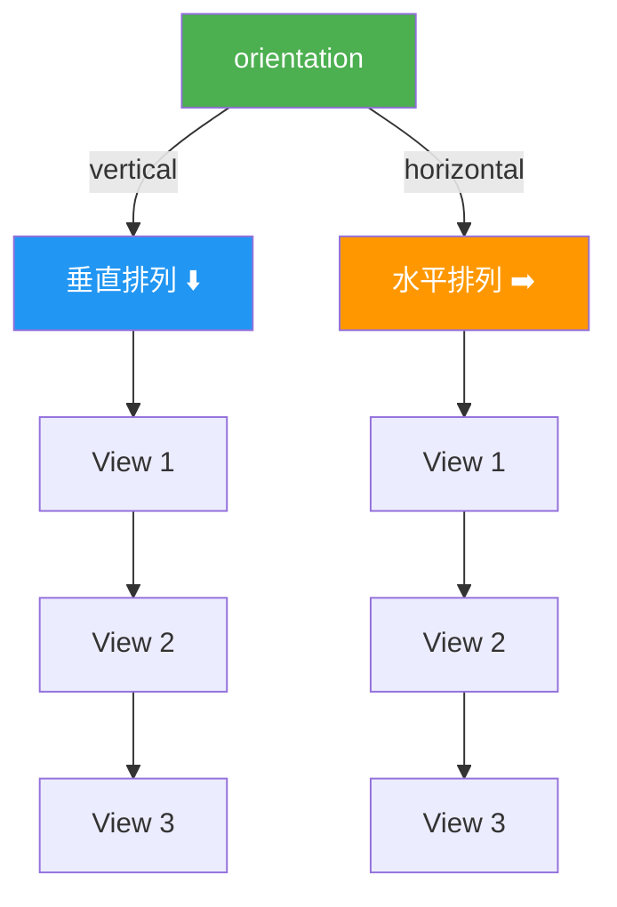
```mermaid
graph TD
    O[orientation] --> |"vertical"| V[垂直排列 ⬇️]
    O --> |"horizontal"| H[水平排列 ➡️]
    
    V --> V1[View 1]
    V1 --> V2[View 2]
    V2 --> V3[View 3]
    
    H --> H1[View 1]
    H1 --> H2[View 2]
    H2 --> H3[View 3]
    
    style O fill:#4CAF50,color:#fff
    style V fill:#2196F3,color:#fff
    style H fill:#FF9800,color:#fff
```

**术语解释：**
- **orientation（方向）**：LinearLayout 的核心属性，决定子 View 的排列方向。
  - `vertical`（垂直）：子 View 从上到下排列，就像一列纵队。第一个子 View 在最上面，最后一个在最下面。
  - `horizontal`（水平）：子 View 从左到右排列，就像一列横队。第一个子 View 在最左边，最后一个在最右边。
- **LinearLayout**：线性布局，"线性"意味着子 View 按照一条直线排列。它是最简单、最常用的布局容器，适合简单的列表、表单等场景。

**代码示例：**

```xml
<!-- 垂直线性布局（默认） -->
<!-- android:orientation="vertical" 可以省略，因为 vertical 是默认值 -->
<LinearLayout
    android:layout_width="match_parent"
    <!-- match_parent: 宽度填满父容器 -->
    
    android:layout_height="match_parent"
    <!-- match_parent: 高度填满父容器 -->
    
    android:orientation="vertical">
    <!-- vertical: 子 View 垂直排列 -->

    <TextView
        android:layout_width="wrap_content"
        <!-- wrap_content: 宽度由文字内容决定 -->
        
        android:layout_height="wrap_content"
        <!-- wrap_content: 高度由文字内容决定 -->
        
        android:text="第1行" />
        <!-- text: 显示的文字内容 -->

    <TextView
        android:layout_width="wrap_content"
        android:layout_height="wrap_content"
        android:text="第2行" />
</LinearLayout>
```

### 3.2 layout_weight 权重计算

`layout_weight` 是 LinearLayout 最强大的特性，用于按比例分配剩余空间：

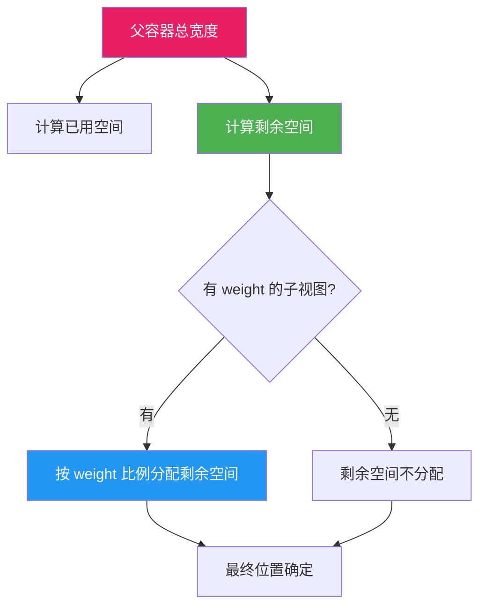
```mermaid
graph TD
    A[父容器总宽度] --> B[计算已用空间]
    A --> C[计算剩余空间]
    C --> D{有 weight 的子视图?}
    D -->|有| E[按 weight 比例分配剩余空间]
    D -->|无| F[剩余空间不分配]
    E --> G[最终位置确定]
    F --> G
    
    style A fill:#E91E63,color:#fff
    style C fill:#4CAF50,color:#fff
    style E fill:#2196F3,color:#fff
```

**术语解释：**
- **layout_weight（权重）**：LinearLayout 独有的属性，用于按比例分配父容器的剩余空间。权重值越大，分到的空间越多。类似于分蛋糕：如果有 3 个人，权重分别是 1、2、3，那么第一个人分到 1/6，第二个人分到 2/6，第三个人分到 3/6。
- **剩余空间（Remaining Space）**：父容器总空间减去所有子 View 基础大小后的剩余空间。比如父容器宽 300dp，3 个子 View 各占 0dp，那么剩余空间就是 300dp。

**权重计算公式：**

```
实际宽度 = layout_width + (layout_weight / 总权重) × 剩余空间
```

**代码示例：**

```xml
<LinearLayout
    android:layout_width="match_parent"
    <!-- 父容器宽度 = 屏幕宽度，假设 300dp -->
    
    android:layout_height="wrap_content"
    android:orientation="horizontal">
    <!-- horizontal: 子 View 水平排列 -->

    <!-- 按钮1：占据 1/4 宽度 -->
    <Button
        android:layout_width="0dp"
        <!-- ⚠️ 使用 weight 时，必须将 layout_width 设为 0dp -->
        <!-- 0dp 表示"宽度完全由 weight 决定" -->
        <!-- 如果设为 wrap_content，会先测量内容宽度，可能导致布局异常 -->
        
        android:layout_height="wrap_content"
        
        android:layout_weight="1"
        <!-- weight=1: 占总权重的 1 份 -->
        
        android:text="按钮1" />

    <!-- 按钮2：占据 3/4 宽度 -->
    <Button
        android:layout_width="0dp"
        android:layout_height="wrap_content"
        
        android:layout_weight="3"
        <!-- weight=3: 占总权重的 3 份 -->
        <!-- 总权重 = 1 + 3 = 4 -->
        <!-- 按钮1宽度 = 0 + (1/4) × 300 = 75dp -->
        <!-- 按钮2宽度 = 0 + (3/4) × 300 = 225dp -->
        
        android:text="按钮2" />
</LinearLayout>
```

### 3.3 layout_gravity vs gravity

这两个属性容易混淆，区别如下：

| 属性 | 作用对象 | 作用 | 示例 |
|------|---------|------|------|
| `gravity` | 父容器 | 控制所有子视图在容器内的对齐方式 | `android:gravity="center"` |
| `layout_gravity` | 子视图 | 控制单个视图在父容器中的对齐方式 | `android:layout_gravity="end"` |

**术语解释：**
- **gravity（重力/对齐）**：控制 View 的内容或子 View 的对齐方式。就像地球的引力把物体拉向地面一样，gravity 把内容"拉"到指定位置。
- **gravity（在父容器上设置）**：控制所有子 View 在父容器内的对齐方式。比如 `android:gravity="center"` 表示所有子 View 都居中显示。
- **layout_gravity（在子 View 上设置）**：控制单个子 View 在父容器中的对齐方式。比如 `android:layout_gravity="end"` 表示这个子 View 靠右对齐（在 RTL 布局中是靠左）。
- **start/end vs left/right**：`start` 对应 LTR（从左到右）语言的左边，RTL（从右到左，如阿拉伯语）语言的右边。`end` 相反。使用 start/end 可以自动适配不同语言的阅读方向。

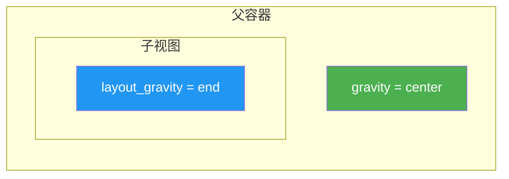
```mermaid
graph LR
    subgraph 父容器
        G[gravity = center]
        subgraph 子视图
            LG[layout_gravity = end]
        end
    end
    
    style G fill:#4CAF50,color:#fff
    style LG fill:#2196F3,color:#fff
```

**gravity 常用值：**

```plaintext
┌─────────────────────────────────────────┐
│           gravity 取值参考              │
├─────────────┬───────────────────────────┤
│ top         │ 顶部对齐                  │
│ bottom      │ 底部对齐                  │
│ start       │ 起始端（左/右）            │
│ end         │ 结束端（右/左）            │
│ center      │ 居中                     │
│ center_horizontal│ 水平居中             │
│ center_vertical  │ 垂直居中             │
│ fill        │ 填满                     │
└─────────────┴───────────────────────────┘
```

### 3.4 visibility 属性

控制视图的可见性：

| 值 | 含义 | 占据空间 |
|-----|------|---------|
| `visible` | 可见（默认） | 是 |
| `invisible` | 不可见 | 是（保留位置） |
| `gone` | 完全隐藏 | 否（移除占位） |

**术语解释：**
- **visible（可见）**：View 正常显示在屏幕上，用户可以看到和交互。这是默认状态。
- **invisible（不可见）**：View 不显示在屏幕上，但仍然占据原来的空间。就像用透明胶带把东西粘在墙上——你看不见它，但它还在那里挡着。周围的 View 不会因为它的隐藏而移动位置。
- **gone（消失）**：View 完全消失，不显示也不占据空间。就像把东西从墙上拿走了——周围的 View 会自动填补空出来的位置。

```xml
<TextView
    android:layout_width="wrap_content"
    android:layout_height="wrap_content"
    android:visibility="gone"
    <!-- gone: 这个 TextView 完全不占据空间 -->
    <!-- 如果改成 invisible，它还在原位，只是看不见 -->
    <!-- 如果改成 visible，它正常显示 -->
    android:text="隐藏的文本" />
```

---

## 4. 基础用法

### 完整示例：登录界面

```xml
<?xml version="1.0" encoding="utf-8"?>
<LinearLayout xmlns:android="http://schemas.android.com/apk/res/android"
    android:layout_width="match_parent"
    android:layout_height="match_parent"
    android:orientation="vertical"
    android:gravity="center_horizontal"
    android:padding="24dp">

    <!-- Logo 区域 -->
    <ImageView
        android:layout_width="80dp"
        android:layout_height="80dp"
        android:layout_marginTop="48dp"
        android:src="@drawable/ic_logo"
        android:contentDescription="应用图标" />

    <!-- 用户名输入框 -->
    <EditText
        android:layout_width="match_parent"
        android:layout_height="wrap_content"
        android:layout_marginTop="32dp"
        android:hint="请输入用户名"
        android:inputType="text" />

    <!-- 密码输入框 -->
    <EditText
        android:layout_width="match_parent"
        android:layout_height="wrap_content"
        android:layout_marginTop="16dp"
        android:hint="请输入密码"
        android:inputType="textPassword" />

    <!-- 登录按钮 -->
    <Button
        android:layout_width="match_parent"
        android:layout_height="wrap_content"
        android:layout_marginTop="24dp"
        android:text="登录" />

</LinearLayout>
```

### 嵌套实现水平+垂直组合

```xml
<LinearLayout
    android:layout_width="match_parent"
    android:layout_height="match_parent"
    android:orientation="vertical">

    <!-- 水平排列的按钮组 -->
    <LinearLayout
        android:layout_width="match_parent"
        android:layout_height="wrap_content"
        android:orientation="horizontal"
        android:gravity="center">

        <Button
            android:layout_width="wrap_content"
            android:layout_height="wrap_content"
            android:text="取消" />

        <Button
            android:layout_width="wrap_content"
            android:layout_height="wrap_content"
            android:text="确定" />
    </LinearLayout>

</LinearLayout>
```

---

## 5. 实战场景示例

### 场景1：等分屏幕

```xml
<!-- 三等分高度 -->
<LinearLayout
    android:layout_width="match_parent"
    android:layout_height="match_parent"
    android:orientation="vertical">

    <View
        android:layout_width="match_parent"
        android:layout_height="0dp"
        android:layout_weight="1"
        android:background="#F44336" />

    <View
        android:layout_width="match_parent"
        android:layout_height="0dp"
        android:layout_weight="1"
        android:background="#4CAF50" />

    <View
        android:layout_width="match_parent"
        android:layout_height="0dp"
        android:layout_weight="1"
        android:background="#2196F3" />
</LinearLayout>
```

### 场景2：带权重的按钮组

```xml
<!-- 底部操作栏：取消占1/3，确定占2/3 -->
<LinearLayout
    android:layout_width="match_parent"
    android:layout_height="56dp"
    android:orientation="horizontal">

    <Button
        android:layout_width="0dp"
        android:layout_height="match_parent"
        android:layout_weight="1"
        android:text="取消" />

    <Button
        android:layout_width="0dp"
        android:layout_height="match_parent"
        android:layout_weight="2"
        android:text="确定" />
</LinearLayout>
```

### 场景3：表单布局

```xml
<LinearLayout
    android:layout_width="match_parent"
    android:layout_height="wrap_content"
    android:orientation="vertical"
    android:padding="16dp">

    <!-- 每一行：标签 + 输入框 水平排列 -->
    <LinearLayout
        android:layout_width="match_parent"
        android:layout_height="wrap_content"
        android:orientation="horizontal"
        android:gravity="center_vertical"
        android:layout_marginBottom="12dp">

        <TextView
            android:layout_width="80dp"
            android:layout_height="wrap_content"
            android:text="用户名：" />

        <EditText
            android:layout_width="0dp"
            android:layout_height="wrap_content"
            android:layout_weight="1"
            android:hint="请输入" />
    </LinearLayout>

    <LinearLayout
        android:layout_width="match_parent"
        android:layout_height="wrap_content"
        android:orientation="horizontal"
        android:gravity="center_vertical">

        <TextView
            android:layout_width="80dp"
            android:layout_height="wrap_content"
            android:text="密码：" />

        <EditText
            android:layout_width="0dp"
            android:layout_height="wrap_content"
            android:layout_weight="1"
            android:hint="请输入"
            android:inputType="textPassword" />
    </LinearLayout>
</LinearLayout>
```

---

## 6. 常见错误与避坑

### 错误信息速查表

| 错误信息 | 原因 | 解决方案 |
|---------|------|---------|
| `Layout_weight ignored` | 同时使用 `layout_width="wrap_content"` 和 `weight` | 将宽度设为 `0dp` |
| 视图显示不全 | 嵌套 LinearLayout 权重冲突 | 使用 ConstraintLayout 替代 |
| `StackOverflowError` | 过多嵌套层级 | 减少嵌套，扁平化布局 |

### Before/After 对比

```xml
<!-- ❌ Bad: layout_weight 使用错误 -->
<LinearLayout
    android:layout_width="match_parent"
    android:layout_height="wrap_content">

    <Button
        android:layout_width="wrap_content"  <!-- 错误！ -->
        android:layout_height="wrap_content"
        android:layout_weight="1"
        android:text="按钮" />
</LinearLayout>

<!-- ✅ Good: 正确使用 layout_weight -->
<LinearLayout
    android:layout_width="match_parent"
    android:layout_height="wrap_content">

    <Button
        android:layout_width="0dp"  <!-- 正确：宽度设为0dp -->
        android:layout_height="wrap_content"
        android:layout_weight="1"
        android:text="按钮" />
</LinearLayout>
```

### 嵌套性能问题

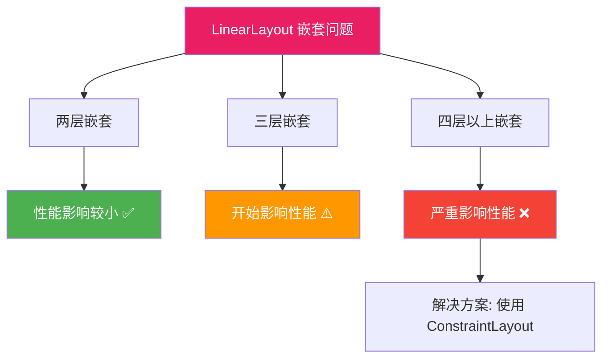
```mermaid
graph TD
    A[LinearLayout 嵌套问题] --> B[两层嵌套]
    A --> C[三层嵌套]
    A --> D[四层以上嵌套]
    
    B --> B1[性能影响较小 ✅]
    C --> C1[开始影响性能 ⚠️]
    D --> D1[严重影响性能 ❌]
    
    D1 --> E[解决方案: 使用 ConstraintLayout]
    
    style A fill:#E91E63,color:#fff
    style B1 fill:#4CAF50,color:#fff
    style C1 fill:#FF9800,color:#fff
    style D1 fill:#F44336,color:#fff
```

---

## 7. 优势与局限

| 优势 | 局限 |
|------|------|
| 简单易学，上手快 | 嵌套层级多时性能下降 |
| 权重分配灵活 | 复杂布局实现困难 |
| 适合简单线性排列 | 无法实现相对定位 |
| XML 结构清晰 | 多层嵌套时调试困难 |

---

## 8. 进阶技巧

### 8.1 divider 分隔线

```xml
<LinearLayout
    android:layout_width="match_parent"
    android:layout_height="wrap_content"
    android:orientation="vertical"
    android:divider="@drawable/divider"
    android:showDividers="middle|beginning|end">

    <TextView
        android:layout_width="match_parent"
        android:layout_height="wrap_content"
        android:text="项目1" />

    <TextView
        android:layout_width="match_parent"
        android:layout_height="wrap_content"
        android:text="项目2" />
</LinearLayout>
```

### 8.2 weightSum 限制总权重

```xml
<LinearLayout
    android:layout_width="match_parent"
    android:layout_height="wrap_content"
    android:orientation="horizontal"
    android:weightSum="10">

    <Button
        android:layout_width="0dp"
        android:layout_height="wrap_content"
        android:layout_weight="3"
        android:text="30%" />

    <Button
        android:layout_width="0dp"
        android:layout_height="wrap_content"
        android:layout_weight="7"
        android:text="70%" />
</LinearLayout>
```

---

## 9. 面试高频考点

### Q1：layout_weight 的计算原理是什么？

**答：**

1. 第一轮测量：先测量所有子视图的基础大小（不含 weight 分配）
2. 计算剩余空间：`剩余空间 = 父容器大小 - 所有子视图基础大小之和`
3. 第二轮测量：按 weight 比例分配剩余空间

```plaintext
示例：父容器宽度 300dp
  子视图A: layout_width=0dp, weight=1
  子视图B: layout_width=0dp, weight=2

计算：
  剩余空间 = 300 - 0 = 300dp
  A 获得 = 300 × (1/3) = 100dp
  B 获得 = 300 × (2/3) = 200dp
```

**术语解释：**
- **第一轮测量（First Pass）**：LinearLayout 先不考虑 weight，测量所有子 View 的基础大小。如果 layout_width=0dp，基础大小就是 0；如果 layout_width=100dp，基础大小就是 100dp。
- **第二轮测量（Second Pass）**：在第一轮的基础上，计算剩余空间，然后按 weight 比例分配给有 weight 的子 View。
- **为什么要两轮？** 因为 weight 需要知道"还剩多少空间"才能按比例分配。如果不先测量所有子 View 的基础大小，就无法计算剩余空间。

### Q2：gravity 和 layout_gravity 的区别？

**答：**

| 属性 | 影响对象 | 使用位置 |
|------|---------|---------|
| `gravity` | 所有子视图 | 在父容器中设置 |
| `layout_gravity` | 当前视图 | 在子视图中设置 |

**记忆技巧：** `gravity` 没有 `layout_` 前缀，所以在"上层"（父容器）设置；`layout_gravity` 有 `layout_` 前缀，所以在"下层"（子 View）设置。

### Q3：为什么 weight 要配合 0dp 使用？

**答：**

当 `layout_width="wrap_content"` 时，View 会先测量内容宽度，weight 分配的额外空间可能为负值，导致显示异常。使用 `0dp` 表示"完全由 weight 决定宽度"。

**术语解释：**
- **负值空间**：如果子 View 用 wrap_content 测量后已经占了 200dp，而父容器只有 300dp，剩余空间只有 100dp。如果 weight 很大，按比例计算出的空间可能超过剩余空间，导致布局混乱。0dp 确保子 View 的基础大小为 0，所有空间都由 weight 分配。

---

## 10. 小结与下一步

### 核心要点回顾

| 概念 | 关键点 |
|------|--------|
| orientation | `vertical` 垂直 / `horizontal` 水平 |
| layout_weight | 配合 `0dp` 使用，按比例分配空间 |
| gravity | 控制子视图在容器内的对齐 |
| layout_gravity | 控制单个视图在父容器中的对齐 |
| visibility | `gone` 不占位，`invisible` 占位 |

### 下一步学习

```
LinearLayout（本文）
    ↓
├─→ 02-RelativeLayout（相对定位）
├─→ ConstraintLayout（推荐替代方案）
├─→ RecyclerView（列表展示）
└─→ 进阶：自定义 LayoutManager
```

---

## 📚 术语表

| 术语 | 英文 | 说明 |
|------|------|------|
| 权重 | Weight | 按比例分配剩余空间的机制 |
| 对齐 | Gravity | 控制视图在容器中的位置 |
| 分隔线 | Divider | 子视图之间的分割线 |

---

## 📝 课后练习

1. 使用 LinearLayout 实现一个等分三列的布局
2. 实现一个带权重的底部导航栏（4个等宽按钮）
3. 使用 divider 属性为列表添加分隔线

---

## ✅ 自测题

1. 如何让三个按钮水平等分屏幕宽度？
2. `gone` 和 `invisible` 的区别是什么？
3. 为什么 weight 要配合 `0dp` 使用？

---

## 🎯 常见学生错误

| 错误 | 正确做法 |
|------|---------|
| weight 配合 wrap_content | 使用 `0dp` |
| 混淆 gravity 和 layout_gravity | 查看上方对比表 |
| 过度嵌套 LinearLayout | 使用 ConstraintLayout |

---

## 💡 教学提示

> 建议先演示 weight 计算过程（手动计算），再让学生修改权重值观察效果变化。

---

## 🎬 渲染逻辑详解

### LinearLayout 的测量机制

LinearLayout 的测量过程与 weight 属性密切相关：

```plaintext
情况1：没有 weight
  → 父容器一次性测量所有子 View（1 轮）

情况2：有 weight
  → 第一轮：测量所有子 View 的基础大小（不含 weight 分配）
  → 计算剩余空间
  → 第二轮：按 weight 比例分配剩余空间（2 轮）
```

**weight 计算的底层流程：**

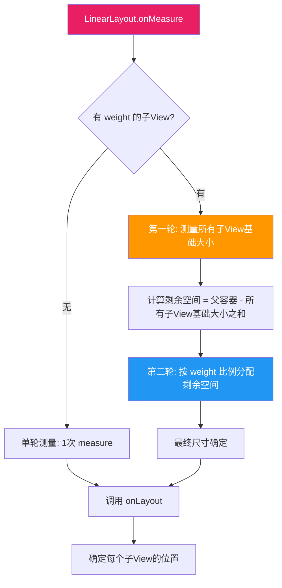
```mermaid
graph TD
    A[LinearLayout.onMeasure] --> B{有 weight 的子View?}
    B -->|无| C[单轮测量: 1次 measure]
    B -->|有| D[第一轮: 测量所有子View基础大小]
    D --> E[计算剩余空间 = 父容器 - 所有子View基础大小之和]
    E --> F[第二轮: 按 weight 比例分配剩余空间]
    F --> G[最终尺寸确定]
    C --> H[调用 onLayout]
    G --> H
    H --> I[确定每个子View的位置]
    
    style A fill:#E91E63,color:#fff
    style D fill:#FF9800,color:#fff
    style F fill:#2196F3,color:#fff
```

**layout 阶段的位置计算：**

```plaintext
vertical LinearLayout：
  y = 0
  for each child:
    child.layout(left=0, top=y, right=parentWidth, bottom=y+childHeight)
    y += childHeight + margin

horizontal LinearLayout：
  x = 0
  for each child:
    child.layout(left=x, top=0, right=x+childWidth, bottom=parentHeight)
    x += childWidth + margin
```

### 与 View Tree 渲染管线的关系

```plaintext
setContentView(R.layout.activity_main)
  ↓
LinearLayout.onMeasure()          ← 测量阶段：决定每个子View多大
  ├─ TextView.onMeasure()         ← 文字测量：根据文字内容计算
  ├─ EditText.onMeasure()         ← 输入框测量：根据hint/内容
  └─ Button.onMeasure()           ← 按钮测量：根据文字+padding
  ↓
LinearLayout.onLayout()           ← 布局阶段：决定每个子View在哪
  ├─ TextView.layout(0,0,360,48)
  ├─ EditText.layout(0,64,360,112)
  └─ Button.layout(0,128,360,176)
  ↓
LinearLayout.dispatchDraw()       ← 绘制阶段：递归绘制子View
  ├─ TextView.draw(canvas)        ← 绘制文字
  ├─ EditText.draw(canvas)        ← 绘制输入框
  └─ Button.draw(canvas)          ← 绘制按钮
```

---

## 🔗 知识依赖图

### 与前后章节的关系

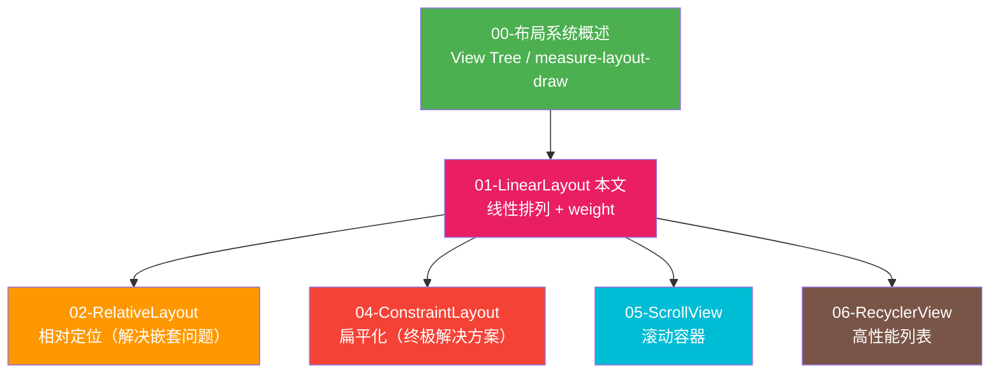
```mermaid
graph TD
    A["00-布局系统概述<br/>View Tree / measure-layout-draw"] --> B["01-LinearLayout 本文<br/>线性排列 + weight"]
    B --> C["02-RelativeLayout<br/>相对定位（解决嵌套问题）"]
    B --> D["04-ConstraintLayout<br/>扁平化（终极解决方案）"]
    B --> E["05-ScrollView<br/>滚动容器"]
    B --> F["06-RecyclerView<br/>高性能列表"]
    
    style A fill:#4CAF50,color:#fff
    style B fill:#E91E63,color:#fff
    style C fill:#FF9800,color:#fff
    style D fill:#F44336,color:#fff
    style E fill:#00BCD4,color:#fff
    style F fill:#795548,color:#fff
```

### 核心知识点的章节串联

| 知识点 | 本章内容 | 关联章节 | 关联说明 |
|--------|---------|---------|---------|
| **measure** | LinearLayout 1-2轮测量 | 00-概述 | 00 章介绍 measure 概念，01 章具体实现 |
| **weight** | 按比例分配剩余空间 | 04-ConstraintLayout | ConstraintLayout 的 Chain 替代 weight |
| **gravity** | 控制子View对齐 | 02-RelativeLayout | RelativeLayout 用 alignParentXxx 替代 |
| **嵌套问题** | 嵌套 >3 层性能差 | 07-布局优化 | 07 章专门讲解如何优化嵌套 |
| **visibility** | gone/invisible/visible | 04-ConstraintLayout | ConstraintLayout 的 Group 统一控制 |
| **简单线性排列** | 本章核心场景 | 09-Compose | Compose 中用 Column/Row 替代 |

### 组件关系图

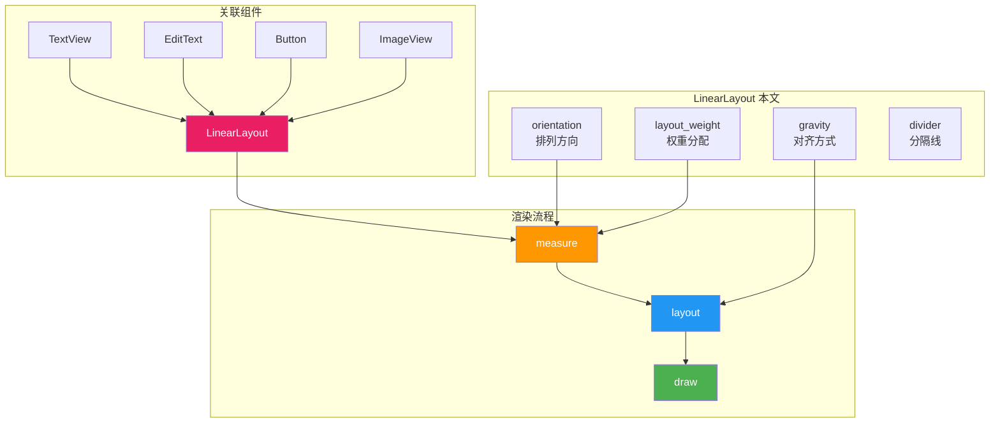
```mermaid
graph TB
    subgraph LinearLayout 本文
        orientation["orientation<br/>排列方向"]
        weight["layout_weight<br/>权重分配"]
        gravity["gravity<br/>对齐方式"]
        divider["divider<br/>分隔线"]
    end
    
    subgraph 关联组件
        TV[TextView] --> LL[LinearLayout]
        ET[EditText] --> LL
        BT[Button] --> LL
        IV[ImageView] --> LL
    end
    
    subgraph 渲染流程
        M[measure] --> L[layout]
        L --> D[draw]
    end
    
    LL --> M
    orientation --> M
    weight --> M
    gravity --> L
    
    style LL fill:#E91E63,color:#fff
    style M fill:#FF9800,color:#fff
    style L fill:#2196F3,color:#fff
    style D fill:#4CAF50,color:#fff
```

---

## 🛠 实战项目建议

**项目：** 计算器界面
- 使用水平和垂直 LinearLayout 嵌套
- 实现数字按钮网格（4×4）
- 练习 weight 属性

---

## ✅ 代码审查清单

- [ ] weight 是否配合 `0dp` 使用
- [ ] 嵌套层级是否超过 3 层
- [ ] gravity 和 layout_gravity 是否正确使用
- [ ] 是否考虑了 visibility 状态
- [ ] 布局是否适配不同屏幕尺寸

---

## 🔬 测量算法底层深度解析

> 本章节深入 LinearLayout 测量过程的底层实现，从 MeasureSpec 的二进制编码到 onMeasure 的源码级流程，帮助你理解"一行代码背后的运行机制"。

### 11.1 MeasureSpec 的二进制编码原理

**术语解释：**

- **MeasureSpec（测量规格）**：Android 系统用来描述"一个 View 应该多大"的核心数据结构。它不是普通的数字，而是一个被精心编码的 32 位整数，同时包含了"测量模式"和"建议尺寸"两部分信息。可以类比为快递包裹上的"标签"——标签上既写了包裹类型（易碎品/普通件），又写了尺寸（30×20×15cm）。
- **位编码（Bit Encoding）**：用二进制位的不同区域存储不同信息的技术。就像一个邮编可以同时编码"省份+城市+区域"一样，MeasureSpec 用一个 int 值编码了"模式+尺寸"。

Android 将一个 32 位 int 拆成两部分：高 2 位存储测量模式（mode），低 30 位存储建议尺寸（size）。

```plaintext
高 2 位 ────────────── 低 30 位
┌──────┬─────────────────────────────────┐
│ mode │             size                │
│ (2位) │            (30位)               │
└──────┴─────────────────────────────────┘
 bit31  bit30  bit29                     bit0
```

用 Mermaid 展示位布局：

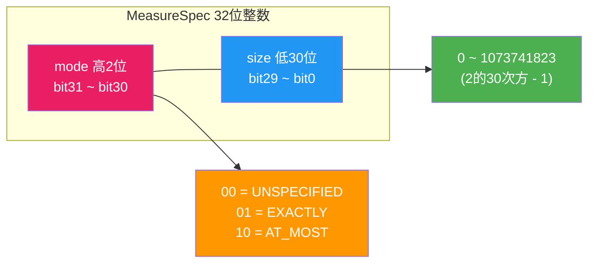
```mermaid
graph LR
    subgraph MeasureSpec 32位整数
        direction LR
        M["mode 高2位<br/>bit31 ~ bit30"]
        S["size 低30位<br/>bit29 ~ bit0"]
        M --- S
    end

    M --> M1["00 = UNSPECIFIED<br/>01 = EXACTLY<br/>10 = AT_MOST"]
    S --> S1["0 ~ 1073741823<br/>(2的30次方 - 1)"]

    style M fill:#E91E63,color:#fff
    style S fill:#2196F3,color:#fff
    style M1 fill:#FF9800,color:#fff
    style S1 fill:#4CAF50,color:#fff
```

**三种模式及其位掩码值：**

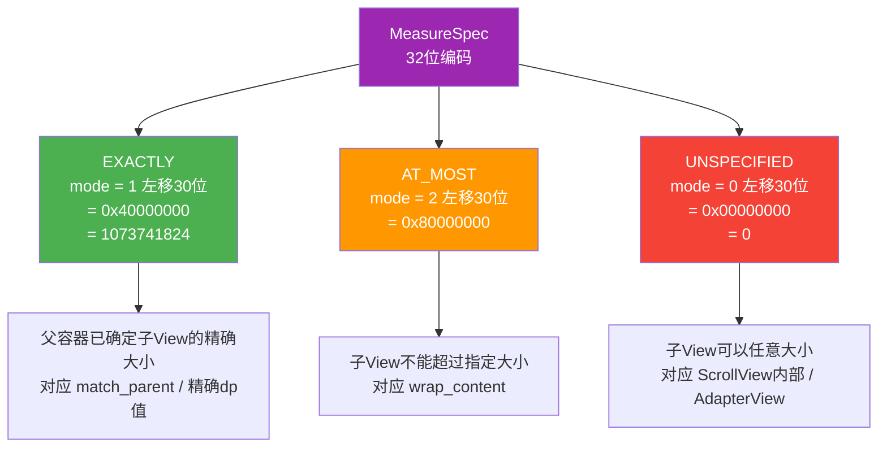
```mermaid
graph TD
    MS["MeasureSpec<br/>32位编码"] --> EX["EXACTLY<br/>mode = 1 左移30位<br/>= 0x40000000<br/>= 1073741824"]
    MS --> AM["AT_MOST<br/>mode = 2 左移30位<br/>= 0x80000000"]
    MS --> UN["UNSPECIFIED<br/>mode = 0 左移30位<br/>= 0x00000000<br/>= 0"]

    EX --> EX_D["父容器已确定子View的精确大小<br/>对应 match_parent / 精确dp值"]
    AM --> AM_D["子View不能超过指定大小<br/>对应 wrap_content"]
    UN --> UN_D["子View可以任意大小<br/>对应 ScrollView内部 / AdapterView"]

    style MS fill:#9C27B0,color:#fff
    style EX fill:#4CAF50,color:#fff
    style AM fill:#FF9800,color:#fff
    style UN fill:#F44336,color:#fff
```

**位运算提取方法：**

```java
// MODE_SHIFT = 30
// MODE_MASK  = 0x3 左移 30位 = 0xC0000000

// 从 MeasureSpec 中提取 mode（与运算：只保留高2位）
int mode = measureSpec & (0x3 << 30);

// 从 MeasureSpec 中提取 size（与运算：清零高2位，保留低30位）
int size = measureSpec & ~(0x3 << 30);

// 组合新的 MeasureSpec（或运算：拼接 mode 和 size）
int newSpec = (mode << 30) | size;
```

**术语解释：**

- **EXACTLY（精确模式）**：父容器已经为子 View 决定了确切大小。当你在 XML 中写 `layout_width="100dp"` 或 `match_parent` 时，子 View 会收到 EXACTLY 模式的 MeasureSpec。类比：父母说"你穿42码的鞋"，你就穿42码，不用商量。
- **AT_MOST（至多模式）**：子 View 可以是任意大小，但不能超过父容器指定的上限。当写 `wrap_content` 时生效。类比：父母说"鞋子不超过500元，你自己挑"，你可以挑300元的，也可以挑499元的。
- **UNSPECIFIED（无限制模式）**：子 View 想要多大就多大，没有任何限制。通常出现在 ScrollView、RecyclerView 等滚动容器内部。类比：父母说"你想买什么鞋都行"，连价格上限都没有。
- **位掩码（Bit Mask）**：一个二进制数，通过与运算"提取"或"屏蔽"特定位。就像用镂空模板盖在纸上涂色，只有镂空的位置能涂到颜色，其余被遮住。MODE_MASK 的作用就是"只露出高 2 位"。

---

### 11.2 LinearLayout.onMeasure() 源码级流程

**术语解释：**

- **onMeasure()（测量方法）**：每个 View 都有这个方法，作用是"确定自己有多大"。LinearLayout 重写了这个方法，在测量自己的大小之前，必须先测量所有子 View 的大小。就像你装修房子前要先量好每个房间的尺寸。
- **measureHorizontal / measureVertical（水平/垂直测量）**：LinearLayout 根据 orientation 选择不同的测量分支。水平排列时沿 X 轴测量，垂直排列时沿 Y 轴测量。两者逻辑相似但方向不同。
- **measureChildBeforeLayout()（测量单个子View）**：LinearLayout 在遍历子 View 时调用的核心方法，内部会根据子 View 的 LayoutParams 构造合适的 MeasureSpec，再调用 child.measure() 触发子 View 的测量。
- **setMeasuredDimension()（保存测量结果）**：测量完成后调用此方法，将最终的宽高保存到 mMeasuredWidth 和 mMeasuredHeight 中，标志着"我已经知道自己多大了"。

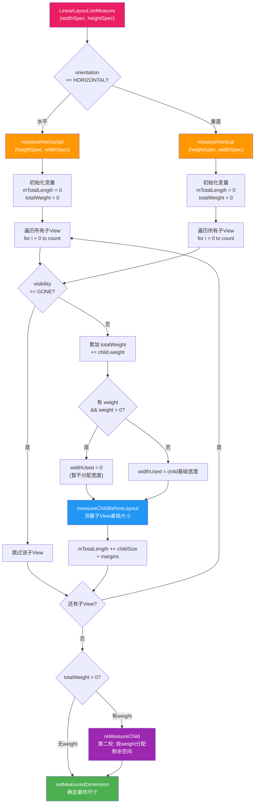
```mermaid
flowchart TD
    Start["LinearLayout.onMeasure<br/>(widthSpec, heightSpec)"] --> CheckOri{"orientation<br/>== HORIZONTAL?"}

    CheckOri -->|水平| MH["measureHorizontal<br/>(heightSpec, widthSpec)"]
    CheckOri -->|垂直| MV["measureVertical<br/>(heightSpec, widthSpec)"]

    MH --> Init1["初始化变量<br/>mTotalLength = 0<br/>totalWeight = 0"]
    MV --> Init2["初始化变量<br/>mTotalLength = 0<br/>totalWeight = 0"]

    Init1 --> Loop1["遍历所有子View<br/>for i = 0 to count"]
    Init2 --> Loop2["遍历所有子View<br/>for i = 0 to count"]

    Loop1 --> CheckSkip{"visibility<br/>== GONE?"}
    Loop2 --> CheckSkip

    CheckSkip -->|是| Next1["跳过该子View"]
    CheckSkip -->|否| AccW["累加 totalWeight<br/>+= child.weight"]

    AccW --> CheckUseW{"有 weight<br/>&& weight > 0?"}
    CheckUseW -->|是| Zero1["widthUsed = 0<br/>(暂不分配宽度)"]
    CheckUseW -->|否| FullW["widthUsed = child基础宽度"]

    Zero1 --> MCB["measureChildBeforeLayout<br/>测量子View基础大小"]
    FullW --> MCB

    MCB --> AddLen["mTotalLength += childSize<br/>+ margins"]
    Next1 --> LoopEnd1{"还有子View?"}
    AddLen --> LoopEnd1

    LoopEnd1 -->|是| Loop1
    LoopEnd1 -->|否| CheckWeight2{"totalWeight > 0?"}

    CheckWeight2 -->|有weight| ReMeasure["reMeasureChild<br/>第二轮: 按weight分配<br/>剩余空间"]
    CheckWeight2 -->|无weight| SetDim["setMeasuredDimension<br/>确定最终尺寸"]

    ReMeasure --> SetDim

    style Start fill:#E91E63,color:#fff
    style MH fill:#FF9800,color:#fff
    style MV fill:#FF9800,color:#fff
    style MCB fill:#2196F3,color:#fff
    style ReMeasure fill:#9C27B0,color:#fff
    style SetDim fill:#4CAF50,color:#fff
```

**关键源码结构（简化版）：**

```java
// LinearLayout.java 核心逻辑
@Override
protected void onMeasure(int widthMeasureSpec, int heightMeasureSpec) {
    if (mOrientation == VERTICAL) {
        measureVertical(widthMeasureSpec, heightMeasureSpec);
    } else {
        measureHorizontal(widthMeasureSpec, heightMeasureSpec);
    }
}

void measureVertical(int widthSpec, int heightSpec) {
    mTotalLength = 0;        // 子View总高度累加器
    float totalWeight = 0;   // 总权重累加器

    // ========== 第一轮：测量所有子View的基础大小 ==========
    for (int i = 0; i < count; i++) {
        View child = getChildAt(i);
        totalWeight += child.getLayoutParams().weight;

        if (hasWeight && child.weight > 0) {
            // 有weight的子View，先用0大小测量
            measureChildBeforeLayout(child, i, widthSpec, 0,
                                     heightSpec, totalWeight == 0 ? 0 : mTotalLength);
        } else {
            // 无weight的子View，正常测量
            measureChildBeforeLayout(child, i, widthSpec, 0,
                                     heightSpec, mTotalLength);
        }
        mTotalLength += child.getMeasuredHeight() + margins;
    }

    // ========== 计算剩余空间 ==========
    int heightSize = MeasureSpec.getSize(heightSpec);
    int remaining = heightSize - mTotalLength;  // 剩余空间

    // ========== 第二轮：按weight分配剩余空间 ==========
    if (totalWeight > 0 && remaining != 0) {
        for (int i = 0; i < count; i++) {
            View child = getChildAt(i);
            float weight = child.getLayoutParams().weight;
            if (weight > 0) {
                // 按weight比例分配
                int share = (int)(remaining * (weight / totalWeight));
                reMeasureChild(child, ..., mTotalLength + share);
            }
        }
    }

    setMeasuredDimension(widthSize, heightSize);
}
```

---

### 11.3 weight 计算的数学推导

**术语解释：**

- **基础大小（Base Size）**：子 View 在不考虑 weight 时的尺寸。当 `layout_width="0dp"` 时基础大小为 0；当 `layout_width="100dp"` 时基础大小为 100dp。类比：分蛋糕前每个人先拿到的"基础份"。
- **剩余空间（Remaining Space）**：父容器总空间减去所有子 View 基础大小之和的差值。这是 weight 机制能够分配的"蛋糕剩余部分"。
- **权重比例（Weight Ratio）**：单个子 View 的 weight 值除以所有子 View 的 weight 总和，得到该子 View 应分得的剩余空间比例。

**完整数学推导：**

设父容器总宽度为 `W`，有 `n` 个子 View，第 `i` 个子 View 的基础大小为 `b_i`，权重为 `w_i`。

**步骤1：计算基础大小总和**

```
B = b_1 + b_2 + ... + b_n
```

**步骤2：计算剩余空间**

```
R = W - B
```

**步骤3：计算总权重**

```
W_total = w_1 + w_2 + ... + w_n
```

**步骤4：计算每个子 View 的最终大小**

```
f_i = b_i + (w_i / W_total) * R
```

**具体数值举例：**

假设父容器宽度 `W = 300dp`，3 个子 View 水平排列：

| 子View | layout_width | weight | 基础大小 b_i | weight占比 |
|--------|-------------|--------|------------|-----------|
| A | 0dp | 1 | 0 | 1/6 |
| B | 0dp | 2 | 0 | 2/6 |
| C | 50dp | 3 | 50 | 3/6 |

**计算过程：**

```plaintext
步骤1: B = 0 + 0 + 50 = 50dp  (基础大小总和)

步骤2: R = 300 - 50 = 250dp    (剩余空间)

步骤3: W_total = 1 + 2 + 3 = 6  (总权重)

步骤4:
  A 最终宽度 = 0 + (1/6) * 250 = 41.67dp 约等于 42dp
  B 最终宽度 = 0 + (2/6) * 250 = 83.33dp 约等于 83dp
  C 最终宽度 = 50 + (3/6) * 250 = 50 + 125 = 175dp

  验证: 42 + 83 + 175 = 300dp  正确
```

**Mermaid 可视化：**

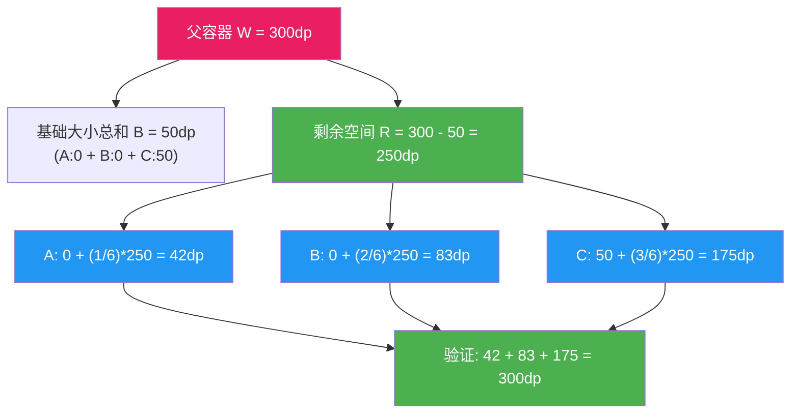
```mermaid
graph TD
    W["父容器 W = 300dp"] --> B["基础大小总和 B = 50dp<br/>(A:0 + B:0 + C:50)"]
    W --> R["剩余空间 R = 300 - 50 = 250dp"]

    R --> A["A: 0 + (1/6)*250 = 42dp"]
    R --> Bf["B: 0 + (2/6)*250 = 83dp"]
    R --> C["C: 50 + (3/6)*250 = 175dp"]

    A --> V["验证: 42 + 83 + 175 = 300dp"]
    Bf --> V
    C --> V

    style W fill:#E91E63,color:#fff
    style R fill:#4CAF50,color:#fff
    style A fill:#2196F3,color:#fff
    style Bf fill:#2196F3,color:#fff
    style C fill:#2196F3,color:#fff
    style V fill:#4CAF50,color:#fff
```

---

### 11.4 两轮测量的性能开销分析

**术语解释：**

- **measureChildBeforeLayout()（第一轮测量）**：LinearLayout 遍历所有子 View，调用每个子 View 的 measure() 方法，获取基础大小。这一轮对每个子 View 调用一次。
- **reMeasureChild()（第二轮测量）**：只对有 weight 的子 View 再次调用 measure()，传入分配后的新尺寸。这一轮的调用次数等于有 weight 的子 View 数量。
- **递归调用栈（Call Stack）**：当子 View 本身也是 ViewGroup（如嵌套的 LinearLayout）时，measure 会递归调用子 ViewGroup 的 onMeasure，子 ViewGroup 又会测量它自己的子 View，形成递归调用链。嵌套越深，递归调用栈越长。类比：老板问部门经理"你们部门要多少预算"，经理问组长，组长问员工，层层汇报。

**调用次数分析：**

假设 LinearLayout 有 `n` 个子 View，其中 `k` 个有 weight：

```plaintext
无weight情况 (k=0):
  总measure调用次数 = n （每个子View测量1次）

有weight情况 (k>0):
  第一轮 = n 次 （所有子View各测1次）
  第二轮 = k 次 （仅有weight的子View再测1次）
  总measure调用次数 = n + k

  最坏情况（所有子View都有weight）: n + n = 2n 次
```

**嵌套场景的指数级增长：**

假设有 3 层嵌套，每层 LinearLayout 有 4 个子 View，全部使用 weight：

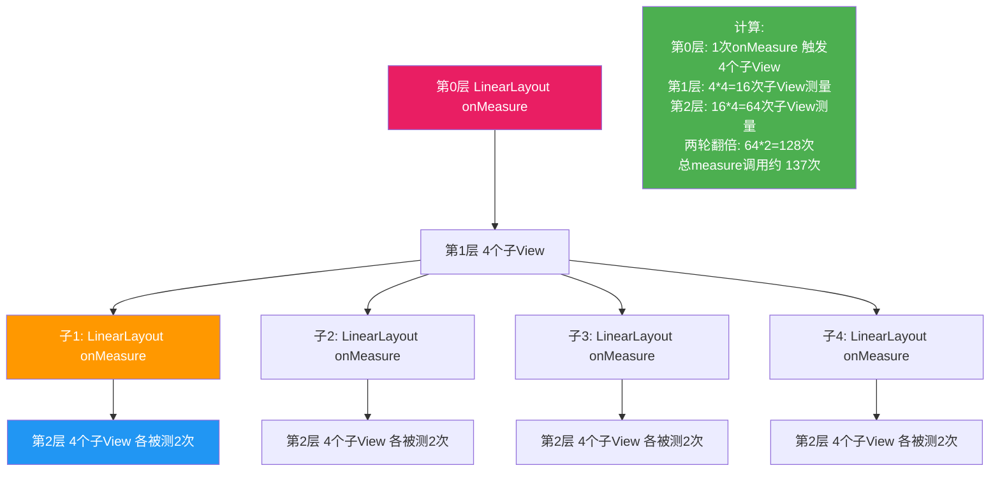
```mermaid
flowchart TD
    L0["第0层 LinearLayout onMeasure"] --> P1["第1层 4个子View"]

    P1 --> L1A["子1: LinearLayout onMeasure"]
    P1 --> L1B["子2: LinearLayout onMeasure"]
    P1 --> L1C["子3: LinearLayout onMeasure"]
    P1 --> L1D["子4: LinearLayout onMeasure"]

    L1A --> P2A["第2层 4个子View 各被测2次"]
    L1B --> P2B["第2层 4个子View 各被测2次"]
    L1C --> P2C["第2层 4个子View 各被测2次"]
    L1D --> P2D["第2层 4个子View 各被测2次"]

    Calc["计算:<br/>第0层: 1次onMeasure 触发4个子View<br/>第1层: 4*4=16次子View测量<br/>第2层: 16*4=64次子View测量<br/>两轮翻倍: 64*2=128次<br/>总measure调用约 137次"]

    style L0 fill:#E91E63,color:#fff
    style L1A fill:#FF9800,color:#fff
    style P2A fill:#2196F3,color:#fff
    style Calc fill:#4CAF50,color:#fff
```

**性能对比表：**

| 嵌套层级 | 子View数/层 | 总measure次数(无weight) | 总measure次数(全weight) |
|---------|-----------|----------------------|----------------------|
| 1层 | 4 | 4 | 8 |
| 2层 | 4 | 4+16=20 | 8+32=40 |
| 3层 | 4 | 20+64=84 | 40+128=168 |
| 4层 | 4 | 84+256=340 | 168+512=680 |

**结论：** 嵌套层级每增加一层，measure 调用次数约增长 4 倍；使用 weight 会使调用次数翻倍。这就是"嵌套超过 3 层性能急剧下降"的根本原因。

---

### 11.5 gravity 在 layout 阶段的数学计算

**术语解释：**

- **layout 阶段（Layout Phase）**：测量阶段确定每个 View "有多大"后，layout 阶段确定每个 View "在哪里"。通过设置 left/top/right/bottom 四个坐标值来确定 View 的位置和大小。类比：测量是"量尺寸"，layout 是"摆位置"。
- **gravity（在 layout 中的作用）**：当 LinearLayout 的总尺寸大于子 View 尺寸总和时，gravity 决定多余空间如何分配。比如垂直布局中，如果所有子 View 总高 200dp，而 LinearLayout 高 500dp，剩余 300dp 如何分配由 gravity 决定。
- **mGravity（合并重力值）**：LinearLayout 内部用一个 int 值同时存储水平和垂直两个方向的 gravity，通过位运算拆分。高位存垂直方向，低位存水平方向。

**垂直布局中 gravity 的坐标计算：**

假设 LinearLayout 宽 `W_parent`，高 `H_parent`，子 View 宽 `w_child`，高 `h_child`：

```plaintext
vertical LinearLayout 默认 (gravity=top):
  childLeft = paddingLeft
  childTop  = 当前已排列高度 + paddingTop
  childRight  = childLeft + w_child
  childBottom = childTop + h_child

gravity=center_vertical 时:
  剩余空间 = H_parent - 所有子View总高度
  每个子View的偏移 = 剩余空间 / 2
  childTop = 当前已排列高度 + paddingTop + 偏移量

gravity=bottom 时:
  childTop = H_parent - 所有子View总高度 + paddingTop

gravity=center 时 (水平+垂直同时居中):
  水平偏移 = (W_parent - w_child) / 2
  垂直偏移 = (H_parent - 所有子View总高度) / 2
  childLeft = paddingLeft + 水平偏移
  childTop  = 当前已排列高度 + paddingTop + 垂直偏移
```

**Mermaid 可视化 gravity 的位置计算：**

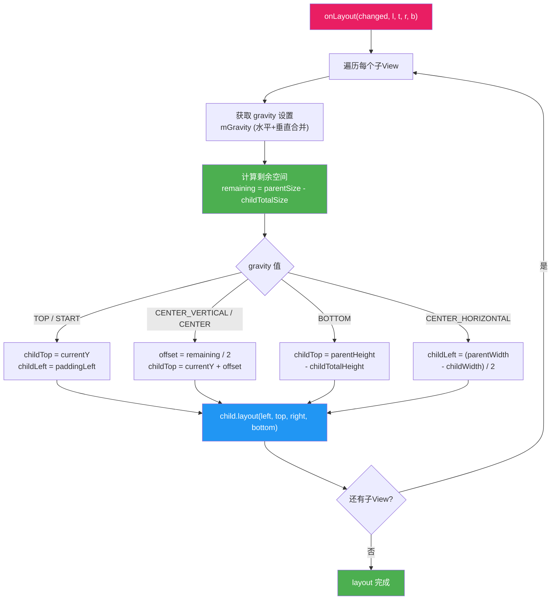
```mermaid
flowchart TD
    Start["onLayout(changed, l, t, r, b)"] --> GetChild["遍历每个子View"]
    GetChild --> GetGravity["获取 gravity 设置<br/>mGravity (水平+垂直合并)"]

    GetGravity --> CalcSpace["计算剩余空间<br/>remaining = parentSize - childTotalSize"]
    CalcSpace --> D{gravity 值}

    D -->|TOP / START| Top["childTop = currentY<br/>childLeft = paddingLeft"]
    D -->|CENTER_VERTICAL / CENTER| Center["offset = remaining / 2<br/>childTop = currentY + offset"]
    D -->|BOTTOM| Bottom["childTop = parentHeight<br/>- childTotalHeight"]
    D -->|CENTER_HORIZONTAL| CHoriz["childLeft = (parentWidth<br/>- childWidth) / 2"]

    Top --> SetPos["child.layout(left, top, right, bottom)"]
    Center --> SetPos
    Bottom --> SetPos
    CHoriz --> SetPos

    SetPos --> Next{"还有子View?"}
    Next -->|是| GetChild
    Next -->|否| Done["layout 完成"]

    style Start fill:#E91E63,color:#fff
    style CalcSpace fill:#4CAF50,color:#fff
    style SetPos fill:#2196F3,color:#fff
    style Done fill:#4CAF50,color:#fff
```

**具体数值举例：**

```plaintext
LinearLayout: 宽 300dp, 高 500dp, orientation=vertical, gravity=center
子View A: 宽 100dp, 高 80dp
子View B: 宽 200dp, 高 120dp

子View总高度 = 80 + 120 = 200dp
剩余空间 = 500 - 200 = 300dp
垂直偏移 = 300 / 2 = 150dp

子View A:
  水平居中: left = (300 - 100) / 2 = 100
  top    = 0 + 150 = 150
  right  = 100 + 100 = 200
  bottom = 150 + 80 = 230

子View B:
  水平居中: left = (300 - 200) / 2 = 50
  top    = 80 + 150 = 230
  right  = 50 + 200 = 250
  bottom = 230 + 120 = 350
```

---

## 📐 设计理念与架构图

> 本章节从软件工程架构角度分析 LinearLayout 的设计模式、继承体系，以及它在新一代 UI 框架中的演进。

### 12.1 组合模式（Composite Pattern）分析

**术语解释：**

- **组合模式（Composite Pattern）**：一种设计模式，将对象组合成树形结构，使"单个对象"和"组合对象"使用方式一致。在 Android 中，View 是叶子节点，ViewGroup 是组合节点，两者都继承自同一个基类 View，因此可以统一处理。类比：文件夹和文件都是"文件系统条目"，可以统一拖拽、复制、删除。
- **树形结构（Tree Structure）**：Android 的 View 树是一棵树——根节点是 DecorView，每个 ViewGroup 可以包含多个子 View/ViewGroup，形成自上而下的层级结构。就像公司组织架构图：CEO → 部门经理 → 组长 → 员工。
- **统一接口（Uniform Interface）**：View 和 ViewGroup 都有 measure/layout/draw 方法，外部调用者不需要关心当前操作的是叶子 View 还是容器 ViewGroup，统一调用即可。

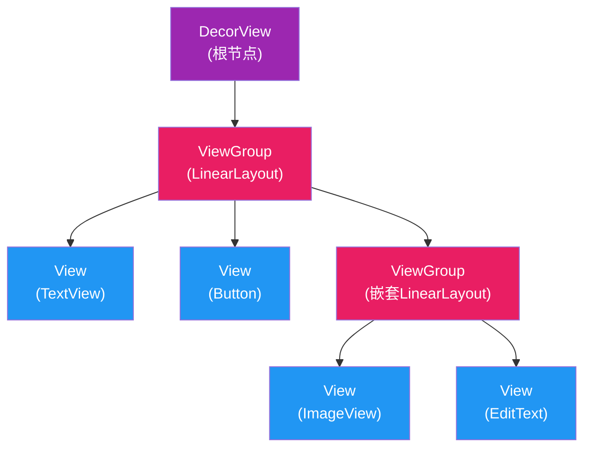
```mermaid
graph TD
    Root["DecorView<br/>(根节点)"] --> VG1["ViewGroup<br/>(LinearLayout)"]
    VG1 --> V1["View<br/>(TextView)"]
    VG1 --> V2["View<br/>(Button)"]
    VG1 --> VG2["ViewGroup<br/>(嵌套LinearLayout)"]
    VG2 --> V3["View<br/>(ImageView)"]
    VG2 --> V4["View<br/>(EditText)"]

    style Root fill:#9C27B0,color:#fff
    style VG1 fill:#E91E63,color:#fff
    style VG2 fill:#E91E63,color:#fff
    style V1 fill:#2196F3,color:#fff
    style V2 fill:#2196F3,color:#fff
    style V3 fill:#2196F3,color:#fff
    style V4 fill:#2196F3,color:#fff
```

**组合模式的核心特性：** View 和 ViewGroup 继承自同一个基类，ViewGroup 既能包含 View 也能包含其他 ViewGroup，measure/layout/draw 方法递归调用，形成自上而下的统一处理流程。

---

### 12.2 View 继承链与 LayoutParams 关系

**术语解释：**

- **LayoutParams（布局参数）**：每个子 View 都有一个 LayoutParams 对象，存储它在父容器中的布局信息（宽高、边距等）。不同 ViewGroup 有不同的 LayoutParams 子类。类比：每个员工有不同的人事档案，部门经理的档案和普通员工的不完全相同。
- **MarginLayoutParams**：ViewGroup.LayoutParams 的子类，增加了 margin（外边距）属性。LinearLayout.LayoutParams 进一步增加了 weight 和 gravity 属性。
- **继承链（Inheritance Chain）**：View → ViewGroup → LinearLayout 的层层继承关系。每一层增加新的能力：View 提供基础绘制，ViewGroup 增加子 View 管理，LinearLayout 增加线性排列和权重分配。

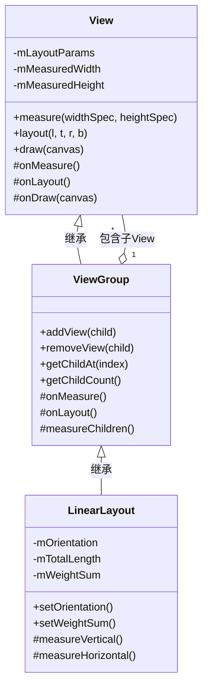
```mermaid
classDiagram
    class View {
        +measure(widthSpec, heightSpec)
        +layout(l, t, r, b)
        +draw(canvas)
        #onMeasure()
        #onLayout()
        #onDraw(canvas)
        -mLayoutParams
        -mMeasuredWidth
        -mMeasuredHeight
    }

    class ViewGroup {
        +addView(child)
        +removeView(child)
        +getChildAt(index)
        +getChildCount()
        #onMeasure()
        #onLayout()
        #measureChildren()
    }

    class LinearLayout {
        -mOrientation
        -mTotalLength
        -mWeightSum
        +setOrientation()
        +setWeightSum()
        #measureVertical()
        #measureHorizontal()
    }

    View <|-- ViewGroup : 继承
    ViewGroup <|-- LinearLayout : 继承
    ViewGroup "1" o-- "*" View : 包含子View
```

**LayoutParams 继承关系：**

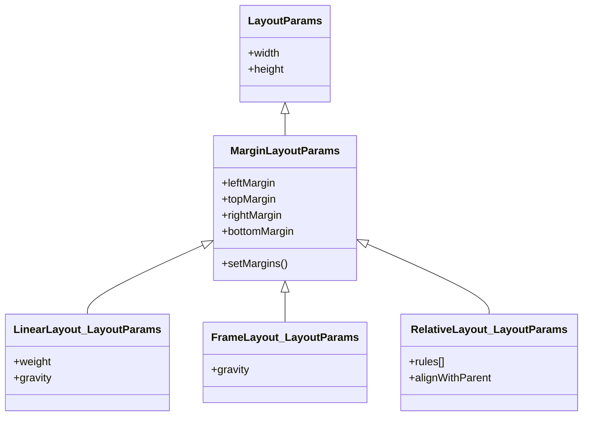
```mermaid
classDiagram
    class LayoutParams {
        +width
        +height
    }

    class MarginLayoutParams {
        +leftMargin
        +topMargin
        +rightMargin
        +bottomMargin
        +setMargins()
    }

    class LinearLayout_LayoutParams {
        +weight
        +gravity
    }

    class FrameLayout_LayoutParams {
        +gravity
    }

    class RelativeLayout_LayoutParams {
        +rules[]
        +alignWithParent
    }

    LayoutParams <|-- MarginLayoutParams
    MarginLayoutParams <|-- LinearLayout_LayoutParams
    MarginLayoutParams <|-- FrameLayout_LayoutParams
    MarginLayoutParams <|-- RelativeLayout_LayoutParams
```

**术语解释：**

- **LinearLayout.LayoutParams**：在 MarginLayoutParams 基础上增加了 weight（权重）和 gravity（子View自身对齐）两个属性，这是 LinearLayout 独有的布局参数扩展。
- **rules[]（规则数组）**：RelativeLayout.LayoutParams 中的规则数组，存储诸如"在XX左侧""与XX底部对齐"等相对定位规则，是 RelativeLayout 与 LinearLayout 设计理念的根本差异。

---

### 12.3 LinearLayout 与其他布局的演进关系

**术语解释：**

- **演进（Evolution）**：技术从简单到复杂、从低效到高效的发展过程。LinearLayout 是最早的布局之一，后续的 RelativeLayout、ConstraintLayout、RecyclerView、Compose 都在解决 LinearLayout 的局限性。
- **扁平化（Flattening）**：用一层布局替代多层嵌套的优化策略。ConstraintLayout 的核心价值就是扁平化，用约束关系替代嵌套层级。

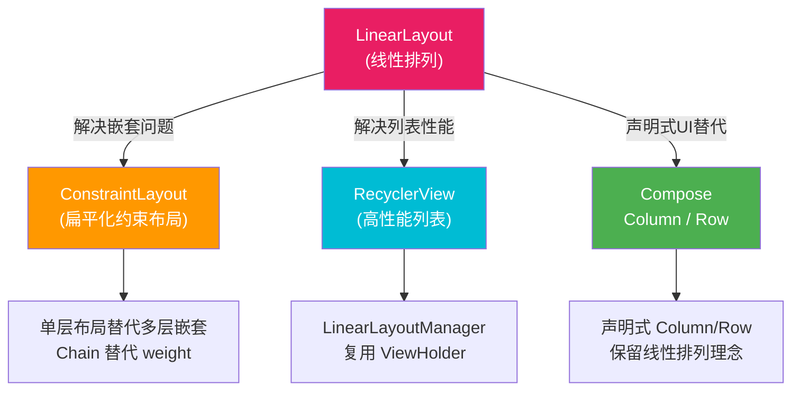
```mermaid
graph TD
    LL["LinearLayout<br/>(线性排列)"]

    LL -->|"解决嵌套问题"| CL["ConstraintLayout<br/>(扁平化约束布局)"]
    LL -->|"解决列表性能"| RV["RecyclerView<br/>(高性能列表)"]
    LL -->|"声明式UI替代"| CP["Compose<br/>Column / Row"]

    CL --> CL_D["单层布局替代多层嵌套<br/>Chain 替代 weight"]
    RV --> RV_D["LinearLayoutManager<br/>复用 ViewHolder"]
    CP --> CP_D["声明式 Column/Row<br/>保留线性排列理念"]

    style LL fill:#E91E63,color:#fff
    style CL fill:#FF9800,color:#fff
    style RV fill:#00BCD4,color:#fff
    style CP fill:#4CAF50,color:#fff
```

**各布局解决的核心问题：**

| 布局方案 | 解决的LinearLayout痛点 | 核心机制 |
|---------|---------------------|---------|
| ConstraintLayout | 嵌套层级深 | 约束求解器 + Chain |
| RecyclerView | 大量子View性能差 | ViewHolder复用 + 按需测量 |
| Compose Column/Row | XML命令式繁琐 | 声明式 + 单轮测量 |

---

### 12.4 为什么 Compose 保留了 Column/Row 概念

**术语解释：**

- **声明式 UI（Declarative UI）**：开发者只需描述"UI 应该长什么样"，不需要命令式地告诉系统"先创建布局、再添加子 View、再设置属性"。Compose 和 Flutter 都是声明式 UI。类比：命令式是"一步步教你怎么做菜"，声明式是"给你一张菜的照片，你自己做出来"。
- **Column/Row**：Compose 中的两个基础布局组件，Column 对应垂直 LinearLayout，Row 对应水平 LinearLayout。
- **Modifier（修饰符）**：Compose 中用于修饰 Composable 外观和行为的链式 API，替代了 XML 中的各种 layout_xxx 属性。`Modifier.weight()` 对应 `layout_weight`。

Google 在 Compose 中保留 Column/Row 的原因：

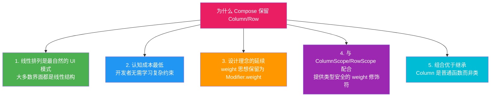
```mermaid
graph TD
    Reason["为什么 Compose 保留 Column/Row"]

    Reason --> R1["1. 线性排列是最自然的 UI 模式<br/>大多数界面都是线性结构"]
    Reason --> R2["2. 认知成本最低<br/>开发者无需学习复杂约束"]
    Reason --> R3["3. 设计理念的延续<br/>weight 思想保留为 Modifier.weight"]
    Reason --> R4["4. 与 ColumnScope/RowScope 配合<br/>提供类型安全的 weight 修饰符"]
    Reason --> R5["5. 组合优于继承<br/>Column 是普通函数而非类"]

    style Reason fill:#E91E63,color:#fff
    style R1 fill:#4CAF50,color:#fff
    style R2 fill:#2196F3,color:#fff
    style R3 fill:#FF9800,color:#fff
    style R4 fill:#9C27B0,color:#fff
    style R5 fill:#00BCD4,color:#fff
```

**weight 在 Compose 中的对应：**

```kotlin
// XML LinearLayout + weight
// <LinearLayout orientation="horizontal">
//   <View layout_width="0dp" layout_weight="1" />
//   <View layout_width="0dp" layout_weight="3" />
// </LinearLayout>

// Compose 等价写法
Row {
    Box(Modifier.weight(1f).fillMaxHeight()) { /* 内容 */ }
    Box(Modifier.weight(3f).fillMaxHeight()) { /* 内容 */ }
}
```

**术语解释：**

- **ColumnScope / RowScope**：Compose 中的作用域接收器（Scope Receiver），只有在 Column 或 Row 的内容 lambda 中才能调用 `Modifier.weight()`。这保证了 weight 修饰符不会被误用在非线性布局中，是类型安全的体现。
- **组合优于继承（Composition over Inheritance）**：Compose 中 Column/Row 不是类而是 `@Composable` 函数，通过函数组合而非类继承来构建 UI，比 XML 的 View 继承体系更灵活。

---

### 12.5 weight 机制与 Flexbox / ConstraintLayout Chain 的设计对比

**术语解释：**

- **Flexbox**：一种弹性盒子布局模型（Web 前端 CSS Flexbox 的概念），子元素可以弹性伸缩。Android 有 FlexboxLayout 库。
- **Chain（链式约束）**：ConstraintLayout 的特性，将多个子 View 串联起来，支持 spread（均匀分布）、spread_inside（两端贴边均匀分布）、packed（聚拢居中）三种模式。
- **Cassowary 约束求解器**：ConstraintLayout 内部使用的线性约束求解算法，通过将布局约束转化为线性方程组/不等式组，用单纯形法求解，从而在单轮内确定所有 View 的位置和大小。

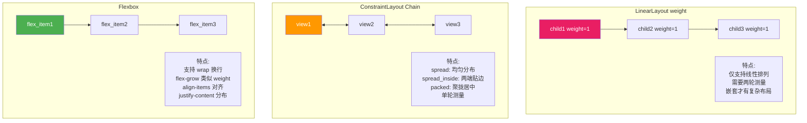
```mermaid
graph TD
    subgraph "LinearLayout weight"
        LW1["child1 weight=1"] --> LW2["child2 weight=1"] --> LW3["child3 weight=1"]
        LW_Note["特点:<br/>仅支持线性排列<br/>需要两轮测量<br/>嵌套才有复杂布局"]
    end

    subgraph "ConstraintLayout Chain"
        CC1["view1"] <--> CC2["view2"] <--> CC3["view3"]
        CC_Note["特点:<br/>spread: 均匀分布<br/>spread_inside: 两端贴边<br/>packed: 聚拢居中<br/>单轮测量"]
    end

    subgraph "Flexbox"
        FB1["flex_item1"] --> FB2["flex_item2"] --> FB3["flex_item3"]
        FB_Note["特点:<br/>支持 wrap 换行<br/>flex-grow 类似 weight<br/>align-items 对齐<br/>justify-content 分布"]
    end

    style LW1 fill:#E91E63,color:#fff
    style CC1 fill:#FF9800,color:#fff
    style FB1 fill:#4CAF50,color:#fff
```

**三者对比表：**

| 特性 | LinearLayout weight | ConstraintLayout Chain | Flexbox |
|------|--------------------|-----------------------|---------|
| 测量轮数 | 2轮（性能开销大） | 1轮（Cassowary优化） | 1~2轮（视情况） |
| 布局维度 | 仅1维（水平或垂直） | 2维（x+y约束） | 1维+换行 |
| 对齐方式 | gravity | constraint属性 | align-items |
| 分布模式 | 仅按weight比例 | spread/spread_inside/packed | justify-content |
| 换行支持 | 不支持 | 不支持 | 支持 flex-wrap |
| 嵌套需求 | 复杂布局需嵌套 | 扁平化 | 较少嵌套 |
| 适用场景 | 简单线性排列 | 复杂约束布局 | 流式布局 |

**设计哲学差异总结：**

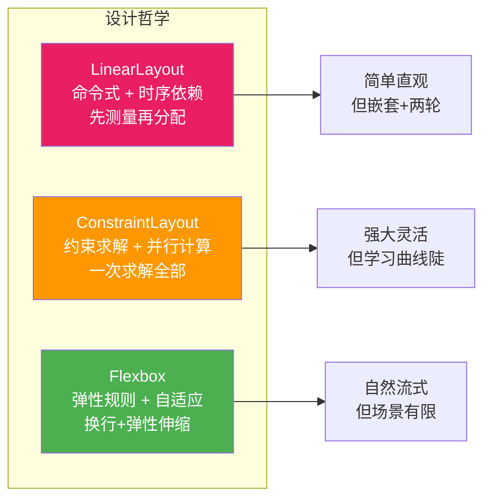
```mermaid
graph LR
    subgraph 设计哲学
        LL_P["LinearLayout<br/>命令式 + 时序依赖<br/>先测量再分配"]
        CL_P["ConstraintLayout<br/>约束求解 + 并行计算<br/>一次求解全部"]
        FB_P["Flexbox<br/>弹性规则 + 自适应<br/>换行+弹性伸缩"]
    end

    LL_P --> LL_S["简单直观<br/>但嵌套+两轮"]
    CL_P --> CL_S["强大灵活<br/>但学习曲线陡"]
    FB_P --> FB_S["自然流式<br/>但场景有限"]

    style LL_P fill:#E91E63,color:#fff
    style CL_P fill:#FF9800,color:#fff
    style FB_P fill:#4CAF50,color:#fff
```

---

## 📝 跨章节综合考核训练

> 以下 8 道考核题综合了多个章节的知识点，要求融会贯通，检验对 LinearLayout 及相关布局体系的整体理解。每道题至少关联 2 个章节的内容。

### 考核题 1：weight 两轮测量与 ConstraintLayout 单轮测量的性能对比

**涉及章节**：01-LinearLayout + 00-概述 + 04-ConstraintLayout

**题目**：

某 App 的首页有 3 个区域（头部、内容、底部），使用两种方案实现：

- 方案A：`LinearLayout(vertical)` + 3个子View，每个 `layout_height="0dp"` + `layout_weight`
- 方案B：`ConstraintLayout` + 3个子View，使用垂直 Chain（packed模式）

请从测量轮数、measure 调用次数、嵌套层级三个维度对比两种方案的性能差异，并解释 ConstraintLayout 为什么能做到单轮测量。

**参考答案要点**：

- LinearLayout 方案A：第一轮测量 3 个子View 基础大小（均为 0dp），计算剩余空间；第二轮再测量 3 个子View 分配 weight，共 6 次 measure 调用
- ConstraintLayout 方案B：Cassowary 约束求解器在单轮中同时计算所有约束，求解出每个 View 的精确位置和大小，共 3 次 measure 调用
- 根本差异：LinearLayout 的 weight 依赖"先知道剩余空间才能分配"这一时序依赖，必须分两轮；ConstraintLayout 的约束求解器通过线性方程组一次性求解所有约束，无时序依赖
- 00章知识点关联：测量阶段是 measure → layout → draw 管线中开销最大的一环，减少测量轮数直接影响帧率

---

### 考核题 2：LinearLayout 嵌套问题如何被 ConstraintLayout 解决

**涉及章节**：01-LinearLayout + 04-ConstraintLayout + 07-布局优化

**题目**：

以下布局使用 3 层嵌套 LinearLayout 实现一个"左标签 + 右输入框 + 下方按钮"的表单：

```xml
<LinearLayout orientation="vertical">           <!-- 第1层 -->
    <LinearLayout orientation="horizontal">      <!-- 第2层 -->
        <TextView />
        <EditText layout_weight="1" />
    </LinearLayout>
    <Button />
</LinearLayout>
```

请用 ConstraintLayout 重写为单层扁平布局，并分析嵌套 LinearLayout 的性能开销（总 measure 调用次数），对比扁平化后的调用次数。

**参考答案要点**：

- ConstraintLayout 重写：使用 `app:layout_constraintTop_toBottomOf` 将 EditText 约束到 TextView 右侧，Button 约束到 horizontal LinearLayout 下方，TextView 和 EditText 在同一层水平约束，无需嵌套
- 嵌套LinearLayout的measure调用：第2层(2个子View，其中EditText有weight)→第一轮2次+第二轮1次=3次；第1层(2个子View)→2次；总计约 5 次（加上递归展开）
- 扁平化后：3个子View单轮测量，约 3 次 measure 调用，减少约 40%
- 07章知识点关联：HierarchyViewer / Layout Inspector 可检测嵌套层级，推荐扁平化为 ConstraintLayout，减少 View 树深度

---

### 考核题 3：gravity 与 layout_gravity 在其他布局中的体现

**涉及章节**：01-LinearLayout + 02-RelativeLayout + 03-FrameLayout

**题目**：

对比 LinearLayout 的 gravity / layout_gravity，与 RelativeLayout 的 alignParentXxx / layout_alignXxx，以及 FrameLayout 的 layout_gravity 在以下场景中的使用方式：

1. 让一个子 View 在父容器中水平+垂直居中
2. 让一个子 View 靠右下角对齐

请分别用三种布局的 XML 代码实现以上两个场景，并说明每种布局的对齐机制本质。

**参考答案要点**：

- LinearLayout：`android:gravity="center"` 控制所有子View居中；子View用 `android:layout_gravity="center"` 单独居中
- RelativeLayout：`android:layout_centerInParent="true"` 居中；靠右下角用 `android:layout_alignParentRight="true"` + `android:layout_alignParentBottom="true"`
- FrameLayout：`android:layout_gravity="center"` 居中；靠右下角用 `android:layout_gravity="bottom|right"`
- 本质差异：LinearLayout的gravity是容器级属性（影响所有子View），layout_gravity是子View级属性；RelativeLayout用规则系统（rule-based）定义相对关系，无gravity概念；FrameLayout的layout_gravity是最直接的坐标偏移，因为FrameLayout本就是层叠布局

---

### 考核题 4：LinearLayout 的 weight 与 ConstraintLayout 的 Chain 的设计差异

**涉及章节**：01-LinearLayout + 04-ConstraintLayout

**题目**：

请从"空间分配算法"、"测量轮数"、"分布模式"三个维度，对比 LinearLayout 的 weight 机制与 ConstraintLayout 的 Chain 机制，并回答：在什么场景下 weight 仍然优于 Chain？

**参考答案要点**：

- 空间分配：weight 按 `weight/totalWeight * 剩余空间` 线性比例分配；Chain 通过约束求解器求解方程组，支持 spread/spread_inside/packed 三种模式
- 测量轮数：weight 需要2轮（先测基础大小→算剩余→再分配）；Chain 1轮（Cassowary 约束求解器一次性求解）
- 分布模式：weight 仅支持按比例分配；Chain 支持均匀分布、两端贴边均匀分布、聚拢居中三种模式
- weight 仍优于 Chain 的场景：简单线性等分（如3等分屏幕）时，weight 更直观、XML 更简洁、无需理解约束求解概念，且此时两轮测量的性能开销可忽略不计

---

### 考核题 5：ScrollView 只允许一个子 View 与 LinearLayout 的配合

**涉及章节**：01-LinearLayout + 05-ScrollView

**题目**：

ScrollView 有一个限制：只能包含一个直接子 View。为什么有这个限制？如果直接放入多个 TextView 会发生什么？请用 LinearLayout 配合 ScrollView 实现一个可滚动的表单页面，并分析 ScrollView 内部 LinearLayout 的 MeasureSpec 模式（垂直方向）。

**参考答案要点**：

- ScrollView 限制原因：ScrollView 需要管理滚动偏移量（scrollY），如果包含多个直接子View，无法确定如何排列它们的高度；ScrollView 本质是一个 FrameLayout，只滚动一个内容区域
- 直接放入多个TextView：运行时只显示第一个，或布局异常，因为 ScrollView 不知道如何排列多个直接子View
- 正确实现：ScrollView → LinearLayout(vertical) → 多个子View，LinearLayout 作为唯一直接子 View 负责排列内容
- MeasureSpec 分析：ScrollView 给子LinearLayout的heightSpec是 UNSPECIFIED 模式（无限制），子LinearLayout高度可以无限大；widthSpec是 EXACTLY 模式（等于ScrollView宽度）。这正是 11.1 节中 UNSPECIFIED 模式的典型应用场景

---

### 考核题 6：RecyclerView 的 LinearLayoutManager 与 LinearLayout 的关系

**涉及章节**：01-LinearLayout + 06-RecyclerView

**题目**：

RecyclerView 使用 LinearLayoutManager 时，Item 的排列方式与 LinearLayout 非常相似。请分析：

1. LinearLayoutManager 和 LinearLayout 有什么继承关系吗？
2. 两者在测量机制上的核心差异是什么？
3. 为什么 RecyclerView 不直接继承 LinearLayout？

**参考答案要点**：

- 继承关系：无继承关系。LinearLayoutManager 继承自 RecyclerView.LayoutManager，LinearLayout 继承自 ViewGroup。它们是"功能相似但实现独立"的两个体系
- 测量差异：LinearLayout 一次性测量所有子View（N个，全部创建）；LinearLayoutManager 只测量可见区域的子View（约 screen_height/item_height 个），通过 ViewHolder 复用避免重复创建和测量
- 不继承原因：RecyclerView 的核心价值是"按需创建+复用"，与 LinearLayout 的"一次性加载全部子View"理念冲突；LayoutManager 设计为可插拔策略模式，支持线性/网格/瀑布流等多种排列方式，继承 LinearLayout 会限制扩展性

---

### 考核题 7：Compose Column/Row 对 LinearLayout 的替代

**涉及章节**：01-LinearLayout + 09-Compose

**题目**：

Jetpack Compose 中没有 LinearLayout，而是提供了 Column 和 Row。请分析：

1. Compose 的 `Modifier.weight()` 与 XML 的 `layout_weight` 有什么本质区别？
2. Compose 为什么不需要两轮测量？它是如何优化的？
3. 以下 XML 用 Compose 重写：

```xml
<LinearLayout orientation="horizontal">
    <TextView layout_width="0dp" layout_weight="1" />
    <TextView layout_width="0dp" layout_weight="2" />
</LinearLayout>
```

**参考答案要点**：

- 本质区别：XML的weight是 LayoutParams 属性，存储在XML标签中，需要两轮测量；Compose的 `Modifier.weight()` 是作用域内（ColumnScope/RowScope）的修饰符，在测量时直接传入weight比例，编译期类型安全
- Compose 优化：Compose 采用"子节点先报告内在尺寸，父节点一次性决定最终尺寸"的测量机制，避免了 LinearLayout 的两轮测量问题，只需一轮即可确定所有子节点的尺寸
- Compose 重写：`Row { Text("...", Modifier.weight(1f)); Text("...", Modifier.weight(2f)) }`，简洁且无需设置 0dp

---

### 考核题 8：visibility 属性在 ConstraintLayout Group 中的演进

**涉及章节**：01-LinearLayout + 04-ConstraintLayout

**题目**：

在 LinearLayout 中，控制多个子 View 的显示/隐藏需要逐个设置 `android:visibility`。ConstraintLayout 引入了 Group 组件。请分析：

1. LinearLayout 中批量控制 visibility 的痛点是什么？
2. ConstraintLayout 的 Group 如何解决批量控制问题？
3. Group 的实现原理是什么？（提示：Group 不是真正的 View）

**参考答案要点**：

- LinearLayout 痛点：需要在代码中逐个 findViewById 后 setVisibility()，无法在XML中声明式地批量控制；如果子View数量变化，需要维护引用列表，容易遗漏
- ConstraintLayout Group：通过 `app:constraint_referenced_ids="view1,view2,view3"` 引用多个View，设置Group的visibility即可同时控制所有引用View的显示状态
- Group 实现原理：Group 继承自 ConstraintHelper（非View子类），不参与 measure/layout/draw，只在 ConstraintLayout 更新约束时遍历 referenced_ids 列表，批量设置对应View的visibility。是一种"虚拟辅助组件"设计模式，体现了组合模式的另一种应用

---

## 参考文献与延伸阅读

### 官方文档与源码
1. **[Android 官方文档 - LinearLayout 指南](https://developer.android.com/guide/topics/ui/layout/linear)**
   - Google 官方 LinearLayout 使用指南，涵盖方向、权重、gravity 等核心属性说明。
2. **[AOSP 源码 - LinearLayout.java](https://cs.android.com/android/platform/superproject/+/main:frameworks/base/core/java/android/widget/LinearLayout.java)**
   - LinearLayout 的 AOSP 源码，包含 onMeasure()、measureHorizontal()、measureVertical() 及 weight 分配算法的完整实现。
3. **[AOSP 源码 - View.java - MeasureSpec 内部类](https://cs.android.com/android/platform/superproject/+/main:frameworks/base/core/java/android/view/View.java)**
   - MeasureSpec 类的 AOSP 源码，包含 makeMeasureSpec()、getMode()、getSize() 等位运算方法。

### MeasureSpec 与测量原理
4. **[Android View 体系（二）：理解 MeasureSpec - CSDN](https://blog.csdn.net/qq_44947117/article/details/104357287)**
   - 系统性解析 MeasureSpec 的三种模式（UNSPECIFIED/EXACTLY/AT_MOST）及其在测量流程中的作用。
5. **[Android-MeasureSpec 那些事 - 博客园](https://www.cnblogs.com/66it/p/10486047.html)**
   - 从源码角度分析 MeasureSpec 的 32 位二进制编码原理及 mode/size 的位运算提取方法。
6. **[MeasureSpec 中三种模式详解 - 51CTO](https://blog.51cto.com/u_14523369/6123727)**
   - 对 UNSPECIFIED、EXACTLY、AT_MOST 三种测量模式的含义和触发场景进行详细说明。

### weight 机制与性能
7. **[Android LinearLayout weight 属性的性能陷阱 - CSDN](https://blog.csdn.net/gongertouji1992/article/details/108265204)**
   - 分析 LinearLayout weight 两轮测量导致的性能开销，以及 ConstraintLayout 作为替代方案的优势。
