# RelativeLayout 相对布局完全指南

> **一句话定义**：RelativeLayout 通过定义子视图之间或与父容器之间的相对位置关系来排列 UI 元素，减少布局嵌套。

---

## 📋 教学信息

| 属性 | 值 |
|------|-----|
| **难度分级** | 02 = ⭐⭐进阶 |
| **时间预估** | 40 分钟 |
| **前置知识** | 01-LinearLayout、基本 View 属性 |
| **学习目标** | 掌握父子/兄弟定位、理解废弃属性、对比 ConstraintLayout |

---

## 1. 一句话定义

RelativeLayout（相对布局）允许子视图通过引用其他视图或父容器的位置来确定自身位置，是实现复杂布局且保持扁平结构的有效方案。

---

## 2. 为什么需要

### 问题场景

使用 LinearLayout 实现以下界面需要多层嵌套：

```plaintext
┌──────────────────────────────┐
│  [头像]  用户名      [设置]  │
│  [徽章]  个人简介            │
└──────────────────────────────┘
```

**LinearLayout 方案（嵌套3层）：**
```xml
<LinearLayout horizontal>
    <LinearLayout vertical>
        <ImageView />
        <ImageView />
    </LinearLayout>
    <LinearLayout vertical>
        <TextView />
        <TextView />
    </LinearLayout>
    <View />  <!-- 占位 -->
    <Button />
</LinearLayout>
```

**RelativeLayout 方案（扁平化）：**
```xml
<RelativeLayout>
    <ImageView id="avatar" />
    <ImageView id="badge" toRightOf="avatar" below="avatar" />
    <TextView id="name" toRightOf="avatar" />
    <TextView id="bio" below="name" toRightOf="avatar" />
    <Button id="settings" alignParentEnd="true" />
</RelativeLayout>
```

---

## 3. 核心概念

### 3.1 父容器定位

子视图可以相对于父容器定位：

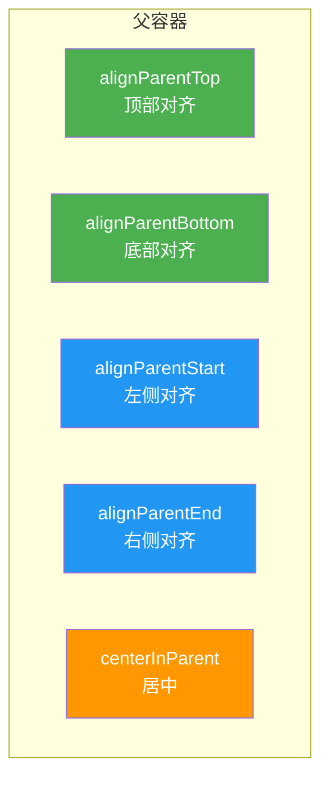

**术语解释：**
- **父容器定位（Parent Positioning）**：子 View 相对于父容器（RelativeLayout 本身）的位置关系。就像把画挂在墙上——你不需要参考其他画，只需要确定它在墙上的位置。
- **alignParentTop**：让子 View 的顶部与父容器的顶部对齐。设置为 `true` 后，子 View 会贴着父容器的上边缘。
- **alignParentBottom**：让子 View 的底部与父容器的底部对齐。设置为 `true` 后，子 View 会贴着父容器的下边缘。
- **alignParentStart**：让子 View 的左侧与父容器的左侧对齐（LTR 布局）。在 RTL 语言（如阿拉伯语）中，start 对应右侧。
- **alignParentEnd**：让子 View 的右侧与父容器的右侧对齐（LTR 布局）。在 RTL 语言中，end 对应左侧。
- **centerInParent**：让子 View 在父容器中水平和垂直方向都居中显示。同时设置水平居中和垂直居中。

**父容器定位属性表：**

| 属性 | 说明 | 示例 |
|------|------|------|
| `layout_alignParentTop` | 顶部对齐 | `android:layout_alignParentTop="true"` |
| `layout_alignParentBottom` | 底部对齐 | `android:layout_alignParentBottom="true"` |
| `layout_alignParentStart` | 左侧对齐 | `android:layout_alignParentStart="true"` |
| `layout_alignParentEnd` | 右侧对齐 | `android:layout_alignParentEnd="true"` |
| `layout_centerInParent` | 居中 | `android:layout_centerInParent="true"` |
| `layout_centerHorizontal` | 水平居中 | `android:layout_centerHorizontal="true"` |
| `layout_centerVertical` | 垂直居中 | `android:layout_centerVertical="true"` |

### 3.2 兄弟定位

子视图之间可以相互引用：

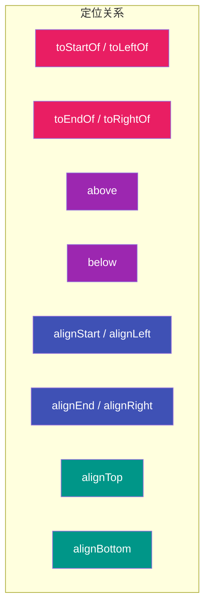

**术语解释：**
- **兄弟定位（Sibling Positioning）**：子 View 相对于其他子 View 的位置关系。就像排队时，你站在"张三的左边"或"李四的下面"。
- **toStartOf / toLeftOf**：让当前 View 的左侧紧挨着目标 View 的右侧。`toStartOf` 是新属性（支持 RTL），`toLeftOf` 是旧属性（不支持 RTL）。
- **toEndOf / toRightOf**：让当前 View 的右侧紧挨着目标 View 的左侧。`toEndOf` 支持 RTL，`toRightOf` 不支持。
- **above**：让当前 View 的底部紧挨着目标 View 的顶部。当前 View 在目标 View 的上方。
- **below**：让当前 View 的顶部紧挨着目标 View 的底部。当前 View 在目标 View 的下方。
- **alignStart / alignLeft**：让当前 View 的左边缘与目标 View 的左边缘对齐。不是"紧挨着"，而是"对齐"。
- **alignEnd / alignRight**：让当前 View 的右边缘与目标 View 的右边缘对齐。
- **alignTop**：让当前 View 的上边缘与目标 View 的上边缘对齐。
- **alignBottom**：让当前 View 的下边缘与目标 View 的下边缘对齐。

**兄弟定位属性详解：**

| 属性类型 | 属性 | 说明 |
|---------|------|------|
| **水平方向** | `toStartOf` / `toLeftOf` | 在某视图的左侧 |
| | `toEndOf` / `toRightOf` | 在某视图的右侧 |
| **垂直方向** | `above` | 在某视图的上方 |
| | `below` | 在某视图的下方 |
| **对齐** | `alignStart` / `alignLeft` | 左边缘对齐 |
| | `alignEnd` / `alignRight` | 右边缘对齐 |
| | `alignTop` | 上边缘对齐 |
| | `alignBottom` | 下边缘对齐 |

### 3.3 废弃属性对比

部分属性已被新属性替代：

```plaintext
┌─────────────────────────────────────────────────────────────────┐
│                 RelativeLayout 属性演进对比                      │
├────────────────────┬────────────────────┬───────────────────────┤
│ 旧属性 (已废弃)    │ 新属性 (推荐)       │ 说明                  │
├────────────────────┼────────────────────┼───────────────────────┤
│ layout_alignLeft   │ layout_alignStart  │ 适配 RTL 布局         │
│ layout_alignRight  │ layout_alignEnd    │ 适配 RTL 布局         │
│ layout_toLeftOf    │ layout_toStartOf   │ 适配 RTL 布局         │
│ layout_toRightOf   │ layout_toEndOf     │ 适配 RTL 布局         │
│ layout_alignParentLeft  │ layout_alignParentStart │ 适配 RTL 布局│
│ layout_alignParentRight │ layout_alignParentEnd   │ 适配 RTL 布局│
└────────────────────┴────────────────────┴───────────────────────┘
```

**RTL 布局示意：**

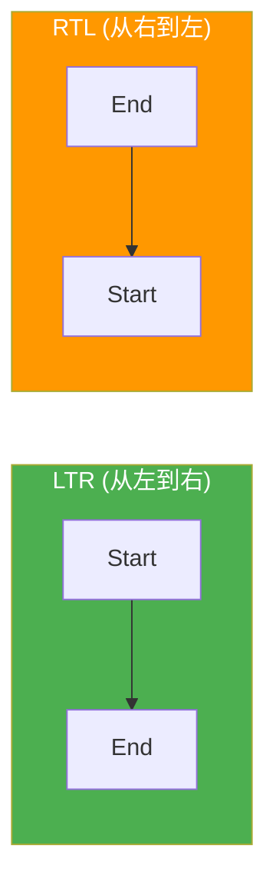

---

## 4. 基础用法

### 完整示例：新闻卡片

```xml
<?xml version="1.0" encoding="utf-8"?>
<RelativeLayout xmlns:android="http://schemas.android.com/apk/res/android"
    android:layout_width="match_parent"
    android:layout_height="wrap_content"
    android:padding="16dp">

    <!-- 头像：左上角 -->
    <ImageView
        android:id="@+id/avatar"
        android:layout_width="48dp"
        android:layout_height="48dp"
        android:layout_alignParentStart="true"
        android:layout_alignParentTop="true"
        android:src="@drawable/ic_avatar" />

    <!-- 用户名：头像右侧 -->
    <TextView
        android:id="@+id/username"
        android:layout_width="wrap_content"
        android:layout_height="wrap_content"
        android:layout_toEndOf="@id/avatar"
        android:layout_marginStart="12dp"
        android:text="张三"
        android:textSize="16sp"
        android:textStyle="bold" />

    <!-- 时间：用户名下方 -->
    <TextView
        android:id="@+id/time"
        android:layout_width="wrap_content"
        android:layout_height="wrap_content"
        android:layout_below="@id/username"
        android:layout_toEndOf="@id/avatar"
        android:layout_marginStart="12dp"
        android:text="2小时前"
        android:textSize="12sp"
        android:textColor="#999999" />

    <!-- 内容：头像下方 -->
    <TextView
        android:id="@+id/content"
        android:layout_width="match_parent"
        android:layout_height="wrap_content"
        android:layout_below="@id/avatar"
        android:layout_marginTop="12dp"
        android:text="这是一条新闻内容..."
        android:textSize="14sp" />

    <!-- 点赞按钮：右下角 -->
    <ImageButton
        android:id="@+id/btnLike"
        android:layout_width="wrap_content"
        android:layout_height="wrap_content"
        android:layout_alignParentEnd="true"
        android:layout_alignBottom="@id/content"
        android:src="@drawable/ic_like"
        android:background="?attr/selectableItemBackgroundBorderless" />

</RelativeLayout>
```

---

## 5. 实战场景示例

### 场景1：聊天消息界面

```xml
<RelativeLayout
    android:layout_width="match_parent"
    android:layout_height="wrap_content"
    android:padding="16dp">

    <!-- 发送者头像：左侧 -->
    <ImageView
        android:id="@+id/senderAvatar"
        android:layout_width="40dp"
        android:layout_height="40dp"
        android:layout_alignParentStart="true"
        android:layout_alignParentTop="true"
        android:src="@drawable/ic_sender" />

    <!-- 消息气泡：头像右侧 -->
    <TextView
        android:id="@+id/messageBubble"
        android:layout_width="wrap_content"
        android:layout_height="wrap_content"
        android:layout_toEndOf="@id/senderAvatar"
        android:layout_marginStart="8dp"
        android:background="@drawable/bg_bubble"
        android:padding="12dp"
        android:text="你好！" />

    <!-- 时间戳：气泡下方 -->
    <TextView
        android:id="@+id/messageTime"
        android:layout_width="wrap_content"
        android:layout_height="wrap_content"
        android:layout_below="@id/messageBubble"
        android:layout_toEndOf="@id/senderAvatar"
        android:layout_marginStart="8dp"
        android:text="10:30"
        android:textSize="11sp"
        android:textColor="#AAAAAA" />

</RelativeLayout>
```

### 场景2：搜索栏布局

```xml
<RelativeLayout
    android:layout_width="match_parent"
    android:layout_height="56dp"
    android:background="#FFFFFF"
    android:elevation="4dp">

    <!-- 返回按钮：左侧 -->
    <ImageButton
        android:id="@+id/btnBack"
        android:layout_width="48dp"
        android:layout_height="48dp"
        android:layout_alignParentStart="true"
        android:layout_centerVertical="true"
        android:src="@drawable/ic_back" />

    <!-- 搜索框：返回按钮右侧，填满剩余空间 -->
    <EditText
        android:id="@+id/searchBox"
        android:layout_width="match_parent"
        android:layout_height="40dp"
        android:layout_toEndOf="@id/btnBack"
        android:layout_toStartOf="@id/btnSearch"
        android:layout_centerVertical="true"
        android:layout_marginHorizontal="8dp"
        android:hint="搜索..."
        android:background="@drawable/bg_search" />

    <!-- 搜索按钮：右侧 -->
    <Button
        android:id="@+id/btnSearch"
        android:layout_width="wrap_content"
        android:layout_height="40dp"
        android:layout_alignParentEnd="true"
        android:layout_centerVertical="true"
        android:text="搜索" />

</RelativeLayout>
```

### 场景3：登录表单（居中定位）

```xml
<RelativeLayout
    android:layout_width="match_parent"
    android:layout_height="match_parent">

    <!-- 登录表单：垂直居中 -->
    <LinearLayout
        android:id="@+id/loginForm"
        android:layout_width="match_parent"
        android:layout_height="wrap_content"
        android:layout_centerInParent="true"
        android:orientation="vertical"
        android:padding="32dp">

        <EditText
            android:layout_width="match_parent"
            android:layout_height="wrap_content"
            android:hint="用户名" />

        <EditText
            android:layout_width="match_parent"
            android:layout_height="wrap_content"
            android:layout_marginTop="16dp"
            android:hint="密码"
            android:inputType="textPassword" />

        <Button
            android:layout_width="match_parent"
            android:layout_height="wrap_content"
            android:layout_marginTop="24dp"
            android:text="登录" />
    </LinearLayout>

    <!-- 版本号：底部居中 -->
    <TextView
        android:layout_width="wrap_content"
        android:layout_height="wrap_content"
        android:layout_alignParentBottom="true"
        android:layout_centerHorizontal="true"
        android:layout_marginBottom="16dp"
        android:text="v1.0.0"
        android:textSize="12sp"
        android:textColor="#999999" />

</RelativeLayout>
```

---

## 6. 常见错误与避坑

### 错误信息速查表

| 错误信息 | 原因 | 解决方案 |
|---------|------|---------|
| `A dependency cycle detected` | 循环引用 | 检查引用关系，确保无环 |
| `Center depends on...` | 居中属性与其他约束冲突 | 移除冲突约束 |
| 视图重叠 | 缺少定位约束 | 添加正确的相对定位 |

### Before/After 对比

```xml
<!-- ❌ Bad: 循环引用 -->
<TextView
    android:id="@+id/a"
    android:layout_toEndOf="@id/b" />

<TextView
    android:id="@+id/b"
    android:layout_toStartOf="@id/a" />

<!-- ✅ Good: 单向引用链 -->
<TextView
    android:id="@+id/a"
    android:layout_alignParentStart="true" />

<TextView
    android:id="@+id/b"
    android:layout_toEndOf="@id/a" />
```

```xml
<!-- ❌ Bad: 居中与其他约束冲突 -->
<TextView
    android:layout_centerInParent="true"
    android:layout_alignParentStart="true" />

<!-- ✅ Good: 只使用一个定位方式 -->
<TextView
    android:layout_centerInParent="true" />
```

---

## 7. 优势与局限

| 优势 | 局限 |
|------|------|
| 扁平化结构，减少嵌套 | 属性较多，学习曲线陡 |
| 支持相对定位 | 复杂布局调试困难 |
| 适配 RTL 布局 | 已被 ConstraintLayout 部分取代 |
| 性能优于多层 LinearLayout | 循环引用会导致崩溃 |

---

## 8. 进阶技巧

### 8.1 RelativeLayout vs ConstraintLayout 对比

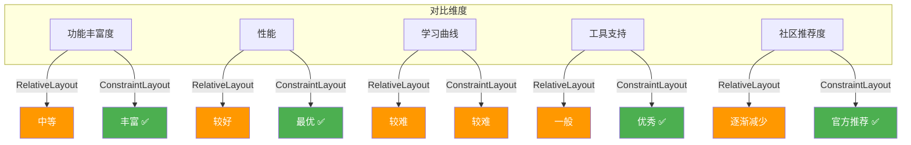

**详细对比表：**

| 特性 | RelativeLayout | ConstraintLayout |
|------|---------------|-----------------|
| 嵌套层级 | 可能需要嵌套 | 通常1层解决 |
| 约束类型 | 相对定位 | 丰富约束系统 |
| 链式布局 | 不支持 | 支持 (Chain) |
| 屏障 | 不支持 | 支持 (Barrier) |
| 占位符 | 不支持 | 支持 (Placeholder) |
| 动画支持 | 有限 | MotionLayout |
| 性能 | 较好 | 最优 |
| 官方推荐 | 一般 | 强烈推荐 |

### 8.2 性能优化建议

```plaintext
┌─────────────────────────────────────────────────────────────────┐
│              RelativeLayout 性能优化清单                        │
├─────────────────────────────────────────────────────────────────┤
│ ✓ 避免循环引用（会导致 crash）                                   │
│ ✓ 减少嵌套层级（尽量保持2层以内）                                │
│ ✓ 使用 ViewStub 延迟加载不常用视图                              │
│ ✓ 使用 merge 标签减少层级                                       │
│ ✓ 优先考虑 ConstraintLayout 替代                                │
│ ✓ 避免在 RelativeLayout 中使用 layout_weight                   │
└─────────────────────────────────────────────────────────────────┘
```

---

## 9. 面试高频考点

### Q1：RelativeLayout 的测量流程是怎样的？

**答：**

1. 第一轮测量：测量所有没有依赖其他视图的子视图
2. 第二轮测量：测量依赖已测量视图的子视图
3. 可能需要多轮测量才能完成所有视图的定位

```plaintext
测量顺序示例：
  第1轮：测量 alignParentStart 的视图
  第2轮：测量 toEndOf 第1轮视图的视图
  第3轮：测量 below 第2轮视图的视图
  ...
```

### Q2：RelativeLayout 和 LinearLayout 性能对比？

**答：**

| 场景 | RelativeLayout | LinearLayout |
|------|---------------|--------------|
| 简单线性排列 | 较慢（需要两轮测量） | 较快（一轮测量） |
| 复杂布局 | 较快（扁平化） | 较慢（需嵌套） |
| 整体性能 | 中等 | 取决于嵌套深度 |

### Q3：如何避免 RelativeLayout 循环引用？

**答：**
- 确保引用关系是单向的（有向无环图）
- 使用 `layout_alignParentStart` 等父容器定位作为起点
- 检查是否存在 A→B→C→A 的循环

---

## 10. 小结与下一步

### 核心要点回顾

| 概念 | 关键点 |
|------|--------|
| 父容器定位 | `alignParentXxx`、`centerInParent` |
| 兄弟定位 | `toStartOf`、`toEndOf`、`above`、`below` |
| 废弃属性 | 优先使用 Start/End 替代 Left/Right |
| 性能 | 扁平化结构，但测量需要多轮 |

### 下一步学习

```
RelativeLayout（本文）
    ↓
├─→ ConstraintLayout（推荐替代方案）
├─→ MotionLayout（动画）
├─→ 自定义 ViewGroup
└─→ Jetpack Compose
```

---

## 📚 术语表

| 术语 | 英文 | 说明 |
|------|------|------|
| 相对定位 | Relative Positioning | 通过引用其他视图确定位置 |
| 循环引用 | Circular Dependency | 视图互相引用导致的死循环 |
| RTL | Right-to-Left | 从右到左的文字布局（如阿拉伯语） |
| 扁平化 | Flat Structure | 减少嵌套层级的布局方式 |

---

## 📝 课后练习

1. 使用 RelativeLayout 实现一个带头像和文字的列表项
2. 实现一个底部导航栏（4个按钮，图标在上文字在下）
3. 将一个 LinearLayout 布局重构为 RelativeLayout

---

## ✅ 自测题

1. 如何让一个视图在父容器中水平垂直居中？
2. `toStartOf` 和 `toLeftOf` 的区别是什么？
3. RelativeLayout 的测量流程是怎样的？

---

## 🎯 常见学生错误

| 错误 | 正确做法 |
|------|---------|
| 使用废弃的 Left/Right 属性 | 使用 Start/End 属性 |
| 循环引用视图 | 确保引用是单向的 |
| 混淆 toStartOf 和 alignStart | toStartOf=在左边，alignStart=左对齐 |

---

## 💡 教学提示

> 建议先让学生理解"相对"的概念：每个视图的位置是由"参照物"决定的，可以是父容器或其他视图。

---

## 🎬 渲染逻辑详解

### RelativeLayout 的两轮测量机制

RelativeLayout 的核心特点是**需要两轮测量**才能完成布局：

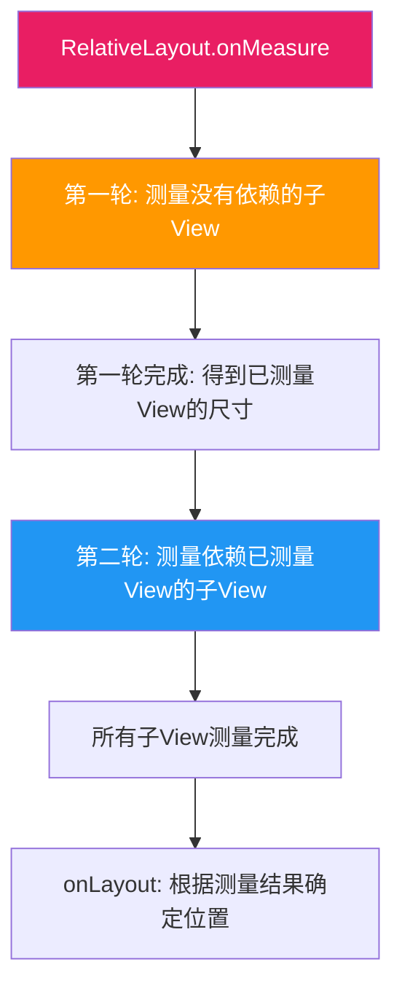

**两轮测量的原因：**

```plaintext
第1轮：测量所有没有引用其他 View 的子 View
  - alignParentStart 的 View
  - alignParentTop 的 View
  - centerInParent 的 View
  
第2轮：测量依赖了第1轮结果的子 View
  - toEndOf="view1" 的 View（需要知道 view1 的宽度）
  - below="view2" 的 View（需要知道 view2 的高度）
```

**layout 阶段的位置计算：**

```plaintext
RelativeLayout 的 layout 策略：
  1. 先根据父容器定位属性确定位置（alignParentXxx）
  2. 再根据兄弟定位属性调整位置（toEndOf、below）
  3. 最终确定每个 View 的 left, top, right, bottom
```

### 与 LinearLayout 性能对比

| 场景 | LinearLayout | RelativeLayout | 原因 |
|------|-------------|----------------|------|
| 简单垂直排列 | **1 轮测量** ✅ | 2 轮测量 | RelativeLayout 总是两轮 |
| 复杂定位（需嵌套） | 多层嵌套，每层 1 轮 | **扁平化，2 轮** ✅ | RelativeLayout 减少嵌套 |
| 深层嵌套 (3层+) | 3+ 轮测量 ❌ | 2 轮测量 | 嵌套导致测量次数叠加 |

### 与 ConstraintLayout 的渲染对比

```plaintext
RelativeLayout 渲染流程：
  onMeasure()  → 2 轮测量
  onLayout()   → 1 轮布局
  onDraw()     → 1 轮绘制
  总计: 2次 measure + 1次 layout + 1次 draw

ConstraintLayout 渲染流程：
  onMeasure()  → 1 轮测量（约束求解）
  onLayout()   → 1 轮布局
  onDraw()     → 1 轮绘制
  总计: 1次 measure + 1次 layout + 1次 draw
```

---

## 🔗 知识依赖图

### 与前后章节的关系

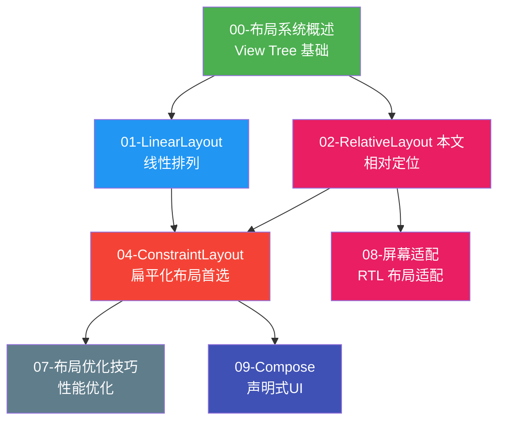

### 核心知识点的章节串联

| 知识点 | 本章内容 | 关联章节 | 关联说明 |
|--------|---------|---------|---------|
| **相对定位** | toEndOf、below 等属性 | 04-ConstraintLayout | ConstraintLayout 用约束替代相对定位 |
| **扁平化** | 减少嵌套层级 | 07-布局优化 | 07 章强调扁平化是性能关键 |
| **RTL 适配** | Start/End 替代 Left/Right | 08-屏幕适配 | 08 章讲解多语言布局适配 |
| **两轮测量** | RelativeLayout 特有 | 00-概述 | 00 章介绍 measure 概念 |
| **兄弟定位** | View 之间相互引用 | 04-ConstraintLayout | ConstraintLayout 的约束系统更强大 |
| **循环引用** | A→B→A 导致崩溃 | 04-ConstraintLayout | ConstraintLayout 也会有类似问题 |

### 组件关系图

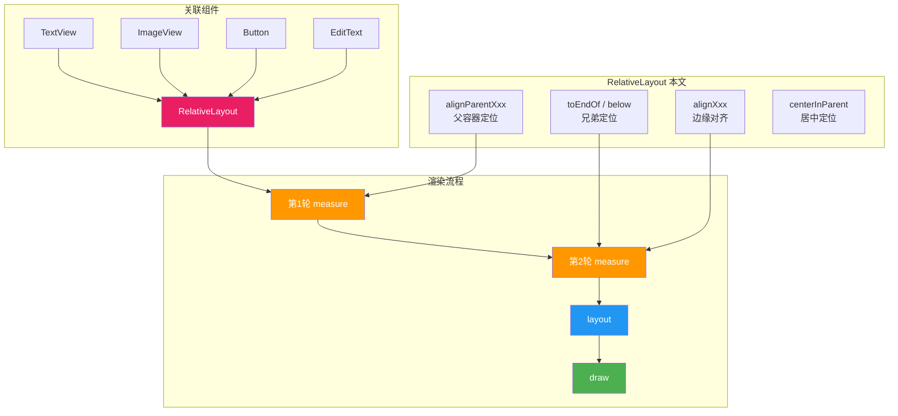

---

## 🛠 实战项目建议

**项目：** 聊天应用界面
- 实现消息气泡布局（头像+消息+时间）
- 练习兄弟定位和父容器定位
- 适配 RTL 布局

---

## ✅ 代码审查清单

- [ ] 是否使用了 Start/End 替代 Left/Right
- [ ] 是否存在循环引用
- [ ] 嵌套层级是否控制在合理范围
- [ ] 是否考虑了 RTL 布局适配
- [ ] 是否考虑用 ConstraintLayout 替代

---

## 🔬 依赖图与测量算法深度解析

> 本节从源码层面深入剖析 RelativeLayout 的核心算法：依赖图构建、拓扑排序、两轮测量、循环检测，并与 ConstraintLayout 的约束求解器进行对比。

### 1. 依赖图（Dependency Graph）的构建

**术语解释：依赖图（Dependency Graph）**

依赖图是一种用来描述"谁依赖谁"的数据结构。你可以把它想象成一张"施工进度图"：要砌第二面墙，必须先砌好第一面墙；第一面墙就是第二面墙的"依赖"。

RelativeLayout 在 `onMeasure()` 阶段会遍历所有子 View，读取它们的 `LayoutParams`（如 `toEndOf`、`below` 等属性），分析每个子 View 引用了哪些其他 View，从而构建一张**有向无环图（DAG）**。

- **有向（Directed）**：A 依赖 B，不代表 B 依赖 A，依赖关系是有方向的。
- **无环（Acyclic）**：如果出现 A→B→C→A 这样的"环路"，就无法确定测量顺序，RelativeLayout 会在运行时抛出 `IllegalStateException: Circular dependency`。

**类比理解**：想象大学选课系统。课程 C 的先修课是课程 B，课程 B 的先修课是课程 A。你必须先上 A，再上 B，最后才能上 C。这就是一条依赖链。如果某门课的先修课是它自己（或形成环路），你就永远无法选上这门课——这就是循环依赖。

下面用 Mermaid 展示一条典型的依赖链：View A（id=avatar）被 View B（toEndOf=avatar）依赖，View B 又被 View C（below=B）依赖。

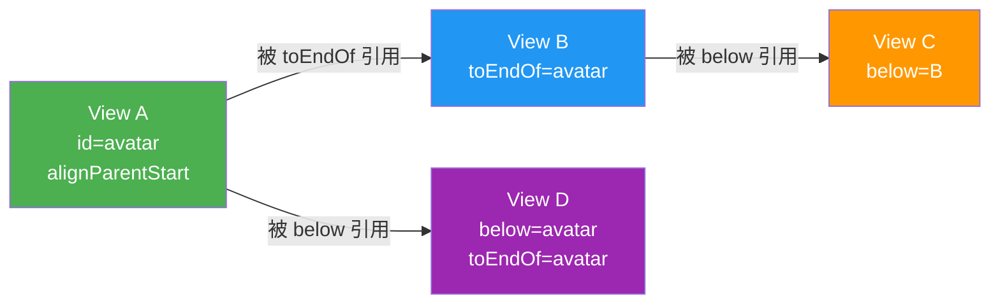

**依赖图的构建规则：**

| 子 View 属性 | 产生的依赖边 | 说明 |
|-------------|------------|------|
| `toEndOf=@id/avatar` | avatar → 当前View | 当前 View 依赖 avatar（需先测 avatar 宽度） |
| `toStartOf=@id/avatar` | avatar → 当前View | 当前 View 依赖 avatar 宽度 |
| `below=@id/avatar` | avatar → 当前View | 当前 View 依赖 avatar 高度 |
| `above=@id/avatar` | avatar → 当前View | 当前 View 依赖 avatar 高度 |
| `alignTop=@id/avatar` | avatar → 当前View | 当前 View 依赖 avatar 的 top 坐标 |
| `alignBottom=@id/avatar` | avatar → 当前View | 当前 View 依赖 avatar 的 bottom 坐标 |
| `alignParentStart` | 无（依赖父容器） | 不产生兄弟依赖边 |
| `centerInParent` | 无（依赖父容器） | 不产生兄弟依赖边 |

> **要点**：只有"兄弟定位"属性才会产生依赖边；"父容器定位"属性（`alignParentXxx`、`centerXxx`）依赖的是 RelativeLayout 自身，不会在兄弟依赖图中产生边。

### 2. 拓扑排序在测量中的应用

**术语解释：拓扑排序（Topological Sort）**

拓扑排序是一种把"有先后依赖关系"的任务排成一个线性序列的算法。类比"课程先修关系"：如果你把所有课程画成依赖图，拓扑排序会给你一个合法的上课顺序——保证每门课的先修课都排在它前面。

RelativeLayout 在构建完依赖图后，会对图执行**拓扑排序**，得到一个"测量顺序"，确保被依赖的 View 先被测量：

1. 找到所有**入度为 0** 的节点（没有任何 View 依赖它之前必须先测的 View，或者只依赖父容器的 View）。
2. 对这些节点执行 `measure()`。
3. 将已测量的节点从图中"移除"，更新剩余节点的入度。
4. 重复上述过程，直到所有节点都被测量。

> **入度（In-degree）**：指向某个节点的边的数量。入度为 0 表示"没有人需要先于它测量"，可以放心测量。类比：没有先修课的课程，你可以第一学期就选。

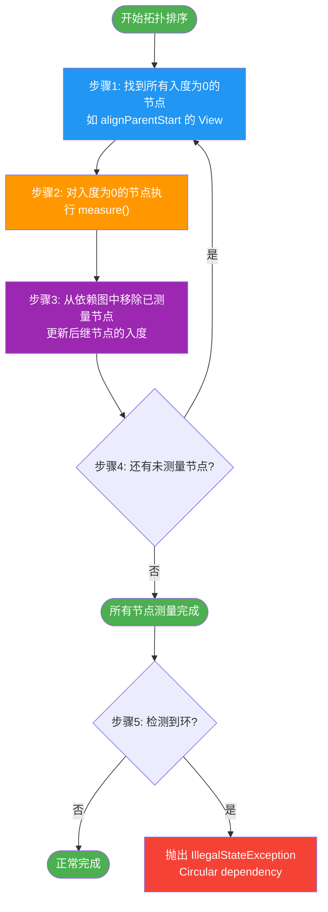

**一个具体例子**：假设有 4 个 View，依赖关系为 A←B, B←C, A←D（箭头表示依赖方向）：

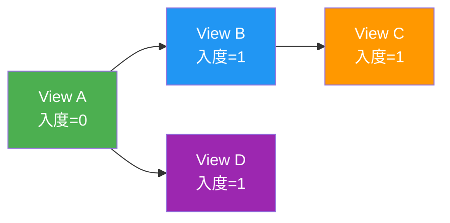

拓扑排序过程：
1. 入度为 0 的节点：A → 测量 A → 移除 A → B、D 的入度变为 0
2. 入度为 0 的节点：B、D → 测量 B、D → 移除 → C 的入度变为 0
3. 入度为 0 的节点：C → 测量 C → 完成

最终测量顺序：**A → B, D → C**

### 3. 两轮测量的具体实现

RelativeLayout 的测量分为**两轮**，这是为了处理"横向依赖"和"纵向依赖"可能交叉的情况：

- **第一轮**：测量所有没有依赖其他 View 的子 View（使用 `alignParentXxx`、`centerInParent` 等"父容器定位"属性的 View）。
- **第二轮**：测量依赖了第一轮结果的子 View（使用 `toEndOf`、`below` 等"兄弟定位"属性的 View）。

> **为什么需要两轮而不是一轮拓扑排序？** 因为 RelativeLayout 实际上维护了**两个独立的依赖图**：水平方向（横向）和垂直方向（纵向）。一个 View 可能在水平方向依赖 A，在垂直方向依赖 B，而 A 和 B 之间没有直接关系。为了简化实现，RelativeLayout 采用了"水平一轮 + 垂直一轮"的拆分策略。

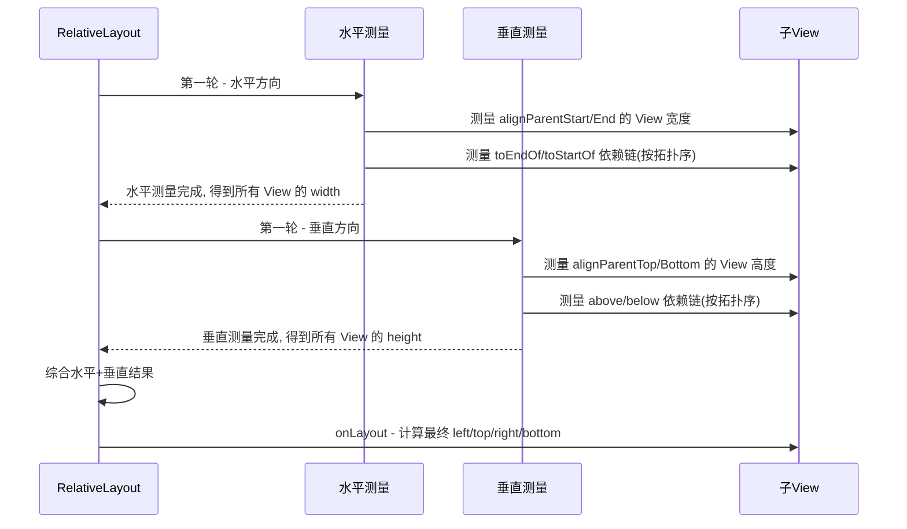

**两轮测量的代码逻辑（伪代码）：**

```java
// RelativeLayout.onMeasure() 简化伪代码
void onMeasure(int widthSpec, int heightSpec) {
    // ---- 第一轮：水平方向（横向）----
    // 1. 先测所有无水平依赖的 View（alignParentStart/End、centerHorizontal）
    // 2. 再按拓扑序测有水平依赖的 View（toEndOf/toStartOf）
    measureHorizontalDependencyGraph();

    // ---- 第一轮：垂直方向（纵向）----
    // 1. 先测所有无垂直依赖的 View（alignParentTop/Bottom、centerVertical）
    // 2. 再按拓扑序测有垂直依赖的 View（above/below）
    measureVerticalDependencyGraph();

    // 设置自身最终尺寸
    setMeasuredDimension(width, height);
}
```

### 4. 水平和垂直方向的独立测量

**术语解释：独立测量（Independent Measurement）**

RelativeLayout 把"水平位置"和"垂直位置"当作两个独立的问题来解。类比：你在表格里填格子时，先确定每一列的宽度（水平方向），再确定每一行的高度（垂直方向），两件事互不干扰。

由于水平方向和垂直方向各做一轮拓扑排序测量，理论上 RelativeLayout 最多会对某些子 View 执行 **2 轮 × 2 方向 = 最多 4 次 measure**（虽然实际实现会尽量复用结果，但概念上是分开的）。

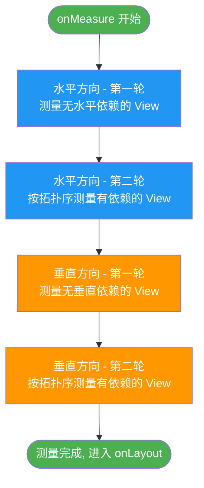

**为什么拆成水平和垂直两个方向独立处理？**

| 原因 | 说明 |
|------|------|
| 简化算法 | 水平依赖（`toEndOf`）只影响宽度，垂直依赖（`below`）只影响高度，拆开避免互相干扰 |
| 复用测量结果 | 一个 View 的宽度测量完成后，垂直测量可直接复用，无需重新计算 |
| 易于循环检测 | 水平环和垂直环可以分别检测，定位问题更清晰 |

### 5. 循环引用检测机制

**术语解释：循环引用（Circular Dependency / Cycle）**

循环引用指的是依赖关系形成了"环路"，导致无法确定测量顺序。类比："先有鸡还是先有蛋"的问题——如果鸡的存在依赖蛋，蛋的存在又依赖鸡，就永远无法确定先创造谁。

RelativeLayout 在拓扑排序过程中会检测循环：如果某一轮找不到任何入度为 0 的节点，但还有未测量的节点，说明剩余节点互相依赖形成了环。

下面展示 A→B→C→A 的循环如何被检测出来：

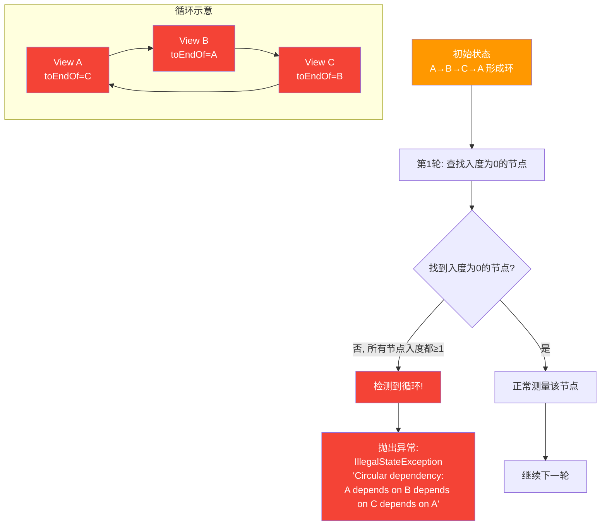

**循环引用的常见场景与修复：**

```xml
<!-- 错误：A 依赖 B，B 又依赖 A，形成环 -->
<TextView android:id="@+id/a" android:layout_toEndOf="@id/b" />
<TextView android:id="@+id/b" android:layout_toEndOf="@id/a" />

<!-- 修复：打破环，让其中一个依赖父容器 -->
<TextView android:id="@+id/a" android:layout_alignParentStart="true" />
<TextView android:id="@+id/b" android:layout_toEndOf="@id/a" />
```

> **要点**：循环引用不只发生在直接的两两引用（A↔B），也可能经过多个中间 View（A→B→C→A）。 RelativeLayout 的检测算法会捕获任意长度的环。

### 6. 与 ConstraintLayout 约束求解器的对比

**术语解释：约束求解器（Constraint Solver）**

约束求解器是一种数学工具，用来在一系列"约束条件"下找到一组满足所有约束的解。类比：数独游戏就是一种约束求解——每一行、每一列、每个九宫格的数字都不能重复，求解器要找到满足所有这些约束的填法。

RelativeLayout 和 ConstraintLayout 解决的是同一类问题（确定子 View 的位置和尺寸），但使用了完全不同的算法策略：

- **RelativeLayout**：基于依赖图的拓扑排序，"谁依赖谁就先测谁"，是一种**贪心的、顺序的**求解方式。
- **ConstraintLayout**：使用 **Cassowary 线性规划求解器**，把所有约束（包括等式和不等式）转化为线性方程组/不等式组，用单纯形法等算法一次性求解，是一种**全局的、优化的**求解方式。

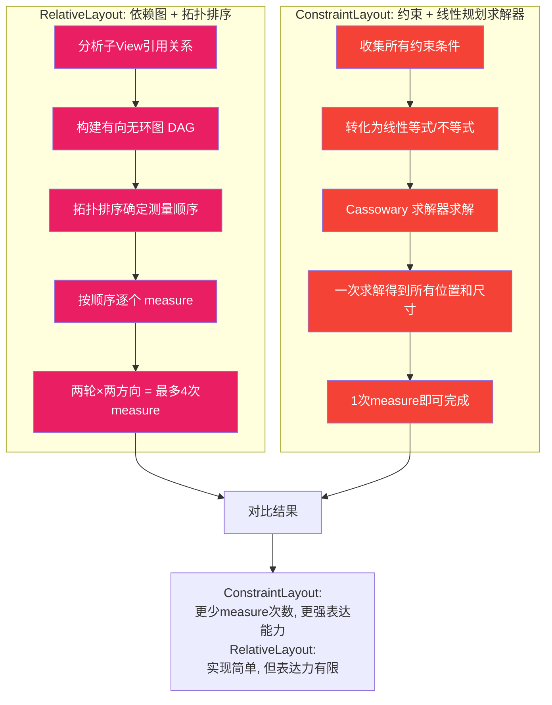

**两种求解策略的详细对比：**

| 对比维度 | RelativeLayout（依赖图） | ConstraintLayout（约束求解器） |
|---------|----------------------|---------------------------|
| 核心算法 | 拓扑排序 + 顺序测量 | 线性规划（单纯形法） |
| 测量次数 | 2 轮 × 2 方向（最多4次） | 通常 1 次 |
| 表达能力 | 只能表达"相对位置" | 可表达等式、不等式、比例、链、屏障等 |
| 求解方式 | 贪心（按依赖顺序逐个解） | 全局优化（一次性求解所有约束） |
| 循环处理 | 检测到环则抛异常 | 约束冲突时由求解器决定优先级 |
| 性能 | 中等（多轮测量开销） | 较优（单次求解，但求解器本身有开销） |
| 适用场景 | 简单相对定位 | 复杂约束、动态内容、扁平化布局 |

**类比总结**：
- RelativeLayout 像是"按施工图顺序盖楼"——一层一层往上盖，必须等下层完成才能盖上层。
- ConstraintLayout 像是"用方程组解建筑设计"——把所有结构要求列成方程，一次性算出每根柱子该放哪。

> **要点**：ConstraintLayout 的约束求解器不仅能处理 RelativeLayout 能做的所有事，还能处理 RelativeLayout 做不到的事（如比例约束 `app:layout_constraintHorizontal_bias="0.3"`、Barrier、Chain 等），这也是 Google 推荐用 ConstraintLayout 替代 RelativeLayout 的根本原因。

---

## 📐 设计理念与架构图

> 本节从架构设计角度剖析 RelativeLayout 的设计理念、类继承结构、向 ConstraintLayout 的演进路径，以及 RTL 适配的底层逻辑。

### 1. 有向无环图（DAG）设计理念

RelativeLayout 的核心设计理念是：**把"视图之间的相对位置关系"建模为有向无环图（DAG），通过图算法确定测量和布局顺序**。

**术语解释：有向无环图（DAG, Directed Acyclic Graph）**

DAG 是一种特殊的数据结构：边有方向，且从任意节点出发沿着边走，永远不会回到自己。类比：一个家族的"族谱"就是 DAG——父亲指向儿子，但不会有"自己是自己祖先"的情况。如果族谱里出现环路，就说明逻辑出错了。

RelativeLayout 选择 DAG 的原因：

| 设计目标 | DAG 如何满足 |
|---------|-----------|
| 确定测量顺序 | 拓扑排序给出合法的线性测量顺序 |
| 避免无限循环 | 无环特性保证测量必定终止 |
| 表达依赖关系 | 有向边天然表达"A 依赖 B" |
| 简化实现 | 水平/垂直方向各一个 DAG，互不干扰 |

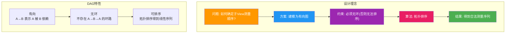

### 2. LayoutParams 的核心属性与继承关系

RelativeLayout 通过自定义 `LayoutParams` 来存储每个子 View 的相对定位属性。下面用类图展示其继承关系和核心属性。

**术语解释：LayoutParams（布局参数）**

LayoutParams 是 ViewGroup 用来描述"子 View 应该如何被父容器摆放"的配置对象。类比：每个学生入学时会填一张"选课偏好表"——这张表不是给学生自己看的，而是给教务处（父容器）看的，教务处根据表里的信息安排课表（布局）。

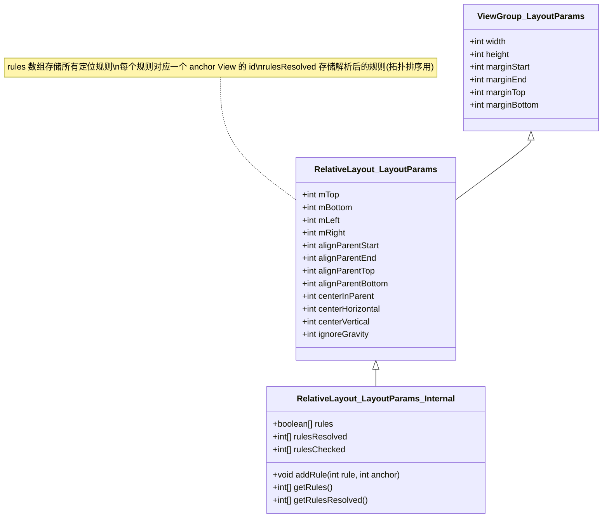

**rules 数组的工作原理**：

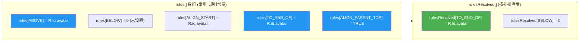

### 3. RelativeLayout → ConstraintLayout 的演进路径

ConstraintLayout 在设计上吸收了 RelativeLayout 的"相对定位"理念，并将其扩展为更强大的"约束系统"。下面展示两者的属性映射关系。

```mermaid
graph TD
    subgraph RelativeLayout["RelativeLayout 属性"]
        RL1["layout_toEndOf=@id/view"]
        RL2["layout_toStartOf=@id/view"]
        RL3["layout_below=@id/view"]
        RL4["layout_above=@id/view"]
        RL5["layout_alignParentStart=true"]
        RL6["layout_alignParentEnd=true"]
        RL7["layout_centerInParent=true"]
        RL8["layout_alignTop=@id/view"]
    end

    subgraph ConstraintLayout["ConstraintLayout 约束"]
        CL1["app:constraintStart_toEndOf=@id/view"]
        CL2["app:constraintStart_toStartOf=@id/view"]
        CL3["app:constraintTop_toBottomOf=@id/view"]
        CL4["app:constraintBottom_toTopOf=@id/view"]
        CL5["app:constraintStart_toStartOf=parent"]
        CL6["app:constraintEnd_toEndOf=parent"]
        CL7["约束四边到parent + bias=0.5"]
        CL8["app:constraintTop_toTopOf=@id/view"]
    end

    RL1 -->|语义映射| CL1
    RL2 -->|语义映射| CL2
    RL3 -->|语义映射| CL3
    RL4 -->|语义映射| CL4
    RL5 -->|语义映射| CL5
    RL6 -->|语义映射| CL6
    RL7 -->|语义映射| CL7
    RL8 -->|语义映射| CL8

    style RL1 fill:#E91E63,color:#fff
    style RL2 fill:#E91E63,color:#fff
    style RL3 fill:#E91E63,color:#fff
    style RL4 fill:#E91E63,color:#fff
    style RL5 fill:#E91E63,color:#fff
    style RL6 fill:#E91E63,color:#fff
    style RL7 fill:#E91E63,color:#fff
    style RL8 fill:#E91E63,color:#fff
    style CL1 fill:#4CAF50,color:#fff
    style CL2 fill:#4CAF50,color:#fff
    style CL3 fill:#4CAF50,color:#fff
    style CL4 fill:#4CAF50,color:#fff
    style CL5 fill:#4CAF50,color:#fff
    style CL6 fill:#4CAF50,color:#fff
    style CL7 fill:#4CAF50,color:#fff
    style CL8 fill:#4CAF50,color:#fff
```

**属性映射表：**

| RelativeLayout 属性 | ConstraintLayout 约束 | 语义差异说明 |
|--------------------|---------------------|-----------|
| `layout_toEndOf=@id/A` | `app:layout_constraintStart_toEndOf=@id/A` | 语义一致：当前 View 的 Start 约束到 A 的 End |
| `layout_toStartOf=@id/A` | `app:layout_constraintEnd_toStartOf=@id/A` | 语义一致：当前 View 的 End 约束到 A 的 Start |
| `layout_below=@id/A` | `app:layout_constraintTop_toBottomOf=@id/A` | 语义一致：当前 View 的 Top 约束到 A 的 Bottom |
| `layout_above=@id/A` | `app:layout_constraintBottom_toTopOf=@id/A` | 语义一致：当前 View 的 Bottom 约束到 A 的 Top |
| `layout_alignParentStart=true` | `app:layout_constraintStart_toStartOf=parent` | ConstraintLayout 显式写出 `parent` |
| `layout_alignParentEnd=true` | `app:layout_constraintEnd_toEndOf=parent` | 同上 |
| `layout_centerInParent=true` | 四边约束到 parent + `bias=0.5` | ConstraintLayout 用约束+bias 实现居中 |
| `layout_alignTop=@id/A` | `app:layout_constraintTop_toTopOf=@id/A` | 语义一致：Top 对齐 |
| `layout_alignBottom=@id/A` | `app:layout_constraintBottom_toBottomOf=@id/A` | 语义一致：Bottom 对齐 |

> **关键差异**：ConstraintLayout 的约束是**双向的**（你约束了 Start，还需要约束 End 才能确定宽度），而 RelativeLayout 的属性是**单向声明式**的。这就是为什么 ConstraintLayout 表达力更强——它可以同时约束两边来控制尺寸，而 RelativeLayout 做不到。

### 4. RelativeLayout 被逐步取代的原因

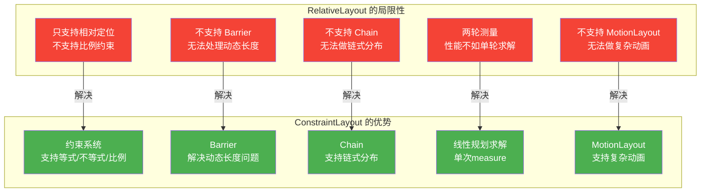

**Barrier 解决动态长度问题的说明：**

> **场景**：两个文本 View（用户名、邮箱）并排，右侧有一个按钮要对齐到"两个文本中较宽的那个"。在 RelativeLayout 中无法实现，因为较宽的那个会动态变化。ConstraintLayout 的 Barrier 可以引用一组 View，自动定位到它们的"最远边界"。

### 5. RTL 适配的设计

**术语解释：RTL（Right-to-Left，从右到左）**

RTL 是指文字和布局从右向左排列的书写方向，常见于阿拉伯语、希伯来语等语言。与之相对的是 LTR（Left-to-Right，从左到右），中文、英文等语言使用 LTR。

Google 用 `Start` / `End` 替代 `Left` / `Right` 的原因：

| 维度 | Left / Right（旧） | Start / End（新） |
|------|------------------|-----------------|
| 语义 | 绝对物理方向 | 逻辑方向（随布局方向变化） |
| LTR 下含义 | Left=左, Right=右 | Start=左, End=右 |
| RTL 下含义 | Left=左, Right=右（不变） | Start=右, End=左（自动翻转） |
| 适配 RTL | 需手动处理 | 自动适配 |

**RTL 的底层渲染逻辑：**

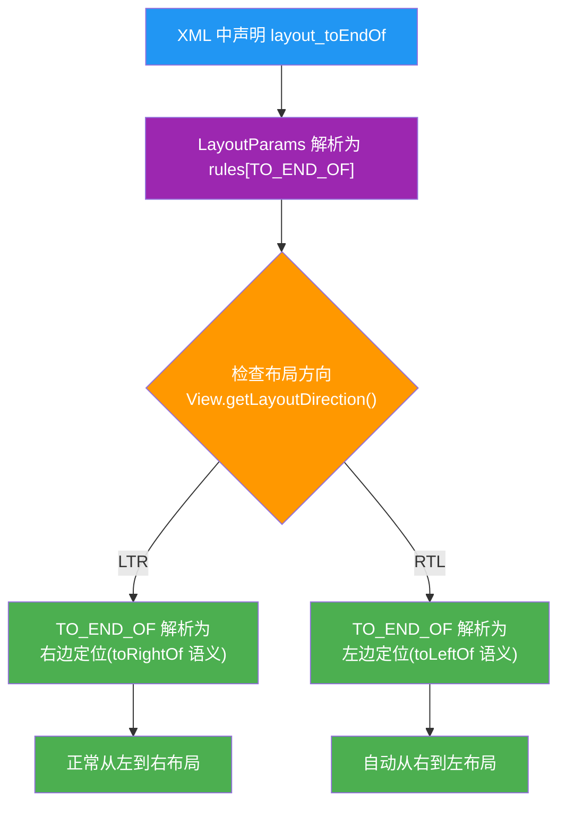

**为什么用 Start/End 而不是 Left/Right？**

```plaintext
LTR 布局（如中文、英文）：
  [Start/左] ──── 内容 ────→ [End/右]

RTL 布局（如阿拉伯语）：
  [End/左] ←──── 内容 ──── [Start/右]

使用 Left/Right 时：
  - LTR 和 RTL 下 Left 永远是左、Right 永远是右
  - 布局不会自动翻转，需要为 RTL 单独写一套布局

使用 Start/End 时：
  - LTR 下 Start=左、End=右
  - RTL 下 Start=右、End=左
  - 同一套 XML 自动适配两种布局方向
```

> **要点**：RTL 适配的核心是"逻辑方向 vs 物理方向"。`Start/End` 是逻辑方向（由 `layoutDirection` 决定具体指向），`Left/Right` 是物理方向（永远是屏幕的绝对左右）。使用逻辑方向，一套布局可以同时适配 LTR 和 RTL 语言，无需维护两套 XML。

---

## 📝 跨章节综合考核训练

> 以下 8 道考核题均关联至少 2 个章节的内容，用于检验跨章节知识的综合运用能力。建议先独立思考，再对照参考答案要点。

### 考核题 1：RelativeLayout 两轮测量 vs LinearLayout weight 两轮测量的差异

**涉及章节**：02-RelativeLayout + 01-LinearLayout

**题目**：

RelativeLayout 的 `onMeasure()` 需要两轮测量（先测无依赖的 View，再测有依赖的 View），而 LinearLayout 在使用 `layout_weight` 时也需要两轮测量（先测未设 weight 的 View，剩余空间再按 weight 分配）。请详细分析这两种"两轮测量"在**触发条件、测量内容、性能影响**三个维度上的差异，并说明：对于一个"左侧固定宽度图标 + 右侧填充剩余空间的文本"的布局，应该选择哪种方案？为什么？

**参考答案要点**：

- **触发条件不同**：RelativeLayout 的两轮测量是**必然发生**的（只要存在兄弟定位依赖就触发），目的是解决依赖顺序；LinearLayout 的两轮测量只在**使用了 `layout_weight`** 时触发，目的是分配剩余空间。
- **测量内容不同**：RelativeLayout 两轮测的是"不同 View"（第一轮测无依赖的、第二轮测有依赖的）；LinearLayout 两轮测的是"同一批 View 的两次"（第一次按 `match_parent/wrap_content` 测，第二次按 weight 重新分配宽度）。
- **性能影响不同**：RelativeLayout 两轮测量是"全量"的（所有子 View 都可能被测两次），而 LinearLayout 的 weight 测量是对"设置了 weight 的 View"做额外一次测量。
- **方案选择**：对于"固定宽度图标 + 填充剩余文本"的场景，推荐使用 **LinearLayout + weight**，因为只需一次水平排列、结构简单；RelativeLayout 虽然也能实现（`toEndOf` + `match_parent`），但会引入不必要的两轮测量开销。
- **深层理解**：RelativeLayout 的两轮测量是"依赖驱动"的，LinearLayout 的两轮测量是"权重驱动"的，两者本质不同。

---

### 考核题 2：循环引用与 ConstraintLayout 的循环约束对比

**涉及章节**：02-RelativeLayout + 04-ConstraintLayout

**题目**：

RelativeLayout 中 A `toEndOf` B、B `toEndOf` A 会抛出 `IllegalStateException: Circular dependency`。那么在 ConstraintLayout 中，如果 A 的 `constraintStart_toEndOf` B，同时 B 的 `constraintStart_toEndOf` A，会发生什么？两种布局对"循环依赖"的处理策略有何本质区别？

**参考答案要点**：

- **RelativeLayout 的处理**：在拓扑排序阶段检测到环，直接抛出 `IllegalStateException` 导致应用崩溃，属于"硬失败"。
- **ConstraintLayout 的处理**：约束求解器（Cassowary）不会直接崩溃，而是会尝试"打破"约束——通常表现为两个 View 重叠或位置异常，属于"软失败"（结果不正确但不崩溃）。
- **本质区别**：RelativeLayout 用图算法做"结构验证"（有环就无法排序），ConstraintLayout 用线性规划做"数值求解"（有冲突就取某种妥协解）。
- **实践建议**：无论哪种布局，循环约束都应该在代码审查阶段避免；ConstraintLayout 虽然不崩溃，但产生的布局结果不可预期，更难调试。
- **延伸**：ConstraintLayout 的"软失败"特性使得它在处理复杂约束时更"宽容"，但也意味着开发者需要更仔细地验证最终布局效果。

---

### 考核题 3：RTL 适配在 RelativeLayout 和屏幕适配中的体现

**涉及章节**：02-RelativeLayout + 08-屏幕适配

**题目**：

RelativeLayout 推荐使用 `toStartOf`/`toEndOf` 替代 `toLeftOf`/`toRightOf` 以支持 RTL。请结合第 08 章"屏幕适配"的内容，说明：(1) RTL 适配在 Android 系统中是如何被触发的（用户做了什么操作）？(2) RelativeLayout 内部如何根据布局方向自动翻转？(3) 如果一个 App 同时使用了 `toStartOf`（新）和 `toRightOf`（旧）混合属性，在 RTL 下会出现什么问题？

**参考答案要点**：

- **RTL 触发方式**：用户在系统设置中将语言切换为阿拉伯语/希伯来语等 RTL 语言，或开发者通过 `android:layoutDirection="rtl"` 手动指定；系统会自动将 `layoutDirection` 设为 RTL。
- **RelativeLayout 内部翻转**：`LayoutParams` 的 `rules[]` 数组中，`TO_END_OF` 在 LTR 下解析为"在右边"，在 RTL 下通过 `resolveLayoutDirection()` 解析为"在左边"，实现自动翻转。
- **混合属性的问题**：`toStartOf` 会随布局方向翻转，`toRightOf` 永远指向物理右边；两者混用会导致 RTL 下部分 View 正确翻转、部分 View 位置错乱，产生布局不一致。
- **第 08 章关联**：屏幕适配不仅包括尺寸适配，还包括"布局方向适配"；RTL 是多语言适配的重要一环，应在 `res/layout/` 中统一使用 Start/End，必要时提供 `res/layout-ldrtl/` 专用布局。
- **验证方法**：在开发者选项中开启"强制 RTL 布局方向"，可以快速验证布局的 RTL 兼容性。

---

### 考核题 4：toEndOf 与 ConstraintLayout constraintStart_toEndOf 的语义差异

**涉及章节**：02-RelativeLayout + 04-ConstraintLayout

**题目**：

`layout_toEndOf="@id/avatar"` 和 `app:layout_constraintStart_toEndOf="@id/avatar"` 看起来都在表达"当前 View 在 avatar 的右侧"。请深入分析它们在**约束语义、尺寸确定方式、缺失约束时的行为**三个方面的差异。特别是：在 RelativeLayout 中只写 `toEndOf` 不写其他属性，和在 ConstraintLayout 中只写 `constraintStart_toEndOf` 不写其他约束，分别会发生什么？

**参考答案要点**：

- **约束语义差异**：`toEndOf` 是"声明式定位"（只声明位置关系，不约束尺寸）；`constraintStart_toEndOf` 是"约束式定位"（约束了 Start 边的位置，但 End 边未约束）。
- **尺寸确定方式**：RelativeLayout 中 `toEndOf` 只影响位置，View 宽度由 `layout_width`（`wrap_content`/`match_parent`）决定；ConstraintLayout 中约束决定位置，宽度由"两端约束是否存在"决定——只约束一端时，View 表现为 `wrap_content`。
- **只写 toEndOf 的行为**：RelativeLayout 中 View 会被放在 avatar 右侧，宽度按 `layout_width` 决定，位置和尺寸都能确定（不会异常）。
- **只写 constraintStart_toEndOf 的行为**：ConstraintLayout 中 View 的 Start 边固定在 avatar 右侧，但 End 边无约束，View 会表现为 `wrap_content` 且无法拉伸填满——开发者通常需要额外约束 `constraintEnd_toEndOf=parent` 才能让 View 填充剩余空间。
- **核心结论**：ConstraintLayout 的约束是"逐边的"，需要理解"约束两端才能固定尺寸"；RelativeLayout 的属性是"整体的"，一条属性即可确定位置。这正是 ConstraintLayout 表达力更强但学习曲线更陡的原因。

---

### 考核题 5：RelativeLayout 嵌套层级 vs LinearLayout 嵌套的性能权衡

**涉及章节**：02-RelativeLayout + 01-LinearLayout

**题目**：

第 01 章提到 LinearLayout 的性能优势在于"单轮测量"，但嵌套层级多会导致测量次数叠加（3 层嵌套 = 3 次测量）。第 02 章提到 RelativeLayout 扁平化但需要两轮测量。请分析：对于一个"需要 3 层 LinearLayout 嵌套才能实现的复杂布局"，改用 RelativeLayout（扁平化，2 轮）后，性能是提升了还是下降了？请从**测量总次数、每轮测量的 View 数量、实际耗时**三个维度量化分析。

**参考答案要点**：

- **测量总次数**：3 层 LinearLayout 嵌套 = 至少 3 次 measure 传递（每层各 1 次）；RelativeLayout 扁平化 = 2 轮 × 2 方向 = 最多 4 次 measure，但这是"同一层级"内的，不涉及嵌套传递。
- **每轮测量的 View 数量**：LinearLayout 嵌套时，每层只测自己的直接子 View（数量少）；RelativeLayout 扁平化后一次性测所有子 View（数量多），但省去了嵌套递归。
- **实际耗时**：取决于子 View 总数和嵌套深度。一般来说，**嵌套深度 ≥ 3 时，RelativeLayout 扁平化更优**（省去了多层递归的开销）；**嵌套深度 ≤ 2 且子 View 少时，LinearLayout 更优**（单轮测量更轻量）。
- **量化示例**：假设 9 个 View，3 层 LinearLayout（每层 3 个）= 3 次 measure 递归；RelativeLayout 扁平化（9 个直接子 View）= 2 轮 measure。当 View 较简单时两者差异不大，当 View 较复杂（如含图片加载）时 RelativeLayout 更优。
- **最佳实践**：不要盲目选择，简单线性布局用 LinearLayout，复杂相对定位用 RelativeLayout 或 ConstraintLayout；使用 Layout Inspector 检查实际嵌套深度。

---

### 考核题 6：centerInParent 在 ConstraintLayout 中的等价实现

**涉及章节**：02-RelativeLayout + 04-ConstraintLayout

**题目**：

RelativeLayout 中 `layout_centerInParent="true"` 可以让一个 View 在父容器中水平+垂直居中。请给出在 ConstraintLayout 中实现完全等价效果的三种不同写法，并分析每种写法的优劣。同时说明：为什么 ConstraintLayout 没有 `centerInParent` 这样的"一键居中"属性？

**参考答案要点**：

- **写法一（四边约束到 parent）**：
  ```xml
  app:layout_constraintStart_toStartOf="parent"
  app:layout_constraintEnd_toEndOf="parent"
  app:layout_constraintTop_toTopOf="parent"
  app:layout_constraintBottom_toBottomOf="parent"
  ```
  默认 bias=0.5，实现居中。优点：语义清晰；缺点：代码较多。
- **写法二（使用 bias 显式控制）**：在写法一基础上显式设置 `app:layout_constraintHorizontal_bias="0.5"` 和 `app:layout_constraintVertical_bias="0.5"`。优点：明确表达意图；缺点：冗余（bias 默认就是 0.5）。
- **写法三（使用 Guideline + 约束到 Guideline）**：创建水平和垂直 Guideline 定位在 50%，View 约束到两条 Guideline。优点：适合多个 View 共享居中线；缺点：过度设计。
- **为什么没有"一键居中"**：ConstraintLayout 的设计哲学是"约束组合"——居中只是"四边约束 + bias=0.5"的一种特例。提供 `centerInParent` 会破坏约束系统的统一性，且无法表达"水平居中但垂直偏上"等灵活需求。
- **核心理解**：RelativeLayout 的 `centerInParent` 是"预设快捷方式"，ConstraintLayout 的四边约束是"通用解决方案"；后者表达力更强，但牺牲了简洁性。

---

### 考核题 7：RelativeLayout 被 ConstraintLayout 取代的具体场景分析

**涉及章节**：02-RelativeLayout + 04-ConstraintLayout

**题目**：

虽然 ConstraintLayout 被官方推荐替代 RelativeLayout，但在实际项目中并非所有场景都适合迁移。请列举 3 个"应该迁移到 ConstraintLayout"的场景和 2 个"可以保留 RelativeLayout"的场景，并分别说明理由。重点分析 Barrier 和 Chain 如何解决 RelativeLayout 的固有局限。

**参考答案要点**：

- **应该迁移的场景一（动态长度对齐）**：两个文本 View（用户名、邮箱）长度可变，右侧按钮需要对齐到"较宽的那个"。RelativeLayout 无法实现，ConstraintLayout 的 `Barrier`（引用一组 View，定位到最远边界）完美解决。
- **应该迁移的场景二（链式分布）**：多个按钮均匀分布在屏幕宽度上。RelativeLayout 需要手动计算间距或嵌套 LinearLayout，ConstraintLayout 的 `Chain`（`spread`/`spread_inside`/`packed`）一行属性搞定。
- **应该迁移的场景三（比例约束）**：两个 View 按 3:7 比例分配屏幕宽度。RelativeLayout 无法表达比例，ConstraintLayout 用 `app:layout_constraintHorizontal_weight` 实现。
- **可以保留 RelativeLayout 的场景一（简单相对定位）**：只有 3-5 个 View 的简单布局，`toEndOf`/`below` 即可满足，引入 ConstraintLayout 反而增加依赖和学习成本。
- **可以保留 RelativeLayout 的场景二（遗留代码维护）**：老项目已大量使用 RelativeLayout 且运行稳定，没有性能瓶颈时不必为迁移而迁移，遵循"不过度重构"原则。
- **Barrier 核心价值**：解决了"动态长度 View 的对齐"问题——这是 RelativeLayout 用任何属性组合都无法实现的。
- **Chain 核心价值**：解决了"一组 View 的分布"问题——RelativeLayout 需要嵌套 LinearLayout 才能实现类似效果。

---

### 考核题 8：RelativeLayout 在 ScrollView 中的使用

**涉及章节**：02-RelativeLayout + 05-ScrollView

**题目**：

当 RelativeLayout 被放入 ScrollView 中时，需要让内容可以滚动。请分析：(1) ScrollView 的测量机制如何影响 RelativeLayout 的 `layout_height` 取值（`match_parent` vs `wrap_content`）？(2) 如果 RelativeLayout 内部有 `alignParentBottom="true"` 的子 View，在 ScrollView 中会出现什么问题？如何解决？(3) 结合第 05 章 ScrollView 的内容，说明为什么 ScrollView 只允许一个直接子 View，以及 RelativeLayout 在其中扮演的角色。

**参考答案要点**：

- **layout_height 取值影响**：ScrollView 本质是一个可滚动的 FrameLayout，它给子 View 传递的 heightMeasureSpec 是 `UNSPECIFIED`（不限制高度）。因此 RelativeLayout 应使用 `wrap_content` 而非 `match_parent`——`match_parent` 在 UNSPECIFIED 下无意义，不会撑满滚动区域。
- **alignParentBottom 的问题**：在 ScrollView 中，RelativeLayout 的高度是 `wrap_content`（由内容决定），此时 `alignParentBottom` 会把子 View 贴在"内容底部"而非"屏幕底部"，导致子 View 出现在滚动内容的最下方而非可视区域底部。解决方法：改用 `NestedScrollView` + `CoordinatorLayout`，或使用 `ConstraintLayout` 的约束到 `parent` + `bias`。
- **ScrollView 只允许一个子 View**：因为 ScrollView 需要管理单个可滚动内容的测量和布局，多个直接子 View 会导致滚动行为不确定。RelativeLayout 作为"唯一子 View"承担了"把多个内容 View 组织成一个可滚动整体"的职责。
- **RelativeLayout 的角色**：在 ScrollView 中，RelativeLayout 充当"内容容器"——它把所有需要滚动的内容 View 收集到一起，形成一个整体交给 ScrollView 滚动。这利用了 RelativeLayout 的扁平化特性，避免在 ScrollView 内再嵌套多层 LinearLayout。
- **实践建议**：现代开发中，滚动内容布局更推荐用 `ConstraintLayout` 作为 ScrollView 的唯一子 View，或直接使用 `RecyclerView`；RelativeLayout 适用于内容简单、不需要回收的滚动场景。

---

## 参考文献与延伸阅读

### 官方文档与源码
1. **[Android 官方文档 - RelativeLayout 指南](https://developer.android.com/guide/topics/ui/layout/relative)**
   - Google 官方 RelativeLayout 使用指南，涵盖相对定位属性和嵌套布局最佳实践。
2. **[AOSP 源码 - RelativeLayout.java](https://cs.android.com/android/platform/superproject/+/main:frameworks/base/core/java/android/widget/RelativeLayout.java)**
   - RelativeLayout 的 AOSP 源码，包含依赖图构建、拓扑排序测量及水平/垂直双向测量的完整实现。
3. **[AOSP 源码 - RelativeLayout.LayoutParams](https://cs.android.com/android/platform/superproject/+/main:frameworks/base/core/java/android/widget/RelativeLayout.java)**
   - RelativeLayout.LayoutParams 的 rules 数组实现，存储了所有相对定位规则。

### 依赖图与测量算法
4. **[Android RelativeLayout 源码解析：依赖图与拓扑排序 - CSDN](https://blog.csdn.net/qq_29882585/article/details/108419556)**
   - 从源码角度分析 RelativeLayout 如何构建子 View 依赖图并使用拓扑排序确定测量顺序。

### RTL 适配
5. **[Android 官方文档 - 支持从右到左 (RTL) 布局](https://developer.android.com/guide/topics/ui/look-and-feel/rtl-support)**
   - Google 官方 RTL 适配指南，说明 start/end 替代 left/right 的设计理念及实现方式。
