# FrameLayout 帧布局完全指南

> 🎯 **难度**: ⭐ 入门 | ⏱️ **时间预估**: 30分钟

---

## 📚 学习目标

完成本课后，你将能够：
- 理解 FrameLayout 的层叠显示原理
- 掌握 `layout_gravity` 的所有位置值
- 区分 FrameLayout 与 ConstraintLayout 在层叠场景的差异
- 实现帧动画（AnimationDrawable）效果
- 构建加载遮罩和进度条

## 📋 前置知识

- Android 项目基本结构
- XML 布局基础语法
- View 的基本属性（width、height）

## 🎓 难度分级

| 知识点 | 难度 | 重要性 |
|--------|------|--------|
| 基础层叠 | ⭐ | 🔥🔥🔥 |
| layout_gravity | ⭐⭐ | 🔥🔥🔥 |
| 帧动画 | ⭐⭐ | 🔥🔥 |
| 嵌套使用 | ⭐⭐⭐ | 🔥🔥 |

---

## 1. 一句话定义

**FrameLayout（帧布局）是最简单的布局容器，所有子 View 从左上角开始层叠堆放，后添加的 View 会覆盖在先添加的 View 之上。**

## 2. 为什么需要

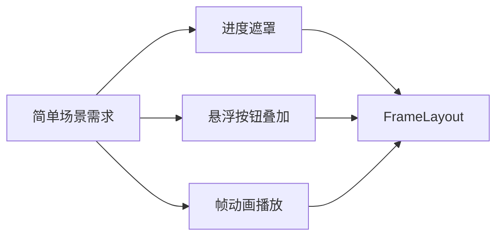

当你需要：
- 在图片上叠加文字
- 显示加载进度条遮罩
- 播放逐帧动画
- 临时简单布局（不需复杂排列）

FrameLayout 是最轻量、最高效的选择。

## 3. 核心概念

### 3.1 层叠显示原理

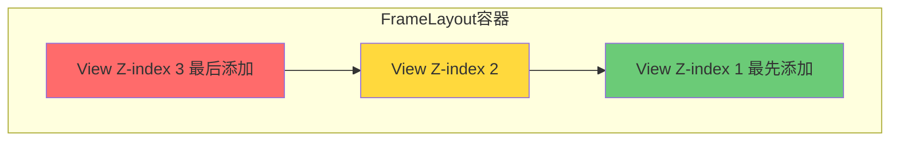

子 View 按添加顺序从下往上堆叠，就像一摞纸牌。

**术语解释：**
- **层叠显示（Stacking）**：所有子 View 从左上角开始堆叠，就像一摞纸牌。最先添加的 View 在最底层，最后添加的在最顶层。如果两个 View 位置重叠，后添加的会覆盖先添加的。
- **Z-index**：控制层叠顺序的索引值。Z-index 越大，View 越靠上层。在 FrameLayout 中，Z-index 由添加顺序决定：XML 中越靠后的 View，Z-index 越大。
- **纸牌比喻**：想象一摞扑克牌，最底下的牌是第一个添加的 View，最上面的牌是最后一个添加的 View。你只能看到最上面的牌（最顶层的 View），除非它被移开或设为透明。

### 3.2 layout_gravity 位置值

| 位置值 | 说明 | 常用场景 |
|--------|------|----------|
| `top` | 顶部对齐 | 标题栏 |
| `bottom` | 底部对齐 | 导航栏 |
| `start` | 起始端（左/右） | RTL 支持 |
| `end` | 结束端 | RTL 支持 |
| `center` | 水平居中 | 对话框内容 |
| `center_vertical` | 垂直居中 | 侧边栏 |
| `center_horizontal` | 水平居中 | 顶部标题 |
| `fill` | 填满父容器 | 背景层 |
| `clip_vertical` | 垂直裁剪 | 圆角图片 |
| `clip_horizontal` | 水平裁剪 | 圆角图片 |

**术语解释：**
- **layout_gravity**：控制子 View 在 FrameLayout 中的位置。FrameLayout 默认把所有子 View 放在左上角 (0,0)，通过 layout_gravity 可以让子 View 浮动到其他位置。
- **center**：同时设置 center_horizontal 和 center_vertical，让 View 在 FrameLayout 中完全居中。
- **clip_vertical / clip_horizontal**：当 View 超出 FrameLayout 边界时，是否裁剪超出部分。用于实现圆角图片等效果。

### 3.3 复合使用

```kotlin
// 组合位置值实现精确控制
params = FrameLayout.LayoutParams(
    FrameLayout.LayoutParams.WRAP_CONTENT,
    FrameLayout.LayoutParams.WRAP_CONTENT
).apply {
    gravity = Gravity.BOTTOM or Gravity.CENTER_HORIZONTAL  // 底部水平居中
    setMargins(0, 0, 0, 16.dp)
}
```

## 4. 基础用法

### 4.1 XML 基础布局

```xml
<!-- 基础帧布局：两个 View 层叠 -->
<FrameLayout
    android:layout_width="match_parent"
    android:layout_height="match_parent"
    android:background="#FFFFFF">

    <!-- 底层：背景图片 -->
    <ImageView
        android:layout_width="match_parent"
        android:layout_height="match_parent"
        android:scaleType="centerCrop"
        android:src="@drawable/background" />

    <!-- 顶层：叠加文字 -->
    <TextView
        android:layout_width="wrap_content"
        android:layout_height="wrap_content"
        android:layout_gravity="center"
        android:text="叠加文字"
        android:textColor="#FFFFFF"
        android:textSize="24sp" />
</FrameLayout>
```

### 4.2 Kotlin 代码动态添加

```kotlin
// 动态创建 FrameLayout
val frameLayout = FrameLayout(this).apply {
    layoutParams = FrameLayout.LayoutParams(
        FrameLayout.LayoutParams.MATCH_PARENT,
        FrameLayout.LayoutParams.MATCH_PARENT
    )
}

// 添加子 View
val textView = TextView(this).apply {
    text = "动态添加的文字"
    layoutParams = FrameLayout.LayoutParams(
        FrameLayout.LayoutParams.WRAP_CONTENT,
        FrameLayout.LayoutParams.WRAP_CONTENT
    ).apply {
        gravity = Gravity.CENTER
    }
}

frameLayout.addView(textView)
setContentView(frameLayout)
```

## 5. 实战场景示例

### 5.1 加载遮罩效果

```xml
<!-- 带加载遮罩的 FrameLayout -->
<FrameLayout
    android:id="@+id/container"
    android:layout_width="match_parent"
    android:layout_height="match_parent">

    <!-- 主内容 -->
    <LinearLayout
        android:id="@+id/content"
        android:layout_width="match_parent"
        android:layout_height="match_parent">
        <!-- 内容区域 -->
    </LinearLayout>

    <!-- 加载遮罩 -->
    <FrameLayout
        android:id="@+id/loading_mask"
        android:layout_width="match_parent"
        android:layout_height="match_parent"
        android:background="#80000000"
        android:visibility="gone">

        <ProgressBar
            android:layout_width="48dp"
            android:layout_height="48dp"
            android:layout_gravity="center" />
    </FrameLayout>
</FrameLayout>
```

```kotlin
// 显示/隐藏遮罩
fun showLoading() {
    findViewById<FrameLayout>(R.id.loading_mask).visibility = View.VISIBLE
}

fun hideLoading() {
    findViewById<FrameLayout>(R.id.loading_mask).visibility = View.GONE
}
```

### 5.2 帧动画（AnimationDrawable）

```xml
<!-- res/drawable/animation_list.xml -->
<animation-list xmlns:android="http://schemas.android.com/apk/res/android"
    android:oneshot="false">
    <item android:drawable="@drawable/frame_1" android:duration="100" />
    <item android:drawable="@drawable/frame_2" android:duration="100" />
    <item android:drawable="@drawable/frame_3" android:duration="100" />
    <item android:drawable="@drawable/frame_4" android:duration="100" />
</animation-list>
```

```kotlin
// 启动帧动画
val imageView = findViewById<ImageView>(R.id.animation_view)
imageView.setBackgroundResource(R.drawable.animation_list)

val animation = imageView.background as AnimationDrawable
animation.start()

// 停止动画
animation.stop()
```

### 5.3 悬浮按钮叠加

```xml
<!-- 悬浮按钮效果 -->
<FrameLayout
    android:layout_width="match_parent"
    android:layout_height="match_parent">

    <!-- 列表内容 -->
    <RecyclerView
        android:id="@+id/recyclerView"
        android:layout_width="match_parent"
        android:layout_height="match_parent" />

    <!-- 悬浮按钮 -->
    <FloatingActionButton
        android:layout_width="wrap_content"
        android:layout_height="wrap_content"
        android:layout_gravity="bottom|end"
        android:layout_margin="16dp"
        android:src="@drawable/ic_add" />
</FrameLayout>
```

## 6. 常见错误与避坑

### ❌ 错误示例

```xml
<!-- 错误：忘记设置 layout_gravity -->
<FrameLayout
    android:layout_width="match_parent"
    android:layout_height="match_parent">

    <!-- 子 View 默认都在左上角 -->
    <TextView
        android:layout_width="wrap_content"
        android:layout_height="wrap_content"
        android:text="默认位置：左上角" />

    <!-- 另一个子 View 也默认在左上角 -->
    <TextView
        android:layout_width="wrap_content"
        android:layout_height="wrap_content"
        android:text="覆盖在第一个上面" />
</FrameLayout>
```

### ✅ 正确示例

```xml
<!-- 正确：使用 layout_gravity 控制位置 -->
<FrameLayout
    android:layout_width="match_parent"
    android:layout_height="match_parent">

    <TextView
        android:layout_width="wrap_content"
        android:layout_height="wrap_content"
        android:layout_gravity="top|start"
        android:text="左上角" />

    <TextView
        android:layout_width="wrap_content"
        android:layout_height="wrap_content"
        android:layout_gravity="bottom|end"
        android:text="右下角" />
</FrameLayout>
```

### 错误速查表

| 错误现象 | 原因 | 解决方案 |
|----------|------|----------|
| 子 View 全在左上角 | 缺少 layout_gravity | 添加 `android:layout_gravity` |
| 子 View 重叠无法区分 | 顺序错误 | 调整 XML 中子 View 顺序 |
| 遮罩不显示 | visibility 未设置 | 使用 `VISIBLE` 而非 `GONE` |
| 帧动画不播放 | background 不是 AnimationDrawable | 检查 drawable 资源类型 |

## 7. 优势与局限

### 对比矩阵

| 特性 | FrameLayout | LinearLayout | RelativeLayout | ConstraintLayout |
|------|-------------|--------------|----------------|------------------|
| 布局复杂度 | ⭐ 极简 | ⭐⭐ 简单 | ⭐⭐⭐ 中等 | ⭐⭐⭐⭐ 复杂 |
| 层叠支持 | ✅ 原生 | ❌ 不支持 | ❌ 不支持 | ✅ 支持 |
| 性能开销 | 最低 | 低 | 中等 | 中等 |
| 适用场景 | 简单叠加 | 线性排列 | 相对定位 | 复杂界面 |

### 优势
- 性能最优：布局计算简单，渲染快
- 语法简单：适合初学者快速上手
- 层叠原生支持：天然支持 View 叠加

### 局限
- 无法控制子 View 间距
- 位置只能通过 `layout_gravity` 粗略控制
- 不适合复杂布局需求

## 8. 进阶技巧

### 8.1 嵌套 FrameLayout

```xml
<!-- 多层叠加效果 -->
<FrameLayout
    android:layout_width="match_parent"
    android:layout_height="match_parent">

    <!-- 第一层：背景 -->
    <ImageView
        android:layout_width="match_parent"
        android:layout_height="match_parent"
        android:scaleType="centerCrop"
        android:src="@drawable/bg" />

    <!-- 第二层：半透明遮罩 -->
    <View
        android:layout_width="match_parent"
        android:layout_height="match_parent"
        android:background="#40000000" />

    <!-- 第三层：内容 -->
    <LinearLayout
        android:layout_width="wrap_content"
        android:layout_height="wrap_content"
        android:layout_gravity="center"
        android:orientation="vertical"
        android:gravity="center">

        <ImageView
            android:layout_width="80dp"
            android:layout_height="80dp"
            android:src="@drawable/logo" />

        <TextView
            android:layout_width="wrap_content"
            android:layout_height="wrap_content"
            android:layout_marginTop="16dp"
            android:text="应用名称"
            android:textColor="#FFFFFF"
            android:textSize="24sp" />
    </LinearLayout>
</FrameLayout>
```

### 8.2 动态控制层级

```kotlin
// 将某个 View 移到最顶层
fun bringToFront(view: View) {
    view.bringToFront()
}

// 获取 View 在 FrameLayout 中的索引（层级）
fun getLayerIndex(view: View): Int {
    val parent = view.parent as ViewGroup
    return parent.indexOfChild(view)
}

// 动态调整层级
fun setLayerIndex(view: View, index: Int) {
    val parent = view.parent as ViewGroup
    parent.removeView(view)
    parent.addView(view, index)
}
```

## 9. 面试高频考点

### Q1: FrameLayout 和 LinearLayout 的区别？

**答**: FrameLayout 是层叠布局，子 View 从左上角开始堆叠；LinearLayout 是线性布局，子 View 按水平或垂直方向排列。

### Q2: 如何让 FrameLayout 中的 View 水平垂直居中？

**答**: 使用 `android:layout_gravity="center"` 或同时设置 `layout_gravity="center_horizontal|center_vertical"`。

### Q3: FrameLayout 的性能特点？

**答**: FrameLayout 是最轻量的布局，没有复杂的测量和布局逻辑，性能最优，适合简单场景。

### Q4: 如何实现加载遮罩效果？

**答**: 在 FrameLayout 中，先放主内容，再放遮罩层（设置半透明背景），通过 `visibility` 控制显示隐藏。

## 10. 小结与下一步

### 快速参考卡

```
┌─────────────────────────────────────┐
│          FrameLayout 快速参考       │
├─────────────────────────────────────┤
│  核心：层叠显示，从左上角开始        │
│  位置：android:layout_gravity       │
│  帧动画：AnimationDrawable          │
│  遮罩：半透明背景 + visibility       │
│  性能：最轻量，适合简单场景          │
└─────────────────────────────────────┘
```

### 下一步学习

- 📖 [ConstraintLayout 约束布局](./04-ConstraintLayout.md) - 了解更强大的约束布局
- 📖 [ScrollView 滚动视图](./05-ScrollView.md) - 学习长内容滚动处理

---

## 📝 课后练习

1. **基础练习**: 创建一个 FrameLayout，包含图片背景和居中文字
2. **进阶练习**: 实现一个带加载遮罩的页面，点击按钮显示/隐藏遮罩
3. **挑战练习**: 使用 AnimationDrawable 实现一个 5 帧的加载动画

## ✅ 自测题

1. FrameLayout 子 View 的默认位置是？
   - A) 左上角
   - B) 居中
   - C) 随机
   - D) 按比例分配

2. 如何让 View 居中显示？
   - A) `layout_gravity="center"`
   - B) `layout_width="match_parent"`
   - C) `layout_height="match_parent"`
   - D) 无法实现

3. 帧动画的播放控制使用哪个类？
   - A) AnimationDrawable
   - B) Animator
   - C) ObjectAnimator
   - D) ValueAnimator

**答案**: 1-A, 2-A, 3-A

## 🎬 渲染逻辑详解

### FrameLayout 的渲染机制

FrameLayout 是最简单的布局，它的渲染流程也是最高效的：

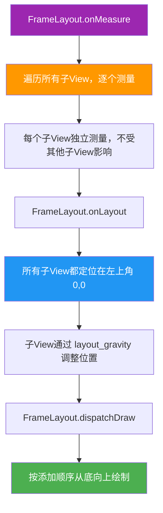

**关键渲染特点：**

```plaintext
1. 测量：每个子 View 独立测量（1 轮），互不影响
2. 布局：所有子 View 默认都在 (0, 0) 位置
3. 绘制：按添加顺序从底向上堆叠，后添加的覆盖先添加的
4. 位置调整：通过 layout_gravity 让子 View 浮动到指定位置
```

**与 View Tree 渲染管线的关系：**

```plaintext
FrameLayout.onMeasure()
  ├─ child1.onMeasure()   ← 独立测量
  ├─ child2.onMeasure()   ← 独立测量
  └─ child3.onMeasure()   ← 独立测量
  ↓
FrameLayout.onLayout()
  ├─ child1.layout(0, 0, w1, h1)       ← 默认左上角
  ├─ child2.layout(0, 0, w2, h2)       ← 默认左上角（覆盖 child1）
  └─ child3.layout(...)                ← 根据 layout_gravity 调整
  ↓
FrameLayout.dispatchDraw()
  ├─ child1.draw(canvas)   ← 先绘制（底层）
  ├─ child2.draw(canvas)   ← 后绘制（覆盖 child1）
  └─ child3.draw(canvas)   ← 最后绘制（最顶层）
```

**Z-index 与绘制顺序：**

```plaintext
FrameLayout 中 View 的层级由添加顺序决定：
  XML 中第一个 View = 最底层
  XML 中最后一个 View = 最顶层
  
  <FrameLayout>
    <ImageView/>    ← Z-index 0（最底层）
    <View/>         ← Z-index 1（中间层）
    <TextView/>     ← Z-index 2（最顶层）
  </FrameLayout>
```

### 性能优势

| 指标 | FrameLayout | LinearLayout | ConstraintLayout |
|------|------------|--------------|------------------|
| 测量轮次 | **1 轮** ✅ | 1-2 轮 | 1 轮 |
| 布局复杂度 | **极简** ✅ | 简单 | 复杂 |
| 渲染速度 | **最快** ✅ | 较快 | 中等 |
| 内存占用 | **最低** ✅ | 低 | 中等 |

---

## 🔗 知识依赖图

### 与前后章节的关系

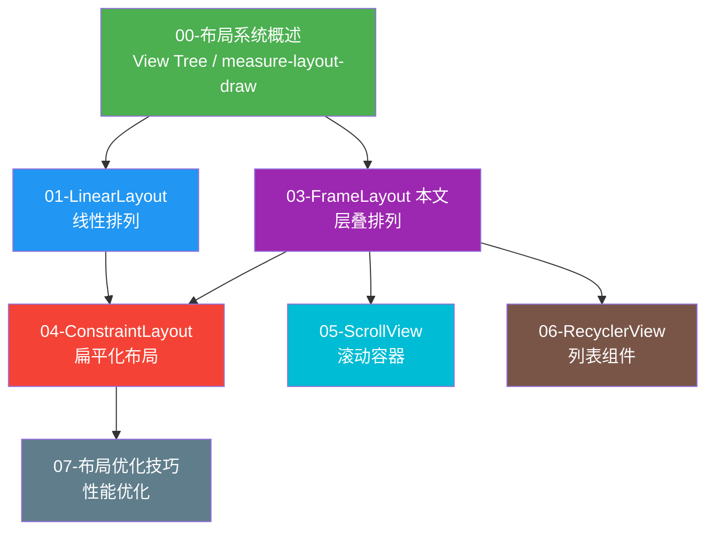

### 核心知识点的章节串联

| 知识点 | 本章内容 | 关联章节 | 关联说明 |
|--------|---------|---------|---------|
| **层叠显示** | 所有子View从左上角堆叠 | 00-概述 | 00 章介绍 View Tree 的绘制阶段 |
| **layout_gravity** | 控制子View在容器中的位置 | 01-LinearLayout | LinearLayout 也有 layout_gravity |
| **遮罩效果** | 半透明View覆盖在内容上 | 07-优化 | 07 章讲过度绘制与遮罩的关系 |
| **帧动画** | AnimationDrawable 逐帧播放 | 09-Compose | Compose 中用 Animation API 替代 |
| **Fragment 容器** | FrameLayout 作为容器 | 00-概述 | 00 章介绍 DecorView 中的 FrameLayout |
| **性能最优** | 最轻量的布局 | 07-优化 | 07 章强调选择轻量布局 |

### 组件关系图

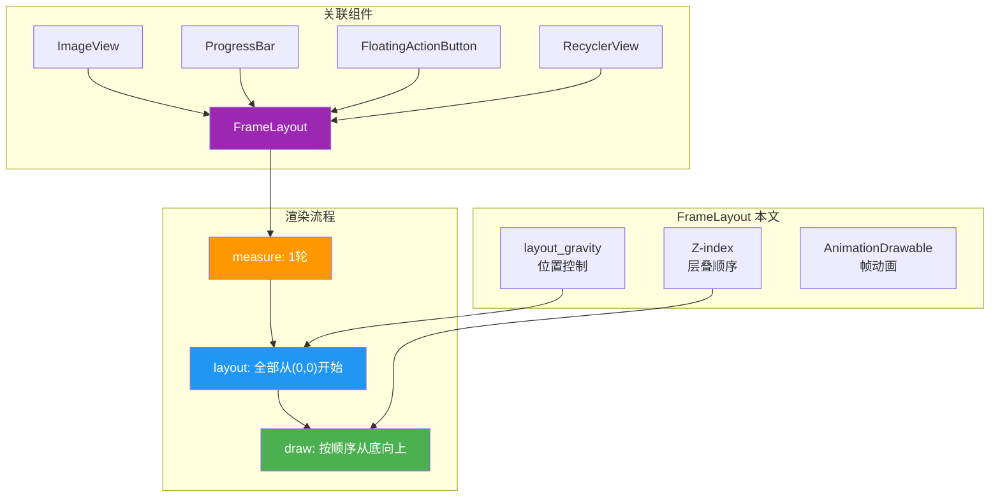

---

## 💼 实战项目

**项目**: 构建一个带加载状态的登录页面
- 使用 FrameLayout 实现背景图 + 登录表单层叠
- 添加半透明遮罩层
- 实现点击登录时显示遮罩效果
- 使用帧动画显示加载状态

## 🔍 代码审查清单

- [ ] 是否正确使用了 `layout_gravity` 控制子 View 位置
- [ ] 遮罩层是否设置了合适的透明度
- [ ] 帧动画资源是否正确引用
- [ ] 遮罩的 `visibility` 是否正确控制
- [ ] 是否避免了不必要的嵌套层级

## 📖 术语表

| 术语 | 英文 | 说明 |
|------|------|------|
| 帧布局 | FrameLayout | Android 基础布局容器 |
| 层叠 | Stacking | View 堆叠显示方式 |
| 重力 | gravity | 控制 View 在容器中的位置 |
| 遮罩 | Mask | 覆盖在内容上的半透明层 |
| 帧动画 | Frame Animation | 逐帧播放的动画效果 |
| AnimationDrawable | AnimationDrawable | 帧动画的实现类 |
| Z-index | Z-index | 控制层叠顺序的索引 |
| 动态添加 | Dynamic Add | 在代码中添加 View |
| bringToFront | bringToFront | 将 View 移到最顶层 |
| 透明度 | Alpha | 控制 View 的透明程度 |

---

## 📚 扩展阅读

- [Android 官方文档 - FrameLayout](https://developer.android.com/guide/topics/ui/layout/frameLayout)
- [Android 动画指南](https://developer.android.com/guide/topics/graphics/2d-graphics.html)
- [View 层级优化](https://developer.android.com/topic/performance/rendering/overdraw)

---

## 🔬 Z-Order 与绘制合成底层深度解析

本章节将从 Android 渲染管线的最底层机制出发，深入剖析 FrameLayout 层叠显示背后的真正原理。如果你已经掌握前面的基础用法，这部分内容会帮助你理解"为什么后添加的 View 一定覆盖先添加的"这一现象背后的系统行为。

### 1. Z-Order 在 Android 中的实现原理

#### 1.1 Z 轴的组成

在 Android 中，每个 View 的"层级高度"并不是一个单独的属性，而是由两个值共同决定：

- **elevation（静态高度，API 21+）**：XML 中通过 `android:elevation` 设置，表示 View 在 Z 轴上的基础高度，是一个相对静态的值。
- **translationZ（动态高度，API 21+）**：通过 `View.setTranslationZ()` 在运行时动态修改，常用于实现按压反馈、悬浮动画等效果。

最终的 Z 值计算公式为：

```
Z = elevation + translationZ
```

Z 值越大，View 在视觉上越靠上，越能覆盖其他 View。

#### 1.2 FrameLayout 中的 Z-Order 决定机制

在 FrameLayout 中，子 View 的 Z-Order 由两个因素共同决定：

1. **添加顺序（默认情况）**：FrameLayout 内部维护一个 `mChildren` 数组，数组索引越大的子 View 越靠上层。这是最基础的层叠规则。
2. **Z 值（API 21+）**：如果子 View 设置了 elevation 或 translationZ，系统会综合考虑 Z 值和添加顺序。Z 值较大的子 View 会显示在 Z 值较小的子 View 之上，即使后者添加顺序更晚。

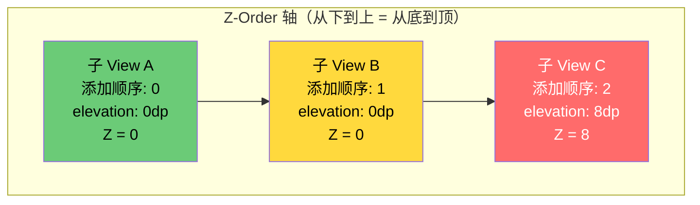

**关键规则：**
- 当所有子 View 的 Z 值都相同时（通常是 0），完全由添加顺序决定层级。
- 当子 View 的 Z 值不同时，系统先按 Z 值分组排序，Z 值相同的组内再按添加顺序排序。
- 这种机制使得开发者既可以用 XML 顺序控制简单层级，又可以用 elevation 实现复杂的阴影和层叠效果。

#### 术语解释

- **Z 轴（Z-axis）**：在 Android 的三维坐标系统中，X 轴是水平方向，Y 轴是垂直方向，Z 轴是垂直于屏幕的方向（从屏幕指向用户眼睛）。Z 值越大，View 看起来离用户越近、越靠上。
- **elevation（高度）**：View 的静态 Z 轴位置，类似于建筑物的楼层高度。一栋楼里，5 楼的人总是比 3 楼的人"高"，不管他们谁先进入大楼。
- **translationZ（平移高度）**：View 在 Z 轴上的动态偏移量，类似于电梯的临时升降。即使你在 3 楼，乘电梯上升 10 层后你就到了 13 楼，临时比 5 楼的人还高。
- **Z-Order**：View 在 Z 轴上的排列顺序，决定了哪个 View 显示在最前面。就像一摞透明玻璃板，最上面那块玻璃上画的图案会遮住下面玻璃板的图案。

### 2. dispatchDraw 的绘制顺序

#### 2.1 绘制流程详解

`dispatchDraw()` 是 ViewGroup 的核心绘制方法，负责遍历所有子 View 并依次调用它们的 `draw()` 方法。FrameLayout 继承自 ViewGroup，其 `dispatchDraw()` 的执行逻辑遵循一个明确的顺序：

1. FrameLayout 遍历 `mChildren` 数组，从索引 0 到索引 n-1。
2. 对于每个子 View，调用 `drawChild()`，进而调用子 View 的 `draw(Canvas)`。
3. 后绘制的子 View 的像素会覆盖先绘制的子 View 的像素（在像素重叠的区域）。

这就是为什么"后添加的覆盖先添加的"——不是因为系统特别处理，而是因为绘制顺序天然导致后画的覆盖先画的。

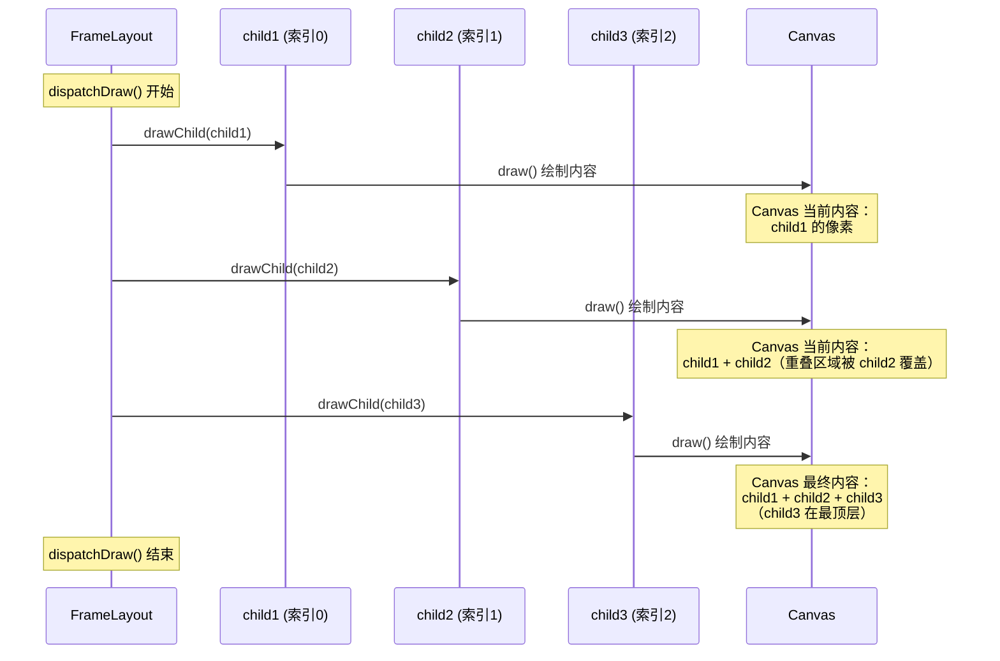

#### 2.2 draw() 方法的四个步骤

每个子 View 的 `draw()` 方法内部按固定顺序执行四个步骤：

1. **绘制背景**：调用 `drawBackground()`，绘制 View 的 background drawable。
2. **保存 Canvas 层**：如果需要硬件加速或透明度处理，保存 Canvas 状态。
3. **绘制内容**：调用 `onDraw()`，绘制 View 的具体内容（如 TextView 的文字）。
4. **绘制子 View**：调用 `dispatchDraw()`，如果是 ViewGroup，递归绘制子 View。
5. **绘制装饰**：绘制前景、滚动条等。

#### 术语解释

- **dispatchDraw（分发绘制）**：ViewGroup 的方法，作用是"把绘制任务分发给子 View"。就像老师把作业本依次发给每个学生，学生按收到作业本的顺序依次完成，后完成的学生的答案会"盖住"先完成的学生的答案。
- **drawChild（绘制子 View）**：dispatchDraw 内部调用的方法，负责单个子 View 的绘制。它会处理子 View 的动画、变换矩阵、透明度等。
- **Canvas（画布）**：Android 绘制的目标载体，所有 View 的内容最终都画在同一块 Canvas 上。可以想象成一块大画板，每个子 View 按顺序在画板上涂色，后涂的颜色会覆盖先涂的。

### 3. Canvas Layer 与 save/restore 机制

#### 3.1 Canvas Layer 的概念

Canvas 采用"栈"结构来管理绘制状态。每次调用 `saveLayer()` 时，系统会创建一个新的离屏缓冲层（offscreen buffer），后续的绘制操作都作用在这个新层上，直到调用 `restore()` 将这个层的内容合成回主 Canvas。

这种机制在以下场景中至关重要：
- **半透明效果**：对一组 View 应用统一的透明度。
- **混合模式**：使用 `PorterDuffXfermode` 实现复杂的图形混合。
- **裁剪**：对绘制内容进行复杂裁剪，不影响其他区域。

#### 3.2 save/restore 的栈结构

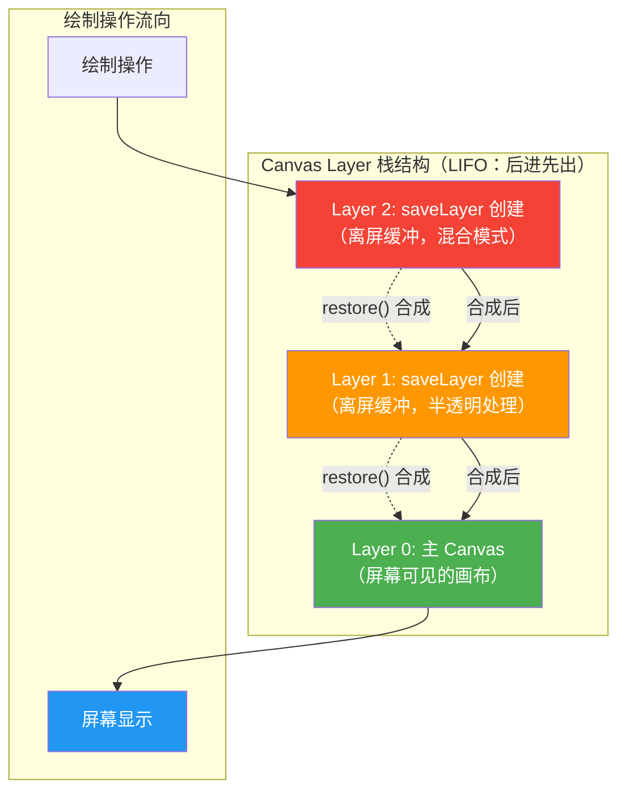

#### 3.3 对 FrameLayout 层叠的影响

当 FrameLayout 的某个子 View 使用了 `saveLayer()`（例如设置了 `alpha < 1` 或使用了 `Shader`），该子 View 的绘制会先在离屏层完成，再合成回主 Canvas。这意味着：

- 子 View 的透明度不会影响其他子 View 的绘制。
- 混合模式只在子 View 自身的内容范围内生效。
- 但 `saveLayer()` 会创建额外的 GPU 内存开销，过度使用会导致性能问题。

#### 术语解释

- **Canvas Layer（画布层）**：Canvas 的一种状态快照机制。想象你在画一幅油画，先在一张透明画纸上画好背景，再在另一张透明画纸上画人物，最后把两张画纸叠放在一起。每张画纸就是一个 Canvas Layer，`saveLayer()` 就是拿出一张新的透明画纸。
- **save/restore（保存/恢复）**：Canvas 状态的栈式管理。`save()` 把当前 Canvas 状态压入栈，`restore()` 弹出栈顶状态。就像浏览器的"前进/后退"按钮，`save` 是记住当前位置，`restore` 是回到记住的位置。
- **离屏缓冲（Offscreen Buffer）**：一块不直接显示在屏幕上的内存区域，用于临时存储绘制结果。就像画家在草稿纸上先画好图案，再描到正式画布上。
- **PorterDuffXfermode（混合模式）**：控制两个图层如何混合的算法，如 SRC_IN、DST_OVER 等。类似于 Photoshop 中的"混合选项"，决定新画的颜色如何与已有颜色结合。

### 4. Hardware Layer 与 RenderThread

#### 4.1 硬件加速架构

从 API 21（Android 5.0 Lollipop）开始，Android 默认开启硬件加速，并引入了 RenderThread（渲染线程）。整个渲染流程从"单线程同步"变为"双线程异步"：

- **UI Thread（主线程）**：负责执行 View 的 `measure()`、`layout()`、`draw()`，但 `draw()` 不再直接调用 GPU 命令，而是将绘制操作记录为 **DisplayList**（显示列表）。
- **RenderThread（渲染线程）**：从 UI Thread 接管 DisplayList，将其翻译为 OpenGL ES / Vulkan 命令，提交给 GPU 执行。

#### 4.2 完整渲染链路

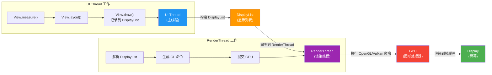

#### 4.3 DisplayList 的优势

- **异步渲染**：UI Thread 不需要等待 GPU 完成，可以更快返回，减少卡顿。
- **缓存复用**：如果 View 树没有变化，DisplayList 可以直接复用，RenderThread 直接执行上次的结果。
- **局部更新**：只有属性变化的 View 需要重建 DisplayList，其他 View 保持缓存。

#### 4.4 对 FrameLayout 的影响

FrameLayout 的层叠特性在硬件加速下依然有效，因为：
- 每个子 View 的 DisplayList 按添加顺序合并到父 FrameLayout 的 DisplayList 中。
- RenderThread 执行时，依然遵循"后添加的 DisplayList 后执行"的顺序，实现覆盖效果。
- 设置了 `layerType="hardware"` 的 View 会被单独渲染为纹理，再合成到父层。

#### 术语解释

- **DisplayList（显示列表）**：一组绘制指令的记录，类似于"菜谱"。UI Thread 像厨师写菜谱，RenderThread 像另一个厨师照着菜谱做菜。菜谱（DisplayList）可以在多次渲染中复用。
- **RenderThread（渲染线程）**：独立于 UI Thread 的线程，专门负责执行 GPU 命令。就像餐厅有"前台"（UI Thread）接待点单，"后厨"（RenderThread）专门做菜，两者并行工作，效率更高。
- **Hardware Layer（硬件层）**：View 在 GPU 中的缓存纹理，可以快速合成到屏幕。就像把画好的画裱框挂在墙上，下次要展示时直接拿裱好的画，不用重新画。
- **OpenGL/Vulkan**：底层的图形渲染 API，Android 通过它们与 GPU 通信。OpenGL 是老一代 API，Vulkan 是新一代 API，支持更好的多线程并行渲染。

### 5. 过度绘制与 FrameLayout 的关系

#### 5.1 什么是过度绘制

过度绘制（Overdraw）是指屏幕上的某个像素在同一帧内被绘制了多次。每次绘制都消耗 GPU 资源，如果像素被绘制了 2 次、3 次甚至更多，其中前面的绘制结果会被后面的覆盖，造成 GPU 资源的浪费。

#### 5.2 FrameLayout 的天然过度绘制问题

FrameLayout 的层叠特性使其天然容易产生过度绘制。考虑一个典型场景：

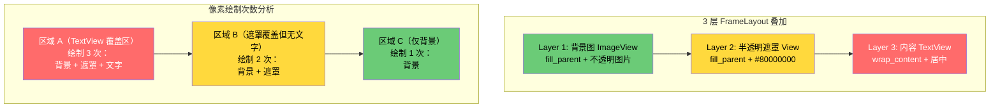

#### 5.3 过度绘制的危害

| 过度绘制次数 | 颜色指示（开发者选项） | 性能影响 |
|--------------|----------------------|----------|
| 1 次（无过度绘制） | 原色 | 最佳 |
| 2 次（1x 过度绘制） | 蓝色 | 可接受 |
| 3 次（2x 过度绘制） | 绿色 | 需关注 |
| 4 次以上（3x+ 过度绘制） | 红色 | 需优化 |

#### 5.4 FrameLayout 过度绘制优化策略

1. **移除不透明背景**：如果背景图已完全覆盖，底层不需要设置 background。
2. **使用 `View.setWillNotDraw(true)`**：纯容器 View 不需要绘制自身内容。
3. **透明区域裁剪**：对于大面积半透明遮罩，考虑使用 `Canvas.clipPath()` 只绘制必要区域。
4. **`android:removeActionBar`**：移除不必要的默认背景。

#### 术语解释

- **过度绘制（Overdraw）**：同一像素在一帧内被多次绘制。就像你用粉笔在黑板上写字，写完一遍又用同样颜色的粉笔描一遍，第二遍的描画完全是浪费力气。
- **透明像素覆盖（Transparent Pixel Overdraw）**：即使上层 View 是半透明的，GPU 仍然需要绘制下层 View 的完整像素，再与上层混合。这比完全不透明的情况更耗资源，因为 GPU 要做两次绘制 + 一次混合。
- **GPU 资源浪费**：GPU 每秒能处理的像素数有限（Fill Rate），过度绘制消耗了本可用于其他渲染任务的资源。就像高速公路的车道有限，如果大量车辆走冤枉路，会导致真正需要通行的车辆拥堵。

### 6. bringToFront() 的底层实现

#### 6.1 bringToFront 的工作原理

`bringToFront()` 看起来只是"把 View 移到最顶层"，但其底层实现涉及多个步骤：

1. **调用 `requestLayout()`**：触发 View 树的重新布局。
2. **重新排列 `mChildren` 数组**：ViewGroup 内部会将目标 View 从原位置移除，添加到数组末尾。
3. **调用 `invalidate()`**：触发重新绘制。

#### 6.2 源码级流程

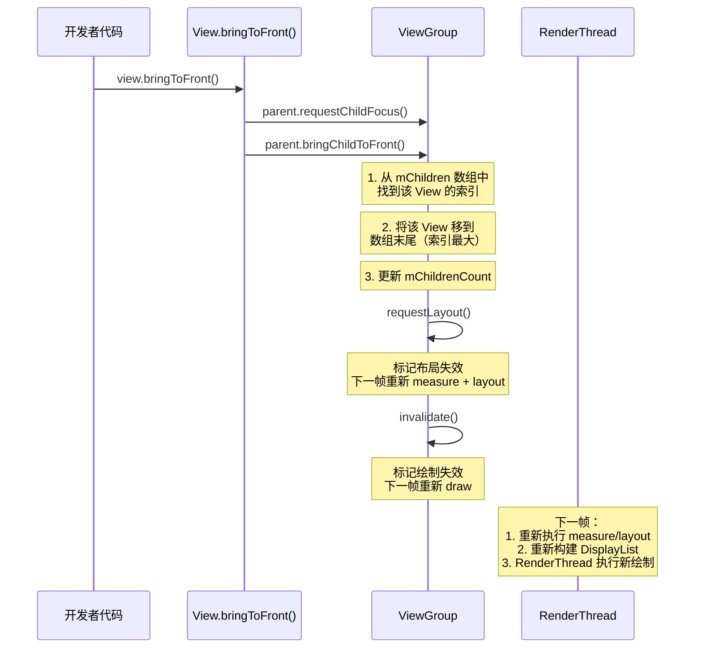

#### 6.3 性能注意事项

- `bringToFront()` 会触发完整的 `measure-layout-draw` 流程，代价不小。
- 如果频繁调用（如在动画中），会导致性能问题，应考虑使用 `translationZ` 代替。
- `translationZ` 只改变 Z 值，不改变 `mChildren` 数组顺序，性能更高。

#### 术语解释

- **bringToFront（置顶）**：将 View 移到 ViewGroup 子 View 数组的末尾，使其在绘制时最后执行，从而显示在最顶层。就像把一摞文件中的某份抽出来放到最上面，下次翻阅时第一个看到的就是它。
- **requestLayout（请求布局）**：标记 View 树需要重新执行 `measure()` 和 `layout()`。就像告诉系统"我的尺寸或位置可能变了，需要重新计算"。
- **invalidate（请求重绘）**：标记 View 需要重新执行 `draw()`。就像告诉系统"我的外观变了，需要重新画一遍"。
- **mChildren 数组**：ViewGroup 内部维护的子 View 列表，数组顺序决定了绘制顺序。数组的末尾就是"最顶层"。

---

## 📐 设计理念与架构图

本章节从"为什么 Google 这么设计"的角度，探讨 FrameLayout 在 Android 架构中的定位和设计哲学。

### 1. FrameLayout 的"最简容器"设计哲学

#### 1.1 为什么是系统默认根容器

Android 系统选择 FrameLayout 作为 Activity 的默认根容器，源于三个设计考量：

1. **零开销的布局计算**：FrameLayout 的 `onMeasure()` 只需遍历一次子 View，每个子 View 独立测量，不依赖其他子 View 的测量结果。这使得它作为根容器时，不会给整个 View 树增加额外的测量负担。
2. **包容性强**：FrameLayout 对子 View 没有任何排列要求，无论子 View 是什么类型、什么尺寸，都能正确显示。这种"不干预"的特性使其适合作为通用容器。
3. **层叠语义符合需求**：Activity 的根容器通常只需要承载一个主内容 View，FrameLayout 的层叠特性还可以方便地叠加加载遮罩、错误页等。

#### 1.2 极简设计的体现

FrameLayout 的源码在 AOSP 中不到 1000 行，是所有 ViewGroup 子类中最短的。它的核心方法：

- `onMeasure()`：遍历子 View，取最大宽高作为自身尺寸。
- `onLayout()`：遍历子 View，根据 `layout_gravity` 定位。
- `dispatchDraw()`：按顺序绘制子 View。

没有复杂的约束求解、没有权重计算、没有相对定位算法，纯粹是"遍历 + 堆叠"。

### 2. View → ViewGroup → FrameLayout 继承链

```mermaid
classDiagram
    class View {
        +int mMeasuredWidth
        +int mMeasuredHeight
        +draw(Canvas canvas)
        +onMeasure(int, int)
        +onLayout(boolean, int, int, int, int)
        +onDraw(Canvas canvas)
        +invalidate()
        +requestLayout()
    }
    
    class ViewGroup {
        +View[] mChildren
        +int mChildrenCount
        +addView(View child)
        +removeView(View view)
        +measureChild(View child, int, int)
        +measureChildren(int, int)
        +layoutChild(View child, int, int)
        +dispatchDraw(Canvas canvas)
        +bringChildToFront(View child)
    }
    
    class FrameLayout {
        +onMeasure(int, int)
        +onLayout(boolean, int, int, int, int)
        +measureChildWithMargins(View, int, int, int, int)*
        +setMeasureAllChildren(boolean)
        +foregroundDraw(Canvas)
    }
    
    View <|-- ViewGroup
    ViewGroup <|-- FrameLayout
    
    Note for FrameLayout "特有方法：<br/>1. measureChildWithMargins 重写<br/>   处理 padding + margin + gravity<br/>2. setMeasureAllChildren<br/>   控制是否测量所有子 View<br/>3. foregroundDraw<br/>   绘制前景 drawable"
```

#### 术语解释

- **View**：Android UI 的基础单元，所有可见元素都是 View 的子类。就像 HTML 中的元素，是最基础的"积木块"。
- **ViewGroup**：可以包含其他 View 的 View，相当于"容器积木"。它扩展了 View，增加了 `addView()`、`removeView()` 等管理子 View 的方法。
- **measureChildWithMargins**：ViewGroup 的测量方法，考虑子 View 的 margin。FrameLayout 重写此方法以同时处理 padding 和 margin，确保子 View 尺寸计算正确。
- **setMeasureAllChildren**：FrameLayout 特有方法，控制是否测量 `GONE` 状态的子 View。默认为 false（不测量 GONE 的子 View），但通过 `android:measureAllChildren="true"` 可以改变。

### 3. FrameLayout 在 Android 系统中的角色

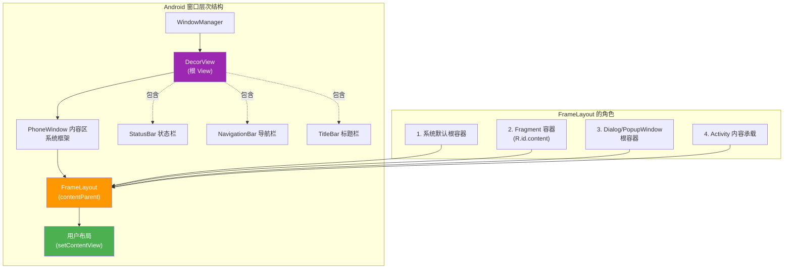

#### 层次关系详解

1. **DecorView**：整个 Activity 窗口的根 View，包含状态栏背景、标题栏、内容区。
2. **FrameLayout(contentParent)**：系统创建的 FrameLayout，ID 为 `android.R.id.content`，是用户布局的父容器。
3. **用户布局**：通过 `setContentView()` 设置的布局，被添加到 contentParent 这个 FrameLayout 中。

#### 术语解释

- **DecorView（装饰视图）**：Activity 窗口的最外层 View，像房间的"外墙"，包含窗户（状态栏区域）、门（导航栏区域）和室内（内容区）。
- **contentParent（内容父容器）**：DecorView 内部的一个 FrameLayout，专门用于承载用户通过 `setContentView()` 设置的布局。就像房间里的"展示台"，你放什么上去就显示什么。
- **PhoneWindow**：Android 中 Window 的实现类，管理 DecorView 的创建和属性设置。

### 4. FrameLayout 与 ConstraintLayout 在层叠场景的设计差异

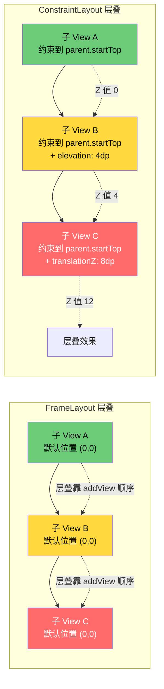

#### 设计差异对比

| 特性 | FrameLayout | ConstraintLayout |
|------|-------------|------------------|
| 默认位置 | 所有子 View 在 (0,0) | 需要显式约束，否则位置不确定 |
| 层叠方式 | 由 addView 顺序决定 | 由 elevation/translationZ 决定 |
| 层叠控制 | `bringToFront()` 重排数组 | 修改 `translationZ`（性能更高） |
| 定位方式 | `layout_gravity` | 约束系统 |
| 适用场景 | 简单层叠、遮罩 | 复杂界面、扁平化布局 |
| 层叠动画 | 需 removeView + addView | 动画 `translationZ` 即可 |

#### 术语解释

- **ConstraintLayout**：Android 推荐的布局容器，通过约束关系（Constraint）定义子 View 的位置，支持扁平化布局。相比于 FrameLayout 的"堆放"模式，ConstraintLayout 更像"用绳子把每个 View 拴在指定位置"。
- **elevation/translationZ 在 ConstraintLayout 中**：ConstraintLayout 中的子 View 通常需要显式设置 elevation 或 translationZ 来控制层叠，因为 ConstraintLayout 的子 View 位置由约束决定，不再默认堆叠在同一点。
- **扁平化布局**：通过 ConstraintLayout 的约束系统，减少 View 嵌套层级，提升性能。FrameLayout 倾向于嵌套使用，而 ConstraintLayout 鼓励单层布局。

### 5. Fragment 容器选择 FrameLayout 的设计原因

#### 为什么 Fragment 容器是 FrameLayout？

Fragment 的事务机制（`add()`、`replace()`）天然需要层叠容器：

1. **`add()` 事务**：将新 Fragment 的 View 添加到容器中，如果容器中已有其他 Fragment 的 View，新的会覆盖在旧的之上（通过 `addView` 到数组末尾实现）。
2. **`replace()` 事务**：先移除所有现有 Fragment 的 View，再添加新 Fragment 的 View。
3. **过渡动画**：Fragment 切换时的 fade、slide 动画，需要新旧 Fragment 的 View 同时存在于容器中，FrameLayout 的层叠特性完美支持这一点。

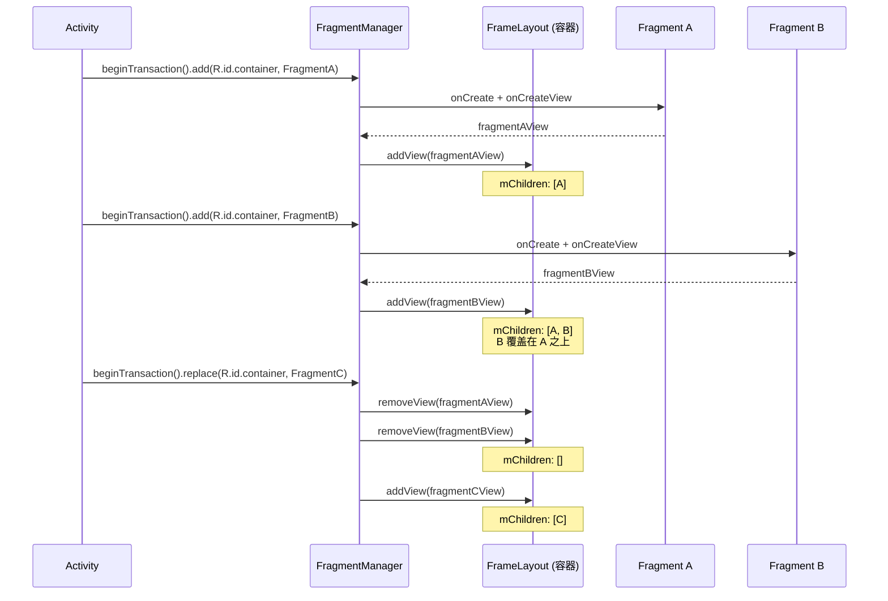

#### 术语解释

- **Fragment（片段）**：Android 中可复用的 UI 模块，拥有自己的生命周期。可以理解为"迷你 Activity"，嵌入在 Activity 的 FrameLayout 容器中。
- **Fragment 事务（Transaction）**：一系列 Fragment 操作的原子单元，通过 `FragmentManager.beginTransaction()` 创建。类似于数据库事务，要么全部成功，要么全部回滚。
- **add/replace**：`add` 是在现有 Fragment 之上叠加新 Fragment，`replace` 是先移除所有现有 Fragment 再添加新的。FrameLayout 的层叠特性使这两种操作都能正确实现视觉覆盖效果。

### 6. AnimationDrawable 在 FrameLayout 中的渲染机制

#### 逐帧动画如何利用 FrameLayout 的层叠特性

AnimationDrawable 是逐帧动画的实现类，它在 FrameLayout 中的渲染流程：

1. **作为 View 的 background**：AnimationDrawable 通常设置为 ImageView 的 background。
2. **定时切换帧**：内部通过 `Handler.postDelayed()` 定时切换当前显示的帧 drawable。
3. **触发 View 重绘**：每次切换帧后，调用 `invalidateSelf()` 触发 View 的 `invalidate()`，重新绘制 background。
4. **FrameLayout 不干预**：由于 AnimationDrawable 是子 View 的 background，FrameLayout 的 dispatchDraw 正常调用子 View 的 draw()，draw() 内部会绘制 background（即 AnimationDrawable 的当前帧）。

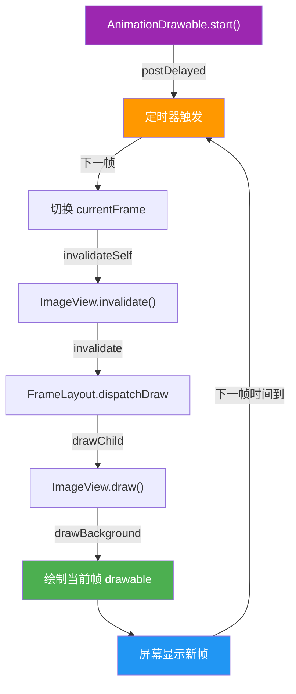

#### 术语解释

- **AnimationDrawable（动画 Drawable）**：Android 提供的逐帧动画实现，通过预定义的多张图片轮流显示形成动画效果。就像翻页动画书，快速翻动每一页（帧）就能看到连续的动作。
- **invalidateSelf（请求重绘自身）**：Drawable 的方法，通知宿主 View 重新绘制。就像动画书翻到下一页时，告诉读者"看这里，画面变了"。
- **逐帧动画（Frame Animation）**：最基础的动画形式，预先准备好每一帧的图片，按时间顺序播放。缺点是内存占用大（每帧都是一张图），优点是实现简单。

---

## 📝 跨章节综合考核训练

以下 8 道考核题综合了 FrameLayout 章节与其他章节的知识点，用于检验跨章节的理解和融会贯通能力。每道题都关联至少 2 个章节，建议先独立思考再查看参考答案。

### 考核题 1：FrameLayout 单轮测量与 LinearLayout 权重两轮测量的性能对比

**涉及章节**：03-FrameLayout + 01-LinearLayout

**题目**：
某 App 的首页有一个数据展示区域，可以用 FrameLayout 包裹多个子 View 实现，也可以用 LinearLayout + weight 实现等分排列。请从测量轮次的角度分析：
1. FrameLayout 的 `onMeasure()` 为什么只需要 1 轮测量？它遍历子 View 时的逻辑是什么？
2. LinearLayout 在使用 `weight` 时为什么需要 2 轮测量？第 1 轮和第 2 轮分别测量什么？
3. 如果该页面有 20 个子 View，两种布局的测量次数分别是多少？在低端机上这会造成什么可观察到的差异？

**参考答案要点**：
- FrameLayout 的 `onMeasure()` 逐个调用 `measureChildWithMargins()`，每个子 View 独立测量，互不依赖，1 轮即可完成。测量完成后取所有子 View 中的最大宽高作为自身尺寸。
- LinearLayout 使用 weight 时，第 1 轮先测量所有 `layout_height != 0` 的子 View（即非 weight 分配的尺寸），第 2 轮根据剩余空间和 weight 比例重新测量 weight 子 View。这是因为 weight 分配依赖"总空间 - 已用空间"的计算结果。
- 20 个子 View 下，FrameLayout 测量 20 次（1 轮 × 20），LinearLayout 测量 40 次（2 轮 × 20）。在低端机上，LinearLayout 可能导致 measure 阶段耗时增加，表现为页面加载时的轻微卡顿或白屏时间延长。

---

### 考核题 2：FrameLayout 层叠与 ConstraintLayout 层叠实现对比

**涉及章节**：03-FrameLayout + 04-ConstraintLayout

**题目**：
你需要实现一个"图片 + 半透明遮罩 + 文字"的三层叠加效果。请对比以下两种实现：
1. 使用 FrameLayout，通过 XML 中子 View 的顺序控制层叠。
2. 使用 ConstraintLayout，通过 elevation 控制层叠。

请分析：
- 两种方式各自的层叠控制机制是什么？
- 如果需要通过代码动态调整层级（如点击后将文字提到最上层），两种方式分别怎么做？性能差异如何？
- 在这个具体场景下，你会推荐哪种方式？为什么？

**参考答案要点**：
- FrameLayout 的层叠由 `mChildren` 数组顺序决定，XML 中越靠后的子 View 越靠上层。ConstraintLayout 的层叠由子 View 的 `elevation` / `translationZ` 决定，Z 值大的在上层。
- FrameLayout 动态调整层级需调用 `bringToFront()`，会触发 `requestLayout()` + `invalidate()`，重新排列 `mChildren` 数组，代价较大。ConstraintLayout 只需修改 `translationZ` 属性，不触发布局，性能更高。
- 在这个简单三层叠加场景下，推荐 FrameLayout。因为层级固定，不需要动态调整，FrameLayout 更轻量（1 轮测量 vs ConstraintLayout 的约束求解）。如果需要频繁动态调整层级，则 ConstraintLayout 的 `translationZ` 方案更优。

---

### 考核题 3：FrameLayout 作为 Fragment 容器与 DecorView 的关系

**涉及章节**：03-FrameLayout + 00-概述

**题目**：
在 Android 中，Fragment 通常被添加到一个 ID 为 `android.R.id.content` 的容器中。请结合 DecorView 的结构回答：
1. `android.R.id.content` 对应的 View 是什么类型？它在 DecorView 树中的位置是什么？
2. 当你调用 `setContentView(R.layout.my_layout)` 时，my_layout 被添加到了哪个 FrameLayout 中？
3. 如果你在 Fragment 的 `onCreateView()` 中返回的 View 被添加到 `R.id.content` 中，这个 Fragment 的 View 相对于 DecorView 的层级深度是多少？过深的层级有什么性能影响？

**参考答案要点**：
- `android.R.id.content` 对应的是 DecorView 内部的一个 FrameLayout，称为 contentParent。它的位置是 DecorView → 系统装饰区（状态栏/标题栏背景）→ contentParent FrameLayout。
- `setContentView(R.layout.my_layout)` 会将 my_layout 的根 View 通过 `addView()` 添加到 contentParent 这个 FrameLayout 中。
- Fragment View 的层级深度为：DecorView(0) → LinearLayout(1) → contentParent FrameLayout(2) → Fragment View(3)。如果 Fragment 内部还有嵌套布局，深度会进一步增加。层级过深会导致 `measure()` / `layout()` / `draw()` 的递归调用栈变深，增加遍历时间，在复杂界面下可能导致掉帧。

---

### 考核题 4：过度绘制在 FrameLayout 中的影响与布局优化技巧的关系

**涉及章节**：03-FrameLayout + 07-优化技巧

**题目**：
你的 App 有一个页面，使用 FrameLayout 叠加了 4 层 View：背景图、半透明渐变遮罩、卡片内容、全屏 Loading 遮罩。用户反馈该页面滑动卡顿。请分析：
1. 这个 FrameLayout 存在几层过度绘制？分别在哪里？
2. 根据 07 章的优化技巧，如何减少这 4 层叠加的过度绘制？至少提出 3 种具体方案。
3. 为什么移除不必要的 background 可以有效减少过度绘制？GPU 在绘制不透明背景时的行为与绘制透明背景有什么不同？

**参考答案要点**：
- 存在 3 层过度绘制（4 层绘制 - 1 层有效 = 3 层过度绘制）。背景图被遮罩、卡片、Loading 层各覆盖一次；遮罩被卡片、Loading 层覆盖；卡片被 Loading 层覆盖。
- 优化方案：(a) Loading 遮罩平时设为 `GONE`，不参与绘制；(b) 移除 FrameLayout 自身的 background，如果背景图已覆盖整个区域；(c) 给纯容器 View 设置 `setWillNotDraw(true)`；(d) 卡片内容区域如果不大，考虑用 `Canvas.clipRect` 限制绘制区域。
- 移除不必要的 background 后，GPU 不需要绘制会被覆盖的像素。绘制不透明背景时，GPU 可以直接写入帧缓冲；绘制透明/半透明背景时，GPU 需要先读取已有像素，再与上层混合，多了一次读操作和混合计算，开销更大。

---

### 考核题 5：FrameLayout 作为 ScrollView 子 View 时的行为

**涉及章节**：03-FrameLayout + 05-ScrollView

**题目**：
你将一个 FrameLayout 放入 ScrollView 中，FrameLayout 内部有多张图片层叠。请分析：
1. ScrollView 的测量机制对 FrameLayout 的 `layout_height` 有什么要求？为什么 `layout_height="match_parent"` 在 ScrollView 内可能不是你想要的效果？
2. 当 FrameLayout 的高度超过屏幕时，ScrollView 如何处理 FrameLayout 的 `measure()`？FrameLayout 内部的层叠子 View 会受到什么影响？
3. 如果 FrameLayout 内部有一个 `layout_gravity="bottom"` 的子 View，当 FrameLayout 高度为 `wrap_content` 且内容不足一屏时，这个 "bottom" 相对的是什么？

**参考答案要点**：
- ScrollView 要求子 View 的 `layout_height` 为 `wrap_content`，因为 ScrollView 会根据子 View 的实际测量高度来决定滚动范围。如果设为 `match_parent`，FrameLayout 会被测量为屏幕高度，ScrollView 认为不需要滚动，内容无法滚动查看。
- ScrollView 在 `onMeasure()` 中会传入 `AT_MOST` 或 `UNSPECIFIED` 的 MeasureSpec 给 FrameLayout，FrameLayout 会测量所有子 View 取最大高度作为自身高度。层叠子 View 依然按顺序绘制，滚动时 ScrollView 通过 `scrollTo()` 移动 FrameLayout 的绘制位置，不改变 FrameLayout 内部的层叠关系。
- 当 FrameLayout 高度为 `wrap_content` 时，`layout_gravity="bottom"` 的子 View 会贴到 FrameLayout 测量出的实际高度的底部，而非屏幕底部。如果想让子 View 贴屏幕底部，需要给 FrameLayout 设置最小高度（`minHeight`）为屏幕高度，或使用 CoordinatorLayout 等更灵活的方案。

---

### 考核题 6：AnimationDrawable 与 Compose 动画 API 的对比

**涉及章节**：03-FrameLayout + 09-Compose

**题目**：
你的团队正在从 View 体系迁移到 Jetpack Compose，之前使用 AnimationDrawable + FrameLayout 实现了一个加载动画。请分析：
1. AnimationDrawable 的工作原理是什么？它依赖 FrameLayout 的什么特性？
2. 在 Compose 中，等价的动画实现方式是什么？（提示：`AnimatedContent`、`rememberInfiniteTransition`）
3. 两种方式在内存占用和性能上有什么差异？为什么 Compose 的方式通常更优？

**参考答案要点**：
- AnimationDrawable 通过预定义多张图片，用 `Handler.postDelayed()` 定时切换帧，依赖 FrameLayout 的 dispatchDraw → draw → drawBackground 链路渲染当前帧。内存占用为所有帧图片的总和。
- Compose 中可用 `rememberInfiniteTransition()` + `animateFloat()` 实现无限循环动画，或用 `AnimatedContent` 实现状态切换动画。对于逐帧动画，可用 `rememberAnimatedVectorDrawable` 或将图片列表传入 `AnimatedContent`。
- AnimationDrawable 需要预加载所有帧到内存，内存占用大；Compose 的动画 API 基于插值计算，通常只需要起止状态，内存占用更小。且 Compose 动画在 Compose 的渲染管线中运行，与 UI Tree 的 diff 机制结合，可以更精确地控制动画的启动和停止，避免无效重绘。

---

### 考核题 7：FrameLayout 性能最优与 RecyclerView 可见区域渲染的对比

**涉及章节**：03-FrameLayout + 06-RecyclerView

**题目**：
你需要展示一个包含 100 个卡片的列表，每个卡片内部有 3 层叠加效果（背景图 + 遮罩 + 文字）。请对比以下两种方案：
1. 使用 FrameLayout 嵌套 ScrollView，所有 100 个卡片一次性加载。
2. 使用 RecyclerView，每个 Item 内部用 FrameLayout 实现三层叠加。

请分析：
1. 两种方案在 measure 阶段的调用次数分别是多少？
2. RecyclerView 的"可见区域渲染"机制如何减少不必要的测量和绘制？FrameLayout 方案为什么做不到？
3. 如果用户快速滑动列表，两种方案在内存和 CPU 上的表现差异如何？

**参考答案要点**：
- 方案 1：FrameLayout + ScrollView 会对所有 100 个卡片执行 measure，每个卡片内部 3 层 = 300 次 measure 调用。方案 2：RecyclerView 只对可见区域的卡片（约 5-10 个）执行 measure，约 15-30 次调用，其余通过 ViewHolder 复用。
- RecyclerView 通过 LayoutManager 的 `getItemCount()` 和滚动位置计算当前可见的 item 范围，只对可见 item 调用 `onBindViewHolder()` 和 measure/layout/draw。FrameLayout + ScrollView 没有可见区域的概念，所有子 View 一次性全部测量和布局，因为 FrameLayout 的 `onMeasure()` 会遍历整个 `mChildren` 数组。
- 快速滑动时，方案 1 内存中保持 100 个卡片的 View 实例，GC 压力大，且 measure/layout 总耗时固定为 100 个卡片的时间，容易掉帧。方案 2 内存中只有 5-10 个 ViewHolder，CPU 只测量可见区域，滑动流畅，但需要正确实现 `onBindViewHolder()` 避免图片重复加载。

---

### 考核题 8：bringToFront 与 ConstraintLayout Z-Order 的差异

**涉及章节**：03-FrameLayout + 04-ConstraintLayout

**题目**：
你需要实现一个交互效果：用户点击某个 View 时，该 View 会上浮到最顶层并显示阴影。请对比以下两种实现：
1. FrameLayout + `bringToFront()`：点击时调用 `view.bringToFront()`。
2. ConstraintLayout + `translationZ`：点击时设置 `view.translationZ = 8.dp`。

请分析：
1. 两种方式分别触发了哪些 View 树更新操作？`bringToFront()` 为什么比修改 `translationZ` 性能更差？
2. `bringToFront()` 改变了 `mChildren` 数组顺序后，下一次 `dispatchDraw()` 的绘制顺序如何变化？
3. 在 ConstraintLayout 方案中，`translationZ` 的改变是否触发布局？它如何影响 RenderThread 的 DisplayList 重建？
4. 如果需要在动画过程中频繁切换层级（如每帧一次），哪种方案可行？为什么？

**参考答案要点**：
- `bringToFront()` 触发 `requestLayout()` + `invalidate()`，会重新执行 measure/layout/draw 三个阶段，并重新排列 `mChildren` 数组。修改 `translationZ` 只触发 `invalidate()`，不触发布局，因为 Z 值不影响 View 的尺寸和位置，只影响绘制顺序。
- `bringToFront()` 后，目标 View 被移到 `mChildren` 数组末尾，下一次 `dispatchDraw()` 按新数组顺序遍历，目标 View 最后绘制，显示在最顶层。
- `translationZ` 改变不触发布局，但会标记 View 的 DisplayList 需要重建（因为 Z 值影响绘制顺序和阴影）。RenderThread 在下一帧重新构建涉及 View 的 DisplayList，其他 View 的 DisplayList 可保持缓存。
- 频繁切换层级（每帧一次）时，只能用 ConstraintLayout 的 `translationZ` 方案。因为 `bringToFront()` 每次都触发完整的 measure-layout-draw，一帧内多次调用会导致严重卡顿；而 `translationZ` 可以配合 `ValueAnimator` 平滑动画，每帧只触发 `invalidate()`，性能可控。

---

## 参考文献与延伸阅读

### 官方文档与源码
1. **[Android 官方文档 - FrameLayout 指南](https://developer.android.com/guide/topics/ui/layout/frame)**
   - Google 官方 FrameLayout 使用指南，涵盖层叠布局、foreground 属性及 Fragment 容器使用。
2. **[AOSP 源码 - FrameLayout.java](https://cs.android.com/android/platform/superproject/+/main:frameworks/base/core/java/android/widget/FrameLayout.java)**
   - FrameLayout 的 AOSP 源码，包含 measureChildWithMargins()、layoutChildren() 和 dispatchDraw() 的实现。
3. **[AOSP 源码 - View.java - draw() 方法](https://cs.android.com/android/platform/superproject/+/main:frameworks/base/core/java/android/view/View.java)**
   - View.draw() 方法的源码，展示绘制五步骤（背景、自身内容、子 View、前景、滚动条）的完整流程。

### Z-Order 与绘制机制
4. **[Android View 的绘制流程与 Z-Order 原理 - CSDN](https://blog.csdn.net/qq_29882585/article/details/108419556)**
   - 解析 View 绘制顺序、Canvas Layer save/restore 机制及 Hardware Layer 的硬件加速渲染。

### Fragment 容器
5. **[Android 官方文档 - Fragment 概览](https://developer.android.com/guide/components/fragments)**
   - Google 官方 Fragment 文档，说明为何推荐使用 FrameLayout 作为 Fragment 容器以及事务机制。
