# ConstraintLayout 约束布局完全指南

> 🎯 **难度**: ⭐⭐⭐ 高级 | ⏱️ **时间预估**: 60分钟

---

## 📚 学习目标

完成本课后，你将能够：
- 理解约束（Constraint）的基本概念和方向属性
- 掌握链（Chain）的三种分布模式
- 灵活使用 Guideline 和 Barrier 实现响应式布局
- 理解 Group 和 Placeholder 的应用场景
- 对比 ConstraintLayout 与嵌套布局的性能差异

## 📋 前置知识

- Android 布局基础（LinearLayout、RelativeLayout）
- View 基本属性
- XML 布局语法

## 🎓 难度分级

| 知识点 | 难度 | 重要性 |
|--------|------|--------|
| 基础约束 | ⭐⭐ | 🔥🔥🔥 |
| 链模式 | ⭐⭐⭐ | 🔥🔥🔥 |
| Guideline | ⭐⭐ | 🔥🔥🔥 |
| Barrier | ⭐⭐⭐ | 🔥🔥 |
| Group | ⭐⭐ | 🔥🔥 |
| 性能优化 | ⭐⭐⭐ | 🔥🔥🔥 |

---

## 1. 一句话定义

**ConstraintLayout 是一种通过定义 View 之间相对位置关系（约束）来构建复杂平面布局的容器，支持扁平化层级结构，性能优于多层嵌套的传统布局。**

## 2. 为什么需要

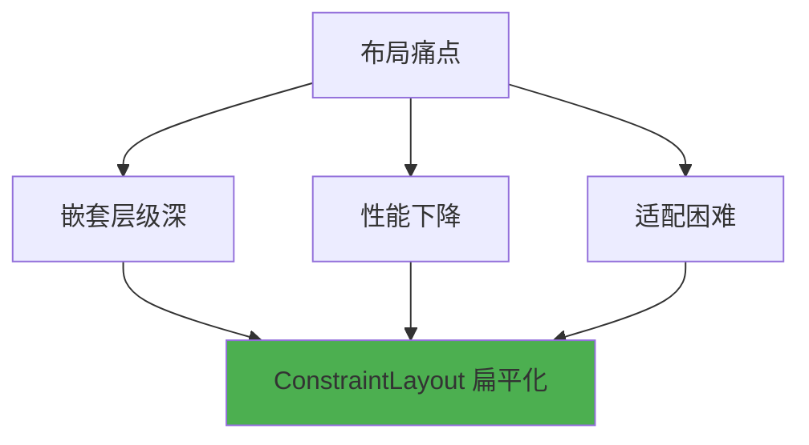

当页面出现以下情况时：
- LinearLayout 嵌套超过 2 层
- RelativeLayout 无法实现某些对齐需求
- 需要响应式适配不同屏幕尺寸
- 性能瓶颈来自布局层级

ConstraintLayout 是最佳解决方案。

## 3. 核心概念

### 3.1 约束方向

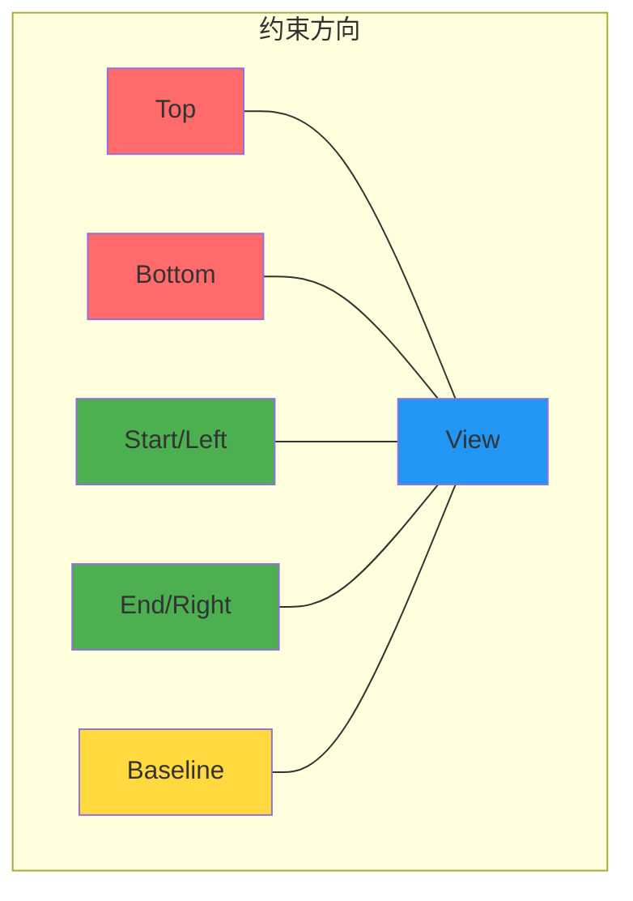

| 约束方向 | 属性 | 说明 |
|----------|------|------|
| Start/Left | `app:layout_constraintStart_toStartOf` | 左侧约束 |
| End/Right | `app:layout_constraintEnd_toEndOf` | 右侧约束 |
| Top | `app:layout_constraintTop_toTopOf` | 顶部约束 |
| Bottom | `app:layout_constraintBottom_toBottomOf` | 底部约束 |
| Baseline | `app:layout_constraintBaseline_toBaselineOf` | 文字基线对齐 |

**术语解释：**
- **约束（Constraint）**：ConstraintLayout 的核心概念，定义 View 之间或 View 与父容器之间的位置关系。每个约束就像一根"橡皮筋"，把 View 拉向目标位置。一个 View 至少需要水平和垂直各一个约束才能正确定位。
- **约束方向**：约束可以设置在 View 的 4 个方向（上下左右）+ 1 个基线方向。每个方向的约束独立计算。
- **Baseline（基线）**：文字的"基准线"，是英文字母底部对齐的那条线（不包括下伸部分如 g、y 的尾巴）。Baseline 约束用于对齐不同大小 TextView 的文字基线，让它们看起来整齐。
- **toStartOf / toEndOf**：`constraintStart_toStartOf="parent"` 表示"我的左边对齐父容器的左边"。`constraintStart_toEndOf="@id/view1"` 表示"我的左边对齐 view1 的右边"。

### 3.2 链（Chain）

链是约束布局中控制多个 View 分布方式的核心机制。

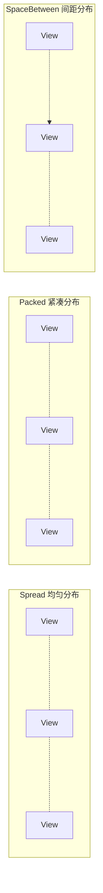

| 链类型 | 流行模式 | 效果 |
|--------|----------|------|
| Spread | `app:layout_constraintHorizontal_chainStyle="spread"` | 均匀分布，View 之间有等间距 |
| SpreadInside | `app:layout_constraintHorizontal_chainStyle="spreadInside"` | 首尾 View 靠边，中间均匀 |
| Packed | `app:layout_constraintHorizontal_chainStyle="packed"` | 所有 View 紧凑居中 |

**术语解释：**
- **链（Chain）**：将多个 View 形成一条"链"，链的第一个 View 被称为"链头"（Chain Head），控制整条链的行为。链就像一根绳子上的多个珠子，链头决定了珠子之间的间距和分布方式。
- **Spread（均匀分布）**：所有 View 之间间距相等，首尾 View 也与父容器保持等间距。就像在绳子上均匀分布的珠子。
- **SpreadInside（两端贴边）**：首尾 View 紧贴父容器边缘，中间的 View 均匀分布。就像珠子两端顶到绳子尽头。
- **Packed（居中挤压）**：所有 View 紧凑排列，整体居中。就像把所有珠子推到绳子中间挤在一起。

### 3.3 链头（Chain Head）

链的第一个 View 被称为链头，控制整条链的行为。

```xml
<!-- 链头设置在第一个 View 上 -->
<Button
    android:id="@+id/btn1"
    app:layout_constraintHorizontal_chainStyle="spread"
    app:layout_constraintHorizontal_bias="0.5" />
```

## 4. 基础用法

### 4.1 基础约束

```xml
<!-- 基础约束布局示例 -->
<androidx.constraintlayout.widget.ConstraintLayout
    android:layout_width="match_parent"
    android:layout_height="match_parent">

    <!-- 左上角固定 -->
    <TextView
        android:id="@+id/tvTopLeft"
        android:layout_width="wrap_content"
        android:layout_height="wrap_content"
        android:text="左上角"
        app:layout_constraintStart_toStartOf="parent"
        app:layout_constraintTop_toTopOf="parent" />

    <!-- 右下角固定 -->
    <TextView
        android:id="@+id/tvBottomRight"
        android:layout_width="wrap_content"
        android:layout_height="wrap_content"
        android:text="右下角"
        app:layout_constraintEnd_toEndOf="parent"
        app:layout_constraintBottom_toBottomOf="parent" />

    <!-- 居中显示 -->
    <TextView
        android:id="@+id/tvCenter"
        android:layout_width="wrap_content"
        android:layout_height="wrap_content"
        android:text="居中"
        app:layout_constraintStart_toStartOf="parent"
        app:layout_constraintEnd_toEndOf="parent"
        app:layout_constraintTop_toTopOf="parent"
        app:layout_constraintBottom_toBottomOf="parent" />

</androidx.constraintlayout.widget.ConstraintLayout>
```

### 4.2 链模式

```xml
<!-- 水平均匀分布的链 -->
<androidx.constraintlayout.widget.ConstraintLayout
    android:layout_width="match_parent"
    android:layout_height="100dp">

    <Button
        android:id="@+id/btn1"
        android:layout_width="0dp"
        android:layout_height="wrap_content"
        android:text="按钮1"
        app:layout_constraintEnd_toStartOf="@+id/btn2"
        app:layout_constraintHorizontal_chainStyle="spread"
        app:layout_constraintHorizontal_weight="1"
        app:layout_constraintStart_toStartOf="parent"
        app:layout_constraintTop_toTopOf="parent" />

    <Button
        android:id="@+id/btn2"
        android:layout_width="0dp"
        android:layout_height="wrap_content"
        android:text="按钮2"
        app:layout_constraintEnd_toStartOf="@+id/btn3"
        app:layout_constraintHorizontal_weight="1"
        app:layout_constraintStart_toEndOf="@+id/btn1"
        app:layout_constraintTop_toTopOf="parent" />

    <Button
        android:id="@+id/btn3"
        android:layout_width="0dp"
        android:layout_height="wrap_content"
        android:text="按钮3"
        app:layout_constraintEnd_toEndOf="parent"
        app:layout_constraintHorizontal_weight="1"
        app:layout_constraintStart_toEndOf="@+id/btn2"
        app:layout_constraintTop_toTopOf="parent" />

</androidx.constraintlayout.widget.ConstraintLayout>
```

## 5. 实战场景示例

### 5.1 Guideline 百分比定位

```xml
<!-- 使用 Guideline 实现 30% 位置的分隔线 -->
<androidx.constraintlayout.widget.ConstraintLayout
    android:layout_width="match_parent"
    android:layout_height="match_parent">

    <!-- 垂直 Guideline，位于 30% 位置 -->
    <androidx.constraintlayout.widget.Guideline
        android:id="@+id/guidelineVertical"
        android:layout_width="wrap_content"
        android:layout_height="wrap_content"
        android:orientation="vertical"
        app:layout_constraintGuide_percent="0.3" />

    <!-- 水平 Guideline，位于 70% 位置 -->
    <androidx.constraintlayout.widget.Guideline
        android:id="@+id/guidelineHorizontal"
        android:layout_width="wrap_content"
        android:layout_height="wrap_content"
        android:orientation="horizontal"
        app:layout_constraintGuide_percent="0.7" />

    <!-- 左侧区域 -->
    <View
        android:id="@+id/viewLeft"
        android:layout_width="0dp"
        <!-- 0dp 在 ConstraintLayout 中表示"宽度由约束决定" -->
        <!-- 这里 viewLeft 的右侧约束到 guidelineVertical -->
        <!-- 所以宽度 = guidelineVertical 的位置 - 0 -->
        
        android:layout_height="match_parent"
        android:background="#E3F2FD"
        app:layout_constraintEnd_toStartOf="@+id/guidelineVertical"
        <!-- 约束：viewLeft 的右侧 = guidelineVertical 的左侧 -->
        
        app:layout_constraintStart_toStartOf="parent"
        <!-- 约束：viewLeft 的左侧 = 父容器的左侧 -->
        
        app:layout_constraintTop_toTopOf="parent" />

    <!-- 右侧上方区域 -->
    <View
        android:id="@+id/viewRightTop"
        android:layout_width="0dp"
        android:layout_height="0dp"
        <!-- 0dp 宽高：宽度和高度都由约束决定 -->
        
        android:background="#BBDEFB"
        app:layout_constraintEnd_toEndOf="parent"
        app:layout_constraintStart_toEndOf="@+id/guidelineVertical"
        app:layout_constraintTop_toTopOf="parent"
        app:layout_constraintBottom_toTopOf="@+id/guidelineHorizontal" />

    <!-- 右侧下方区域 -->
    <View
        android:id="@+id/viewRightBottom"
        android:layout_width="0dp"
        android:layout_height="0dp"
        android:background="#90CAF9"
        app:layout_constraintEnd_toEndOf="parent"
        app:layout_constraintStart_toEndOf="@+id/guidelineVertical"
        app:layout_constraintTop_toBottomOf="@+id/guidelineHorizontal"
        app:layout_constraintBottom_toBottomOf="parent" />

</androidx.constraintlayout.widget.ConstraintLayout>
```

**术语解释：**
- **Guideline（引导线/辅助线）**：ConstraintLayout 中的虚拟参考线，用户看不到它，但其他 View 可以约束到它。就像画画时用的铅笔辅助线——画完后擦掉，但在绘制过程中帮助你定位。
- **layout_constraintGuide_percent="0.3"**：Guideline 位于父容器宽度/高度的 30% 处。0.0 是最左边/最上面，1.0 是最右边/最下面。
- **orientation="vertical"**：垂直 Guideline，是一条竖线，从上到下贯穿父容器。View 可以约束到它的左侧或右侧。
- **orientation="horizontal"**：水平 Guideline，是一条横线，从左到右贯穿父容器。View 可以约束到它的上方或下方。

### 5.2 Barrier 动态屏障

```xml
<!-- 使用 Barrier 处理不同长度文本 -->
<androidx.constraintlayout.widget.ConstraintLayout
    android:layout_width="match_parent"
    android:layout_height="wrap_content"
    android:padding="16dp">

    <!-- 标签文本（长度不固定） -->
    <TextView
        android:id="@+id/label"
        android:layout_width="wrap_content"
        android:layout_height="wrap_content"
        android:text="用户名："
        app:layout_constraintStart_toStartOf="parent"
        app:layout_constraintTop_toTopOf="parent" />

    <!-- Barrier 基于标签的结束位置 -->
    <androidx.constraintlayout.widget.Barrier
        android:id="@+id/barrier"
        android:layout_width="wrap_content"
        android:layout_height="wrap_content"
        app:barrierDirection="end"
        app:constraint_referenced_ids="label" />

    <!-- 输入框在 Barrier 右侧 -->
    <EditText
        android:id="@+id/editText"
        android:layout_width="0dp"
        android:layout_height="wrap_content"
        app:layout_constraintEnd_toEndOf="parent"
        app:layout_constraintStart_toEndOf="@+id/barrier"
        app:layout_constraintTop_toTopOf="parent" />

</androidx.constraintlayout.widget.ConstraintLayout>
```

**术语解释：**
- **Barrier（屏障）**：ConstraintLayout 中的动态参考线，它的位置不是固定的百分比，而是由它引用的 View 的边界动态决定。就像一个"移动的墙"——当引用的 View 变大时，Barrier 自动向右移动。
- **barrierDirection="end"**：Barrier 在引用 View 的右侧（LTR 布局中）。如果 `label` 文字变长，Barrier 会自动向右移动，确保 `editText` 始终在标签右侧。
- **constraint_referenced_ids="label"**：Barrier 引用的 View ID。Barrier 会跟踪这个 View 的边界。可以引用多个 View，Barrier 会取所有引用 View 的最大边界。

### 5.3 Group 分组控制

```xml
<!-- 使用 Group 同时控制多个 View 的可见性 -->
<androidx.constraintlayout.widget.ConstraintLayout
    android:layout_width="match_parent"
    android:layout_height="match_parent">

    <TextView
        android:id="@+id/tv1"
        android:layout_width="wrap_content"
        android:layout_height="wrap_content"
        android:text="标题1"
        app:layout_constraintStart_toStartOf="parent"
        app:layout_constraintTop_toTopOf="parent" />

    <TextView
        android:id="@+id/tv2"
        android:layout_width="wrap_content"
        android:layout_height="wrap_content"
        android:text="标题2"
        app:layout_constraintStart_toStartOf="parent"
        app:layout_constraintTop_toBottomOf="@+id/tv1" />

    <!-- Group 同时控制 tv1 和 tv2 -->
    <androidx.constraintlayout.widget.Group
        android:id="@+id/group"
        android:layout_width="wrap_content"
        android:layout_height="wrap_content"
        android:visibility="gone"
        app:constraint_referenced_ids="tv1,tv2" />

</androidx.constraintlayout.widget.ConstraintLayout>
```

```kotlin
// 通过 Group 控制多个 View
findViewById<Group>(R.id.group).visibility = View.VISIBLE
```

### 5.4 Placeholder 占位符

```xml
<!-- 使用 Placeholder 动态放置内容 -->
<androidx.constraintlayout.widget.ConstraintLayout
    android:layout_width="match_parent"
    android:layout_height="match_parent">

    <androidx.constraintlayout.widget.Placeholder
        android:id="@+id/placeholder"
        android:layout_width="200dp"
        android:layout_height="200dp"
        app:content="@+id/imageView"
        app:layout_constraintBottom_toBottomOf="parent"
        app:layout_constraintEnd_toEndOf="parent"
        app:layout_constraintStart_toStartOf="parent"
        app:layout_constraintTop_toTopOf="parent" />

    <ImageView
        android:id="@+id/imageView"
        android:layout_width="0dp"
        android:layout_height="0dp"
        android:scaleType="centerCrop"
        android:src="@drawable/sample"
        app:layout_constraintBottom_toBottomOf="parent"
        app:layout_constraintEnd_toEndOf="parent"
        app:layout_constraintStart_toStartOf="parent"
        app:layout_constraintTop_toTopOf="parent" />

</androidx.constraintlayout.widget.ConstraintLayout>
```

## 6. 常见错误与避坑

### ❌ 错误示例

```xml
<!-- 错误：缺少约束 -->
<TextView
    android:id="@+id/tv1"
    android:layout_width="wrap_content"
    android:layout_height="wrap_content"
    android:text="缺少约束" />

<!-- 错误：链头未设置 chainStyle -->
<Button
    android:id="@+id/btn1"
    android:layout_width="0dp"
    android:layout_height="wrap_content"
    app:layout_constraintEnd_toStartOf="@+id/btn2"
    app:layout_constraintStart_toStartOf="parent" />
```

### ✅ 正确示例

```xml
<!-- 正确：至少需要两个约束方向 -->
<TextView
    android:id="@+id/tv1"
    android:layout_width="wrap_content"
    android:layout_height="wrap_content"
    android:text="正确约束"
    app:layout_constraintStart_toStartOf="parent"
    app:layout_constraintTop_toTopOf="parent" />

<!-- 正确：链头设置 chainStyle -->
<Button
    android:id="@+id/btn1"
    android:layout_width="0dp"
    android:layout_height="wrap_content"
    app:layout_constraintEnd_toStartOf="@+id/btn2"
    app:layout_constraintHorizontal_chainStyle="spread"
    app:layout_constraintStart_toStartOf="parent" />
```

### 错误速查表

| 错误现象 | 原因 | 解决方案 |
|----------|------|----------|
| View 跳到左上角 | 缺少约束 | 添加至少两个方向的约束 |
| 链分布不符合预期 | 链头未设置 chainStyle | 在链头 View 上设置 chainStyle |
| Guideline 不生效 | 未正确引用 | 检查 `constraintGuide_percent` 值 |
| Barrier 位置错误 | 方向设置错误 | 检查 `barrierDirection` 属性 |
| Group 无法隐藏 | ID 引用错误 | 确保 `constraint_referenced_ids` 正确 |

## 7. 优势与局限

### 性能对比矩阵

| 布局方案 | 嵌套层级 | 测量次数 | 布局时间 | 内存占用 |
|----------|----------|----------|----------|----------|
| 嵌套 LinearLayout | 3-5 层 | 多次 | 慢 | 高 |
| RelativeLayout | 2 层 | 2 次 | 中等 | 中等 |
| ConstraintLayout | 1 层 | 1 次 | 快 | 低 |

### 嵌套 vs 扁平化

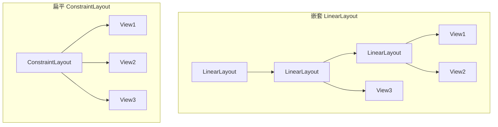

### 优势
- 扁平化层级：减少嵌套，提升性能
- 灵活性高：能实现绝大多数布局需求
- 响应式支持：Guideline 适配不同屏幕
- Android Studio 可视化设计支持完善

### 局限
- 学习曲线较陡
- XML 代码量相对较多
- 极简单布局用 LinearLayout 更直观

## 8. 进阶技巧

### 8.1 宽高比（Ratio）

```xml
<!-- 16:9 宽高比的 View -->
<ImageView
    android:id="@+id/imageView"
    android:layout_width="0dp"
    android:layout_height="0dp"
    android:scaleType="centerCrop"
    android:src="@drawable/image"
    app:layout_constraintDimensionRatio="16:9"
    app:layout_constraintEnd_toEndOf="parent"
    app:layout_constraintStart_toStartOf="parent"
    app:layout_constraintTop_toTopOf="parent" />

<!-- 正方形（1:1） -->
<View
    android:id="@+id/squareView"
    android:layout_width="0dp"
    android:layout_height="0dp"
    app:layout_constraintDimensionRatio="1:1"
    app:layout_constraintEnd_toEndOf="parent"
    app:layout_constraintStart_toStartOf="parent"
    app:layout_constraintTop_toBottomOf="@+id/imageView" />
```

### 8.2 ConstraintSet 动态约束

```kotlin
// 使用 ConstraintSet 动态修改布局
val constraintSet = ConstraintSet()
constraintSet.clone(constraintLayout)

// 修改某个 View 的约束
constraintSet.connect(
    R.id.textView,
    ConstraintSet.START,
    R.id.parent,
    ConstraintSet.START
)

// 应用修改
constraintSet.applyTo(constraintLayout)
```

### 8.3 MotionLayout 动画

```xml
<!-- 使用 MotionLayout 实现约束动画 -->
<androidx.constraintlayout.motion.widget.MotionLayout
    android:layout_width="match_parent"
    android:layout_height="match_parent"
    app:layoutDescription="@xml/motion_scene">

    <TextView
        android:id="@+id/textView"
        android:layout_width="wrap_content"
        android:layout_height="wrap_content"
        android:text="点击我"
        app:layout_constraintStart_toStartOf="parent"
        app:layout_constraintTop_toTopOf="parent" />

</androidx.constraintlayout.motion.widget.MotionLayout>
```

## 9. 面试高频考点

### Q1: ConstraintLayout 和 LinearLayout 的选择原则？

**答**: 
- 简单线性排列（水平或垂直）→ LinearLayout
- 复杂平面布局、需要响应式适配 → ConstraintLayout
- 性能敏感场景 → ConstraintLayout（扁平化）

### Q2: 链的三种模式有什么区别？

**答**: 
- Spread：均匀分布，View 之间有等间距
- Packed：所有 View 紧凑居中
- SpreadInside：首尾靠边，中间均匀

### Q3: Guideline 和 Barrier 的区别？

**答**: 
- Guideline：基于百分比或固定值定位，位置固定
- Barrier：基于其他 View 的边界动态调整，位置随内容变化

### Q4: 如何处理宽高比？

**答**: 使用 `app:layout_constraintDimensionRatio` 属性，如 `16:9`、`1:1`。

### Q5: ConstraintLayout 的性能优势在哪里？

**答**: 通过扁平化层级减少嵌套，降低测量和布局次数，提升渲染性能。

## 10. 小结与下一步

### 快速参考卡

```
┌─────────────────────────────────────┐
│     ConstraintLayout 快速参考       │
├─────────────────────────────────────┤
│  约束方向：start/end/top/bottom    │
│  链模式：spread/packed/spreadInside│
│  百分比：Guideline                  │
│  动态屏障：Barrier                  │
│  分组控制：Group                    │
│  占位符：Placeholder                │
│  宽高比：dimensionRatio             │
│  动态约束：ConstraintSet            │
│  动画：MotionLayout                 │
└─────────────────────────────────────┘
```

### 下一步学习

- 📖 [MotionLayout 动画](./06-MotionLayout.md) - 深入动画系统
- 📖 [RecyclerView](./07-RecyclerView.md) - 列表性能优化

---

## 📝 课后练习

1. **基础练习**: 创建一个 ConstraintLayout，实现四个角定位的 View
2. **进阶练习**: 使用 Guideline 实现三列等分布局
3. **挑战练习**: 使用 Barrier 实现动态高度的列表项

## ✅ 自测题

1. ConstraintLayout 最少需要几个方向的约束？
   - A) 1个
   - B) 2个
   - C) 3个
   - D) 4个

2. 链头设置在哪个 View 上？
   - A) 最后一个 View
   - B) 第一个 View
   - C) 中间的 View
   - D) 任意 View

3. Guideline 的定位方式是？
   - A) 百分比或固定值
   - B) 相对于其他 View
   - C) 随机位置
   - D) 无法控制

**答案**: 1-B, 2-B, 3-A

## 🎬 渲染逻辑详解

### ConstraintLayout 的约束求解机制

ConstraintLayout 的核心优势在于**一次测量**完成所有布局计算：

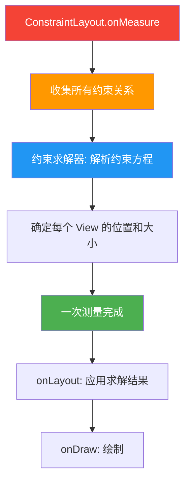

**与其他布局的测量对比：**

```plaintext
LinearLayout (有 weight):
  第1轮: 测量所有子View基础大小
  第2轮: 按weight分配剩余空间
  → 2 次 measure

RelativeLayout:
  第1轮: 测量没有依赖的View
  第2轮: 测量依赖已测量View的View
  → 2 次 measure

ConstraintLayout:
  1次: 收集所有约束 → 求解器计算 → 一次性确定所有位置
  → 1 次 measure ✅
```

### 约束系统的数学原理

ConstraintLayout 内部使用**约束求解器**（类似于线性规划）：

```plaintext
每个 View 有 4 个方向的约束：
  start ←→ parent (或其他 View)
  end   ←→ parent (或其他 View)
  top   ←→ parent (或其他 View)
  bottom←→ parent (或其他 View)

约束类型：
  固定约束: constraintStart_toStartOf="parent"  → x = 0
  相对约束: constraintStart_toEndOf="@id/view1"  → x = view1.right
  链式约束: view1 ←→ view2 ←→ view3            → 按比例分配
  百分比约束: constraintGuide_percent="0.3"      → x = parentWidth × 0.3
```

### Chain 链的渲染机制

```plaintext
Chain 的三种模式在渲染时的行为：

Spread（均匀分布）:
  |---space---[View1]---space---[View2]---space---[View3]---space---|
  每个 View 之间的间距相等

SpreadInside（两端贴边）:
  |[View1]------space------[View2]------space------[View3]|
  首尾 View 靠边，中间间距相等

Packed（居中挤压）:
  |----------[View1][View2][View3]----------|
  所有 View 紧凑居中
```

### 性能优势的渲染原理

| 布局方案 | 嵌套层级 | 测量次数 | 布局时间 | 原因 |
|---------|---------|---------|---------|------|
| 嵌套 LinearLayout | 3-5 层 | 3-5 次 | 慢 | 每层嵌套增加 1 次测量 |
| RelativeLayout | 1-2 层 | 2 次 | 中等 | 固定 2 轮测量 |
| **ConstraintLayout** | **1 层** | **1 次** | **快** | **扁平化 + 约束求解** |

---

## 🔗 知识依赖图

### 与前后章节的关系

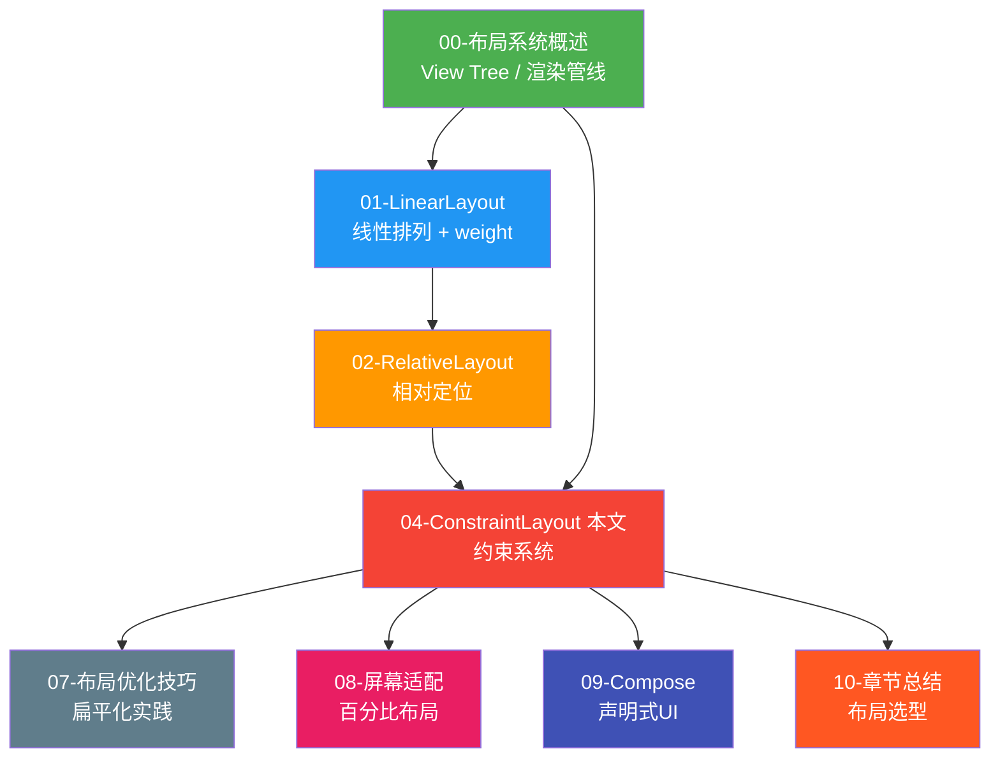

### 核心知识点的章节串联

| 知识点 | 本章内容 | 关联章节 | 关联说明 |
|--------|---------|---------|---------|
| **约束系统** | View 之间的相对位置关系 | 02-RelativeLayout | RelativeLayout 用属性替代约束 |
| **Chain** | 多个View形成分布组 | 01-LinearLayout | LinearLayout 用 weight 替代 Chain |
| **Guideline** | 百分比辅助线 | 08-屏幕适配 | 08 章用 Guideline 实现百分比布局 |
| **Barrier** | 动态屏障 | 07-优化 | 07 章讲 Barrier 避免循环约束 |
| **扁平化** | 1层替代多层嵌套 | 07-优化 | 07 章核心优化手段 |
| **Group** | 统一控制可见性 | 01-LinearLayout | LinearLayout 用 visibility 逐个控制 |
| **MotionLayout** | 约束动画 | 09-Compose | Compose 用动画 API 替代 |

### 组件关系图

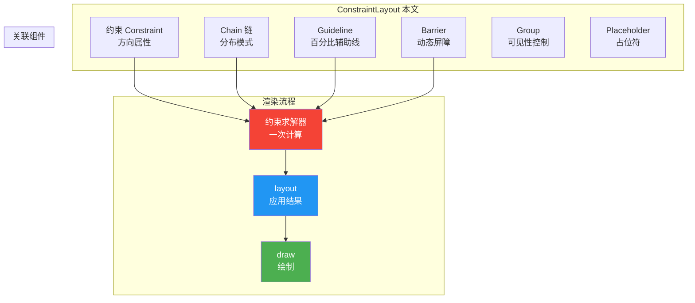

---

## 💼 实战项目

**项目**: 构建响应式仪表盘界面
- 使用 ConstraintLayout 扁平化布局
- 使用 Guideline 实现百分比网格
- 使用 Barrier 处理动态文本长度
- 使用 Group 控制不同状态显示
- 实现宽高比响应式图片

## 🔍 代码审查清单

- [ ] 所有 View 是否都有完整的约束
- [ ] 链是否正确设置了 chainStyle
- [ ] Guideline 的百分比值是否合理
- [ ] Barrier 的引用 ID 是否正确
- [ ] Group 的 constraint_referenced_ids 是否完整
- [ ] 是否避免了不必要的嵌套

## 📖 术语表

| 术语 | 英文 | 说明 |
|------|------|------|
| 约束 | Constraint | View 之间的相对位置关系 |
| 链 | Chain | 控制多个 View 分布的机制 |
| 链头 | Chain Head | 链的第一个 View |
| Guideline | Guideline | 基于百分比或固定值的参考线 |
| Barrier | Barrier | 基于其他 View 边界的动态屏障 |
| Group | Group | 同时控制多个 View 可见性 |
| Placeholder | Placeholder | 动态放置内容的占位符 |
| 宽高比 | DimensionRatio | 控制 View 的比例 |
| ConstraintSet | ConstraintSet | 动态修改约束的工具 |
| MotionLayout | MotionLayout | 支持约束动画的布局 |

---

## 📚 扩展阅读

- [Android 官方文档 - ConstraintLayout](https://developer.android.com/reference/androidx/constraintlayout/widget/ConstraintLayout)
- [MotionLayout 指南](https://developer.android.com/training/constraintlayout/motionlayout)
- [性能优化最佳实践](https://developer.android.com/topic/performance/vitals/render)

---

## 🔬 Cassowary 约束求解器底层深度解析

> 本节深入 ConstraintLayout 的最底层实现机制——约束求解器。如果你想知道"约束到底是怎么变成像素坐标的"，这一节会给你完整答案。

### 10.1 约束求解器是什么

**术语解释：约束求解器（Constraint Solver）**

想象你在解一个数独游戏。数独的每个格子都有约束：同一行不能有重复数字、同一列不能有重复数字、每个九宫格不能有重复数字。你需要找到一组数字，**同时满足所有约束**。

ConstraintLayout 的约束求解器做的事情非常类似——它把每个 View 的位置和大小当作"未知数"，把每条约束当作一个"方程"或"不等式"，然后用数学算法**同时求解所有方程**，得到每个 View 的最终坐标和尺寸。

ConstraintLayout 内部使用的约束求解器基于 **Cassowary 算法**，这是一种增量式线性算术约束求解算法，由 Greg J. Badros 和 Alan Borning 在 1999 年提出。它专门为用户界面布局场景设计，能够高效处理大量线性等式和不等式约束。

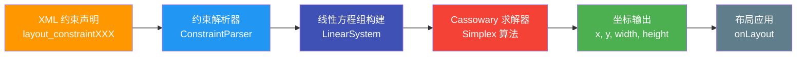

**术语解释：Cassowary 算法**

Cassowary（鹤鸵，一种不会飞的鸟）这个名字是算法作者的趣味命名。它的核心思想是：

- **线性规划（Linear Programming）**：把所有约束转化为线性方程（如 `x = 5`、`a + b = 100`）和线性不等式（如 `x >= 0`、`a + b <= 200`），然后用单纯形法（Simplex Method）求解。
- **增量求解（Incremental Solving）**：当约束发生变化时（比如用户旋转屏幕），不需要从头重新求解所有方程，而是在已有解的基础上增量更新，提升效率。
- **优先级（Priority/Strength）**：约束可以有不同强度——必需约束（Required，必须满足）、强约束（Strong，尽量满足）、弱约束（Weak，优先级最低）。当约束冲突时，求解器会优先满足高优先级约束。

---

### 10.2 约束方程的数学建模

每一条 XML 约束属性都会被转化为一个线性方程。让我们用具体例子来说明。

**术语解释：线性方程组（System of Linear Equations）**

回忆一下中学数学：`x + y = 10` 是一个二元一次方程，有两个未知数。如果你还有另一个方程 `x - y = 4`，两个方程联立就能解出 `x = 7, y = 3`。ConstraintLayout 做的事情完全一样——把约束变成方程，联立求解。

#### 示例：两个按钮的约束方程

假设有一个 1000px 宽的父容器，包含两个按钮：

```xml
<ConstraintLayout android:layout_width="1000px" ...>
    <Button android:id="@+id/btn1"
        android:layout_width="200px"
        app:layout_constraintStart_toStartOf="parent"
        app:layout_constraintTop_toTopOf="parent" />

    <Button android:id="@+id/btn2"
        android:layout_width="300px"
        app:layout_constraintStart_toEndOf="@id/btn1"
        android:layout_marginStart="50px"
        app:layout_constraintTop_toTopOf="parent" />
</ConstraintLayout>
```

转化为约束方程组：

```plaintext
// 变量定义
//   btn1.x  = btn1 左边 x 坐标
//   btn1.w  = btn1 宽度
//   btn2.x  = btn2 左边 x 坐标
//   btn2.w  = btn2 宽度
//   parent.w = 1000 (已知常量)

// 约束方程 1: btn1 左边 = parent 左边
//   constraintStart_toStartOf="parent"
btn1.x = 0

// 约束方程 2: btn1 宽度固定
btn1.w = 200

// 约束方程 3: btn2 左边 = btn1 右边 + margin
//   constraintStart_toEndOf="@id/btn1" + margin 50px
//   btn1 右边 = btn1.x + btn1.w
btn2.x = btn1.x + btn1.w + 50

// 约束方程 4: btn2 宽度固定
btn2.w = 300
```

求解过程：

```plaintext
步骤 1: btn1.x = 0          (直接由方程 1 得出)
步骤 2: btn1.w = 200         (直接由方程 2 得出)
步骤 3: btn2.x = 0 + 200 + 50 = 250  (代入方程 3)
步骤 4: btn2.w = 300         (直接由方程 4 得出)

最终结果:
  btn1: x=0,  width=200  → 占据 [0, 200]
  btn2: x=250, width=300 → 占据 [250, 550]
```

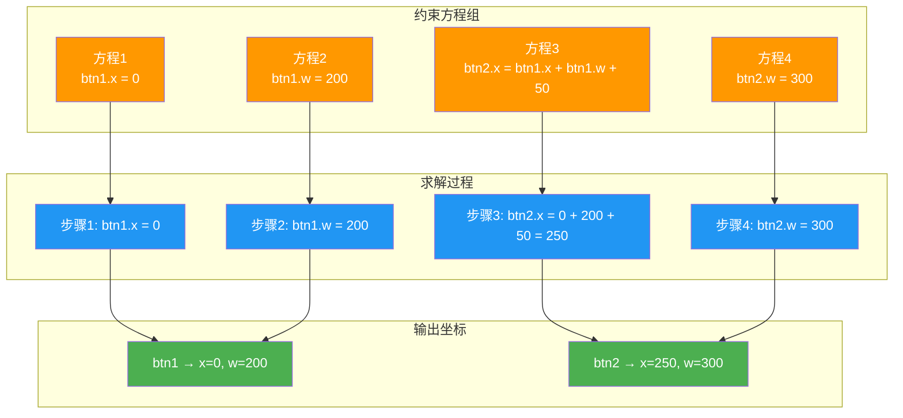

---

### 10.3 单轮测量的实现原理

**术语解释：单轮测量（Single-pass Measurement）**

传统布局像"接力跑"——LinearLayout 先量第一行，再量第二行，一层一层传递；RelativeLayout 先量没有依赖的 View，再量有依赖的 View，需要两轮。ConstraintLayout 像"考试交卷"——所有 View 同时把约束（答案卷）交上去，求解器一次性批改完所有卷子，直接公布所有人的分数（坐标）。

ConstraintLayout 在 `onMeasure()` 中完成以下步骤：

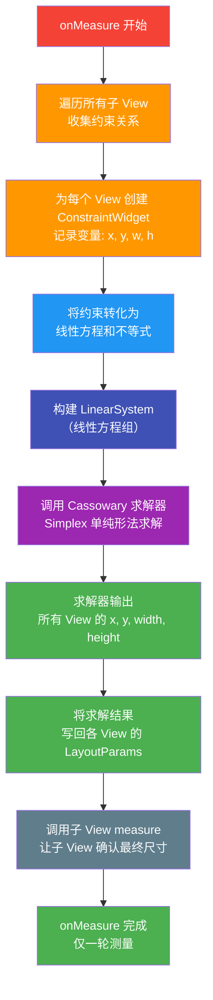

关键代码层面的流程（简化伪代码）：

```kotlin
// ConstraintLayout.onMeasure() 简化伪代码
override fun onMeasure(widthSpec: Int, heightSpec: Int) {
    // 1. 为每个子 View 创建 ConstraintWidget
    val container = ConstraintWidgetContainer()
    for (child in children) {
        val widget = ConstraintWidget()
        widget.parseConstraintsFromLayoutParams(child.layoutParams)
        container.add(widget)
    }

    // 2. 构建线性方程组
    val system = LinearSystem()
    container.addChildrenToSolver(system)  // 将约束转为方程

    // 3. 求解！一次调用，解出所有 View 的位置和大小
    system.solve()

    // 4. 将求解结果写回子 View
    container.updateChildrenFromSolver()  // 读取 x, y, w, h

    // 5. 对子 View 执行 measure（此时已知确切尺寸）
    for (child in children) {
        measureChildWithMargins(child, ...)
    }

    setMeasuredDimension(width, height)
}
```

**对比传统布局的测量流程：**

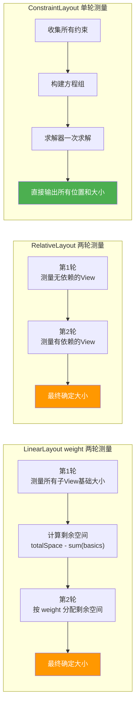

---

### 10.4 Chain 链的求解算法

**术语解释：Chain 在求解器中的表达**

Chain 本质上是求解器中的一组**联立方程**。三种链模式对应三种不同的约束方程组合方式。

假设父容器宽度为 1000px，三个按钮宽度均为 100px，形成水平链：

#### Spread 模式

```plaintext
// Spread: 等间距分布，首尾也有间距
//
//  |--gap-- [btn1] --gap-- [btn2] --gap-- [btn3] --gap--|
//
// 约束方程:
//   btn1.x = parent.x + gap              (btn1 左边距 gap)
//   btn2.x = btn1.x + btn1.w + gap       (btn2 在 btn1 右侧 gap 处)
//   btn3.x = btn2.x + btn2.w + gap       (btn3 在 btn2 右侧 gap 处)
//   btn3.x + btn3.w + gap = parent.w     (btn3 右边距 gap)
//
// 已知: parent.w = 1000, btn1.w = btn2.w = btn3.w = 100
// 总间距 = 1000 - 300 = 700, 间距数 = 4
// gap = 700 / 4 = 175
//
// 求解结果:
//   btn1: x=175,  btn2: x=450,  btn3: x=725
```

#### SpreadInside 模式

```plaintext
// SpreadInside: 首尾贴边，中间均匀
//
//  [btn1] --gap-- [btn2] --gap-- [btn3]
//
// 约束方程:
//   btn1.x = parent.x                    (btn1 左边贴 parent)
//   btn2.x = btn1.x + btn1.w + gap
//   btn3.x = btn2.x + btn2.w + gap
//   btn3.x + btn3.w = parent.w           (btn3 右边贴 parent)
//
// 总间距 = 1000 - 300 = 700, 间距数 = 2
// gap = 700 / 2 = 350
//
// 求解结果:
//   btn1: x=0,  btn2: x=450,  btn3: x=900
```

#### Packed 模式

```plaintext
// Packed: 紧凑居中
//
//  |----margin----[btn1][btn2][btn3]----margin----|
//
// 约束方程:
//   btn1.x = parent.x + margin            (整体左偏移 margin)
//   btn2.x = btn1.x + btn1.w              (btn2 紧贴 btn1，间距 0)
//   btn3.x = btn2.x + btn2.w              (btn3 紧贴 btn2，间距 0)
//   margin = (parent.w - btn1.w - btn2.w - btn3.w) / 2  (居中)
//
// margin = (1000 - 300) / 2 = 350
//
// 求解结果:
//   btn1: x=350,  btn2: x=450,  btn3: x=550
```

```mermaid
graph TB
    subgraph Spread["Spread 均匀分布"]
        SP1["gap=175"] --> SP2["[btn1] x=175"]
        SP2 --> SP3["gap=175"]
        SP3 --> SP4["[btn2] x=450"]
        SP4 --> SP5["gap=175"]
        SP5 --> SP6["[btn3] x=725"]
        SP6 --> SP7["gap=175"]
    end

    subgraph SpreadInside["SpreadInside 两端贴边"]
        SI1["[btn1] x=0"] --> SI2["gap=350"]
        SI2 --> SI3["[btn2] x=450"]
        SI3 --> SI4["gap=350"]
        SI4 --> SI5["[btn3] x=900"]
    end

    subgraph Packed["Packed 居中挤压"]
        PK1["margin=350"] --> PK2["[btn1] x=350"]
        PK2 --> PK3["[btn2] x=450"]
        PK3 --> PK4["[btn3] x=550"]
        PK4 --> PK5["margin=350"]
    end

    style SP2 fill:#4CAF50,color:#fff
    style SP4 fill:#4CAF50,color:#fff
    style SP6 fill:#4CAF50,color:#fff
    style SI1 fill:#2196F3,color:#fff
    style SI3 fill:#2196F3,color:#fff
    style SI5 fill:#2196F3,color:#fff
    style PK2 fill:#FF9800,color:#fff
    style PK3 fill:#FF9800,color:#fff
    style PK4 fill:#FF9800,color:#fff
```

---

### 10.5 Barrier 的动态求解

**术语解释：Barrier 在求解器中的角色**

Barrier 本身就是一个**特殊变量**，它的值不是固定的，而是由引用的 View 的边界动态计算得出。求解器在求解过程中会先确定被引用 View 的位置和大小，然后根据 Barrier 的方向计算出 Barrier 的坐标，最后再把这个坐标作为其他 View 约束的目标。

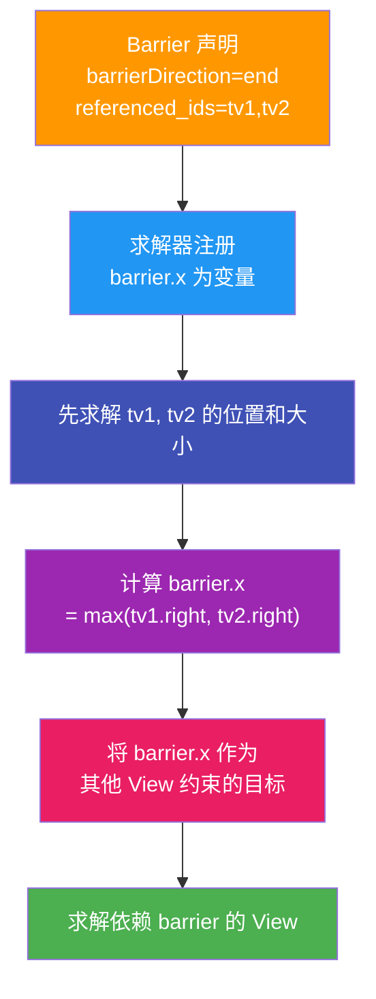

具体示例：

```plaintext
// 假设 tv1 和 tv2 的最终位置已求出:
//   tv1: x=0, width=80  → right=80
//   tv2: x=0, width=120 → right=120

// Barrier direction=end, 引用 tv1, tv2
// Barrier 取最大右边界:
//   barrier.x = max(tv1.right, tv2.right) = max(80, 120) = 120

// 依赖 barrier 的 editText:
//   editText.x = barrier.x + margin
//   editText.x = 120 + 8 = 128

// 如果 tv2 文字变长，width 变为 200:
//   barrier.x = max(80, 200) = 200
//   editText.x = 200 + 8 = 208  ← 自动跟随移动
```

**术语解释：动态求解（Dynamic Solving）**

Barrier 的"动态"体现在：它不是在 XML 解析时确定位置，而是在**每次求解时实时计算**。如果引用的 View 因为内容变化导致边界改变，Barrier 会在下一次 `onMeasure` 中自动更新位置。这就像一个"智能墙"——它会自动跑到所有家具的最外侧。

---

### 10.6 Guideline 的虚拟节点

**术语解释：虚拟节点（Virtual Node/Helper）**

Guideline 是一个"幽灵"——它存在于约束系统中，参与方程求解，但它**不占用任何布局空间，不会被绘制，也不参与 measure/layout**。它只是一个坐标参考点，就像地图上的经纬线——你看不到它，但它帮你定位。

在求解器中，Guideline 被建模为一个**约束变量**：

```plaintext
// Guideline 声明: orientation=vertical, percent=0.3
// 在求解器中注册为一个变量:
//   guideline.x = parent.w * 0.3

// 当 parent.w = 1000 时:
//   guideline.x = 1000 * 0.3 = 300

// 其他 View 可以约束到 guideline:
//   viewLeft.end = guideline.x     → viewLeft 右边 = 300
//   viewRight.start = guideline.x  → viewRight 左边 = 300
```

Guideline 的三种定位方式对应不同的方程：

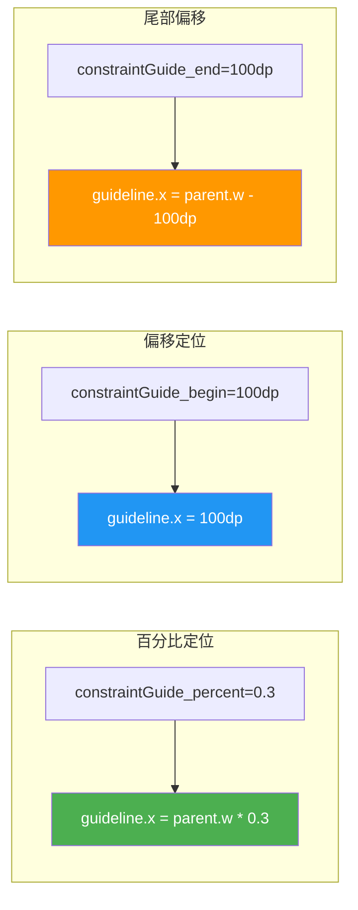

Guideline 和 Barrier 都是"虚拟 Helper"——它们不渲染，只参与约束求解。区别在于：Guideline 的位置在求解前就确定了（百分比或固定值），而 Barrier 的位置需要在求解过程中动态计算。

---

### 10.7 与 RelativeLayout 拓扑排序的对比

**术语解释：拓扑排序（Topological Sort）**

拓扑排序是一种"排队"算法。想象你在穿衣服：你必须先穿内衣再穿衬衫，先穿袜子再穿鞋。拓扑排序就是找出一个合法的穿衣顺序。RelativeLayout 用类似的思路——先排列没有依赖的 View，再排列依赖它们的 View。但问题是，有些依赖关系形成"环"时，拓扑排序就无法处理了。

**术语解释：单纯形法（Simplex Method）**

单纯形法是线性规划中的经典算法，用于求解线性方程组的最优解。它不像拓扑排序那样"逐个处理"，而是把所有方程放在一起，通过矩阵运算同时求解。时间复杂度是 O(n^3)，其中 n 是变量数量。

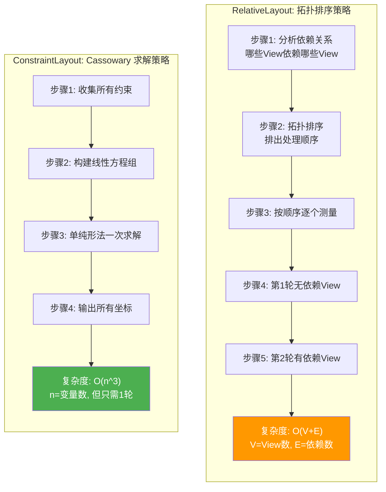

**两种策略的深度对比：**

| 对比维度 | RelativeLayout 拓扑排序 | ConstraintLayout Cassowary |
|----------|------------------------|---------------------------|
| 算法类型 | 图算法（拓扑排序） | 线性规划（单纯形法） |
| 时间复杂度 | O(V + E) | O(n^3) |
| 测量轮数 | 2 轮 | 1 轮 |
| 处理方式 | 逐个 View 顺序处理 | 所有 View 同时求解 |
| 循环依赖 | 无法处理，会报错 | 可以通过优先级处理冲突 |
| 约束冲突 | 无优先级机制 | 支持 Required/Strong/Weak 优先级 |
| 优势 | 简单 View 少时速度快 | 复杂布局整体更快 |
| 劣势 | View 多时多轮测量慢 | View 少时初始化开销大 |

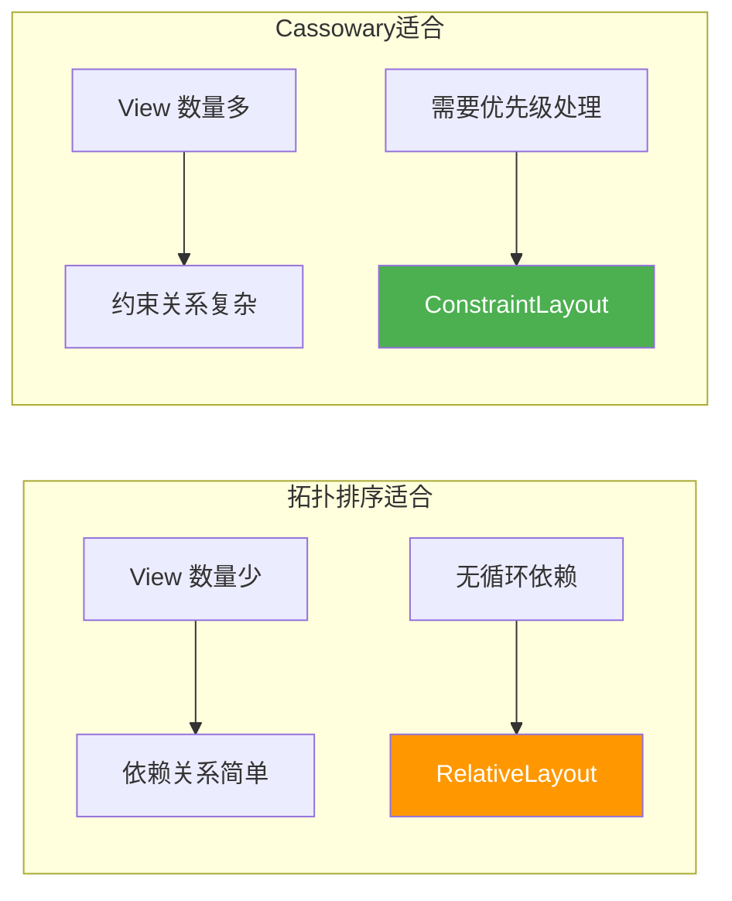

**为什么 ConstraintLayout 虽然单次求解复杂度更高，但实际更快？**

```plaintext
RelativeLayout:
  虽然拓扑排序 O(V+E) 看起来比 O(n^3) 快
  但需要 2 轮测量，每轮都要遍历所有子 View
  总测量次数 = 2 × childCount
  而且嵌套 RelativeLayout 时，每层都 2 轮

ConstraintLayout:
  虽然单纯形法 O(n^3) 看起来更慢
  但只需 1 轮测量，扁平化无嵌套
  总测量次数 = 1 × childCount
  当 childCount 较大时，省掉的测量轮次远超求解器开销
```

**术语解释：为什么 O(n^3) 有时比 O(V+E) 更快？**

打个比方：拓扑排序像"一个老师逐个批改作业"——每份作业要等上一份改完才开始。如果班上有 30 个学生，每人花 1 分钟，总共 30 分钟。而 Cassowary 像"30 个老师同时批改"——虽然每个老师的工资（复杂度）更高，但所有作业同时完成，总共只需 1 分钟。当学生（View）足够多时，并行求解的优势就体现出来了。

---

## 📐 设计理念与架构图

> 本节从宏观设计角度审视 ConstraintLayout，理解它的组件体系、架构层次以及与声明式 UI 的关系。

### 11.1 设计目标：约束即关系

ConstraintLayout 的核心设计理念可以浓缩为三个关键词：

**术语解释：约束即关系（Constraint as Relationship）**

传统布局用"嵌套"表达关系——你想让 A 在 B 右边，就把 A 和 B 放进一个 LinearLayout 里。ConstraintLayout 用"约束"表达关系——直接声明 `A.start = B.end`，不需要嵌套。这就像从"把东西放进不同抽屉来分类"变成了"给东西贴标签说明它们的关系"。

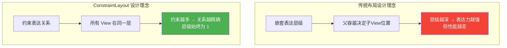

三大设计目标：

| 设计目标 | 传统布局的痛点 | ConstraintLayout 的解决方案 |
|----------|--------------|---------------------------|
| **替代嵌套布局** | 3-5 层嵌套导致性能下降 | 扁平化到 1 层，所有 View 直接子节点 |
| **扁平化层级** | View 树深度影响测量次数 | 单层结构，一次测量完成所有计算 |
| **约束即关系** | 嵌套关系隐式且不灵活 | 显式声明约束，灵活表达任意位置关系 |

---

### 11.2 组件体系架构图

ConstraintLayout 不仅仅是一个 Layout，它是一个完整的**约束系统**，包含多个协作组件。

**术语解释：组件体系（Component System）**

ConstraintLayout 不只是"一个布局容器"，它更像一个"工具箱"——里面有主容器（ConstraintLayout）、约束状态管理器（ConstraintSet）、辅助工具（Guideline/Barrier/Group/Placeholder）和状态机（ConstraintLayoutStates）。每个工具有自己的职责，组合使用才能发挥最大威力。

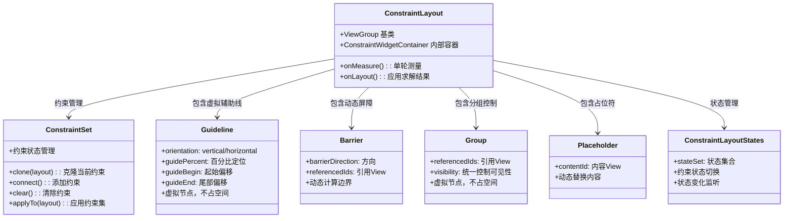

各组件的职责说明：

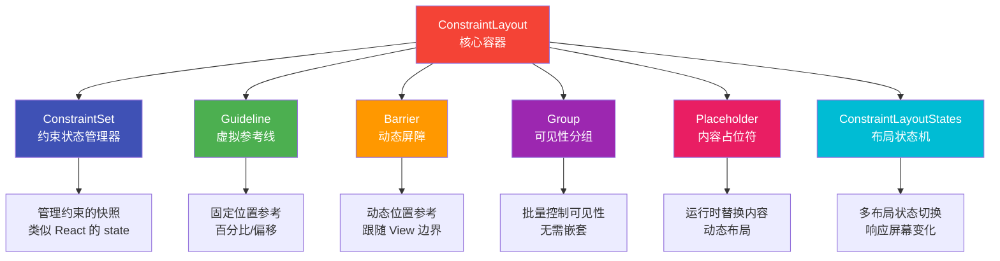

---

### 11.3 约束求解器架构

ConstraintLayout 的内部架构分为四层：Widget 层、Container 层、LinearSystem 层和 Solver 层。

**术语解释：四层架构**

ConstraintLayout 的内部像一个工厂流水线：
- **ConstraintWidget 层**：每个 View 对应一个 Widget，记录 View 的约束信息（像零件图纸）
- **ConstraintWidgetContainer 层**：管理所有 Widget 的容器（像装配车间）
- **LinearSystem 层**：把约束转化为数学方程组（像把图纸翻译成机器指令）
- **Solver 层**：执行求解算法，输出坐标（像机器执行指令，产出成品）

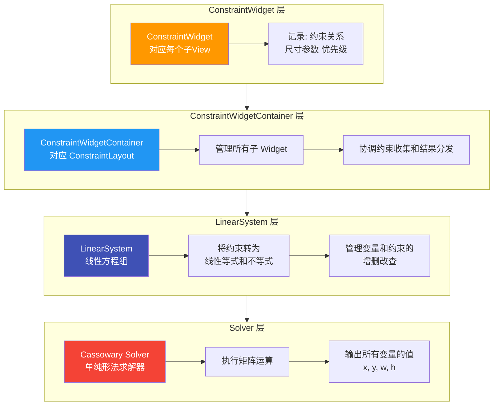

**术语解释：ConstraintWidget**

ConstraintWidget 是每个 View 在约束系统中的"替身"。View 本身是 Android 框架的对象，有 measure/layout/draw 等重逻辑。ConstraintWidget 是轻量级的纯数据对象，只记录约束关系和尺寸参数。ConstraintLayout 在求解时操作的是 ConstraintWidget，而不是 View 本身——求解完成后再把结果写回 View。

**术语解释：LinearSystem**

LinearSystem 是约束方程组的容器。它管理所有变量（每个 View 的 x, y, width, height）和所有约束（等式和不等式）。它的职责是把 XML 声明的约束翻译成数学方程，然后交给 Solver 求解。

```mermaid
graph LR
    subgraph 数据流
        A["View + LayoutParams"] -->|解析| B["ConstraintWidget<br/>约束数据"]
        B -->|注册| C["LinearSystem<br/>方程组"]
        C -->|求解| D["Solver<br/>Cassowary"]
        D -->|输出| E["求解结果<br/>x, y, w, h"]
        E -->|写回| F["View<br/>setLayoutParams"]
    end

    style A fill:#FF9800,color:#fff
    style B fill:#2196F3,color:#fff
    style C fill:#3F51B5,color:#fff
    style D fill:#F44336,color:#fff
    style E fill:#4CAF50,color:#fff
    style F fill:#607D8B,color:#fff
```

---

### 11.4 ConstraintLayout 2.0 与 MotionLayout 的设计意图

**术语解释：MotionLayout**

MotionLayout 是 ConstraintLayout 2.0 引入的核心新组件，它将**约束系统**和**动画系统**融合在一起。传统动画是"代码驱动"的——你写代码改变 View 的属性（位置、大小、透明度）。MotionLayout 是"约束驱动"的——你定义两个约束状态（起始和结束），MotionLayout 自动在两个状态之间插值，生成流畅的过渡动画。

```mermaid
graph TD
    subgraph 传统动画方式["传统动画: 代码驱动"]
        TA1["定义动画代码"] --> TA2["手动改变属性<br/>translationX, alpha, scale..."]
        TA2 --> TA3["需要手动计算<br/>每一帧的值"]
    end

    subgraph MotionLayout方式["MotionLayout: 约束驱动"]
        ML1["定义起始约束状态<br/>ConstraintSet A"] --> ML2["定义结束约束状态<br/>ConstraintSet B"]
        ML2 --> ML3["MotionLayout 自动插值<br/>在 A 和 B 之间过渡"]
        ML3 --> ML4["自动处理位置/大小/<br/>透明度/颜色等变化"]
    end

    style TA3 fill:#F44336,color:#fff
    style ML4 fill:#4CAF50,color:#fff
```

设计意图的三个层面：

```mermaid
graph TB
    subgraph 约束系统融合["约束 + 动画融合"]
        F1["约束系统<br/>定义布局关系"] --> F3["MotionLayout<br/>约束即动画关键帧"]
        F2["动画系统<br/>定义时间变化"] --> F3
    end

    subgraph 状态管理["状态管理"]
        S1["State A: 展开状态<br/>ConstraintSet"] --> S3["MotionLayout<br/>平滑过渡"]
        S2["State B: 收起状态<br/>ConstraintSet"] --> S3
    end

    subgraph 声明式动画["声明式动画"]
        D1["XML 声明约束状态"] --> D2["MotionScene 定义过渡"]
        D2 --> D3["运行时自动执行<br/>无需手写动画代码"]
    end

    style F3 fill:#F44336,color:#fff
    style S3 fill:#2196F3,color:#fff
    style D3 fill:#4CAF50,color:#fff
```

MotionScene 的结构：

```xml
<!-- MotionScene: 定义约束状态之间的过渡 -->
<MotionScene xmlns:android="http://schemas.android.com/apk/res/android"
    xmlns:app="http://schemas.android.com/apk/res-auto">

    <!-- 起始约束状态 -->
    <ConstraintSet android:id="@+id/start">
        <Constraint android:id="@+id/button">
            <Layout
                app:layout_constraintStart_toStartOf="parent"
                app:layout_constraintTop_toTopOf="parent" />
        </Constraint>
    </ConstraintSet>

    <!-- 结束约束状态 -->
    <ConstraintSet android:id="@+id/end">
        <Constraint android:id="@+id/button">
            <Layout
                app:layout_constraintEnd_toEndOf="parent"
                app:layout_constraintBottom_toBottomOf="parent" />
        </Constraint>
    </ConstraintSet>

    <!-- 过渡定义 -->
    <Transition
        app:constraintSetStart="@id/start"
        app:constraintSetEnd="@id/end"
        app:duration="1000">
        <!-- MotionLayout 自动在两个约束状态之间插值 -->
    </Transition>
</MotionScene>
```

---

### 11.5 ConstraintSet 的状态管理设计

**术语解释：ConstraintSet**

ConstraintSet 是约束的"快照"——它记录了某一时刻所有 View 的约束关系。你可以把它想象成"存档点"：游戏中的存档记录了角色的位置和状态，ConstraintSet 记录了所有 View 的约束。你可以随时加载不同的存档（ConstraintSet），让布局瞬间切换到不同的状态。

这与 React 的 state 管理理念相似：

```mermaid
graph TB
    subgraph React状态管理
        RS1["State A"] --> RS3["setState(State B)<br/>触发重新渲染"]
        RS2["State B"] --> RS3
    end

    subgraph ConstraintLayout状态管理
        CS1["ConstraintSet A<br/>展开布局"] --> CS3["applyTo(layout)<br/>触发重新布局"]
        CS2["ConstraintSet B<br/>收起布局"] --> CS3
    end

    style RS3 fill:#61DAFB,color:#fff
    style CS3 fill:#F44336,color:#fff
```

ConstraintSet 的典型使用模式：

```kotlin
// 定义两个布局状态
val expandedSet = ConstraintSet().apply {
    clone(binding.constraintLayout)
    // 展开状态: 所有View可见，间距大
    setMargin(R.id.content, ConstraintSet.START, 0)
    setMargin(R.id.content, ConstraintSet.END, 0)
    setVisibility(R.id.detailView, ConstraintSet.VISIBLE)
}

val collapsedSet = ConstraintSet().apply {
    clone(binding.constraintLayout)
    // 收起状态: detailView隐藏，内容占满
    setVisibility(R.id.detailView, ConstraintSet.GONE)
    connect(R.id.content, ConstraintSet.END, ConstraintSet.PARENT_ID, ConstraintSet.END)
}

// 切换状态
fun toggleLayout(isExpanded: Boolean) {
    val targetSet = if (isExpanded) expandedSet else collapsedSet
    // 一行代码切换整个布局的约束状态
    targetSet.applyTo(binding.constraintLayout)
}
```

```mermaid
graph LR
    A["ConstraintSet.clone()<br/>克隆当前约束"] --> B["ConstraintSet.modify()<br/>修改约束"]
    B --> C["ConstraintSet.applyTo()<br/>应用到布局"]
    C --> D["ConstraintLayout<br/>重新求解约束"]
    D --> E["布局更新<br/>所有View重新定位"]

    style A fill:#FF9800,color:#fff
    style C fill:#2196F3,color:#fff
    style D fill:#F44336,color:#fff
    style E fill:#4CAF50,color:#fff
```

**术语解释：状态切换（State Transition）**

ConstraintSet 让布局具有"状态"概念。就像一个 App 有"白天模式"和"夜间模式"——你可以定义两套 ConstraintSet，分别对应不同状态，通过 `applyTo()` 一键切换。这比手动修改每个 View 的 LayoutParams 要优雅得多。

---

### 11.6 ConstraintLayout 与 Compose 的关系

**术语解释：声明式 UI（Declarative UI）**

声明式 UI 的核心理念是"描述结果而非过程"。传统命令式 UI 是"先创建 View A，再把 View B 放到 A 右边，然后设置 A 的宽度"。声明式 UI 是"View A 和 View B 并排，A 宽度为 200"——你只描述最终状态，框架负责如何实现。Jetpack Compose 是 Android 的声明式 UI 框架。

约束思想在 Compose 中的体现：

```mermaid
graph TB
    subgraph XML约束布局["XML ConstraintLayout"]
        X1["XML 声明约束"] --> X2["ConstraintLayout 求解"]
        X2 --> X3["输出坐标"]
    end

    subgraph Compose约束布局["Compose ConstraintLayout"]
        C1["DSL 声明约束"] --> C2["ConstraintLayout 求解"]
        C2 --> C3["输出坐标"]
    end

    subgraph Compose原生["Compose Row/Column"]
        R1["DSL 声明排列"] --> R2["测量+布局"]
        R2 --> R3["输出坐标"]
    end

    style X2 fill:#F44336,color:#fff
    style C2 fill:#3F51B5,color:#fff
    style R2 fill:#4CAF50,color:#fff
```

Compose 中的 ConstraintLayout 使用 DSL 声明约束：

```kotlin
// Compose 中的 ConstraintLayout
@Composable
fun ConstraintLayoutExample() {
    ConstraintLayout {
        // 创建引用
        val (button, text) = createRefs()

        Button(
            onClick = { },
            modifier = Modifier.constrainAs(button) {
                // 约束声明与 XML 版本一一对应
                top.linkTo(parent.top)
                start.linkTo(parent.start)
            }
        ) {
            Text("Button")
        }

        Text(
            text = "Text",
            modifier = Modifier.constrainAs(text) {
                top.linkTo(button.top)
                start.linkTo(button.end, margin = 16.dp)
            }
        )
    }
}
```

**ConstraintLayout for Compose 的设计意义：**

```mermaid
graph TD
    A["约束思想的核心"] --> B["关系定义 > 嵌套结构"]
    A --> C["声明式表达 > 命令式操作"]
    A --> D["扁平化 > 层级化"]

    E["XML ConstraintLayout"] -->|继承了| A
    F["Compose ConstraintLayout"] -->|继承了| A
    G["Compose Row/Column"] -->|简化版| A

    style A fill:#F44336,color:#fff
    style E fill:#FF9800,color:#fff
    style F fill:#3F51B5,color:#fff
    style G fill:#4CAF50,color:#fff
```

**术语解释：ConstraintLayout 在 Compose 时代的定位**

在 Compose 中，大多数布局可以用 `Row`、`Column`、`Box` 等 DSL 组合实现，看起来不再需要 ConstraintLayout。但 ConstraintLayout for Compose 依然有价值：
- **复杂约束场景**：当 View 之间的依赖关系形成"网状"（而非简单的线性或叠加）时，Row/Column 的嵌套会变得很深，ConstraintLayout 的扁平化优势依然存在。
- **从 XML 迁移**：已有 XML ConstraintLayout 布局可以更直接地翻译为 Compose ConstraintLayout 代码。
- **MotionLayout for Compose**：约束驱动的动画在 Compose 中同样有用武之地。

```mermaid
graph LR
    subgraph Compose布局选型
        S1["简单线性排列<br/>Row / Column"] --> S3["选择 Row/Column<br/>更直观"]
        S2["简单叠加<br/>Box"] --> S3
        S4["复杂约束关系<br/>网状依赖"] --> S5["选择 ConstraintLayout<br/>扁平化优势"]
        S6["需要约束动画<br/>状态间过渡"] --> S7["选择 MotionLayout<br/>约束驱动动画"]
    end

    style S3 fill:#4CAF50,color:#fff
    style S5 fill:#3F51B5,color:#fff
    style S7 fill:#F44336,color:#fff
```

---

## 📝 跨章节综合考核训练

> 本节设计了 8 道跨章节综合考核题，每道题关联至少 2 个章节的内容，帮助你将 ConstraintLayout 的知识与其他章节融会贯通。建议先独立思考，再查看参考答案要点。

### 考核题 1：ConstraintLayout 单轮测量 vs LinearLayout weight 两轮测量的算法差异

**涉及章节**：04-ConstraintLayout + 01-LinearLayout

**题目**：

在一个商品列表页中，有一行包含 3 个按钮（"收藏"、"加入购物车"、"立即购买"），需要等宽分布在屏幕宽度内。有两种实现方案：

- 方案 A：使用 `LinearLayout` + `weight=1` 实现三等分
- 方案 B：使用 `ConstraintLayout` + Chain（spread）实现三等分

请从测量机制的角度详细分析两种方案的区别，并回答以下问题：
1. 两种方案分别需要进行几轮测量？每轮测量做了什么？
2. 当这个按钮行被嵌套在 3 层 LinearLayout 中时，方案 A 的总测量次数是多少？方案 B 改用 ConstraintLayout 后呢？
3. 为什么 ConstraintLayout 的单轮求解（O(n^3)）在某些场景下反而比 LinearLayout 的两轮测量更快？

**参考答案要点**：
- LinearLayout weight 需要两轮测量：第 1 轮测量所有子 View 的 `wrap_content` 基础大小，第 2 轮按 weight 比例分配剩余空间。ConstraintLayout 只需 1 轮：收集所有约束构建方程组，通过 Cassowary 求解器一次性解出所有 View 的位置和尺寸。
- 方案 A 嵌套 3 层时，每层 LinearLayout 各 2 轮，总测量次数呈指数级增长（3 层 × 2 轮 × 每层子 View 数）。方案 B 扁平化为 1 层，总测量次数 = 1 轮 × 子 View 数。
- 虽然 Cassowary 单纯形法时间复杂度 O(n^3) 高于 LinearLayout 的线性复杂度，但 ConstraintLayout 只需 1 轮测量且无嵌套层级叠加。当 View 数量较多或嵌套层级较深时，省掉的测量轮次开销远超求解器本身的计算开销，因此整体更快。

---

### 考核题 2：ConstraintLayout vs RelativeLayout 的求解策略对比

**涉及章节**：04-ConstraintLayout + 02-RelativeLayout

**题目**：

你正在重构一个复杂的个人资料页面，当前使用 `RelativeLayout` 实现，包含头像、用户名、签名、关注按钮等多个 View，它们之间有复杂的相对位置依赖关系。重构时可以考虑改用 `ConstraintLayout`。

请从求解策略的角度深入分析：
1. RelativeLayout 内部使用什么算法确定 View 的测量顺序？它需要几轮测量？为什么需要多轮？
2. ConstraintLayout 使用什么算法？它与 RelativeLayout 的求解策略有何本质区别？
3. 如果 View 之间存在"循环依赖"（A 依赖 B 的位置，B 又依赖 A 的位置），两种布局分别会怎样处理？
4. 在什么简单场景下，RelativeLayout 反而比 ConstraintLayout 更合适？

**参考答案要点**：
- RelativeLayout 使用拓扑排序（Topological Sort）分析 View 之间的依赖关系，排出处理顺序后需要 2 轮测量：第 1 轮测量无依赖的 View，第 2 轮测量依赖已测量 View 的 View。因为后测量的 View 需要知道前序 View 的尺寸才能定位。
- ConstraintLayout 使用 Cassowary 约束求解器（基于单纯形法的线性规划），将所有约束转化为线性方程组后一次性同时求解。本质区别在于：拓扑排序是"逐个顺序处理"，Cassowary 是"所有 View 同时求解"。
- RelativeLayout 遇到循环依赖会直接报错或布局异常，因为它无法排出合法的处理顺序。ConstraintLayout 通过约束优先级（Required/Strong/Weak）处理冲突，可以松弛低优先级约束来找到近似解。
- View 数量少（<5 个）、依赖关系简单且无循环依赖、布局层级浅的场景下，RelativeLayout 的拓扑排序 O(V+E) 开销低于 ConstraintLayout 的求解器初始化开销，反而更快。

---

### 考核题 3：ConstraintLayout 扁平化在布局优化中的角色

**涉及章节**：04-ConstraintLayout + 07-布局优化

**题目**：

你使用 Android Studio 的 Layout Inspector 工具分析了一个页面，发现该页面的 View 树深度达到 6 层（最外层是 FrameLayout，内部嵌套了多层 LinearLayout 和 RelativeLayout）。页面在低端机型上出现明显卡顿，帧率掉到 40fps 以下。

请回答：
1. View 树深度与性能之间是什么关系？为什么嵌套层级越深性能越差？
2. 如何使用 ConstraintLayout 进行扁平化重构？请描述重构策略。
3. 扁平化后是否一定能提升性能？什么情况下 ConstraintLayout 反而可能更慢？
4. 除了扁平化，ConstraintLayout 还提供了哪些布局优化手段（如 Group、Barrier）？

**参考答案要点**：
- View 树深度直接影响测量次数。每增加一层嵌套，至少增加 1 次 measure 遍历。6 层嵌套意味着最坏情况下测量次数呈指数级增长。嵌套越深，每次 invalidate 和 requestLayout 的开销也越大，导致帧率下降。
- 重构策略：识别嵌套的 LinearLayout/RelativeLayout 层级，将多层嵌套的 View 全部提升为 ConstraintLayout 的直接子 View，用约束关系替代嵌套关系。例如把 "LinearLayout(水平) > LinearLayout(垂直) > View" 重构为 ConstraintLayout 直接包含所有 View，用 constraint 属性表达位置关系。
- 扁平化不一定总是更快。当 View 数量很少（<3 个）且布局简单时，ConstraintLayout 的求解器初始化和方程构建开销可能超过省下的测量时间。此时用简单的 LinearLayout/FrameLayout 更合适。
- ConstraintLayout 还提供 Group（批量控制可见性，避免逐个设置 visibility）、Barrier（动态屏障避免循环约束）、Guideline（百分比定位替代多层嵌套的空 View 占位）等优化手段。

---

### 考核题 4：Guideline 百分比在屏幕适配中的应用

**涉及章节**：04-ConstraintLayout + 08-屏幕适配

**题目**：

你正在开发一个需要在手机和平板上都良好显示的仪表盘界面。手机上界面分为上下两部分（上部占 60%，下部占 40%），平板上需要改为左右分布（左侧占 40%，右侧占 60%）。

请回答：
1. 如何使用 Guideline 的百分比定位实现响应式布局？与传统的 `layout_weight` 方案相比有何优势？
2. 如何通过 ConstraintLayout 的 ConstraintLayoutStates 或 ConstraintSet 实现手机/平板的不同布局状态切换？
3. Guideline 的 `constraintGuide_percent` 在求解器中是如何被转化为数学方程的？
4. 为什么 Guideline 的百分比适配方案比传统 DP 适配更灵活？

**参考答案要点**：
- 使用垂直 Guideline 设置 `constraintGuide_percent="0.6"` 定位 60% 分界线，View 约束到 Guideline 实现自适应。优势在于百分比自动适配不同屏幕尺寸，无需手写多套 dimens 文件。`layout_weight` 需要嵌套 LinearLayout 且需要两轮测量，Guideline 在 ConstraintLayout 单轮测量中完成。
- 通过定义两个 ConstraintSet（手机版上下分布、平板版左右分布），在运行时检测屏幕尺寸后调用 `constraintSet.applyTo(layout)` 切换布局状态。也可使用 ConstraintLayoutStates 的 XML 配置自动根据屏幕尺寸切换状态。
- 在求解器中，`constraintGuide_percent="0.6"` 被转化为方程 `guideline.position = parent.dimension * 0.6`。当父容器尺寸确定后，Guideline 的位置作为已知变量参与其他 View 的约束方程求解。
- DP 适配需要为不同屏幕密度维护多套 dimens 文件，且无法自动适应横竖屏切换。Guideline 百分比适配是基于父容器实际尺寸的比例计算，一次定义自动适配所有屏幕尺寸和方向，维护成本更低。

---

### 考核题 5：ConstraintLayout Group vs LinearLayout visibility 的设计差异

**涉及章节**：04-ConstraintLayout + 01-LinearLayout

**题目**：

一个表单页面有 10 个输入框，分为"基本信息"和"高级设置"两组。点击"展开高级设置"按钮时，需要显示或隐藏"高级设置"组的 5 个输入框。

有两种实现方案：
- 方案 A：将"高级设置"的 5 个输入框放入一个 LinearLayout 容器，通过设置容器的 `visibility` 来控制整组显隐。
- 方案 B：使用 ConstraintLayout 扁平布局，通过 Group 组件引用这 5 个输入框的 ID，通过设置 Group 的 `visibility` 来控制整组显隐。

请回答：
1. 两种方案在 View 树结构上有何区别？方案 B 如何在不增加嵌套的情况下实现分组控制？
2. Group 作为"虚拟节点"在求解器中是如何处理的？它是否参与约束方程的求解？
3. 从性能角度分析，方案 A 和方案 B 各有什么优劣？
4. 如果 5 个输入框不是连续排列，而是分散在布局的各个位置，哪种方案更合适？为什么？

**参考答案要点**：
- 方案 A 增加了一层 LinearLayout 嵌套来包裹 5 个输入框。方案 B 所有 View 都是 ConstraintLayout 的直接子节点，Group 只是一个引用 ID 列表的虚拟 Helper，不增加任何嵌套层级。Group 通过 `constraint_referenced_ids` 属性记录引用的 View ID，在布局时批量设置这些 View 的 visibility。
- Group 是虚拟节点，它不参与约束方程求解，不占布局空间，不被绘制。它在求解完成后作为一个"可见性控制器"工作——遍历引用的 View ID 列表，统一设置它们的 visibility 属性。
- 方案 A 的优势是简单直观， LinearLayout 的 visibility 控制是 Android 原生机制；劣势是增加了一层嵌套，影响性能。方案 B 的优势是扁平化无嵌套，性能更好；劣势是 Group 只能控制 visibility，无法像 LinearLayout 那样统一管理 layout 参数（如 margin、padding）。
- 当输入框分散在布局各处时，方案 B（Group）更合适。因为方案 A 需要将分散的输入框移入同一个 LinearLayout，这会破坏原有的布局结构。Group 不要求引用的 View 在位置上连续或相邻，它可以引用布局中任意位置的 View，只需通过 ID 引用即可统一控制。

---

### 考核题 6：Chain 与 LinearLayout weight 的设计哲学对比

**涉及章节**：04-ConstraintLayout + 01-LinearLayout

**题目**：

你需要实现一个底部导航栏，包含 4 个标签按钮，要求等宽分布。有两种方案：

- 方案 A：`LinearLayout` + `weight=1`（每个按钮权重相同）
- 方案 B：`ConstraintLayout` + Chain（spread 模式）

请从设计哲学的角度深入对比：
1. `weight` 和 `Chain` 在"分配空间"这一需求上的实现思路有何本质区别？
2. Chain 的三种模式（Spread/SpreadInside/Packed）相比 LinearLayout weight 提供了哪些额外的灵活性？
3. 如果 4 个按钮中有一个需要固定宽度（如 100dp），其余三个等分剩余空间，两种方案分别怎么实现？哪种更简洁？
4. 从"约束即关系"的设计理念角度，Chain 相比 weight 在表达布局意图上有何优势？

**参考答案要点**：
- `weight` 的思路是"先测量基础大小，再把剩余空间按权重比例分配"，本质是两轮测量中的空间分配算法。`Chain` 的思路是"将多个 View 的约束联立为方程组，由求解器一次性确定每个 View 的位置和间距"，本质是约束方程的联立求解。
- Chain 提供三种分布模式：Spread（均匀分布含首尾间距）、SpreadInside（首尾贴边中间均匀）、Packed（紧凑居中）。LinearLayout weight 只有一种模式——按权重比例分配，无法表达"紧凑居中"或"首尾贴边"的意图，需要额外嵌套或 margin 来实现。
- 方案 A：固定宽度的按钮设 `width=100dp, weight=0`，其余三个设 `width=0dp, weight=1`，需要理解 weight 的工作原理。方案 B：固定宽度的按钮设 `width=100dp`，其余三个设 `width=0dp` 并设置相同的 weight 约束，Chain 自动处理分配。两种方案复杂度相近，但 Chain 的 `constraintHorizontal_weight` 与约束系统更统一。
- 从"约束即关系"角度看，Chain 显式表达了"这组 View 形成一条链"的关系，链头控制整组行为，关系清晰。weight 只是一个数值，它隐式地表达"按比例分配"的意图，需要开发者理解 weight 的工作机制才能推断出最终效果。Chain 的声明式表达更接近设计意图。

---

### 考核题 7：MotionLayout 与 Compose 动画 API 的对比

**涉及章节**：04-ConstraintLayout + 09-Compose

**题目**：

你需要实现一个卡片展开动画：点击卡片后，卡片从小尺寸放大并移动到屏幕中央，同时显示详细内容。有两种实现方案：

- 方案 A：使用 `MotionLayout`，定义起始和结束两个 ConstraintSet，通过 MotionScene 描述过渡。
- 方案 B：使用 Jetpack Compose 的动画 API（如 `animateContentSize`、`animateFloatAsState`、`Animatable` 等）。

请回答：
1. MotionLayout 的"约束驱动动画"与 Compose 的"状态驱动动画"在设计理念上有何区别？
2. MotionLayout 通过 ConstraintSet 定义动画关键帧，Compose 通过什么机制定义动画？两者在表达"从状态 A 过渡到状态 B"时有何异同？
3. MotionLayout 能处理哪些 Compose 动画 API 较难处理的场景？
4. 在 Compose 项目中，是否还有必要引入 MotionLayout？请从架构一致性角度分析。

**参考答案要点**：
- MotionLayout 是"约束驱动"——定义两个约束状态（ConstraintSet），MotionLayout 自动在两个状态之间插值所有约束属性（位置、大小、透明度等）。Compose 动画是"状态驱动"——通过 `Animatable`/`animateAsState` 监听状态变化，手动指定需要动画的属性和目标值。MotionLayout 更声明式，Compose 更命令式但更灵活。
- MotionLayout 通过 MotionScene XML 中的 `<Transition>` 元素定义起始和结束 ConstraintSet，自动处理所有约束属性的插值。Compose 通过 `animateFloatAsState` 或 `Animatable` 定义单个属性的动画目标值，需要为每个需要动画的属性单独编写动画代码。两者都表达"从 A 到 B"的过渡，但 MotionLayout 是批量自动处理，Compose 是逐属性手动控制。
- MotionLayout 能处理复杂的"多 View 协同动画"场景——多个 View 同时改变位置、大小、可见性，且彼此之间有约束关系。Compose 需要为每个 View 的每个属性单独编写动画代码，协调多个 View 的同步动画较为繁琐。MotionLayout 的关键帧（KeyFrame）和路径（PathRelative）定义也更适合复杂运动轨迹。
- 在纯 Compose 项目中，引入 MotionLayout 会破坏架构一致性（混合 XML + Compose）。但对于复杂约束动画，Compose 的 MotionLayout 适配版（MotionLayout for Compose）可以保持声明式风格的同时获得约束驱动动画的能力。对于简单动画，优先使用 Compose 原生动画 API；对于复杂多 View 协同动画，考虑 MotionLayout。

---

### 考核题 8：ConstraintLayout 在布局选型决策中的定位

**涉及章节**：04-ConstraintLayout + 10-总结

**题目**：

作为 Android 开发团队的技术负责人，你需要为团队制定一份布局选型决策指南。团队中有初学者也有高级开发者，项目涵盖简单工具类 App 和复杂电商类 App。

请基于全课程的学习内容，回答以下问题：
1. 请为以下 5 种场景选择最合适的布局方案，并说明理由：
   - (a) 简单的文本+图标水平排列列表项
   - (b) 复杂的商品详情页（多区域、多约束关系、需响应式适配）
   - (c) 登录页（用户名输入框、密码输入框、登录按钮垂直排列）
   - (d) 仪表盘界面（需要百分比网格分区、动态文本屏障）
   - (e) 需要展开/收起动画的交互卡片
2. ConstraintLayout 的选型决策树应该怎么设计？哪些信号出现时应考虑使用 ConstraintLayout？
3. ConstraintLayout 不适合用在哪些场景？过度使用会有什么问题？
4. 请总结 ConstraintLayout 在 Android 布局体系中的核心定位（用一段话概括）。

**参考答案要点**：
1. 选型建议：
   - (a) LinearLayout（水平）——简单线性排列，LinearLayout 最直观高效。
   - (b) ConstraintLayout——多区域复杂约束关系，扁平化优势明显，Guideline/Barrier 处理动态内容。
   - (c) LinearLayout（垂直）——垂直排列的表单，LinearLayout 最简洁。
   - (d) ConstraintLayout——需要 Guideline 百分比分区和 Barrier 动态屏障，ConstraintLayout 独有能力。
   - (e) MotionLayout——需要约束驱动的展开/收起动画，MotionLayout 是 ConstraintLayout 的动画扩展。
2. 决策信号：当出现以下任一信号时考虑 ConstraintLayout——LinearLayout 嵌套超过 2 层；RelativeLayout 无法实现的复杂约束关系；需要响应式百分比适配（Guideline）；需要动态屏障（Barrier）；需要批量控制可见性（Group）；需要宽高比约束（dimensionRatio）；需要约束驱动的动画（MotionLayout）。
3. 不适合的场景：极简单布局（单个 View 或简单线性排列，LinearLayout 更轻量）；View 数量极少（<3 个，求解器初始化开销不划算）；列表 item 布局特别简单时（RecyclerView 的 item 用 LinearLayout 性能更好）。过度使用的问题：增加 XML 复杂度和学习成本，简单布局用 ConstraintLayout 是"杀鸡用牛刀"，且求解器对小布局有额外开销。
4. 核心定位：ConstraintLayout 是 Android 布局体系中"能力最强但复杂度最高"的布局方案，它通过约束求解器实现单轮测量和扁平化层级，适合处理复杂约束关系、响应式适配和约束驱动动画的场景，是替代多层嵌套布局的首选方案，但对于简单布局应优先选择更轻量的 LinearLayout 或 FrameLayout。

---

## 参考文献与延伸阅读

### 官方文档与源码
1. **[Android 官方文档 - ConstraintLayout 指南](https://developer.android.com/develop/ui/views/layout/constraintlayout)**
   - Google 官方 ConstraintLayout 全面指南，涵盖约束、Chain、Barrier、Guideline、Group 等所有核心功能。
2. **[Android 官方文档 - ConstraintLayout 2.0 与 MotionLayout](https://developer.android.com/develop/ui/views/layout/motionlayout)**
   - Google 官方 MotionLayout 文档，说明约束驱动动画系统的设计与使用方法。
3. **[GitHub - ConstraintLayout 源码 (androidx.constraintlayout)](https://cs.android.com/androidx/platform/frameworks/support/+/main:constraintlayout/constraintlayout/src/main/java/androidx/constraintlayout/widget/ConstraintLayout.java)**
   - ConstraintLayout 的 AndroidX 源码，包含 Cassowary 约束求解器的 Java 实现封装。

### Cassowary 约束求解算法
4. **[Cassowary 原始论文：An Incremental Algorithm for Solving Linear Constraints (1995)](https://www.cs.washington.edu/research/constraints/cassowary/)**
   - Cassowary 算法的原始论文，由 Greg J. Badros、Alan Borning 和 Peter A. Freeman 发表，详细描述了增量式线性约束求解算法。
5. **[Android 开发 - 掌握 ConstraintLayout（二）：Cassowary 算法介绍 - 博客园](https://www.cnblogs.com/lloyd-zh/p/9883248.html)**
   - 中文技术博客，将 Cassowary 算法原理与 Android ConstraintLayout 的实现进行关联分析。
6. **[深入理解 Auto Layout 与 Cassowary 算法 - CSDN](https://blog.csdn.net/weixin_33743703/article/details/88018107)**
   - 对比 iOS Auto Layout 与 Android ConstraintLayout 中的 Cassowary 实现，分析算法性能特征。

### 设计与性能
7. **[ConstraintLayout 性能分析与使用建议 - 博客园](https://www.cnblogs.com/HBU-xuhaiyang/p/12520662.html)**
   - 实际性能测试 ConstraintLayout 的 onMeasure 耗时，并与传统嵌套布局进行对比分析。
