# ScrollView 滚动视图完全指南

> 🎯 **难度**: ⭐⭐ 进阶 | ⏱️ **时间预估**: 40分钟

---

## 📚 学习目标

完成本课后，你将能够：
- 区分 ScrollView 和 HorizontalScrollView 的使用场景
- 理解 fillViewport 属性的作用
- 掌握 NestedScrollView 的嵌套滚动处理
- 学会使用 scrollTo/scrollBy 控制滚动位置
- 解决滚动冲突问题
- 选择 ScrollView 还是 RecyclerView

## 📋 前置知识

- Android View 基础
- 布局容器（LinearLayout、FrameLayout）
- 基本的触摸事件处理

## 🎓 难度分级

| 知识点 | 难度 | 重要性 |
|--------|------|--------|
| ScrollView 基础 | ⭐ | 🔥🔥🔥 |
| fillViewport | ⭐⭐ | 🔥🔥🔥 |
| NestedScrollView | ⭐⭐⭐ | 🔥🔥 |
| scrollTo/scrollBy | ⭐⭐⭐ | 🔥🔥 |
| 滚动冲突 | ⭐⭐⭐⭐ | 🔥🔥🔥 |
| 与 RecyclerView 选择 | ⭐⭐⭐ | 🔥🔥🔥 |

---

## 1. 一句话定义

**ScrollView 是一个可以滚动的容器，当子 View 内容超出屏幕时，允许用户通过滑动查看完整内容。**

## 2. 为什么需要

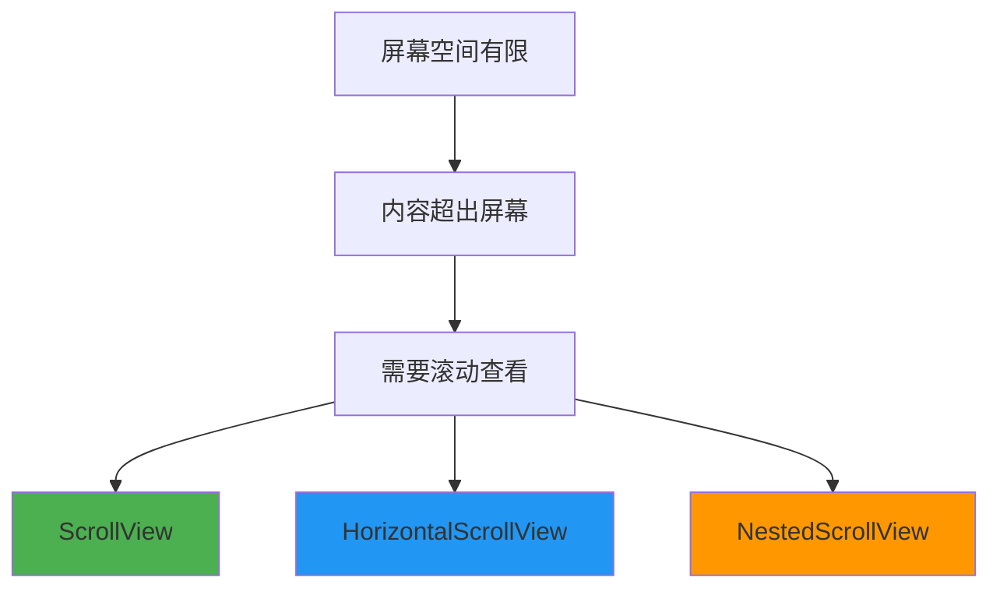

当页面内容：
- 超过一屏显示范围
- 需要用户手动滚动查看
- 包含长文本、长列表或复杂表单

ScrollView 是最直接的解决方案。

## 3. 核心概念

### 3.1 ScrollView vs HorizontalScrollView

| 特性 | ScrollView | HorizontalScrollView |
|------|------------|----------------------|
| 滚动方向 | 垂直滚动 | 水平滚动 |
| 子 View 数量 | 单个子 View | 单个子 View |
| 常用场景 | 长文本、表单 | 水平图片轮播 |
| 性能特点 | 较好 | 较好 |

**术语解释：**
- **ScrollView**：垂直滚动容器。当子 View 的内容高度超过 ScrollView 的高度时，用户可以上下滑动查看完整内容。ScrollView 只能包含**一个直接子 View**（通常是一个 LinearLayout，里面放多个子 View）。
- **HorizontalScrollView**：水平滚动容器。当子 View 的内容宽度超过 HorizontalScrollView 的宽度时，用户可以左右滑动查看。同样只能包含一个直接子 View。
- **为什么只能包含一个子 View？** 因为 ScrollView 的测量逻辑基于单个子 View。如果有多个直接子 View，系统不知道该滚动哪个，会导致布局计算错误。所以通常用 LinearLayout 作为唯一的子 View，把其他内容放在 LinearLayout 里面。
- **单个子 View**：这是一个常见的面试考点。ScrollView 只允许一个直接子 View，但这个子 View 可以是任何 ViewGroup（如 LinearLayout、ConstraintLayout），里面可以包含任意多个子 View。

### 3.2 fillViewport 机制

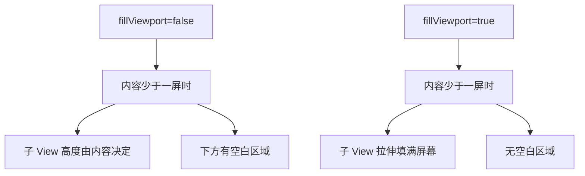

| fillViewport | 效果 | 适用场景 |
|--------------|------|----------|
| `false`（默认） | 内容少时子 View 高度由内容决定 | 内容固定高度 |
| `true` | 内容少时子 View 拉伸填满屏幕 | 登录页、表单页 |

**术语解释：**
- **fillViewport（填充视口）**：控制 ScrollView 在内容不足一屏时的行为。
  - `false`（默认）：子 View 的高度由其内容决定。如果内容只有 200dp，而 ScrollView 有 800dp 高，下方会有 600dp 的空白。
  - `true`：子 View 的高度会被拉伸到至少等于 ScrollView 的高度。如果内容只有 200dp，ScrollView 会把子 View 拉伸到 800dp，下方没有空白。
- **视口（Viewport）**：用户能看到的屏幕区域。ScrollView 的视口就是它的可见区域，内容超出视口的部分需要滚动才能看到。
- **典型场景**：登录页面。内容很少（只有 Logo、输入框、按钮），但你希望它们垂直居中显示。设置 `fillViewport="true"` 后，即使内容不足一屏，也会居中显示而不是挤在顶部。

### 3.3 NestedScrollView

NestedScrollView 是 Support 库提供的增强版 ScrollView，支持嵌套滚动。

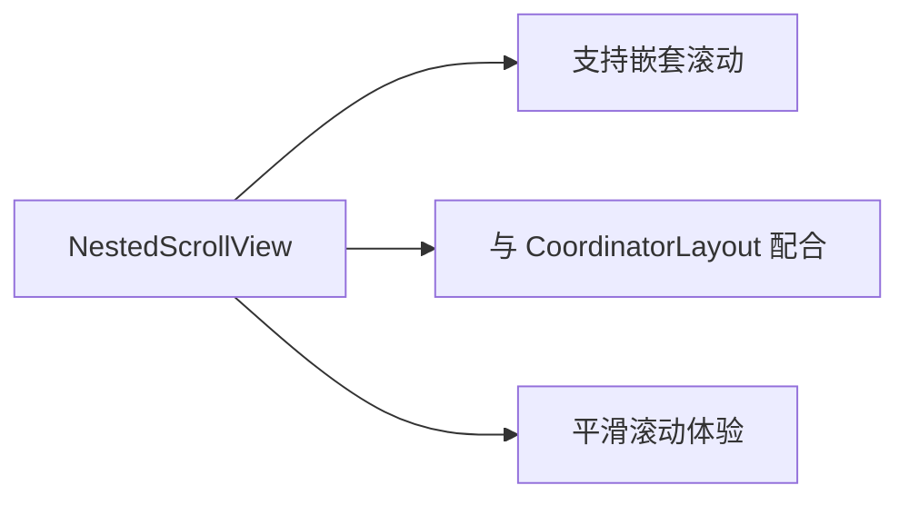

## 4. 基础用法

### 4.1 XML 基础布局

```xml
<!-- 基础垂直滚动布局 -->
<ScrollView
    android:layout_width="match_parent"
    android:layout_height="match_parent"
    android:fillViewport="true">

    <LinearLayout
        android:layout_width="match_parent"
        android:layout_height="wrap_content"
        android:orientation="vertical"
        android:padding="16dp">

        <TextView
            android:layout_width="match_parent"
            android:layout_height="wrap_content"
            android:text="长文本内容..."
            android:textSize="16sp" />

        <!-- 更多内容 -->
    </LinearLayout>
</ScrollView>
```

### 4.2 水平滚动布局

```xml
<!-- 水平滚动图片列表 -->
<HorizontalScrollView
    android:layout_width="match_parent"
    android:layout_height="wrap_content"
    android:scrollbars="none">

    <LinearLayout
        android:layout_width="wrap_content"
        android:layout_height="wrap_content"
        android:orientation="horizontal">

        <ImageView
            android:layout_width="200dp"
            android:layout_height="200dp"
            android:layout_marginEnd="8dp"
            android:scaleType="centerCrop"
            android:src="@drawable/image1" />

        <ImageView
            android:layout_width="200dp"
            android:layout_height="200dp"
            android:layout_marginEnd="8dp"
            android:scaleType="centerCrop"
            android:src="@drawable/image2" />

        <!-- 更多图片 -->
    </LinearLayout>
</HorizontalScrollView>
```

### 4.3 Kotlin 代码控制

```kotlin
// 获取 ScrollView
val scrollView = findViewById<ScrollView>(R.id.scrollView)

// 平滑滚动到顶部
scrollView.smoothScrollTo(0, 0)

// 平滑滚动到底部
scrollView.smoothScrollTo(0, scrollView.getChildAt(0).height)

// 滚动指定距离
scrollView.smoothScrollBy(0, 500)

// 监听滚动事件
scrollView.viewTreeObserver.addOnScrollChangedListener {
    val scrollY = scrollView.scrollY
    val height = scrollView.height
    val childHeight = scrollView.getChildAt(0).height
    
    // 判断是否滚动到底部
    if (scrollY + height >= childHeight) {
        // 已到底部，加载更多内容
        loadMoreContent()
    }
}
```

## 5. 实战场景示例

### 5.1 fillViewport 完整示例

```xml
<!-- 登录页面：内容少时居中，内容多时可滚动 -->
<ScrollView
    android:layout_width="match_parent"
    android:layout_height="match_parent"
    android:fillViewport="true">

    <LinearLayout
        android:layout_width="match_parent"
        android:layout_height="wrap_content"
        android:gravity="center"
        android:orientation="vertical"
        android:padding="24dp">

        <!-- Logo -->
        <ImageView
            android:layout_width="120dp"
            android:layout_height="120dp"
            android:layout_marginBottom="32dp"
            android:src="@drawable/logo" />

        <!-- 用户名输入 -->
        <EditText
            android:id="@+id/etUsername"
            android:layout_width="match_parent"
            android:layout_height="wrap_content"
            android:hint="用户名"
            android:inputType="text" />

        <!-- 密码输入 -->
        <EditText
            android:id="@+id/etPassword"
            android:layout_width="match_parent"
            android:layout_height="wrap_content"
            android:layout_marginTop="16dp"
            android:hint="密码"
            android:inputType="textPassword" />

        <!-- 登录按钮 -->
        <Button
            android:id="@+id/btnLogin"
            android:layout_width="match_parent"
            android:layout_height="wrap_content"
            android:layout_marginTop="24dp"
            android:text="登录" />

    </LinearLayout>
</ScrollView>
```

### 5.2 scrollTo/scrollBy 精确控制

```kotlin
// 获取 ScrollView
val scrollView = findViewById<ScrollView>(R.id.scrollView)

// 立即滚动到指定位置（不带动画）
scrollView.scrollTo(0, 500)

// 相对滚动（不带动画）
scrollView.scrollBy(0, 100)

// 平滑滚动到指定位置
scrollView.smoothScrollTo(0, 500)

// 平滑相对滚动
scrollView.smoothScrollBy(0, 100)

// 带动画的滚动（自定义速度）
object : Runnable {
    override fun run() {
        if (scrollView.scrollY < targetY) {
            scrollView.scrollBy(0, 10)
            scrollView.postDelayed(this, 16)
        }
    }
}.also { scrollView.post(it) }
```

### 5.3 NestedScrollView 与 CoordinatorLayout

```xml
<!-- 使用 NestedScrollView 实现滚动联动 -->
<androidx.coordinatorlayout.widget.CoordinatorLayout
    android:layout_width="match_parent"
    android:layout_height="match_parent">

    <com.google.android.material.appbar.AppBarLayout
        android:layout_width="match_parent"
        android:layout_height="wrap_content">

        <com.google.android.material.appbar.CollapsingToolbarLayout
            android:layout_width="match_parent"
            android:layout_height="256dp"
            app:layout_scrollFlags="scroll|exitUntilCollapsed">

            <ImageView
                android:layout_width="match_parent"
                android:layout_height="match_parent"
                android:scaleType="centerCrop"
                android:src="@drawable/header"
                app:layout_collapseMode="parallax" />

            <androidx.appcompat.widget.Toolbar
                android:layout_width="match_parent"
                android:layout_height="?attr/actionBarSize"
                app:layout_collapseMode="pin" />

        </com.google.android.material.appbar.CollapsingToolbarLayout>
    </com.google.android.material.appbar.AppBarLayout>

    <androidx.core.widget.NestedScrollView
        android:layout_width="match_parent"
        android:layout_height="match_parent"
        app:layout_behavior="@string/appbar_scrolling_view_behavior">

        <LinearLayout
            android:layout_width="match_parent"
            android:layout_height="wrap_content"
            android:orientation="vertical">

            <!-- 内容区域 -->
        </LinearLayout>
    </androidx.core.widget.NestedScrollView>

</androidx.coordinatorlayout.widget.CoordinatorLayout>
```

## 6. 常见错误与避坑

### ❌ 错误示例

```xml
<!-- 错误：ScrollView 包含多个直接子 View -->
<ScrollView
    android:layout_width="match_parent"
    android:layout_height="match_parent">

    <TextView
        android:layout_width="match_parent"
        android:layout_height="wrap_content"
        android:text="第一个子 View" />

    <TextView
        android:layout_width="match_parent"
        android:layout_height="wrap_content"
        android:text="第二个子 View" />
</ScrollView>

<!-- 错误：ScrollView 高度设为 wrap_content -->
<ScrollView
    android:layout_width="match_parent"
    android:layout_height="wrap_content">

    <LinearLayout
        android:layout_width="match_parent"
        android:layout_height="wrap_content">
        <!-- 内容 -->
    </LinearLayout>
</ScrollView>
```

### ✅ 正确示例

```xml
<!-- 正确：使用 LinearLayout 包裹多个子 View -->
<ScrollView
    android:layout_width="match_parent"
    android:layout_height="match_parent">

    <LinearLayout
        android:layout_width="match_parent"
        android:layout_height="wrap_content"
        android:orientation="vertical">

        <TextView
            android:layout_width="match_parent"
            android:layout_height="wrap_content"
            android:text="第一个子 View" />

        <TextView
            android:layout_width="match_parent"
            android:layout_height="wrap_content"
            android:text="第二个子 View" />
    </LinearLayout>
</ScrollView>

<!-- 正确：ScrollView 高度设为 match_parent -->
<ScrollView
    android:layout_width="match_parent"
    android:layout_height="match_parent">

    <LinearLayout
        android:layout_width="match_parent"
        android:layout_height="wrap_content">
        <!-- 内容 -->
    </LinearLayout>
</ScrollView>
```

### 错误速查表

| 错误现象 | 原因 | 解决方案 |
|----------|------|----------|
| 无法滚动 | 高度设为 wrap_content | 改为 match_parent |
| 子 View 重叠 | 多个直接子 View | 用 LinearLayout 包裹 |
| 内容显示不全 | 未设置 fillViewport | 添加 fillViewport=true |
| 滚动不流畅 | 布局层级过深 | 简化布局结构 |
| 与 AppBar 冲突 | 未使用 NestedScrollView | 替换为 NestedScrollView |

## 7. 优势与局限

### ScrollView vs RecyclerView 决策矩阵

| 特性 | ScrollView | RecyclerView |
|------|------------|--------------|
| 适用场景 | 固定内容、表单 | 动态列表、大数据 |
| 内存效率 | 一次性加载全部 | 按需加载（ViewHolder） |
| 性能 | 内容少时好 | 内容多时优秀 |
| 复用机制 | 无 | 有 ViewHolder 复用 |
| 复杂度 | 简单 | 中等 |

### 决策流程图

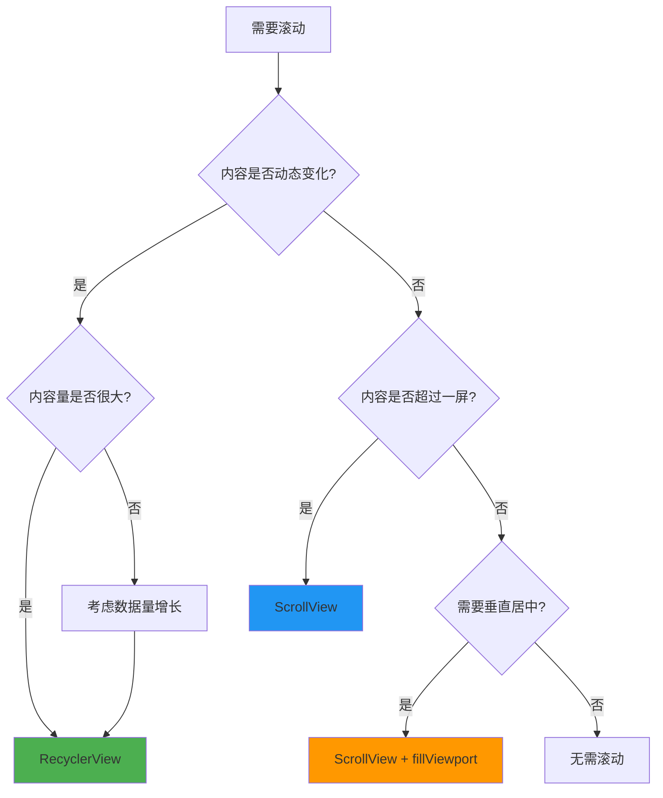

### 优势
- 实现简单：几行代码即可完成
- 适合固定内容：表单、长文本
- 性能可接受：内容量小时表现好

### 局限
- 不支持 ViewHolder 复用
- 大数据量时性能差
- 内存占用高

## 8. 进阶技巧

### 8.1 滚动冲突处理

```kotlin
// 处理 ScrollView 与子 View 的滚动冲突
class CustomScrollView @JvmOverloads constructor(
    context: Context,
    attrs: AttributeSet? = null
) : ScrollView(context, attrs) {

    private var isScrollEnabled = true

    fun setScrollEnabled(enabled: Boolean) {
        isScrollEnabled = enabled
    }

    override fun dispatchTouchEvent(ev: MotionEvent): Boolean {
        when (ev.action) {
            MotionEvent.ACTION_DOWN, MotionEvent.ACTION_UP -> {
                // 不拦截触摸事件，让子 View 处理
                requestDisallowInterceptTouchEvent(false)
            }
        }
        return super.dispatchTouchEvent(ev)
    }

    override fun onInterceptTouchEvent(ev: MotionEvent): Boolean {
        return isScrollEnabled && super.onInterceptTouchEvent(ev)
    }
}
```

### 8.2 监听滚动位置

```kotlin
// 监听 ScrollView 滚动状态
scrollView.viewTreeObserver.addOnScrollChangedListener {
    val scrollY = scrollView.scrollY
    val height = scrollView.height
    val childHeight = scrollView.getChildAt(0).height

    when {
        scrollY == 0 -> {
            // 已到顶部
            onScrollToTop()
        }
        scrollY + height >= childHeight -> {
            // 已到底部
            onScrollToBottom()
        }
        else -> {
            // 中间位置
            onScrolling(scrollY)
        }
    }
}

// 计算滚动百分比
fun getScrollPercentage(scrollView: ScrollView): Float {
    val scrollY = scrollView.scrollY
    val maxScroll = scrollView.getChildAt(0).height - scrollView.height
    return if (maxScroll > 0) {
        (scrollY.toFloat() / maxScroll) * 100
    } else {
        0f
    }
}
```

### 8.3 平滑滚动动画

```kotlin
// 自定义平滑滚动动画
fun smoothScrollToPosition(scrollView: ScrollView, targetY: Int, duration: Long = 500) {
    val startY = scrollView.scrollY
    val distance = targetY - startY
    val startTime = System.currentTimeMillis()

    val animation = object : Runnable {
        override fun run() {
            val elapsed = System.currentTimeMillis() - startTime
            val progress = (elapsed.toFloat() / duration).coerceIn(0f, 1f)
            
            // 使用插值器实现平滑效果
            val interpolated = EaseInOutInterpolator().getInterpolation(progress)
            val currentY = (startY + distance * interpolated).toInt()
            
            scrollView.scrollTo(0, currentY)

            if (progress < 1f) {
                scrollView.postDelayed(this, 16)
            }
        }
    }
    scrollView.post(animation)
}

// 简单的缓入缓出插值器
class EaseInOutInterpolator : Interpolator {
    override fun getInterpolation(input: Float): Float {
        return (input * input * (3 - 2 * input))
    }
}
```

## 9. 面试高频考点

### Q1: ScrollView 和 NestedScrollView 的区别？

**答**: 
- ScrollView 是基础滚动容器
- NestedScrollView 支持嵌套滚动，可与 CoordinatorLayout 配合实现滚动联动效果

### Q2: fillViewport 属性的作用？

**答**: 当内容少于一屏时，`fillViewport="true"` 会让子 View 拉伸填满整个 ScrollView，避免下方出现空白。

### Q3: ScrollView 为什么只能包含一个子 View？

**答**: ScrollView 的测量逻辑基于单个子 View，多个直接子 View 会导致布局计算错误。

### Q4: 如何判断 ScrollView 是否滚动到底部？

**答**: 通过比较 `scrollY + height` 与 `childHeight`，当两者相等时即为底部。

### Q5: ScrollView 和 RecyclerView 如何选择？

**答**: 固定内容、表单场景用 ScrollView；动态列表、大数据量场景用 RecyclerView。

## 10. 小结与下一步

### 快速参考卡

```
┌─────────────────────────────────────┐
│       ScrollView 快速参考           │
├─────────────────────────────────────┤
│  垂直滚动：ScrollView               │
│  水平滚动：HorizontalScrollView     │
│  嵌套滚动：NestedScrollView         │
│  填满屏幕：fillViewport=true        │
│  滚动到底：scrollY + height >= h    │
│  精确控制：scrollTo / scrollBy      │
│  决策：固定内容→ScrollView          │
│       动态列表→RecyclerView         │
└─────────────────────────────────────┘
```

### 下一步学习

- 📖 [RecyclerView 完全指南](./07-RecyclerView.md) - 了解高性能列表
- 📖 [CoordinatorLayout](./08-CoordinatorLayout.md) - 学习高级滚动联动

---

## 📝 课后练习

1. **基础练习**: 创建一个 ScrollView 包含 10 个 TextView
2. **进阶练习**: 实现一个登录页面，使用 fillViewport 保证居中显示
3. **挑战练习**: 实现 ScrollView 与 RecyclerView 的嵌套滚动

## ✅ 自测题

1. ScrollView 的 fillViewport 默认值是？
   - A) true
   - B) false
   - C) match_parent
   - D) wrap_content

2. 如何让 ScrollView 滚动到顶部？
   - A) `scrollView.scrollTo(0, 0)`
   - B) `scrollView.scrollBy(0, 0)`
   - C) `scrollView.smoothScrollTo(0, 0)`
   - D) A 和 C 都可以

3. 嵌套滚动应该使用哪个布局？
   - A) ScrollView
   - B) HorizontalScrollView
   - C) NestedScrollView
   - D) LinearLayout

**答案**: 1-B, 2-D, 3-C

## 🎬 渲染逻辑详解

### ScrollView 的渲染机制

ScrollView 的渲染与普通布局不同，它引入了**滚动偏移**的概念：

```mermaid
graph TD
    A[ScrollView.onMeasure] --> B[测量子View的实际高度]
    B --> C{子View高度 > ScrollView高度?}
    C -->|是| D[可以滚动]
    C -->|否| E[不可滚动]
    D --> F[ScrollView.onLayout]
    E --> F
    F --> G[子View从 (0,0) 开始布局]
    G --> H[ScrollView.dispatchDraw]
    H --> I[应用 scrollY 偏移绘制]
    
    style A fill:#00BCD4,color:#fff
    style B fill:#FF9800,color:#fff
    style D fill:#4CAF50,color:#fff
    style I fill:#2196F3,color:#fff
```

**滚动偏移的实现原理：**

```plaintext
ScrollView 内部维护一个 scrollY 值：
  scrollY = 0      → 显示子View的顶部
  scrollY = 500    → 显示子View从500px开始的内容
  scrollY = max    → 显示子View的底部

绘制时：
  canvas.translate(0, -scrollY)  ← 整个Canvas向上偏移
  子View.draw(canvas)            ← 子View在偏移后的Canvas上绘制
```

### fillViewport 的渲染行为

```plaintext
fillViewport = false（默认）:
  子View高度 = wrap_content 的实际内容高度
  如果内容 < 屏幕高度，下方有空白

fillViewport = true:
  子View高度 = max(内容高度, ScrollView高度)
  如果内容 < 屏幕高度，子View被拉伸填满
  如果内容 > 屏幕高度，正常滚动
```

### 滚动检测的渲染原理

```plaintext
判断是否滚动到底部：
  scrollY + ScrollView.height >= 子View.height

  scrollY：当前滚动偏移
  ScrollView.height：可见区域高度
  子View.height：完整内容高度
  
  当 scrollY + 可见区域 = 完整内容 → 已到底部
```

### NestedScrollView 的嵌套滚动

```plaintext
嵌套滚动的核心机制：
  1. 子View请求嵌套滚动
  2. 父View消费部分滚动距离
  3. 子View消费剩余滚动距离
  
  CoordinatorLayout + AppBarLayout 的滚动联动：
    NestedScrollView 滚动 → AppBarLayout 折叠
    AppBarLayout 折叠 → NestedScrollView 继续滚动
```

---

## 🔗 知识依赖图

### 与前后章节的关系

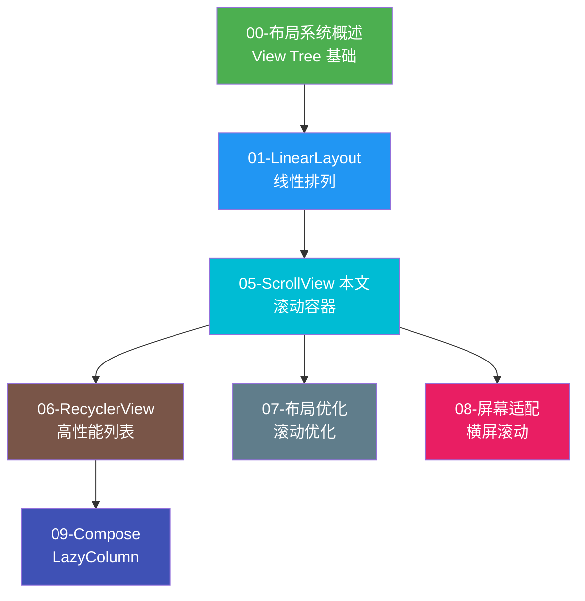

### 核心知识点的章节串联

| 知识点 | 本章内容 | 关联章节 | 关联说明 |
|--------|---------|---------|---------|
| **滚动偏移** | scrollY 控制绘制位置 | 00-概述 | 00 章介绍 draw 阶段 |
| **fillViewport** | 内容少时填满屏幕 | 01-LinearLayout | ScrollView 内部通常用 LinearLayout |
| **嵌套滚动** | NestedScrollView 联动 | 06-RecyclerView | RecyclerView 也支持嵌套滚动 |
| **滚动冲突** | 多个滚动容器的处理 | 06-RecyclerView | RecyclerView 与 ScrollView 嵌套 |
| **性能问题** | 一次性加载所有子View | 07-优化 | 07 章建议用 RecyclerView 替代 |
| **水平滚动** | HorizontalScrollView | 09-Compose | Compose 中用 LazyRow 替代 |

### 组件关系图

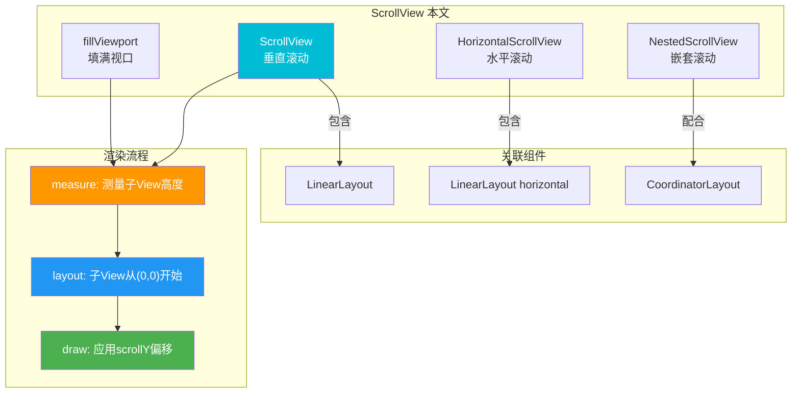

---

## 💼 实战项目

**项目**: 构建一个可滚动的设置页面
- 使用 ScrollView 包裹所有设置项
- 实现 fillViewport 保证底部按钮固定
- 添加滚动监听，实现返回顶部按钮
- 处理与内部 RecyclerView 的滚动冲突

## 🔍 代码审查清单

- [ ] ScrollView 是否只包含一个直接子 View
- [ ] 高度是否设置为 match_parent
- [ ] 是否根据场景选择了正确的布局
- [ ] 滚动监听是否正确实现
- [ ] 嵌套滚动是否使用 NestedScrollView
- [ ] 滚动冲突是否妥善处理

## 📖 术语表

| 术语 | 英文 | 说明 |
|------|------|------|
| 滚动视图 | ScrollView | 可滚动的容器 |
| 水平滚动 | HorizontalScrollView | 水平方向滚动 |
| 嵌套滚动 | NestedScrollView | 支持嵌套的滚动容器 |
| 填满视口 | fillViewport | 内容少时填满屏幕 |
| 滚动到 | scrollTo | 立即滚动到指定位置 |
| 平滑滚动 | smoothScrollTo | 带动画的滚动 |
| 滚动冲突 | Scroll Conflict | 多个滚动容器的冲突 |
| 视图复用 | ViewHolder | RecyclerView 的复用机制 |
| 联动效果 | CoordinatorLayout | 滚动联动布局 |
| 缓入缓出 | Ease In Out | 平滑的动画曲线 |

---

## 📚 扩展阅读

- [Android 官方文档 - ScrollView](https://developer.android.com/reference/android/widget/ScrollView)
- [NestedScrollView 指南](https://developer.android.com/reference/androidx/core/widget/NestedScrollView)
- [RecyclerView 完全指南](https://developer.android.com/guide/topics/ui/layout/recyclerview)
- [滚动性能优化](https://developer.android.com/topic/performance/vitals/render)

---

## 🔬 滚动机制底层深度解析

本节从 Android 框架最底层的源码层面，逐层拆解 ScrollView 滚动背后的核心机制。每一个概念都配有术语解释（类比方式）和 Mermaid 图解。

### 1.1 scrollTo / scrollBy 的本质：mScrollX 与 mScrollY

**核心原理：scrollTo 和 scrollBy 并不会移动 View 本身的位置，而是修改 View 内部的 `mScrollX` / `mScrollY` 两个字段，在 `dispatchDraw()` 阶段通过 `canvas.translate()` 偏移整个绘制坐标系。**

```kotlin
// View.java 源码核心逻辑（简化版）
public void scrollTo(int x, int y) {
    if (mScrollX != x || mScrollY != y) {
        int oldX = mScrollX;
        int oldY = mScrollY;
        mScrollX = x;   // 只修改字段值
        mScrollY = y;   // 不移动 View 本身
        onScrollChanged(mScrollX, mScrollY, oldX, oldY);
        invalidate();    // 触发重绘
    }
}

// dispatchDraw 中的关键偏移
@Override
protected void dispatchDraw(Canvas canvas) {
    // 关键：通过 translate 偏移 Canvas 的绘制原点
    canvas.translate(-mScrollX, -mScrollY);
    // 子 View 在偏移后的坐标系中绘制
    // 效果：内容"看起来"在移动，实际是观察窗口在移动
    super.dispatchDraw(canvas);
}
```

**术语解释（类比）：**
- **mScrollX / mScrollY**：View 内部的两个 int 字段，记录当前内容的"观察偏移量"。
  - **类比**：想象你用望远镜看远处的风景。风景（子 View）本身没有移动，你只是转动了望远镜的镜头方向（修改 mScrollY），看到的就是风景的不同部分。`scrollTo(0, 500)` 就相当于把望远镜镜头向下转了 500 像素，于是你看到了风景中 500 像素以下的内容。
- **canvas.translate(-mScrollX, -mScrollY)**：在绘制时，把整个画布的原点反向偏移。
  - **类比**：就像你在一张很长的画卷上画画，画卷不动，但你的画笔起始位置往下移了。负号是因为 mScrollY 为正表示内容向上滚（看到更下面的内容），所以画布要向上偏移（translate 负值）才能实现这个效果。
- **dispatchDraw()**：ViewGroup 绘制子 View 的方法。ScrollView 在这里插入 Canvas 偏移逻辑。
  - **类比**：这是"导演喊开始"的时刻——所有子 View 都在这个阶段被画到屏幕上，ScrollView 在画之前先把画布挪了一下。

**mScrollY 变化与 Canvas 偏移的关系图：**

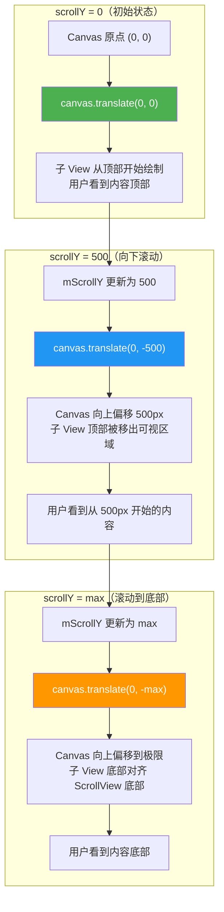

**scrollTo vs scrollBy 的区别：**

```kotlin
// scrollTo：滚动到绝对位置（覆盖原值）
scrollView.scrollTo(0, 500)   // mScrollY = 500（无论之前是多少）
scrollView.scrollTo(0, 500)   // mScrollY 仍然是 500（无变化）

// scrollBy：滚动相对距离（累加到原值）
scrollView.scrollBy(0, 100)   // 假设原来 mScrollY=0，现在 mScrollY=100
scrollView.scrollBy(0, 100)   // mScrollY=200（每次累加）

// scrollBy 的源码本质
public void scrollBy(int x, int y) {
    scrollTo(mScrollX + x, mScrollY + y);  // 在原值基础上累加
}
```

### 1.2 Scroller 与 OverScroller 的弹性滚动

**核心原理：`Scroller` 和 `OverScroller` 是滚动动画的计算器。它们本身不操作 View，而是在每一帧 VSYNC 信号到来时通过 `computeScrollOffset()` 计算出当前应该处于的滚动位置，然后由 View 调用 `scrollTo()` 应用这个位置，并通过 `invalidate()` 触发下一帧重绘，从而形成平滑的滚动动画循环。**

```kotlin
// ScrollView 中平滑滚动的核心逻辑（简化版）
class ScrollView {
    private val mScroller = OverScroller(context)

    override fun computeScroll() {
        if (mScroller.computeScrollOffset()) {
            // Scroller 计算出了这一帧的滚动位置
            val currY = mScroller.currY
            scrollTo(0, currY)        // 应用位置
            invalidate()               // 请求下一帧重绘 → 重新触发 computeScroll
        }
    }

    fun smoothScrollTo(destX: Int, destY: Int) {
        mScroller.startScroll(mScrollX, mScrollY, destX - mScrollX, destY - mScrollY, 500)
        invalidate()  // 启动动画循环
    }
}
```

**术语解释（类比）：**
- **Scroller**：一个纯数学计算器，根据时间、起点、终点和插值算法，算出"当前这一帧应该滚动到哪里"。
  - **类比**：Scroller 就像一个导航员，你告诉它"从这里开到那里，用 500 毫秒"，它就会每 16 毫秒（一帧）告诉你"现在应该到了 xxx 位置"。它自己不开车（不操作 View），只负责报位置。
- **OverScroller**：Scroller 的增强版，支持超过边界的"过度滚动"效果（内容被拉过边界再弹回来）。
  - **类比**：OverScroller 是一个更聪明的导航员，它知道路的边界在哪里，允许你"稍微开出路面一点"然后再把你拉回来——就像橡皮筋拉过头会弹回来。
- **computeScrollOffset()**：每一帧调用，计算当前时间的滚动位置，返回 true 表示动画还在进行中。
  - **类比**：每次你问导航员"到了吗？"，它会计算一下并回答"还没到，现在应该在 xxx 位置"，或者"到了"（返回 false）。
- **VSYNC（垂直同步信号）**：Android 系统每约 16.6ms 发出一次的屏幕刷新信号，驱动整个 UI 渲染流水线。
  - **类比**：VSYNC 就像一个节拍器，每 16 毫秒"滴答"一次，所有人（CPU、GPU、渲染线程）都跟着这个节拍工作，保证画面流畅不撕裂。
- **invalidate()**：标记 View 为"脏"（需要重绘），系统会在下一个 VSYNC 信号到来时重新绘制该 View。
  - **类比**：你在黑板上画动画，每一帧画完后你举手说"这一帧画好了，请给我下一张纸"（invalidate），老师（系统）在下次打铃（VSYNC）时给你新纸，你继续画下一帧。

**VSYNC → computeScrollOffset → invalidate → draw 的循环时序图：**

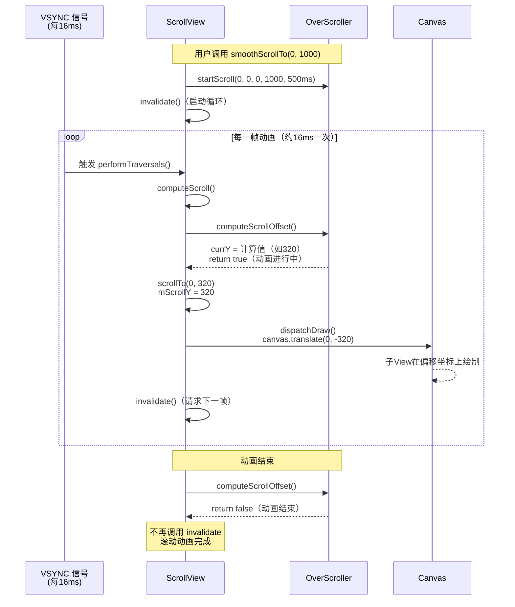

**Scroller vs OverScroller 对比：**

| 特性 | Scroller | OverScroller |
|------|----------|--------------|
| 基础平滑滚动 | 支持 | 支持 |
| 过度滚动（OverScroll） | 不支持 | 支持 |
| 弹性回弹 | 不支持 | 支持 |
| 边缘发光效果 | 不支持 | 支持 |
| 推荐使用 | 旧代码兼容 | 新代码首选 |

### 1.3 触摸事件分发与滚动拦截：onInterceptTouchEvent 与 touchSlop

**核心原理：当用户手指按下时，ScrollView 并不立即拦截事件。而是在 `onInterceptTouchEvent()` 中持续检测 ACTION_MOVE 事件中手指移动的距离，当移动距离超过系统定义的 `touchSlop` 阈值时，判定为"滑动手势"，拦截子 View 的事件，自己接管滚动处理。**

```kotlin
// ScrollView.onInterceptTouchEvent 核心逻辑（简化版）
@Override
public boolean onInterceptTouchEvent(MotionEvent ev) {
    switch (ev.action) {
        case MotionEvent.ACTION_DOWN:
            // 记录按下位置，不拦截
            mLastMotionY = ev.y
            break

        case MotionEvent.ACTION_MOVE:
            // 计算手指移动距离
            val deltaY = mLastMotionY - ev.y
            // 关键：只有移动距离超过 touchSlop 才拦截
            if (deltaY > touchSlop) {
                mIsBeingDragged = true  // 标记为拖拽状态
                return true             // 拦截事件，自己处理滚动
            }
            break

        case MotionEvent.ACTION_UP:
            mIsBeingDragged = false
            break
    }
    return false  // 默认不拦截，让子 View 处理
}
```

**术语解释（类比）：**
- **onInterceptTouchEvent()**：ViewGroup 的方法，决定是否拦截传递给子 View 的触摸事件。
  - **类比**：这就像一个门卫。事件就像快递，本来要送给子 View（住户）。门卫会先看一眼：如果只是轻轻碰了一下（没超过 touchSlop），就放行让住户处理；如果住户开始拖动快递了（超过 touchSlop），门卫就说"这个我来处理"，把快递截留自己用——也就是开始滚动。
- **touchSlop**：系统定义的最小滑动距离阈值（通常 8dp，约 16-48px，因设备密度而异）。手指移动小于这个值不认为是滑动。
  - **类比**：touchSlop 就像一个"灵敏度阈值"。想象你在调音台上推滑块，轻轻碰一下不会触发（避免误操作），只有明确推了一段距离才算"你要调音了"。这能有效区分"点击"和"滑动"——防止用户只是想点一个按钮，结果页面却滚走了。
- **ACTION_DOWN / ACTION_MOVE / ACTION_UP**：触摸事件的三个基本阶段。按下、移动、抬起。
  - **类比**：就像用手指在纸上画画——按下笔（DOWN）、拖动画线（MOVE）、抬笔（UP）。ScrollView 只在 MOVE 阶段判断是否要拦截。
- **mIsBeingDragged**：ScrollView 内部布尔标志，标记当前是否处于用户拖拽滚动状态。
  - **类比**：一旦门卫决定了"这是滑动操作"，就会举一面小旗子（mIsBeingDragged=true），后续所有 MOVE 事件都不再检查 touchSlop，直接滚动，直到 UP 事件才降旗。

**触摸事件拦截完整流程图：**

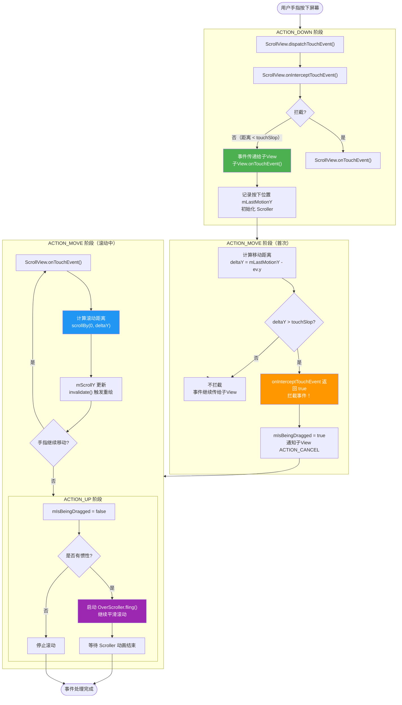

### 1.4 NestedScrollingChild 与 NestedScrollingParent 机制

**核心原理：嵌套滚动是一套标准化的接口协议。NestedScrollView 实现 `NestedScrollingChild` 接口，在滚动前/滚动中/滚动后通过回调通知父容器（实现 `NestedScrollingParent` 接口，如 CoordinatorLayout）。父容器可以在子 View 滚动前"预先消费"一部分滚动距离（如 AppBarLayout 先折叠），剩余的再交给子 View 滚动。**

```kotlin
// 嵌套滚动核心接口（简化版）
interface NestedScrollingChild {
    fun startNestedScroll(axes: Int): Boolean    // 开始嵌套滚动
    fun dispatchNestedPreScroll(dx: Int, dy: Int, consumed: IntArray, ...): Boolean  // 滚动前通知
    fun dispatchNestedScroll(dxConsumed: Int, dyConsumed: Int, ...): Boolean          // 滚动后通知
    fun stopNestedScroll()                       // 结束嵌套滚动
}

interface NestedScrollingParent {
    fun onStartNestedScroll(child: View, target: View, axes: Int): Boolean  // 是否接受嵌套
    fun onNestedPreScroll(target: View, dx: Int, dy: Int, consumed: IntArray)  // 预消费滚动
    fun onNestedScroll(target: View, dxConsumed: Int, dyConsumed: Int, ...)     // 处理剩余滚动
    fun onStopNestedScroll(target: View)  // 结束
}
```

**术语解释（类比）：**
- **NestedScrollingChild**：发起嵌套滚动的子 View 接口。NestedScrollView 实现了这个接口。
  - **类比**：想象你在公司报销费用。你是 NestedScrollingChild（报销人），你要花钱（滚动）之前，先问经理（父容器）"这笔钱你能不能出一部分？"。经理说"我出 200"（预消费），剩下你自己掏。
- **NestedScrollingParent**：接收并处理嵌套滚动的父容器接口。CoordinatorLayout 实现了这个接口。
  - **类比**：经理（NestedScrollingParent）先看你的报销单（onNestedPreScroll），决定自己先承担多少（consumed[1] = 200），然后告诉你"剩下的你自己处理"（onNestedScroll）。
- **dispatchNestedPreScroll()**：子 View 滚动前，先问父容器要不要消费一部分滚动距离。
  - **类比**：相当于报销人在花钱前先问经理"你先垫一部分？"。父容器通过 `consumed` 数组返回它消费了多少。
- **dispatchNestedScroll()**：子 View 滚动后，告诉父容器自己消费了多少，还剩多少未消费。
  - **类比**：报销人付完自己的部分后，告诉经理"我花了这么多，还剩这么多没花"，经理可以决定是否处理剩余部分。
- **consumed 数组**：一个 `int[2]` 数组，`consumed[0]` 是父容器消费的 x 距离，`consumed[1]` 是消费的 y 距离。
  - **类比**：就像一个收据，经理在上面写"我出了 200 元"（consumed[1]=200），报销人就知道自己只需出剩余的部分。

**NestedScrollView 嵌套滚动调用链时序图：**

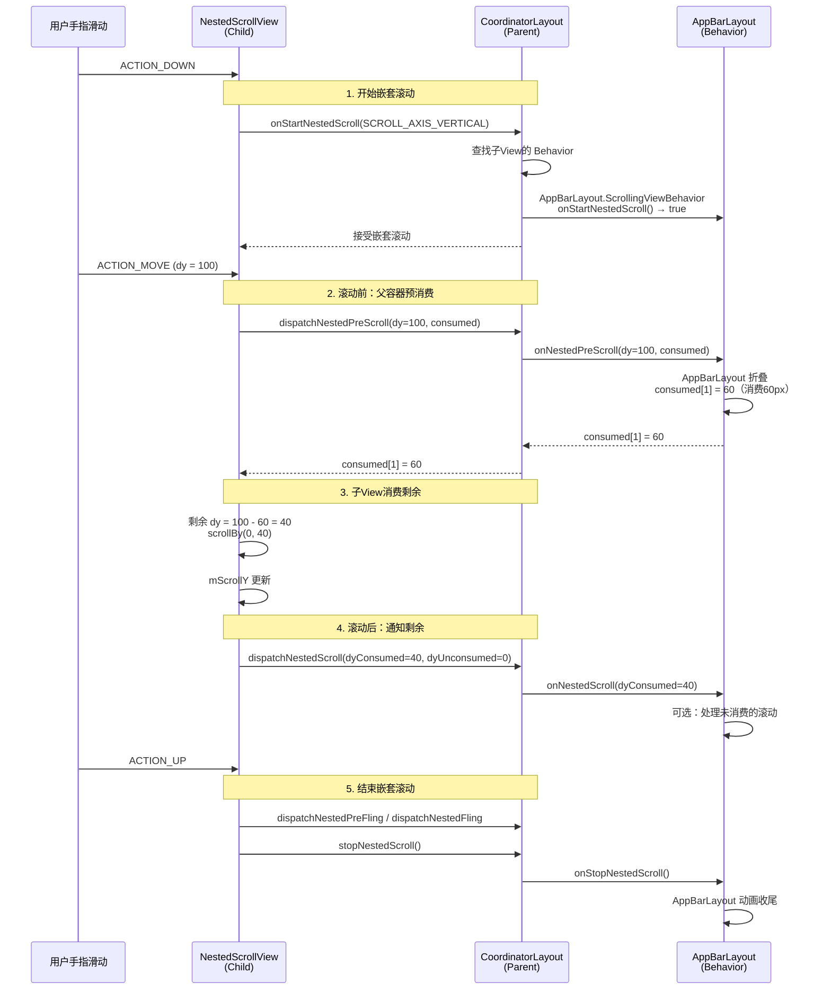

### 1.5 fillViewport 的测量逻辑

**核心原理：当 `fillViewport=true` 时，ScrollView 在 `onMeasure()` 中检测到子 View 的测量高度小于自身高度时，会通过 `MeasureSpec` 将子 View 的最小高度约束修改为 ScrollView 自身的高度，强制子 View 拉伸填满整个视口。**

```kotlin
// ScrollView.onMeasure 核心逻辑（简化版）
@Override
protected void onMeasure(int widthMeasureSpec, int heightMeasureSpec) {
    super.onMeasure(widthMeasureSpec, heightMeasureSpec)

    if (mFillViewport && getChildCount() > 0) {
        val child = getChildAt(0)
        val childHeight = child.measuredHeight
        val selfHeight = measuredHeight  // ScrollView 自身高度

        // 关键判断：如果子View高度 < ScrollView高度
        if (childHeight < selfHeight) {
            // 重新测量子View，强制最小高度 = ScrollView高度
            val childWidthSpec = getChildMeasureSpec(
                widthMeasureSpec, 0, child.layoutParams.width
            )
            val childHeightSpec = MeasureSpec.makeMeasureSpec(
                selfHeight, MeasureSpec.EXACTLY  // 强制精确高度
            )
            child.measure(childWidthSpec, childHeightSpec)
        }
    }
}
```

**术语解释（类比）：**
- **onMeasure()**：View 测量自身和子 View 大小的方法。是布局三大流程（measure → layout → draw）的第一步。
  - **类比**：就像裁缝量体裁衣。onMeasure 就是"拿尺子量"的步骤——先量自己（ScrollView）有多大，再量子 View 需要多大，如果 fillViewport=true 且子 View 太小，就把子 View 的尺码"强行改大"。
- **MeasureSpec**：Android 测量系统中的核心类，包含测量模式和测量值。
  - **类比**：MeasureSpec 就像裁缝的"量衣指令"——它告诉子 View"你的尺寸应该怎么定"。有三种模式：EXACTLY（精确指定，你必须这么大）、AT_MOST（最大不超过，你自己看着办但别超过）、UNSPECIFIED（随便你多大）。
- **EXACTLY 模式**：父容器精确指定子 View 的大小，子 View 必须遵守。
  - **类比**：fillViewport=true 时，ScrollView 对子 View 说"你的高度必须和我一样大，没得商量"。这就是 EXACTLY 模式——精确命令。

**fillViewport 前后的测量结果差异图：**

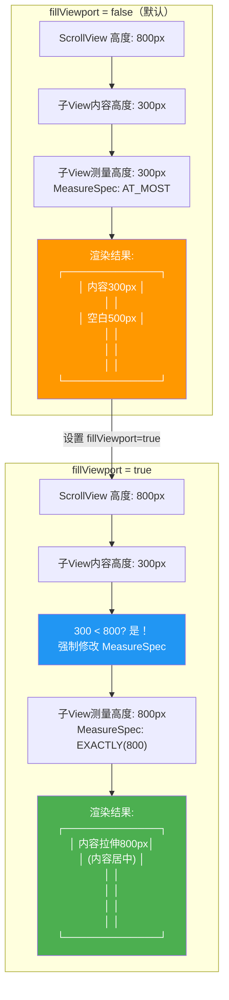

**fillViewport 在不同情况下的行为：**

| 条件 | 子 View 内容高度 | 子 View 最终高度 | 效果 |
|------|------------------|-------------------|------|
| fillViewport=false | 300px | 300px | 下方有空白 |
| fillViewport=true | 300px（<800px） | 800px（拉伸） | 填满无空白 |
| fillViewport=true | 1200px（>800px） | 1200px（不变） | 正常滚动 |
| fillViewport=false | 1200px | 1200px | 正常滚动 |

### 1.6 overScroll 效果的边缘发光

**核心原理：当用户滚动超过内容的边界时（如已经到顶部还继续往下拉），ScrollView 通过 `EdgeEffect` 类在内容边缘绘制一个半透明的发光拉伸效果（类似 iOS 的橡皮筋效果）。这个效果由 `OverScroller` 的 `fling()` 方法配合 `onOverScrolled()` 回调驱动。**

```kotlin
// ScrollView 中 OverScroll 相关的核心逻辑（简化版）
class ScrollView {
    private val mEdgeGlowTop: EdgeEffect     // 顶部边缘发光效果
    private val mEdgeGlowBottom: EdgeEffect   // 底部边缘发光效果

    override fun onOverScrolled(scrollX: Int, scrollY: Int, clampedX: Boolean, clampedY: Boolean) {
        // OverScroller 计算出超出边界的位置
        if (clampedY && scrollY < 0) {
            // 滚动到顶部以上，触发顶部边缘发光
            mEdgeGlowTop.onPull(deltaDistance)  // 开始拉伸发光
        }
        if (clampedY && scrollY > maxScrollY) {
            // 滚动到底部以下，触发底部边缘发光
            mEdgeGlowBottom.onPull(deltaDistance)
        }
        scrollTo(scrollX, scrollY)  // 应用最终位置
    }

    override fun draw(canvas: Canvas) {
        super.draw(canvas)
        // 在最上层绘制边缘发光效果
        if (mEdgeGlowTop != null) {
            canvas.save()
            canvas.rotate(180f, width / 2f, 0f)
            mEdgeGlowTop.draw(canvas)  // 绘制顶部发光
            canvas.restore()
        }
        if (mEdgeGlowBottom != null) {
            canvas.save()
            mEdgeGlowBottom.draw(canvas)  // 绘制底部发光
            canvas.restore()
        }
    }
}
```

**术语解释（类比）：**
- **EdgeEffect**：Android 提供的边缘发光效果绘制类，负责在滚动超出边界时绘制半透明的弧形发光动画。
  - **类比**：EdgeEffect 就像一根橡皮筋两端的"发光指示灯"。当你把内容拉过头时，边缘的灯就亮起来，告诉你"已经到头了"，松手后灯会渐渐熄灭，内容也会弹回原位。
- **onOverScrolled()**：当 OverScroller 计算出的位置超出合法边界时调用的回调，参数 clamped 表示是否被夹紧到边界。
  - **类比**：这就像导航员告诉你"你已经开出路面了，我帮你把车拉回路边"（clamped=true），同时触发路边护栏的警示灯（EdgeEffect）。
- **OverScrollGlow**：管理多个方向 EdgeEffect 的容器类，统一处理上/下/左/右四个方向的边缘发光。
  - **类比**：OverScrollGlow 是一个"发光总控室"，管理四个方向的 EdgeEffect 灯，哪个方向被拉过头就亮哪个灯。
- **onPull() / onRelease()**：EdgeEffect 的方法。onPull 开始拉伸发光，onRelease 释放后启动回弹动画。
  - **类比**：onPull 就像你拉弹簧时弹簧开始发光变形，onRelease 就像你松手后弹簧弹回原状同时光渐渐消失。

---

## 📐 设计理念与架构图

本节从软件架构和设计模式的视角，深入探讨 ScrollView 体系的设计哲学、继承层次、组件协作方式，以及与现代声明式 UI 框架（Jetpack Compose）的对比。

### 2.1 ScrollView 的"单子 View"设计约束

**设计选择：ScrollView 强制只能包含一个直接子 View。这并非技术限制，而是一个深思熟虑的架构决策。**

**为什么限制只能一个子 View？**

1. **测量逻辑的简化**：ScrollView 的滚动数学模型基于"单个内容块"——它只需要计算一个子 View 的高度，减去自身高度，得到可滚动范围。如果允许多个子 View，每个子 View 的高度可能独立变化，滚动边界计算会变得极其复杂。
2. **布局语义的清晰性**：ScrollView 的语义是"一个可滚动的内容区域"。多个直接子 View 意味着多个内容区域，但 ScrollView 无法定义它们之间的排列规则（水平还是垂直？间距多少？），这会与 LinearLayout 等布局的职责重叠。
3. **职责分离原则**：ScrollView 只负责"滚动"，排列子 View 是其他 ViewGroup（如 LinearLayout、ConstraintLayout）的职责。让 ScrollView 只管一件事，符合 Unix 哲学："一个工具只做好一件事"。

**优点：**
- 实现简单，滚动逻辑清晰
- 强制开发者使用中间容器，布局结构更规范
- 测量和布局性能可预测

**缺点：**
- 增加了一层布局嵌套（ScrollView → LinearLayout → 内容）
- 对初学者不友好，容易直接放多个子 View 导致错误
- 不支持多个独立可滚动区域

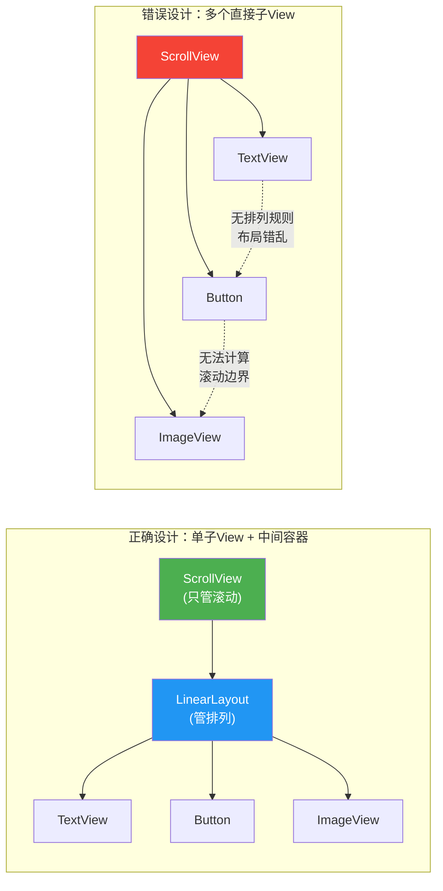

### 2.2 继承链：View → FrameLayout → ScrollView → NestedScrollView

ScrollView 的继承层次体现了 Android UI 框架的分层设计——每一层在上一层的基础上增加特定能力。

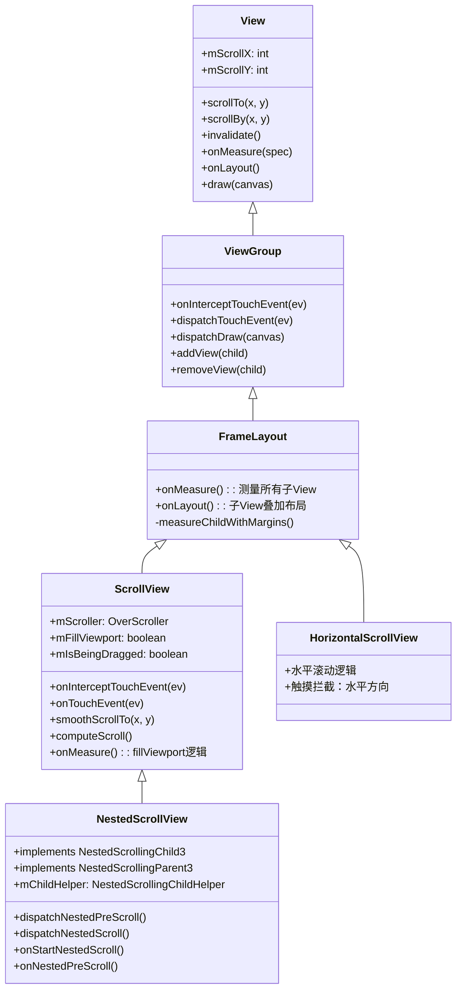

**各层职责说明：**

| 层级 | 类名 | 核心职责 | 新增能力 |
|------|------|----------|----------|
| 1 | View | 基础绘制和事件处理 | mScrollX/Y、scrollTo/scrollBy、draw |
| 2 | ViewGroup | 子 View 管理 | onInterceptTouchEvent、dispatchDraw、addView |
| 3 | FrameLayout | 叠加式布局 | 多个子 View 的测量和叠加布局 |
| 4 | ScrollView | 垂直滚动容器 | Scroller、fillViewport、触摸拦截、OverScroll |
| 5 | NestedScrollView | 嵌套滚动容器 | NestedScrollingChild/Parent 接口实现 |

**为什么继承自 FrameLayout 而不是 LinearLayout？**
- FrameLayout 的叠加布局最简单——所有子 View 从左上角 (0,0) 开始排列，ScrollView 只需处理一个子 View 的位置和大小，不需要处理排列逻辑。
- 如果继承 LinearLayout，ScrollView 会被绑定到"线性排列"语义，但 ScrollView 的职责只是"滚动"，排列方式应由中间容器决定。
- FrameLayout 是开销最小的 ViewGroup，适合作为"只需一个子 View"的容器的父类。

### 2.3 滚动体系架构：嵌套滚动层次

在 Material Design 的典型架构中，滚动不是 ScrollView 独立完成的，而是多个组件通过嵌套滚动协议协同工作。

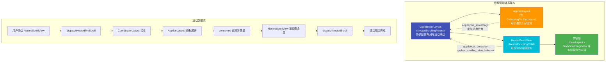

**架构层次说明：**

| 层级 | 组件 | 角色 | 接口实现 |
|------|------|------|----------|
| 协调层 | CoordinatorLayout | NestedScrollingParent | 管理子 View 之间的滚动联动关系 |
| 头部层 | AppBarLayout | 被联动的子 View | 通过 Behavior 响应滚动事件 |
| 内容层 | NestedScrollView | NestedScrollingChild | 发起滚动，通知父容器 |
| 展示层 | LinearLayout + 子 View | 纯展示 | 不参与滚动协议 |

### 2.4 NestedScrollView 替代 ScrollView 的设计动机

**为什么 Google 推出 NestedScrollView 来替代 ScrollView？**

```mermaid
graph LR
    subgraph "ScrollView 时代（问题）"
        direction TB
        P1["ScrollView 滚动"] --> P2["无法通知父容器"]
        P2 --> P3["父容器无法联动<br/>（如 AppBar 折叠）"]
        P3 --> P4["需要 hack：<br/>setOnScrollChangeListener"]
        P4 --> P5["代码侵入式<br/>不通用"]
    end

    subgraph "NestedScrollView 时代（方案）"
        direction TB
        S1["NestedScrollView 滚动"] --> S2["通过标准接口通知父容器"]
        S2 --> S3["父容器可预消费滚动距离"]
        S3 --> S4["标准化的联动效果<br/>（AppBarLayout 自动折叠）"]
        S4 --> S5["非侵入式<br/>可复用"]
    end

    P5 -->|"标准化"| S1

    style P3 fill:#F44336,color:#fff
    style P5 fill:#F44336,color:#fff
    style S4 fill:#4CAF50,color:#fff
    style S5 fill:#4CAF50,color:#fff
```

**设计动机详解：**

1. **标准化的嵌套滚动协议**：NestedScrollingChild / NestedScrollingParent 接口提供了一套通用的、标准化的滚动协作协议。任何实现了接口的父容器都可以与 NestedScrollView 联动，不再需要为每种联动效果写特定代码。

2. **向下兼容**：NestedScrollView 继承自 ScrollView，保留了所有 ScrollView 的 API。迁移成本几乎为零——只需把 XML 中的 `<ScrollView>` 改为 `<NestedScrollView>`。

3. **双向接口**：NestedScrollView 同时实现了 Child 和 Parent 接口，意味着它可以作为嵌套滚动的中间层——既是上层容器的 Child，又是下层容器的 Parent。

4. **解决滚动冲突**：在 ScrollView 时代，当 ScrollView 内嵌 RecyclerView 时，两者会争抢滚动事件，需要手动处理冲突。NestedScrolling 协议通过"预消费"机制，让父容器先消费需要的滚动量，剩余的给子 View，自然解决了冲突。

### 2.5 CoordinatorLayout 的 Behavior 设计模式

**核心思想：Behavior 是 CoordinatorLayout 中的一种策略对象模式。每个子 View 可以关联一个 Behavior，当滚动事件发生时，CoordinatorLayout 会遍历子 View 的 Behavior，依次调用它们的回调方法，实现联动效果。**

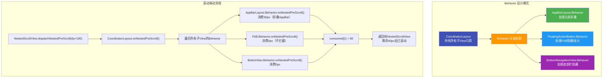

**AppBarLayout.ScrollingViewBehavior 联动机制详解：**

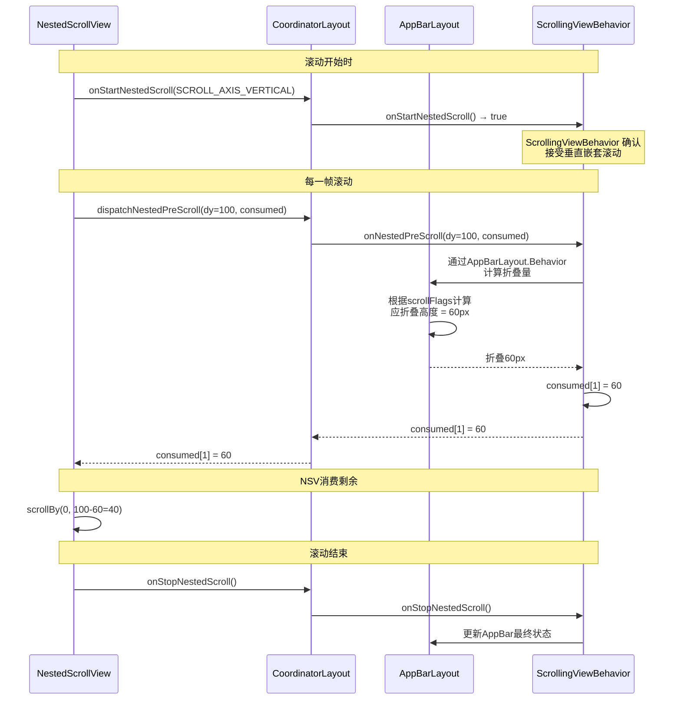

**术语解释（类比）：**
- **Behavior（行为）**：CoordinatorLayout 中子 View 的"行为策略"对象，定义了该子 View 如何响应嵌套滚动事件。
  - **类比**：Behavior 就像公司里每个部门的"响应手册"。当 CEO（CoordinatorLayout）收到一个事件时，不会自己处理，而是按手册分发给各部门（子 View 的 Behavior），每个部门根据自己的手册决定怎么响应。AppBarLayout 的手册说"收到上滑就折叠"，FAB 的手册说"收到上滑就隐藏"。
- **ScrollingViewBehavior**：专门用于"跟随滚动内容定位"的 Behavior，让 NestedScrollView 始终排在 AppBarLayout 下方。
  - **类比**：这是 NestedScrollView 的"座位安排"——它告诉 CoordinatorLayout"我永远坐在 AppBar 的正下方，AppBar 变矮了我就往下挪"。
- **layout_scrollFlags**：XML 属性，定义 AppBarLayout 子 View 在滚动时的行为（scroll、exitUntilCollapsed、enterAlways 等）。
  - **类比**：这就像每个员工的"工作模式"标签——enterAlways 表示"上下滚动我都跟着动"，exitUntilCollapsed 表示"我只在向上滑时折叠，但保留最小高度"。

### 2.6 Compose 中 LazyColumn 替代 ScrollView 的设计哲学差异

**Jetpack Compose 的 LazyColumn 代表了从"命令式容器"到"声明式按需组合"的范式转变。**

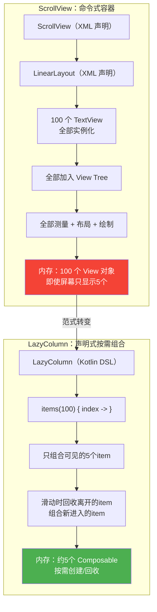

**设计哲学对比：**

| 维度 | ScrollView（命令式） | LazyColumn（声明式） |
|------|---------------------|---------------------|
| 内容创建方式 | 一次性全部创建 | 按需组合（lazy） |
| 内存模型 | 全部子 View 常驻内存 | 仅可见部分 + 少量缓存 |
| 子 View 管理 | 手动添加/移除 | 自动回收/创建 |
| 布局计算 | 全量 measure + layout | 仅可见区域 measure |
| 滚动机制 | canvas.translate 偏移 | 视口偏移 + item 位移 |
| 嵌套滚动 | 需要手动实现或用 NestedScrollView | 内置 Modifier.nestedScroll |
| 状态管理 | View 自身持有状态 | 状态提升 + remember |
| 代码风格 | XML + Kotlin 混合 | 纯 Kotlin DSL |

**核心差异深入分析：**

1. **内存模型的本质差异**
   - ScrollView 的子 View 一旦创建就一直存在，即使滚动到看不见的位置也不会被回收。1000 个 item 就是 1000 个 View 对象。
   - LazyColumn 只为当前可见的 item 创建 Composable，滚出屏幕的 item 会被回收。无论数据量多大，内存占用基本恒定。

2. **滚动机制的差异**
   - ScrollView 通过 `canvas.translate()` 偏移整个绘制坐标系来实现滚动——内容已全部布局好，只是移动"观察窗口"。
   - LazyColumn 通过 `LazyLayout` 计算"当前视口应该显示哪些 item"，动态组合和放置。滚动时不是移动已有内容，而是销毁离开的、创建进入的。

3. **适用场景的差异**
   - ScrollView：适合内容量固定、数量少的场景（表单、设置页、文章详情）。所有内容都需要预加载。
   - LazyColumn：适合内容量大、动态变化的场景（长列表、Feed 流）。按需加载是天然的优化。

**术语解释（类比）：**
- **命令式容器（ScrollView）**：你像一个"工厂主"，一次性把所有产品造出来摆在仓库里（全部子 View 实例化），顾客滚动时只是改变"看哪个货架"的位置（canvas.translate）。
  - **类比**：就像一家餐厅把菜单上所有菜都提前做好了摆在桌上，客人滚动看的是不同位置的菜。好处是即时可见，坏处是菜多了桌子放不下（内存爆炸）。
- **声明式按需组合（LazyColumn）**：你像一个"定制工坊"，只在客人需要时才制作对应的产品（按需组合 Composable），不需要的不占用资源。
  - **类比**：就像一家日料店只在客人点单后才做寿司，看到的几盘是现做的，滚出视线的被撤走回收，新进入视线的现做。无论菜单多大，桌上始终只有几盘菜。
- **按需组合**：Compose 的核心能力——只对当前需要显示的内容执行组合（Composition）过程，创建对应的节点树。
  - **类比**：这是 LazyColumn 节省内存的关键——不是"隐藏"不需要的内容，而是根本不"创建"它们。不需要的 item 在内存中完全不存在。

---

## 📝 跨章节综合考核训练

以下 8 道综合考核题旨在检验你对 ScrollView 与其他章节知识的融会贯通能力。每道题都关联至少 2 个章节的内容，要求你将多个知识点串联起来分析和解决问题。

### 考核题 1：ScrollView 单子 View 约束与 LinearLayout 的配合方案

**涉及章节**：05-ScrollView + 01-LinearLayout

**题目**：

你的团队需要实现一个用户个人资料页面，页面内容包括：顶部头像和昵称区域、中间的统计信息（粉丝数、关注数、获赞数，需要水平排列）、下方的个人简介长文本、底部的操作按钮组（编辑资料、分享、举报）。整个页面内容可能超出屏幕，需要支持垂直滚动。请回答以下问题：

1. 为什么不能直接在 ScrollView 中放置所有这些控件？请从 ScrollView 的单子 View 约束机制解释。
2. 你会如何设计这个页面的布局层次？请画出布局树。
3. 在这个方案中，LinearLayout 的 `orientation` 和 `layout_weight` 如何配合使用？统计信息区域需要水平排列，整体需要垂直排列，如何嵌套？
4. 如果统计信息区域需要等宽分配三个数据块，使用 `layout_weight` 的原理是什么？

**参考答案要点**：
- ScrollView 的 `onMeasure()` 基于 `getChildCount() == 1` 假设计算滚动范围，多个直接子 View 会导致 `getChildAt(0)` 只获取第一个子 View，其余子 View 不参与滚动边界计算，从而出现内容显示不全和布局错乱。
- 布局树设计：`ScrollView → LinearLayout(vertical) → [头像区域, LinearLayout(horizontal, weight=1)→[粉丝/关注/获赞], 简介TextView, 按钮LinearLayout(horizontal)→[编辑/分享/举报]]`
- 外层 LinearLayout 使用 `orientation="vertical"` 管理垂直排列，统计信息区域使用嵌套的 `orientation="horizontal"` LinearLayout 实现水平排列，通过 `layout_weight` 等分三个数据块。
- `layout_weight` 的原理是在 `onMeasure()` 中，LinearLayout 先测量不含 weight 的子 View，剩余空间按 weight 比例分配给带 weight 的子 View，三个 `weight=1` 的子 View 各获得剩余空间的 1/3。

---

### 考核题 2：ScrollView vs RecyclerView 的内存模型差异

**涉及章节**：05-ScrollView + 06-RecyclerView

**题目**：

假设你需要展示一个包含 1000 条商品数据的列表，每条数据包含一张图片和文字描述。你的同事小王用 ScrollView + LinearLayout 的方案实现，每次都 `addView` 一个新的 View；小李建议用 RecyclerView。请从以下角度深入对比两种方案：

1. 请画出两种方案的内存模型对比图，标注在 1000 条数据下各自的 View 对象数量。
2. ScrollView 的滚动机制（canvas.translate）和 RecyclerView 的滚动机制（ItemDecoration + 视口偏移）在处理 1000 条数据时有何本质差异？
3. 如果用户快速滑动列表，ScrollView 方案可能出现什么性能问题？RecyclerView 的 ViewHolder 复用机制如何解决？
4. 在什么场景下，ScrollView 反而比 RecyclerView 更合适？请给出至少 2 个具体场景并说明理由。

**参考答案要点**：
- ScrollView 方案：1000 条数据 = 1000 个 View 对象全部常驻内存，即使屏幕只显示约 8 条。RecyclerView 方案：约 8-12 个 ViewHolder（可见 + 缓存池 + 预取），内存占用恒定且与数据量无关。
- ScrollView 通过 `canvas.translate(-mScrollY)` 偏移整个画布，所有 1000 个 View 的 `draw()` 都会执行（即使不可见），因为它们都在 View Tree 中；RecyclerView 只对可见区域的 item 执行 `onBindViewHolder + onViewRecycled`，不可见 item 不参与 measure/layout/draw。
- 快速滑动时 ScrollView 会导致大量 GPU 过度绘制（不可见的 View 仍在绘制），且 measure/layout 阶段遍历所有子 View 导致帧丢失（卡顿）。RecyclerView 的 ViewHolder 复用避免了重复 `inflate`，且 `setItemViewCacheSize` 缓存机制让快速回滑时直接复用已绑定的 ViewHolder。
- ScrollView 更合适的场景：(1) 内容固定且数量少的设置页面——不需要 ViewHolder 复用的开销，实现更简单；(2) 混合内容的长文章详情页——包含富文本、图片、视频等多种类型 View，RecyclerView 的单一 item 类型难以处理，ScrollView + LinearLayout 更灵活。

---

### 考核题 3：NestedScrollView 嵌套滚动与 CoordinatorLayout 联动机制

**涉及章节**：05-ScrollView + 00-布局系统概述

**题目**：

在一个典型的 Material Design 详情页面中，页面结构为 `CoordinatorLayout → AppBarLayout(含CollapsingToolbarLayout) + NestedScrollView(内容区域)`。当用户向上滑动 NestedScrollView 时，CollapsingToolbarLayout 会逐渐折叠，Toolbar 会固定在顶部。请回答：

1. 从 Android 布局系统概述的角度，这个页面的 View Tree 结构是怎样的？请画出完整的 View 层次树。
2. 嵌套滚动的完整调用链是什么？请从 ACTION_DOWN 到 AppBarLayout 完成折叠，描述每一步的方法调用。
3. 如果将 NestedScrollView 替换为普通的 ScrollView，会发生什么？从嵌套滚动接口的角度解释为什么。
4. `app:layout_behavior="@string/appbar_scrolling_view_behavior"` 在这个体系中扮演什么角色？如果不设置会发生什么？

**参考答案要点**：
- View Tree：`CoordinatorLayout(Root) → [AppBarLayout → CollapsingToolbarLayout → [ImageView(parallax), Toolbar(pin)], NestedScrollView → LinearLayout → 内容View]`。CoordinatorLayout 是特殊的 FrameLayout，通过 Behavior 管理子 View 的联动。
- 完整调用链：`ACTION_DOWN → NSV.onTouchEvent → NSV.startNestedScroll → CL.onStartNestedScroll → AppBarLayout.Behavior.onStartNestedScroll(返回true) → ACTION_MOVE → NSV.dispatchNestedPreScroll(dy) → CL.onNestedPreScroll → AppBarLayout.Behavior.onNestedPreScroll(consumed[1]=折叠量) → NSV.scrollBy(剩余dy) → NSV.dispatchNestedScroll → CL.onNestedScroll → ACTION_UP → NSV.stopNestedScroll → CL.onStopNestedScroll → AppBarLayout.Behavior.onStopNestedScroll(动画收尾)`。
- 替换为 ScrollView 后，ScrollView 不实现 NestedScrollingChild 接口，`dispatchNestedPreScroll()` 返回 false，CoordinatorLayout 无法接收滚动事件，AppBarLayout 不会折叠——内容会直接从 AppBar 下方滑过，AppBar 保持固定不变。
- `ScrollingViewBehavior` 的作用是让 NestedScrollView 的 top 始终跟随 AppBarLayout 的 bottom 对齐（AppBar 折叠后内容区域自动上移填补空间）。不设置则 NestedScrollView 不会跟随 AppBar 移动，内容区域位置固定不变，折叠 AppBar 后会出现空白间隙。

---

### 考核题 4：ScrollView 的 Canvas 偏移与 draw 阶段的关系

**涉及章节**：05-ScrollView + 00-布局系统概述

**题目**：

根据 00 章布局系统概述中介绍的 View 渲染三大流程（measure → layout → draw），ScrollView 的滚动偏移发生在哪个阶段？请结合源码深入分析：

1. 请描述 ScrollView 在 measure、layout、draw 三个阶段分别做了什么特殊处理。
2. `mScrollY` 的修改发生在什么时机？它影响的是 measure、layout 还是 draw 阶段？
3. 请画出 ScrollView 在 draw 阶段执行 `canvas.translate()` 前后的 Canvas 坐标系变化图。
4. 如果在 `onLayout()` 中直接修改子 View 的位置（如 `child.layout(0, -scrollY, width, height-scrollY)`）而不是在 draw 阶段用 `canvas.translate`，会有什么问题？

**参考答案要点**：
- measure 阶段：ScrollView 在 `onMeasure()` 中处理 fillViewport 逻辑——如果子 View 测量高度小于自身高度且 fillViewport=true，用 `MeasureSpec.EXACTLY` 重新测量子 View。layout 阶段：ScrollView 不做特殊处理，子 View 从 (0,0) 开始正常布局，位置不随 scrollY 变化。draw 阶段：ScrollView 在 `dispatchDraw()` 中执行 `canvas.translate(-mScrollX, -mScrollY)` 偏移画布，再调用 `super.dispatchDraw(canvas)` 绘制子 View。
- `mScrollY` 的修改发生在事件处理阶段（`onTouchEvent` 中的 `scrollBy` 调用）或动画计算阶段（`computeScroll` 中 `scrollTo`），它只影响 draw 阶段的 Canvas 偏移量，不影响 measure 和 layout 的结果——子 View 的实际布局位置始终是 (0, 0)。
- Canvas 坐标系变化：translate 前画布原点在 (0,0)，子 View 从 (0,0) 绘制，用户只看到顶部内容；translate(0, -500) 后画布原点移到 (0, -500)，子 View 仍从 (0,0) 绘制但因画布偏移实际显示位置上移 500px，顶部 500px 移出可视区域，用户看到 500px 处的内容。
- 在 onLayout 中修改子 View 位置的问题：(1) 子 View 的 hit-test（触摸事件命中测试）区域会偏移，导致触摸事件坐标与视觉位置不一致——用户点位置 A 但命中位置 B 的 View；(2) 每次滚动都需要重新 layout，触发完整的 layout 流程（比 invalidate + draw 重得多），性能极差；(3) 嵌套滚动协议依赖 mScrollY 字段进行判断，直接改 layout 位置会导致协议失效。

---

### 考核题 5：ScrollView 在布局优化中的性能问题分析

**涉及章节**：05-ScrollView + 07-布局优化技巧

**题目**：

你的应用有一个长表单页面，使用了 `ScrollView → LinearLayout → [20个表单项ViewGroup，每个包含Label+EditText+错误提示]`。在低端机上滚动出现明显卡顿（FPS < 30）。根据 07 章布局优化的知识，请分析并解决：

1. 请分析这个布局的性能瓶颈在哪里？从布局层级深度、View 数量、measure/layout 开销三个维度分析。
2. 使用 Android Studio Layout Inspector 检查后发现有 5 层嵌套，如何用 07 章介绍的 `merge`、`ViewStub`、`ConstraintLayout` 等优化手段减少层级？
3. ScrollView 滚动时所有子 View 都会执行 `draw()`，07 章中如何通过减少过度绘制来优化？请说明 ScrollView 的 `canvas.translate` 与过度绘制的关系。
4. 最终优化后的布局方案是什么？预计能减少多少 measure/layout 时间？

**参考答案要点**：
- 性能瓶颈分析：(1) 布局层级深度——5 层嵌套，每次 measure/layout 的计算量为指数级增长（ScrollView → LinearLayout → 表单项ViewGroup → 水平LinearLayout → Label/EditText/错误提示），共约 100+ 个 View 节点；(2) View 数量——20 个表单项 × 每项 3-4 个 View = 60-80 个 View，ScrollView 滚动时全部参与 draw；(3) measure/layout 开销——ScrollView 每次滚动都触发 invalidate → draw，而 draw 前的 measure/layout 虽然不全量执行，但首次 inflate 和 fillViewport 重测量开销大。
- 优化手段：(1) 用 `ConstraintLayout` 替代表单项内的嵌套 LinearLayout，将 Label+EditText+错误提示放在同一层 ConstraintLayout 中，减少 2 层嵌套；(2) 用 `<merge>` 标签减少 include 布局时的多余层级；(3) 错误提示用 `ViewStub` 延迟加载，默认 GONE 的 View 仍参与 measure，ViewStub 则完全跳过。
- 过度绘制优化：ScrollView 的 `canvas.translate` 偏移画布后，不可见区域的子 View 仍在执行 `draw()`（它们在 View Tree 中），但绘制结果被裁剪不显示——这就是浪费的 GPU 绘制。可以通过 `View.setWillNotDraw(true)` 标记纯展示 View 不执行 draw，或通过 `canvas.clipRect` 限制绘制区域减少过度绘制。
- 优化后方案：`ScrollView → ConstraintLayout → [20个表单项ConstraintLayout(含ViewStub)]`，层级从 5 层降到 3 层，View 数量从 80+ 降到 40+（ViewStub 延迟加载减少 20 个），measure/layout 时间预计减少 40-60%。

---

### 考核题 6：fillViewport 与屏幕适配的场景关联

**涉及章节**：05-ScrollView + 08-屏幕适配

**题目**：

你需要实现一个登录页面，在不同屏幕尺寸（手机 5 英寸到平板 10 英寸，横屏和竖屏）下都需要将登录表单居中显示。页面结构为 `ScrollView(fillViewport=true) → LinearLayout(center) → [Logo, 用户名, 密码, 登录按钮]`。请结合 08 章屏幕适配知识回答：

1. 在 5 英寸手机竖屏下，内容高度约 400dp，ScrollView 高度约 800dp。fillViewport=true 时子 View 的最终高度是多少？内容如何居中？
2. 切换到横屏后，ScrollView 高度变为约 360dp，内容高度仍为 400dp（超出）。此时 fillViewport 的行为有什么变化？是否影响滚动？
3. 在 10 英寸平板竖屏下，ScrollView 高度约 1600dp。如果不设置 fillViewport，会发生什么？从屏幕适配的角度说明 fillViewport 的必要性。
4. 如果使用 08 章中的 `sw<dimen>` 限定符方案，如何为不同屏幕尺寸提供不同的 padding 值来优化表单在不同设备上的间距？

**参考答案要点**：
- 5 英寸竖屏：fillViewport=true 时，onMeasure 检测到子 View 测量高度 400dp < ScrollView 高度 800dp，用 `MeasureSpec.EXACTLY(800dp)` 重新测量子 View，子 View 被拉伸到 800dp。LinearLayout 设置 `gravity=center` 后，内容在 800dp 的子 View 内垂直居中显示。
- 横屏切换后：ScrollView 高度 360dp < 子 View 内容高度 400dp，onMeasure 中 `childHeight < selfHeight` 条件不成立，fillViewport 不介入，子 View 保持 400dp 的自然高度，正常滚动。fillViewport 只在内容不足一屏时生效，超出时自动失效。
- 10 英寸平板不设 fillViewport：ScrollView 高度 1600dp，子 View 高度 400dp，子 View 从顶部开始布局，下方有 1200dp 空白，登录表单挤在屏幕顶部。从屏幕适配角度，大屏幕设备空白区域更大，fillViewport 是保证表单居中、消除大屏空白的必要手段。
- sw 限定符方案：创建 `values-sw600dp/dimens.xml`（平板）定义 `form_padding=48dp`，`values-sw360dp/dimens.xml`（手机）定义 `form_padding=24dp`，在布局中引用 `@dimen/form_padding`，系统根据屏幕最小宽度自动选择对应的尺寸值，实现不同设备的间距自适应。

---

### 考核题 7：ScrollView 的滚动与 Compose LazyColumn 的按需渲染对比

**涉及章节**：05-ScrollView + 09-Compose

**题目**：

你的团队正在从传统 View 体系迁移到 Jetpack Compose。有一个长文章阅读页面，原来用 `ScrollView + LinearLayout + 多个TextView` 实现，现在要用 Compose 重写。团队有两个方案：方案 A 用 `Column(verticalScroll)` 保持和 ScrollView 类似的全部加载行为，方案 B 用 `LazyColumn` 按需组合。请回答：

1. Compose 中 `Column(modifier = Modifier.verticalScroll(scrollState))` 的底层实现与 Android View 的 ScrollView 有什么对应关系？它的滚动状态 `scrollState` 如何映射到 ScrollView 的 `mScrollY`？
2. 方案 A（Column + verticalScroll）和方案 B（LazyColumn）在内存模型上的差异是什么？请用表格对比。
3. 对于长文章阅读场景（段落数量固定但可能很长），方案 A 和方案 B 哪个更合适？为什么？如果是无限滚动的 Feed 流呢？
4. 如果用 LazyColumn 实现长文章阅读，段落之间的间距、不同段落类型（标题/正文/图片/引用）如何用 Compose 的 `item` 和 `items` API 处理？

**参考答案要点**：
- `Column + verticalScroll` 底层在 Compose 中生成一个修改了 `draw` 方法的 LayoutNode，通过偏移绘制坐标实现滚动，与 ScrollView 的 `canvas.translate` 原理一致。`scrollState.value` 对应 `mScrollY`，`verticalScroll` modifier 消费手势事件更新 `scrollState`，触发 `LayoutNode` 重绘。
- 内存模型对比表：方案 A 全部 Composable 一次性组合，所有段落节点常驻内存（类似 ScrollView），滚动时仅偏移绘制坐标；方案 B 只组合可见段落，不可见段落被回收，内存恒定（类似 RecyclerView）。100 段文章：方案 A = 100 个 LayoutNode，方案 B ≈ 5-8 个 LayoutNode。
- 长文章阅读场景选方案 A 更合适：段落数量固定且已知，总数据量可控，全部预加载可以保证滚动时即时响应（无组合延迟），且无需处理 item 复用逻辑。无限 Feed 流选方案 B：数据量未知且可能极大，必须按需组合否则内存会持续增长。
- LazyColumn 实现长文章：使用 `items(article.blocks)` 遍历文章块列表，在 lambda 中用 `when(block.type)` 分发到不同的 Composable——`BlockType.TITLE → Text(style=titleLarge)`, `BlockType.PARAGRAPH → Text(style=bodyLarge)`, `BlockType.IMAGE → AsyncImage()`, `BlockType.QUOTE → Surface(shape=RoundedCornerShape) { Text(italic=true) }`。段落间距通过 `Arrangement.spacedBy(dp)` 或 item 内的 `Modifier.padding` 处理。

---

### 考核题 8：touchSlop 与 ConstraintLayout MotionLayout 的手势冲突

**涉及章节**：05-ScrollView + 04-ConstraintLayout

**题目**：

你的页面结构为 `ScrollView → ConstraintLayout → [内容区域 + 底部 MotionLayout(可展开/收起的面板)]`。MotionLayout 中定义了一个 `OnSwipe` 手势，用户可以从底部上滑展开面板。但实际运行中发现：当用户在底部面板区域上滑时，ScrollView 抢先拦截了事件开始滚动，MotionLayout 的展开手势无法触发。请分析并解决这个冲突：

1. 从 ScrollView 的 `onInterceptTouchEvent` 和 `touchSlop` 机制分析，为什么 ScrollView 会抢先拦截事件？
2. ConstraintLayout 的 `MotionLayout.OnSwipe` 是如何检测手势的？它与 ScrollView 的 touchSlop 判断是否存在竞争条件？
3. 如何通过 `requestDisallowInterceptTouchEvent()` 解决这个冲突？请在 MotionLayout 的 `OnTouchEvent` 中写出解决方案代码。
4. 如果场景变为 `MotionLayout(外层, 控制整体页面切换) → ScrollView(内层, 内容滚动)`，嵌套方向相同时如何用 NestedScrolling 接口解决？

**参考答案要点**：
- ScrollView 在 ACTION_MOVE 中检测到手指移动距离超过 touchSlop（约 8dp）后，`onInterceptTouchEvent` 返回 true 拦截事件并通知子 View `ACTION_CANCEL`。由于 ScrollView 在 View Tree 中是父容器，它的 touchSlop 判断先于 MotionLayout 执行，导致 MotionLayout 的 OnSwipe 还没来得及判断就被取消。
- MotionLayout 的 `OnSwipe` 通过 `MotionHelper` 监听 ACTION_MOVE 并计算手势方向和距离，也有自己的 touchSlop 阈值。竞争条件在于：ScrollView 的 onInterceptTouchEvent 在事件分发阶段执行（先），MotionLayout 的 OnSwipe 在 onTouchEvent 阶段执行（后），当 ScrollView 判定为滑动手势后拦截事件，MotionLayout 永远收不到后续 MOVE 事件。
- 解决方案：在 MotionLayout 的 `dispatchTouchEvent` 或 `onTouchEvent` 的 ACTION_DOWN 中调用 `parent.requestDisallowInterceptTouchEvent(true)`，阻止 ScrollView 拦截后续事件。代码：`motionLayout.setOnTouchListener { _, event -> if (event.action == MotionEvent.ACTION_DOWN) { parent.requestDisallowInterceptTouchEvent(true) }; false }`。或者在 MotionLayout 的 `OnSwipe` 中设置 `touchAnchorId` 和 `touchRegionId` 限定手势响应区域。
- 嵌套方向相同时（如都是垂直滚动），MotionLayout 实现 `NestedScrollingParent` 接口，在 `onNestedPreScroll` 中根据当前动画状态决定是否消费滚动距离——如果 MotionLayout 的过渡动画未完成则消费全部 dy（面板展开/收起），完成后则不消费（让 ScrollView 滚动）。ScrollView 替换为 NestedScrollView 实现 `NestedScrollingChild`，通过 `dispatchNestedPreScroll` 将滚动事件先交给 MotionLayout 处理。

---

## 参考文献与延伸阅读

### 官方文档与源码
1. **[Android 官方文档 - ScrollView 指南](https://developer.android.com/guide/topics/ui/layout/scroll)**
   - Google 官方滚动视图文档，涵盖 ScrollView、HorizontalScrollView 及 NestedScrollView 的使用指南。
2. **[AOSP 源码 - ScrollView.java](https://cs.android.com/android/platform/superproject/+/main:frameworks/base/core/java/android/widget/ScrollView.java)**
   - ScrollView 的 AOSP 源码，包含 scrollTo/scrollBy、onInterceptTouchEvent 及 fling 行为的实现。
3. **[AOSP 源码 - NestedScrollView.java (AndroidX)](https://cs.android.com/androidx/platform/frameworks/support/+/main:core/core/src/main/java/androidx/core/widget/NestedScrollView.java)**
   - NestedScrollView 的 AndroidX 源码，实现 NestedScrollingChild/Parent 接口的嵌套滚动机制。

### 滚动机制
4. **[Android Scroller 完全解析：关于 Scroller 你所需知道的一切 - 郭霖 (CSDN)](https://blog.csdn.net/guolin_blog/article/details/48719871)**
   - 系统性解析 Scroller 的工作原理，包括 computeScrollOffset()、fling() 及与 invalidate() 的配合机制。
5. **[Android OverScroller 原理解析 - CSDN](https://blog.csdn.net/qq_36329049/article/details/141889592)**
   - 详解 OverScroller 对 Scroller 的增强，包括物理弹性效果和过界滚动（overscroll）处理。

### 嵌套滚动
6. **[详解 Android 中的 NestedScrolling 机制 - 脚本之家](https://m.jb51.net/article/113130.htm)**
   - 系统性讲解 NestedScrollingParent/NestedScrollingChild 接口的设计目的和协作流程。
7. **[CoordinatorLayout 源码分析及 NestedScrolling 机制 - 博客园](https://www.cnblogs.com/aruba233/p/17163833.html)**
   - 从源码角度分析 CoordinatorLayout.Behavior 如何利用 NestedScrolling 机制实现联动效果。
8. **[NestedScrolling 机制之 CoordinatorLayout.Behavior 实战 - 腾讯云](https://cloud.tencent.com/developer/article/1353591)**
   - 结合实际案例讲解 CoordinatorLayout.Behavior 的滚动联动实现。

