# RecyclerView 列表完全指南

> **学习目标**：掌握 RecyclerView 架构设计、Adapter/ViewHolder 模式、多种 LayoutManager、动画、拖拽排序及 DiffUtil 高效更新
> **前置知识**：Activity 生命周期、XML 布局基础、Lambda 表达式
> **难度分级**：⭐⭐⭐ 高级
> **时间预估**：60 分钟

---

## 1. 一句话定义

RecyclerView 是 Android Jetpack 提供的**高性能列表组件**，通过回收复用 ViewHolder 机制，在任意数据量下只渲染屏幕可见区域的 View，是 ListView 的全面替代方案。

---

## 2. 为什么需要

### ListView 的致命问题

| 问题 | 说明 | 影响 |
|------|------|------|
| ViewHolder 非强制 | `getView()` 每次调用 `findViewById` | 列表滑动卡顿 |
| 布局单一 | 只支持垂直列表 | 无法实现网格、瀑布流 |
| 无内置动画 | 添加/删除需手动刷新 | 体验生硬 |
| 数据更新粗暴 | `notifyDataSetChanged()` 全量刷新 | 性能浪费严重 |
| 缺少布局解耦 | Item 布局与数据逻辑混合 | 难以维护 |

### RecyclerView 的解决方案

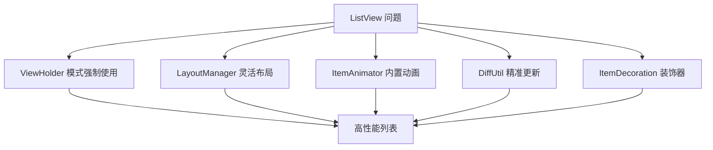

---

## 3. 核心概念

### 架构全景图

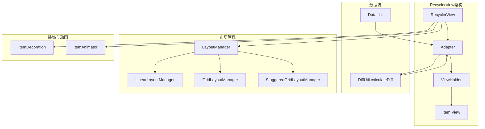

**术语解释：**
- **RecyclerView**：Android Jetpack 提供的高性能列表组件。名字来自"Recycler View"——回收视图。它只渲染屏幕上可见的 Item，滑出屏幕的 Item 会被回收复用，避免创建大量 View 对象，内存占用极低。
- **Adapter（适配器）**：连接数据和 View 的桥梁。它负责将数据（如 User 列表）转换为 View（每个用户的卡片）。Adapter 是一个抽象类，开发者必须实现其中的方法。
- **ViewHolder（视图持有者）**：缓存 Item View 中子 View 引用的容器。每个 ViewHolder 持有一个 Item View 的引用，避免每次绑定数据时都调用 `findViewById()`（这个方法会遍历 View 树，性能开销大）。
- **Item View**：列表中每一项的视图。比如通讯录列表中，每个联系人就是一个 Item View。
- **LayoutManager（布局管理器）**：决定 Item 如何排列的组件。LinearLayoutManager 让 Item 垂直/水平排列，GridLayoutManager 让 Item 网格排列，StaggeredGridLayoutManager 让 Item 瀑布流排列。
- **ItemDecoration（装饰器）**：给 Item 添加分割线、间距、边框等装饰效果。比如列表项之间的分隔线就是通过 ItemDecoration 实现的。
- **ItemAnimator（动画器）**：控制 Item 增删改时的过渡动画。比如删除一个 Item 时，其他 Item 滑动填补空位的动画。

### 关键角色说明

| 角色 | 职责 | 必须自定义？ |
|------|------|-------------|
| RecyclerView | 容器，管理滑动和回收 | 否 |
| Adapter | 绑定数据到 ViewHolder | ✅ 必须 |
| ViewHolder | 缓存 View 引用 | ✅ 必须 |
| LayoutManager | 决定 Item 排列方式 | 否（内置3种） |
| ItemDecoration | 分割线、间距、边框 | 可选 |
| ItemAnimator | 增删改动画 | 可选 |
| DiffUtil | 计算数据差异 | 推荐 |

### 回收机制

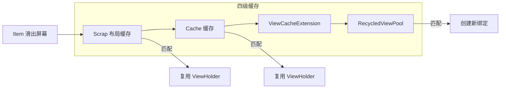

**术语解释：**
- **回收机制（Recycling）**：RecyclerView 的核心性能优化手段。当 Item 滑出屏幕时，它的 ViewHolder 不会被销毁，而是放入缓存池。当新的 Item 滑入屏幕时，从缓存池中取出 ViewHolder 重新绑定数据，避免重新创建 View。
- **Scrap（临时缓存）**：屏幕内可见的 ViewHolder 的临时存储。在 layout 阶段，RecyclerView 会临时分离所有 ViewHolder 到 Scrap 列表，layout 完成后重新取回。不需要重新绑定数据。
- **Cache（缓存）**：刚滑出屏幕的 ViewHolder（默认缓存 2 个）。这些 ViewHolder 不需要重新绑定数据，直接复用。用于快速滑动时的即时复用。
- **ViewCacheExtension**：开发者自定义的缓存层。极少使用，大多数情况下不需要。
- **RecycledViewPool（回收池）**：按 viewType 分桶存储的 ViewHolder 池。每个 viewType 默认缓存 5 个 ViewHolder。从这里取出的 ViewHolder 需要重新调用 `onBindViewHolder()` 绑定数据。
- **viewType（视图类型）**：标识 Item 布局类型的整数。多类型列表中，不同布局的 Item 使用不同的 viewType，RecyclerView 按 viewType 分桶缓存 ViewHolder，避免类型混淆。

---

## 4. 基础用法

### 4.1 添加依赖

```kotlin
// build.gradle.kts
dependencies {
    implementation("androidx.recyclerview:recyclerview:1.3.2")
}
```

### 4.2 布局文件

```xml
<!-- activity_main.xml -->
<androidx.recyclerview.widget.RecyclerView
    android:id="@+id/recyclerView"
    android:layout_width="match_parent"
    android:layout_height="match_parent" />
```

### 4.3 数据模型

```kotlin
data class User(
    val id: Int,
    val name: String,
    val avatar: Int
)
```

### 4.4 Adapter 实现

```kotlin
class UserAdapter(
    private val users: MutableList<User>,
    private val onClick: (User) -> Unit
) : RecyclerView.Adapter<UserAdapter.UserViewHolder>() {

    inner class UserViewHolder(view: View) : RecyclerView.ViewHolder(view) {
        val tvName: TextView = view.findViewById(R.id.tvName)
        val ivAvatar: ImageView = view.findViewById(R.id.ivAvatar)
    }

    override fun onCreateViewHolder(parent: ViewGroup, viewType: Int): UserViewHolder {
        val view = LayoutInflater.from(parent.context)
            .inflate(R.layout.item_user, parent, false)
        return UserViewHolder(view)
    }

    override fun onBindViewHolder(holder: UserViewHolder, position: Int) {
        val user = users[position]
        holder.tvName.text = user.name
        holder.ivAvatar.setImageResource(user.avatar)
        holder.itemView.setOnClickListener { onClick(user) }
    }

    override fun getItemCount(): Int = users.size
}
```

### 4.5 Activity 中使用

```kotlin
class MainActivity : AppCompatActivity() {
    override fun onCreate(savedInstanceState: Bundle?) {
        super.onCreate(savedInstanceState)
        setContentView(R.layout.activity_main)

        val recyclerView = findViewById<RecyclerView>(R.id.recyclerView)
        val users = mutableListOf(
            User(1, "张三", R.drawable.avatar1),
            User(2, "李四", R.drawable.avatar2)
        )

        recyclerView.apply {
            layoutManager = LinearLayoutManager(this@MainActivity)
            adapter = UserAdapter(users) { user ->
                Toast.makeText(this@MainActivity, user.name, Toast.LENGTH_SHORT).show()
            }
            addItemDecoration(DividerItemDecoration(this@MainActivity, DividerItemDecoration.VERTICAL))
        }
    }
}
```

---

## 5. 实战场景示例

### 5.1 GridLayoutManager 网格布局

```kotlin
// 两列网格
recyclerView.layoutManager = GridLayoutManager(this, 2)

// SpanSizeLookup：让某些 Item 占满整行
recyclerView.layoutManager = GridLayoutManager(this, 2).apply {
    spanSizeLookup = object : GridLayoutManager.SpanSizeLookup() {
        override fun getSpanSize(position: Int): Int {
            return if (users[position].isHeader) 2 else 1
        }
    }
}
```

### 5.2 StaggeredGridLayoutManager 瀑布流

```kotlin
// 三列瀑布流
recyclerView.layoutManager = StaggeredGridLayoutManager(
    3, StaggeredGridLayoutManager.VERTICAL
).apply {
    gapStrategy = StaggeredGridLayoutManager.GAP_HANDLING_NONE
}
```

### 5.3 DiffUtil 精准更新

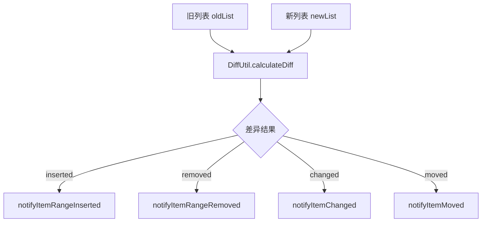

```kotlin
class UserDiffCallback(
    private val oldList: List<User>,
    private val newList: List<User>
) : DiffUtil.Callback() {

    override fun getOldListSize(): Int = oldList.size
    override fun getNewListSize(): Int = newList.size

    override fun areItemsTheSame(oldPos: Int, newPos: Int): Boolean {
        return oldList[oldPos].id == newList[newPos].id
    }

    override fun areContentsTheSame(oldPos: Int, newPos: Int): Boolean {
        return oldList[oldPos] == newList[newPos]
    }
}

// 使用
val diffResult = DiffUtil.calculateDiff(UserDiffCallback(oldUsers, newUsers))
users.clear()
users.addAll(newUsers)
diffResult.dispatchUpdatesTo(adapter)
```

### 5.4 ItemTouchHelper 拖拽与滑动删除

```kotlin
val itemTouchHelper = ItemTouchHelper(object : ItemTouchHelper.SimpleCallback(
    ItemTouchHelper.UP or ItemTouchHelper.DOWN,  // 拖拽方向
    ItemTouchHelper.LEFT or ItemTouchHelper.RIGHT // 滑动方向
) {
    override fun onMove(
        recyclerView: RecyclerView,
        viewHolder: RecyclerView.ViewHolder,
        target: RecyclerView.ViewHolder
    ): Boolean {
        val fromPos = viewHolder.adapterPosition
        val toPos = target.adapterPosition
        Collections.swap(users, fromPos, toPos)
        adapter.notifyItemMoved(fromPos, toPos)
        return true
    }

    override fun onSwiped(viewHolder: RecyclerView.ViewHolder, direction: Int) {
        val pos = viewHolder.adapterPosition
        users.removeAt(pos)
        adapter.notifyItemRemoved(pos)
    }
})
itemTouchHelper.attachToRecyclerView(recyclerView)
```

### 5.5 多类型 Item

```kotlin
class MultiTypeAdapter(
    private val items: List<ListItem>
) : RecyclerView.Adapter<RecyclerView.ViewHolder>() {

    companion object {
        const val TYPE_HEADER = 0
        const val TYPE_ITEM = 1
    }

    class HeaderViewHolder(view: View) : RecyclerView.ViewHolder(view) {
        val tvTitle: TextView = view.findViewById(R.id.tvTitle)
    }

    class ItemViewHolder(view: View) : RecyclerView.ViewHolder(view) {
        val tvContent: TextView = view.findViewById(R.id.tvContent)
    }

    override fun getItemViewType(position: Int): Int {
        return when (items[position]) {
            is ListItem.Header -> TYPE_HEADER
            is ListItem.Content -> TYPE_ITEM
        }
    }

    override fun onCreateViewHolder(parent: ViewGroup, viewType: Int): RecyclerView.ViewHolder {
        val inflater = LayoutInflater.from(parent.context)
        return when (viewType) {
            TYPE_HEADER -> HeaderViewHolder(inflater.inflate(R.layout.item_header, parent, false))
            else -> ItemViewHolder(inflater.inflate(R.layout.item_content, parent, false))
        }
    }

    override fun onBindViewHolder(holder: RecyclerView.ViewHolder, position: Int) {
        when (val item = items[position]) {
            is ListItem.Header -> (holder as HeaderViewHolder).tvTitle.text = item.title
            is ListItem.Content -> (holder as ItemViewHolder).tvContent.text = item.content
        }
    }

    override fun getItemCount(): Int = items.size
}

sealed class ListItem {
    data class Header(val title: String) : ListItem()
    data class Content(val content: String) : ListItem()
}
```

---

## 6. 常见错误与避坑

### ❌ → ✅ Before/After 对比

#### 错误 1：在 onBindViewHolder 中创建监听器

```kotlin
// ❌ 错误：每次绑定都创建新对象
override fun onBindViewHolder(holder: ViewHolder, position: Int) {
    holder.itemView.setOnClickListener {
        onClick(items[position])
    }
}

// ✅ 正确：在 ViewHolder 构造器中绑定，bind 时更新数据
inner class MyViewHolder(view: View) : RecyclerView.ViewHolder(view) {
    init {
        view.setOnClickListener {
            val pos = adapterPosition
            if (pos != RecyclerView.NO_POSITION) {
                onClick(items[pos])
            }
        }
    }
}
```

#### 错误 2：忽略 adapterPosition 校验

```kotlin
// ❌ 错误：position 可能是 NO_POSITION(-1)
val item = items[position]

// ✅ 正确：先校验
val pos = adapterPosition
if (pos != RecyclerView.NO_POSITION) {
    val item = items[pos]
}
```

#### 错误 3：使用 notifyDataSetChanged

```kotlin
// ❌ 错误：全量刷新，无动画
adapter.notifyDataSetChanged()

// ✅ 正确：使用 DiffUtil 精准更新
val diffResult = DiffUtil.calculateDiff(diffCallback)
diffResult.dispatchUpdatesTo(adapter)
```

### 错误速查表

| 错误现象 | 原因 | 解决方案 |
|---------|------|---------|
| 列表滑动卡顿 | `onCreateViewHolder` 中做耗时操作 | 移到异步线程 |
| Item 点击位置错乱 | `onBindViewHolder` 中设监听 | 移到 ViewHolder 构造器 |
| 滑到底部崩溃 | 没有判断 `NO_POSITION` | 加 `adapterPosition` 校验 |
| 数据不更新 | 没调用 `notifyItemChanged` | 使用 DiffUtil |
| 瀑布流闪烁 | 高度不一致但没缓存 | 使用 `setHasStableIds(true)` |
| 网格 Item 宽度不均 | spanSize 设置错误 | 检查 `SpanSizeLookup` |

---

## 7. 优势与局限

### 优势

| 特性 | 说明 |
|------|------|
| 高性能 | 四级缓存 + ViewHolder 回收 |
| 灵活布局 | 线性/网格/瀑布流一行切换 |
| 内置动画 | 增删改自带过渡效果 |
| 精准更新 | DiffUtil 只刷新变化的 Item |
| 可扩展 | ItemDecoration/TouchHelper 随意添加 |

### 局限

| 局限 | 说明 |
|------|------|
| 学习曲线 | Adapter/ViewHolder 模式比 ListView 复杂 |
| 多类型麻烦 | 每种类型需单独 ViewHolder |
| 嵌套滚动 | 与 NestedScrollView 配合需额外处理 |
| 头部/尾部 | 需自行处理 position 偏移 |

---

## 8. 进阶技巧

### 8.1 多类型简化方案：ListAdapter

```kotlin
// 使用 ListAdapter + DiffUtil.ItemCallback，省去手动管理列表
class UserAdapter : ListAdapter<User, UserAdapter.UserViewHolder>(UserDiffCallback) {

    override fun onCreateViewHolder(parent: ViewGroup, viewType: Int): UserViewHolder {
        val view = LayoutInflater.from(parent.context)
            .inflate(R.layout.item_user, parent, false)
        return UserViewHolder(view)
    }

    override fun onBindViewHolder(holder: UserViewHolder, position: Int) {
        holder.bind(getItem(position))
    }

    inner class UserViewHolder(view: View) : RecyclerView.ViewHolder(view) {
        private val tvName: TextView = view.findViewById(R.id.tvName)
        fun bind(user: User) {
            tvName.text = user.name
        }
    }

    companion object UserDiffCallback : DiffUtil.ItemCallback<User>() {
        override fun areItemsTheSame(oldItem: User, newItem: User) = oldItem.id == newItem.id
        override fun areContentsTheSame(oldItem: User, newItem: User) = oldItem == newItem
    }
}

// 使用
adapter.submitList(newUsers) // 自动 diff，自动更新
```

### 8.2 预取机制（GapWorker）

```kotlin
// RecyclerView 默认开启预取，可在 LayoutManager 中调整
recyclerView.layoutManager = LinearLayoutManager(this).apply {
    initialPrefetchItemCount = 4 // 预取 4 个 Item 的 View
}
```

### 8.3 共享 RecycledViewPool

```kotlin
// 多个 RecyclerView 共享 ViewHolder 池（如 ViewPager2 中）
val sharedPool = RecyclerView.RecycledViewPool()
sharedPool.setMaxRecycledViews(TYPE_ITEM, 20)

recyclerView1.setRecycledViewPool(sharedPool)
recyclerView2.setRecycledViewPool(sharedPool)
```

---

## 9. 面试高频考点

### Q1：RecyclerView 的缓存机制分几级？

**答**：四级缓存：
1. **Scrap**：屏幕内可见 ViewHolder（布局阶段临时存储）
2. **Cache**：刚滑出屏幕的 ViewHolder（默认2个），直接复用不需 onBindViewHolder
3. **ViewCacheExtension**：自定义缓存层（极少使用）
4. **RecycledViewPool**：按 viewType 分桶存储（默认每种5个），需重新 onBindViewHolder

### Q2：Adapter 的 `getItemViewType` 有什么作用？

**答**：返回 int 标识 Item 类型，RecyclerView 按 viewType 分桶缓存 ViewHolder。多类型列表必须正确实现，否则会复用错误类型的 ViewHolder 导致崩溃。

### Q3：DiffUtil 原理？

**答**：使用 Myers 差分算法，通过 `areItemsTheSame`（id 相同）和 `areContentsTheSame`（内容相同）两个回调计算最小操作序列（insert/remove/move/change），避免全量刷新。

### Q4：如何实现列表中的局部刷新？

**答**：使用 `notifyItemChanged(position, payload)` 配合 `onBindViewHolder(holder, position, payloads)`，只更新变化的部分，避免闪烁。

### Q5：NestedScrollView 嵌套 RecyclerView 的问题？

**答**：`match_parent` 的 RecyclerView 在 NestedScrollView 中会一次性测量所有 Item，失去回收机制。解决：在 onResume 中手动测量，或改用 CoordinatorLayout + AppBarLayout。

---

## 10. 小结与下一步

### 快速参考卡

```
┌─────────────────────────────────────────────────┐
│           RecyclerView 速查卡                    │
├─────────────────────────────────────────────────┤
│  布局管理器:                                      │
│    LinearLayoutManager    → 垂直/水平列表           │
│    GridLayoutManager      → 网格                   │
│    StaggeredGridLayoutManager → 瀑布流             │
│                                                   │
│  更新数据:                                         │
│    adapter.submitList(newList) // ListAdapter      │
│    DiffUtil.calculateDiff() + dispatchUpdatesTo() │
│                                                   │
│  拖拽/滑动:                                        │
│    ItemTouchHelper.attachToRecyclerView(rv)       │
│                                                   │
│  高性能:                                           │
│    setHasFixedSize(true)  // 固定大小               │
│    RecycledViewPool        // 共享池                │
│    setItemViewCacheSize(n) // 调整缓存数            │
└─────────────────────────────────────────────────┘
```

### 下一步学习

| 主题 | 内容 | 推荐指数 |
|------|------|---------|
| Paging 3 | 分页加载库 | ⭐⭐⭐ |
| ListAdapter | 简化 DiffUtil 使用 | ⭐⭐⭐ |
| ConcatAdapter | 多 Adapter 组合 | ⭐⭐ |
| SnapHelper | 类似 ViewPager 的吸附效果 | ⭐ |

---

## 课后练习

1. 实现一个带头部 + 列表的多类型 RecyclerView
2. 用 DiffUtil 实现带增删改的通讯录列表
3. 用 ItemTouchHelper 实现拖拽排序 + 左滑删除

---

## 自测题

1. RecyclerView 的 Cache 和 RecycledViewPool 有什么区别？
2. 为什么推荐在 ViewHolder 构造器中设置点击监听？
3. DiffUtil 的 `areItemsTheSame` 返回 false 会触发什么操作？

---

## 常见学生错误

| 错误 | 正确做法 |
|------|---------|
| 忘记调用 `adapter.notifyDataSetChanged()` | 修改数据后通知适配器 |
| 在 `onBindViewHolder` 中做 JSON 解析 | 数据预处理好再传入 |
| 所有 Item 用同一个 viewType | 不同布局用不同 viewType |
| 不检查 `RecyclerView.NO_POSITION` | 始终校验 adapterPosition |

---

## 教学提示

- 先演示 ListView 的问题，再引入 RecyclerView 对比
- 用 LayoutManager 切换实验（线性→网格→瀑布流）建立直观感受
- DiffUtil 部分用 Before/After 动画对比效果
- ItemTouchHelper 用联系人排序实战场景

---

## 🎬 渲染逻辑详解

### RecyclerView 的高性能渲染机制

RecyclerView 的核心优势在于**按需渲染**和**ViewHolder 复用**：

```mermaid
graph TD
    A[RecyclerView.onMeasure] --> B[LayoutManager 测量可见区域]
    B --> C[创建/复用 ViewHolder]
    C --> D[onBindViewHolder: 绑定数据]
    D --> E[onLayout: 确定可见Item位置]
    E --> F[dispatchDraw: 只绘制可见Item]
    F --> G[滑出屏幕: 回收到缓存池]
    G --> C
    
    style A fill:#795548,color:#fff
    style B fill:#FF9800,color:#fff
    style C fill:#4CAF50,color:#fff
    style F fill:#2196F3,color:#fff
```

### 四级缓存的渲染原理

```plaintext
RecycledViewPool 四级缓存：
  
  第1级 Scrap: 屏幕内可见的 ViewHolder
    → 不需要重新绑定数据，直接复用
    → 用于 layout 阶段的临时存储
  
  第2级 Cache: 刚滑出屏幕的 ViewHolder（默认2个）
    → 不需要重新绑定数据，直接复用
    → 用于快速滑动时的即时复用
  
  第3级 ViewCacheExtension: 自定义缓存（极少使用）
    → 开发者自定义的缓存策略
  
  第4级 RecycledViewPool: 按 viewType 分桶存储（默认每种5个）
    → 需要重新调用 onBindViewHolder 绑定数据
    → 最终的回收池
```

### LayoutManager 的渲染策略

| LayoutManager | 测量策略 | 布局策略 | 绘制策略 |
|--------------|---------|---------|---------|
| **LinearLayoutManager** | 测量可见Item + 预取Item | 垂直/水平排列 | 顺序绘制 |
| **GridLayoutManager** | 测量可见Item + SpanSize | 网格排列 | 按列绘制 |
| **StaggeredGridLayoutManager** | 测量可见Item + 瀑布流高度 | 不等高网格 | 按列绘制 |

### DiffUtil 的渲染优化

```plaintext
传统 notifyDataSetChanged():
  → 全部 Item 重新绑定数据
  → 全部 Item 重新布局
  → 全部 Item 重新绘制
  → 无动画效果

DiffUtil.calculateDiff():
  → 计算新旧列表的最小操作序列
  → 只通知变化的 Item
  → 只重新绑定变化的 Item
  → 自带动画效果
  → 性能提升 10-100 倍
```

### 预取机制（GapWorker）

```plaintext
GapWorker 预取：
  用户滑动时，提前创建下一个 Item 的 ViewHolder
  减少滑动时的卡顿
  
  initialPrefetchItemCount = 4
  → 提前预取 4 个 Item 的 View
  → 滑动时立即显示，无延迟
```

---

## 🔗 知识依赖图

### 与前后章节的关系

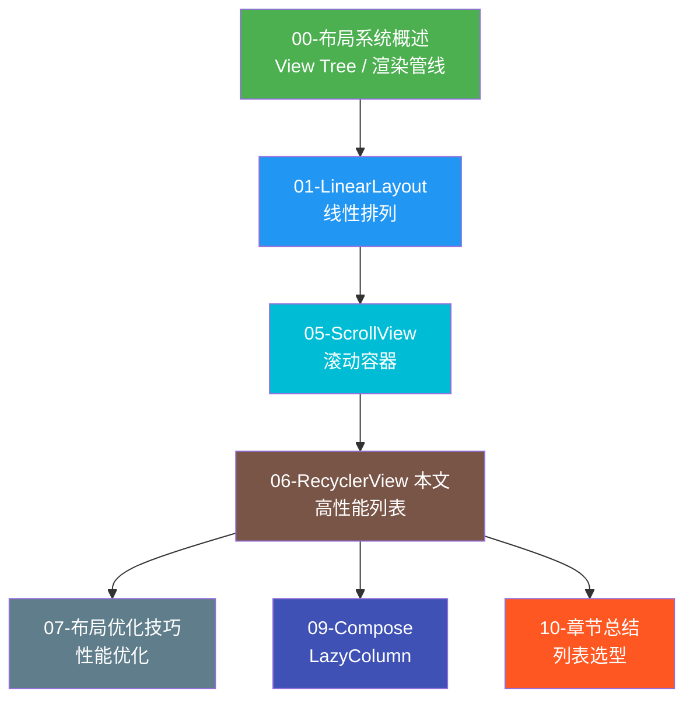

### 核心知识点的章节串联

| 知识点 | 本章内容 | 关联章节 | 关联说明 |
|--------|---------|---------|---------|
| **ViewHolder 复用** | 缓存+复用机制 | 07-优化 | 07 章讲 RecyclerView 替代 ScrollView |
| **LayoutManager** | 控制Item排列方式 | 01-LinearLayout | LinearLayoutManager = 线性排列 |
| **DiffUtil** | 精准更新 | 09-Compose | Compose LazyColumn 自动 diff |
| **ItemDecoration** | 分割线/间距 | 01-LinearLayout | LinearLayout 用 divider |
| **ItemAnimator** | 增删改动画 | 09-Compose | Compose 动画更简单 |
| **嵌套滚动** | 与 NestedScrollView 配合 | 05-ScrollView | NestedScrollView 嵌套滚动机制 |
| **多类型 Item** | viewType 分桶缓存 | 09-Compose | Compose 中用条件渲染 |

### 组件关系图

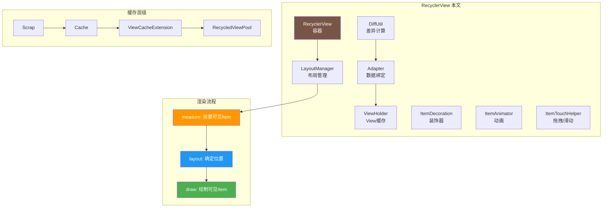

---

## 实战项目

**项目**：实现一个联系人列表 App

**要求**：
- 按字母分组显示（多类型：Header + Item）
- 支持长按拖拽排序
- 支持左滑删除（带确认对话框）
- 使用 DiffUtil 实现添加/删除动画
- 适配深色模式

**技术栈**：RecyclerView + DiffUtil + ItemTouchHelper + ViewBinding

---

## 代码审查清单

- [ ] Adapter 继承 `RecyclerView.Adapter` 或 `ListAdapter`
- [ ] ViewHolder 中复用所有 View 引用（`findViewById` 只调用一次）
- [ ] 点击监听在 ViewHolder 构造器中设置
- [ ] 判断 `adapterPosition != RecyclerView.NO_POSITION`
- [ ] 使用 DiffUtil 替代 `notifyDataSetChanged()`
- [ ] 多类型 Item 正确实现 `getItemViewType()`
- [ ] 固定大小列表调用 `setHasFixedSize(true)`
- [ ] 瀑布流设置 `gapStrategy`
- [ ] ItemDecoration 处理好 Item 间距和边距

---

## 术语表

| 术语 | 含义 |
|------|------|
| ViewHolder | 缓存 Item View 引用的容器，避免重复 findViewById |
| LayoutManager | 决定 Item 排列方式的管理器 |
| ItemDecoration | Item 之间的分割线、间距、边框等装饰 |
| ItemAnimator | Item 增删改时的过渡动画 |
| DiffUtil | 计算新旧列表差异的工具类 |
| RecycledViewPool | 按 viewType 分桶的 ViewHolder 缓存池 |
| Scrap | 屏幕内可见 ViewHolder 的临时存储 |
| GapWorker | RecyclerView 的预取调度器 |
| SpanSizeLookup | GridLayoutManager 中控制 Item 跨列数的查询器 |
| ItemTouchHelper | 拖拽排序和滑动操作的辅助类 |

---

## 🔬 四级缓存与布局回收底层深度解析

> 本节从源码层面深入剖析 RecyclerView 的缓存体系。理解四级缓存是掌握 RecyclerView 性能优化的关键——它决定了为什么 RecyclerView 能在万级数据量下保持丝滑滚动。

### 类比理解：图书馆找书

在深入源码前，先用一个生活类比建立直觉。RecyclerView 获取一个 ViewHolder 的过程，就像你在图书馆找一本书：

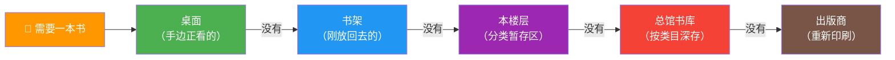

| 缓存层级 | 图书馆类比 | 特点 |
|---------|-----------|------|
| **Scrap**（mAttachedScrap） | 桌面上正摊开的书 | 当前正在用，临时搁置，随手取回 |
| **Cache**（mCachedViews） | 书架上刚放回去的书 | 近期用过，原封不动可再用 |
| **ViewCacheExtension** | 本楼层的分类暂存区 | 按需设置，灵活但少用 |
| **RecycledViewPool** | 总馆书库 | 按类目深存，取出后需重新"贴标签" |
| **createViewHolder()** | 找出版商重新印刷 | 最昂贵，最后兜底 |

**关键差异**：从 Scrap 和 Cache 取出的 ViewHolder **不需要重新绑定数据**（书还是原来的书，内容没变）；而从 RecycledViewPool 取出的 ViewHolder **必须重新调用 onBindViewHolder()**（书被别人借走过，要重新贴上你的标签）。

---

### 第一级缓存：Scrap（mAttachedScrap + mChangedScrap）

**术语解释**：
- **Scrap（废料/临时区）**：可以理解为"施工中的临时堆放区"。在 RecyclerView 重新布局（layout）时，会把当前所有可见的 ViewHolder 先临时"摘下"放到 Scrap 列表，等布局计算完成后再"挂回"正确的位置。它**不参与回收**，只在单次 layout 过程中存在。
- **mAttachedScrap**：存放"未发生变化"的 ViewHolder。这些 ViewHolder 在本次 layout 中位置可能调整，但数据内容不变，可以直接复用，**无需重新 bind**。
- **mChangedScrap**：存放"已发生变化"的 ViewHolder（被 `notifyItemChanged` 标记）。这些 ViewHolder 在 layout 前会被分离，layout 时需要重新绑定数据。

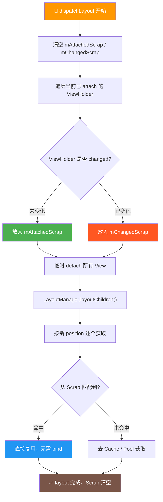

**核心要点**：
1. Scrap 是**布局过程中的临时缓存**，layout 结束即清空，生命周期极短。
2. 从 Scrap 取出的 ViewHolder **一定不需要重新 bind**，因为它就是刚刚还在屏幕上的那个。
3. `mChangedScrap` 的存在是为了支持**局部更新动画**：changed 的 ViewHolder 需要先记录旧状态（用于动画），再重新 bind 新数据。

**源码位置**：`RecyclerView.Reycler.scrapView()` 与 `RecyclerView.Reycler.getRecycledView()`

---

### 第二级缓存：Cache（mCachedViews）

**术语解释**：
- **mCachedViews**：可以理解为"近期归还区"。当你向上滑动列表，最底部刚滑出屏幕的几个 ViewHolder 不会立即进入回收池，而是先放在这里。如果你马上又向下滑回来，就能从这里**秒取**，连 `onBindViewHolder()` 都不用调用。默认容量为 **2**，采用 **FIFO（先进先出）** 策略——当缓存满时，最早进入的那个会被"挤"到下一级（RecycledViewPool）。

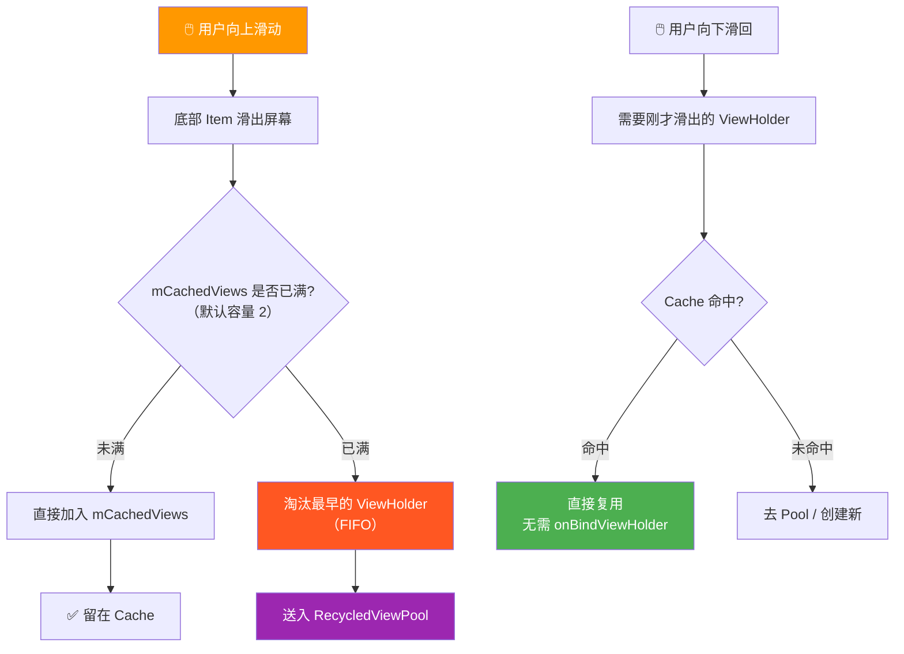

**调优方法**：
```kotlin
// 增大 Cache 容量（代价是内存占用增加）
recyclerView.setItemViewCacheSize(4) // 默认 2
```

**容量选择的权衡**：
| 设置 | 优点 | 缺点 |
|------|------|------|
| 默认 2 | 内存省，适合大多数场景 | 快速来回滑动时可能 miss |
| 调大到 4-6 | 来回滑动命中率更高 | 每个 ViewHolder 占用内存，可能被回收 |
| 调到 0 | 极致省内存 | 每次都要重新 bind，性能下降 |

---

### 第三级缓存：ViewCacheExtension

**术语解释**：
- **ViewCacheExtension**：可以理解为"自建分类暂存区"。这是 RecyclerView 留给开发者的一个扩展口——如果你对默认缓存策略不满意，可以自定义一层缓存。它返回的是 **View**（不是 ViewHolder），取出后仍需重新 bind。实际开发中**极少使用**，因为 RecycledViewPool 已经能满足绝大多数需求。

**典型应用场景**：
1. **跨页面类型预取**：比如你知道下一页会展示某种特殊卡片，可以提前缓存。
2. **按业务维度缓存**：比如电商首页的不同楼层，按业务线缓存 ViewHolder。
3. **内存敏感场景的二级缓存**：在 Cache 和 Pool 之间插入一层自定义淘汰策略。

```kotlin
// 自定义 ViewCacheExtension（高级用法，慎用）
recyclerView.setViewCacheExtension(object : RecyclerView.ViewCacheExtension() {
    override fun getViewForPosition(
        recyclerView: RecyclerView,
        position: Int,
        type: Int
    ): View? {
        // 返回自定义缓存的 View，没有则返回 null（继续走 Pool）
        return myCustomCache.get(type)
    }
})
```

> ⚠️ **注意**：ViewCacheExtension 返回的 View 会被包装成 ViewHolder 并**重新调用 onBindViewHolder()**，所以它并不会省去 bind 开销，只是省去了 `onCreateViewHolder()` 的 inflate 开销。

---

### 第四级缓存：RecycledViewPool

**术语解释**：
- **RecycledViewPool**：可以理解为"总馆书库"。这是最底层的缓存，按 **viewType 分桶存储**——就像图书馆按"小说""教材""杂志"分类上架。每个 viewType 默认桶容量为 **5**。从这里取出的 ViewHolder **必须重新调用 onBindViewHolder()** 绑定数据（因为书被别人借走过，要重新贴标签）。
- **跨 RecyclerView 共享**：多个 RecyclerView 可以共用同一个 Pool，这是 ViewPager2 场景下的关键优化。

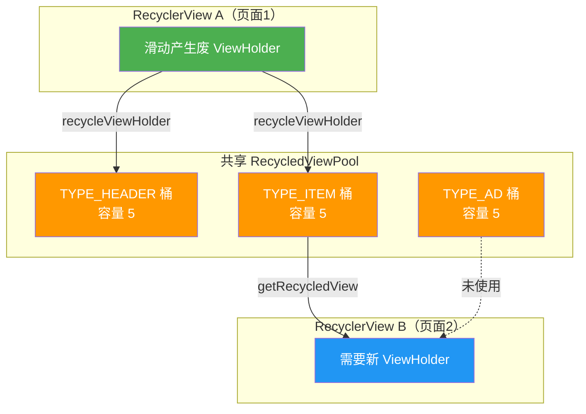

**共享 Pool 的实战代码**：
```kotlin
// ViewPager2 中多个页面共享 ViewHolder 池
val sharedPool = RecyclerView.RecycledViewPool().apply {
    // 针对高频类型调大桶容量
    setMaxRecycledViews(TYPE_ITEM, 20)
    setMaxRecycledViews(TYPE_HEADER, 4)
}

// 为每个页面的 RecyclerView 设置共享池
viewPager2.children.forEach { page ->
    (page as? RecyclerView)?.setRecycledViewPool(sharedPool)
}
```

**为什么共享 Pool 有效？**
- ViewPager2 中左右切换页面时，每个页面都有自己的 RecyclerView。
- 如果不共享，页面切换后每个 RecyclerView 都要重新 `onCreateViewHolder()`，造成卡顿。
- 共享后，页面 A 滑动产生的废 ViewHolder 可以直接被页面 B 复用，省去 inflate 开销。

---

### 完整的 ViewHolder 获取流程

以下是 `Recycler.getViewHolderForPosition()` 的完整决策流程，这是四级缓存体系的核心调度入口：

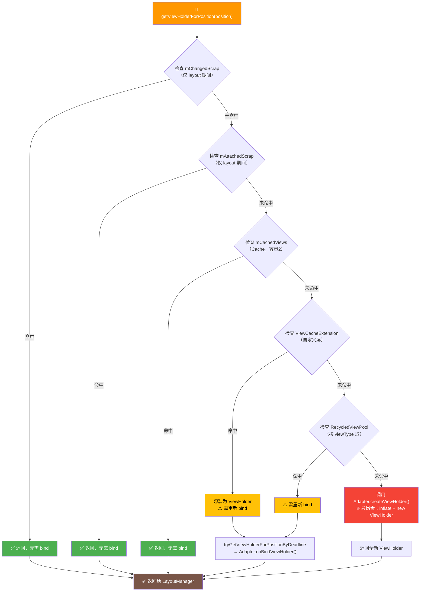

**命中率与性能的关系**：
| 命中层级 | bind 开销 | inflate 开销 | 性能 |
|---------|----------|-------------|------|
| Scrap | 无 | 无 | ⭐⭐⭐⭐⭐ 最优 |
| Cache | 无 | 无 | ⭐⭐⭐⭐⭐ 最优 |
| Extension | 有 | 无 | ⭐⭐⭐ 中等 |
| Pool | 有 | 无 | ⭐⭐⭐ 中等 |
| createViewHolder | 有 | **有** | ⭐ 最差 |

---

### LayoutManager 与缓存的协作

**术语解释**：
- **fill() 方法**：LayoutManager 的核心填充方法。滚动时，LayoutManager 通过 `fill()` 判断屏幕还有多少空白区域，循环调用 `next()` 获取 ViewHolder 填充，直到填满可见区域。
- **recycleByLayoutState()**：在填充新 ViewHolder 的同时，LayoutManager 会回收**已经滑出可见区域**的 ViewHolder，实现"一边回收一边获取"的滚动循环。

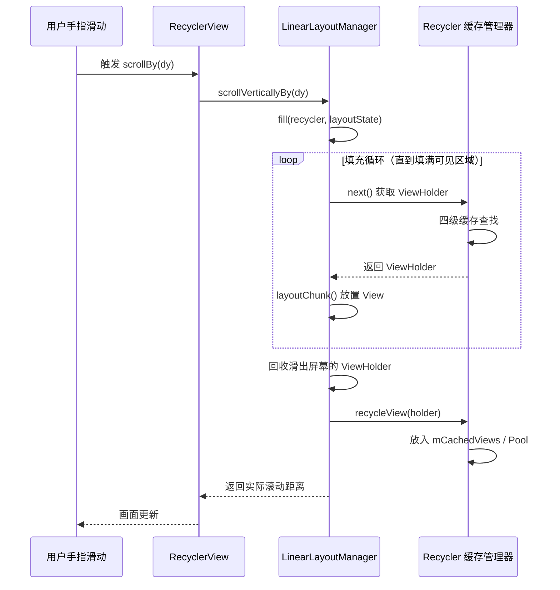

**LinearLayoutManager 的 fill() 核心逻辑（简化伪代码）**：
```kotlin
fun fill(recycler, state): Int {
    var remainingSpace = state.availableScrollSpace
    while (remainingSpace > 0 && hasMoreItems()) {
        // 1. 从缓存获取 ViewHolder（四级查找）
        val holder = recycler.getViewForPosition(currentPosition)
        // 2. 测量并布局
        measureChildWithMargins(holder.itemView)
        layoutChild(holder)
        // 3. 更新剩余空间
        remainingSpace -= holderHeight
        // 4. 回收对侧已滑出的 ViewHolder
        recycleViewsFromStartIfNeeded(recycler)
    }
    return consumedSpace
}
```

---

### 预取（Prefetch）机制

**术语解释**：
- **GapWorker**：RecyclerView 的预取调度器。它利用 Choreographer 的 `POST_FRAME` 回调，在主帧渲染完毕后的**空闲时间**（gap），提前创建并绑定即将进入屏幕的 ViewHolder。这样当用户真正滑到那个位置时，ViewHolder 已经准备好了，避免临时 bind 造成的卡顿。
- **预取的本质**：用"空闲算力"换"流畅体验"。把本该在滚动帧中执行的 `onBindViewHolder()` 提前到上一帧的尾巴上完成。

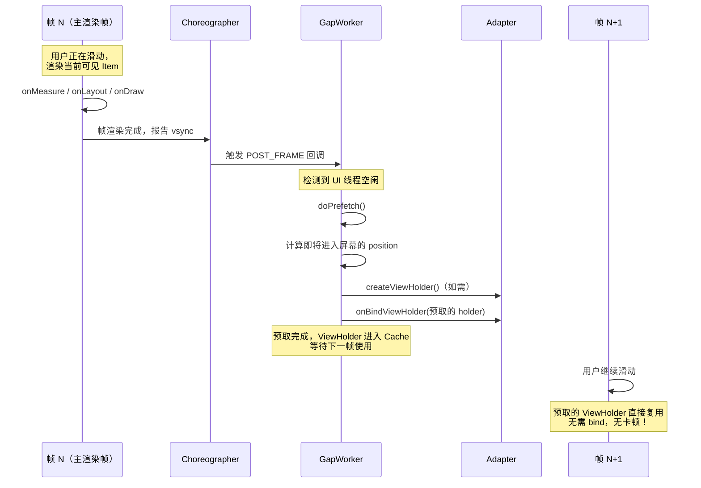

**预取的配置**：
```kotlin
recyclerView.layoutManager = LinearLayoutManager(this).apply {
    // 设置每个嵌套层级预取的 Item 数量（默认 2）
    initialPrefetchItemCount = 4
}

// 开启预取（API 21+ 默认开启）
recyclerView.setHasFixedSize(true) // 配合使用效果更佳
```

**预取生效的条件**：
1. 设备 API ≥ 21（Lollipop）
2. LayoutManager 的 `isItemPrefetchEnabled()` 返回 true（默认）
3. 当前有滚动趋势（GapWorker 会预测滚动方向）

---

### DiffUtil 的 Myers 差分算法

**术语解释**：
- **Myers 差分算法**：一种经典的文本/序列差异比较算法，时间复杂度 O(ND)（N 为序列长度，D 为差异大小）。差异越小计算越快。它通过寻找"最短编辑脚本（SES）"来将旧序列转换为新序列。
- **O(ND) 的含义**：当两个列表几乎相同（D 很小），算法极快；当两个列表差异巨大（D 接近 N），退化为 O(N²)。所以 DiffUtil 在"增量更新"场景下性能最佳。
- **dispatchUpdatesTo**：将计算出的差异操作（insert/remove/move/change）批量派发给 Adapter，触发精准的 `notifyItemXxx()` 而非 `notifyDataSetChanged()`。

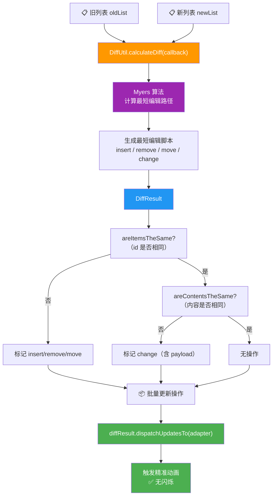

**Myers 算法的直观理解**：

想象你有两个字符串 `ABCABBA` 和 `CBABAC`，Myers 算法会在一个网格中寻找从左上到右下的**最短路径**：
- 向右走 = 删除（delete）
- 向下走 = 插入（insert）
- 对角线走 = 匹配（match，不产生操作）

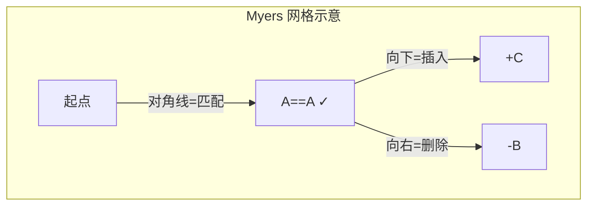

DiffUtil 将这个网格搜索应用到列表上，最终输出一个**最小操作序列**，然后通过 `BatchingListUpdateCallback` 合并相邻操作，减少 `notifyItemXxx` 调用次数。

**性能建议**：
- `areItemsTheSame` 应该用**唯一 id** 比较，而非 position
- `areContentsTheSame` 应该用 `data class` 的 `equals`，自动比较所有字段
- 大列表（>500项）的 diff 应放在**后台线程**：
```kotlin
// AsyncListDiffer 自动异步 diff
val differ = AsyncListDiffer(adapter, diffCallback)
differ.submitList(newList) // 内部用 Executor 异步计算
```

---

### Stable IDs 对缓存的影响

**术语解释**：
- **Stable IDs（稳定 ID）**：默认情况下，RecyclerView 用 **position** 作为 ViewHolder 的身份标识。开启 `setHasStableIds(true)` 后，改用 `getItemId()` 返回的 **itemId** 作为身份标识。这影响缓存匹配逻辑——开启后，即使 position 变化，只要 itemId 相同，就能从缓存中正确取回对应的 ViewHolder。
- **为什么影响缓存**：Cache 层默认用 position 匹配，如果列表发生增删导致 position 错位，Cache 可能取错。开启 Stable IDs 后，Cache 改用 itemId 匹配，保证"同一个数据项始终对应同一个 ViewHolder"。

```kotlin
class StableAdapter : RecyclerView.Adapter<VH>() {
    init {
        setHasStableIds(true) // 必须在构造后、setAdapter 前调用
    }

    override fun getItemId(position: Int): Long {
        return data[position].id.toLong() // 返回数据的唯一 ID
    }
}
```

**Stable IDs 对动画的影响**：
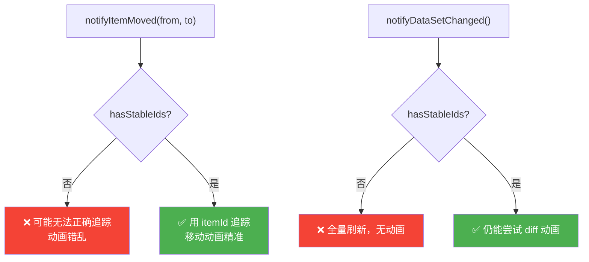

**注意事项**：
1. `getItemId()` 必须返回**真正唯一且稳定**的 ID，不能用 position
2. 开启后 `notifyDataSetChanged()` 仍可工作，但会失去精准动画
3. 瀑布流场景强烈推荐开启，避免因 position 错乱导致的高度跳变

---

## 📐 设计理念与架构图

> 本节从软件设计角度剖析 RecyclerView 为什么这样设计，理解其"关注点分离"的架构哲学，有助于在面试中回答"为什么 RecyclerView 比 ListView 好"的深层问题。

### 关注点分离：四个正交维度

**术语解释**：
- **关注点分离（Separation of Concerns, SoC）**：一种设计原则，将系统拆分为多个互不干扰的部分，每个部分只负责一个"关注点"。就像分工明确的工厂流水线——有人负责上料、有人负责组装、有人负责质检，各司其职，互不越界。
- **正交（Orthogonal）**：两个维度互相独立，改变一个不影响另一个。比如换 LayoutManager 不需要改 Adapter，加 ItemDecoration 不影响布局逻辑。

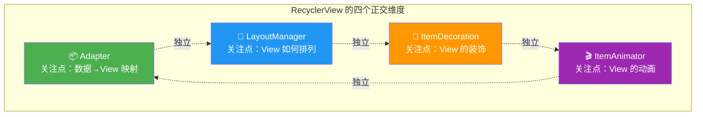

| 维度 | 职责 | 可独立替换？ | 典型实现 |
|------|------|-------------|---------|
| **Adapter** | 数据与 View 的绑定 | 是 | 自定义 Adapter / ListAdapter |
| **LayoutManager** | View 的测量与排列 | 是 | Linear / Grid / Staggered |
| **ItemDecoration** | 分割线、间距、边框 | 是 | DividerItemDecoration |
| **ItemAnimator** | 增删改动画 | 是 | DefaultItemAnimator |

**正交性的实际意义**：
```kotlin
// 四个维度可以任意组合，互不干扰
recyclerView.apply {
    adapter = MyAdapter(data)              // 维度1：数据
    layoutManager = GridLayoutManager(     // 维度2：布局
        this, 2
    )
    addItemDecoration(                     // 维度3：装饰
        SpaceItemDecoration(16.dp)
    )
    itemAnimator = CustomAnimator()         // 维度4：动画
}
// 改 LayoutManager 不用动 Adapter，加 Decoration 不影响动画
```

---

### RecyclerView 组件体系类图

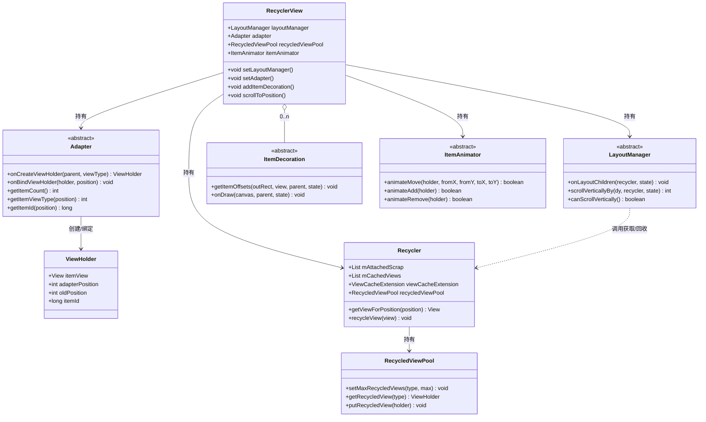

---

### RecyclerView vs ListView 设计差异

**术语解释**：
- **单体设计（Monolithic）**：ListView 把布局、数据绑定、回收逻辑全部揉在一个类里，像一个"什么都管的包工头"。要改布局方式得继承重写，要改回收策略也得重写。
- **解耦设计（Decoupled）**：RecyclerView 把职责拆分到多个独立类中，通过组合（而非继承）来扩展。像搭积木——想要什么功能就插什么模块。

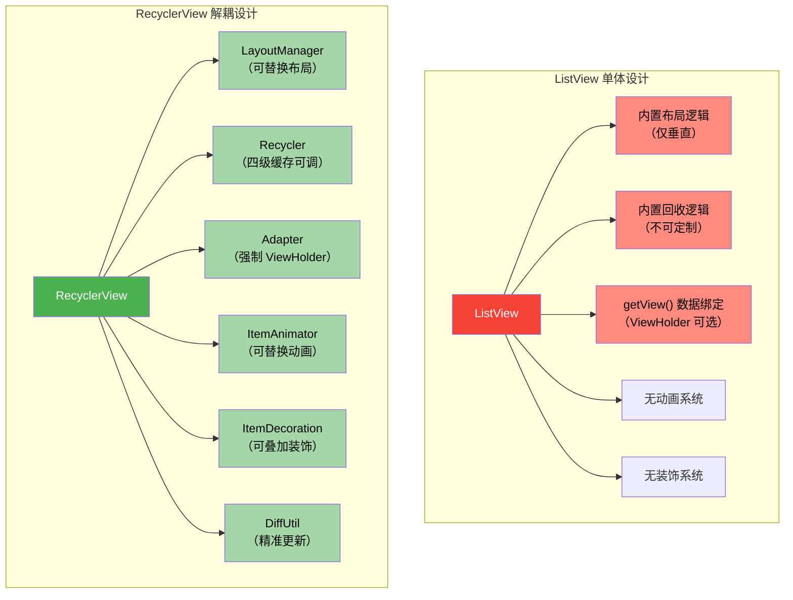

**设计差异对比表**：
| 维度 | ListView | RecyclerView |
|------|----------|--------------|
| 扩展方式 | 继承重写 | 组合替换 |
| ViewHolder | 可选（推荐但不强制） | **强制** |
| 布局类型 | 仅垂直列表 | 线性/网格/瀑布流/自定义 |
| 回收缓存 | 单级（RecyclerListener） | 四级缓存 |
| 动画 | 无内置 | DefaultItemAnimator |
| 装饰 | 仅 divider 属性 | ItemDecoration 叠加 |
| 数据更新 | notifyDataSetChanged | DiffUtil 精准更新 |
| 点击事件 | setOnItemClickListener | 委托给 ViewHolder |

---

### ViewHolder 模式的设计哲学

**术语解释**：
- **ViewHolder 模式**：一种缓存 View 引用的设计模式。核心思想——`findViewById()` 会遍历 View 树查找子 View，性能开销大。ViewHolder 在创建时就把所有子 View 的引用缓存起来，后续绑定数据时直接用引用，**只 find 一次，复用无数次**。

```mermaid
graph LR
    subgraph "ListView 的 findViewById 痛点"
        direction TB
        LV1["每次 getView()"] --> LV2["调用 findViewById()"]
        LV2 --> LV3["遍历 View 树"]
        LV3 --> LV4["找到子 View"]
        LV4 --> LV5["绑定数据"]
        LV5 --> LV6["⚠️ 滚动时反复遍历"]

        style LV3 fill:#F44336,color:#fff
        style LV6 fill:#FF5722,color:#fff
    end

    subgraph "RecyclerView 的 ViewHolder 方案"
        direction TB
        RV1["onCreateViewHolder()<br/>（仅创建时执行一次）"] --> RV2["findViewById() 缓存引用"]
        RV2 --> RV3["存入 ViewHolder 字段"]
        RV3 --> RV4["onBindViewHolder()"]
        RV4 --> RV5["直接用缓存引用"]
        RV5 --> RV6["✅ 无需再次遍历"]

        style RV2 fill:#4CAF50,color:#fff
        style RV5 fill:#2196F3,color:#fff
        style RV6 fill:#4CAF50,color:#fff
    end
```

**为什么 RecyclerView 强制 ViewHolder？**

ListView 中 ViewHolder 是"可选的"——开发者可以写也可以不写，结果很多人不写，导致列表卡顿。RecyclerView 通过**类型系统**强制：
```kotlin
// RecyclerView.Adapter 是泛型类，泛型参数必须是 ViewHolder
abstract class Adapter<VH : ViewHolder>
// onCreateViewHolder 必须返回 VH，逼你创建 ViewHolder
abstract fun onCreateViewHolder(parent: ViewGroup, viewType: Int): VH
```

**设计哲学总结**：
> **"让正确的做法成为唯一的做法"** —— 通过类型系统强制 ViewHolder，消除"忘记优化"的可能性。这是 API 设计中"poka-yoke（防呆）"思想的体现。

---

### LayoutManager 的策略模式

**术语解释**：
- **策略模式（Strategy Pattern）**：定义一系列算法，封装每一个，使它们可互换。LayoutManager 就是策略模式的体现——同样的数据，换一个 LayoutManager 实例，列表排列方式完全不同，但 Adapter 和数据源完全不用改。

```mermaid
classDiagram
    class LayoutManager {
        <<interface>>
        +onLayoutChildren(recycler, state)
        +scrollVerticallyBy(dy, recycler, state)
    }

    class LinearLayoutManager {
        +orientation: int
        +stackFromEnd: boolean
        +onLayoutChildren()
    }

    class GridLayoutManager {
        +spanCount: int
        +spanSizeLookup: SpanSizeLookup
        +onLayoutChildren()
    }

    class StaggeredGridLayoutManager {
        +spanCount: int
        +gapStrategy: int
        +onLayoutChildren()
    }

    class CustomLayoutManager {
        +onLayoutChildren()
        +自定义布局算法
    }

    LayoutManager <|.. LinearLayoutManager
    LayoutManager <|.. GridLayoutManager
    LayoutManager <|.. StaggeredGridLayoutManager
    LayoutManager <|.. CustomLayoutManager
```

**切换策略的代码**：
```kotlin
// 同一份数据，一行代码切换布局策略
val adapter = MyAdapter(data)

// 策略1：线性列表
recyclerView.layoutManager = LinearLayoutManager(context)
recyclerView.adapter = adapter

// 策略2：网格（数据、Adapter 全部不变）
recyclerView.layoutManager = GridLayoutManager(context, 3)

// 策略3：瀑布流
recyclerView.layoutManager = StaggeredGridLayoutManager(2, VERTICAL)

// 策略4：自定义（如环形布局）
recyclerView.layoutManager = CircleLayoutManager(context)
```

**策略模式的优势**：
- **开闭原则**：新增布局类型无需修改 Adapter 或数据
- **单一职责**：每种 LayoutManager 只管自己的布局算法
- **运行时切换**：可在运行时动态切换布局策略

---

### RecyclerView 与 Compose LazyColumn 的设计传承

**术语解释**：
- **声明式 UI**：开发者只需描述"界面应该长什么样"（what），而非"怎么构建界面"（how）。Compose 的 LazyColumn 用 `items()` 声明列表项，底层自动处理组合、复用、回收。
- **按需组合**：Compose 的 LazyColumn 底层仍然只组合可见区域的 Item，滑出屏幕的 Composable 会被丢弃，滑入时重新组合——这与 RecyclerView 的回收复用理念一脉相承。

```mermaid
graph TD
    subgraph "RecyclerView（命令式）"
        RA["Adapter.onCreateViewHolder<br/>（inflate XML）"]
        RB["Adapter.onBindViewHolder<br/>（手动绑定数据）"]
        RC["ViewHolder 复用<br/>（四级缓存）"]
        RA --> RB --> RC
    end

    subgraph "Compose LazyColumn（声明式）"
        CA["LazyListScope.items()<br/>（声明列表项）"]
        CB["Composable 自动组合<br/>（编译器处理）"]
        CC["按需重组<br/>（滑动时回收/重组）"]
        CA --> CB --> CC
    end

    RA -.->|理念传承| CA
    RB -.->|理念传承| CB
    RC -.->|理念传承| CC

    style RA fill:#FF9800,color:#fff
    style CA fill:#3F51B5,color:#fff
    style CC fill:#3F51B5,color:#fff
```

**代码对比**：
```kotlin
// RecyclerView：命令式，需手动管理
class MyAdapter : RecyclerView.Adapter<VH>() {
    override fun onCreateViewHolder(parent: ViewGroup, type: Int): VH {
        val view = inflate(R.layout.item, parent) // 手动 inflate
        return VH(view)
    }
    override fun onBindViewHolder(holder: VH, pos: Int) {
        holder.bind(data[pos]) // 手动绑定
    }
}

// Compose LazyColumn：声明式，自动管理
LazyColumn {
    items(data) { item ->        // 声明即可
        ItemRow(item)            // Composable 自动组合/复用
    }
}
```

**传承关系**：
| 概念 | RecyclerView | Compose LazyColumn |
|------|-------------|-------------------|
| 布局策略 | LayoutManager | LazyListLayoutInfo |
| 复用单位 | ViewHolder | Composable 子树 |
| 数据更新 | DiffUtil | 自动 diff（key） |
| 回收 | RecycledViewPool | 子树丢弃 |
| 预取 | GapWorker | LazyListPrefetchState |

---

### Payload 局部更新的设计

**术语解释**：
- **Payload（负载/局部数据）**：`notifyItemChanged(position, payload)` 中的 payload 参数，用于标记"只更新了哪一部分"。传统的 `notifyItemChanged(position)` 会触发完整的 `onBindViewHolder(holder, position)`，整行重新绑定。而带 payload 的更新只触发 `onBindViewHolder(holder, position, payloads)`，开发者可以只更新变化的子 View，**避免整行重绘和闪烁**。

```mermaid
graph TD
    A["数据变化"] --> B{"调用方式?"}

    B -->|"notifyItemChanged(pos)"| C["完整更新"]
    C --> C1["onBindViewHolder(holder, pos)"]
    C1 --> C2["整行重新绑定所有字段"]
    C2 --> C3["⚠️ 可能闪烁<br/>（如图片重新加载）"]

    B -->|"notifyItemChanged(pos, payload)"| D["局部更新"]
    D --> D1["onBindViewHolder(holder, pos, payloads)"]
    D1 --> D2["只更新变化的子 View"]
    D2 --> D3["✅ 无闪烁<br/>未变化的 View 不动"]

    style C3 fill:#F44336,color:#fff
    style D3 fill:#4CAF50,color:#fff
    style C fill:#FF9800,color:#fff
    style D fill:#2196F3,color:#fff
```

**Payload 的完整实现**：
```kotlin
class UserAdapter : RecyclerView.Adapter<VH>() {

    companion object {
        const val PAYLOAD_NAME = "name"      // 只更新名字
        const val PAYLOAD_AVATAR = "avatar"  // 只更新头像
    }

    // 局部更新入口（带 payloads 的重载）
    override fun onBindViewHolder(
        holder: VH,
        position: Int,
        payloads: MutableList<Any>
    ) {
        if (payloads.isEmpty()) {
            // 无 payload，走完整绑定
            onBindViewHolder(holder, position)
            return
        }
        // 有 payload，只更新对应部分
        payloads.forEach { payload ->
            when (payload) {
                PAYLOAD_NAME -> {
                    holder.tvName.text = data[position].name
                    // 不碰头像，避免闪烁
                }
                PAYLOAD_AVATAR -> {
                    holder.ivAvatar.setImageResource(data[position].avatar)
                    // 不碰名字
                }
            }
        }
    }

    // 调用时传入 payload
    fun updateUserName(position: Int, newName: String) {
        data[position].name = newName
        notifyItemChanged(position, PAYLOAD_NAME) // 只标记 name 变化
    }
}
```

**Payload 与 DiffUtil 的配合**：
```kotlin
override fun getChangePayload(oldPos: Int, newPos: Int): Any? {
    val old = oldList[oldPos]
    val new = newList[newPos]
    // 返回变化字段的集合，传递给 onBindViewHolder
    return when {
        old.name != new.name -> PAYLOAD_NAME
        old.avatar != new.avatar -> PAYLOAD_AVATAR
        else -> null // 返回 null 则走完整更新
    }
}
```

**设计哲学**：
> Payload 机制体现了**最小化更新**的设计思想——只更新真正变化的部分，而非整行重新绑定。这与 DiffUtil 的"最小操作序列"理念一脉相承，是性能优化的最后一公里。

---

## 📝 跨章节综合考核训练

> 以下 8 道考核题串联 RecyclerView 与其他章节的知识点，检验综合理解能力。每道题都关联至少 2 个章节，建议先独立思考再查看参考答案要点。

### 考核题 1：RecyclerView 缓存复用 vs FrameLayout 全量渲染的内存差异

**涉及章节**：06-RecyclerView + 03-FrameLayout
**题目**：
假设你有一个包含 1000 条数据列表的需求。方案 A 使用 FrameLayout 在 ScrollView 中堆叠 1000 个 ItemView；方案 B 使用 RecyclerView。请从内存占用、View 对象数量、绘制流程三个维度分析两者的差异。如果数据增加到 10000 条，方案 A 会出现什么问题？方案 B 为什么不会？

**参考答案要点**：
- **View 对象数量**：FrameLayout 方案会一次性创建 1000 个 ItemView（含子 View），RecyclerView 只创建屏幕可见的约 8-10 个 ViewHolder，其余通过四级缓存复用
- **内存占用**：FrameLayout 方案内存随数据量线性增长（O(N)），RecyclerView 内存恒定（O(1)），只与屏幕可见数量相关
- **绘制流程**：FrameLayout 的 measure/layout/draw 会遍历全部 1000 个子 View，而 RecyclerView 的 `dispatchDraw` 只绘制可见区域 + 预取区域
- **10000 条场景**：方案 A 会因 View 对象过多导致 OOM（每个 View 对象约 1-2KB，加上子 View 可能达数十 MB），且首次 inflate 耗时极长；方案 B 因只创建可见 ViewHolder，内存几乎不变
- **核心差异**：FrameLayout 是"全量实例化"，RecyclerView 是"按需实例化 + 回收复用"，这是回收机制的根本价值

---

### 考核题 2：RecyclerView 与 ScrollView 的滚动机制对比

**涉及章节**：06-RecyclerView + 05-ScrollView
**题目**：
ScrollView 和 RecyclerView 都能实现滚动，但底层机制完全不同。请从滚动事件分发、内容测量方式、子 View 生命周期三个角度对比两者的差异。为什么"NestedScrollView 嵌套 RecyclerView 且 RecyclerView 高度为 match_parent"会导致回收机制失效？

**参考答案要点**：
- **滚动事件分发**：ScrollView 通过 `onScrollChanged` 直接偏移内容；RecyclerView 通过 LayoutManager 的 `scrollVerticallyBy()` 计算滚动距离，同时触发回收旧 ViewHolder 和获取新 ViewHolder
- **内容测量**：ScrollView 测量所有子 View（`measureChildWithMargins` 遍历全部），高度为所有子 View 之和；RecyclerView 只测量可见 + 预取区域的 ViewHolder
- **子 View 生命周期**：ScrollView 的子 View 创建后常驻，永不回收；RecyclerView 的 ViewHolder 滑出屏幕即回收到缓存池
- **match_parent 失效原因**：NestedScrollView 会给 RecyclerView 传入 `UNSPECIFIED` 测量模式，RecyclerView 会测量所有 Item（失去按需渲染），变成"ScrollView + 全量渲染"
- **解决方案**：用 `NestedScrollView.wrapContentHeight` 或改用 `CoordinatorLayout + AppBarLayout + RecyclerView`，或给 RecyclerView 设置固定高度

---

### 考核题 3：RecyclerView 的 ViewHolder 复用与 draw 性能的关联

**涉及章节**：06-RecyclerView + 00-概述
**题目**：
在"00-布局系统概述"中学习了 View 的三大绘制流程（measure/layout/draw）。RecyclerView 的 ViewHolder 复用机制是如何优化这三个流程的？请分别说明每个流程中 ViewHolder 复用带来的优化点。为什么 ViewHolder 复用对 draw 阶段的优化最显著？

**参考答案要点**：
- **measure 优化**：复用 ViewHolder 时，如果 ItemView 宽高不变（固定尺寸），可跳过 measure（`setHasFixedSize(true)` 提示 LayoutManager 无需重新测量）
- **layout 优化**：复用的 ViewHolder 已有 LayoutParams，layout 阶段直接复用，避免重新计算位置
- **draw 优化最显著**：draw 是最耗时的流程（涉及 Canvas 绘制、硬件加速）。复用 ViewHolder 意味着 draw 只针对可见的 ~10 个 View，而非全部 1000 个。Canvas 绘制次数从 O(N) 降到 O(可见数)
- **findViewById 优化**：ViewHolder 在创建时缓存子 View 引用，避免 draw 前的数据绑定阶段反复遍历 View 树
- **核心关联**：00 章的"绘制流水线"是单次渲染的开销，06 章的 ViewHolder 复用是通过"减少参与绘制的 View 数量"来降低总开销

---

### 考核题 4：RecyclerView 嵌套在 ConstraintLayout 中的性能考量

**涉及章节**：06-RecyclerView + 04-ConstraintLayout
**题目**：
你需要在 ConstraintLayout 中放置一个 RecyclerView，且 RecyclerView 上方有一个固定高度的 Header，下方有一个固定高度的 Footer，RecyclerView 占据中间剩余空间。请分析这种布局对 RecyclerView 性能的影响，并说明 `wrap_content` vs `match_constraint(0dp)` 对 RecyclerView 回收机制的不同影响。

**参考答案要点**：
- **match_constraint (0dp)**：ConstraintLayout 会先测量 Header/Footer，再把剩余空间分配给 RecyclerView，RecyclerView 高度确定，能正常按需渲染和回收
- **wrap_content**：ConstraintLayout 会让 RecyclerView 先测量自身内容，RecyclerView 会尝试测量所有 Item（类似 NestedScrollView 的问题），导致回收机制失效
- **性能建议**：RecyclerView 在 ConstraintLayout 中应使用 `layout_height="0dp"` + 约束，确保高度由父布局决定
- **Barrier/Group 配合**：如果 Header/Footer 高度动态变化，可用 Barrier 约束 RecyclerView 顶部，确保布局正确
- **嵌套测量层级**：ConstraintLayout 减少了嵌套层级（无需 LinearLayout 嵌套），降低了 measure 递归深度，间接提升 RecyclerView 的首次渲染速度

---

### 考核题 5：RecyclerView 的布局优化与优化技巧的关系

**涉及章节**：06-RecyclerView + 07-优化技巧
**题目**：
"07-布局优化技巧"章节介绍了多种优化手段。请列举至少 4 个与 RecyclerView 直接相关的优化技巧，并说明每个技巧对应优化了四级缓存体系中的哪个环节。如果面试官问"RecyclerView 的性能优化你做过哪些"，你会如何组织回答？

**参考答案要点**：
- **setHasFixedSize(true)**：提示 LayoutManager 内容不改变 RecyclerView 大小，跳过 requestLayout，优化 layout 阶段
- **setItemViewCacheSize()**：调整 Cache 层容量，增大可提高来回滑动命中率，但增加内存
- **共享 RecycledViewPool**：优化 Pool 层，跨 RecyclerView 共享，减少 ViewPager2 场景下的 onCreateViewHolder 调用
- **DiffUtil + payload**：优化数据更新环节，避免全量 notifyDataSetChanged，精准更新+局部绑定
- **预取 initialPrefetchItemCount**：利用 GapWorker 在空闲帧预取，减少滚动帧的 bind 开销
- **避免 onCreateViewHolder 耗时**：inflate 是最昂贵操作，可使用 AsyncLayoutInflater 或 ViewStub 延迟加载
- **组织回答思路**：从"缓存复用→数据更新→布局测量→预取"四个维度系统回答

---

### 考核题 6：RecyclerView 多分辨率适配与 GridAutoSpan 计算

**涉及章节**：06-RecyclerView + 08-屏幕适配
**题目**：
你需要实现一个商品网格列表，要求每个商品卡片宽度固定为 160dp，列表自动计算列数。请写出根据屏幕宽度动态计算 spanCount 的代码，并分析在不同屏幕密度（mdpi/hdpi/xhdpi）下，spanCount 的计算结果是否一致。为什么应该用 dp 而非 px 进行计算？

**参考答案要点**：
```kotlin
// 动态计算列数
val displayWidth = resources.displayMetrics.widthPixels
val itemWidthDp = 160
val itemWidthPx = (itemWidthDp * resources.displayMetrics.density).toInt()
val spanCount = max(1, displayWidth / itemWidthPx)
recyclerView.layoutManager = GridLayoutManager(this, spanCount)
```
- **不同密度一致性**：用 dp 计算后，mdpi(1x)、hdpi(1.5x)、xhdpi(2x) 下 spanCount 相同，因为 dp 转 px 后的比例一致
- **为什么用 dp**：dp 是密度无关像素，`dp * density = px`，保证不同屏幕密度下视觉宽度一致
- **为什么不用 px**：px 是物理像素，同样 1080px 在不同密度设备上物理尺寸不同，导致列数不一致
- **极端情况**：小屏幕设备 spanCount 可能为 1（变成线性列表），大屏幕可能 4-5 列，这是自适应的合理行为
- **配合 08 章的屏幕适配方案**：可用 smallestWidth 限定符预定义 spanCount，或运行时动态计算

---

### 考核题 7：RecyclerView vs Compose LazyColumn 的缓存机制对比

**涉及章节**：06-RecyclerView + 09-Compose
**题目**：
Compose 的 LazyColumn 在设计上传承了 RecyclerView 的按需渲染理念，但缓存机制完全不同。请对比 RecyclerView 的四级缓存与 Compose LazyColumn 的子树复用机制，从缓存层级、复用单位、数据更新三个维度分析异同。为什么 Compose 不需要"四级缓存"？

**参考答案要点**：
- **缓存层级**：RecyclerView 有四级缓存（Scrap/Cache/Extension/Pool），Compose LazyColumn 只有"可见区+预取区"的子树池，没有多级缓存
- **复用单位**：RecyclerView 复用 ViewHolder（View + 子 View 引用），Compose 复用 Composable 子树（重组而非复用 View 对象）
- **数据更新**：RecyclerView 需 DiffUtil + notifyItemXxx，Compose 用 `key()` 标记项身份，自动 diff 重组
- **为什么 Compose 不需要四级缓存**：Compose 的 Composable 是轻量函数调用，无 View 对象开销，"丢弃+重组"的成本远低于 View 的"创建+inflate"，不需要复杂的多级缓存来避免重组
- **本质差异**：RecyclerView 是"View 对象复用"（对象昂贵，需多级缓存），Compose 是"状态驱动重组"（组合廉价，丢弃即可）

---

### 考核题 8：RecyclerView 的 ViewHolder 模式在 Compose 中的消亡

**涉及章节**：06-RecyclerView + 09-Compose
**题目**：
RecyclerView 强制使用 ViewHolder 模式来缓存 `findViewById` 的结果。但在 Compose 中，完全没有 ViewHolder 的概念。请分析为什么 ViewHolder 模式在 Compose 中"消亡"了，从 View 树结构、状态管理、编译器优化三个角度解释。这是否意味着 Compose 的性能不如 RecyclerView？

**参考答案要点**：
- **View 树结构差异**：传统 View 系统中 `findViewById()` 需遍历 View 树（O(n)），ViewHolder 缓存引用避免重复查找；Compose 用 Positional Memoization（位置记忆化），编译器自动追踪 Composable 的子节点，无需手动查找
- **状态管理差异**：Compose 的 `remember` 和 `mutableStateOf` 自动管理状态，数据变化自动触发重组，不需要"先 find 再 set"的模式
- **编译器优化**：Compose 编译器插件将 Composable 转换为 `Composer` 调用图，自动处理子树复用和跳过（skipping），相当于"编译器自动生成了 ViewHolder"
- **性能对比**：Compose 的 LazyColumn 在首次组合时可能比 RecyclerView 的首次 inflate 略慢（需执行组合），但滚动时的子树重组得益于编译器优化，性能与 RecyclerView 持平甚至更优
- **设计哲学转变**：ViewHolder 是命令式时代的"手动优化"产物，Compose 用声明式 + 编译器自动化消除了手动优化的必要，这是抽象层次的提升

---

## 参考文献与延伸阅读

### 官方文档与源码
1. **[Android 官方文档 - RecyclerView 指南](https://developer.android.com/develop/ui/views/layout/recyclerview)**
   - Google 官方 RecyclerView 文档，涵盖创建列表、管理适配器、自定义布局和动画。
2. **[AOSP 源码 - RecyclerView.java (AndroidX)](https://cs.android.com/androidx/platform/frameworks/support/+/main:recyclerview/recyclerview/src/main/java/androidx/recyclerview/widget/RecyclerView.java)**
   - RecyclerView 的 AndroidX 源码，包含 Recycler 内部类、四级缓存及 GapWorker 预取的完整实现。

### 四级缓存机制
3. **[Android 从源码分析 RecyclerView 四级缓存复用机制 - CSDN](https://blog.csdn.net/xxwn200301/article/details/137563608)**
   - 从源码角度详细分析 mAttachedScrap、mCachedViews、mViewCacheExtension、RecycledViewPool 四级缓存的工作原理。
4. **[深度探秘 Android RecyclerView 缓存机制的底层原理 - 51CTO](https://blog.51cto.com/u_12472724/14150193)**
   - 全面解析四级缓存的功能定位、命中条件和淘汰策略，包含流程图和源码引用。

### DiffUtil 与差分算法
5. **[Myers 差分算法 —— Android DiffUtil 之实现 - 腾讯云](https://cloud.tencent.com/developer/article/1488585)**
   - 详解 Eugene W. Myers 1986 年发表的 O(ND) 差分算法，以及 Android DiffUtil 的具体实现。
6. **[Eugene W. Myers 原始论文：An O(ND) Difference Algorithm and Its Variations (1986)](https://www.cs.arizona.edu/~gene/PAPERS/diff.pdf)**
   - Myers 差分算法的原始论文，发表于 Algorithmica 期刊，是 Git diff 和 Android DiffUtil 的理论基础。
