# 布局优化技巧完全指南

> **学习目标**：掌握 Android 布局层级优化、渲染性能提升、内存占用降低的实战技巧
> **前置知识**：XML 布局基础、ConstraintLayout 基础、ViewBinding 使用
> **难度分级**：⭐⭐ 进阶
> **时间预估**：45 分钟

---

## 1. 一句话定义

布局优化是通过**减少 View 层级、避免过度绘制、延迟加载不可见 View**等手段，提升界面渲染速度和内存效率的系统化方法。

---

## 2. 为什么需要

### 性能问题根源

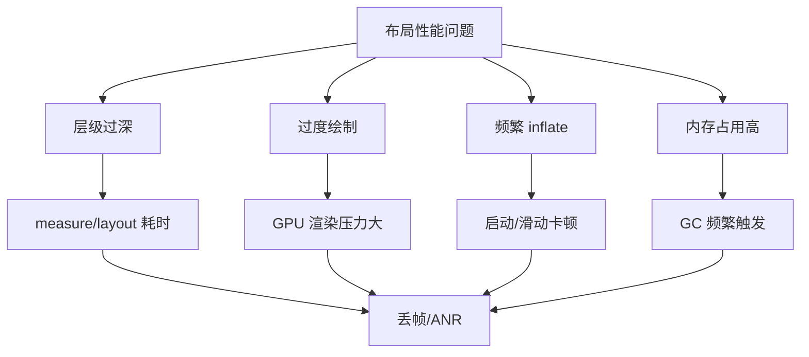

### 核心指标

| 指标 | 目标值 | 工具 |
|------|--------|------|
| 帧率 | ≥55 FPS | GPU Profiling |
| 层级深度 | ≤10 层 | Layout Inspector |
| 过度绘制 | ≤1x | 开发者选项 |
| inflate 时间 | ≤5ms | Systrace |
| 内存泄漏 | 0 | LeakCanary |

---

## 3. 核心概念

### 优化工具矩阵

| 工具 | 用途 | 优先级 |
|------|------|--------|
| `<include>` | 布局复用 | ⭐⭐⭐ |
| `<merge>` | 减少层级 | ⭐⭐⭐ |
| `<ViewStub>` | 延迟加载 | ⭐⭐⭐ |
| ConstraintLayout | 扁平化层级 | ⭐⭐⭐ |
| ViewBinding | 替代 findViewById | ⭐⭐ |
| RecyclerView | 高效长列表 | ⭐⭐⭐ |
| 移除多余背景 | 减少过度绘制 | ⭐⭐ |

**术语解释：**
- **`<include>` 标签**：在 XML 中复用其他布局文件。就像编程中的"函数调用"——把公共的工具栏布局写在一个文件里，多个页面通过 include 引入，避免重复代码。
- **`<merge>` 标签**：减少布局层级。它本身不创建 View，子 View 直接添加到父 ViewGroup 中。就像消除一层"多余的包裹"——比如你把礼物放进盒子，盒子外面又套了一个盒子，merge 就是去掉外面那个多余的盒子。
- **`<ViewStub>`**：轻量级占位符，按需加载布局。它本身不渲染任何内容，只在调用 `inflate()` 时才加载真正的布局。就像快递柜——柜子一直在那里，但里面的包裹只有你去取时才会出现。
- **ViewBinding**：编译期生成的类型安全 View 访问方式。替代 `findViewById()`，编译时检查 ID 是否存在，避免运行时崩溃。
- **过度绘制（Overdraw）**：同一像素在同一帧被绘制多次。比如背景画了一次，父容器背景又画了一次，子 View 背景再画一次——同一个像素被画了 3 次，GPU 负担加重。

### 布局优化流程

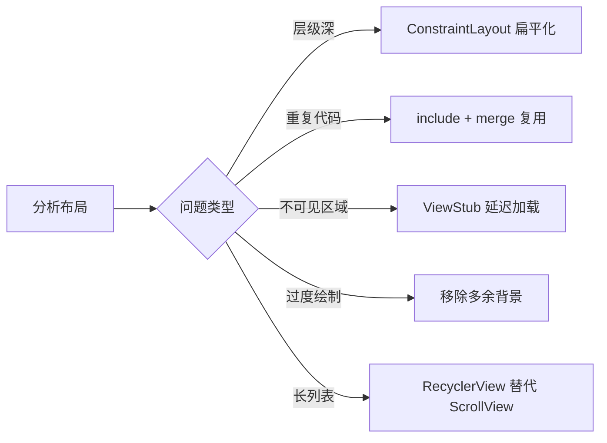

---

## 4. 基础用法

### 4.1 include 标签：复用布局

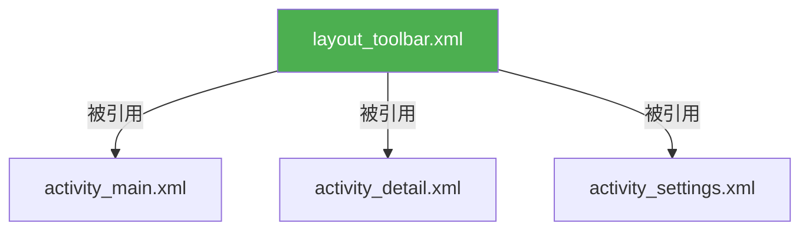

```xml
<!-- layout_toolbar.xml -->
<?xml version="1.0" encoding="utf-8"?>
<androidx.constraintlayout.widget.ConstraintLayout
    xmlns:android="http://schemas.android.com/apk/res/android"
    android:layout_width="match_parent"
    android:layout_height="56dp"
    android:background="@color/primary">

    <ImageView
        android:id="@+id/ivBack"
        android:layout_width="48dp"
        android:layout_height="48dp"
        android:src="@drawable/ic_back"
        app:layout_constraintStart_toStartOf="parent"
        app:layout_constraintTop_toTopOf="parent" />

    <TextView
        android:id="@+id/tvTitle"
        android:layout_width="wrap_content"
        android:layout_height="wrap_content"
        android:textSize="18sp"
        android:textColor="@color/white"
        app:layout_constraintStart_toEndOf="@id/ivBack"
        app:layout_constraintTop_toTopOf="parent"
        app:layout_constraintBottom_toBottomOf="parent" />
</androidx.constraintlayout.widget.ConstraintLayout>
```

```xml
<!-- activity_main.xml：复用工具栏 -->
<LinearLayout
    xmlns:android="http://schemas.android.com/apk/res/android"
    android:layout_width="match_parent"
    android:layout_height="match_parent"
    android:orientation="vertical">

    <include layout="@layout/layout_toolbar" />

    <TextView
        android:layout_width="match_parent"
        android:layout_height="wrap_content"
        android:text="主页面内容" />
</LinearLayout>
```

### 4.2 merge 标签：减少层级

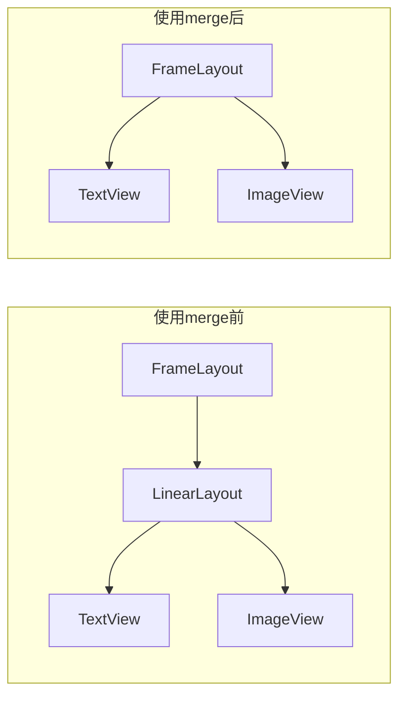

```xml
<!-- ❌ 使用前：3层嵌套 -->
<FrameLayout>
    <LinearLayout orientation="vertical">
        <TextView />
        <ImageView />
    </LinearLayout>
</FrameLayout>

<!-- ✅ 使用后：2层嵌套 -->
<FrameLayout>
    <merge xmlns:android="http://schemas.android.com/apk/res/android">
        <TextView />
        <ImageView />
    </merge>
</FrameLayout>
```

**merge 的原理**：merge 标签本身不创建 View，直接将子 View 添加到父布局中，省去一层包裹。

### 4.3 ViewStub：延迟加载

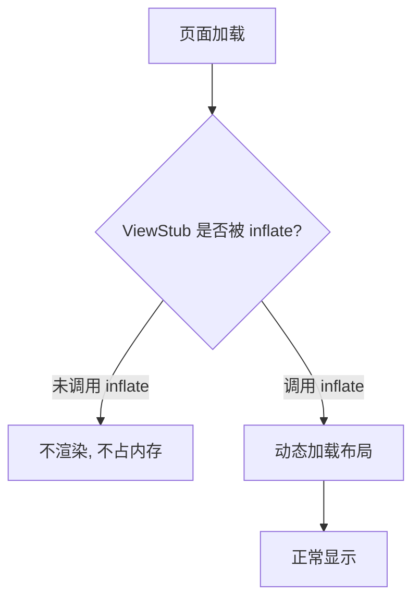

```xml
<!-- XML 中声明 ViewStub -->
<ViewStub
    android:id="@+id/stubError"
    android:layout_width="match_parent"
    android:layout_height="wrap_content"
    android:layout="@layout/layout_error"
    android:inflatedId="@+id/errorView" />
```

```kotlin
// 按需加载
fun showError(message: String) {
    val stub = findViewById<ViewStub>(R.id.stubError)
    val errorView = stub.inflate()  // 只在需要时才 inflate
    errorView.findViewById<TextView>(R.id.tvError).text = message
}
```

### 4.4 ConstraintLayout 扁平化

```xml
<!-- ❌ 传统嵌套布局：5层 -->
<LinearLayout>
    <LinearLayout>
        <RelativeLayout>
            <LinearLayout>
                <TextView />
                <ImageView />
            </LinearLayout>
        </RelativeLayout>
    </LinearLayout>
</LinearLayout>

<!-- ✅ ConstraintLayout 扁平化：1层 -->
<androidx.constraintlayout.widget.ConstraintLayout
    android:layout_width="match_parent"
    android:layout_height="wrap_content">

    <TextView
        android:id="@+id/tvName"
        android:layout_width="wrap_content"
        android:layout_height="wrap_content"
        app:layout_constraintStart_toStartOf="parent"
        app:layout_constraintTop_toTopOf="parent" />

    <ImageView
        android:id="@+id/ivAvatar"
        android:layout_width="48dp"
        android:layout_height="48dp"
        app:layout_constraintEnd_toEndOf="parent"
        app:layout_constraintTop_toTopOf="parent"
        app:layout_constraintBottom_toBottomOf="parent" />
</androidx.constraintlayout.widget.ConstraintLayout>
```

### 4.5 ViewBinding 替代 findViewById

```kotlin
// ❌ 传统 findViewById（每次调用都遍历 View 树）
val tvName = findViewById<TextView>(R.id.tvName)
val ivAvatar = findViewById<ImageView>(R.id.ivAvatar)

// ✅ ViewBinding（编译期生成，零开销）
val binding = ActivityMainBinding.inflate(layoutInflater)
setContentView(binding.root)
binding.tvName.text = "Hello"
binding.ivAvatar.setImageResource(R.drawable.avatar)
```

---

## 5. 实战场景示例

### 5.1 动态显示/隐藏区域

```kotlin
class MainActivity : AppCompatActivity() {
    private lateinit var binding: ActivityMainBinding
    private var errorStub: ViewStub? = null

    override fun onCreate(savedInstanceState: Bundle?) {
        super.onCreate(savedInstanceState)
        binding = ActivityMainBinding.inflate(layoutInflater)
        setContentView(binding.root)

        // 初始状态：隐藏错误提示（ViewStub 不占内存）
        errorStub = binding.stubError

        binding.btnLoad.setOnClickListener { loadData() }
        binding.btnError.setOnClickListener { showError() }
    }

    private fun showError() {
        val errorView = errorStub?.inflate() ?: return
        errorView.findViewById<TextView>(R.id.tvError).text = "网络连接失败"
        errorView.findViewById<Button>(R.id.btnRetry).setOnClickListener {
            loadData()
        }
    }

    private fun loadData() {
        binding.stubError?.visibility = View.GONE
        // 正常加载逻辑...
    }
}
```

### 5.2 RecyclerView 替代 ScrollView

```xml
<!-- ❌ 错误：ScrollView 包含 50 个 Item -->
<ScrollView>
    <LinearLayout android:orientation="vertical">
        <include layout="@layout/item_1" />
        <include layout="@layout/item_2" />
        <!-- ... 48 more items ... -->
    </LinearLayout>
</ScrollView>

<!-- ✅ 正确：使用 RecyclerView -->
<androidx.recyclerview.widget.RecyclerView
    android:id="@+id/recyclerView"
    android:layout_width="match_parent"
    android:layout_height="match_parent" />
```

### 5.3 过度绘制优化

```xml
<!-- ❌ 多层背景重叠 -->
<FrameLayout android:background="@color/white">
    <LinearLayout android:background="@color/white">
        <TextView android:background="@color/white" />
    </LinearLayout>
</FrameLayout>

<!-- ✅ 只在根布局设背景 -->
<FrameLayout android:background="@color/white">
    <LinearLayout>
        <TextView />
    </LinearLayout>
</FrameLayout>
```

---

## 6. 常见错误与避坑

### ❌ → ✅ Before/After 对比

#### 错误 1：include 忘记指定 layout_width/height

```xml
<!-- ❌ 错误：include 不会继承父布局的尺寸 -->
<include layout="@layout/layout_toolbar" />

<!-- ✅ 正确：显式指定尺寸 -->
<include
    layout="@layout/layout_toolbar"
    android:layout_width="match_parent"
    android:layout_height="56dp" />
```

#### 错误 2：merge 用在非 ViewGroup 根布局

```xml
<!-- ❌ 错误：merge 只能作为 ViewGroup 的根标签 -->
<merge>
    <TextView />
</merge>

<!-- ✅ 正确：merge 必须被 include 到 ViewGroup 中 -->
<include layout="@layout/layout_merge_content" />
```

#### 错误 3：ViewStub inflate 后重复使用

```kotlin
// ❌ 错误：ViewStub 只能 inflate 一次
val stub1 = findViewById<ViewStub>(R.id.stub)
val stub2 = findViewById<ViewStub>(R.id.stub) // 返回 null！

// ✅ 正确：inflate 后通过 inflatedId 获取
val stub = findViewById<ViewStub>(R.id.stub)
val view = stub.inflate()
val content = findViewById<TextView>(R.id.inflatedId) // 用 inflatedId
```

### 错误速查表

| 错误现象 | 原因 | 解决方案 |
|---------|------|---------|
| include 的 View 尺寸不对 | 没指定 layout_width/height | 显式指定 |
| merge 报 InflateException | 没有父 ViewGroup | 确保被 include 到 ViewGroup |
| ViewStub inflate 崩溃 | 调用了两次 inflate | 只调用一次 |
| ConstraintLayout 性能差 | 约束关系复杂 | 减少约束数量 |
| 过度绘制严重 | 多层背景重叠 | 移除子 View 的背景 |

---

## 7. 优势与局限

### 各优化手段对比

| 手段 | 优势 | 局限 | 适用场景 |
|------|------|------|---------|
| include | 减少代码重复 | 增加一层嵌套（需配合 merge） | 多页面复用相同布局 |
| merge | 真正减少层级 | 只能做根标签 | ViewGroup 根布局 |
| ViewStub | 零开销延迟加载 | 只能 inflate 一次 | 错误页、加载中 |
| ConstraintLayout | 扁平化布局 | 约束语法较复杂 | 复杂布局 |
| ViewBinding | 类型安全、零开销 | 增加少量编译时间 | 所有布局 |
| RecyclerView | 高效回收复用 | 实现比 ScrollView 复杂 | 长列表 |

---

## 8. 进阶技巧

### 8.1 Layout Inspector 实时分析

```
步骤：
1. Android Studio → Tools → Layout Inspector
2. 连接设备/模拟器
3. 选择目标 Activity
4. 查看：View 层级树、属性、实时 3D 预览
```

### 8.2 GPU 过度绘制检测

```
步骤：
1. 设备 → 开发者选项 → 调试 GPU 过度绘制
2. 颜色含义：
   - 无色：无过度绘制
   - 蓝色：1x 过度绘制
   - 绿色：2x 过度绘制
   - 粉色：3x 过度绘制
   - 红色：4x+ 过度绘制
3. 目标：大部分区域为无色或蓝色
```

### 8.3 ConstraintLayout 性能优化

```xml
<!-- 避免链式约束导致的循环测量 -->
<!-- ❌ 可能导致多次测量 -->
<androidx.constraintlayout.widget.ConstraintLayout>
    <View
        app:layout_constraintStart_toEndOf="@id/view1"
        app:layout_constraintEnd_toStartOf="@id/view2" />
    <View
        app:layout_constraintStart_toEndOf="@id/view3"
        app:layout_constraintEnd_toStartOf="@id/view1" />
</androidx.constraintlayout.widget.ConstraintLayout>

<!-- ✅ 使用 Barrier 或 Guideline 避免循环 -->
<androidx.constraintlayout.widget.Barrier
    android:id="@+id/barrier"
    app:barrierDirection="end"
    app:constraint_referenced_ids="view1" />

<View
    app:layout_constraintStart_toStartOf="@id/barrier" />
```

### 8.4 自定义 LayoutManager 优化

```kotlin
// 固定大小列表：跳过多次测量
recyclerView.setHasFixedSize(true)

// 禁用 ItemAnimator：减少动画开销（列表静态时）
recyclerView.itemAnimator = null

// 设置预取数量
(recyclerView.layoutManager as LinearLayoutManager)
    .initialPrefetchItemCount = 4
```

---

## 9. 面试高频考点

### Q1：include、merge、ViewStub 分别解决什么问题？

**答**：
- **include**：布局复用，减少重复 XML 代码
- **merge**：减少嵌套层级，子 View 直接添加到父 ViewGroup
- **ViewStub**：延迟加载不可见布局，节省内存和加载时间

### Q2：如何检测布局过度绘制？

**答**：
1. 开发者选项 → 调试 GPU 过度绘制 → 查看颜色
2. Layout Inspector → 查看 View 层级
3. Systrace → 分析 measure/layout/draw 耗时

### Q3：ConstraintLayout 相对 LinearLayout/RelativeLayout 的性能优势？

**答**：
- ConstraintLayout 只需一次 measure/layout，可将深层嵌套扁平化为一层
- LinearLayout 的 `layout_weight` 需要两次测量
- RelativeLayout 需要两次测量（水平+垂直）
- 推荐：简单布局用 LinearLayout，复杂布局用 ConstraintLayout

### Q4：ViewBinding 相比 findViewById 的优势？

**答**：
- 编译期生成，无反射开销
- 类型安全，空指针编译期报错
- 直接引用子 View，无需 findViewById
- 支持 `<layout>` 标签绑定数据

### Q5：RecyclerView 为什么比 ScrollView 高效？

**答**：ScrollView 加载所有子 View 到内存，RecyclerView 只加载屏幕可见区域的 View（回收复用），滑动时复用 ViewHolder 避免重复创建。

---

## 10. 小结与下一步

### 快速参考卡

```
┌──────────────────────────────────────────────────┐
│           布局优化速查卡                           │
├──────────────────────────────────────────────────┤
│  减少层级:                                        │
│    <merge>          → 消除包裹层                   │
│    ConstraintLayout → 扁平化复杂布局               │
│                                                   │
│  减少渲染:                                         │
│    移除多余背景   → 减少过度绘制                     │
│    ViewStub       → 延迟加载不可见区域              │
│                                                   │
│  减少代码:                                         │
│    <include>     → 复用布局                        │
│    ViewBinding   → 类型安全访问 View               │
│    RecyclerView  → 高效长列表                      │
│                                                   │
│  检测工具:                                         │
│    Layout Inspector → View 层级分析                │
│    GPU 过度绘制     → 颜色可视化                    │
│    Systrace         → 性能时间线                    │
└──────────────────────────────────────────────────┘
```

### 下一步学习

| 主题 | 内容 | 推荐指数 |
|------|------|---------|
| Compose | 声明式 UI，自动优化 | ⭐⭐⭐ |
| MotionLayout | 复杂动画布局 | ⭐⭐ |
| CoordinatorLayout | 联动滚动效果 | ⭐⭐ |
| App Startup | 优化初始化顺序 | ⭐⭐ |

---

## 课后练习

1. 将一个 5 层嵌套的 LinearLayout 重构为 ConstraintLayout（1层）
2. 用 ViewStub 实现错误页 + 加载中页的延迟加载
3. 用 Layout Inspector 分析自己的 App，找到 3 个过度绘制区域并优化

---

## 自测题

1. merge 标签只能用在什么位置？
2. ViewStub inflate 后能否再次 inflate 同一个 ViewStub？
3. RecyclerView 的 setHasFixedSize(true) 有什么作用？

---

## 常见学生错误

| 错误 | 正确做法 |
|------|---------|
| 在 ScrollView 中放大量子 View | 改用 RecyclerView |
| 每个 View 都设背景色 | 只在根布局设背景 |
| ViewStub inflate 后试图隐藏 | 直接操作 inflated View |
| include 不指定尺寸 | 显式指定 layout_width/height |
| ConstraintLayout 约束循环引用 | 用 Barrier 打破循环 |

---

## 教学提示

- 用 Layout Inspector 实时展示层级对比（before/after）
- GPU 过度绘制用实际颜色让学生理解严重程度
- ViewStub 用"懒加载"概念类比数据库按需查询
- include + merge 一起讲，效果更直观

---

## 🎬 渲染逻辑详解

### 布局优化的渲染原理

布局优化的本质是**减少渲染管线的耗时**，具体来说就是减少 measure、layout、draw 三个阶段的开销：

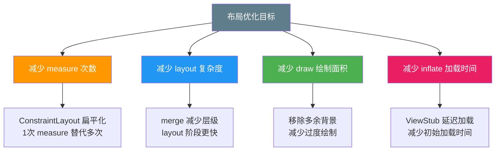

### include 标签的渲染行为

```plaintext
include 标签的工作原理：
  1. LayoutInflater 解析 XML 时，遇到 include 标签
  2. 递归解析被 include 的布局文件
  3. 将解析出的 View 树插入到当前布局中
  4. 如果指定了 layout_width/height，覆盖原始值

  注意：include 本身不创建新 View，只是代码复用
  配合 merge 使用可以避免额外层级
```

### merge 标签的渲染原理

```plaintext
merge 标签的渲染行为：
  使用前:
    FrameLayout
      └─ LinearLayout    ← 多余的包裹层
          ├─ TextView
          └─ ImageView

  使用后:
    FrameLayout
      ├─ TextView        ← 直接添加到父布局
      └─ ImageView

  merge 标签本身不创建 View 对象
  它的子 View 直接添加到父 ViewGroup 中
  减少了一层包裹，layout 阶段更快
```

### ViewStub 的延迟加载机制

```plaintext
ViewStub 的渲染原理：
  1. inflate 阶段：ViewStub 只占用少量内存（约 0 字节）
  2. 不调用 inflate()：不渲染任何内容，不占内存
  3. 调用 inflate()：动态加载指定的布局文件
  4. inflate 后：ViewStub 被替换为真正的 View

  性能收益：
    - 初始加载时间减少 5-20ms
    - 内存占用减少（不可见区域不加载）
    - 适合错误页、加载中页等不常用场景
```

### 过度绘制的渲染原理

```plaintext
过度绘制的形成过程：
  第1层: 背景 → 像素被绘制 1 次
  第2层: 父容器背景 → 像素被绘制 2 次
  第3层: 子View背景 → 像素被绘制 3 次
  第4层: 文字 → 像素被绘制 4 次

  GPU 需要处理 4 倍的绘制工作
  帧率下降，用户可感知卡顿

  优化方法：
    - 移除子 View 的背景（只保留根布局背景）
    - 使用 clipRect 避免绘制不可见区域
    - 使用 ViewStub 延迟加载不可见区域
```

---

## 🔗 知识依赖图

### 与前后章节的关系

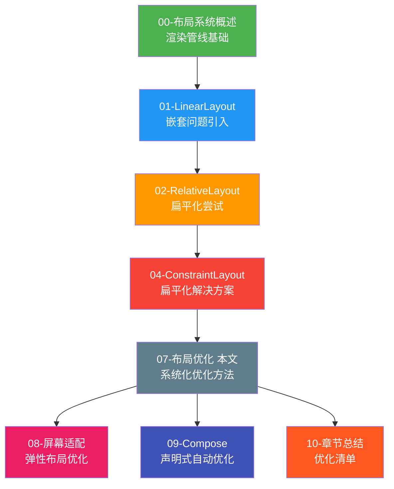

### 核心知识点的章节串联

| 知识点 | 本章内容 | 关联章节 | 关联说明 |
|--------|---------|---------|---------|
| **include 复用** | 减少重复XML代码 | 01-LinearLayout | 01 章的布局可以被 include 复用 |
| **merge 减少层级** | 消除包裹层 | 03-FrameLayout | FrameLayout 的子View可以直接merge |
| **ViewStub 延迟** | 按需加载 | 05-ScrollView | ScrollView 中的隐藏内容可用ViewStub |
| **ConstraintLayout 扁平化** | 1层替代多层 | 04-ConstraintLayout | 04 章核心优势的实践 |
| **RecyclerView 替代 ScrollView** | 高效长列表 | 06-RecyclerView | 06 章详解 RecyclerView 机制 |
| **ViewBinding** | 类型安全访问View | 09-Compose | Compose 无需 ViewBinding |
| **GPU 过度绘制** | 性能检测 | 00-概述 | 00 章介绍 draw 阶段 |

### 组件关系图

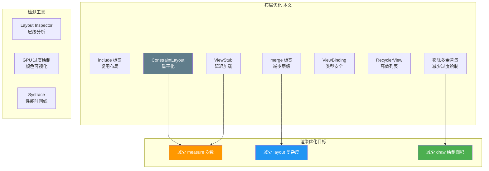

---

## 实战项目

**项目**：优化一个复杂列表页面

**要求**：
- 分析当前布局层级（Layout Inspector 截图）
- 用 ConstraintLayout 扁平化至少 2 处嵌套
- 用 merge + include 复用工具栏和底部栏
- 用 ViewStub 延迟加载错误页和空数据页
- 用 RecyclerView 替代 ScrollView
- 优化前后帧率对比（≥5 FPS 提升）

**技术栈**：ConstraintLayout + include/merge + ViewStub + ViewBinding

---

## 代码审查清单

- [ ] 布局层级 ≤ 10 层
- [ ] 没有多余的 background 导致过度绘制
- [ ] 不可见区域使用 ViewStub 延迟加载
- [ ] 重复布局使用 include + merge 复用
- [ ] 长列表使用 RecyclerView 而非 ScrollView
- [ ] 使用 ViewBinding 访问 View
- [ ] ConstraintLayout 没有循环约束
- [ ] include 标签指定了 layout_width/height
- [ ] 测试帧率 ≥ 55 FPS

---

## 术语表

| 术语 | 含义 |
|------|------|
| 过度绘制 | 同一像素在同一帧被多次绘制 |
| 嵌套层级 | View 在布局树中的深度 |
| measure | 测量阶段，计算 View 的宽高 |
| layout | 布局阶段，确定 View 的位置 |
| draw | 绘制阶段，将 View 渲染到屏幕 |
| ViewStub | 轻量级 View 占位符，按需 inflate |
| merge | 标签，消除冗余的 ViewGroup 包裹层 |
| ViewBinding | 编译期生成的类型安全 View 访问方式 |
| GPU Profiling | 通过颜色可视化检测过度绘制 |
| Systrace | Android 系统级性能分析工具 |

---

## 🔬 渲染管线性能分析底层深度解析

> 本节从 Android 渲染管线最底层机制出发，深入分析每一帧从 VSYNC 信号到 GPU 像素输出的完整链路，帮助开发者建立"从信号到像素"的全链路性能思维。

### 1. Systrace / Perfetto 与渲染管线的关系

**术语解释：**

- **Perfetto**：Google 推出的下一代系统级性能追踪工具，是 Systrace 的继任者。你可以把它想象成一台"超高速摄像机"，能以微秒级精度记录系统中每一个线程、每一次函数调用的执行轨迹。Systrce 是它的前身，现在已经集成进 Perfetto 体系。

- **VSYNC（垂直同步信号）**：由屏幕硬件发出的周期性脉冲信号，告诉系统"该换新一帧画面了"。就像上课铃响——铃声一响，老师必须开始讲课（渲染新一帧），如果铃响了还没准备好，学生就只能看着上一帧（掉帧）。

- **doFrame()**：Choreographer 收到 VSYNC 后回调的核心方法，标志着"开始处理这一帧"。它依次触发 measure → layout → draw 三大阶段。

- **RenderThread**：Android 5.0 引入的独立渲染线程。主线程负责构建 DisplayList（绘制指令清单），RenderThread 负责将 DisplayList 交给 GPU 执行。就像厨师写菜单（主线程）和服务员上菜（RenderThread）分离，两者并行工作。

一帧数据在 Perfetto 中的完整生命周期如下：

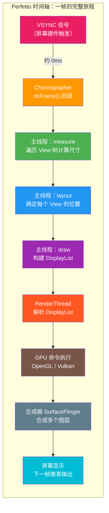

在 Perfetto 中，你能看到这些阶段对应的时间切片（slice）。如果某一切片耗时异常，就能精准定位瓶颈所在：

- 如果 `measure` 切片很厚（耗时长）→ 布局层级太深
- 如果 `draw` 切片很厚 → 绘制指令太多（过度绘制）
- 如果 `GPU` 切片很厚 → 着色器复杂或纹理过大
- 如果主线程在 VSYNC 之间有 `GC` 切片 → 内存抖动导致掉帧

### 2. 帧率与刷新率的匹配

**术语解释：**

- **刷新率（Refresh Rate）**：屏幕硬件每秒刷新画面的次数，单位 Hz。60Hz 表示屏幕每秒刷新 60 次。这是硬件固有属性，不可改变。

- **帧率（Frame Rate / FPS）**：应用每秒能渲染出新画面的次数。如果帧率低于刷新率，就会出现掉帧。

- **帧预算（Frame Budget）**：渲染一帧所允许的最大时间，等于 `1000ms / 刷新率`。就像考试答题时间——60Hz 的考试每道题必须在 16.6ms 内做完，120Hz 的考试每道题只给 8.3ms，做不完就只能看上一题的答案（掉帧）。

| 刷新率 | 帧预算 | 设备典型场景 |
|--------|--------|-------------|
| 60Hz | 16.6ms | 入门级手机 |
| 90Hz | 11.1ms | 中高端手机 |
| 120Hz | 8.3ms | 旗舰手机 / 平板 |
| 144Hz | 6.9ms | 游戏手机 / 高端平板 |

VSYNC 信号间隔与 doFrame 执行时间的关系：

```mermaid
graph TD
    subgraph "60Hz 场景：帧预算 16.6ms"
        V1_60["VSYNC #1<br/>t=0ms"] --> D1_60["doFrame 执行<br/>耗时 12ms ✅"]
        D1_60 --> V2_60["VSYNC #2<br/>t=16.6ms"]
        V2_60 --> D2_60["doFrame 执行<br/>耗时 20ms ❌"]
        D2_60 --> V3_60["VSYNC #3<br/>t=33.3ms<br/>但 doFrame 还没完成"]
        V3_60 --> DROP1["掉帧！显示重复帧"]
    end

    subgraph "120Hz 场景：帧预算 8.3ms"
        V1_120["VSYNC #1<br/>t=0ms"] --> D1_120["doFrame 执行<br/>耗时 7ms ✅"]
        D1_120 --> V2_120["VSYNC #2<br/>t=8.3ms"]
        V2_120 --> D2_120["doFrame 执行<br/>耗时 12ms ❌"]
        D2_120 --> V3_120["VSYNC #3<br/>t=16.6ms<br/>doFrame 未完成"]
        V3_120 --> DROP2["掉帧！<br/>120Hz 降为 60Hz"]
    end

    style DROP1 fill:#F44336,color:#fff
    style DROP2 fill:#F44336,color:#fff
    style D1_60 fill:#4CAF50,color:#fff
    style D1_120 fill:#4CAF50,color:#fff
    style D2_60 fill:#FF9800,color:#fff
    style D2_120 fill:#FF9800,color:#fff
```

**掉帧检测底层原理：**

Android 的 Choreographer 在每次 VSYNC 回调时记录时间戳。如果两次 doFrame 的间隔超过一个 VSYNC 周期，就判定为掉帧（jank）。具体机制：

1. Choreographer 在 VSYNC 到达时 post 一个 `FrameCallback`
2. 如果主线程被阻塞（如正在执行耗时 measure），doFrame 会延迟
3. 延迟超过 1 个 VSYNC 周期 → 系统丢弃本该渲染的帧
4. Perfetto 中表现为 VSYNC 切片和 doFrame 切片之间出现"空隙"

### 3. measure 性能分析

**术语解释：**

- **View 树遍历**：measure 从根 View（DecorView）开始，递归调用每个子 View 的 `measure()` 方法，直到所有叶子节点都测量完毕。就像一棵大树，要从树根开始量每个树枝的长度。

- **O(n) 复杂度**：n 是 View 树中的节点总数。遍历一次 View 树的时间与节点数成正比。节点越多，measure 越慢。

- **二次测量**：某些布局（如 LinearLayout 的 weight、RelativeLayout）需要对子 View 测量两次。第一次测量获取自然尺寸，第二次根据 weight 比例分配剩余空间。就像量衣服时先量一遍尺寸，再根据比例调整一遍。

- **指数级影响**：当 weight 嵌套时，外层每多测量一次，内层所有子 View 都要跟着重新测量。3 层嵌套的 weight 会导致 `2³ = 8` 次测量遍历。

3 层 LinearLayout weight 嵌套的递归调用树：

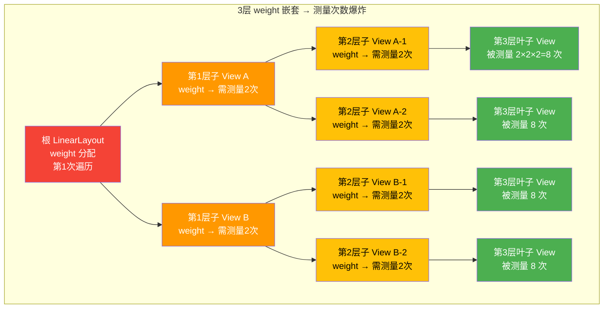

**优化策略：**

| 嵌套层级 | weight 嵌套 | 测量遍历次数 | 性能影响 |
|---------|------------|-------------|---------|
| 1 层 | 有 weight | 2 次 | 轻微 |
| 2 层 | 有 weight | 4 次 | 中等 |
| 3 层 | 有 weight | 8 次 | 严重卡顿 |
| 3 层 | 无 weight | 1 次 | 正常 |

解决方案：用 ConstraintLayout 的 `app:layout_constraintWeight` 或 `Chain` 替代多层 weight 嵌套，将 3 层扁平化为 1 层，测量次数从 8 次降为 1 次。

### 4. layout 性能分析

**术语解释：**

- **layout 阶段**：在 measure 确定每个 View 的宽高后，layout 阶段确定每个 View 相对父容器的坐标位置（left, top, right, bottom）。就像测量完每个人的身高后，再安排他们在合影中的站位。

- **O(n) 遍历**：layout 同样从根 View 开始递归，每个节点调用 `layout()` 设置自身位置，再调用子 View 的 `layout()`。时间与节点数成正比。

- **对 draw 的间接影响**：如果 layout 过程中某些 View 的可见区域发生变化（如位置移动、尺寸改变），会标记这些区域为"脏区域"（dirty region），draw 阶段需要重新计算绘制范围和裁剪区域，增加额外开销。

layout 阶段的性能特征：

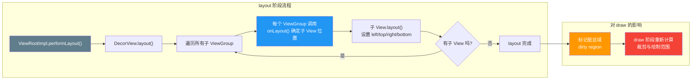

**关键优化点：**

- 减少布局层级直接减少 layout 遍历的节点数
- 避免在 `onLayout()` 中创建对象或执行复杂计算
- 如果只改变 View 内容而不改变尺寸位置，调用 `invalidate()` 而非 `requestLayout()`，跳过 measure/layout

### 5. draw 性能分析

**术语解释：**

- **DisplayList**：draw 阶段在主线程构建的绘制指令清单，包含所有 `drawRect`、`drawText`、`drawBitmap` 等命令。就像一份"装修施工单"——上面写着每面墙刷什么颜色、贴什么壁纸，但不真正执行。

- **RenderThread**：独立线程，负责将 DisplayList 翻译成 OpenGL/Vulkan 的 GPU 命令并提交给 GPU 执行。主线程构建完 DisplayList 后就可以继续处理下一帧的输入，渲染线程并行处理 GPU 提交。

- **顶点着色器（Vertex Shader）**：GPU 上运行的小程序，负责计算每个顶点的最终屏幕坐标。每个三角形有 3 个顶点，顶点着色器对每个顶点执行一次。

- **片段着色器（Fragment Shader）**：GPU 上运行的小程序，负责计算每个像素的最终颜色。一个全屏 1080×2400 的画面有约 200 万个片段需要着色计算。

draw 阶段的完整渲染链路：

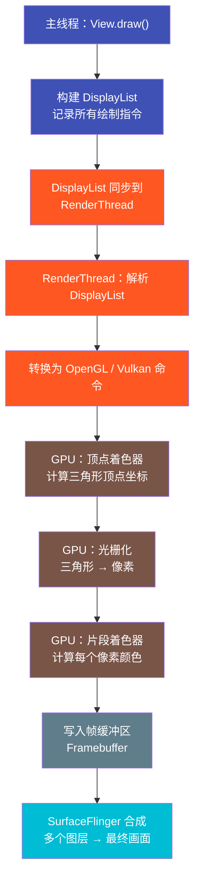

**性能瓶颈定位：**

| 阶段 | 瓶颈表现 | 优化手段 |
|------|---------|---------|
| DisplayList 构建 | draw 指令过多 | 合并绘制、减少 View 数量 |
| RenderThread | GPU 命令堆积 | 减少过度绘制 |
| 顶点着色器 | 顶点数过多 | 简化形状、减少 clipPath |
| 片段着色器 | 像素填充率不足 | 降低分辨率、减少全屏模糊 |

### 6. 过度绘制检测原理

**术语解释：**

- **模板缓冲（Stencil Buffer）**：GPU 中的一个特殊数据缓冲区，与帧缓冲（Framebuffer）一一对应。每个像素在模板缓冲中有一个计数器，记录该像素被写入的次数。就像教室门口的计数器——每进一个人（每画一次），计数器加一，最后看哪个位置被进了太多次。

- **深度测试（Depth Test）**：GPU 根据像素的 Z 坐标判断是否写入。透明 View 不参与深度测试，因此即使被遮挡也会被绘制，导致过度绘制。

- **硬件过度绘制检测**：开发者选项中的"调试 GPU 过度绘制"利用模板缓冲，将每个像素的绘制次数映射为不同颜色显示在屏幕上。

3x 过度绘制的像素写入过程：

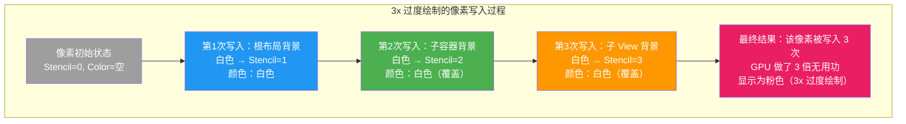

**颜色映射表（对应模板缓冲计数值）：**

| Stencil 值 | 颜色 | 含义 | 性能影响 |
|-----------|------|------|---------|
| 0 | 原色 | 无过度绘制 | 最佳 |
| 1 | 蓝色 | 1x 过度绘制 | 可接受 |
| 2 | 绿色 | 2x 过度绘制 | 需关注 |
| 3 | 粉色 | 3x 过度绘制 | 需优化 |
| 4+ | 红色 | 4x+ 过度绘制 | 严重 |

### 7. 内存抖动分析

**术语解释：**

- **内存抖动（Memory Churn）**：在短时间内大量创建并销毁临时对象，导致 GC（垃圾回收器）频繁触发。就像一个工厂每分钟都在生产一次性杯子又马上扔掉，清洁工（GC）不得不频繁来打扫。

- **GC 暂停（GC Pause）**：垃圾回收时，虚拟机需要暂停应用线程（Stop-The-World），暂停期间无法执行任何渲染逻辑。一次 GC 暂停通常 3-10ms，但如果发生在帧渲染期间，就会导致掉帧。

- **临时对象**：在 `onMeasure()`、`onLayout()`、`onDraw()` 中创建的短生命周期对象，如 `new Rect()`、`new Paint()`、`new StringBuilder()`。这些对象用完即弃，但每个都会增加 GC 压力。

GC 暂停与掉帧的关系时序图：

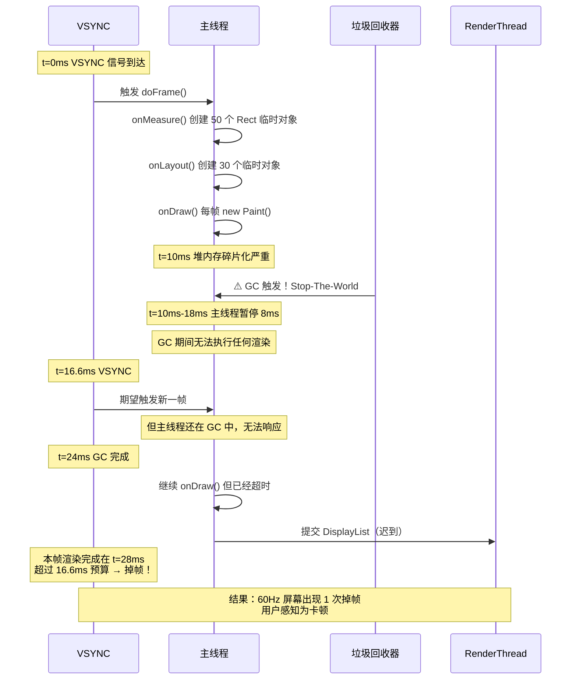

**优化策略：**

```kotlin
// ❌ 错误：在 onDraw 中创建临时对象
override fun onDraw(canvas: Canvas) {
    val paint = Paint()          // 每帧创建新对象！
    val rect = Rect()            // 每帧创建新对象！
    paint.color = Color.RED
    canvas.drawRect(rect, paint)
}

// ✅ 正确：复用对象，避免内存抖动
private val paint = Paint().apply { color = Color.RED }
private val rect = Rect()

override fun onDraw(canvas: Canvas) {
    rect.set(0, 0, width, height)  // 复用已有对象
    canvas.drawRect(rect, paint)
}
```

**内存抖动检测工具：**

| 工具 | 用途 | 检测方式 |
|------|------|---------|
| Memory Profiler | 实时内存监控 | 观察堆内存是否呈锯齿状波动 |
| Allocation Tracker | 对象分配追踪 | 定位 onDraw 中创建的对象 |
| Perfetto | GC 事件时间线 | 查看 GC 切片是否在帧渲染期间出现 |
| LeakCanary | 内存泄漏检测 | 排除泄漏后的内存抖动问题 |

### 本节小结

渲染管线性能分析的核心思路是从"信号到像素"全链路追踪：

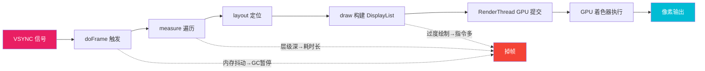

---

## 📐 设计理念与架构图

> 本节从架构设计的宏观视角，讨论布局优化的哲学思考、决策框架以及 Compose 等新一代 UI 框架的性能设计理念。

### 1. "过早优化是万恶之源" 在 Android 布局中的体现

**术语解释：**

- **过早优化（Premature Optimization）**：在还没有性能问题的时候就盲目优化，导致代码可读性下降、维护成本上升。Donald Knuth 的这句名言在布局领域同样适用——不要为了"看起来更快"而牺牲代码的清晰度。

- **可衡量的优化**：基于性能分析工具（如 Perfetto、Layout Inspector）的数据驱动优化，而非凭直觉猜测。

在 Android 布局开发中，"过早优化"的典型表现与正确做法：

| 过早优化（不推荐） | 数据驱动优化（推荐） |
|-------------------|---------------------|
| 所有页面都用 ConstraintLayout | 用 Perfetto 测量后，只在卡顿页面优化 |
| 所有 View 都手动缓存 Paint 对象 | Memory Profiler 发现 GC 频繁后再缓存 |
| 简单的 2 层 LinearLayout 也要扁平化 | 只在层级 > 10 或掉帧时才重构 |
| 过早使用自定义 View 替代标准控件 | 先用标准控件，性能不够再自定义 |

**什么时候该优化：**

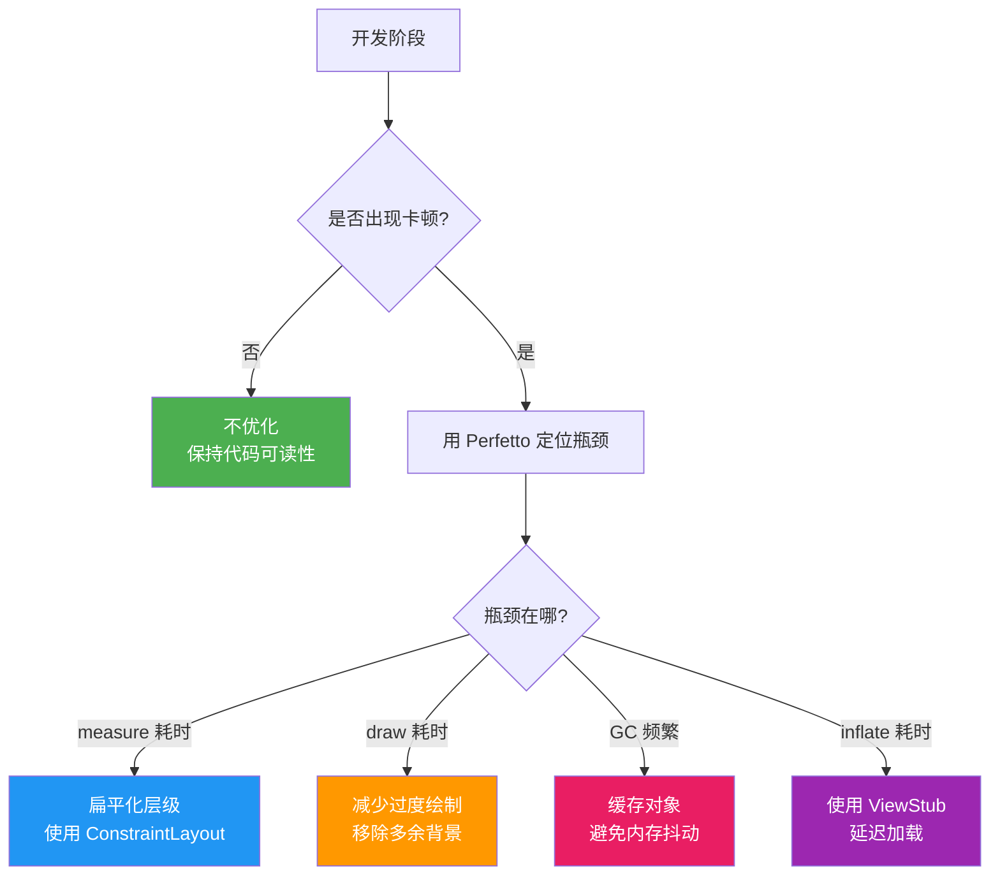

**什么时候不该优化：**

1. **原型阶段**：快速迭代优先，优化会拖慢开发速度
2. **简单页面**：2-3 层嵌套的简单布局，优化收益小于维护成本
3. **无性能数据支持时**：不要凭"感觉"优化，要用工具说话
4. **优化后代码更难理解**：如果优化导致代码可读性急剧下降，且性能提升微小（< 1ms），不值得

### 2. 布局优化决策树

当检测到卡顿时，应该按以下决策树逐步分析和选择优化策略：

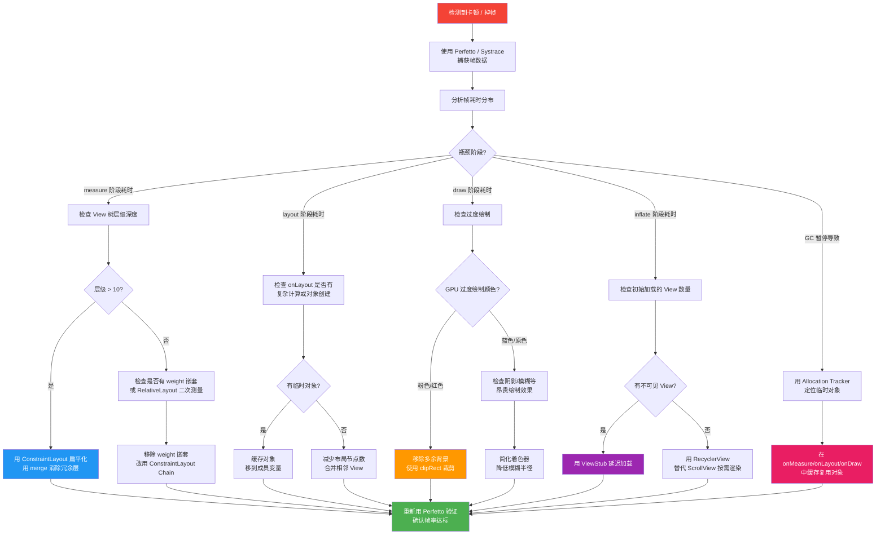

### 3. include / merge / ViewStub 三种布局复用技术的底层原理差异

**术语解释：**

- **LayoutInflater**：Android 的 XML 布局解析器，负责将 XML 标签转换为内存中的 View 对象树。它就像一个"翻译官"，把设计师画的 XML 蓝图翻译成代码能理解的 View 对象。

- **View 树节点**：每个 XML 标签在内存中对应一个 View 或 ViewGroup 对象。节点越多，measure/layout/draw 遍历越慢。

- **inflate 成本**：将 XML 解析为 View 对象的过程，包括 XML 解析（I/O）、反射创建 View 实例、属性读取。一个复杂布局的 inflate 可能耗时 10-50ms。

三种技术的底层原理差异对比：

```mermaid
graph TB
    subgraph "include：代码复用，不减层级"
        INC_XML["layout_toolbar.xml<br/>（独立 XML 文件）"]
        INC_PARENT["父布局 XML<br/>遇到 include 标签"]
        INC_PARENT -->|"LayoutInflater 递归解析"| INC_XML
        INC_XML --> INC_RESULT["结果：include 的根 View<br/>作为子节点加入父布局<br/>层级不变"]
        
        INC_NOTE["特点：<br/>1. 纯代码复用，减少 XML 重复<br/>2. 会增加一层根 ViewGroup<br/>3. 需配合 merge 消除多余层<br/>4. 解析时机：立即解析"]
    end

    subgraph "merge：消除层级，不创建 View"
        MRG_XML["layout_content.xml<br/>根标签为 merge"]
        MRG_PARENT["父布局 XML<br/>include merge 布局"]
        MRG_PARENT -->|"LayoutInflater 遇到 merge"| MRG_XML
        MRG_XML --> MRG_RESULT["结果：merge 不创建 View<br/>子 View 直接加入父布局<br/>层级减少"]
        
        MRG_NOTE["特点：<br/>1. 只能作为被 include 的根标签<br/>2. 本身不创建任何 View 对象<br/>3. 消除一层冗余 ViewGroup<br/>4. 解析时机：与 include 同时"]
    end

    subgraph "ViewStub：延迟加载，零初始开销"
        VS_XML["layout_error.xml<br/>（目标布局）"]
        VS_DECL["XML 中声明 ViewStub<br/>layout=@layout/layout_error"]
        VS_DECL -->|"inflate 阶段"| VS_RESULT1["结果1：ViewStub 占位<br/>不解析目标布局<br/>零内存开销"]
        VS_RESULT1 -->|"调用 inflate()"| VS_XML
        VS_XML --> VS_RESULT2["结果2：动态解析目标布局<br/>ViewStub 被替换为真实 View<br/>按需加载"]
        
        VS_NOTE["特点：<br/>1. 延迟加载，初始零开销<br/>2. 只能 inflate 一次<br/>3. 适合不常用页面（错误页/空状态）<br/>4. 解析时机：调用 inflate() 时"]
    end

    style INC_RESULT fill:#2196F3,color:#fff
    style MRG_RESULT fill:#4CAF50,color:#fff
    style VS_RESULT1 fill:#FF9800,color:#fff
    style VS_RESULT2 fill:#9C27B0,color:#fff
```

**三者对比总结：**

| 特性 | include | merge | ViewStub |
|------|---------|-------|----------|
| 主要目的 | 代码复用 | 减少层级 | 延迟加载 |
| 是否创建 View | 是（根 ViewGroup） | 否 | 延迟创建 |
| 对层级影响 | 可能增加一层 | 减少一层 | 不影响（延迟后才加入） |
| 解析时机 | 立即解析 | 与 include 同步 | 调用 inflate() 时 |
| 是否可重复使用 | 可多次 include | 可多次 include | 只能 inflate 一次 |
| 典型场景 | 工具栏/底部栏 | include 的根标签 | 错误页/空状态页 |

### 4. ConstraintLayout 扁平化的性能权衡分析

**术语解释：**

- **约束求解器（Cassowary）**：ConstraintLayout 内部使用的线性不等式约束求解算法。它将所有约束关系（如 A 在 B 右边、C 与 D 底对齐）转化为线性方程组，通过高斯消元法求解每个 View 的最终位置。

- **O(n³) 复杂度**：约束求解器在最坏情况下的时间复杂度。n 是约束方程的数量，求解器需要执行矩阵运算，复杂度与方程数的三次方成正比。但当约束数量较少时（< 20），实际耗时很小。

- **O(n×depth) 复杂度**：嵌套布局的总测量成本。n 是节点数，depth 是嵌套深度。每多一层嵌套，内层所有节点都可能被重复测量。

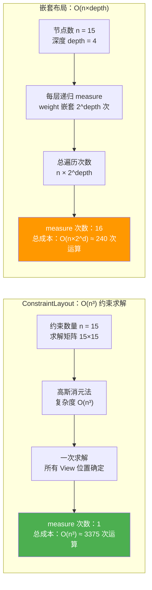

**什么场景该用 ConstraintLayout：**

| 场景 | 推荐 | 原因 |
|------|------|------|
| 嵌套层级 > 3 | ConstraintLayout | 扁平化收益大于约束求解成本 |
| 复杂相对定位 | ConstraintLayout | 比嵌套 RelativeLayout 更高效 |
| 需要按比例分配空间 | ConstraintLayout | Chain + Spread/Spread Inside |
| 约束数量 < 20 | ConstraintLayout | 求解器开销可忽略 |
| 2 层简单线性排列 | LinearLayout | weight 只测 2 次，比约束求解更快 |
| 纯垂直/水平排列 | LinearLayout | 无需约束求解，直接线性布局 |
| 约束 > 50 个 | 谨慎使用 | O(n³) 开始显著，考虑拆分布局 |

### 5. Compose 的性能设计哲学

**术语解释：**

- **智能重组（Smart Recomposition）**：Compose 只重新执行状态发生变化的 Composable 函数，跳过未变化的部分。就像只重画被修改的画布区域，而不是整幅画重画。

- **只读状态跳过（Read State Skip）**：如果 Composable 函数只读取了未变化的状态，Compose 会跳过该函数的重新执行。编译器自动推断哪些状态被读取。

- **稳定性推断（Stability Inference）**：Compose 编译器自动判断参数类型是否"稳定"（Stable）。基本类型（String、Int）默认稳定；不稳定类型（如 List）需要用 `@Stable` 注解标记，否则每次都会重组。

- **重组范围（Recomposition Scope）**：Compose 以 Composable 函数为最小重组单位。状态变化时，只有直接读取该状态的函数会重组，不会扩散到父级或兄弟函数。

Compose 重组范围与跳过机制：

```mermaid
graph TD
    subgraph "传统 View 系统：invalidate 全量重绘"
        TV1["状态变化<br/>textView.text = 'new'"]
        TV1 --> TV2["invalidate() 标记脏区域"]
        TV2 --> TV3["整个 View 树重新 draw<br/>即使只有一个 View 变化"]
        TV3 --> TV4["measure/layout 可能被触发<br/>requestLayout()"]
    end

    subgraph "Compose：精准重组"
        C_ROOT["@Composable MyScreen()"]
        C_ROOT --> C_HEADER["Header() ← 未读取变化状态"]
        C_ROOT --> C_BODY["Body() ← 读取了 state"]
        C_ROOT --> C_FOOTER["Footer() ← 未读取变化状态"]
        
        C_BODY --> C_ITEM1["ItemRow(item1) ← item1 未变"]
        C_BODY --> C_ITEM2["ItemRow(item2) ← item2 变了!"]
        C_BODY --> C_ITEM3["ItemRow(item3) ← item3 未变"]
    end

    subgraph "重组结果"
        R1["Header() → 跳过 ✅"]
        R2["Body() → 重组 ⚡"]
        R3["ItemRow(item1) → 跳过 ✅"]
        R4["ItemRow(item2) → 重组 ⚡"]
        R5["ItemRow(item3) → 跳过 ✅"]
        R6["Footer() → 跳过 ✅"]
    end

    style TV4 fill:#F44336,color:#fff
    style R1 fill:#4CAF50,color:#fff
    style R2 fill:#FF9800,color:#fff
    style R3 fill:#4CAF50,color:#fff
    style R4 fill:#FF9800,color:#fff
    style R5 fill:#4CAF50,color:#fff
    style R6 fill:#4CAF50,color:#fff
```

**Compose vs 传统 View 的性能对比：**

| 维度 | 传统 View | Compose |
|------|----------|---------|
| 更新粒度 | View 级别（invalidate） | 函数级别（Smart Recomposition） |
| 状态追踪 | 手动管理（手动 setText） | 自动追踪（State 驱动） |
| 测量优化 | 嵌套导致多次测量 | IntrinsicMeasure 可跳过 |
| 内存 | 每个 View 对象占内存 | 轻量 Composable 数据结构 |
| 树结构 | 运行时 View 树 | 编译期生成位置表格 |

**Compose 性能最佳实践：**

```kotlin
// ❌ 不稳定参数：List 未标记稳定，每次都重组
@Composable
fun UserList(users: List<String>) {  // List 不稳定！
    users.forEach { user ->
        Text(user)
    }
}

// ✅ 稳定参数：使用 @Stable 或包装为稳定类型
@Stable
data class UserListState(val users: List<String>)

@Composable
fun UserList(state: UserListState) {  // 稳定！
    state.users.forEach { user ->
        Text(user)
    }
}

// ✅ 只读状态跳过：未读取变化状态的函数不会重组
@Composable
fun Counter() {
    var count by remember { mutableStateOf(0) }  // 仅 Counter 读取
    
    Column {
        Text("计数器")          // 未读取 count → 永远不重组
        Text("当前值: $count")   // 读取了 count → count 变化时重组
        Button(onClick = { count++ }) {
            Text("增加")        // 未读取 count → 不重组
        }
    }
}
```

### 6. Android 12+ 的 RenderNode 优化

**术语解释：**

- **RenderNode**：Android 用于记录 View 绘制操作的数据结构。每个 View 有一个关联的 RenderNode，包含 DisplayList 和渲染属性（位置、变换、裁剪等）。Android 12+ 对 RenderNode 做了重大优化。

- **硬件加速（Hardware Acceleration）**：默认启用，draw 操作通过 RenderNode 转换为 GPU 命令。Android 4.0+ 默认开启，但 12+ 做了进一步优化。

- **纹理缓存（Texture Cache）**：GPU 将频繁使用的绘制结果缓存为纹理，避免重复渲染。Android 12+ 增强了纹理缓存的命中率。

Android 12+ RenderNode 的关键优化：

```mermaid
graph TD
    subgraph "Android 11 及以下"
        OLD1["View.invalidate()"] --> OLD2["标记脏区域"]
        OLD2 --> OLD3["重绘整个脏区域<br/>内的所有 View"]
        OLD3 --> OLD4["重建 DisplayList<br/>即使 View 内容未变"]
        OLD4 --> OLD5["RenderThread 重新提交<br/>所有 GPU 命令"]
    end

    subgraph "Android 12+ RenderNode 优化"
        NEW1["View.invalidate()"] --> NEW2["仅标记该 View 的<br/>RenderNode 为脏"]
        NEW2 --> NEW3["只重建该 View 的<br/>DisplayList"]
        NEW3 --> NEW4["其他 View 的 RenderNode<br/>复用缓存的纹理"]
        NEW4 --> NEW5["RenderThread 只提交<br/>变化的 GPU 命令"]
        NEW5 --> NEW6["大幅减少 GPU 工作量"]
    end

    style OLD4 fill:#F44336,color:#fff
    style OLD5 fill:#F44336,color:#fff
    style NEW4 fill:#4CAF50,color:#fff
    style NEW6 fill:#4CAF50,color:#fff
```

**对布局性能的影响：**

| 优化点 | 影响 | 开发者感知 |
|--------|------|-----------|
| RenderNode 级别脏标记 | 只重绘变化的 View | invalidate 更快，掉帧减少 |
| 纹理缓存增强 | 静态 View 不重新渲染 | 动画在静态背景上更流畅 |
| DisplayList 并行构建 | 多线程构建 DisplayList | 复杂布局的 draw 阶段更快 |
| 合并渲染层 | 减少合成器层数数 | 过度绘制区域自动优化 |

**开发者需要注意：**

- 即使有 RenderNode 优化，布局层级过深仍然影响 measure/layout
- Android 12+ 的优化主要在 draw 阶段，measure/layout 仍是 O(n) 遍历
- 开发者选项中的"显示硬件层更新"可以观察 RenderNode 的更新范围
- 在 Android 12+ 设备上，过度绘制的实际影响比颜色显示的要小（因为有纹理缓存）

### 本节小结

布局优化的设计哲学可以归纳为三个层次：

```mermaid
graph TD
    A["布局优化设计哲学"] --> B["第一层：数据驱动<br/>先测量再优化"]
    A --> C["第二层：选择正确工具<br/>针对瓶颈选择策略"]
    A --> D["第三层：面向未来<br/>拥抱 Compose 等新技术"]
    
    B --> B1["Perfetto 定位瓶颈<br/>不做过早优化"]
    C --> C1["measure 慢 → 扁平化<br/>draw 慢 → 减少过度绘制<br/>inflate 慢 → ViewStub 延迟"]
    D --> D1["Smart Recomposition<br/>RenderNode 优化"]
    
    style A fill:#607D8B,color:#fff
    style B fill:#4CAF50,color:#fff
    style C fill:#2196F3,color:#fff
    style D fill:#9C27B0,color:#fff
```

---

## 📝 跨章节综合考核训练

> 本节设计了 8 道跨章节综合考核题，每道题都关联至少 2 个章节的知识点，旨在考察学习者将不同章节的知识融会贯通、综合运用的能力。建议先独立思考，再对照参考答案要点。

### 考核题 1：LinearLayout weight 嵌套优化

**涉及章节**：07-布局优化技巧 + 01-LinearLayout

**题目**：

某开发者实现了一个"等分布割"列表页，布局结构如下：

```xml
<LinearLayout orientation="vertical">
    <LinearLayout orientation="horizontal" weightSum="3">
        <View layout_weight="1" />
        <View layout_weight="1" />
        <View layout_weight="1" />
    </LinearLayout>
    <LinearLayout orientation="horizontal" weightSum="3">
        <View layout_weight="1" />
        <View layout_weight="1" />
        <View layout_weight="1" />
    </LinearLayout>
    <LinearLayout orientation="horizontal" weightSum="3">
        <View layout_weight="1" />
        <View layout_weight="1" />
        <View layout_weight="1" />
    </LinearLayout>
</LinearLayout>
```

该页面在低端机上出现明显卡顿（帧率约 35 FPS）。请结合第 01 章的 LinearLayout weight 机制和第 07 章的 measure 性能分析，回答以下问题：

1. 解释为什么这个布局会导致卡顿（从 measure 遍历次数角度分析）
2. 用 ConstraintLayout 重写该布局，使测量次数从指数级降为 1 次
3. 除了 ConstraintLayout，还有哪些替代方案？

**参考答案要点**：

- **卡顿原因**：3 层 LinearLayout 嵌套，每层都使用 weight，导致每个叶子 View 被测量 `2×2×2 = 8` 次。第一章讲过 weight 需要"两遍测量"（先测自然宽高，再按 weight 比例分配剩余空间），3 层嵌套导致指数级放大，measure 阶段耗时严重超过 16.6ms 帧预算。
- **ConstraintLayout 重写**：使用 `Chain`（打包链条）+ `spread` 模式，将 9 个 View 放在同一层 ConstraintLayout 中，用 `app:layout_constraintHorizontal_chainStyle="spread"` 实现等分。约束求解器一次求解完成所有 View 定位，measure 只执行 1 次。
- **替代方案**：① 使用 `GridLayout`，原生支持等分网格，measure 次数为 1；② 使用 `FlexboxLayout`，支持弹性布局；③ 使用 `RecyclerView` + `GridLayoutManager`，如果每个格子是动态数据的话。
- **关键原则**：weight 适合单层使用，嵌套 weight 是性能反模式。第一章的 weight 知识和第七章的 measure 分析结合来看，就能理解为什么"嵌套 weight = 性能炸弹"。

### 考核题 2：ConstraintLayout 扁平化决策

**涉及章节**：07-布局优化技巧 + 04-ConstraintLayout

**题目**：

团队中两位开发者对同一个布局产生了分歧：

- 开发者 A 认为："所有布局都应该用 ConstraintLayout，因为它能把层级压到 1 层，measure 只需要 1 次。"
- 开发者 B 认为："ConstraintLayout 的约束求解器是 O(n³)，约束多了反而比 LinearLayout 慢，简单的线性布局不应该用 ConstraintLayout。"

请结合第 04 章 ConstraintLayout 的约束系统和第 07 章的性能权衡分析，回答：

1. 分别给出 A 和 B 观点中正确和错误的部分
2. 列出 3 个应该用 ConstraintLayout 的场景和 3 个不应该用的场景
3. 如何量化判断该用哪种布局？

**参考答案要点**：

- **开发者 A 的正确点**：ConstraintLayout 确实能扁平化深层嵌套，减少 measure 次数。**错误点**：并非"所有"布局都该用，简单线性布局用 LinearLayout 更轻量，约束求解器对小规模约束也有开销。
- **开发者 B 的正确点**：约束求解器确实是 O(n³)，约束数量大时会有开销。**错误点**：O(n³) 在约束数 < 20 时实际耗时很小（亚毫秒级），不能一概而论地说"比 LinearLayout 慢"。
- **应该用 ConstraintLayout 的场景**：① 嵌套层级 > 3 的复杂布局；② 需要相对定位、居中对齐、屏障约束；③ 需要按比例分配空间（Chain）。
- **不该用的场景**：① 纯垂直/水平线性排列（LinearLayout 直接线性布局，无需求解）；② 只有 2-3 个子 View 的简单布局；③ 约束 > 50 个的极端复杂布局（考虑拆分为多个子布局）。
- **量化判断方法**：用 Perfetto 捕获 measure 阶段的耗时，如果 ConstraintLayout 的 measure 耗时 < LinearLayout 的 measure 耗时，则使用 ConstraintLayout；反之使用 LinearLayout。数据驱动而非直觉。

### 考核题 3：过度绘制与 FrameLayout 层叠

**涉及章节**：07-布局优化技巧 + 03-FrameLayout

**题目**：

某音乐播放器 App 的播放页面布局如下：

```xml
<FrameLayout background="@color/black">          <!-- 第1层背景 -->
    <FrameLayout background="@color/dark_gray">    <!-- 第2层背景 -->
        <ImageView src="@drawable/album_art" />   <!-- 第3层：专辑封面 -->
        <View background="#80000000" />            <!-- 第4层：半透明遮罩 -->
        <LinearLayout background="@color/black">   <!-- 第5层背景 -->
            <TextView text="歌曲名" />
            <TextView text="歌手名" />
        </LinearLayout>
    </FrameLayout>
</FrameLayout>
```

开发者选项中的"GPU 过度绘制"显示该页面大面积为红色（4x+）。请结合第 03 章 FrameLayout 的层叠特性和第 07 章的过度绘制检测原理，回答：

1. 分析每个像素被绘制了几次，以及哪些背景是多余的
2. 用 FrameLayout 的特性解释为什么这个布局特别容易过度绘制
3. 给出优化后的布局，将过度绘制降到 1x-2x
4. 解释 GPU 模板缓冲是如何检测到 4x 过度绘制的

**参考答案要点**：

- **绘制次数分析**：底部黑色背景画 1 次 → 深灰色背景覆盖画第 2 次 → 专辑封面画第 3 次 → 半透明遮罩画第 4 次 → LinearLayout 黑色背景画第 5 次 → 文字画第 6 次。核心可视区域被绘制 5-6 次，远超 4x 红色阈值。
- **FrameLayout 特性**：第 03 章讲过 FrameLayout 的子 View 默认从左上角层叠堆放，所有子 View 默认全部可见（除非显式设置 visibility）。这意味着 FrameLayout 中每个子 View 的背景都会被绘制，即使被上层 View 完全覆盖。FrameLayout 是"层叠"特性的最佳体现，但也最容易导致过度绘制。
- **优化方案**：① 移除内层 FrameLayout 和 LinearLayout 的多余背景（只保留最外层背景）；② 半透明遮罩用 `canvas.saveLayer` + `canvas.restoreToCount` 替代全屏半透明 View；③ 将文字直接放在最外层 FrameLayout 中，用 ConstraintLayout 扁平化；④ 专辑封面的区域设置 `clipRect` 只绘制可见区域。
- **模板缓冲原理**：GPU 在 Stencil Buffer 中为每个像素维护计数器，每次写入像素时计数器 +1。第 07 章讲过，当计数器 >= 4 时显示为红色。该布局中核心像素被写入 5-6 次，所以显示为红色（4x+）。

### 考核题 4：RecyclerView 的按需渲染作为布局优化手段

**涉及章节**：07-布局优化技巧 + 06-RecyclerView

**题目**：

某新闻 App 的首页使用 ScrollView 包裹 100 个新闻 Item，每个 Item 包含图片、标题、摘要共 3 个 View。用户反馈首页打开慢、滑动卡顿。请结合第 06 章 RecyclerView 的回收复用机制和第 07 章的布局优化技巧，回答：

1. 从 View 数量和 inflate 耗时角度，分析 ScrollView 方案的性能问题
2. 从 measure/layout/draw 三个阶段分别分析 ScrollView 的性能瓶颈
3. 为什么 RecyclerView 能解决这些问题？从 ViewHolder 回收复用、按需 measure、按需 draw 三个层面解释
4. 如果某些 Item 必须全部渲染（如打印导出场景），有什么折中方案？

**参考答案要点**：

- **ScrollView 的性能问题**：100 个 Item × 3 个 View = 300 个 View 一次性 inflate，每个 View inflate 约 0.5-1ms，总 inflate 耗时 150-300ms，远超 16.6ms 帧预算。所有 300 个 View 同时存在于内存中，measure/layout/draw 都要遍历 300 个节点。
- **三阶段瓶颈**：① measure 阶段需要遍历 300 个 View 节点计算尺寸；② layout 阶段需要为 300 个 View 确定位置，即使大部分在屏幕外；③ draw 阶段需要为 300 个 View 构建 DisplayList，GPU 要处理大量不可见区域的绘制命令。
- **RecyclerView 的解决方案**：① **ViewHolder 回收复用**：只创建屏幕可见的约 10 个 ViewHolder，滑动时复用已存在的 ViewHolder，避免重复 inflate；② **按需 measure**：LayoutManager 只测量可见区域的 Item，屏幕外的 View 不参与 measure；③ **按需 draw**：只绘制可见区域的 Item，屏幕外 View 的 DisplayList 不会被构建。
- **折中方案**：① 使用 `RecyclerView` + `LinearLayoutManager` + `setItemViewCacheSize(100)` 缓存所有 Item 的 ViewHolder，但不渲染不可见区域；② 使用 `RecyclerView` 的 `prefetch` 机制预加载即将进入屏幕的 Item；③ 导出场景临时切换为 ScrollView，导出完成后切回 RecyclerView。

### 考核题 5：include / merge 与 LayoutInflater 的关系

**涉及章节**：07-布局优化技巧 + 00-布局系统概述

**题目**：

一位初学者在阅读第 00 章后了解到，Android 的布局系统通过 `LayoutInflater` 将 XML 文件解析为 View 对象树。但在使用 `include` 和 `merge` 时遇到了困惑：

```xml
<!-- layout_item.xml -->
<merge>
    <TextView id="@+id/tvTitle" />
    <ImageView id="@+id/ivIcon" />
</merge>

<!-- activity_main.xml -->
<FrameLayout>
    <include layout="@layout/layout_item" />
</FrameLayout>
```

他发现 `findViewById(R.id.tvTitle)` 能正常找到 TextView，但不理解为什么 merge 标签没有创建 View。请结合第 00 章的 LayoutInflater 机制和第 07 章的 include/merge 知识，回答：

1. 从 LayoutInflater 源码角度，解释 include 标签是如何被解析的
2. 从 LayoutInflater 角度，解释 merge 标签为什么"不创建 View"
3. 如果不用 merge 而用普通 ViewGroup 作为 layout_item.xml 的根标签，View 树结构有什么区别？
4. 为什么 `findViewById(R.id.tvTitle)` 能跨 include 边界找到 View？

**参考答案要点**：

- **include 解析过程**：LayoutInflater 的 `inflate()` 方法在解析 XML 时遇到 `<include>` 标签，会调用 `parseInclude()` 方法。该方法读取 `layout` 属性指定的 XML 文件，递归调用 `inflate()` 解析该文件，将解析出的 View 树插入到 include 所在的位置。include 本身不创建 View，只是一个"引用标记"。
- **merge 不创建 View 的原因**：LayoutInflater 在解析 XML 时，如果根标签是 `<merge>`，会直接遍历 merge 的子标签，逐个创建子 View 并添加到传入的 `root` ViewGroup 中。`merge` 标签本身不会调用 `createView()`，因此不创建任何 View 对象。第 00 章讲的"XML → View 树"过程中，merge 是唯一不对应 View 对象的标签。
- **View 树结构区别**：用 merge 作为根标签：`FrameLayout → TextView, ImageView`（2 层）。用 FrameLayout 作为根标签：`FrameLayout → FrameLayout → TextView, ImageView`（3 层），多了一层冗余的 FrameLayout 包裹。
- **findViewById 跨 include**：`setContentView()` 调用 `LayoutInflater.inflate()` 后，所有 View（包括 include 进来的）都被添加到 DecorView 的 ContentView 中。`findViewById()` 从 DecorView 开始深度优先搜索整个 View 树，因此能跨 include 边界找到 View。只要 ID 全局唯一就能找到。注意：如果 include 了多次同一个布局，ID 会冲突，此时需要用 `inflatedId` 区分。

### 考核题 6：ViewStub 延迟加载与 ScrollView 懒加载对比

**涉及章节**：07-布局优化技巧 + 05-ScrollView

**题目**：

某设置页面有"高级设置"区域，默认折叠，点击展开后显示 20 个设置项。当前实现方式有两种方案：

- **方案 A**：使用 ScrollView 包裹所有设置项（包括"高级设置"的 20 个），通过 `visibility = GONE/VISIBLE` 控制展开/折叠
- **方案 B**：使用 ViewStub 占位"高级设置"区域，点击展开时调用 `viewStub.inflate()` 动态加载

请结合第 05 章 ScrollView 的特性和第 07 章 ViewStub 的延迟加载机制，回答：

1. 方案 A 中，"高级设置"区域设为 GONE 后，是否仍然参与 measure/layout/draw？对性能有什么影响？
2. 方案 B 中，ViewStub 在 inflate 之前和之后，对布局树的影响分别是什么？
3. 从"延迟加载"的角度，ViewStub 和 ScrollView 的"懒加载"有什么本质区别？
4. 如果"高级设置"可能被频繁展开/折叠，哪种方案更合适？为什么？

**参考答案要点**：

- **方案 A 的 GONE 影响**：`visibility = GONE` 的 View **不参与 draw**，但**仍然参与 measure 的部分过程**（虽然 measure 结果被忽略，但 View 对象仍然存在于 View 树中，占用内存）。20 个设置项的 View 对象仍然被创建和持有，inflate 时仍然被解析。ScrollView 会在内部持有这些 View 的引用，只是不渲染。对性能的影响：初始 inflate 慢、内存占用高、measure 遍历的节点数不变。
- **方案 B 的 ViewStub 影响**：inflate 之前，ViewStub 只是一个轻量占位 View（约 50 字节），"高级设置"的 20 个 View 完全不存在于 View 树中，不参与 measure/layout/draw，不占内存。inflate 之后，ViewStub 被替换为真正的布局 View，20 个设置项 View 被创建并加入 View 树。此时才开始参与 measure/layout/draw。
- **本质区别**：ViewStub 的"延迟加载"是**延迟 View 对象的创建**——在需要时才 inflate XML 创建 View。ScrollView 的特性是**一次性创建所有 View 然后滚动查看**——它不是"懒加载"，而是"全部加载 + 滚动展示"。第 05 章讲的 ScrollView 本质上是一次性加载所有子 View 到内存中，只是通过滚动来展示不同区域。ViewStub 才是真正的"延迟创建"。
- **频繁展开/折叠场景**：如果"高级设置"会被频繁展开/折叠，**方案 A 更合适**。因为 ViewStub 只能 inflate 一次，一旦 inflate 就无法恢复为 ViewStub 状态。频繁展开/折叠需要用 `visibility = VISIBLE/GONE` 控制，此时 View 已创建，切换可见性的开销远小于反复 inflate。但如果"高级设置"很少被展开（如 90% 的用户不会点开），方案 B 的 ViewStub 更节省初始加载时间和内存。

### 考核题 7：屏幕密度适配与性能交叉

**涉及章节**：07-布局优化技巧 + 08-屏幕适配

**题目**：

某 App 需要同时适配 720p（xhdpi）和 1440p（xxxhdpi）两种屏幕密度的设备。开发者在布局中使用了大量 `dp` 单位和图片资源。在 1440p 设备上出现了明显的渲染卡顿，而 720p 设备正常。请结合第 08 章屏幕适配的密度无关性和第 07 章的渲染性能分析，回答：

1. 从 GPU 片段着色器角度，解释为什么高密度屏幕更容易卡顿
2. 高密度设备上使用 `wrap_content` vs 固定 `dp` 值，哪种对 measure 性能更有利？
3. 图片资源在高密度设备上的加载和渲染有什么性能问题？如何优化？
4. 如果布局同时存在"密度适配"和"层级过深"两个问题，应该先解决哪个？为什么？

**参考答案要点**：

- **高密度屏幕卡顿原因**：1440p 屏幕的像素数量是 720p 的 4 倍（2560×1440 vs 1280×720）。GPU 的片段着色器需要为每个像素执行一次计算，4 倍像素意味着 4 倍的片段着色器计算量。如果布局中存在过度绘制，4x 过度绘制在高密度屏幕上的 GPU 负载是 720p 的 16 倍（4 倍像素 × 4 倍绘制次数）。第 07 章讲过片段着色器的计算量与像素数量成正比，高密度屏幕的帧预算被像素填充率吃掉。
- **wrap_content vs 固定 dp**：固定 `dp` 值对 measure 更有利。因为 `wrap_content` 需要先测量子 View 内容来确定自身尺寸，可能触发多次 measure（特别是嵌套时）。固定 `dp` 值时，View 的尺寸在第一次 measure 就能确定，不需要依赖子 View 的测量结果。但固定 `dp` 值可能影响屏幕适配的灵活性。第 08 章讲过 `dp` 是密度无关单位，但固定 dp 值在不同屏幕尺寸上可能显示不一致。权衡方案：关键尺寸用固定 dp，内容区域用 `match_parent` 或约束。
- **图片资源优化**：高密度设备上加载 xxxhdpi 的大图资源，位图内存占用是 xhdpi 的 4 倍（像素数 4 倍）。draw 阶段 GPU 需要上传更大的纹理，消耗更多带宽。优化方案：① 使用 `Glide` / `Coil` 按需加载合适分辨率的图片；② 使用 WebP 格式替代 PNG/JPG；③ 使用矢量图（VectorDrawable）替代位图，矢量图不受密度影响；④ 设置 `android:largeHeap="true"` 缓解大图内存压力（不推荐，应优化资源）。
- **优先解决顺序**：先解决"过度绘制"，再解决"层级过深"。因为高密度屏幕上 GPU 的像素填充率是瓶颈，过度绘制直接放大 GPU 负载（4 倍像素 × N 倍绘制次数）。移除多余背景能立即将 GPU 负载降低 N 倍，效果立竿见影。层级过深主要影响 measure/layout（CPU 阶段），在高密度屏幕上 CPU 通常不是首要瓶颈。先做收益最大的优化。

### 考核题 8：Compose 重组优化 vs 传统 View invalidate

**涉及章节**：07-布局优化技巧 + 09-Compose

**题目**：

团队正在将一个传统 View 系统的聊天列表页迁移到 Jetpack Compose。原 View 实现中，每当收到新消息时，整个 ListView 调用 `notifyDataSetChanged()`，导致所有可见 Item 重新 bind 和 invalidate。迁移到 Compose 后，开发者想确保重组只发生在变化的 Item 上。请结合第 07 章的布局优化技巧和第 09 章 Compose 的知识，回答：

1. 传统 View 中 `notifyDataSetChanged()` 的性能问题是什么？从 invalidate 全量重绘角度分析
2. 在 Compose 中，如何确保只有新消息对应的 Item 重组，其他 Item 跳过？
3. 如果消息列表的数据源是 `List<Message>`，为什么直接传给 Composable 会导致全量重组？如何解决？
4. 从布局优化的角度，Compose 相比传统 View 在 measure 和 draw 阶段有哪些结构性优势？

**参考答案要点**：

- **notifyDataSetChanged 的问题**：`notifyDataSetChanged()` 告诉 Adapter"所有数据都可能变了"，ListView/RecyclerView 会对所有可见 Item 重新调用 `getView()`/`onBindViewHolder()`，然后对所有可见 Item 调用 `invalidate()`。第 07 章讲过，invalidate 会标记 View 为脏，draw 阶段重建该 View 的 DisplayList。即使大部分 Item 的内容没有变化，也会被重新绘制。在高密度屏幕上，全量 invalidate 意味着 GPU 要重新处理所有可见像素。
- **Compose 精准重组**：在 Compose 中，将消息列表用 `LazyColumn` + `items(key = { it.id })` 渲染。给每个 Item 指定唯一的 `key`，Compose 的差异计算（diffing）会自动比较新旧列表。只有新增的 Message（key 不存在的）对应的 `ItemRow` Composable 会重组，其他 Item 的 key 相同且内容未变 → 跳过重组。第 09 章的 Smart Recomposition 机制确保只有真正变化的函数重新执行。
- **List 不稳定问题**：`List<Message>` 是 Kotlin 的接口类型，Compose 编译器无法判断其内容是否变化（因为 List 是可变的），因此默认标记为"不稳定"。每次 `List` 引用变化时（即使内容相同），所有读取该 List 的 Composable 都会重组。解决方案：① 用 `@Immutable` 注解标记 `Message` data class，使其成为稳定类型；② 用 `ImmutableList<Message>`（Kotlinx Collections Immortal）替代 `List`；③ 用 `SnapshotStateList<Message>`（`mutableStateListOf`）替代普通 List，Compose 会自动追踪元素级别的变化。
- **结构性优势**：① **measure 阶段**：传统 View 的 measure 是递归的，嵌套层级导致多次测量；Compose 的 `IntrinsicMeasure` 可以按需跳过不必要的测量，且 Composable 函数的树结构在编译期就确定了，没有运行时 View 树的开销。② **draw 阶段**：传统 View 的 `invalidate()` 是 View 级别的，即使一个子 View 变化也会重建父 View 的 DisplayList（Android 12 前）；Compose 的重组是函数级别的，只有读取了变化 State 的函数才重组，生成新的 Composable 指令树，修改的节点才会被标记为需要重新绘制。③ **状态追踪**：传统 View 需要手动调用 `setText()` / `invalidate()`，容易遗漏或过度调用；Compose 的 State 系统自动追踪依赖关系，精准触发最小范围的更新。

---

### 考核题知识点交叉总览

```mermaid
graph TD
    CH07["07-布局优化技巧<br/>（核心章节）"] 
    
    CH07 --> Q1["考核题1<br/>weight 嵌套优化"]
    Q1 -.-> CH01["01-LinearLayout<br/>weight 机制"]
    
    CH07 --> Q2["考核题2<br/>ConstraintLayout 决策"]
    Q2 -.-> CH04["04-ConstraintLayout<br/>约束求解器"]
    
    CH07 --> Q3["考核题3<br/>过度绘制优化"]
    Q3 -.-> CH03["03-FrameLayout<br/>层叠特性"]
    
    CH07 --> Q4["考核题4<br/>按需渲染"]
    Q4 -.-> CH06["06-RecyclerView<br/>回收复用"]
    
    CH07 --> Q5["考核题5<br/>include/merge 原理"]
    Q5 -.-> CH00["00-布局系统概述<br/>LayoutInflater"]
    
    CH07 --> Q6["考核题6<br/>延迟加载对比"]
    Q6 -.-> CH05["05-ScrollView<br/>滚动加载"]
    
    CH07 --> Q7["考核题7<br/>密度适配性能"]
    Q7 -.-> CH08["08-屏幕适配<br/>dp 单位"]
    
    CH07 --> Q8["考核题8<br/>Compose 重组优化"]
    Q8 -.-> CH09["09-Compose<br/>Smart Recomposition"]

    style CH07 fill:#607D8B,color:#fff
    style CH01 fill:#2196F3,color:#fff
    style CH04 fill:#F44336,color:#fff
    style CH03 fill:#4CAF50,color:#fff
    style CH06 fill:#FF9800,color:#fff
    style CH00 fill:#9C27B0,color:#fff
    style CH05 fill:#00BCD4,color:#fff
    style CH08 fill:#E91E63,color:#fff
    style CH09 fill:#3F51B5,color:#fff
```

---

## 参考文献与延伸阅读

### 官方文档
1. **[Android 官方文档 - 优化布局层级](https://developer.android.com/topic/performance/rendering/optimizing-layouts)**
   - Google 官方布局优化指南，涵盖布局层级扁平化、include/merge/ViewStub 使用及 lint 检查。
2. **[Android 官方文档 - 过度绘制 (Overdraw)](https://developer.android.com/topic/performance/rendering/overdraw)**
   - Google 官方过度绘制优化文档，说明 GPU 过度绘制的检测方法和优化策略。

### 性能分析工具
3. **[Android 官方文档 - 使用 Perfetto 分析性能](https://developer.android.com/topic/performance/perfetto)**
   - Google 官方 Perfetto 性能分析工具文档，取代 Systrace，用于捕获和分析渲染管线各阶段耗时。
4. **[Android 官方文档 - GPU 呈现模式分析](https://developer.android.com/topic/performance/rendering/profile-gpu-rendering)**
   - Google 官方 GPU 渲染分析文档，用于可视化每帧的 measure/layout/draw 各阶段耗时。

### 渲染管线与 GPU
5. **[Android 12 图形显示系统高级教程 - CSDN](https://blog.csdn.net/weixin_42160645/article/details/148243391)**
   - 详解 Android 12 中 SurfaceFlinger 的 HWC 2.0 优化、VSYNC 调度和帧率管理机制。
6. **[Android 屏幕刷新机制——VSync、Choreographer - CSDN](https://blog.csdn.net/qq_29882585/article/details/108419556)**
   - 深入解析 VSYNC 信号机制、Choreographer 调度及双缓冲/三缓冲对帧率的影响。

