# 屏幕适配完全指南

> **学习目标**：掌握 Android 多屏幕适配的完整策略，包括单位选择、资源限定符、ConstraintLayout 百分比布局和多屏幕测试方法
> **前置知识**：dp/sp 单位基础、XML 布局基础、资源目录结构
> **难度分级**：⭐⭐ 进阶
> **时间预估**：40 分钟

---

## 1. 一句话定义

屏幕适配是通过**单位转换、资源限定符、弹性布局**等手段，确保 App 在不同屏幕尺寸、密度、方向和深色模式下呈现一致且合理的界面效果。

---

## 2. 为什么需要

### 碎片化现状

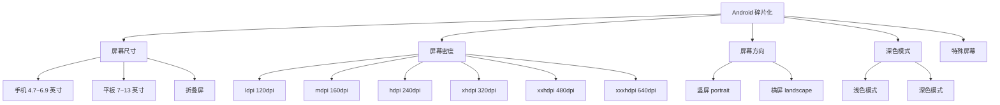

### 不适配的后果

| 问题 | 表现 |
|------|------|
| 布局错位 | 按钮重叠、文字截断 |
| 图片模糊 | 低密度图片放大显示 |
| 尺寸失真 | 大屏手机元素过大 |
| 体验割裂 | 横竖屏切换布局丢失 |

---

## 3. 核心概念

### 适配策略全景

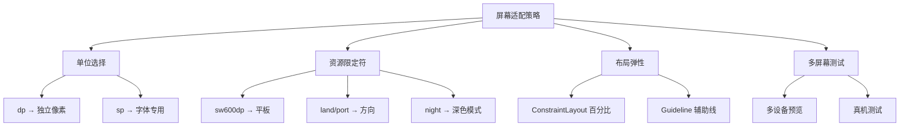

**术语解释：**
- **屏幕适配（Screen Adaptation）**：让 App 在不同屏幕尺寸、密度、方向的设备上都能正常显示。Android 设备碎片化严重——手机、平板、折叠屏、TV，屏幕尺寸从 4 英寸到 13 英寸不等，密度从 120dpi 到 640dpi 不等。
- **dp（density-independent pixel）**：密度无关像素，160dpi 屏幕上 1dp = 1px。不同密度屏幕上，dp 值对应的 px 值不同，但物理尺寸相同。
- **sp（scale-independent pixel）**：可缩放像素，和 dp 类似但跟随系统字体缩放设置。
- **资源限定符（Resource Qualifier）**：附加在资源目录名后的修饰符，告诉系统"当设备满足某个条件时使用这个目录的资源"。比如 `values-night` 表示"深色模式时使用"。
- **sw600dp（smallest width 600dp）**：最小宽度限定符。设备屏幕的较小边（通常是宽度）≥600dp 时匹配。7 英寸平板通常 sw≥600dp。
- **land / port**：横屏（landscape）/ 竖屏（portrait）方向限定符。
- **night**：深色模式限定符。系统设置为深色模式时，使用 `values-night/` 下的资源。
- **Guideline 辅助线**：ConstraintLayout 中的虚拟参考线，用于实现百分比布局。

### dp 与 px 换算

| 密度 | dpi | 比例 | 1dp = ?px |
|------|-----|------|-----------|
| ldpi | 120 | 0.75x | 0.75px |
| mdpi | 160 | 1x | 1px |
| hdpi | 240 | 1.5x | 1.5px |
| xhdpi | 320 | 2x | 2px |
| xxhdpi | 480 | 3x | 3px |
| xxxhdpi | 640 | 4x | 4px |

**换算公式**：`px = dp × (dpi / 160)`

### 资源限定符优先级

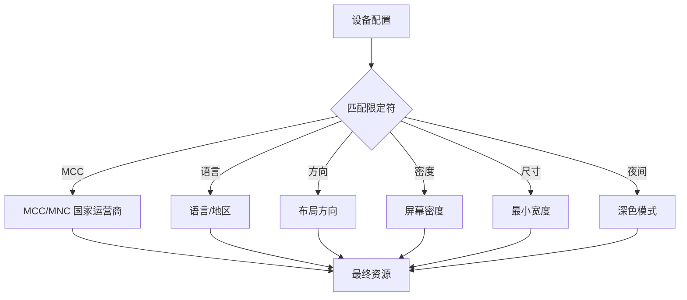

**优先级从高到低**：MCC → 语言 → 屏幕方向 → 密度 → 最小宽度 → 夜间模式

---

## 4. 基础用法

### 4.1 dp 单位使用

```xml
<!-- ✅ 使用 dp 定义尺寸 -->
<Button
    android:layout_width="120dp"
    android:layout_height="48dp"
    android:textSize="16sp"
    android:padding="12dp" />

<!-- ❌ 错误：使用 px -->
<Button
    android:layout_width="360px"
    android:layout_height="144px" />
```

### 4.2 sp 单位使用

```xml
<!-- ✅ 使用 sp 定义字体（跟随系统字体缩放） -->
<TextView
    android:textSize="16sp"
    android:lineSpacingMultiplier="1.2" />

<!-- 特殊场景：不随系统缩放的字体（如标题） -->
<TextView
    android:textSize="14sp"
    android:textScaleX="1.0" />
```

### 4.3 资源限定符目录

```
res/
├── values/
│   └── strings.xml          # 默认（手机竖屏）
├── values-sw600dp/
│   └── strings.xml          # 平板（最小宽度600dp）
├── values-sw720dp/
│   └── strings.xml          # 大平板
├── values-night/
│   └── colors.xml           # 深色模式颜色
├── layout/
│   └── activity_main.xml    # 手机布局
├── layout-sw600dp/
│   └── activity_main.xml    # 平板布局
├── layout-land/
│   └── activity_main.xml    # 横屏布局
├── drawable-mdpi/
│   └── icon.png             # mdpi 图标
├── drawable-xhdpi/
│   └── icon.png             # xhdpi 图标
└── drawable-xxhdpi/
    └── icon.png             # xxhdpi 图标
```

### 4.4 ConstraintLayout 百分比布局

```xml
<androidx.constraintlayout.widget.ConstraintLayout
    xmlns:android="http://schemas.android.com/apk/res/android"
    xmlns:app="http://schemas.android.com/apk/res-auto"
    android:layout_width="match_parent"
    android:layout_height="match_parent">

    <!-- Guideline：25% 处的水平辅助线 -->
    <androidx.constraintlayout.widget.Guideline
        android:id="@+id/guidelineTop"
        android:layout_width="wrap_content"
        android:layout_height="wrap_content"
        android:orientation="horizontal"
        app:layout_constraintGuide_percent="0.25" />

    <!-- Guideline：50% 处的垂直辅助线 -->
    <androidx.constraintlayout.widget.Guideline
        android:id="@+id/guidelineMiddle"
        android:layout_width="wrap_content"
        android:layout_height="wrap_content"
        android:orientation="vertical"
        app:layout_constraintGuide_percent="0.5" />

    <!-- 顶部内容：占 25% 高度 -->
    <TextView
        android:id="@+id/tvHeader"
        android:layout_width="0dp"
        android:layout_height="0dp"
        android:text="Header"
        android:gravity="center"
        app:layout_constraintTop_toTopOf="parent"
        app:layout_constraintBottom_toTopOf="@id/guidelineTop"
        app:layout_constraintStart_toStartOf="parent"
        app:layout_constraintEnd_toEndOf="parent" />

    <!-- 左半部分：占 50% 宽度 -->
    <TextView
        android:id="@+id/tvLeft"
        android:layout_width="0dp"
        android:layout_height="0dp"
        android:text="Left"
        android:background="#E3F2FD"
        app:layout_constraintTop_toBottomOf="@id/guidelineTop"
        app:layout_constraintBottom_toBottomOf="parent"
        app:layout_constraintStart_toStartOf="parent"
        app:layout_constraintEnd_toStartOf="@id/guidelineMiddle" />

    <!-- 右半部分：占 50% 宽度 -->
    <TextView
        android:id="@+id/tvRight"
        android:layout_width="0dp"
        android:layout_height="0dp"
        android:text="Right"
        android:background="#FFF3E0"
        app:layout_constraintTop_toBottomOf="@id/guidelineTop"
        app:layout_constraintBottom_toBottomOf="parent"
        app:layout_constraintStart_toEndOf="@id/guidelineMiddle"
        app:layout_constraintEnd_toEndOf="parent" />
</androidx.constraintlayout.widget.ConstraintLayout>
```

### 4.5 深色模式适配

```xml
<!-- res/values/colors.xml -->
<resources>
    <color name="bg_primary">#FFFFFF</color>
    <color name="text_primary">#212121</color>
    <color name="text_secondary">#757575</color>
</resources>

<!-- res/values-night/colors.xml -->
<resources>
    <color name="bg_primary">#121212</color>
    <color name="text_primary">#E0E0E0</color>
    <color name="text_secondary">#9E9E9E</color>
</resources>
```

```kotlin
// 强制深色模式（无 DayNight 主题时）
AppCompatDelegate.setDefaultNightMode(AppCompatDelegate.MODE_NIGHT_YES)

// 跟随系统
AppCompatDelegate.setDefaultNightMode(AppCompatDelegate.MODE_NIGHT_FOLLOW_SYSTEM)
```

---

## 5. 实战场景示例

### 5.1 手机/平板双布局

```xml
<!-- res/layout/activity_main.xml（手机） -->
<LinearLayout
    android:layout_width="match_parent"
    android:layout_height="match_parent"
    android:orientation="vertical">

    <FrameLayout
        android:id="@+id/fragmentContainer"
        android:layout_width="match_parent"
        android:layout_height="0dp"
        android:layout_weight="1" />
</LinearLayout>
```

```xml
<!-- res/layout-sw600dp/activity_main.xml（平板） -->
<LinearLayout
    android:layout_width="match_parent"
    android:layout_height="match_parent"
    android:orientation="horizontal">

    <!-- 左侧列表 -->
    <FrameLayout
        android:id="@+id/listContainer"
        android:layout_width="0dp"
        android:layout_height="match_parent"
        android:layout_weight="1" />

    <!-- 右侧详情 -->
    <FrameLayout
        android:id="@+id/detailContainer"
        android:layout_width="0dp"
        android:layout_height="match_parent"
        android:layout_weight="2" />
</LinearLayout>
```

### 5.2 横竖屏切换

```xml
<!-- res/layout/activity_player.xml（竖屏：上下排列） -->
<LinearLayout
    android:layout_width="match_parent"
    android:layout_height="match_parent"
    android:orientation="vertical">

    <VideoView
        android:id="@+id/videoView"
        android:layout_width="match_parent"
        android:layout_height="0dp"
        android:layout_weight="1" />

    <RecyclerView
        android:id="@+id/rvComments"
        android:layout_width="match_parent"
        android:layout_height="0dp"
        android:layout_weight="2" />
</LinearLayout>
```

```xml
<!-- res/layout-land/activity_player.xml（横屏：左右排列） -->
<LinearLayout
    android:layout_width="match_parent"
    android:layout_height="match_parent"
    android:orientation="horizontal">

    <VideoView
        android:id="@+id/videoView"
        android:layout_width="0dp"
        android:layout_height="match_parent"
        android:layout_weight="2" />

    <RecyclerView
        android:id="@+id/rvComments"
        android:layout_width="0dp"
        android:layout_height="match_parent"
        android:layout_weight="1" />
</LinearLayout>
```

### 5.3 多密度图片适配

```
res/
├── drawable-mdpi/      # 48×48 px
│   └── icon.png
├── drawable-hdpi/      # 72×72 px
│   └── icon.png
├── drawable-xhdpi/     # 96×96 px
│   └── icon.png
├── drawable-xxhdpi/    # 144×144 px
│   └── icon.png
└── drawable-xxxhdpi/   # 192×192 px
    └── icon.png
```

**图片尺寸计算**：
- 基准：mdpi（160dpi），1dp = 1px
- xhdpi（320dpi）：1dp = 2px
- 如果设计稿是 xxhdpi（144×144 px），则实际尺寸 = 144 ÷ 3 = 48dp

---

## 6. 常见错误与避坑

### ❌ → ✅ Before/After 对比

#### 错误 1：使用 px 而非 dp

```xml
<!-- ❌ 错误：固定像素值 -->
<TextView
    android:layout_width="300px"
    android:textSize="24px" />

<!-- ✅ 正确：使用密度无关像素 -->
<TextView
    android:layout_width="300dp"
    android:textSize="24sp" />
```

#### 错误 2：字体使用 dp 而非 sp

```xml
<!-- ❌ 错误：字体用 dp 不跟随系统缩放 -->
<TextView
    android:textSize="16dp" />

<!-- ✅ 正确：字体用 sp 跟随系统缩放 -->
<TextView
    android:textSize="16sp" />
```

#### 错误 3：硬编码字符串

```kotlin
// ❌ 错误：硬编码字符串
textView.text = "Hello World"

// ✅ 正确：使用字符串资源
textView.text = getString(R.string.greeting)
```

### 错误速查表

| 错误现象 | 原因 | 解决方案 |
|---------|------|---------|
| 不同密度屏幕图标模糊 | 图片资源缺失 | 补全各密度图片 |
| 横竖屏布局错乱 | 没有 land 目录布局 | 创建 layout-land |
| 平板布局和手机一样 | 没有 sw600dp 布局 | 创建 layout-sw600dp |
| 深色模式背景刺眼 | 没有 night 颜色 | 创建 values-night |
| 字体太大/太小 | 用了 dp 而非 sp | 改为 sp |
| 固定宽度溢出 | 硬编码 px | 使用 dp + wrap_content |
| 按钮在大屏上太大 | 没有限制最大宽度 | 设置 maxWidth |

---

## 7. 优势与局限

### 各适配方案对比

| 方案 | 优势 | 局限 | 适用场景 |
|------|------|------|---------|
| dp/sp | 简单直接 | 不能适配超大屏 | 基础尺寸 |
| 资源限定符 | 精准适配不同配置 | 目录数量爆炸 | 平板/横屏/夜间 |
| ConstraintLayout 百分比 | 弹性布局，自动适配 | 复杂布局约束多 | 响应式 UI |
| Guideline | 精确控制比例位置 | 需要计算百分比 | 分屏/卡片布局 |
| 最小宽度限定符 | 适配不同屏幕段 | 只能按最小宽度分 | 手机/平板区分 |

---

## 8. 进阶技巧

### 8.1 动态获取屏幕信息

```kotlin
fun getScreenInfo(context: Context): ScreenInfo {
    val metrics = context.resources.displayMetrics
    val widthDp = (metrics.widthPixels / metrics.density).toInt()
    val heightDp = (metrics.heightPixels / metrics.density).toInt()
    val density = metrics.densityDpi

    return ScreenInfo(
        widthPx = metrics.widthPixels,
        heightPx = metrics.heightPixels,
        widthDp = widthDp,
        heightDp = heightDp,
        density = density,
        densityName = when {
            density <= 120 -> "ldpi"
            density <= 160 -> "mdpi"
            density <= 240 -> "hdpi"
            density <= 320 -> "xhdpi"
            density <= 480 -> "xxhdpi"
            else -> "xxxhdpi"
        }
    )
}

data class ScreenInfo(
    val widthPx: Int,
    val heightPx: Int,
    val widthDp: Int,
    val heightDp: Int,
    val density: Int,
    val densityName: String
)
```

### 8.2 代码中设置 dp 值

```kotlin
// dp 转 px
fun dpToPx(context: Context, dp: Int): Int {
    return (dp * context.resources.displayMetrics.density).toInt()
}

// sp 转 px
fun spToPx(context: Context, sp: Int): Int {
    return (sp * context.resources.displayMetrics.scaledDensity).toInt()
}

// 使用示例
val marginPx = dpToPx(context, 16)
val textSizePx = spToPx(context, 14)
```

### 8.3 折叠屏适配

```kotlin
// Jetpack WindowManager 检测折叠状态
val windowInfoTracker = WindowInfoTracker.getOrCreate(this)

lifecycleScope.launch {
    windowInfoTracker.windowLayoutInfo(this@MainActivity)
        .collect { layoutInfo ->
            val displayFeatures = layoutInfo.displayFeatures
            for (feature in displayFeatures) {
                if (feature is FoldingFeature) {
                    when (feature.state) {
                        FoldingFeature.State.FLAT -> {
                            // 展开状态：可显示双栏
                        }
                        FoldingFeature.State.HALF_OPENED -> {
                            // 折叠状态：单栏布局
                        }
                    }
                }
            }
        }
}
```

### 8.4 屏幕尺寸类别判断

```kotlin
fun getScreenSizeCategory(context: Context): ScreenSizeCategory {
    val widthDp = context.resources.displayMetrics.widthPixels /
        context.resources.displayMetrics.density

    return when {
        widthDp < 600 -> ScreenSizeCategory.COMPACT   // 手机
        widthDp < 840 -> ScreenSizeCategory.MEDIUM    // 小平板/折叠屏展开
        else -> ScreenSizeCategory.EXPANDED           // 大平板/桌面
    }
}

enum class ScreenSizeCategory { COMPACT, MEDIUM, EXPANDED }
```

---

## 9. 面试高频考点

### Q1：dp、sp、px 的区别？

**答**：
- **px**：物理像素，不同密度屏幕显示大小不同，不推荐使用
- **dp**：密度无关像素，160dpi 屏幕上 1dp = 1px，用于布局尺寸
- **sp**：可缩放像素，和 dp 一样但跟随系统字体缩放设置，用于字体大小

### Q2：如何判断当前设备是手机还是平板？

**答**：
- **代码方式**：`resources.configuration.smallestScreenWidthDp >= 600`
- **资源方式**：创建 `values-sw600dp` 和 `layout-sw600dp` 目录
- **推荐**：资源限定符方式，无需代码判断

### Q3：night 模式的原理？

**答**：Android 8.0+ 支持，App 主题继承 `DayNight`，系统自动根据设置切换浅色/深色资源。需要在 `values-night/` 下提供对应资源（颜色、drawable 等），代码中可通过 `AppCompatDelegate.setDefaultNightMode()` 强制切换。

### Q4：ConstraintLayout 百分比布局的优势？

**答**：使用 `app:layout_constraintWidth_percent` 和 `Guideline` 的 `layout_constraintGuide_percent`，可以精确控制 View 在屏幕中的比例位置，无需代码计算，完美适配不同屏幕尺寸。

### Q5：为什么不能用绝对像素值？

**答**：同一 dp 值在不同密度屏幕上显示的物理尺寸相同，但 px 值不同。例如 16dp 在 mdpi=16px，xxhdpi=48px。用 px 会导致高密度屏幕上元素过小，低密度屏幕上元素过大。

---

## 10. 小结与下一步

### 快速参考卡

```
┌──────────────────────────────────────────────────┐
│           屏幕适配速查卡                          │
├──────────────────────────────────────────────────┤
│  单位选择:                                         │
│    布局尺寸  → dp                                  │
│    字体大小  → sp                                  │
│    绝对像素  → 避免使用                             │
│                                                   │
│  资源限定符:                                        │
│    sw600dp   → 平板                                │
│    land      → 横屏                                │
│    night     → 深色模式                             │
│    mdpi/xhdpi → 不同密度                            │
│                                                   │
│  百分比布局:                                        │
│    Guideline     → 辅助线                          │
│    width_percent → 宽度比例                         │
│    height_percent → 高度比例                        │
│                                                   │
│  dp 换算:                                          │
│    px = dp × (dpi / 160)                          │
│    16dp 在 xhdpi = 32px                           │
└──────────────────────────────────────────────────┘
```

### 下一步学习

| 主题 | 内容 | 推荐指数 |
|------|------|---------|
| WindowInsets | 处理刘海/状态栏/导航栏 | ⭐⭐⭐ |
| Compose | 声明式 UI 自动适配 | ⭐⭐⭐ |
| Material You | 动态主题颜色 | ⭐⭐ |
| WindowManager | 折叠屏适配 | ⭐⭐ |

---

## 课后练习

1. 为同一个 Activity 创建手机版和平板版两套布局
2. 实现深色模式适配（浅色/深色两套颜色方案）
3. 用 ConstraintLayout 百分比实现一个卡片式布局（占屏幕 80% 宽，60% 高）

---

## 自测题

1. 1dp 在 xxhdpi 屏幕上等于多少 px？
2. 为什么字体大小要用 sp 而非 dp？
3. sw600dp 限定符表示什么含义？

---

## 常见学生错误

| 错误 | 正确做法 |
|------|---------|
| 字体用 dp 而非 sp | 字体始终使用 sp |
| 不提供多密度图片 | 提供 mdpi/xhdpi/xxhdpi/xxxhdpi |
| 忘记 night 模式资源 | 创建 values-night 目录 |
| 横屏布局和竖屏相同 | 创建 layout-land 目录 |
| 硬编码屏幕尺寸 | 使用 dp 或百分比 |

---

## 教学提示

- 用不同密度模拟器对比 px 和 dp 的显示效果
- 用 Layout Preview 切换配置（屏幕尺寸、方向、夜间）实时预览
- dp 换算让学生手算几个例子加深理解
- 深色模式用真机切换效果更直观

---

## 🎬 渲染逻辑详解

### 屏幕适配对渲染的影响

屏幕适配的核心问题是**同一套代码在不同设备上渲染结果不一致**：

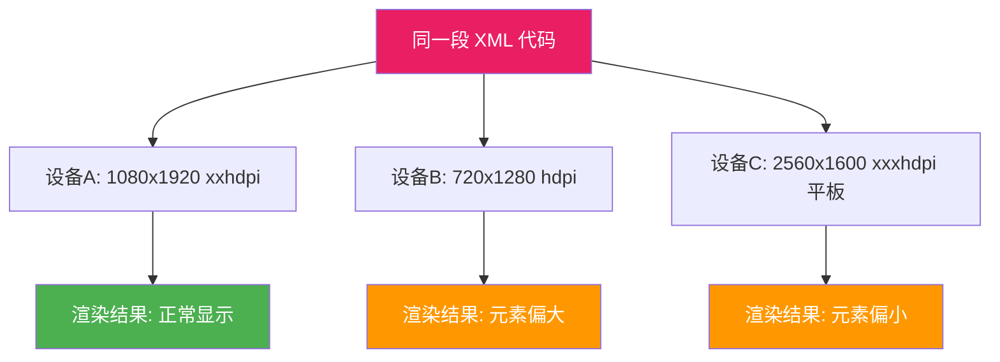

### dp 单位的渲染原理

```plaintext
dp（密度无关像素）的渲染转换：
  
  设备A (xxhdpi, 320dpi):
    1dp = 1 × (320/160) = 2px
    100dp = 200px
  
  设备B (hdpi, 240dpi):
    1dp = 1 × (240/160) = 1.5px
    100dp = 150px
  
  设备C (xxxhdpi, 480dpi):
    1dp = 1 × (480/160) = 3px
    100dp = 300px
  
  结果：100dp 在所有设备上显示的物理尺寸相同
```

### 资源限定符的渲染选择

```plaintext
系统如何选择资源：
  
  设备配置: 屏幕宽度 600dp, 竖屏, 深色模式, xxhdpi
  
  资源目录匹配顺序（优先级从高到低）:
    1. MCC/MNC（国家/运营商）→ 不匹配
    2. 语言/地区 → 匹配 zh-rCN
    3. 布局方向 → 不匹配
    4. 屏幕方向 → 匹配 port（竖屏）
    5. 屏幕密度 → 匹配 xxhdpi
    6. 最小宽度 → 匹配 sw600dp（平板）
    7. 夜间模式 → 匹配 night（深色）
  
  最终选择: values-zh-rCN-night-sw600dp-xxhdpi/
```

### ConstraintLayout 百分比的渲染机制

```plaintext
百分比布局的渲染过程：
  
  Guideline: layout_constraintGuide_percent="0.3"
    → 计算: Guideline 位置 = parentWidth × 0.3
  
  View: layout_constraintWidth_percent="0.5"
    → 计算: View 宽度 = parentWidth × 0.5
  
  无论屏幕尺寸如何变化，比例关系保持不变
  这就是响应式布局的渲染原理
```

---

## 🔗 知识依赖图

### 与前后章节的关系

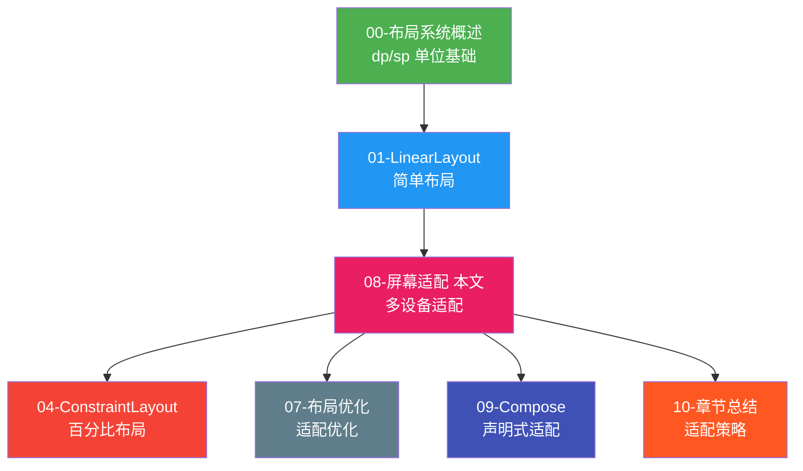

### 核心知识点的章节串联

| 知识点 | 本章内容 | 关联章节 | 关联说明 |
|--------|---------|---------|---------|
| **dp/sp 单位** | 密度无关像素 | 00-概述 | 00 章引入 dp 概念 |
| **资源限定符** | 按设备配置选择资源 | 00-概述 | 00 章介绍资源目录结构 |
| **Guideline 百分比** | 弹性布局 | 04-ConstraintLayout | 04 章详解 Guideline |
| **sw600dp 平板** | 不同屏幕布局 | 06-RecyclerView | 平板用 GridLayoutManager |
| **night 深色模式** | 颜色适配 | 09-Compose | Compose 主题自动适配 |
| **横屏适配** | layout-land | 05-ScrollView | 横屏滚动方向变化 |
| **折叠屏** | WindowManager API | 04-ConstraintLayout | ConstraintLayout 弹性布局 |

### 组件关系图

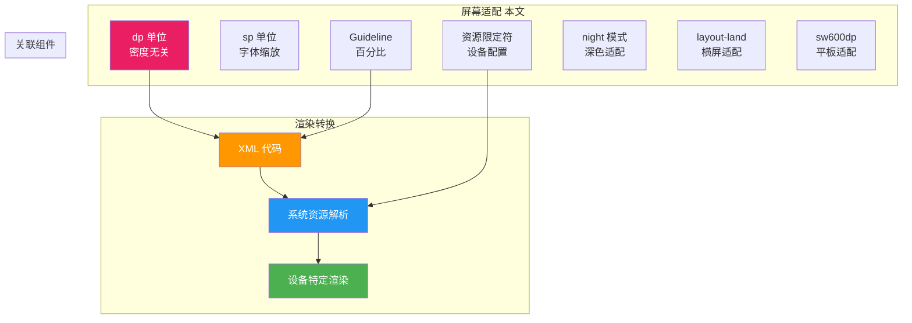

---

## 实战项目

**项目**：适配手机/平板/深色模式的新闻列表 App

**要求**：
- 手机版：单栏列表，点击进入详情
- 平板版（sw600dp）：左侧列表 + 右侧详情双栏布局
- 深色模式：浅色/深色两套颜色方案
- 图片资源：提供 mdpi/xhdpi/xxhdpi/xxxhdpi 四套
- 横屏适配：创建 layout-land 布局
- 所有尺寸使用 dp，字体使用 sp

**技术栈**：ConstraintLayout + 资源限定符 + DayNight 主题 + ViewBinding

---

## 代码审查清单

- [ ] 所有尺寸使用 dp，字体使用 sp
- [ ] 没有硬编码的 px 值
- [ ] 提供了 xhdpi/xxhdpi 图片资源
- [ ] 创建了 sw600dp 平板布局（如果需要）
- [ ] 创建了 land 横屏布局（如果需要）
- [ ] 支持深色模式（values-night）
- [ ] 使用字符串资源（无硬编码字符串）
- [ ] ConstraintLayout 使用百分比/Guideline 实现弹性布局
- [ ] 测试了至少 3 种屏幕配置

---

## 术语表

| 术语 | 含义 |
|------|------|
| dp | 密度无关像素，160dpi 屏幕上 1dp=1px |
| sp | 可缩放像素，跟随系统字体缩放 |
| px | 物理像素，不同密度屏幕显示不同 |
| dpi | 每英寸点数，衡量屏幕密度 |
| density | 密度比例，mdpi=1.0，xhdpi=2.0 |
| sw600dp | 最小宽度限定符，适配平板 |
| land | 横屏方向限定符 |
| night | 深色模式限定符 |
| Guideline | ConstraintLayout 中的辅助线 |
| DayNight | 支持浅色/深色主题切换的基类 |
| WindowInsets | 处理系统栏（状态栏/导航栏）的 API |

---

## 🔬 密度转换与资源匹配底层深度解析

> 本节从 Android Framework 最底层机制出发，深入剖析 dp/sp 如何转换为物理像素、资源如何被匹配、Bitmap 如何被重采样，以及在多窗口/折叠屏等新形态下的适配原理。
> **难度分级**：⭐⭐⭐⭐ 高级
> **阅读建议**：先掌握前文 1~9 章基础，再阅读本节理解底层机制。

---

### 11.1 dp/sp 的底层转换公式与 DisplayMetrics

#### 11.1.1 核心转换公式

Android Framework 中所有尺寸单位的最终归宿都是物理像素（px），转换发生在 `TypedValue.applyDimension()` 方法中：

```java
// TypedValue.java（AOSP 源码简化）
public static float applyDimension(int unit, float value, DisplayMetrics metrics) {
    switch (unit) {
        case COMPLEX_UNIT_PX:    return value;                              // px 直接返回
        case COMPLEX_UNIT_DIP:   return value * metrics.density;           // dp × density
        case COMPLEX_UNIT_SP:    return value * metrics.scaledDensity;     // sp × scaledDensity
        case COMPLEX_UNIT_PT:    return value * metrics.xdpi * (1.0f/72);  // 点
        case COMPLEX_UNIT_IN:    return value * metrics.xdpi;              // 英寸
        case COMPLEX_UNIT_MM:    return value * metrics.xdpi * (1.0f/25.4f); // 毫米
    }
    return 0;
}
```

关键公式：

```
px = dp × (densityDpi / 160)
px = sp × scaledDensity
scaledDensity = density × fontScale
```

**术语解释（货币汇率换算类比）：**
- **dp（density-independent pixel，密度无关像素）**：类似"国际货币单位"，本身不带任何国家的面值。要花出去，必须按"汇率"换算成当地货币（px）。160dpi 是基准汇率（1:1），密度越高汇率越大。
- **px（pixel，物理像素）**：类似"当地现金"，屏幕上真实存在的最小发光点。同一 dp 在不同密度屏幕换算出的 px 数量不同，但购买力（物理尺寸）相同。
- **density（密度比例）**：类似"汇率倍数"，等于 `densityDpi / 160`。mdpi=1.0，xhdpi=2.0，xxhdpi=3.0。
- **densityDpi（屏幕密度 DPI）**：类似"当地物价指数"，每英寸点数。Android 把它归为 ldpi/mdpi/hdpi/xhdpi/xxhdpi/xxxhdpi 六档。
- **scaledDensity（缩放密度）**：类似"汇率 × 附加费率"，等于 `density × fontScale`。字体大小设置越大，附加费率越高，同样的 sp 换算出的 px 越多。

#### 11.1.2 DisplayMetrics 三大核心字段

`DisplayMetrics` 是 Android 描述屏幕物理属性的核心数据结构，位于 `android.util` 包。它承载了所有密度换算需要的"汇率表"：

```kotlin
val metrics = context.resources.displayMetrics
// 三个最核心的"汇率"字段
metrics.density          // Float，密度比例，如 3.0（xxhdpi）
metrics.densityDpi       // Int，屏幕 DPI，如 480
metrics.scaledDensity    // Float，字体缩放密度 = density × fontScale
```

| 字段 | 类型 | 含义 | 典型值（xxhdpi） | 用于 |
|------|------|------|------------------|------|
| `density` | Float | 密度比例 = densityDpi / 160 | 3.0 | dp → px 换算 |
| `densityDpi` | Int | 屏幕物理 DPI | 480 | 判断密度档位 |
| `scaledDensity` | Float | 字体缩放密度 = density × fontScale | 3.0 × 1.2 = 3.6 | sp → px 换算 |
| `xdpi` | Float | X 轴精确 DPI（物理） | 403.0 | pt/in/mm 换算 |
| `ydpi` | Float | Y 轴精确 DPI（物理） | 403.0 | pt/in/mm 换算 |
| `widthPixels` | Int | 屏幕宽度 px | 1080 | 像素分辨率 |
| `heightPixels` | Int | 屏幕高度 px | 1920 | 像素分辨率 |

**三者关系**：
```
density = densityDpi / 160          // 系统启动时根据屏幕物理参数计算
scaledDensity = density × fontScale  // 用户在"设置-显示-字体大小"调整时改变
```

**术语解释（仪表盘类比）：**
- **DisplayMetrics**：类似汽车的"仪表盘"，集中显示所有屏幕参数。系统每次配置变化（旋转、多窗口）都会刷新这块仪表盘。
- **density vs densityDpi**：`densityDpi` 是原始读数（类似时速 120km/h），`density` 是归一化倍数（类似"2 倍速"）。前者用于判断档位，后者用于直接乘法换算。
- **scaledDensity**：在 `density` 基础上叠加了用户的字体偏好（`fontScale`），是 sp 专用的"汇率"。

#### 11.1.3 dp → px 转换流程图

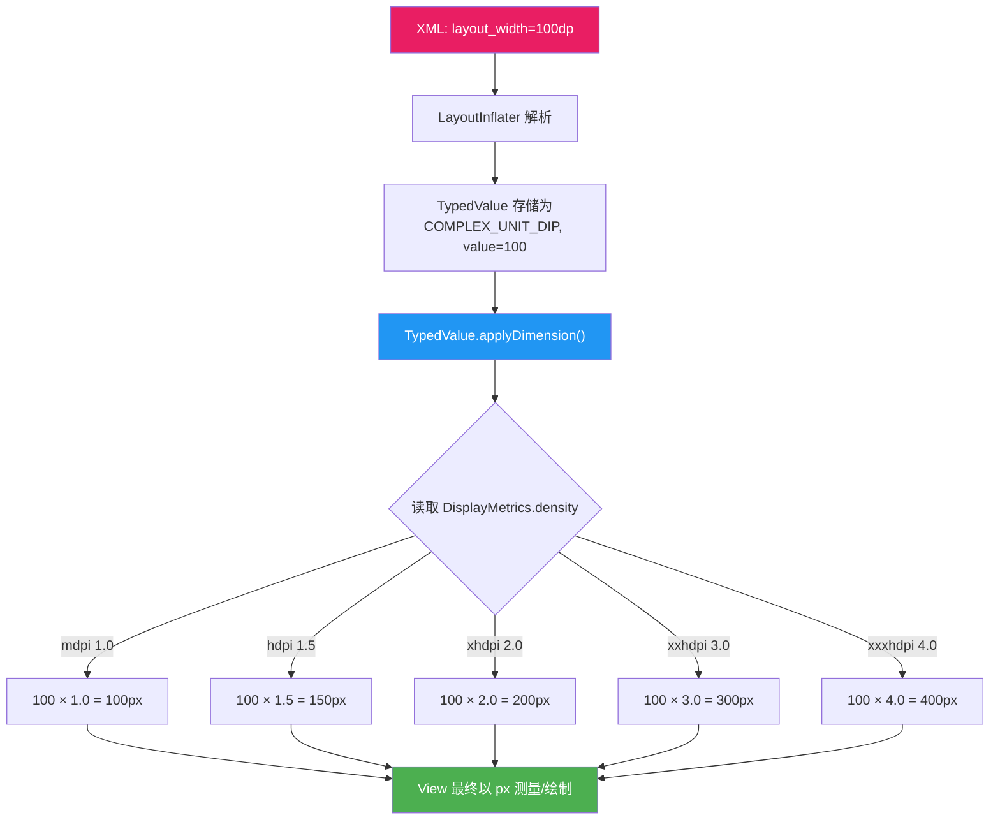

**关键洞察**：dp 值到 px 的转换发生在 `LayoutInflater` 解析 XML 阶段（即 View 的 measure 之前）。一旦 View 完成测量，内部存储的都是 px 值。这就是为什么代码中动态设置尺寸需要手动调用 `dpToPx()` 转换。

---

### 11.2 资源限定符匹配算法

#### 11.2.1 匹配机制概述

Android 的资源匹配并非简单的"目录名相等"判断，而是一套基于**配置限定符优先级**的打分算法。`AssetManager` 负责遍历所有候选资源目录，为每个目录打分，选出"最匹配"的那个。

**术语解释（海关申报通道类比）：**
- **资源限定符匹配（Resource Qualifier Matching）**：类似过海关时有多个申报通道（外交、普通、特殊物品）。系统会依次检查你的"配置属性"（国籍=语言、携带物=密度、目的=方向），引导你进入最匹配的通道。优先级高的属性先判定。
- **AssetManager**：类似"海关总署"，管理 APK 内所有资源（res/）的索引和查找。它维护一个资源 ID → 候选路径列表的映射表。
- **Configuration**：类似"旅客信息卡"，记录设备当前所有配置（屏幕密度、方向、语言、夜间模式等）。

#### 11.2.2 完整限定符优先级表

Android 官方定义的限定符优先级（从高到低）：

| 优先级 | 限定符 | 示例 | 含义 |
|--------|--------|------|------|
| 1 | MCC/MNC | `mcc310-mnc004` | 移动国家码/网络码 |
| 2 | 语言和地区 | `zh-rCN`, `en` | 语言和区域 |
| 3 | 布局方向 | `ldrtl`, `ldltr` | 布局方向（RTL/LTR） |
| 4 | smallestWidth | `sw600dp` | 最小可用宽度 |
| 5 | 可用宽度 | `w720dp` | 屏幕可用宽度 |
| 6 | 可用高度 | `h1024dp` | 屏幕可用高度 |
| 7 | 屏幕尺寸 | `small`, `normal`, `large`, `xlarge` | 屏幕尺寸类别（旧） |
| 8 | 屏幕纵横比 | `long`, `notlong` | 宽高比 |
| 9 | 屏幕方向 | `port`, `land` | 方向 |
| 10 | UI 模式 | `car`, `desk`, `television`, `appliance`, `watch` | UI 模式 |
| 11 | 夜间模式 | `night`, `notnight` | 深色模式 |
| 12 | 屏幕像素密度 | `ldpi` ~ `xxxhdpi`, `nodpi`, `tvdpi` | 屏幕密度 |
| 13 | 触摸屏类型 | `notouch`, `finger` | 触摸屏 |
| 14 | 键盘可用性 | `keysexposed`, `keyshidden` | 键盘 |
| 15 | 文字输入法 | `nokeys`, `qwerty`, `12key` | 键盘类型 |
| 16 | 导航可用性 | `navexposed`, `navhidden` | 导航键 |
| 17 | 导航类型 | `nonav`, `dpad`, `trackball`, `wheel` | 导航方式 |
| 18 | 平台版本 | `v21`, `v24` | API 级别 |

#### 11.2.3 密度匹配的决策树

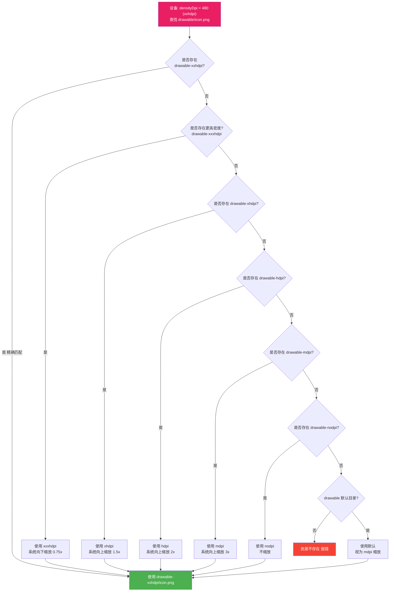

**匹配规则要点**：
1. **优先精确匹配**：设备是 xxhdpi，优先用 `drawable-xxhdpi`
2. **次选高密度**：没有精确匹配时，选**更高**密度（向下缩放，质量更好）
3. **再次选低密度**：没有更高密度时，选最近的低密度（向上缩放，可能模糊）
4. **默认 = mdpi**：`drawable/`（无限定符）等价于 `drawable-mdpi/`
5. **nodpi 例外**：`drawable-nodpi/` 资源永远不缩放，适合点九图等

**术语解释（鞋码匹配类比）：**
- 密度匹配类似买鞋：你穿 42 码（xxhdpi），店里只有 43 码（xxxhdpi）和 41 码（xhdpi）。系统优先给你 43 码再"垫鞋垫"缩小（向下缩放保质量），而不是穿 41 码撑大（向上缩放易模糊）。

---

### 11.3 Bitmap 的密度重采样机制

#### 11.3.1 问题场景

当 Bitmap 资源密度与设备屏幕密度不匹配时，Android 系统会**自动缩放** Bitmap 以保证物理尺寸一致。这种"隐式缩放"会带来内存暴涨和性能损耗。

**术语解释（照片放大类比）：**
- **Bitmap 密度重采样（Bitmap Density Resampling）**：类似用手机拍了一张 100×100 的小照片，但要在 4K 电视上全屏显示。系统会自动"放大"照片，但放大后每个像素要变成 16 个像素，内存占用暴增 16 倍，且画质不会变好（甚至模糊）。
- **inDensity / targetDensity**：Bitmap 的"原始密度"和"目标密度"。系统用 `targetDensity / inDensity` 作为缩放因子。

#### 11.3.2 从 ldpi 加载到 xxhdpi 的 4x 放大过程

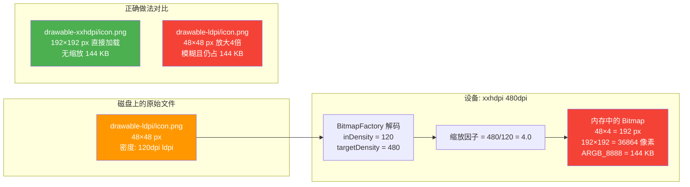

**内存消耗分析**：

| 加载来源 | 原始尺寸 | 设备密度 | 缩放因子 | 内存中尺寸 | 内存占用 (ARGB_8888) | 画质 |
|---------|---------|---------|---------|-----------|---------------------|------|
| `drawable-xxhdpi/` | 192×192 | 480 | 1.0 | 192×192 | 144 KB | 清晰 |
| `drawable-xhdpi/` | 128×128 | 480 | 1.5 | 192×192 | 144 KB | 轻微模糊 |
| `drawable-hdpi/` | 96×96 | 480 | 2.0 | 192×192 | 144 KB | 模糊 |
| `drawable-mdpi/` | 64×64 | 480 | 3.0 | 192×192 | 144 KB | 很模糊 |
| `drawable-ldpi/` | 48×48 | 480 | 4.0 | 192×192 | 144 KB | 严重模糊 |

> **关键结论**：无论从哪个密度目录加载，最终内存占用**相同**（都是 144KB）！但低密度图片放大后模糊。这就是"必须提供高密度原图"的根本原因。

#### 11.3.3 避免隐式缩放的代码实践

```kotlin
// ❌ 危险：系统自动缩放，可能 OOM
val bitmap = BitmapFactory.decodeResource(resources, R.drawable.large_image)

// ✅ 安全：禁用自动缩放，手动控制
val options = BitmapFactory.Options().apply {
    inScaled = false  // 禁止系统自动密度缩放
    // 或使用 inSampleSize 降采样
    inSampleSize = 2  // 宽高各缩小一半
}
val bitmap = BitmapFactory.decodeResource(resources, R.drawable.large_image, options)
```

---

### 11.4 wrap_content 与 match_parent 在不同密度下的行为差异

#### 11.4.1 行为对比

```kotlin
// 三种尺寸规格的本质区别
// wrap_content: 根据内容计算，与密度间接相关
// match_parent: 填满父容器，直接受屏幕 px 尺寸影响
// 具体dp值: 固定物理尺寸，通过 density 换算
```

| 属性值 | 计算方式 | 密度影响 | 物理尺寸一致性 |
|--------|---------|---------|--------------|
| `wrap_content` | 内容大小（文字/图片）+ padding | 间接（内容本身受密度影响） | 取决于内容 |
| `match_parent` | 父容器剩余空间 | 直接（父容器尺寸是 px） | 大屏更大 |
| `100dp` | `100 × density` px | 直接换算 | 始终一致 |

**术语解释（水杯装水类比）：**
- **wrap_content**：类似"刚好装满内容的水杯"，杯子大小取决于内容多少。
- **match_parent**：类似"把水倒满整个容器"，容器多大我就多大。
- **固定 dp**：类似"固定 300ml 的杯子"，不管放在大桌小桌上都是 300ml。

#### 11.4.2 不同密度下的行为差异图解

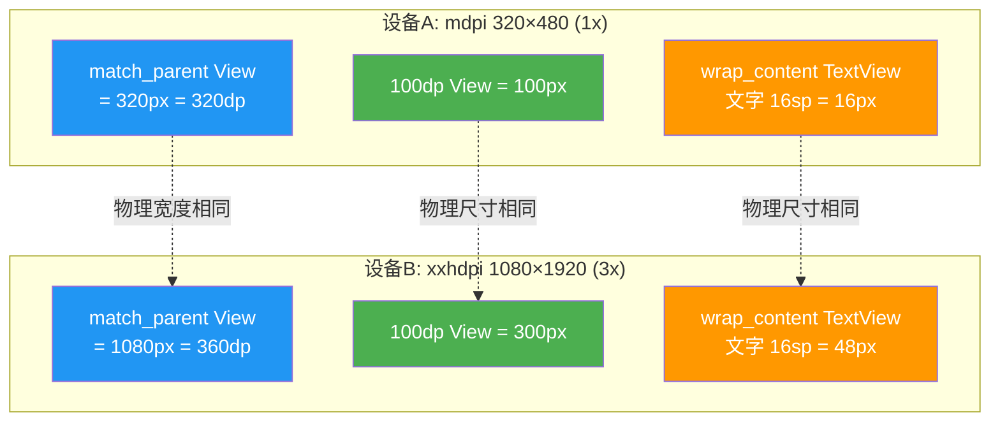

**关键差异**：
- `match_parent` 的 px 值随屏幕分辨率变化，但 dp 值也变化（因为不同屏幕 dp 宽度不同）
- `wrap_content` 的最终 px 取决于内容（如文字）的 sp/dp 换算结果
- 固定 dp 值的 px 变化，但物理毫米尺寸不变

---

### 11.5 字体缩放（Font Scale）的无障碍设计

#### 11.5.1 sp 与 dp 的本质区别

**术语解释（可调节老花镜类比）：**
- **fontScale（字体缩放因子）**：类似"可调节度数的老花镜"。用户在"设置 → 显示 → 字体大小"调整时，fontScale 从 0.85（小）到 1.3（超大）变化。sp 会乘以这个系数，dp 不会。
- **sp（scale-independent pixel）**：类似"自带调焦功能的老花镜"，度数随用户设置变化。
- **dp（density-independent pixel）**：类似"固定度数的老花镜"，不管用户怎么调，度数不变。

#### 11.5.2 sp → px 的双重转换流程

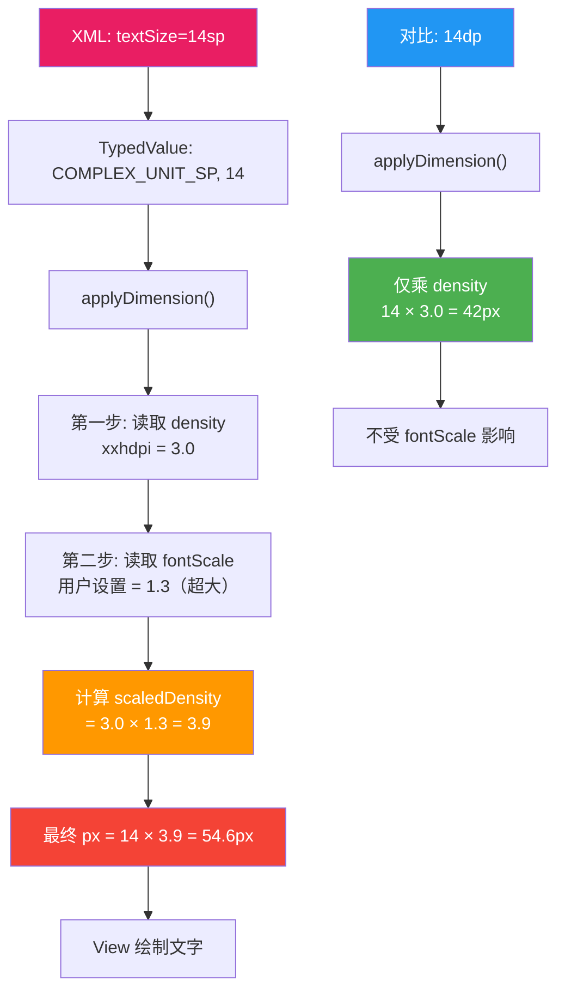

#### 11.5.3 无障碍设计的正确实践

```kotlin
// 获取当前字体缩放
val fontScale = resources.configuration.fontScale
// 小: 0.85, 默认: 1.0, 大: 1.15, 超大: 1.3

// 监听字体变化（需在 AndroidManifest 声明 configChanges）
override fun onConfigurationChanged(newConfig: Configuration) {
    super.onConfigurationChanged(newConfig)
    val newFontScale = newConfig.fontScale
    // 重新计算依赖字体的布局
}
```

```xml
<!-- AndroidManifest.xml -->
<activity
    android:name=".MainActivity"
    android:configChanges="fontScale|orientation|screenSize" />
```

**设计原则**：
- 文字**必须**用 sp（保证无障碍）
- 图标、间距用 dp（不应随字体缩放）
- 标题等固定排版文字，如果确实不缩放，用 dp 但需在注释说明原因

---

### 11.6 多窗口模式下的适配机制

#### 11.6.1 多窗口模式概述

Android 7.0（API 24）引入多窗口模式，允许两个 App 并排显示。此时屏幕的**可用尺寸**和**密度**会发生变化，触发 `onConfigurationChanged`。

**术语解释（分屏办公类比）：**
- **多窗口模式（Multi-Window Mode）**：类似把办公桌一分为二，两个员工同时办公。每人分到的桌面面积变小，但桌面密度不变。App 需要感知"我的办公区变小了"并调整布局。

#### 11.6.2 配置变化流程

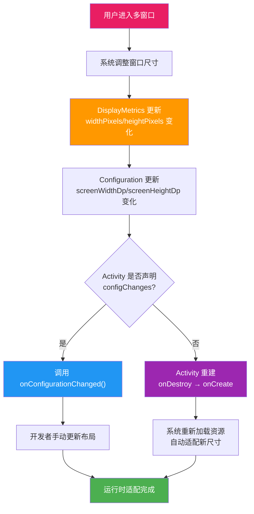

#### 11.6.3 多窗口中的 dp 计算变化

```kotlin
// 多窗口模式下，dp 值的计算基准不变，但可用 dp 数量变化
// 全屏: 1080×1920 px, xxhdpi(3.0) → 360×640 dp
// 分屏(左半): 540×1920 px, xxhdpi(3.0) → 180×640 dp ← 宽度减半!

val metrics = resources.displayMetrics
val widthDp = metrics.widthPixels / metrics.density
// 全屏: 360dp
// 分屏左半: 180dp ← 可能触发 sw 限定符变化
```

**关键点**：多窗口模式下 `density` 不变（屏幕物理密度没变），但 `widthPixels` 变小，导致 `widthDp` 变小。如果分屏后宽度低于 600dp，原本匹配 `sw600dp` 的布局会失效，系统可能重建 Activity 加载新布局。

---

### 11.7 折叠屏适配的底层机制

#### 11.7.1 Jetpack WindowManager 与 FoldingFeature

**术语解释（可变书桌类比）：**
- **FoldingFeature（折叠特征）**：类似一张"可折叠书桌"，系统告诉你铰链在哪、桌面是平的还是半开状态。App 根据这些信息决定布局形态。
- **DisplayFeature**：屏幕上的物理特征区域（铰链、刘海等），View 不应在此区域放置交互元素。
- **WindowMetrics**：当前窗口的真实可用区域，多窗口/折叠屏下会动态变化。

#### 11.7.2 FoldingFeature 核心属性

```kotlin
// FoldingFeature 核心属性
val foldingFeature: FoldingFeature = ...
foldingFeature.state           // FLAT（完全展开）| HALF_OPENED（半开）
foldingFeature.orientation     // HORIZONTAL（水平铰链）| VERTICAL（垂直铰链）
foldingFeature.bounds          // 铰链在屏幕上的 Rect 区域
foldingFeature.isSeparating    // 是否将屏幕分为两个逻辑区域
foldingFeature.occlusionType   // FULL（铰链遮挡）| NONE（不遮挡）
```

#### 11.7.3 折叠状态适配流程

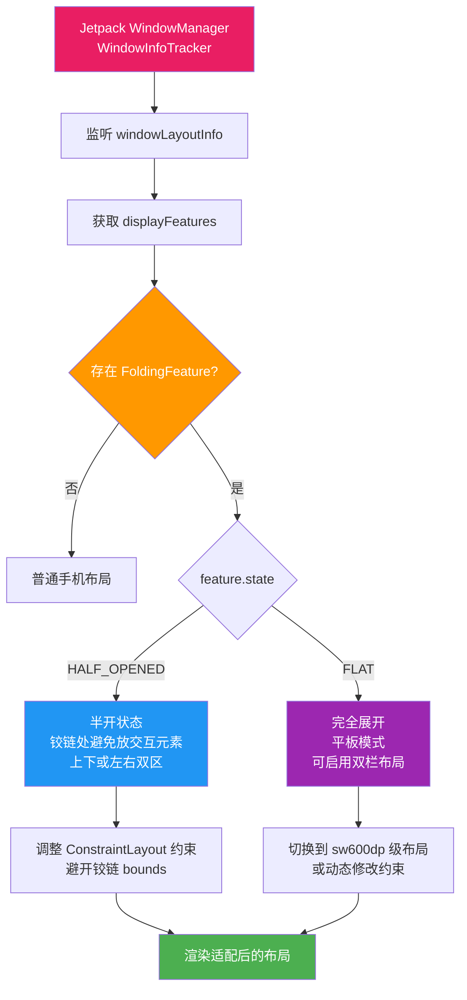

#### 11.7.4 实战代码：响应折叠状态

```kotlin
class FoldableActivity : AppCompatActivity() {
    override fun onCreate(savedInstanceState: Bundle?) {
        super.onCreate(savedInstanceState)
        // 使用 Jetpack WindowManager 监听折叠状态
        val windowInfoTracker = WindowInfoTracker.getOrCreate(this)
        lifecycleScope.launch {
            windowInfoTracker.windowLayoutInfo(this@FoldableActivity)
                .collect { layoutInfo ->
                    val foldingFeature = layoutInfo.displayFeatures
                        .filterIsInstance<FoldingFeature>()
                        .firstOrNull()

                    foldingFeature?.let { feature ->
                        when (feature.state) {
                            FoldingFeature.State.FLAT -> {
                                // 完全展开：双栏布局
                                binding.detailContainer.visibility = View.VISIBLE
                                // 调整 ConstraintLayout 约束
                                updateConstraintsForTabletop(feature)
                            }
                            FoldingFeature.State.HALF_OPENED -> {
                                // 半开：书签模式
                                // 铰链上方显示内容，下方显示控制
                                updateConstraintsForBookMode(feature)
                            }
                        }
                    }
                }
        }
    }

    private fun updateConstraintsForTabletop(feature: FoldingFeature) {
        val params = binding.content.layoutParams as ConstraintLayout.LayoutParams
        // 确保内容不跨越铰链
        if (feature.orientation == FoldingFeature.Orientation.HORIZONTAL) {
            params.topToTop = ConstraintLayout.LayoutParams.PARENT_ID
            params.bottomToTop = R.id.hingeGuideline
        }
        binding.content.layoutParams = params
    }
}
```

**适配要点总结**：
1. 铰链区域（`feature.bounds`）不应放置可交互元素
2. `HALF_OPENED` 适合"书签模式"（上下分区）
3. `FLAT` 适合"桌面模式"（可双栏并排）
4. 使用 `ConstraintLayout` 动态修改约束最灵活

---

## 📐 设计理念与架构图

> 本节从设计哲学层面讨论 Android 屏幕适配的设计理念、核心类的架构关系、主流适配方案原理及 Compose 的新范式。
> **难度分级**：⭐⭐⭐⭐⭐ 高级

---

### 12.1 "密度无关"的设计哲学

#### 12.1.1 为什么选择 dp 而非 px

**术语解释（公制单位类比）：**
- **密度无关（Density Independence）**：类似国际公制单位（米/千克）的设计哲学。全球统一用"米"而非"步长"，因为步长因人而异。Android 选择 dp 而非 px，同理——px 因屏幕而异，dp 跨屏幕一致。

Google 选择 dp 作为默认单位的核心原因：

| 原因 | px 的问题 | dp 的解决方案 |
|------|----------|-------------|
| 物理尺寸一致性 | 同样 100px，高密度屏物理尺寸小 | dp 自动换算，物理尺寸恒定 |
| 开发体验 | 需为每个密度写不同值 | 一套 dp 值适配所有密度 |
| 向后兼容 | 新屏幕密度无法预测 | dp 公式自适应新密度 |
| 设计稿对齐 | 设计师无法用 px 沟通 | 设计稿基于 dp 统一标准 |

#### 12.1.2 设计哲学的核心原则

```
原则1: 物理一致性优先 — 用户感知到的尺寸应跨设备一致
原则2: 声明式优于命令式 — XML 声明 dp，系统自动换算
原则3: 弹性优于刚性 — match_parent/wrap_content 优于固定值
原则4: 资源优于代码 — res/ 限定符优于 if-else 判断
原则5: 无障碍内置 — sp 默认跟随字体缩放
```

---

### 12.2 DisplayMetrics 与 Configuration 的类图架构

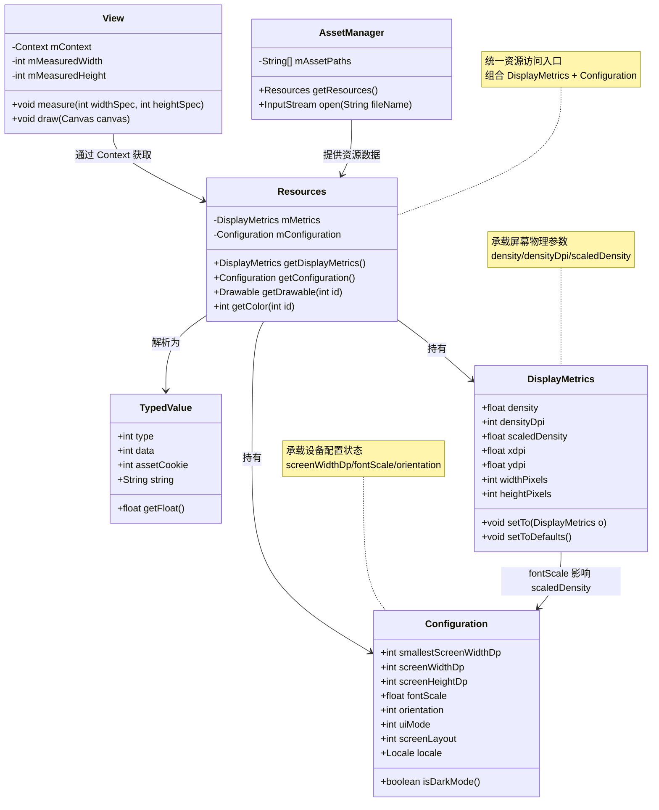

**架构关系说明**：
- `AssetManager` 是最底层资源管理器，负责 APK 内文件索引
- `Resources` 组合了 `DisplayMetrics`（物理参数）和 `Configuration`（配置状态）
- `TypedValue` 是资源值的中间表示，`applyDimension()` 在此处执行换算
- `View` 通过 `Context.getResources()` 间接获取这些信息

---

### 12.3 资源匹配完整体系架构

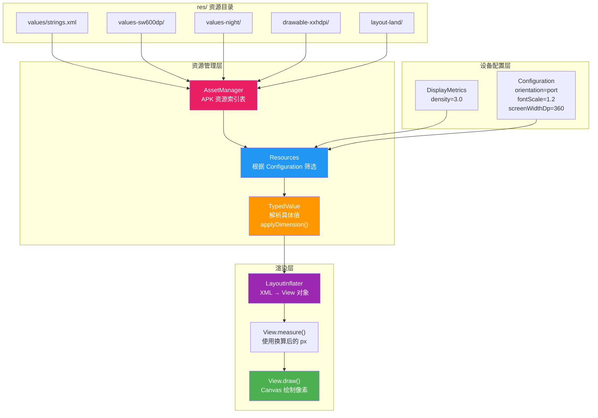

**数据流说明**：
1. 编译时：AAPT 将 `res/` 编译为二进制资源表，`AssetManager` 负责索引
2. 运行时：`Resources` 根据当前 `Configuration` + `DisplayMetrics` 匹配最优资源
3. 解析时：`TypedValue.applyDimension()` 将 dp/sp 换算为 px
4. 渲染时：`View` 使用换算后的 px 进行 measure/layout/draw

---

### 12.4 smallestWidth（sw<N>dp）方案 vs 传统 layout-large 方案

#### 12.4.1 两种方案对比

| 维度 | layout-large（旧） | sw600dp（新） |
|------|-------------------|--------------|
| 匹配依据 | 屏幕尺寸类别（small/normal/large/xlarge） | 最小可用宽度 dp 值 |
| 精度 | 粗粒度（4 档） | 细粒度（任意 dp 值） |
| 方向感知 | 否（固定分类） | 是（取较小边） |
| 多窗口支持 | 差（无法感知窗口缩小） | 好（窗口变化时 sw 变化） |
| 可组合性 | 难与其他限定符组合 | 可叠加（sw600dp-land-night） |
| 推荐度 | 已废弃（API 13+） | 官方推荐 |

**术语解释（衣服尺码类比）：**
- **layout-large**：类似服装的 S/M/L/XL 四档尺码，粗略但不精准。
- **sw600dp**：类似"胸围 96cm"的精确测量，可精确到任意值。

#### 12.4.2 设计差异图解

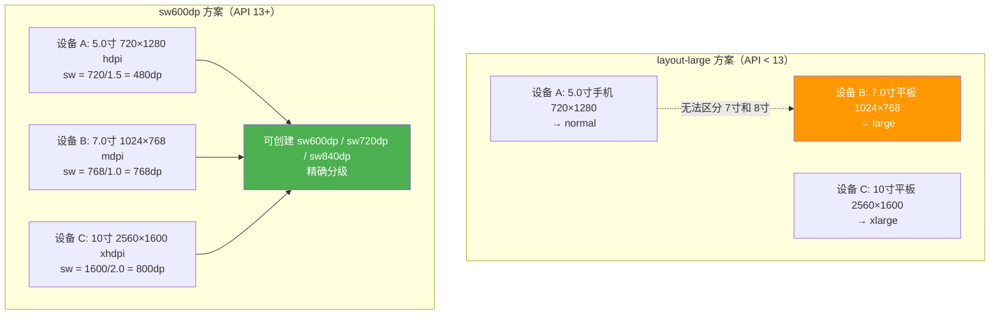

---

### 12.5 今日头条/美团适配方案的底层原理

#### 12.5.1 方案核心思想

**术语解释（全局汇率修改类比）：**
- **今日头条适配方案**：类似"黑客入侵了中央银行，修改了所有人的汇率"。通过反射修改 `DisplayMetrics.density`，让所有 dp→px 换算都按设计稿宽度等比缩放。原本 1dp=3px 可能被改成 1dp=2.8px，使整个 UI 按设计稿等比缩放。

#### 12.5.2 修改前后的 dp→px 转换对比

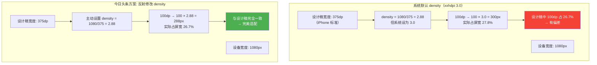

#### 12.5.3 核心代码实现

```kotlin
object ScreenAdapter {

    /**
     * 以宽度为基准，修改 DisplayMetrics.density
     * @param designWidthDp 设计稿宽度（dp）
     */
    fun adaptWidth(activity: Activity, designWidthDp: Float) {
        val displayMetrics = activity.resources.displayMetrics
        // 计算目标 density = 屏幕宽度px / 设计稿宽度dp
        val targetDensity = displayMetrics.widthPixels / designWidthDp
        // 等比修改 scaledDensity（保持字体缩放比例）
        val targetScaledDensity = targetDensity * (
            displayMetrics.scaledDensity / displayMetrics.density
        )
        // 计算 densityDpi
        val targetDensityDpi = (targetDensity * 160).toInt()

        // 反射修改三个关键字段
        displayMetrics.density = targetDensity
        displayMetrics.scaledDensity = targetScaledDensity
        displayMetrics.densityDpi = targetDensityDpi

        // 还需修改 Application 级别的 DisplayMetrics
        val appDisplayMetrics = activity.application.resources.displayMetrics
        appDisplayMetrics.density = targetDensity
        appDisplayMetrics.scaledDensity = targetScaledDensity
        appDisplayMetrics.densityDpi = targetDensityDpi
    }

    /**
     * 取消适配，恢复系统默认
     */
    fun cancelAdapt(activity: Activity) {
        val systemMetrics = Resources.getSystem().displayMetrics
        val displayMetrics = activity.resources.displayMetrics
        displayMetrics.density = systemMetrics.density
        displayMetrics.scaledDensity = systemMetrics.scaledDensity
        displayMetrics.densityDpi = systemMetrics.densityDpi
    }
}

// 使用示例
override fun onCreate(savedInstanceState: Bundle?) {
    super.onCreate(savedInstanceState)
    // 设计稿宽 375dp，全局等比缩放
    ScreenAdapter.adaptWidth(this, 375f)
    setContentView(R.layout.activity_main)
}
```

**方案优缺点**：

| 优势 | 风险 |
|------|------|
| 开发零成本，一套 dp 全适配 | 反射修改系统 API，未来版本可能失效 |
| 完美还原设计稿比例 | 与第三方库密度可能冲突 |
| 支持动态切换适配基准 | 修改 Application 级 DisplayMetrics 影响全局 |

---

### 12.6 Compose 的密度无关设计

#### 12.6.1 Compose 的适配新范式

**术语解释（内置翻译机类比）：**
- **Compose Dp**：类似"自带翻译机的单位"，在 Compose 中 `Dp` 是一个类型安全的值类，不再依赖 XML 资源限定符。`LocalDensity` 提供当前设备的"翻译规则"，自动完成 dp→px 转换。

#### 12.6.2 核心类与机制

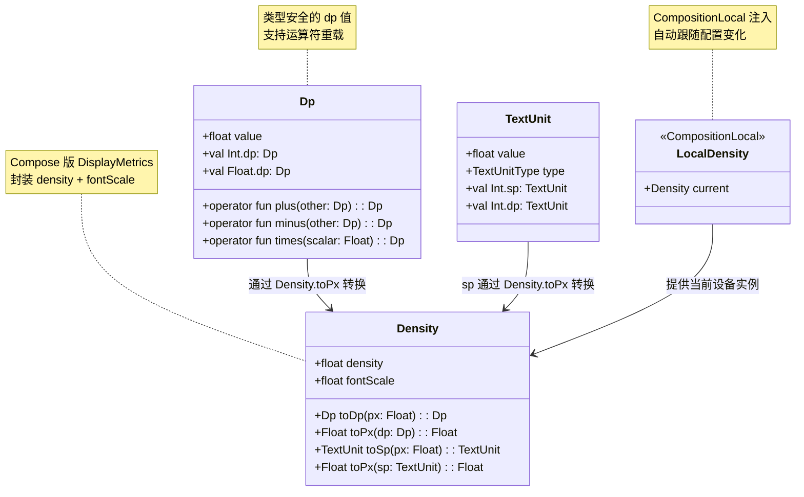

#### 12.6.3 Compose 适配代码示例

```kotlin
@Composable
fun AdaptiveLayout() {
    // Dp 是类型安全的，编译时检查
    val padding = 16.dp        // Dp 类型
    val textSize = 14.sp       // TextUnit 类型

    // LocalDensity 自动提供当前设备密度
    val density = LocalDensity.current
    // 手动转换（通常不需要，Compose 自动处理）
    val paddingPx = with(density) { padding.toPx() }

    Box(
        modifier = Modifier
            .fillMaxWidth()
            .padding(padding)  // 自动 dp→px
    ) {
        Text(
            text = "自适应文本",
            fontSize = textSize  // 自动 sp→px
        )
    }
}

// density() 修饰符：覆盖当前密度（测试/特殊场景）
@Composable
fun CustomDensityExample() {
    // 强制使用特定密度（如设计稿密度）
    Density(density = 2.5f, fontScale = 1.0f) {
        // 内部所有 dp/sp 按 2.5 密度换算
        Text(
            text = "自定义密度",
            fontSize = 14.sp,
            modifier = Modifier.padding(16.dp)
        )
    }
}
```

**Compose vs XML 适配对比**：

| 维度 | XML 传统适配 | Compose 适配 |
|------|-------------|-------------|
| 单位类型 | 字符串 "16dp"（无类型安全） | `Dp` 值类（类型安全） |
| 密度获取 | 手动 `resources.displayMetrics` | `LocalDensity.current` 自动注入 |
| 配置变化 | `onConfigurationChanged` 手动处理 | Recomposition 自动响应 |
| 百分比布局 | Guideline + constraint | `fillMaxWidth(0.5f)` 一行搞定 |
| 字体缩放 | sp + 手动监听 | `TextUnit(sp)` 自动跟随 |

---

### 12.7 多形态适配的未来设计方向

#### 12.7.1 适配形态全景

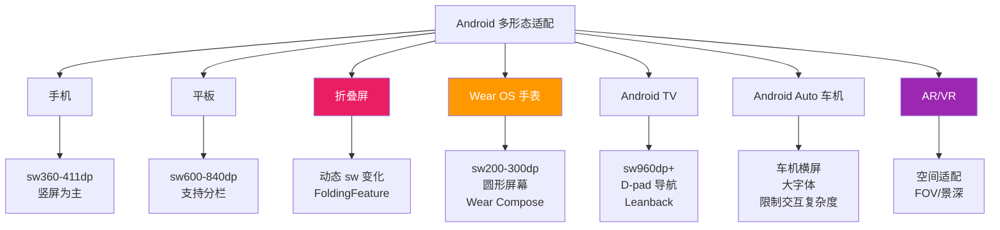

#### 12.7.2 未来趋势讨论

| 趋势 | 技术方向 | 适配策略 |
|------|---------|---------|
| 折叠屏普及 | Jetpack WindowManager + 动态 ConstraintLayout | 运行时响应 FoldingFeature |
| Wear OS 复兴 | Wear Compose + 曲面屏适配 | 专用 Compose 组件库 |
| 大屏融合 | Material Design 3 + 响应式 Navigation | NavigationRail/Suite 自适应 |
| 声明式统一 | Compose Multiplatform | 一套代码跨平台密度适配 |
| AI 辅助适配 | ML 预测最优布局 | 运行时动态选择布局策略 |

---

## 📝 跨章节综合考核训练

> 以下 8 道考核题均关联至少 2 个章节，考察综合应用能力。建议先独立思考再查看参考答案。

---

### 考核题 1：dp 在渲染管线中的转换时机

**涉及章节**：08-屏幕适配 + 00-布局系统概述
**题目**：
在 Android 的渲染管线（measure → layout → draw）中，dp 到 px 的转换发生在哪个阶段？如果在 `onDraw()` 中通过 `Canvas.drawRect(0, 0, 100, 100, paint)` 绘制矩形，这里的 100 是 dp 还是 px？如何正确绘制一个 100dp × 100dp 的矩形？

**参考答案要点**：
- dp→px 转换发生在 **LayoutInflater 解析 XML 阶段**（measure 之前），由 `TypedValue.applyDimension()` 完成。View 内部存储的都是 px 值。
- `Canvas.drawRect(0, 0, 100, 100, paint)` 中的 100 是** px**，不是 dp。Canvas 直接操作像素，不做单位转换。
- 正确做法：`(100 * resources.displayMetrics.density)` 先将 dp 转为 px，再传给 Canvas。或使用 `dpToPx()` 扩展函数。
- 渲染管线中 measure 阶段使用已换算的 px 计算尺寸，layout 阶段确定位置，draw 阶段 Canvas 绘制的坐标全部是 px。

---

### 考核题 2：Guideline 百分比适配与 ConstraintLayout 的关系

**涉及章节**：08-屏幕适配 + 04-ConstraintLayout
**题目**：
ConstraintLayout 中的 Guideline 支持 `layout_constraintGuide_percent="0.3"` 实现百分比定位。请解释：百分比布局如何绕过密度差异实现跨设备适配？与固定 dp 值相比有何优势？在什么场景下百分比布局不如 dp 适配？

**参考答案要点**：
- 百分比布局的原理是 `Guideline 位置 = parentWidth × 0.3`，parentWidth 已是 px 值，百分比直接作用于最终像素，**天然绕过密度差异**。
- 优势：无需为不同密度/尺寸提供多套布局，一套 XML 自动适配所有屏幕；响应式效果好。
- 百分比不如 dp 的场景：需要固定物理尺寸的元素（如按钮必须 48dp 高保证可点击），百分比会导致大屏按钮过大、小屏按钮过小。
- Guideline 的百分比是相对于**父容器**的，不是屏幕，因此嵌套布局中百分比基准是直接父容器。

---

### 考核题 3：Bitmap 内存与优化技巧的性能关联

**涉及章节**：08-屏幕适配 + 07-布局优化
**题目**：
某 App 在 xxhdpi 设备上从 `drawable-mdpi/` 目录加载了一张 100×100px 的图片。请计算：系统自动缩放后 Bitmap 占用多少内存？如果同时加载 10 张这样的图片，总内存是多少？如何优化？请关联 Bitmap 密度重采样机制与布局优化章节的内存优化策略。

**参考答案要点**：
- 缩放因子 = 480/160 = 3.0，Bitmap 放大为 300×300px = 90000 像素。
- 单张内存（ARGB_8888）= 300×300×4 = 360000 字节 ≈ **351.6 KB**。
- 10 张总内存 ≈ **3.4 MB**。
- 优化方案：①将图片放入 `drawable-xxhdpi/` 避免放大；②使用 `inSampleSize` 降采样；③使用 `inPreferredConfig = RGB_565` 减半内存；④使用 Glide/Coil 等图片库自动适配密度；⑤对列表项图片使用 `wrap_content` 而非固定尺寸。
- 关联：布局优化章的"避免过度绘制"与屏幕适配章的"Bitmap 密度匹配"共同影响渲染性能。

---

### 考核题 4：RecyclerView 的 spanCount 自适应适配

**涉及章节**：08-屏幕适配 + 06-RecyclerView
**题目**：
某电商 App 需要实现商品网格列表：手机显示 2 列，7 寸平板显示 3 列，10 寸平板显示 4 列。请用两种方案实现 spanCount 自适应：①资源限定符方案；②代码动态计算方案。并分析两种方案的优缺点。

**参考答案要点**：
- **方案①（资源限定符）**：在 `values/integers.xml` 定义 `<integer name="span_count">2</integer>`，在 `values-sw600dp/integers.xml` 定义 3，在 `values-sw840dp/integers.xml` 定义 4。代码中 `val span = resources.getInteger(R.integer.span_count)` 读取。
- **方案②（代码计算）**：`val span = (resources.displayMetrics.widthPixels / resources.displayMetrics.density / 180).toInt()`，每 180dp 一列，动态适配任意屏幕。
- 方案①优点：声明式，配置清晰；缺点：粒度粗，无法适配未预见的屏幕尺寸。
- 方案②优点：灵活，适配所有尺寸；缺点：计算逻辑在代码中，设计变更需改代码。
- 最佳实践：结合 `GridLayoutManager` + `SpanSizeLookup`，部分 item 可跨多列。

---

### 考核题 5：sp 字体缩放在 LinearLayout 中的布局影响

**涉及章节**：08-屏幕适配 + 01-LinearLayout
**题目**：
一个垂直 LinearLayout 包含 3 个 TextView，均使用 `layout_height="wrap_content"`，字体大小 `14sp`。当用户将系统字体设置为"超大"（fontScale=1.3）时，布局会发生什么变化？如果 LinearLayout 高度固定为 `200dp`，可能出现什么问题？如何解决？

**参考答案要点**：
- fontScale=1.3 时，14sp → 14×3.0×1.3 = 54.6px（xxhdpi），文字物理尺寸增大约 30%，每个 TextView 高度增加。
- 3 个 TextView 总高度可能超过 200dp，导致**内容被裁剪**或**溢出**。
- LinearLayout 不会自动滚动，底部 TextView 可能不可见。
- 解决方案：①将 LinearLayout 放入 ScrollView；②使用 `layout_weight` 分配空间而非固定高度；③TextView 设置 `maxLines` 和 `ellipsize` 截断；④关键场景监听 `fontScale` 动态调整布局。

---

### 考核题 6：资源限定符与 ScrollView 的 fillViewport 适配

**涉及章节**：08-屏幕适配 + 05-ScrollView
**题目**：
某表单页面在手机上使用 ScrollView 包裹表单内容，设置了 `android:fillViewport="true"`。当切换到平板（sw720dp）时，表单内容较少不需要滚动。请设计适配方案，并解释 `fillViewport` 的作用原理。

**参考答案要点**：
- `fillViewport="true"` 的原理：当 ScrollView 内容高度小于 ScrollView 自身高度时，将内容拉伸填充整个 ScrollView。否则内容只占顶部一小块。
- 适配方案：①手机布局用 ScrollView（内容可能溢出需滚动）；②平板布局 `layout-sw720dp/` 可移除 ScrollView，改用 ConstraintLayout 居中显示，表单宽度限制 `maxWidth=600dp`。
- 如果平板仍用 ScrollView + fillViewport，内容会铺满屏幕但宽度可能过大，体验不佳。
- 最佳实践：平板布局用 `ConstraintLayout` + `Guideline` 限制表单宽度为屏幕 50%-60%，居中显示。

---

### 考核题 7：Compose Dp 与传统 dp 在 Compose 章节中的设计差异

**涉及章节**：08-屏幕适配 + 09-Compose
**题目**：
在传统 XML 中使用 `android:layout_width="100dp"`，在 Compose 中使用 `Modifier.width(100.dp)`。请从类型安全、密度获取、配置变化响应三个维度，分析两者的设计差异。为什么 Compose 不需要资源限定符也能适配多屏幕？

**参考答案要点**：
- **类型安全**：XML 的 "100dp" 是字符串，编译期不检查；Compose 的 `100.dp` 返回 `Dp` 值类，类型安全，运算可编译检查。
- **密度获取**：XML 通过 `Resources.getDisplayMetrics()` 获取密度；Compose 通过 `LocalDensity.current`（CompositionLocal）自动注入，且配置变化时自动触发 Recomposition。
- **配置变化响应**：XML 需声明 `configChanges` + 手动处理 `onConfigurationChanged`；Compose 的 `LocalDensity` 是响应式的，屏幕旋转/多窗口时自动 Recompose。
- **无需资源限定符**：Compose 使用 `BoxWithConstraints` 获取当前约束，通过 `maxWidth` 值动态选择布局策略（如 `if (maxWidth > 600.dp) WideLayout() else NarrowLayout()`），替代了 `layout-sw600dp/` 目录。
- Compose 的 `WindowSizeClass` API 进一步封装了尺寸分类，是资源限定符的声明式替代方案。

---

### 考核题 8：折叠屏适配对 RelativeLayout 布局的影响

**涉及章节**：08-屏幕适配 + 02-RelativeLayout
**题目**：
某 App 使用 RelativeLayout 布局，包含一个顶部标题栏和下方内容区。当设备从折叠状态展开到平板模式时，RelativeLayout 如何响应？RelativeLayout 相比 ConstraintLayout 在折叠屏适配上有什么劣势？如何重构？

**参考答案要点**：
- RelativeLayout 通过 `layout_below`、`layout_above` 等规则定位，折叠屏展开时尺寸变化但**规则不变**，内容会被拉伸而非重排。
- RelativeLayout 劣势：①无法动态修改约束规则（约束在 XML 中静态声明）；②不支持百分比布局；③铰链区域无法自动避让。
- ConstraintLayout 优势：①运行时通过 `ConstraintSet` 动态修改约束；②支持 `Guideline` 百分比定位；③可结合 `Flow` 虚拟布局自动换行。
- 重构方案：将 RelativeLayout 替换为 ConstraintLayout，监听 `FoldingFeature`，在 `HALF_OPENED` 时用 `ConstraintSet` 调整内容区不跨越铰链；在 `FLAT` 时切换为双栏布局。
- 注意：RelativeLayout 已被官方标记为"不推荐使用"，新项目应使用 ConstraintLayout 替代。

---

### 考核题汇总表

| 题号 | 题目标题 | 关联章节 | 考核重点 |
|------|---------|---------|---------|
| 1 | dp 转换时机 | 08 + 00 | 渲染管线中 dp→px 的发生阶段 |
| 2 | Guideline 百分比适配 | 08 + 04 | 百分比绕过密度差异的原理 |
| 3 | Bitmap 内存与优化 | 08 + 07 | 密度重采样的内存影响 |
| 4 | spanCount 自适应 | 08 + 06 | 资源限定符 vs 代码计算 |
| 5 | sp 在 LinearLayout 中的影响 | 08 + 01 | fontScale 对布局的连锁影响 |
| 6 | ScrollView fillViewport 适配 | 08 + 05 | 平板布局的 fillViewport 行为 |
| 7 | Compose Dp 设计差异 | 08 + 09 | 类型安全与响应式适配 |
| 8 | 折叠屏对 RelativeLayout 的影响 | 08 + 02 | 动态约束 vs 静态规则 |

---

## 参考文献与延伸阅读

### 官方文档
1. **[Android 官方文档 - 支持不同屏幕尺寸](https://developer.android.com/guide/topics/ui/look-and-feel/screensizes)**
   - Google 官方屏幕适配指南，涵盖 dp/sp 单位、资源限定符、多窗口模式及可折叠设备适配。
2. **[Android 官方文档 - 屏幕密度独立性](https://developer.android.com/guide/topics/ui/look-and-feel/density-independence)**
   - Google 官方密度独立性说明，解释 dp 单位的设计理念和 DisplayMetrics 各字段的含义。
3. **[Android 官方文档 - 资源限定符 (Resource Qualifiers)](https://developer.android.com/guide/topics/resources/providing-resources)**
   - Google 官方资源配置文档，详述所有资源限定符（密度、尺寸、方向、语言等）的匹配优先级算法。

### dp/dpi/密度转换
4. **[AndroidAutoSize 适配原理：density/scaledDensity/densityDpi 关系 - CSDN](https://blog.csdn.net/gitblog_01124/article/details/151602876)**
   - 深入分析 DisplayMetrics 三个核心参数的内在关系，以及今日头条/美团适配方案的反射修改原理。
5. **[Android px/density/densityDpi/dp 之间的关系和区别 - CSDN](https://blog.csdn.net/guangdeshishe/article/details/120543084)**
   - 系统性讲解像素密度计算公式及各参数的物理含义。
6. **[一种极低成本的 Android 屏幕适配方式 - CSDN](https://blog.csdn.net/suyimin2010/article/details/126558650)**
   - 详解通过修改 DisplayMetrics.density 实现全局等比缩放的适配方案原理。

### 折叠屏适配
7. **[Android 官方文档 - Jetpack WindowManager 与折叠屏适配](https://developer.android.com/guide/topics/ui/foldables)**
   - Google 官方折叠屏适配文档，说明 Jetpack WindowManager 的 FoldingFeature API 使用方法。
8. **[Android 官方文档 - 支持大屏幕与多窗口模式](https://developer.android.com/guide/topics/ui/multi-window)**
   - Google 官方多窗口模式文档，涵盖分屏模式、自由窗口模式下的布局适配策略。
