# Jetpack Compose 完全指南

> 🎯 **一句话定义**：Jetpack Compose 是 Android 官方推出的新一代声明式 UI 工具包，通过 Kotlin 函数直接描述界面，取代传统的 XML 布局方式。

---

## 📋 教学信息

| 属性 | 值 |
|------|-----|
| 🎯 学习目标 | 掌握 Compose 核心概念，能用 Compose 构建真实界面 |
| 📚 前置知识 | Kotlin 基础、Android View 系统基础、Activity 生命周期 |
| 📊 难度分级 | ⭐⭐⭐ 高级 |
| ⏱️ 时间预估 | 60 分钟 |
| 📦 依赖版本 | Compose BOM 2024.x / Kotlin 1.9+ / minSdk 21 |

---

## 1. 一句话定义

Jetpack Compose 是 Android 的**声明式 UI 框架**——你只需要描述"界面应该是什么样子"，框架自动处理"如何从当前状态变成目标状态"。

```kotlin
@Composable
fun Greeting(name: String) {
    Text(text = "Hello, $name!")
}
```

---

## 2. 为什么需要 Compose

### 传统 View 系统的痛点

| 痛点 | 说明 |
|------|------|
| XML 布局冗长 | 一个简单列表需要 XML + Adapter + ViewHolder + 数据绑定 |
| 状态同步复杂 | UI 状态散落在各处，容易不一致 |
| 代码量大 | 同样功能，View 系统代码量是 Compose 的 3-5 倍 |
| 动画繁琐 | 属性动画需要大量样板代码 |
| 难以组合复用 | 自定义组合视图需要大量模板代码 |

### Compose 的优势

- **更少代码**：声明式描述，去掉大量样板
- **强大工具链**：实时预览、交互式编辑
- **Kotlin 优先**：利用协程、扩展函数等语言特性
- **加速开发**：热重载，修改即预览

---

## 3. 核心概念

### 3.1 声明式 vs 命令式

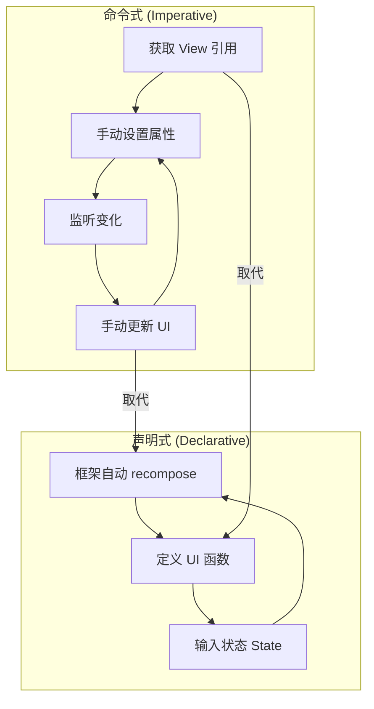

**命令式**：你告诉框架"第一步做什么、第二步做什么"
**声明式**：你描述"UI 应该长什么样"，框架自己算出怎么变

**术语解释：**
- **声明式（Declarative）**：描述"你想要什么结果"。在 Compose 中，你写一个函数描述界面长什么样，传入状态数据，框架自动处理 UI 更新。就像点菜——你说"我要一份宫保鸡丁"，厨房自己决定怎么炒。
- **命令式（Imperative）**：描述"具体怎么做"。在传统 View 系统中，你需要手动获取 View 引用、手动设置属性、手动监听变化、手动更新 UI。就像做菜——你需要自己洗菜、切菜、炒菜、装盘。
- **State（状态）**：驱动 UI 变化的数据。当 State 改变时，Compose 自动重新执行读取了该 State 的 Composable 函数，更新界面。
- **Recomposition（重组）**：Compose 在状态变化时重新执行受影响的 Composable 函数的过程。这是 Compose 的核心机制——只更新需要变化的部分，而不是整个界面。

### 3.2 Compose Runtime 架构

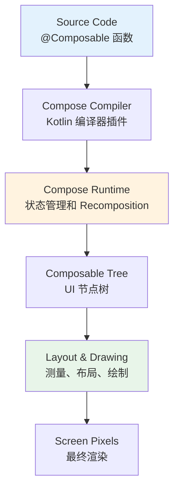

| 组件 | 职责 |
|------|------|
| **Compose Compiler** | 编译时转换 @Composable 函数，插入状态追踪代码 |
| **Compose Runtime** | 运行时管理状态树、触发 recomposition |
| **Composition** | 一次完整的 UI 构建过程 |
| **Recomposition** | 状态变化后，仅重新执行受影响的 Composable |

**术语解释：**
- **Compose Compiler**：Kotlin 编译器插件，在编译时将 `@Composable` 函数转换为可追踪状态依赖的节点构建代码。它在函数中插入"这个函数读取了哪些 State"的信息。
- **Compose Runtime**：运行时库，维护 Composition 树（UI 节点树），当 State 变化时判断哪些 Composable 需要重新执行。
- **Composition**：一次完整的 UI 构建过程。首次执行所有 Composable 函数，生成 UI 节点树。
- **Recomposition（重组）**：状态变化后，仅重新执行读取了变化 State 的 Composable 函数，更新 UI 节点树。这是 Compose 高性能的关键——智能增量更新。

### 3.3 Composition 与 Recomposition

```
首次构建: Composable 函数 → 生成 UI 节点树 (Composition)

状态变化: State 改变 → 标记依赖该 State 的 Composable
         → 仅重新执行这些函数 (Recomposition)
         → 更新 UI 节点树
```

---

## 4. 基础用法

### 4.1 核心布局组件

| 组件 | 作用 | XML 等价 |
|------|------|----------|
| `Column` | 垂直排列 | `LinearLayout(vertical)` |
| `Row` | 水平排列 | `LinearLayout(horizontal)` |
| `Box` | 堆叠重叠 | `FrameLayout` |
| `LazyColumn` | 可滚动垂直列表 | `RecyclerView` |
| `LazyRow` | 可滚动水平列表 | `HorizontalRecyclerView` |

### 4.2 Column / Row / Box 示例

```kotlin
@Composable
fun LayoutDemo() {
    // 垂直排列
    Column(
        modifier = Modifier
            .fillMaxSize()
            .padding(16.dp),
        verticalArrangement = Arrangement.spacedBy(8.dp),
        horizontalAlignment = Alignment.CenterHorizontally
    ) {
        Text("标题", style = MaterialTheme.typography.headlineMedium)
        Text("副标题", style = MaterialTheme.typography.bodyLarge)

        // 水平排列
        Row(
            horizontalArrangement = Arrangement.spacedBy(12.dp),
            modifier = Modifier.fillMaxWidth()
        ) {
            Button(onClick = { }) { Text("确定") }
            OutlinedButton(onClick = { }) { Text("取消") }
        }

        // 堆叠重叠
        Box(
            modifier = Modifier
                .fillMaxWidth()
                .height(200.dp),
            contentAlignment = Alignment.Center
        ) {
            Image(painter = painterResource(R.drawable.bg), contentDescription = null)
            Text("覆盖文字", color = Color.White)
        }
    }
}
```

### 4.3 LazyColumn 列表

```kotlin
@Composable
fun MessageList(messages: List<String>) {
    LazyColumn(
        contentPadding = PaddingValues(16.dp),
        verticalArrangement = Arrangement.spacedBy(8.dp)
    ) {
        items(
            items = messages,
            key = { it }  // 稳定的 key 有助于性能
        ) { message ->
            MessageItem(message)
        }
    }
}

@Composable
fun MessageItem(text: String) {
    Card(
        modifier = Modifier.fillMaxWidth(),
        elevation = CardDefaults.cardElevation(defaultElevation = 2.dp)
    ) {
        Text(
            text = text,
            modifier = Modifier.padding(16.dp)
        )
    }
}
```

### 4.4 State 管理

```kotlin
@Composable
fun Counter() {
    // remember: 在 recomposition 间保持值
    // mutableStateOf: 创建可观察状态
    var count by remember { mutableStateOf(0) }

    Column(
        modifier = Modifier.padding(16.dp),
        horizontalAlignment = Alignment.CenterHorizontally
    ) {
        Text("计数: $count", style = MaterialTheme.typography.headlineMedium)
        Spacer(modifier = Modifier.height(8.dp))
        Button(onClick = { count++ }) {
            Text("点击 +1")
        }
    }
}
```

**State 核心 API 对比：**

| API | 用途 | 生命周期 |
|-----|------|----------|
| `mutableStateOf()` | 创建可观察状态 | 跟随 Composition |
| `remember { }` | 跨 recomposition 保持值 | 跟随 Composable 作用域 |
| `rememberSaveable { }` | 跨配置变更保持值 | 跟随 Activity 重建 |
| `derivedStateOf { }` | 派生状态（计算缓存） | 跟随依赖状态 |
| `collectAsState()` | Flow → State 转换 | 跟随 CoroutineScope |

### 4.5 Modifier 系统

```kotlin
Button(
    onClick = { },
    modifier = Modifier
        .fillMaxWidth()          // 撑满宽度
        .height(56.dp)          // 固定高度
        .padding(horizontal = 16.dp)  // 外边距
        .clip(RoundedCornerShape(12.dp))  // 圆角
        .background(Color.Blue)  // 背景色
) {
    Text("按钮", color = Color.White)
}
```

**Modifier 执行顺序很重要：**

```kotlin
// ❌ 错误：先 padding 后 background → padding 区域没有背景色
Modifier.padding(16.dp).background(Color.Red)

// ✅ 正确：先 background 后 padding → 整个区域都有背景色
Modifier.background(Color.Red).padding(16.dp)
```

**术语解释：**
- **Modifier（修饰符）**：Compose 中用于修饰 Composable 外观和行为的链式调用对象。就像给衣服加装饰——先裁剪（size）、再染色（background）、再加口袋（padding）。Modifier 的顺序决定了装饰的先后顺序。
- **fillMaxWidth()**：让 Composable 的宽度等于父容器的宽度。类似于 XML 中的 `match_parent`。
- **height(56.dp)**：设置固定高度为 56dp。
- **padding()**：内边距，在内容和边界之间留出空间。`padding(horizontal = 16.dp)` 表示左右各留 16dp。
- **clip()**：裁剪形状。`RoundedCornerShape(12.dp)` 表示圆角半径为 12dp 的圆角矩形。
- **background()**：设置背景色。`Color.Blue` 是蓝色。
- **顺序的重要性**：Modifier 是链式调用的，前一个 Modifier 创建的布局约束会影响后续 Modifier。先 background 后 padding，padding 区域在背景外面，所以整个区域都有背景色；先 padding 后 background，padding 区域在背景里面，所以 padding 区域没有背景色。

### 4.6 动画

```kotlin
@Composable
fun AnimatedButton() {
    var expanded by remember { mutableStateOf(false) }

    // animateXxxAsState: 自动动画插值
    val size by animateDpAsState(
        targetValue = if (expanded) 200.dp else 100.dp,
        animationSpec = spring(
            dampingRatio = Spring.DampingRatioMediumBouncy,
            stiffness = Spring.StiffnessLow
        ),
        label = "size"
    )

    val color by animateColorAsState(
        targetValue = if (expanded) Color.Red else Color.Blue,
        animationSpec = tween(durationMillis = 300),
        label = "color"
    )

    Box(
        modifier = Modifier
            .size(size)
            .background(color)
            .clickable { expanded = !expanded },
        contentAlignment = Alignment.Center
    ) {
        Text("点击", color = Color.White)
    }
}
```

**动画 API 速查：**

| API | 适用场景 | 说明 |
|-----|---------|------|
| `animateDpAsState` | 尺寸变化 | width/height 动画 |
| `animateColorAsState` | 颜色过渡 | 平滑颜色插值 |
| `animateFloatAsState` | 数值变化 | 透明度、旋转等 |
| `animateContentSize()` | 内容尺寸 | 自动动画内容变化 |
| `AnimatedVisibility()` | 显隐切换 | 淡入淡出 + 滑动 |
| `Crossfade()` | 内容切换 | 交叉淡入淡出 |
| `AnimatedContent()` | 内容变换 | 自定义过渡动画 |
| `updateTransition()` | 多属性联动 | 统一管理多个动画值 |

---

## 5. 实战场景示例

### 5.1 登录表单

```kotlin
@Composable
fun LoginScreen() {
    var username by remember { mutableStateOf("") }
    var password by remember { mutableStateOf("") }
    var passwordVisible by remember { mutableStateOf(false) }

    Column(
        modifier = Modifier
            .fillMaxSize()
            .padding(24.dp),
        verticalArrangement = Arrangement.Center,
        horizontalAlignment = Alignment.CenterHorizontally
    ) {
        Text(
            "登录",
            style = MaterialTheme.typography.headlineLarge,
            modifier = Modifier.padding(bottom = 32.dp)
        )

        OutlinedTextField(
            value = username,
            onValueChange = { username = it },
            label = { Text("用户名") },
            leadingIcon = { Icon(Icons.Default.Person, contentDescription = null) },
            modifier = Modifier.fillMaxWidth()
        )

        Spacer(modifier = Modifier.height(12.dp))

        OutlinedTextField(
            value = password,
            onValueChange = { password = it },
            label = { Text("密码") },
            leadingIcon = { Icon(Icons.Default.Lock, contentDescription = null) },
            trailingIcon = {
                IconButton(onClick = { passwordVisible = !passwordVisible }) {
                    Icon(
                        if (passwordVisible) Icons.Default.Visibility
                        else Icons.Default.VisibilityOff,
                        contentDescription = "切换密码可见"
                    )
                }
            },
            visualTransformation = if (passwordVisible) VisualTransformation.None
                                   else PasswordVisualTransformation(),
            modifier = Modifier.fillMaxWidth()
        )

        Spacer(modifier = Modifier.height(24.dp))

        Button(
            onClick = { /* 登录逻辑 */ },
            modifier = Modifier.fillMaxWidth().height(48.dp),
            enabled = username.isNotBlank() && password.isNotBlank()
        ) {
            Text("登录")
        }
    }
}
```

### 5.2 卡片列表

```kotlin
data class Article(val id: Int, val title: String, val summary: String)

@Composable
fun ArticleList(articles: List<Article>) {
    LazyColumn(
        contentPadding = PaddingValues(16.dp),
        verticalArrangement = Arrangement.spacedBy(12.dp)
    ) {
        items(articles, key = { it.id }) { article ->
            ArticleCard(article)
        }
    }
}

@Composable
fun ArticleCard(article: Article) {
    Card(
        modifier = Modifier.fillMaxWidth(),
        shape = RoundedCornerShape(12.dp),
        elevation = CardDefaults.cardElevation(defaultElevation = 4.dp)
    ) {
        Column(modifier = Modifier.padding(16.dp)) {
            Text(article.title, style = MaterialTheme.typography.titleMedium)
            Spacer(modifier = Modifier.height(8.dp))
            Text(
                article.summary,
                style = MaterialTheme.typography.bodyMedium,
                color = MaterialTheme.colorScheme.onSurfaceVariant,
                maxLines = 3,
                overflow = TextOverflow.Ellipsis
            )
        }
    }
}
```

---

## 6. 常见错误与避坑

### 错误速查表

| 错误 | 症状 | 原因 | 解决 |
|------|------|------|------|
| Recomposition 过多 | 卡顿、掉帧 | 不必要的 State 读取 | 用 `derivedStateOf` 或拆分 Composable |
| 记忆丢失 | 状态每次重建 | 忘记 `remember` | 包裹 `remember { mutableStateOf() }` |
| 布局错乱 | 子元素重叠/消失 | Modifier 顺序错误 | 确认 padding/background/drawable 顺序 |
| 列表闪烁 | LazyColumn 抖动 | 缺少稳定 key | 添加 `key = { it.id }` |
| 动画卡顿 | 动画不流畅 | 主线程阻塞 | 使用 `LaunchedEffect` 处理耗时操作 |
| Composition 泄漏 | 内存持续增长 | 在 Composable 中持有大对象 | 移到 ViewModel 或 `remember` 中 |

### Before/After 对比

```kotlin
// ❌ 错误：每次 Recomposition 都创建新列表
@Composable
fun BadList(items: List<String>) {
    val sorted = items.sorted()  // 每次都重新排序
    LazyColumn {
        items(sorted) { Text(it) }
    }
}

// ✅ 正确：用 derivedStateOf 缓存计算结果
@Composable
fun GoodList(items: List<String>) {
    val sorted by remember(items) { derivedStateOf { items.sorted() } }
    LazyColumn {
        items(sorted) { Text(it) }
    }
}

// ❌ 错误：在 Composable 中直接修改外部状态
@Composable
fun BadCounter() {
    var count = 0  // 每次 recomposition 重置为 0
    Button(onClick = { count++ }) { Text("Count: $count") }
}

// ✅ 正确：用 remember 保持状态
@Composable
fun GoodCounter() {
    var count by remember { mutableStateOf(0) }
    Button(onClick = { count++ }) { Text("Count: $count") }
}
```

---

## 7. 优势与局限

### 对比矩阵：Compose vs View 系统

| 维度 | Jetpack Compose | XML + View |
|------|-----------------|------------|
| 代码量 | ⭐⭐⭐ 少 | ⭐ 多 |
| 学习曲线 | ⭐⭐ 中等 | ⭐⭐ 中等 |
| 预览能力 | ⭐⭐⭐ 即时预览 | ⭐ 有限 |
| 生态成熟度 | ⭐⭐ 快速增长 | ⭐⭐⭐ 非常成熟 |
| 性能优化 | ⭐⭐ 良好 | ⭐⭐⭐ 极致 |
| 第三方库支持 | ⭐⭐ 大部分迁移中 | ⭐⭐⭐ 完全支持 |
| 自定义 View | ⭐⭐ Canvas API | ⭐⭐⭐ 完全灵活 |
| 迁移难度 | ⭐⭐⭐ 渐进式迁移 | — |

### Compose 的优势

- 声明式范式，代码更简洁直观
- 强大的状态管理，UI 自动同步
- 丰富的动画 API，声明式动画
- 即时预览，开发效率极高
- Google 官方重点投入，生态持续完善

### Compose 的局限

- 部分自定义 View 需要通过 Canvas 重写
- 第三方地图、WebView 等仍需 AndroidView 桥接
- 大列表性能优化需要额外技巧
- 团队需要学习时间成本

---

## 8. 进阶技巧

### 8.1 Composition Local（跨层级传值）

```kotlin
// 定义
val LocalDarkMode = compositionLocalOf { false }

// 提供
CompositionProvider(LocalDarkMode provides isDarkTheme) {
    MyApp()
}

// 消费（任意子层级）
@Composable
fun ThemeAwareText() {
    val isDark = LocalDarkMode.current
    Text(
        "当前主题: ${if (isDark) "深色" else "浅色"}",
        color = if (isDark) Color.White else Color.Black
    )
}
```

### 8.2 LaunchedEffect（副作用处理）

```kotlin
@Composable
fun UserProfile(userId: String) {
    var user by remember { mutableStateOf<User?>(null) }

    // 当 userId 变化时重新执行
    LaunchedEffect(userId) {
        user = repository.fetchUser(userId)  // 挂起函数
    }

    user?.let {
        Text("用户: ${it.name}")
    } ?: CircularProgressIndicator()
}
```

### 8.3 自定义 Modifier

```kotlin
fun Modifier.shimmerEffect(): Modifier = composed {
    val transition = rememberInfiniteTransition()
    val alpha by transition.animateFloat(
        initialValue = 0.2f,
        targetValue = 0.9f,
        animationSpec = infiniteRepeatable(
            animation = tween(1000, easing = LinearEasing),
            repeatMode = RepeatMode.Reverse
        )
    )
    background(Color.LightGray.copy(alpha = alpha))
}

// 使用
Box(modifier = Modifier.fillMaxWidth().height(20.dp).shimmerEffect())
```

### 8.4 渐进迁移策略

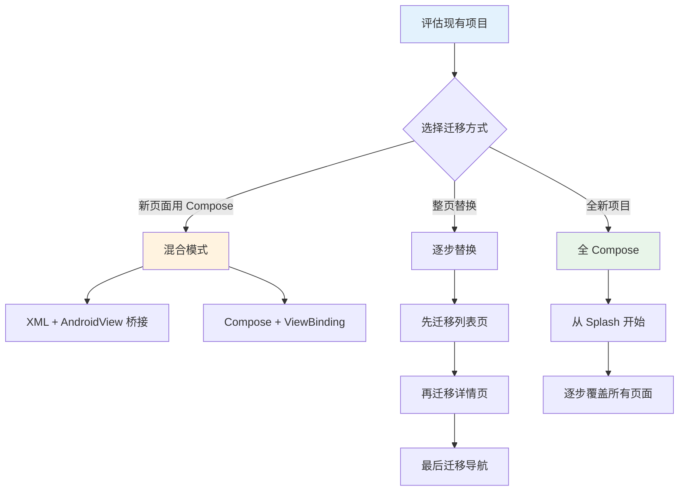

---

## 9. 面试高频考点

### Q1: Compose 是如何实现声明式 UI 的？
**答**：通过 Compose Compiler 插件，在编译时将 `@Composable` 函数转换为可追踪状态依赖的节点构建代码。运行时 Runtime 维护 Composition 树，当 State 变化时，仅重新执行依赖该 State 的 Composable 函数（Recomposition），实现增量更新。

### Q2: remember 和 rememberSaveable 的区别？
**答**：`remember` 仅在 Recomposition 间保持值；`rememberSaveable` 额外支持配置变更（如旋转屏幕），通过 `SavedStateHandle` 持久化。对于需要跨重建的数据用 `rememberSaveable`，普通 UI 状态用 `remember`。

### Q3: 为什么 Modifier 的顺序很重要？
**答**：Modifier 是链式调用的，前一个 Modifier 创建的布局约束会影响后续 Modifier。例如 `padding().background()` 先计算布局再画背景，padding 区域没有背景色；而 `background().padding()` 先画背景再留 padding，整个区域都有背景色。

### Q4: 如何优化 LazyColumn 性能？
**答**：(1) 为每个 item 提供稳定的 `key`；(2) 使用 `contentType` 区分不同类型的 item；(3) 避免在 item 中创建新对象（用 `remember`）；(4) 使用 `key` 而非索引作为标识；(5) 大列表使用 `LazyListState.firstVisibleItemIndex` 做懒加载。

### Q5: Compose 中如何处理副作用？
**答**：使用 `LaunchedEffect(key)` 处理协程副作用（网络请求、数据库操作）；`DisposableEffect(key)` 处理需要清理的副作用（注册/注销监听）；`SideEffect` 在每次成功 Recomposition 后执行（日志、分析）。

### Q6: CompositionLocal 的使用场景？
**答**：(1) 主题颜色/字体跨组件传递；(2) 依赖注入（数据库、网络服务）；(3) 导航控制器；(4) 避免层层传递参数（类似 Context）。它是 Compose 的"隐式参数"机制，替代繁琐的参数传递。

---

## 10. 小结与下一步

### 知识依赖图

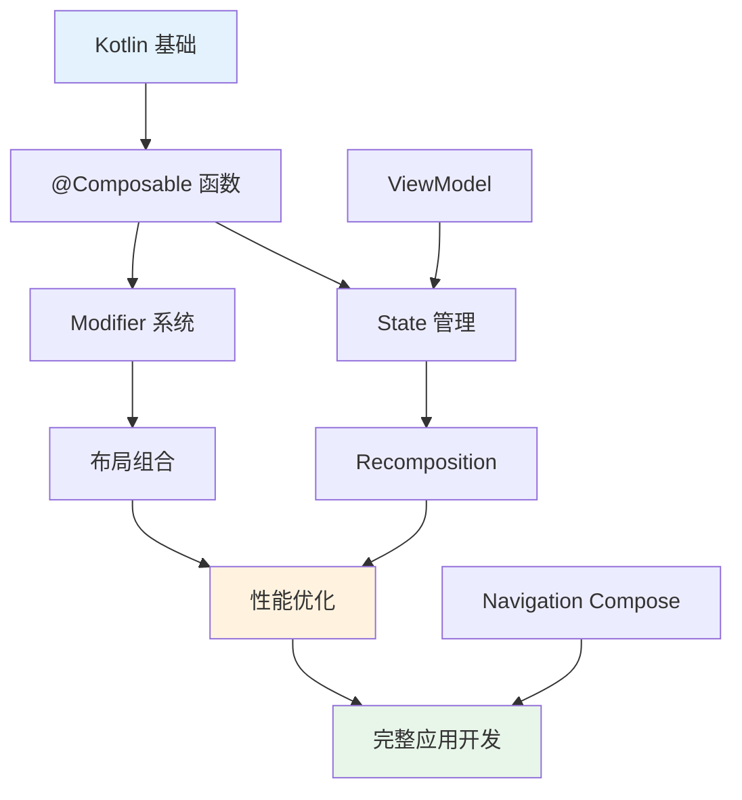

### 课后练习

1. **基础练习**：用 Compose 实现一个带图片的联系人列表（LazyColumn + 数据类）
2. **进阶练习**：实现一个计数器，带弹簧动画和主题切换功能
3. **实战项目**：构建一个完整的 Todo 应用，包含增删改查 + 状态持久化

### 自测题

- [ ] 能否解释 Recomposition 的触发条件？
- [ ] 能否正确使用 `remember` 和 `mutableStateOf` 管理状态？
- [ ] 能否用 `LaunchedEffect` 处理异步操作？
- [ ] 能否区分 `Column`、`Row`、`Box` 的使用场景？
- [ ] 能否优化 LazyColumn 列表性能？

### 常见学生错误

1. **忘记 remember**：状态每次 Recomposition 重置
2. **在 Composable 中创建对象**：导致不必要的 recomposition
3. **Modifier 顺序混乱**：padding/background 顺序导致布局问题
4. **过度使用 State**：拆分不够细导致大面积 recomposition
5. **忽略 key**：LazyColumn 列表动画异常

### 教学提示

- 先演示一个简单的 Counter，让学生理解 State 驱动 UI 的概念
- 对比 XML 布局的写法，突出 Compose 的简洁性
- 用 Android Studio 的 Layout Inspector 观察 Recomposition 过程
- 强调 Modifier 顺序的重要性，用 Before/After 对比演示

### 实战项目建议

- **个人记账本**：LazyColumn 列表 + 状态管理 + 动画
- **天气 App**：网络请求 + 状态 + 主题切换
- **新闻阅读器**：分页加载 + 下拉刷新 + 动画过渡

---

## 📖 术语表

| 术语 | 英文 | 含义 |
|------|------|------|
| 组合 | Composition | 一次完整的 UI 构建过程 |
| 重组 | Recomposition | 状态变化后重新执行受影响的 Composable |
| 可组合函数 | Composable Function | 标记了 @Composable 的函数，描述 UI |
| 状态 | State | 可观察的数据，变化触发 Recomposition |
| 修饰符 | Modifier | 链式调用，修饰 Composable 的外观和行为 |
| 无限动画 | InfiniteTransition | 持续运行的循环动画 |
| 惰性列表 | Lazy List | 按需加载的滚动列表 |
| 副作用 | Side Effect | 在 Composable 之外执行的操作 |

---

## 🃏 快速参考卡

```
┌─────────────────────────────────────────────────────┐
│              JETPACK COMPOSE 速查                    │
├─────────────────────────────────────────────────────┤
│ @Composable fun Xxx() { ... }  // 定义 UI 函数      │
│ var x by remember { mutableStateOf(0) }  // 状态    │
│ Column / Row / Box              // 布局容器          │
│ LazyColumn { items(...) {} }    // 滚动列表          │
│ Modifier.padding().background() // 修饰外观          │
│ Spacer(Modifier.height(8.dp))   // 间距              │
│ LaunchedEffect(key) { }         // 协程副作用        │
│ AnimatedVisibility { }          // 显隐动画          │
│ animateDpAsState()              // 属性动画          │
└─────────────────────────────────────────────────────┘
```

---

## 🎬 渲染逻辑详解

### Compose 的声明式渲染机制

Compose 完全不同于传统 View 系统的渲染方式，它通过**状态驱动**实现声明式 UI：

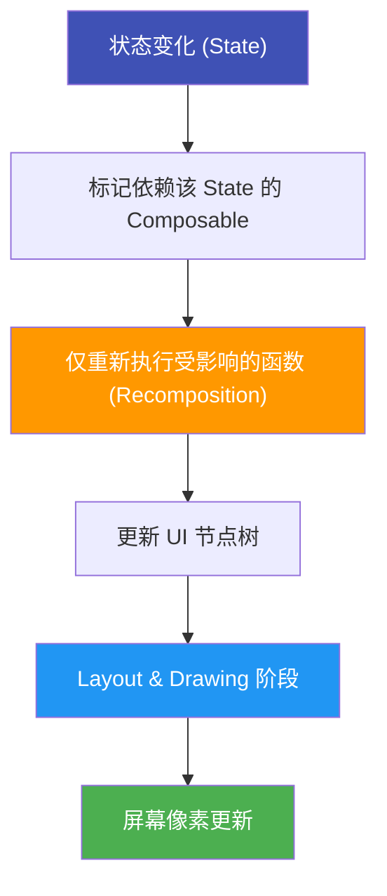

### 与传统 View 系统渲染对比

```plaintext
传统 View 系统渲染流程：
  setContentView(XML) → LayoutInflater → View Tree
  → measure → layout → draw → Screen
  
  状态变化时：
  手动获取 View 引用 → 手动设置属性 → 触发重新布局
  (可能触发整个 View Tree 重新 measure/layout)

Compose 渲染流程：
  @Composable 函数 → Compose Runtime → UI 节点树
  → Layout → Drawing → Screen
  
  状态变化时：
  State 改变 → 标记依赖 → 仅 Recomposition 受影响函数
  (智能增量更新，只重绘需要的部分)
```

### Recomposition 的触发机制

```plaintext
Recomposition 触发条件：
  1. State 对象的值发生变化
  2. Composition 的生命周期变化（如配置变更）
  3. 父 Composable 重组（影响所有子 Composable）

Recomposition 的优化：
  1. 智能跳过：如果没有读取变化的 State，跳过该函数
  2. 细粒度更新：只有读取了变化 State 的函数才重组
  3. 稳定性检查：参数稳定时跳过重组
```

### LazyColumn 的渲染原理

```plaintext
LazyColumn 的渲染机制：
  1. 只渲染屏幕上可见的 Item
  2. 滑出屏幕的 Item 被回收（类似 RecyclerView）
  3. 滑入屏幕的 Item 被创建/复用
  
  与 RecyclerView 的对比：
    RecyclerView: XML + Adapter + ViewHolder + LayoutManager
    LazyColumn:   LazyColumn { items() {} } (一行代码)
  
  性能机制：
    - key 参数：提供稳定的 Item 标识，避免不必要的重组
    - contentType：区分不同类型的 Item，优化复用
```

### Modifier 的渲染行为

```plaintext
Modifier 链式调用的渲染顺序：
  
  Modifier
    .fillMaxWidth()      ← 第1步：设置宽度为父容器宽度
    .height(56.dp)       ← 第2步：设置高度为56dp
    .padding(16.dp)      ← 第3步：内边距（影响内容区域）
    .background(Color.Red) ← 第4步：背景色（在padding内）
  
  顺序影响渲染结果：
    Modifier.padding().background() → padding 区域没有背景色
    Modifier.background().padding() → 整个区域都有背景色
```

---

## 🔗 知识依赖图

### 与前后章节的关系

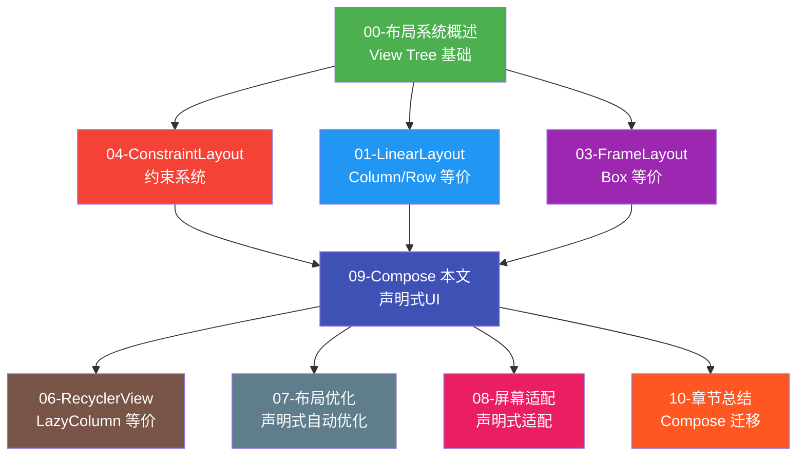

### 核心知识点的章节串联

| 知识点 | 本章内容 | 关联章节 | 关联说明 |
|--------|---------|---------|---------|
| **声明式 vs 命令式** | Compose 核心范式 | 00-概述 | 00 章介绍声明式 UI |
| **Column/Row** | 垂直/水平排列 | 01-LinearLayout | LinearLayout 的等价物 |
| **Box** | 堆叠重叠 | 03-FrameLayout | FrameLayout 的等价物 |
| **LazyColumn** | 高效滚动列表 | 06-RecyclerView | RecyclerView 的等价物 |
| **State 管理** | 状态驱动 UI | 07-优化 | Compose 自动优化 |
| **Modifier** | 链式修饰 | 08-屏幕适配 | Modifier 自动适配 |
| **动画 API** | 声明式动画 | 03-FrameLayout | AnimationDrawable 替代 |
| **渐进迁移** | XML→Compose | 10-总结 | 01-08 章可逐步迁移 |

### 组件关系图

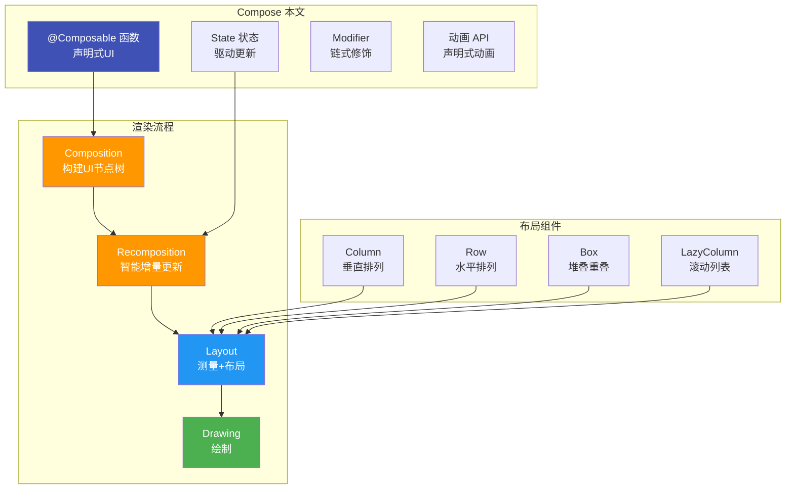

---

## 📊 真实案例

### 案例：从 XML 迁移到 Compose 的经验

某团队将一个 50 个页面的 App 逐步迁移到 Compose：

| 指标 | 迁移前 (XML) | 迁移后 (Compose) | 变化 |
|------|-------------|------------------|------|
| 新功能开发时间 | 3 天 | 1.5 天 | ↓ 50% |
| UI Bug 修复时间 | 2 小时 | 30 分钟 | ↓ 75% |
| 代码行数 | 15,000 | 8,000 | ↓ 47% |
| 团队满意度 | 3.2/5 | 4.5/5 | ↑ 41% |

**关键经验**：先从列表页和详情页开始迁移，这两类页面 Compose 优势最明显；导航层最后迁移，因为需要与现有 Fragment 协调。

---

## 🔬 Compose 编译器与 SlotTable 底层深度解析

> 本章节从最底层的编译器插件和运行时数据结构出发，深入剖析 Compose 是如何在"看不见的地方"实现声明式 UI 的。适合希望理解 Compose 黑盒原理、进行极致性能优化或准备高级面试的开发者。

### 1. Compose 编译器插件的工作原理

#### 1.1 @Composable 注解的编译变换

当你在代码中写下一个 `@Composable` 函数时，Kotlin 编译器插件（Compose Compiler Plugin）会在编译期对这个函数进行 transform（变换），将其转换为一个**带有 Composer 参数**的特殊函数。这是 Compose 一切魔法的起点。

**变换前（你写的源码）：**

```kotlin
@Composable
fun Greeting(name: String) {
    Text(text = "Hello, $name!")
}
```

**变换后（编译器实际生成的伪代码）：**

```kotlin
fun Greeting(name: String, composer: Composer, key: Int) {
    composer.startRestartGroup(key)
    composer.startReplaceableGroup(key)

    // 编译器插入的状态追踪代码
    if (composer.changed(name) == changed) {
        // 参数未变化，跳过重组（Smart Recomposition）
        composer.skipToGroupEnd()
    } else {
        Text(text = "Hello, $name!", composer = composer, key = ...)
    }

    composer.endReplaceableGroup()
    composer.endRestartGroup()
}
```

可以看到，编译器做了几件关键的事情：

1. **注入 Composer 参数**：每个 `@Composable` 函数都隐式获得一个 `Composer` 参数，它是与运行时通信的"桥梁"。
2. **插入 RestartGroup / ReplaceableGroup**：用 group 将函数体包裹起来，为后续的"智能跳过"提供边界。
3. **插入 changed() 检查**：对每个参数调用 `composer.changed()`，判断参数是否变化，从而决定是否跳过执行。

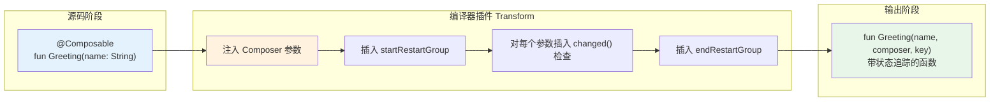

**术语解释：**
- **Compose Compiler Plugin（编译器插件）**：Kotlin 编译器的一个扩展插件，在编译时扫描所有 `@Composable` 函数，自动注入状态追踪代码。可以把它理解为一个"翻译官"——你写的是简洁的声明式代码，它帮你翻译成运行时能追踪状态依赖的底层代码。就像你写了一封简单的中文信，翻译官帮你加上英文注释、附上回信地址、贴好邮票，让信件能被国际邮递系统正确处理。
- **Composer（组合器）**：编译器注入的参数，是 Composable 函数与运行时通信的桥梁。它负责记录"这个函数读取了哪些 State"、"这个函数的参数是否变化"等信息。类比：Composer 就像工地上的施工监理——你告诉他"我要在这里放一堵墙"，他负责记录墙的位置、检查材料是否变化、决定是否需要返工。
- **RestartGroup（重启组）**：标记一个可被重新执行（重组）的代码范围边界。当该范围内的 State 变化时，运行时可以只重新执行这个组，而不影响外部。
- **ReplaceableGroup（可替换组）**：更细粒度的边界，用于"智能跳过"——如果参数没变化，整个组的执行可以被跳过。

#### 1.2 编译变换的完整流程

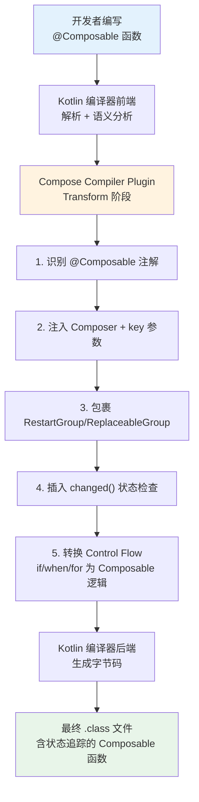

> **重要提醒**：Compose 编译器插件还会处理控制流（if/when/for）。在 Composable 函数中，`if` 语句的分支会被转换为条件 group，确保重组时能正确恢复执行路径。这就是为什么 Compose 要求 `@Composable` 函数中的控制流必须是"可恢复的"——编译器需要知道每个分支的边界。

---

### 2. SlotTable 的数据结构

#### 2.1 SlotTable 是 Compose 的"虚拟 DOM"

在 React 中，Virtual DOM 是一棵 JavaScript 对象树；在 Compose 中，扮演类似角色的是 **SlotTable**（槽位表）。但与 React 的 Virtual DOM 不同，SlotTable 不是一棵嵌套的对象树，而是一个**扁平化的数组结构**，通过索引来模拟树的层级关系。这种设计避免了大量对象的创建和 GC 压力。

SlotTable 存储了组合树（Composition Tree）的全部结构信息和数据：
- 每个 Composable 调用在 SlotTable 中占据一个"组"（Group）
- 每个 Group 记录了 key、位置范围（nodeStart/nodeEnd）、以及关联的数据（data）
- 子 Composable 的 Group 嵌套在父 Group 的范围内

#### 2.2 SlotTable 的数组结构

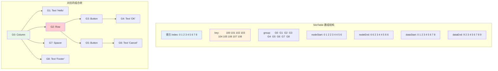

**术语解释：**
- **SlotTable（槽位表）**：Compose 运行时维护的核心数据结构，是一个扁平化的数组，存储组合树的所有节点信息和数据。类比：SlotTable 就像一本"乐高积木的说明书"——它记录了每个积木（Composable）的位置编号、属于哪一层、周围有哪些积木。你不需要真的把积木摆出来才知道结构，翻开说明书就能看到全貌。当你想替换某个积木时，只需要翻到对应页码，找到位置，换上新积木即可。
- **Slot（槽位）**：SlotTable 中的一个个存储位置。每个 Composable 调用占用一组 Slot，用于存储该 Composable 的参数值、remember 的值等。类比：乐高说明书上每一行就是一个 Slot，写着"这个位置放一块 2x4 的红色砖块"。
- **Group（组）**：SlotTable 中的逻辑单元，对应一次 Composable 调用。一个 Group 有起始和结束位置，子 Group 嵌套在其中。类比：乐高说明书中一个大步骤包含若干子步骤，Group 就是这种嵌套关系。
- **key**：每个 Group 的唯一标识，用于在重组时匹配"旧的"和"新的" Composable。类比：乐高零件编号，即使你重新拼装，只要编号对得上，系统就知道这是同一个零件。
- **nodeStart / nodeEnd**：Group 在节点数组中的起止位置，标识这个 Group 对应的 LayoutNode 范围。
- **data**：Group 关联的数据区，存储 remember 的值、参数值、状态等。类比：乐高说明书旁边的手写笔记，记录"这一步用了什么颜色、拧了几圈"。

#### 2.3 SlotTable 的写入与读取

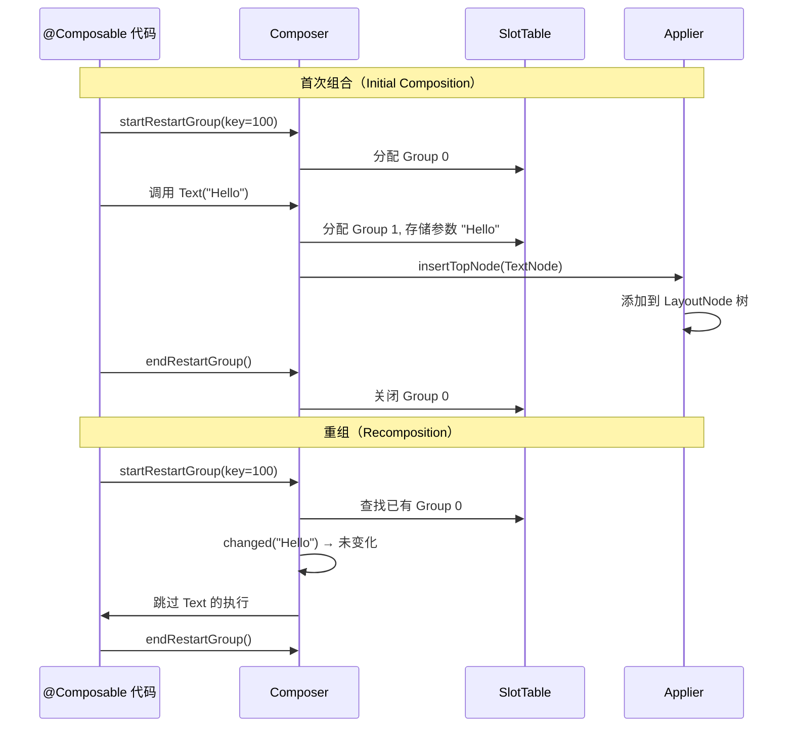

---

### 3. 重组（Recomposition）的触发与调度

#### 3.1 State 变化如何触发重组

当 `MutableState` 的值发生变化时，Compose 运行时并非立即执行重组，而是通过一套**调度机制**来批量处理。这避免了短时间内多次 State 变化导致的重复重组。

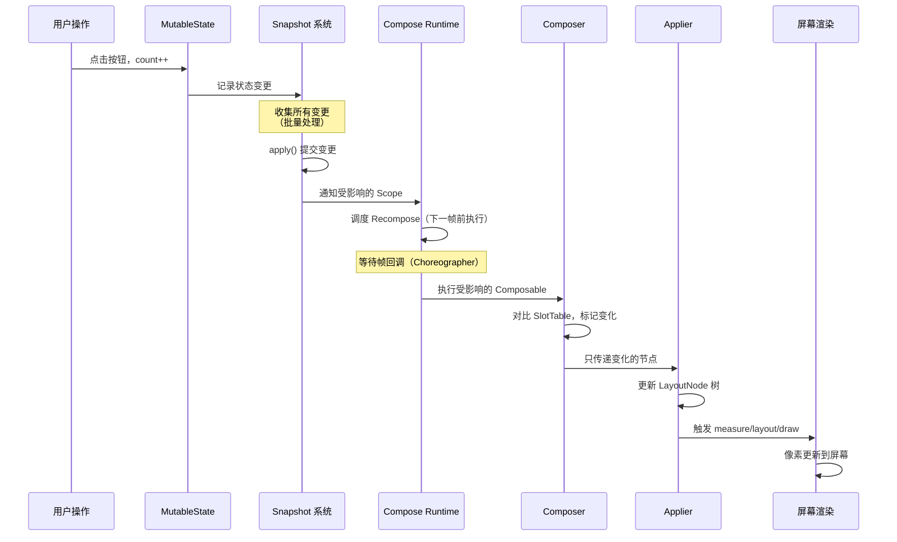

**术语解释：**
- **Invalidation（失效标记）**：当 State 变化时，Compose 不会立即重组，而是将读取了该 State 的 Composable 标记为"失效"（invalid），等待调度器在合适的时机批量执行重组。类比：你在办公室发现三盏灯坏了，不需要发现一盏就跑一趟维修部，而是先记下来，等收集完所有坏灯后一次性报修。
- **Recompose Scope（重组作用域）**：一个 RestartGroup 对应的代码范围。State 变化只使其直接所在的 Scope 失效，不会扩散到整个 Composition。这就是 Compose "细粒度更新"的基础。
- **Choreographer（帧调度器）**：Android 的垂直同步信号机制。Compose 将重组调度在帧回调中执行，确保重组与屏幕刷新同步，避免不必要的计算。
- **批量处理（Batching）**：Compose 将同一帧内的多次 State 变化合并为一次重组，减少重复计算。例如快速点击按钮 5 次，可能只触发 1 次重组。

#### 3.2 重组的调度策略

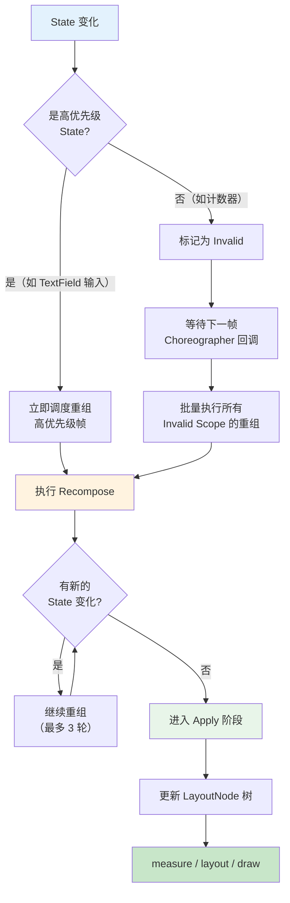

> **重要细节**：Compose 限制每帧最多执行有限轮（通常为 3 轮）重组。如果 3 轮后仍有 State 变化，会抛出异常，防止无限重组。这是开发中常见的 "Recomposition infinite loop" 错误的根源——通常是因为在 Composable 中直接修改 State 而没有正确使用 `remember`。

---

### 4. 智能重组（Smart Recomposition）

#### 4.1 为什么需要智能跳过

假设有一个包含 100 个子 Composable 的界面，当其中 1 个 State 变化时，如果重新执行全部 100 个函数，性能会非常差。Compose 的智能重组机制通过**稳定性检查**和**参数对比**，跳过那些输入没有变化的 Composable，只重新执行真正需要更新的部分。

#### 4.2 @Stable 与 @Immutable 注解

```kotlin
// @Immutable: 所有字段都是 val 且不可变
// Compose 可以安全地跳过重组（参数不可能变化）
@Immutable
data class User(
    val id: Int,
    val name: String,
    val avatar: String
)

// @Stable: 字段可能变化但可被观察（如 MutableState 属性）
// Compose 通过 equals 判断是否变化来决定是否跳过
@Stable
class FormState {
    var text by mutableStateOf("")
    var isValid by mutableStateOf(false)
}

// 未标注的类型被视为 Unstable
// Compose 无法确定其是否变化 → 保守地每次都重组
data class UnstableItem(
    var name: String,  // var 字段 → 不稳定
    val list: List<String>  // List 接口 → 可能是 mutableList
)
```

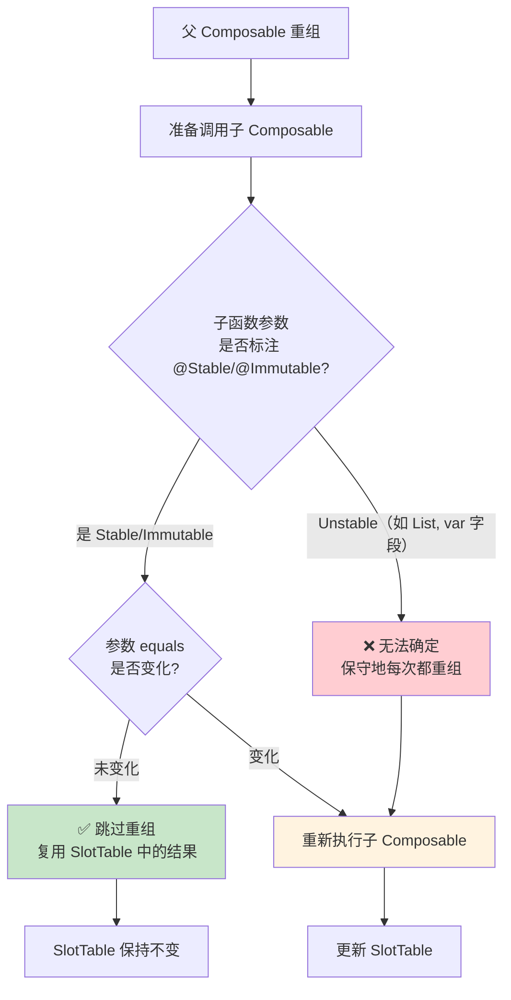

**术语解释：**
- **Smart Recomposition（智能重组）**：Compose 在重组时，通过对比 Composable 的参数是否变化，跳过那些输入未变的函数执行，只重新执行真正需要更新的部分。类比：考试批改时，老师不需要每道题都重新阅卷，只需要对比"上次答案"和"这次答案"，只重新批改有变化的题目。
- **@Immutable（不可变注解）**：告诉 Compose 编译器，这个类的所有字段都是 `val` 且不可变，永远可以安全跳过重组。类比：一件封装好的商品——出厂后不会被拆开修改，所以只要条形码没变，就是同一件商品。
- **@Stable（稳定注解）**：告诉编译器，这个类的属性可能变化，但变化可以被观察（通过 `mutableStateOf`），因此可以通过 `equals` 判断是否变化。类比：一辆有 GPS 追踪的车——它的位置可能变化，但你能实时知道它变没变。
- **Unstable（不稳定类型）**：未标注 `@Stable`/`@Immutable` 的类，如包含 `var` 字段的 data class、`List<T>` 接口类型。Compose 无法保证它们不会被外部修改，因此保守地每次都重组。这是 Compose 性能问题的常见根源。

#### 4.3 重组范围限定

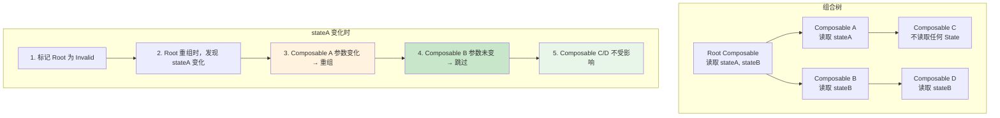

---

### 5. 快照（Snapshot）系统

#### 5.1 MVCC 多版本并发控制

Compose 的状态管理底层基于 **Snapshot（快照）** 系统，这是一种类似数据库中 **MVCC（Multi-Version Concurrency Control，多版本并发控制）** 的机制。它允许多个快照同时存在，每个快照看到的是状态的某个"版本"，读写互不干扰。

这使得 Compose 可以：
- 在后台线程安全地读取状态
- 批量提交状态变更
- 支持嵌套快照（局部状态隔离）

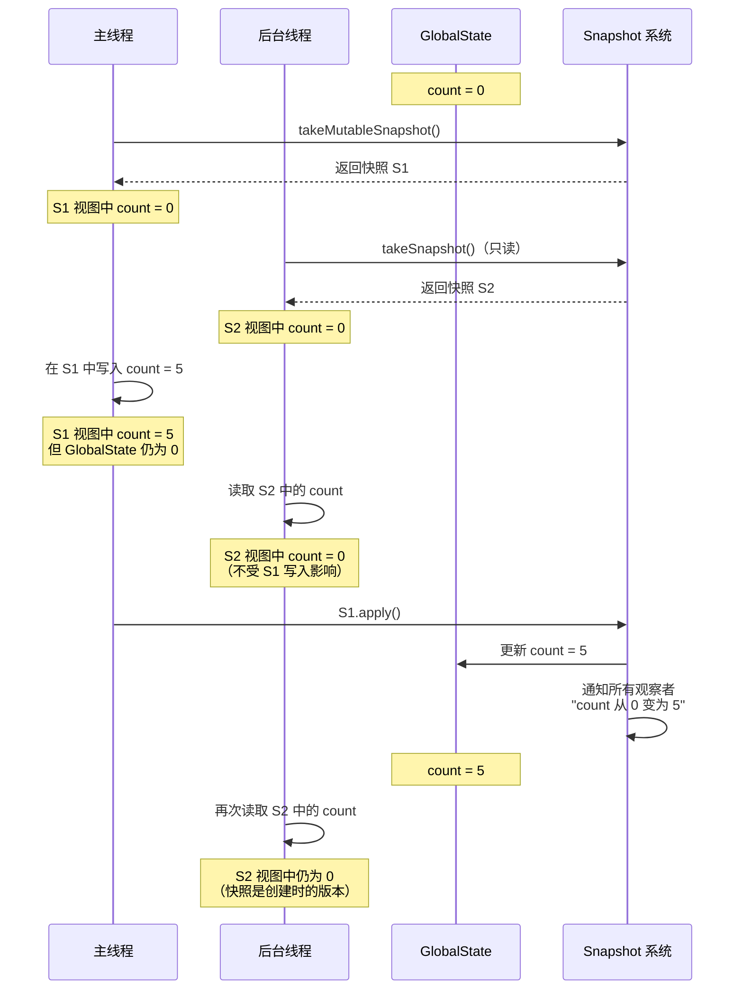

**术语解释：**
- **Snapshot（快照）**：Compose 状态系统的核心机制，捕获某一时刻所有 State 的值，提供一个隔离的读写视图。类比：你拍了一张照片——照片里的世界是静止的，即使现实世界继续变化，你手中的照片不会变。Compose 中每个快照就像一张"状态照片"。
- **MVCC（多版本并发控制）**：数据库领域的并发控制技术，通过维护数据的多个版本，让读操作不阻塞写操作。Compose 借鉴了这个思想，实现了状态的多版本快照。类比：图书馆有多本同一本书的副本——A 借了一本在读，B 可以借另一本同时读，互不影响。
- **takeMutableSnapshot()**：创建一个可读写的快照，对状态的修改在调用 `apply()` 前不影响全局状态。类比：你拿到一张可擦写的照片复制品——你在上面涂改不影响原件，直到你决定"定稿"并提交。
- **apply()**：将可变快照中的修改提交到全局状态，并通知所有观察者。类比：你确认草稿无误后，按下"保存"按钮，所有人都能看到更新后的版本。
- **Snapshot State Listener**：当 `apply()` 后，Snapshot 系统会通知所有"状态监听器"哪些 State 发生了变化，从而触发重组。

#### 5.2 快照与重组的关系


---

### 6. Compose 中的测量与布局

#### 6.1 不依赖 View 系统的测量布局

Compose 的测量与布局系统**完全独立于 Android View 系统**。它不使用 `View.measure()` / `View.layout()`，而是通过 `MeasurePolicy`、`IntrinsicMeasurable`、`Placeable` 等抽象接口实现。这使得 Compose 理论上可以脱离 Android 平台运行（这也是 Compose Multiplatform 的基础）。

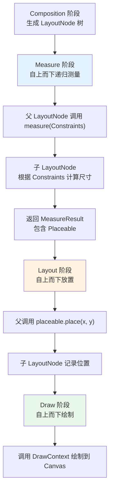

**术语解释：**
- **MeasurePolicy（测量策略）**：定义一个 Composable 如何测量和放置子元素的策略接口。`Column`、`Row`、`Box` 等内置布局都实现了各自的 MeasurePolicy。类比：建筑规范——规定了不同房间类型的测量标准，卧室至少多少平米、厨房的灶台高度多少。
- **Constraints（约束）**：父布局传递给子布局的尺寸约束，包含 minWidth、maxWidth、minHeight、maxHeight。类比：父母给孩子定规矩——"你的房间最小 10 平米，最大 20 平米"，孩子在范围内自由决定。
- **Placeable（可放置对象）**：测量完成后返回的结果，包含了子元素的最终尺寸，可以被父布局放置到指定坐标。类比：家具量好了尺寸，现在可以决定摆在房间哪个位置。
- **MeasureResult**：测量阶段的输出，包含 Placeable 列表和布局坐标信息。
- **LayoutNode**：Compose 中的 UI 节点，对应传统 View 系统中的一个 View。它是 Compose 自有的节点类型，不继承 `android.view.View`。

#### 6.2 自定义 Layout 的 measurePolicy 流程

```kotlin
@Composable
fun CustomLayout(
    modifier: Modifier = Modifier,
    content: @Composable () -> Unit
) {
    Layout(
        content = content,
        modifier = modifier
    ) { measurables, constraints ->
        // 1. 测量所有子元素
        val placeables = measurables.map { child ->
            child.measure(constraints)
        }

        // 2. 计算自身尺寸
        val width = max(placeables.maxOf { it.width }, constraints.minWidth)
        val height = max(placeables.sumOf { it.height }, constraints.minHeight)

        // 3. 返回 MeasureResult，定义如何放置子元素
        layout(width, height) {
            var y = 0
            placeables.forEach { placeable ->
                placeable.place(x = 0, y = y)
                y += placeable.height
            }
        }
    }
}
```

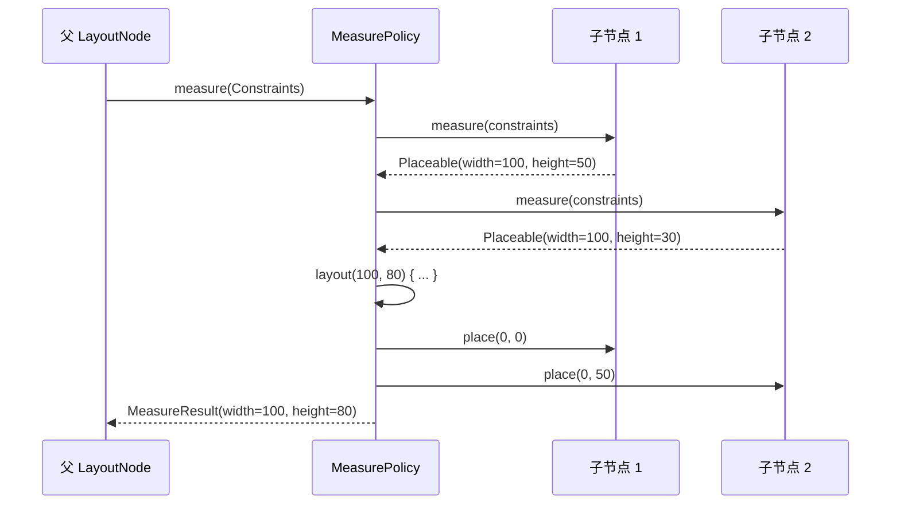

#### 6.3 测量不变性（Measurement Invariance）

> **关键规则**：Compose 要求同一个 Composable 在相同输入下测量结果必须一致。如果一个布局的测量结果依赖于可变状态（如动画值），必须在 `LookaheadScope` 中正确处理，否则会导致测量死循环。这是 Compose 与 View 系统的一个重要差异——View 系统允许多次 `requestLayout()`，而 Compose 更强调测量的确定性。

---

### 7. Compose 的 LayoutNode 与 Android View 的互操作

#### 7.1 双向桥接机制

在实际项目中，Compose 不可能一夜之间完全替换所有 View。因此 Compose 提供了双向互操作机制：

- **AndroidView**：在 Compose 中嵌入传统的 Android View（如 WebView、MapView、第三方 View）
- **ComposeView**：在传统 View 层级中嵌入 Compose 内容

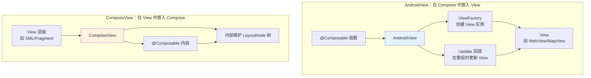

**术语解释：**
- **AndroidView**：一个特殊的 Composable，允许你在 Compose 中嵌入传统 View。类比：在一个全现代化的新房子里，保留一个老式壁炉——壁炉是旧时代的产物，但你仍然可以在新房子里使用它。
- **ComposeView**：一个继承自 `ViewGroup` 的容器，内部维护一个完整的 Compose Composition。类比：在老房子里装修一个智能房间——外壳是老房子，但里面是全新的智能系统。
- **ViewFactory**：`AndroidView` 的工厂参数，在首次组合时创建 View 实例。后续重组时不会重复创建，只会调用 `update` 回调更新 View 属性。

```kotlin
// AndroidView 示例：在 Compose 中嵌入 WebView
@Composable
fun WebViewScreen(url: String) {
    AndroidView(
        factory = { context ->
            WebView(context).apply {
                webViewClient = WebViewClient()
                settings.javaScriptEnabled = true
            }
        },
        update = { webView ->
            // 每次 url 变化时重新加载
            webView.loadUrl(url)
        },
        modifier = Modifier.fillMaxSize()
    )
}

// ComposeView 示例：在 XML/Fragment 中嵌入 Compose
class ComposeFragment : Fragment() {
    override fun onCreateView(
        inflater: LayoutInflater,
        container: ViewGroup?,
        savedInstanceState: Bundle?
    ): View {
        return ComposeView(requireContext()).apply {
            setViewCompositionStrategy(
                ViewCompositionStrategy.DisposeOnViewTreeLifecycleDestroyed
            )
            setContent {
                MyComposableContent()
            }
        }
    }
}
```

#### 7.2 互操作的性能考量

```mermaid
graph LR
    subgraph "性能边界"
        A["Compose Composition"] -->|"每次状态变化"| B["LayoutNode 更新"]
        B -->|"AndroidView 包装层"| C["传统 View 树"]
        C -->|"触发 requestLayout"| D["View.measure/layout"]
    end

    subgraph "性能注意点"
        E["1. AndroidView 的 update 回调<br/>应避免频繁触发 View 的 requestLayout"]
        F["2. ComposeView 内部的 Composition<br/>是独立的，不与外部共享状态"]
        G["3. 频繁的 Compose ↔ View 切换<br/>会产生额外的同步开销"]
    end

    style C fill:#FFCDD2
    style E fill:#FFF3E0
```

> **最佳实践**：在互操作场景中，尽量在 Compose 边界处完成状态转换，避免在 AndroidView 的 `update` 回调中频繁调用 `requestLayout()`。对于复杂的第三方 View，可以考虑用 `remember` 缓存 View 状态，减少不必要的同步。

---

## 📐 设计理念与架构图

> 本章节从架构设计的角度，系统阐述 Compose 的设计哲学、核心组件体系、状态管理架构，以及与传统 View 系统和其他声明式框架的对比。

### 1. Compose 的"一切都可组合"设计哲学

#### 1.1 函数即 UI

Compose 的核心理念是 **"一切都可以是 Composable 函数"**。在传统 View 系统中，UI 是由 XML 文件 + View 对象 + Java/Kotlin 代码三部分组成的；而在 Compose 中，**一个函数就是 UI 的全部**——它描述了界面长什么样，依赖什么状态，如何响应交互。

```mermaid
graph LR
    subgraph "传统 View 系统"
        X1["XML 布局文件"] --> X2["View 对象"]
        X3["Activity/Fragment 代码"] --> X2
        X2 --> X4["运行时 UI"]
    end

    subgraph "Compose"
        C1["@Composable 函数"] --> C2["编译器 Transform"]
        C2 --> C3["Composition 树"]
        C3 --> C4["LayoutNode 树"]
        C4 --> C5["运行时 UI"]
    end

    X4 -.->|"范式转变"| C1

    style X1 fill:#FFCDD2
    style C1 fill:#C8E6C9
```

**术语解释：**
- **Composable（可组合函数）**：标记了 `@Composable` 注解的函数，它描述 UI 的一个部分。函数的输入是参数和状态，输出是 UI 的描述。类比：乐高的单个积木——每个积木有输入接口（插孔）和输出接口（凸起），多个积木组合成完整的模型。
- **Composition（组合）**：Composable 函数执行后生成的 UI 描述树。类比：你按照说明书把乐高积木拼在一起后，得到的完整模型结构。
- **声明式范式（Declarative Paradigm）**：你描述"UI 应该是什么样子"（What），而不是"如何变成那个样子"（How）。框架负责从当前状态到目标状态的转换。类比：导航软件——你输入目的地（What），它自动规划路线（How），你不需要手动控制每个转弯。

#### 1.2 声明式范式的核心原则

```mermaid
graph TD
    A["声明式 UI 核心原则"] --> B["1. UI 是状态的函数<br/>UI = f(State)"]
    A --> C["2. 单向数据流<br/>State → UI → Event → State"]
    A --> D["3. 不可变性优先<br/>状态变化通过新对象表达"]
    A --> E["4. 组合优于继承<br/>通过嵌套 Composable 复用"]
    A --> F["5. 副作用隔离<br/>LaunchedEffect/DisposableEffect"]

    B --> G["当 State 变化时<br/>框架自动重新计算 UI"]
    C --> H["事件 → 更新 State →<br/>UI 自动更新"]
    D --> I["避免共享可变状态<br/>用 State 封装可观察性"]
    E --> J["Composable 可任意嵌套<br/>不依赖类继承体系"]
    F --> K["副作用不污染<br/>纯函数式的组合过程"]

    style A fill:#3F51B5,color:#fff
    style B fill:#E3F2FD
    style C fill:#E3F2FD
    style D fill:#E3F2FD
    style E fill:#E3F2FD
    style F fill:#E3F2FD
```

---

### 2. Compose 核心组件体系

```mermaid
classDiagram
    class Composer {
        +startRestartGroup(key)
        +endRestartGroup()
        +startReplaceableGroup(key)
        +endReplaceableGroup()
        +changed(value): Boolean
        +applyChanges()
        +remember(key, calculation)
    }

    class Applier {
        <<interface>>
        +onBeginChanges()
        +onEndChanges()
        +insertTopDown(node, index)
        +insertBottomUp(node, index)
        +remove(node, index, count)
        +move(from, to, count)
        +down(node)
        +up()
    }

    class UiApplier {
        +insert(node: LayoutNode)
        +remove(index, count)
        +move(from, to, count)
    }

    class SlotTable {
        -int[] keys
        -int[] groups
        -int[] nodeStarts
        -int[] nodeEnds
        -Array data
        +insertGroup(key)
        +skipToGroupEnd()
        +getGroup(index)
    }

    class Composition {
        <<interface>>
        +setContent(content)
        +dispose()
    }

    class CompositionImpl {
        -SlotTable slotTable
        -Applier applier
        -Composer composer
        +setContent(content)
        +recompose()
        +dispose()
    }

    class LayoutNode {
        +measure(Constraints)
        +place(x, y)
        +draw(canvas)
        +children: List~LayoutNode~
    }

    class RememberObserver {
        <<interface>>
        +onRemembered()
        +onForgotten()
    }

    Composer --> SlotTable : 读写
    CompositionImpl --> Composer : 持有
    CompositionImpl --> Applier : 持有
    CompositionImpl --> SlotTable : 持有
    Applier <|-- UiApplier
    UiApplier --> LayoutNode : 操作
    Composition <|-- CompositionImpl
    LayoutNode --> LayoutNode : 父子关系
```

**术语解释：**
- **Applier（应用器）**：将 Composable 函数执行产生的"变更"应用到实际的节点树上的接口。不同的 Applier 可以将 Composable 应用到不同的目标——`UiApplier` 应用到 `LayoutNode` 树（Android UI），`AbstractApplier` 可以应用到其他树结构（如测试用的虚拟节点树）。类比：Applier 就像一个施工队——Composer 是设计师画好的图纸，Applier 负责把图纸变成实际的建筑。换一个施工队（Applier），同样的图纸可以盖出不同材质的房子。
- **CompositionImpl（组合实现）**：`Composition` 接口的默认实现，协调 Composer、Applier、SlotTable 三者工作。类比：一个建筑项目的总包方——协调设计师（Composer）、施工队（Applier）、档案室（SlotTable）。
- **LayoutNode**：Compose 的 UI 节点，不继承 `android.view.View`。它有自己的 measure/layout/draw 逻辑，是完全独立的渲染单元。类比：乐高积木的标准件——不依赖外部标准（不继承 View），自成体系。

---

### 3. Compose 状态管理架构

```mermaid
graph TB
    subgraph "状态层"
        MS["MutableState&lt;T&gt;<br/>可观察的状态容器"]
        DS["derivedStateOf&lt;T&gt;<br/>派生计算状态"]
        SS["Snapshot State<br/>全局快照系统"]
    end

    subgraph "运行时层"
        SN["Snapshot<br/>MVCC 快照"]
        CR["Compose Runtime<br/>Recomposition 调度器"]
        CO["Composer<br/>状态追踪 + Invalidation"]
    end

    subgraph "UI 层"
        RC["Recomposition<br/>重新执行 Composable"]
        CT["Composition Tree<br/>LayoutNode 树更新"]
        RN["Render<br/>measure/layout/draw"]
    end

    MS -->|"读写"| SS
    DS -->|"依赖"| MS
    SS -->|"takeMutableSnapshot"| SN
    SN -->|"apply()" --> CR
    CR -->|"调度"| CO
    CO -->|"标记 Invalidation"| RC
    RC -->|"对比 SlotTable"| CT
    CT -->|"更新节点"| RN

    style MS fill:#E3F2FD
    style SN fill:#FFF3E0
    style RC fill:#FFCDD2
    style RN fill:#C8E6C9
```

**状态流转的完整路径：**

1. 用户操作 → 修改 `MutableState`
2. `MutableState` 写入 → 被 `Snapshot` 捕获
3. `Snapshot.apply()` → 通知 `Compose Runtime`
4. `Compose Runtime` → 标记读取了该 State 的 Scope 为 Invalid
5. 下一帧回调 → 调度 `Recomposition`
6. `Recomposition` → 重新执行受影响的 `Composable`
7. `Composer` → 对比 `SlotTable`，确定哪些节点需要更新
8. `Applier` → 将变更应用到 `LayoutNode` 树
9. `LayoutNode` → 触发 measure/layout/draw
10. 屏幕像素更新

---

### 4. 从 XML/View 到 Compose 的范式转变

```mermaid
graph LR
    subgraph "命令式（Imperative）View 系统"
        I1["1. 创建 XML 布局"] --> I2["2. setContentView()"]
        I2 --> I3["3. findViewById() 获取引用"]
        I3 --> I4["4. 手动设置属性<br/>textView.setText(...)"]
        I4 --> I5["5. 监听变化<br/>setOnClickListener"]
        I5 --> I6["6. 手动更新 UI<br/>textView.setVisibility(...)"]
        I6 --> I4
    end

    subgraph "声明式（Declarative）Compose"
        D1["1. 定义 @Composable 函数"] --> D2["2. 函数内读取 State"]
        D2 --> D3["3. State 变化时<br/>框架自动 Recompose"]
        D3 --> D4["4. 框架自动更新<br/>LayoutNode 树"]
        D4 --> D2
    end

    I6 -.->|"范式转变"| D3

    style I4 fill:#FFCDD2
    style I6 fill:#FFCDD2
    style D3 fill:#C8E6C9
    style D4 fill:#C8E6C9
```

**设计差异对比表：**

| 维度 | 命令式 View 系统 | 声明式 Compose |
|------|------------------|----------------|
| **UI 描述** | XML 文件 + View 对象 | @Composable 函数 |
| **状态更新** | 手动调用 setText/setEnabled | 修改 State，自动 Recompose |
| **UI 同步** | 开发者负责保持一致 | 框架自动保证一致性 |
| **复用方式** | 类继承 + 组合 View | 函数组合 |
| **布局定义** | XML 标签嵌套 | Composable 嵌套 |
| **事件处理** | setOnClickListener | lambda 参数 |
| **性能优化** | 手动 invalidate/requestLayout | 框架智能跳过 |
| **可测试性** | 需要 Activity/Fragment 环境 | 可直接测试函数 |

**术语解释：**
- **命令式 UI（Imperative UI）**：开发者需要明确地、一步一步地告诉框架如何操作 UI。类比：手动挡汽车——你需要自己踩离合、换挡、给油，每个操作都要亲力亲为。
- **声明式 UI（Declarative UI）**：开发者只描述 UI 在不同状态下应该是什么样子，框架自动处理状态转换。类比：自动挡汽车——你只需要踩油门或刹车，变速箱自动换挡。
- **UI 同步问题**：在命令式 UI 中，当数据变化时，开发者必须记得更新所有相关的 UI 控件，否则就会出现"数据变了但界面没变"的 Bug。声明式 UI 从根本上消除了这个问题——只要 State 更新了，UI 必然会更新。

---

### 5. Compose 与 React 的设计对比

```mermaid
graph TB
    subgraph "React"
        R1["JSX<br/>JavaScript 扩展语法"] --> R2["React.createElement()"]
        R2 --> R3["Virtual DOM<br/>JS 对象树"]
        R3 --> R4["Diff 算法<br/>对比新旧 VDOM"]
        R4 --> R5["最小化 DOM 操作"]
    end

    subgraph "Compose"
        C1["@Composable<br/>Kotlin 函数"] --> C2["Compose Compiler<br/>注入状态追踪"]
        C2 --> C3["SlotTable<br/>扁平化数组"]
        C3 --> C4["Composer.changed()<br/>编译期参数对比"]
        C4 --> C5["Applier<br/>更新 LayoutNode"]
    end

    subgraph "状态管理"
        RH["useState / useReducer<br/>Hooks"]
        CS["mutableStateOf<br/>Snapshot"]
    end

    RH --> R3
    CS --> C3

    style R3 fill:#E3F2FD
    style C3 fill:#FFF3E0
    style RH fill:#C8E6C9
    style CS fill:#FFCDD2
```

**详细对比表：**

| 维度 | React | Compose |
|------|-------|---------|
| **UI 描述** | JSX（JS 扩展语法） | @Composable（Kotlin 函数） |
| **状态管理** | Hooks（useState/useEffect） | State（mutableStateOf/LaunchedEffect） |
| **虚拟 DOM** | Virtual DOM（JS 对象树） | SlotTable（扁平化数组） |
| **更新检测** | 运行时 Diff 算法对比 VDOM | 编译期 + 运行时 changed() 对比 |
| **副作用** | useEffect / useLayoutEffect | LaunchedEffect / DisposableEffect |
| **跨层级传值** | Context API | CompositionLocal |
| **列表渲染** | map() + key | LazyColumn { items(key) } |
| **重渲染优化** | React.memo / useMemo | @Stable / @Immutable / remember |
| **类型安全** | TypeScript（可选） | Kotlin（原生强类型） |
| **平台** | Web / React Native | Android / Multiplatform |

**术语解释：**
- **Virtual DOM（虚拟 DOM）**：React 在内存中维护一棵 JavaScript 对象树，每次状态变化生成新树，通过 Diff 算法对比新旧树，找出最小变更集，再应用到真实 DOM。类比：设计师画了两版草图，对比哪里改了，只把改动部分交给施工队。
- **SlotTable vs Virtual DOM**：Compose 不需要在每次重组时生成新的树来做 Diff。SlotTable 是一个持久化的数组，Composer 在执行时直接对比参数是否变化（`changed()`），在编译期就确定了"哪些参数需要对比"。这使得 Compose 的更新检测比 React 的 VDOM Diff 更高效——不需要遍历整棵树。
- **Hooks vs Composable**：React 的 Hooks（useState/useEffect）和 Compose 的 State/LaunchedEffect 概念上相似，但实现不同。React Hooks 依赖调用顺序（不能在条件语句中调用），而 Composable 函数可以被编译器更灵活地处理。

---

### 6. Compose 的性能设计

#### 6.1 跳过重组 vs 传统 View 的 invalidate/draw

```mermaid
graph TB
    subgraph "传统 View 的更新机制"
        V1["数据变化"] --> V2["手动调用 invalidate()"]
        V2 --> V3["整个 View 树<br/>可能触发 requestLayout()"]
        V3 --> V4["重新 measure/layout<br/>（可能波及整棵树）"]
        V4 --> V5["重新 draw<br/>（影响范围内的所有 View）"]
    end

    subgraph "Compose 的更新机制"
        C1["State 变化"] --> C2["标记受影响 Scope<br/>为 Invalid"]
        C2 --> C3["智能跳过未变化的<br/>Composable（@Stable）"]
        C3 --> C4["只重新执行<br/>需要更新的函数"]
        C4 --> C5["只更新变化的<br/>LayoutNode"]
        C5 --> C6["只 measure/layout/draw<br/>受影响的节点"]
    end

    V5 -.->|"对比"| C6

    style V3 fill:#FFCDD2
    style V4 fill:#FFCDD2
    style C3 fill:#C8E6C9
    style C4 fill:#C8E6C9
```

**根本差异：**

| 维度 | 传统 View 系统 | Compose |
|------|----------------|---------|
| **更新粒度** | View 级别（可能波及整棵树） | Composable 函数级别（细粒度） |
| **触发方式** | 手动 invalidate/requestLayout | 自动 State 驱动 |
| **跳过机制** | 无（invalidate 后全部重绘） | 编译期 + 运行期参数对比 |
| **布局波及** | requestLayout 向上冒泡到根 | 只更新受影响的 LayoutNode 子树 |
| **状态追踪** | 开发者手动维护 | 编译器自动注入追踪代码 |
| **对象创建** | 每次 measure 创建临时对象 | SlotTable 复用，减少 GC |

**术语解释：**
- **invalidate()**：传统 View 中标记"这个 View 需要重绘"的方法，会在下一帧触发 `onDraw()`。但它无法跳过——即使内容没变，只要调用了 `invalidate()`，就会重绘。类比：你按了"重新检查"按钮，整层楼都要重新检查一遍，即使大部分房间根本没动过。
- **requestLayout()**：传统 View 中标记"这个 View 的布局需要重新计算"的方法，会向上冒泡到根 View，可能触发整棵 View 树的 measure/layout。这是传统 View 性能问题的常见根源。类比：你改了一个房间的门——整栋楼都要重新测绘，因为门的尺寸变化可能影响走廊通行。
- **Smart Recomposition 的优势**：Compose 在编译期就知道每个 Composable 依赖哪些参数，运行时只需对比参数是否变化即可决定是否跳过。而传统 View 的 invalidate 是"一刀切"的——无法知道 View 的内容是否真的变了。

---

### 7. 声明式 UI 的未来

#### 7.1 Server-Driven UI

```mermaid
graph LR
    subgraph "传统 Server-Driven UI"
        S1["服务器返回 JSON"] --> S2["客户端解析 JSON"]
        S2 --> S3["映射到 View/ViewHolder"]
        S3 --> S4["手动构建 View 树"]
    end

    subgraph "Compose + Server-Driven UI"
        C1["服务器返回 JSON"] --> C2["客户端解析为<br/>Composable DSL"]
        C2 --> C3["动态执行 @Composable"]
        C3 --> C4["自动生成 LayoutNode 树"]
    end

    style S3 fill:#FFCDD2
    style C3 fill:#C8E6C9
```

Compose 的"函数即 UI"特性使得 Server-Driven UI 更容易实现——服务器可以返回描述 UI 结构的 JSON，客户端将其映射为 Composable 调用，框架自动处理布局和渲染。无需为每种 UI 类型编写对应的 ViewHolder。

#### 7.2 跨平台：Compose Multiplatform

```mermaid
graph TD
    A["Compose 核心运行时<br/>（Kotlin 多平台）"] --> B["Compose UI<br/>（声明式 UI 框架）"]
    B --> C["Android: UiApplier → LayoutNode → Android Canvas"]
    B --> D["Desktop: UiApplier → LayoutNode → Swing/AWT"]
    B --> E["iOS: UiApplier → LayoutNode → Skiko（实验性）"]
    B --> F["Web: UiApplier → LayoutNode → DOM/Canvas（实验性）"]

    A --> G["共享: State / Modifier / Composable"]
    A --> H["共享: 动画 / 布局 / 主题"]

    style A fill:#3F51B5,color:#fff
    style C fill:#E8F5E9
    style D fill:#E3F2FD
    style E fill:#FFF3E0
    style F fill:#F3E5F5
```

**设计考量：**

| 维度 | 单平台（Android） | 跨平台（Multiplatform） |
|------|-------------------|------------------------|
| **UI 渲染** | Android Canvas | 各平台原生 Canvas（Skiko） |
| **布局系统** | LayoutNode（共享） | LayoutNode（共享） |
| **状态管理** | Snapshot（共享） | Snapshot（共享） |
| **原生组件** | AndroidView | 各平台原生互操作 |
| **性能** | 最优 | 略有损耗（抽象层） |
| **适用场景** | Android App | 跨平台 App / SDK |

**术语解释：**
- **Compose Multiplatform**：将 Compose 扩展到 Android 之外的平台（Desktop、iOS、Web），共享核心运行时和 UI 框架，只替换底层的渲染后端。类比：一套乐高设计图可以在不同材质（塑料、木质、金属）上实现——设计图（Composable）不变，只是材料（渲染后端）不同。
- **Skiko**：一个跨平台的 2D 图形库，基于 Skia（Chrome/Flutter 的渲染引擎），让 Compose 可以在非 Android 平台上绘制 UI。
- **Server-Driven UI（服务端驱动 UI）**：UI 结构由服务器动态下发，客户端根据服务器的描述渲染界面。常用于电商首页、活动页等需要频繁变更布局的场景。

---

## 📝 跨章节综合考核训练

> 以下 8 道考核题旨在检验对 Compose 与前述各章节知识的综合理解能力。每道题关联至少 2 个章节的内容，要求能够融会贯通地分析问题。

### 考核题 1：Compose 测量布局与 View 测量布局的底层差异

**涉及章节**：09-Compose + 00-概述

**题目**：

在 00 章中，我们学习了 Android View 系统的测量布局流程（`onMeasure` → `onLayout` → `onDraw`），以及 View Tree 的递归测量机制。在 09 章中，Compose 拥有自己独立的测量布局系统（`MeasurePolicy` → `measure` → `place`）。

请从以下角度对比分析两者的底层差异：

1. 测量的触发方式：传统 View 的 `requestLayout()` vs Compose 的 State 驱动重组，在"波及范围"上有何根本差异？
2. 测量的约束传递：传统 View 的 `MeasureSpec`（三种模式）vs Compose 的 `Constraints`（min/max），在表达能力和灵活性上有何差异？
3. 多次测量问题：传统 View 的 `measure()` 可能被调用多次（如 LinearLayout 的 weight 机制需要两次测量），Compose 如何避免这种多次测量带来的性能问题？
4. 为什么说 Compose 的 LayoutNode "不继承 View"这一设计是跨平台的基础？

**参考答案要点**：
- 传统 View 的 `requestLayout()` 会向上冒泡到根节点，可能导致整棵 View 树重新 measure/layout；而 Compose 的 State 变化只使受影响的 LayoutNode 子树重新测量，粒度更细。
- `MeasureSpec` 只有三种模式（EXACTLY/AT_MOST/UNSPECIFIED），表达力有限；Compose 的 `Constraints` 有 min/max 四个维度，更灵活，且支持 Intrinsic Measurement（固有特性测量）。
- 传统 View 中 LinearLayout 的 weight 需要先测量一遍获取总尺寸，再按比例分配空间进行第二次测量；Compose 通过 `IntrinsicMeasurable` 在一次测量中获取子元素的固有尺寸，避免多次测量。Compose 编译器还强制要求"测量不变性"（相同输入测量结果一致），从架构上避免了反复 `requestLayout` 的循环。
- LayoutNode 不继承 `android.view.View`，意味着它的测量/布局/绘制逻辑完全自包含，不依赖 Android Framework。这使得同一套 Compose 代码可以在 Desktop、iOS 等非 Android 平台运行，只需替换渲染后端（如 Skiko）。

---

### 考核题 2：Compose Column/Row 与 LinearLayout 的设计传承

**涉及章节**：09-Compose + 01-LinearLayout

**题目**：

在 01 章中，我们详细学习了 LinearLayout 的 weight（权重）机制、orientation（方向）、gravity（对齐）等特性。在 09 章中，Column 和 Row 作为 Compose 的核心布局组件，在很多概念上与 LinearLayout 一脉相承。

请分析：

1. `Column` 的 `verticalArrangement` 和 `horizontalAlignment`，分别对应 LinearLayout 的哪些属性？为什么 Compose 将"排列"和"对齐"拆分为两个独立参数？
2. LinearLayout 的 `layout_weight` 对应 Compose 中的什么概念？为什么 Compose 推荐使用 `Modifier.weight()` 而非在布局容器参数中设置？
3. LinearLayout 的 `gravity`（子元素自身对齐）和 `layout_gravity`（子元素在父容器中的对齐）容易混淆，Compose 如何通过 Modifier 简化这个概念？
4. 从"代码可读性"角度，对比 XML 中 `android:layout_weight="1"` 和 Compose 中 `Modifier.weight(1f)` 的表达方式。

**参考答案要点**：
- `verticalArrangement` 对应 LinearLayout 的 `gravity` 中的垂直排列方式（如 top/center/bottom/spaceBetween），`horizontalAlignment` 对应水平对齐方式。Compose 将排列（主轴方向上的分布）和对齐（交叉轴方向上的对齐）拆分，是因为它们语义不同——排列是"多个元素之间如何分布空间"，对齐是"元素在交叉轴上靠哪边"，分开更清晰。
- `layout_weight` 对应 `Modifier.weight()`。Compose 将 weight 作为 Modifier 而非容器参数，是因为 weight 是"子元素自身"的属性（我要占多少比例），而非"容器"的属性。这与 Compose "Modifier 描述自身"的哲学一致。
- 传统 View 中 `gravity`（容器内部整体对齐）和 `layout_gravity`（单个子元素对齐）容易混淆，因为它们都叫 "gravity"。Compose 通过 Modifier（如 `Modifier.align(Alignment.Center)`）将对齐操作绑定到具体子元素上，消除了"到底是谁对齐谁"的歧义。
- XML 的 `android:layout_weight="1"` 需要同时设置 `layout_width="0dp"` 才能生效，容易遗漏；Compose 的 `Modifier.weight(1f)` 自动处理约束，无需额外设置，且 `1f` 明确表达了"按浮点比例分配"的语义，比整数 weight 更直观。

---

### 考核题 3：Compose 重组与 RecyclerView 缓存复用的设计对比

**涉及章节**：09-Compose + 06-RecyclerView

**题目**：

在 06 章中，我们学习了 RecyclerView 的四级缓存机制（Scrap、Cache、ViewCacheExtension、RecycledViewPool）以及 ViewHolder 复用策略。在 09 章中，Compose 的 Recomposition 机制也是一种"复用"——通过 SlotTable 复用已有的组合结果。

请从"缓存复用"的角度对比两者：

1. RecyclerView 缓存的是什么？Compose 的 SlotTable "缓存"的是什么？两者的粒度有何差异？
2. RecyclerView 的 ViewHolder 复用需要 `onBindViewHolder()` 重新绑定数据，Compose 的 Smart Recomposition 如何避免"重新绑定"？
3. RecyclerView 的 `setItemViewCacheSize()` 控制缓存数量，Compose 中控制"跳过重组"的机制是什么？
4. 为什么说 Compose 的 `@Stable` 注解在概念上类似于 RecyclerView 的"稳定的 itemId"？

**参考答案要点**：
- RecyclerView 缓存的是 **ViewHolder 对象**（View 层级的复用），粒度是"一个列表项的 View 树"。Compose 的 SlotTable "缓存"的是 **Composable 的执行结果**（组合树的复用），粒度是"一个 Composable 函数的输出"。Compose 的粒度更细——可以跳过单个 Composable，而不需要复用整个列表项。
- RecyclerView 复用 ViewHolder 时必须调用 `onBindViewHolder()` 重新绑定数据（即使数据没变也要重新绑定）。Compose 的 Smart Recomposition 通过 `composer.changed()` 在编译期就确定了哪些参数需要对比，运行时只需比较参数是否变化，未变化则直接跳过整个函数执行，不需要"重新绑定"。
- RecyclerView 通过 `setItemViewCacheSize()` 控制 Scrap Cache 的数量。Compose 中控制"跳过重组"的机制是 **`@Stable`/`@Immutable` 注解 + 参数 `equals` 对比**——只要类型被标记为 Stable/Immutable，且参数未变化，就会跳过重组。
- RecyclerView 的稳定 `itemId`（通过 `getItemId()` 返回）让 Adapter 知道"这是同一个数据项"，从而复用对应的 ViewHolder。Compose 的 `@Stable` 注解让编译器知道"这个类型的实例可以通过 `equals` 判断是否变化"，从而决定是否跳过重组。两者本质上都是"标识稳定性以支持复用"——RecyclerView 是 View 级复用，Compose 是函数级复用。

---

### 考核题 4：Compose 的 LazyList 与 RecyclerView 的按需渲染机制对比

**涉及章节**：09-Compose + 06-RecyclerView

**题目**：

06 章中，RecyclerView 通过 LayoutManager + ItemDecoration + ItemAnimator 实现列表的按需渲染。09 章中，LazyColumn/LazyRow 用一行代码实现了类似功能。

请深入对比：

1. RecyclerView 的 "Item 回收" 和 LazyColumn 的 "Item 回收" 在底层实现上有什么本质区别？（提示：一个是 View 对象回收，一个是 Composable 函数状态回收）
2. RecyclerView 需要写 Adapter + ViewHolder，LazyColumn 用 `items() {}` DSL。从架构角度看，这种简化牺牲了什么？又获得了什么？
3. RecyclerView 的 `DiffUtil` 用于计算列表差异，LazyColumn 中对应的概念是什么？为什么 LazyColumn 对 diff 的需求更弱？
4. 大数据列表场景下，RecyclerView 和 LazyColumn 各自的性能瓶颈在哪里？

**参考答案要点**：
- RecyclerView 回收的是 **ViewHolder/View 对象**——滑出屏幕的 View 被放入缓存池，滑入时从池中取出复用。LazyColumn 回收的是 **Composable 的组合状态**（SlotTable 中的 Group）——滑出屏幕的 Item 的 Group 被标记为"不再活跃"，但其数据可能仍保留在 SlotTable 中；滑入时重新执行 Composable。本质区别是：RecyclerView 复用 View 对象，LazyColumn 复用/重建 Composable 状态。
- LazyColumn 的 `items() {}` DSL 简化了代码，但牺牲了 **精细控制能力**——RecyclerView 的 Adapter 可以精确控制每个 ViewHolder 的创建/绑定/回收时机，支持自定义动画、装饰器等。LazyColumn 获得的是 **声明式简洁性**——不需要写模板代码，`key` 参数自动处理 Item 标识。两者是"控制力 vs 简洁性"的权衡。
- RecyclerView 的 `DiffUtil` 计算新旧列表的差异，决定哪些 Item 需要更新/插入/删除/移动，然后通知 Adapter 执行动画。LazyColumn 中对应的是 **`key` 参数**——通过稳定的 key 标识每个 Item，LazyColumn 内部自动处理 Item 的添加/移除/移动动画。LazyColumn 对 diff 的需求更弱，因为 Compose 的重组本身就是增量更新——只有变化的 Composable 会被重新执行，不需要显式的 diff 计算。
- RecyclerView 的瓶颈在 **ViewHolder 创建和 `onBindViewHolder` 的执行**（尤其是复杂布局）。LazyColumn 的瓶颈在 **Composable 函数的首次组合（Composition）**——每个滑入屏幕的 Item 都需要完整执行一遍 Composable。但后续重组时，Smart Recomposition 可以跳过未变化的部分。对于极其复杂的列表项，LazyColumn 首次组合的开销可能高于 RecyclerView 的 ViewHolder 复用。

---

### 考核题 5：Compose Dp 与屏幕适配的密度转换差异

**涉及章节**：09-Compose + 08-屏幕适配

**题目**：

08 章中，我们学习了 dp（Density-independent Pixel）的概念，以及 `dp → px` 的转换公式 `px = dp * density`。在 09 章中，Compose 大量使用 `16.dp` 这样的 Dp 类型。

请分析：

1. Compose 中的 `Dp` 类型与 Android 传统 `dp` 单位在底层转换上是否一致？Compose 是如何获取 `density` 值的？
2. 传统 View 中通过 `getResources().getDisplayMetrics().density` 获取密度，Compose 中通过什么机制获取？这与 `LocalDensity` 有什么关系？
3. 08 章中讨论了 sp（Scale-independent Pixel）用于文字大小，Compose 的 `Text` 中 `fontSize` 参数使用的 `TextUnit.Sp` 是如何处理用户字体大小设置的？
4. 如果要在 Compose 中实现自定义的"适配方案"（类似 08 章中的今日头条适配方案），应该如何利用 `LocalDensity` 进行重定义？

**参考答案要点**：
- Compose 的 `Dp` 类型本质上仍然依赖 `px = dp * density` 公式，底层转换与传统 View 一致。但 Compose 将 Dp 封装为值类（value class），在编译时进行类型安全检查，避免了传统代码中 `int` 和 `dp` 混用的错误。Compose 通过 `LocalDensity` 获取当前屏幕的 `density` 和 `fontScale` 值。
- 传统 View 通过 `Resources.getDisplayMetrics()` 获取密度。Compose 通过 **`LocalDensity`**（一个 CompositionLocal）提供 `Density` 对象，其中包含 `density`（屏幕密度）和 `fontScale`（字体缩放）。`LocalDensity` 默认从 `Configuration` 中获取，但可以被父 Composable 覆盖。
- `TextUnit.Sp` 对应传统 `sp` 单位，会乘以 `fontScale`（用户在系统设置中调整的字体大小）。当用户调大系统字体时，使用 `sp` 的 Text 会自动放大。Compose 中 `fontSize = 16.sp` 等价于传统 `textSize="16sp"`，但 `TextUnit` 是类型安全的，不会与 `Dp` 混淆。
- 实现自定义适配方案：可以通过 `CompositionLocalProvider(LocalDensity provides Density(density = customDensity, fontScale = 1f))` 覆盖整个子树的密度。例如，要让所有 `dp` 值按设计图宽度等比缩放，可以计算 `customDensity = actualScreenSize / designScreenSize * originalDensity`，然后通过 `LocalDensity provides` 注入。这比传统方案中修改 `DisplayMetrics` 更安全（不影响原生 View），且作用域可控（只影响指定子树）。

---

### 考核题 6：Compose 动画 vs ConstraintLayout MotionLayout 的设计对比

**涉及章节**：09-Compose + 04-ConstraintLayout

**题目**：

04 章中，MotionLayout 通过 ConstraintSet 定义起始/结束状态，自动计算过渡动画。09 章中，Compose 的 `animateXxxAsState`、`AnimatedContent`、`updateTransition` 等提供了声明式动画能力。

请对比：

1. MotionLayout 的"关键帧动画"（KeyFrame）和 Compose 的 `updateTransition` 在设计理念上有何异同？
2. MotionLayout 通过 XML 定义 `Transition` 和 `ConstraintSet`，Compose 的动画完全用代码定义。这对"动画的可视化编辑"有什么影响？
3. MotionLayout 支持复杂的路径动画（通过 `KeyPosition`），Compose 中如何实现类似效果？
4. 从"状态驱动"的角度，分析 MotionLayout 的 `transitionTo()` 和 Compose 的 `animateDpAsState(targetValue)` 的本质区别。

**参考答案要点**：
- MotionLayout 的 KeyFrame 动画通过定义起始/结束 ConstraintSet 和中间关键帧（KeyFrame），框架自动在 ConstraintSet 之间插值。Compose 的 `updateTransition` 通过定义目标状态（targetState），框架自动在当前状态和目标状态之间插值多个属性。两者都是"声明起始/结束状态，框架自动过渡"，但 MotionLayout 依赖 ConstraintSet（约束系统），Compose 直接对属性值插值（更灵活）。
- MotionLayout 的 XML 定义支持 Android Studio 的 MotionEditor 可视化编辑，设计师可以直接拖拽定义路径。Compose 的动画纯代码定义，目前没有同等级的可视化编辑器，但提供了 `@Preview` 动画预览。MotionLayout 的优势在于"可视化编辑"，Compose 的优势在于"代码即配置"的可编程性和可组合性。
- MotionLayout 的 `KeyPosition` 可以定义非线性运动路径（如弧线运动）。Compose 中可以通过 `animateValueAsState` + 自定义 `TwoWayConverter` 实现类似效果，或使用 `Path` + `Keyframes` 定义关键帧。Compose 还可以通过 `lookaheadLayout`（实验性）实现更复杂的布局过渡动画。
- MotionLayout 的 `transitionTo(R.id.end)` 是"命令式"触发——你告诉它"过渡到这个状态"。Compose 的 `animateDpAsState(targetValue = if (expanded) 200.dp else 100.dp)` 是"声明式"驱动——你声明"当前状态是什么"，框架自动从当前值动画到目标值。本质区别：MotionLayout 需要手动触发过渡，Compose 的动画是 State 变化的自然结果——只要 State 变了，动画自动发生。

---

### 考核题 7：Compose 的性能优化与布局优化的范式差异

**涉及章节**：09-Compose + 07-优化技巧

**题目**：

07 章中，我们学习了传统 View 系统的性能优化技巧：减少 View 层级、避免过度绘制、使用 `<include>`/`<merge>`/`ViewStub` 优化布局、使用 ConstraintLayout 替代多层嵌套的 RelativeLayout/LinearLayout 等。

请分析 Compose 中的性能优化与传统 View 优化在"范式"上的根本差异：

1. 传统 View 优化强调"减少 View 层级"，Compose 中是否也存在"层级过深"的问题？为什么？
2. 传统 View 的"过度绘制"（Overdraw）问题，在 Compose 中如何表现？Compose 是否自动解决了过度绘制？
3. 07 章中提到的 `<merge>` 和 `ViewStub` 优化手段，在 Compose 中有对应物吗？
4. 传统 View 优化工具（Hierarchy Viewer / Layout Inspector / Systrace）与 Compose 优化工具（Layout Inspector 的 Compose 标签页、Recomposition 计数器）在关注点上有什么不同？

**参考答案要点**：
- 传统 View 中"层级过深"会导致 measure/layout 递归深度大、`requestLayout()` 波及范围广。Compose 中**同样存在层级过深问题**，但原因不同——深层次的 Composable 嵌套会增加 SlotTable 的 Group 数量和 Composer 的 changed() 检查次数。不过 Compose 的 Smart Recomposition 使得"重组"的影响范围可控，不一定会波及整棵树。传统 View 的层级问题影响"测量波及范围"，Compose 的层级问题影响"重组检查开销"。
- 传统 View 的过度绘制是因为多个 View 的背景叠加绘制。Compose **并不自动解决过度绘制**——如果多个 Composable 叠加背景，仍然会产生过度绘制。但 Compose 提供了 `Modifier.drawBehind` / `Modifier.drawWithContent` 等手段，可以更精确地控制绘制顺序。同时 Compose 的 `CompositingStrategy` 可以控制图层合成策略，合理使用可以减少过度绘制。
- `<merge>` 在传统 View 中用于消除 XML 根布局的冗余层级。Compose 中**天然没有这个问题**——Composable 函数不会引入额外的"容器层级"，只有使用了 `Column`/`Row`/`Box` 等布局组件时才会创建 LayoutNode。不需要 `<merge>` 这样的特殊标签。`ViewStub` 用于延迟加载布局，Compose 中对应的是**条件渲染**——`if (shouldShow) { HeavyComposable() }`，只有在条件为 true 时才执行组合。
- 传统 View 的 Layout Inspector 关注 **View 树结构和属性**；Compose 的 Layout Inspector 关注 **Composable 调用树、Recomposition 次数、SlotTable 结构**。传统 Systrace 关注 `measure/layout/draw` 的耗时；Compose 还需要关注 **Composition 阶段的耗时**（首次组合 vs 重组）。Compose 新增了 **Recomposition 计数器**工具，可以直观看到每个 Composable 被重组了多少次，这是传统 View 没有的维度。

---

### 考核题 8：Compose 的声明式对 ScrollView 命令式滚动的影响

**涉及章节**：09-Compose + 05-ScrollView

**题目**：

05 章中，我们学习了 ScrollView/NestedScrollView 的滚动机制，包括 `scrollTo()`、`smoothScrollTo()` 等命令式滚动 API，以及嵌套滚动的 `NestedScrollingParent`/`NestedScrollingChild` 接口。

在 09 章中，Compose 的 `LazyColumn`/`verticalScroll` 提供了滚动能力，但滚动控制方式完全不同。

请分析：

1. 传统 `scrollView.scrollTo(x, y)` 是命令式调用，Compose 中如何实现"滚动到指定位置"？`rememberScrollState()` 和 `LazyListState` 的设计理念是什么？
2. 传统 NestedScrollView 的嵌套滚动需要实现 `NestedScrollingParent`/`NestedScrollingChild` 两个接口，且需要处理 `onNestedPreScroll`/`onNestedScroll` 等回调。Compose 中如何实现嵌套滚动？`Modifier.nestedScroll` 的设计有何优势？
3. 传统 `ScrollView` 只能包含一个直接子 View（通常是一个 LinearLayout），`NestedScrollView` 解决了部分嵌套问题。Compose 的 `Column` + `verticalScroll` 和 `LazyColumn` 在滚动机制上有何根本差异？
4. 从"滚动事件消费"的角度，对比传统 `onInterceptTouchEvent`/`onTouchEvent` 和 Compose 的 `Modifier.scrollable`/`Modifier.pointerInput` 的事件处理方式。

**参考答案要点**：
- 传统 `scrollTo()` 是同步命令式调用——你直接告诉 ScrollView "滚到 (x, y)"。Compose 中通过 `rememberScrollState()` 创建一个 `ScrollState` 对象（持有当前滚动偏移量），通过 `scrollState.animateScrollTo(value)` 或 `scrollState.scrollTo(value)` 进行滚动。`LazyListState` 类似，但提供了 `firstVisibleItemIndex` 等列表特有信息。设计理念：**状态驱动滚动**——滚动位置是一个 State，修改 State 触发滚动动画，而不是直接调用方法。这使得滚动位置可以跨重组保持，且可以被观察。
- 传统嵌套滚动需要实现两个接口 + 多个回调方法，代码繁琐。Compose 通过 **`Modifier.nestedScroll(connection, dispatcher)`** 实现嵌套滚动，`connection` 是一个 `NestedScrollConnection` 对象，包含 `onPreScroll`/`onPostScroll`/`onPreFling`/`onPostFling` 四个可选回调。优势：声明式定义嵌套滚动行为，作为 Modifier 可以链式组合，不需要继承特定类，且作用域精确到单个 Composable。
- `Column` + `verticalScroll` 会**一次性组合所有子元素**（即使不可见），然后将整个内容放入可滚动区域——类似传统 ScrollView。`LazyColumn` **只组合可见区域的子元素**，滑出屏幕的 Item 被回收。根本差异：`verticalScroll` 适用于少量内容（如设置页），`LazyColumn` 适用于大量内容（如列表）。`verticalScroll` 的子元素全部参与 Composition，`LazyColumn` 的子元素按需组合。
- 传统 `onInterceptTouchEvent`/`onTouchEvent` 是命令式的——你在回调中处理 ACTION_DOWN/MOVE/UP，手动决定是否拦截事件。Compose 通过 `Modifier.pointerInput` 提供手势检测（`detectDragGestures`、`detectVerticalDragGestures` 等），通过 `Modifier.scrollable` 封装滚动逻辑。优势：声明式定义手势行为，作为 Modifier 可组合，不需要在 View 的 `dispatchTouchEvent` 中写复杂的条件判断。但底层仍然是通过 PointerEvent 系统分发触摸事件，只是 API 更加简洁和可组合。

---

> **考核建议**：以上 8 道题建议闭卷作答，每题限时 15 分钟。重点关注"对比分析"能力——能够从底层机制、设计理念、性能特征等多个维度进行横向对比，而非简单罗列知识点。能够准确说出"两者在 XX 维度上的根本差异是 YY"是合格标准。

---

## 参考文献与延伸阅读

### 官方文档
1. **[Android 官方文档 - Jetpack Compose 概览](https://developer.android.com/jetpack/compose)**
   - Google 官方 Jetpack Compose 入口文档，涵盖 Compose 的设计理念、核心 API 和学习路径。
2. **[Android 官方文档 - Compose 性能优化](https://developer.android.com/jetpack/compose/performance)**
   - Google 官方 Compose 性能指南，涵盖重组优化、稳定性推断（Stability）和延迟组合。
3. **[Android 官方文档 - Compose 状态管理](https://developer.android.com/jetpack/compose/state)**
   - Google 官方状态管理文档，说明 State、MutableState、remember 和状态提升的设计模式。

### SlotTable 与运行时原理
4. **[深入理解 Jetpack Compose SlotTable 系统 - InfoQ](https://xie.infoq.cn/article/dd1e489d3152a4228a1257240)**
   - InfoQ 深度技术文章，系统解析 SlotTable 的数据结构、Gap Buffer 机制及其在 Compose 渲染中的作用。
5. **[Jetpack Compose Runtime 浅析 - CSDN](https://blog.csdn.net/bigbigmajia/article/details/119749674)**
   - 解析 Compose 编译器插件、Runtime 库和 UI 库的分层架构及交互关系。
6. **[Jetpack Compose Runtime：声明式 UI 的基础 - 阿里云开发者社区](https://developer.aliyun.com/article/938968)**
   - 从 NodeTree 管理引擎的角度分析 Compose Runtime 的设计，解释其不依赖 View 系统的独立运行能力。

### Snapshot 系统与状态
7. **[扒一扒 Jetpack Compose 实现原理 - 网易云音乐技术团队 (SegmentFault)](https://segmentfault.com/a/1190000042857106)**
   - 深入分析 Compose 的 Snapshot MVCC 多版本并发控制实现，与数据库事务和 Git 版本控制进行类比。
8. **[Jetpack Compose 深入探索系列五：State Snapshot System - CSDN](https://blog.csdn.net/lyabc123456/article/details/129192937)**
   - 系统性讲解 Compose 状态快照系统的设计，包括 Snapshot 的创建、修改和通知机制。

### Compose 与传统 View 对比
9. **[Android 17 + Compose：UI 开发有哪些变化？——从 Runtime 出发 - 今日头条](http://m.toutiao.com/group/7660769436311536163/)**
   - 分析 Android 17 对 Compose Runtime 的影响，以及 State → Snapshot → Recomposition → Layout → Draw 的全链路变化。
