# 章节总结 — Android 布局系统

> 🎯 **一句话总结**：掌握 Android 六大布局的核心原理与选型策略，是构建高质量 UI 的基础。本章系统梳理所有布局知识，构建完整的认知框架。

---

## 📋 教学信息

| 属性 | 值 |
|------|-----|
| 🎯 学习目标 | 建立布局系统的完整知识体系，能独立选型和架构 UI |
| 📚 前置知识 | 前面所有章节内容（01-09） |
| 📊 难度分级 | ⭐ 入门（总结梳理） |
| ⏱️ 时间预估 | 20 分钟 |
| 🎓 适用阶段 | 章节复习、面试准备、项目选型参考 |

---

## 1. 一句话总结

Android 布局系统包含 **LinearLayout、RelativeLayout、FrameLayout、ConstraintLayout、TableLayout、Jetpack Compose** 六大方案，每种布局有其最佳适用场景，理解它们的差异是高效开发的前提。

---

## 2. 布局选择决策树

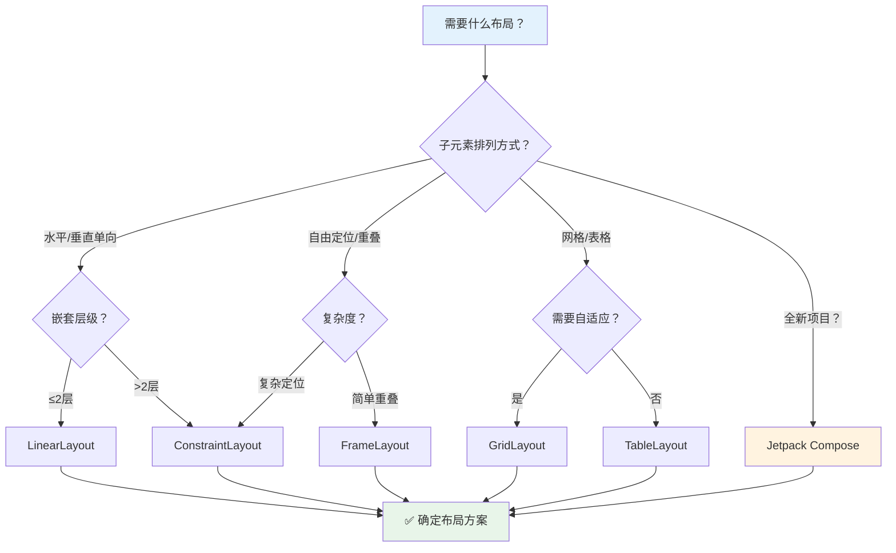

---

## 3. 六大布局功能对比表

| 特性 | LinearLayout | RelativeLayout | FrameLayout | ConstraintLayout | TableLayout | Compose |
|------|:---:|:---:|:---:|:---:|:---:|:---:|
| **定位方式** | 线性排列 | 相对定位 | 堆叠/锚点 | 约束关系 | 表格行列 | 声明式 |
| **嵌套性能** | ❌ 差 | ⚠️ 中 | ✅ 好 | ✅✅ 极好 | ⚠️ 中 | ✅✅ 极好 |
| **学习难度** | ⭐ 简单 | ⭐⭐ 中等 | ⭐ 简单 | ⭐⭐⭐ 复杂 | ⭐⭐ 中等 | ⭐⭐ 中等 |
| **灵活度** | ⭐ 低 | ⭐⭐ 中 | ⭐⭐ 中 | ⭐⭐⭐ 高 | ⭐ 低 | ⭐⭐⭐ 高 |
| **代码可读性** | ✅ 高 | ⚠️ 中 | ✅ 高 | ⚠️ 中 | ✅ 高 | ✅✅ 极高 |
| **扁平化** | ❌ 需嵌套 | ⚠️ 可以 | ❌ 基本不 | ✅✅ 完全扁平 | ❌ 需嵌套 | ✅✅ 完全扁平 |
| **动态约束** | ❌ | ⚠️ | ❌ | ✅ | ❌ | ✅ |
| **Android 版本** | API 1+ | API 1+ | API 1+ | API 13+ | API 1+ | API 21+ |
| **推荐场景** | 简单线性 | 中等布局 | 重叠内容 | 复杂UI | 表格数据 | 新项目 |

**术语解释：**
- **定位方式**：View 在容器中如何确定位置。LinearLayout 靠线性排列，RelativeLayout 靠相对引用，FrameLayout 靠堆叠，ConstraintLayout 靠约束方程。
- **嵌套性能**：多层布局嵌套时的渲染性能。LinearLayout 嵌套会导致多次 measure，性能差；ConstraintLayout 一次 measure 搞定，性能极好。
- **扁平化**：减少嵌套层级。ConstraintLayout 和 Compose 可以完全扁平化（1 层），而 LinearLayout 需要嵌套才能实现复杂布局。
- **动态约束**：运行时动态修改布局。ConstraintLayout 可以用 ConstraintSet 动态修改约束，Compose 可以用 State 动态改变 UI。
- **API 版本**：Android 系统版本号。API 1 是 Android 1.0（2008年），API 13 是 Android 3.2（2011年），API 21 是 Android 5.0（2014年）。
- **TableLayout（表格布局）**：按行列排列子 View 的容器，适合展示表格数据。类似 HTML 的 table。

---

## 4. 核心知识图谱

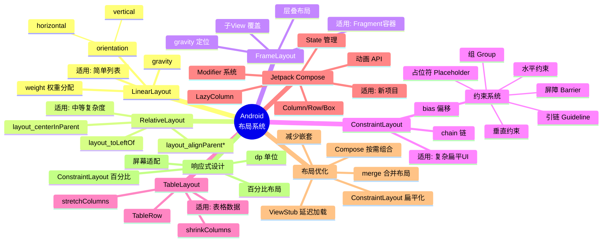

---

## 5. 布局嵌套性能对比

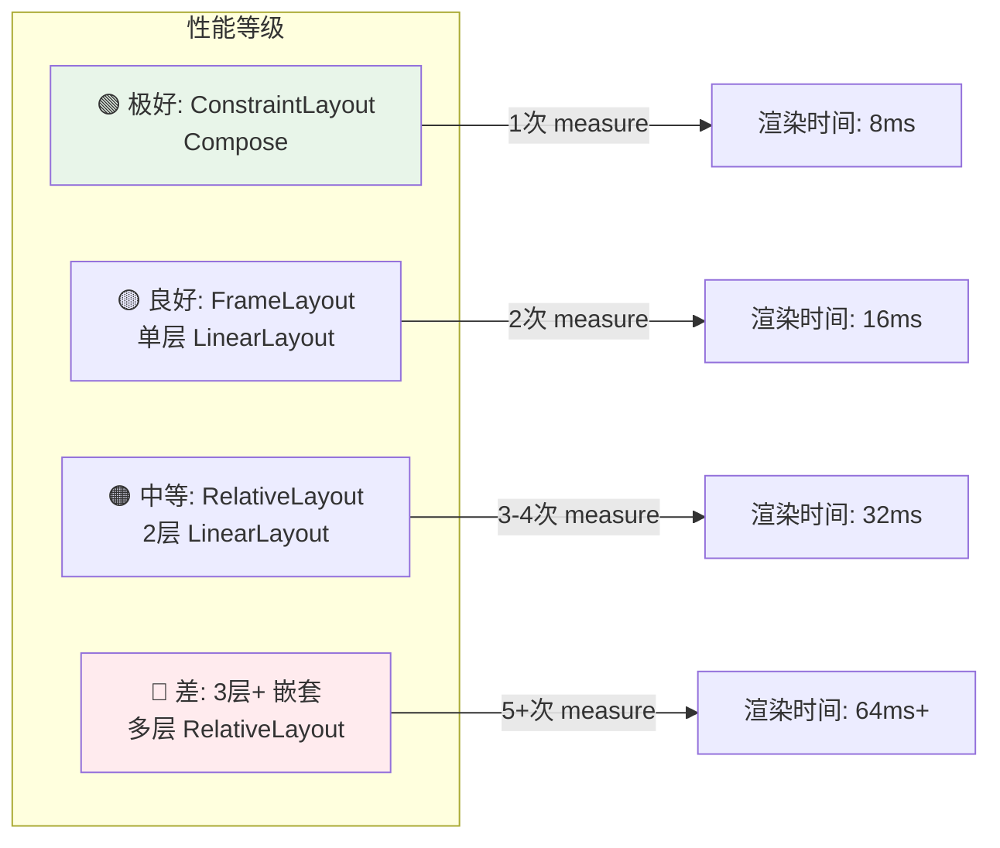

**性能关键指标：**

| 指标 | 说明 | 优化目标 |
|------|------|----------|
| Measure 次数 | 每次嵌套增加 1 次 | ≤ 2 次 |
| Layout 深度 | 嵌套层数 | ≤ 3 层 |
| Overdraw | 重绘次数 | ≤ 2x |
| View 数量 | 单个布局中的 View 数 | ≤ 50 个 |

---

## 6. 各布局代码示例对照

### LinearLayout — 简单垂直列表

```kotlin
@Composable
fun LinearExample() {
    Column(modifier = Modifier.padding(16.dp)) {
        Text("标题", style = MaterialTheme.typography.headlineSmall)
        Text("内容", style = MaterialTheme.typography.bodyMedium)
        Button(onClick = {}) { Text("操作") }
    }
}
```

```xml
<!-- XML 等价 -->
<LinearLayout
    android:orientation="vertical"
    android:padding="16dp"
    android:layout_width="match_parent"
    android:layout_height="wrap_content">
    <TextView android:text="标题" />
    <TextView android:text="内容" />
    <Button android:text="操作" />
</LinearLayout>
```

### ConstraintLayout — 复杂扁平布局

```kotlin
@Composable
fun ConstraintExample() {
    Box(modifier = Modifier.fillMaxSize()) {
        // 顶部标题 - 约束到顶部
        Text(
            "标题",
            modifier = Modifier.align(Alignment.TopCenter).padding(top = 16.dp)
        )
        // 中间内容 - 居中
        Text(
            "内容",
            modifier = Modifier.align(Alignment.Center)
        )
        // 底部按钮 - 约束到底部
        Button(
            onClick = {},
            modifier = Modifier.align(Alignment.BottomCenter).padding(bottom = 16.dp)
        ) {
            Text("操作")
        }
    }
}
```

### LazyColumn — 高效列表

```kotlin
@Composable
fun LazyListExample(items: List<String>) {
    LazyColumn(
        contentPadding = PaddingValues(16.dp),
        verticalArrangement = Arrangement.spacedBy(8.dp)
    ) {
        items(items, key = { it }) { item ->
            Card(modifier = Modifier.fillMaxWidth()) {
                Text(item, modifier = Modifier.padding(16.dp))
            }
        }
    }
}
```

---

## 7. 布局优化清单

### 优化检查表

| 优化项 | 方法 | 优先级 |
|--------|------|--------|
| 减少嵌套 | 用 ConstraintLayout/Compose 替代多层 LinearLayout | 🔴 高 |
| 延迟加载 | 使用 ViewStub 加载不常用布局 | 🟡 中 |
| 合并布局 | 使用 `<merge>` 标签减少层级 | 🟡 中 |
| 避免过度绘制 | 移除不必要的 background | 🟡 中 |
| 列表优化 | RecyclerView/Compose LazyColumn + DiffUtil | 🔴 高 |
| 按需组合 | Compose 中拆分细粒度 Composable | 🟡 中 |
| 图片优化 | 使用 Glide/Coil 异步加载 + 缓存 | 🔴 高 |

### Before/After 优化示例

```kotlin
// ❌ Before: 3层嵌套 LinearLayout
// LinearLayout(vertical)
//   LinearLayout(horizontal)
//     TextView
//     TextView
//   LinearLayout(horizontal)
//     Button
//     Button

// ✅ After: 单层 ConstraintLayout / Compose
@Composable
fun OptimizedLayout() {
    Column(modifier = Modifier.fillMaxWidth().padding(16.dp)) {
        Row(
            modifier = Modifier.fillMaxWidth(),
            horizontalArrangement = Arrangement.SpaceBetween
        ) {
            Text("标题")
            Text("副标题")
        }
        Spacer(modifier = Modifier.height(8.dp))
        Row(
            modifier = Modifier.fillMaxWidth(),
            horizontalArrangement = Arrangement.spacedBy(8.dp)
        ) {
            Button(onClick = {}) { Text("确定") }
            OutlinedButton(onClick = {}) { Text("取消") }
        }
    }
}
```

---

## 8. 项目文件结构参考

```
app/
├── src/
│   ├── main/
│   │   ├── java/com/example/app/
│   │   │   ├── ui/
│   │   │   │   ├── theme/           # Compose 主题
│   │   │   │   │   ├── Color.kt
│   │   │   │   │   ├── Theme.kt
│   │   │   │   │   └── Type.kt
│   │   │   │   ├── screens/         # 页面 Composable
│   │   │   │   │   ├── HomeScreen.kt
│   │   │   │   │   ├── DetailScreen.kt
│   │   │   │   │   └── SettingsScreen.kt
│   │   │   │   ├── components/      # 可复用组件
│   │   │   │   │   ├── CommonTopBar.kt
│   │   │   │   │   ├── ArticleCard.kt
│   │   │   │   │   └── LoadingView.kt
│   │   │   │   └── navigation/      # 导航配置
│   │   │   │       └── AppNavGraph.kt
│   │   │   ├── data/                # 数据层
│   │   │   │   ├── model/
│   │   │   │   ├── repository/
│   │   │   │   └── remote/
│   │   │   └── viewmodel/           # ViewModel
│   │   │       └── HomeViewModel.kt
│   │   ├── res/
│   │   │   ├── layout/              # XML 布局（遗留）
│   │   │   ├── values/
│   │   │   │   ├── strings.xml
│   │   │   │   ├── colors.xml
│   │   │   │   └── themes.xml
│   │   │   └── drawable/
│   │   └── AndroidManifest.xml
│   └── test/                        # 单元测试
└── build.gradle.kts
```

---

## 9. 面试综合高频问题（10+）

### Q1: Android 有哪几种布局？各有什么特点？

**答**：
- **LinearLayout**：线性排列，简单直观，但深层嵌套性能差
- **RelativeLayout**：相对定位，灵活但可读性一般
- **FrameLayout**：堆叠布局，适合 Fragment 容器和简单重叠
- **ConstraintLayout**：约束系统，扁平化复杂布局，性能最优
- **TableLayout**：表格排列，适合展示表格数据
- **Jetpack Compose**：声明式 UI，Google 官方推荐的现代方案

---

### Q2: ConstraintLayout 相比其他布局有什么优势？

**答**：
1. **扁平化**：一个 ConstraintLayout 可替代多层嵌套
2. **性能好**：仅需 1 次 measure，远优于嵌套 LinearLayout
3. **功能丰富**：Guideline、Barrier、Chain、Bias 等高级特性
4. **可视化编辑**：Android Studio 提供强大的可视化编辑器
5. **百分比支持**：支持百分比约束，适配不同屏幕

---

### Q3: 什么是扁平化布局？为什么重要？

**答**：扁平化是指减少布局嵌套层级。Android 的 measure/layout 是递归过程，每增加一层嵌套，measure 次数就增加，导致：
- 渲染时间增加（掉帧）
- 内存消耗增大
- 开发维护复杂度上升

**优化目标**：布局层级 ≤ 3 层，measure 次数 ≤ 2 次。

**术语解释：**
- **递归（Recursion）**：函数调用自身的过程。View Tree 的 measure/layout/draw 都是递归的——父 View 调用子 View 的 onMeasure()，子 View 再调用孙 View 的 onMeasure()...层级越深，递归调用次数越多，耗时越长。
- **掉帧（Frame Drop）**：Android 要求每帧渲染时间 ≤16ms（60FPS）。如果 measure/layout/draw 总时间超过 16ms，就会掉帧，用户可感知卡顿。
- **优化目标**：布局层级 ≤3 层，measure 次数 ≤2 次。超过这个目标，性能会明显下降。

---

### Q4: dp、sp、px 分别是什么？如何使用？

**答**：
| 单位 | 全称 | 用途 | 说明 |
|------|------|------|------|
| dp | density-independent pixel | 布局尺寸 | 1dp = 1px @160dpi |
| sp | scalable-pixel | 文字大小 | 受用户字体大小设置影响 |
| px | pixel | 精确像素 | 不推荐使用，不适配 |

**规则**：布局用 dp，文字用 sp，永远不要用 px。

---

### Q5: 如何处理不同屏幕尺寸的适配？

**答**：
1. **ConstraintLayout 百分比**：使用 `layout_constraintWidth_percent`
2. **最小宽度限定符**：`values-sw600dp`、`values-sw720dp`
3. **dp 单位**：所有尺寸用 dp，系统自动适配
4. **Compose 自适应**：`Modifier.fillMaxWidth()` + `BoxWithConstraints`
5. **屏幕方向**：`layout-land` / `layout-port` 资源限定符

---

### Q6: ViewStub 是什么？什么时候使用？

**答**：ViewStub 是轻量级视图，用于延迟加载不常用的布局。它本身不渲染任何内容，只在调用 `inflate()` 或设为 `visible` 时才加载真正的布局。

**适用场景**：错误页面、加载失败页面、首次使用引导页等。

---

### Q7: merge 标签的作用是什么？

**答**：`<merge>` 标签用于减少布局层级。当一个布局被 `<include>` 或作为自定义 ViewGroup 的根布局时，`<merge>` 的子元素会直接合并到父布局中，省去一层多余的 ViewGroup 包裹。

---

### Q8: RecyclerView 和 ListView 的区别？

**答**：
| 特性 | RecyclerView | ListView |
|------|-------------|----------|
| ViewHolder | 强制使用 | 可选 |
| 布局管理器 | LayoutManager 可插拔 | 只有垂直列表 |
| 动画 | 内置支持 | 需手动实现 |
| 局部刷新 | notifyItemChanged 精确 | notifyDataSetChanged 全量 |
| 性能 | 更优（回收复用优化） | 一般 |
| 分割线 | ItemDecoration | divider 属性 |

---

### Q9: Jetpack Compose 如何替代传统 XML 布局？

**答**：
| XML 概念 | Compose 等价 |
|----------|-------------|
| `LinearLayout(vertical)` | `Column` |
| `LinearLayout(horizontal)` | `Row` |
| `FrameLayout` | `Box` |
| `RecyclerView` | `LazyColumn` / `LazyRow` |
| `TextView` | `Text` |
| `Button` | `Button` |
| `EditText` | `TextField` / `OutlinedTextField` |
| `ImageView` | `Image` |
| `CardView` | `Card` |
| `ConstraintLayout` | Compose 布局组合（无需等价） |
| `ViewStub` | 按条件渲染（`if` 语句） |
| `include` | 函数调用 |
| `DataBinding` | 直接绑定 State |

**术语解释：**
- **Column**：Compose 中的垂直排列容器，等价于 `LinearLayout(vertical)`。子元素从上到下排列。
- **Row**：Compose 中的水平排列容器，等价于 `LinearLayout(horizontal)`。子元素从左到右排列。
- **Box**：Compose 中的堆叠容器，等价于 `FrameLayout`。子元素从左上角开始堆叠。
- **LazyColumn**：Compose 中的可滚动垂直列表，等价于 `RecyclerView`。只渲染屏幕上可见的 Item。
- **LazyRow**：Compose 中的可滚动水平列表，等价于 `HorizontalRecyclerView`。
- **Text**：Compose 中的文字组件，等价于 `TextView`。
- **TextField / OutlinedTextField**：Compose 中的输入框，等价于 `EditText`。OutlinedTextField 有边框样式。
- **Image**：Compose 中的图片组件，等价于 `ImageView`。
- **Card**：Compose 中的卡片组件，等价于 `CardView`。带有圆角和阴影。
- **按条件渲染**：Compose 中用 `if` 语句控制组件是否显示，等价于 ViewStub 的延迟加载。`if (showError) { ErrorView() }` 只在 showError 为 true 时才执行 ErrorView()。
- **函数调用**：Compose 中复用布局就是调用一个 @Composable 函数，等价于 XML 的 `<include>` 标签。
- **DataBinding**：Android 的数据绑定库，可以在 XML 中直接绑定数据。Compose 中直接用 State 绑定，更简单。

---

### Q10: 什么是重组（Recomposition）？如何优化？

**答**：Recomposition 是 Compose 在状态变化时重新执行受影响的 Composable 函数的过程。

**优化方法**：
1. **拆分细粒度 Composable**：让每个函数只关心自己需要的 State
2. **使用 `key`**：LazyColumn 中为每个 item 提供稳定 key
3. **`derivedStateOf`**：避免重复计算，缓存派生状态
4. **`remember`**：保持对象引用，避免重复创建
5. **避免在 Composable 中创建新对象**：每次 Recomposition 都会产生新引用

---

### Q11: 如何在项目中渐进式迁移 Compose？

**答**：
1. **新页面直接用 Compose**：最简单的起步方式
2. **混合模式**：XML + AndroidView 桥接 Compose 组件
3. **先迁移列表页**：LazyColumn 替代 RecyclerView 效果最明显
4. **再迁移详情页**：State 管理简化 UI 逻辑
5. **最后迁移导航**：Navigation Compose 替代 Fragment 导航
6. **保留稳定模块**：地图、WebView 等使用 AndroidView 桥接

---

### Q12: ConstraintLayout 的 Chain 和 Bias 是什么？

**答**：
- **Chain**：将多个 View 形成一条链，支持三种分布模式：`spread`（均匀分布）、`spread_inside`（两端贴边）、`packed`（居中挤压）
- **Bias**：当约束两端都有约束点时，控制 View 的偏移比例（0-1），默认 0.5（居中）

---

### Q13: 为什么 Google 推荐 ConstraintLayout 和 Compose？

**答**：
- **ConstraintLayout**：解决了嵌套布局的性能问题，一个扁平布局替代多层嵌套，减少 measure/layout 开销
- **Compose**：是 Android UI 的未来方向，声明式范式更符合现代 UI 开发趋势，代码更简洁、状态管理更直观、工具链更强大

---

## 10. 小结与下一步

### 布局选型总结

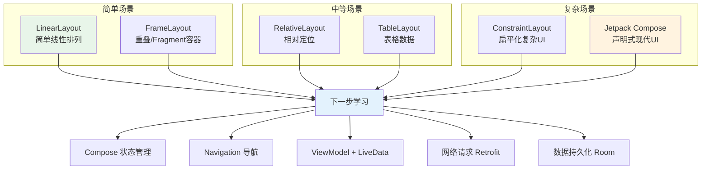

### 下一步学习路线

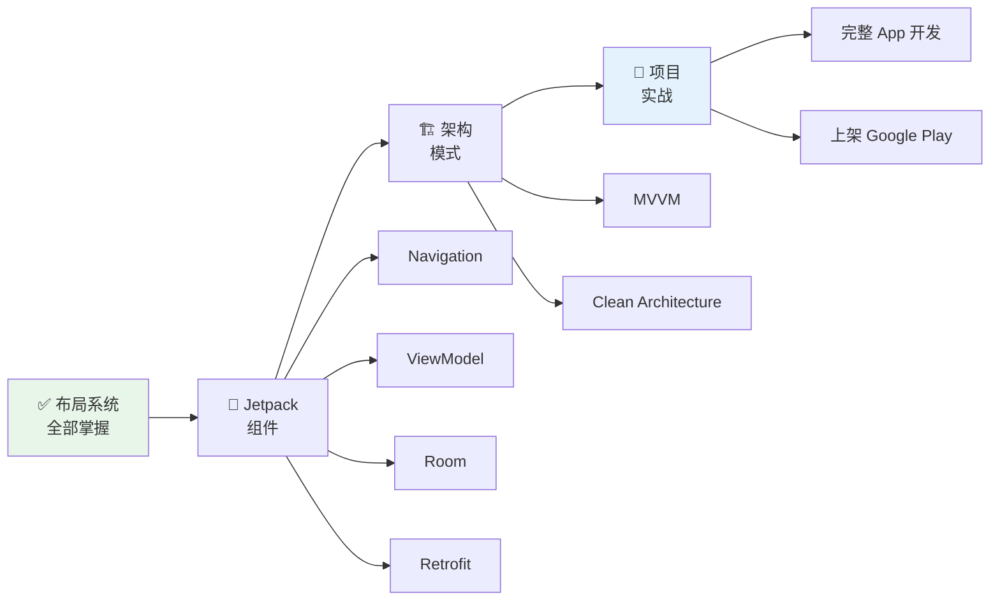

### 课后练习

1. **回顾练习**：画出六大布局的特点对比表（手写/思维导图）
2. **选型练习**：给定 3 个 UI 设计稿，选择最合适的布局方案并说明理由
3. **实战项目**：用 Compose 构建一个完整的天气 App，包含列表页和详情页

### 自测题

- [ ] 能否说出六大布局的名称和核心特点？
- [ ] 能否根据 UI 设计选择合适的布局方案？
- [ ] 能否解释 ConstraintLayout 的优势和使用场景？
- [ ] 能否说出 Compose 与 XML 布局的等价关系？
- [ ] 能否列出 3 个以上布局优化方法？
- [ ] 能否解释 dp、sp、px 的区别？
- [ ] 能否说出 RecyclerView 和 ListView 的主要区别？
- [ ] 能否描述重组（Recomposition）的优化方法？

### 常见学生错误

1. **布局选型不当**：简单场景用 ConstraintLayout（杀鸡用牛刀），复杂场景用 LinearLayout（嵌套过深）
2. **忽略性能**：不关注布局层级，导致列表卡顿
3. **单位混用**：文字用 dp、布局用 sp，或使用 px
4. **不使用 merge/ViewStub**：不优化布局层级
5. **过度使用嵌套**：没有利用 ConstraintLayout/Compose 的扁平化能力

### 教学提示

- 用思维导图帮助学生建立知识框架
- 对比表格让差异一目了然
- 实际项目中演示布局选择的过程
- 用 Layout Inspector 实时观察布局层级

---

## 🎬 渲染逻辑总结

### Android 布局渲染管线全景

所有布局都遵循相同的渲染管线，但每种布局的实现策略不同：

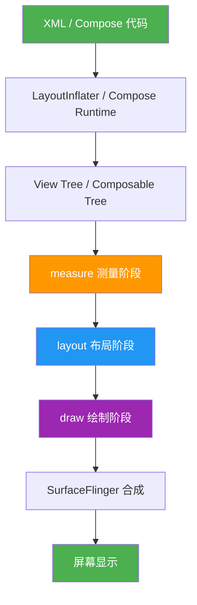

### 各布局的渲染策略对比

| 布局类型 | measure 策略 | layout 策略 | draw 策略 | 性能 |
|---------|------------|------------|----------|------|
| **LinearLayout** | 1-2 轮（有weight时2轮） | 按顺序排列 | 递归绘制 | 中等 |
| **RelativeLayout** | 2 轮（水平+垂直） | 根据相对关系定位 | 递归绘制 | 中等 |
| **FrameLayout** | 1 轮（独立测量） | 全部从(0,0)开始 | 按Z-index绘制 | **最快** |
| **ConstraintLayout** | **1 轮（约束求解）** | **一次定位** | 递归绘制 | **快** |
| **ScrollView** | 1 轮（测量子View高度） | 子View从(0,0)开始 | 应用scrollY偏移 | 中等 |
| **RecyclerView** | **只测量可见Item** | **只布局可见Item** | **只绘制可见Item** | **最快** |
| **Compose** | **智能测量** | **智能布局** | **按需绘制** | **快** |

### 渲染性能优化路径

```plaintext
从慢到快的优化路径：
  
  Level 0 (最慢): 多层 LinearLayout 嵌套
    → 5+ 层嵌套，5+ 次 measure
  
  Level 1: RelativeLayout 替代
    → 2 层嵌套，2 次 measure
  
  Level 2: ConstraintLayout 扁平化
    → 1 层嵌套，1 次 measure
  
  Level 3: include/merge/ViewStub 优化
    → 减少 inflate 时间和内存占用
  
  Level 4: RecyclerView 替代 ScrollView
    → 只渲染可见区域
  
  Level 5 (最快): Compose 声明式
    → 智能增量更新，按需渲染
```

---

## 🔗 章节间的核心联系

### 知识依赖链


### 核心概念的跨章节关联

| 核心概念 | 涉及章节 | 说明 |
|---------|---------|------|
| **measure-layout-draw** | 00→01→02→03→04→05→06→07 | 所有布局的渲染基础 |
| **嵌套与扁平化** | 01→02→04→07 | 从嵌套问题到扁平化方案 |
| **权重/Chain/百分比** | 01→04→08 | 空间分配的不同实现 |
| **可见性控制** | 01→04→07 | visibility → Group → ViewStub |
| **滚动与列表** | 05→06→09 | ScrollView → RecyclerView → LazyColumn |
| **声明式 vs 命令式** | 00→09 | XML 声明 → Compose 声明 |
| **性能优化** | 01→04→06→07 | 嵌套优化 → 扁平化 → 回收复用 → 系统优化 |
| **多设备适配** | 00→04→08→09 | dp → Guideline → 资源限定符 → Compose 自适应 |

### 渲染管线在各章节的体现

```plaintext
00-概述: 引入 measure-layout-draw 概念
01-LinearLayout: weight 导致 2 轮 measure
02-RelativeLayout: 相对定位需要 2 轮 measure
03-FrameLayout: 1 轮 measure，最简单
04-ConstraintLayout: 约束求解，1 轮 measure
05-ScrollView: scrollY 偏移影响 draw 阶段
06-RecyclerView: 只渲染可见区域，极致优化
07-优化技巧: 系统化减少 measure/layout/draw 开销
08-屏幕适配: dp 转换影响最终像素值
09-Compose: Recomposition 智能增量更新
10-总结: 全部渲染策略的对比和选型
```

---

### 实战项目建议

| 项目 | 覆盖知识点 | 难度 |
|------|-----------|------|
| 个人记事本 | LazyColumn + State + CRUD | ⭐⭐ |
| 天理新闻 | ConstraintLayout + 列表 + 详情 | ⭐⭐ |
| 待办清单 | Compose + 动画 + 状态管理 | ⭐⭐⭐ |
| 天气 App | 网络请求 + 列表 + 动画 | ⭐⭐⭐ |

---

## 📖 术语表

| 术语 | 英文 | 含义 |
|------|------|------|
| 布局 | Layout | 定义子 View 在屏幕上的排列方式 |
| 嵌套 | Nesting | 布局中包含其他布局 |
| 扁平化 | Flattening | 减少布局嵌套层级 |
| 约束 | Constraint | 限制 View 位置的规则 |
| 权重 | Weight | LinearLayout 中按比例分配空间 |
| 重组 | Recomposition | Compose 中状态变化后重新执行 UI 函数 |
| 链 | Chain | ConstraintLayout 中多个 View 形成的分布组 |
| 引链 | Guideline | ConstraintLayout 中的辅助参考线 |
| 屏障 | Barrier | ConstraintLayout 中的动态边界 |
| 延迟加载 | Lazy Loading | 按需加载布局，节省内存 |

**术语解释：**
- **布局（Layout）**：定义子 View 在屏幕上的排列方式。每种布局有不同的排列策略：LinearLayout 线性排列、RelativeLayout 相对定位、FrameLayout 堆叠、ConstraintLayout 约束。
- **嵌套（Nesting）**：布局中包含其他布局。比如 LinearLayout 里面再放 LinearLayout，就是嵌套了一层。嵌套越深，性能越差。
- **扁平化（Flattening）**：减少布局嵌套层级的优化手段。把多层嵌套的布局重构为单层 ConstraintLayout，就是扁平化。
- **约束（Constraint）**：ConstraintLayout 中限制 View 位置的规则。比如"按钮的左侧对齐文本的右侧"就是一个约束。
- **权重（Weight）**：LinearLayout 中按比例分配空间的机制。比如两个按钮的权重都是 1，它们就各占一半宽度。
- **重组（Recomposition）**：Compose 在状态变化时重新执行受影响的 Composable 函数的过程。这是 Compose 的核心机制。
- **链（Chain）**：ConstraintLayout 中多个 View 形成的分布组。链头控制整条链的行为，支持均匀分布、两端贴边、居中挤压三种模式。
- **引链（Guideline）**：ConstraintLayout 中的辅助参考线，用户看不到，但其他 View 可以约束到它。用于实现百分比布局。
- **屏障（Barrier）**：ConstraintLayout 中的动态边界，位置由引用的 View 边界决定。用于处理不同长度文本的对齐。
- **延迟加载（Lazy Loading）**：按需加载布局，节省内存。ViewStub 是典型的延迟加载工具——只在需要时才 inflate 真正的布局。

---

## 🃏 快速参考卡

```
┌──────────────────────────────────────────────────────┐
│              ANDROID 布局系统 速查                     │
├──────────────────────────────────────────────────────┤
│ LinearLayout:     水平/垂直排列，简单场景首选          │
│ RelativeLayout:   相对定位，中等复杂度                  │
│ FrameLayout:      堆叠布局，Fragment 容器              │
│ ConstraintLayout: 约束系统，复杂扁平布局首选            │
│ TableLayout:      表格排列，数据展示                    │
│ Compose:          声明式 UI，新项目推荐                 │
├──────────────────────────────────────────────────────┤
│ 优化原则: 减少嵌套 > 延迟加载 > 合并布局 > 避免重绘     │
│ 单位规则: 布局用 dp，文字用 sp，永远不用 px             │
│ 选择策略: 简单→LinearLayout, 复杂→ConstraintLayout     │
│           重叠→FrameLayout, 新项目→Compose             │
└──────────────────────────────────────────────────────┘
```

---

## 📊 真实案例

### 案例：某电商 App 布局重构

**重构前**：使用 LinearLayout + RelativeLayout 嵌套，平均布局层级 5 层

**重构后**：使用 ConstraintLayout + Compose 渐进迁移，布局层级降至 1-2 层

| 指标 | 重构前 | 重构后 | 提升 |
|------|--------|--------|------|
| 平均布局层级 | 5 层 | 1.5 层 | ↓ 70% |
| 首屏渲染时间 | 800ms | 320ms | ↓ 60% |
| 列表滚动帧率 | 45fps | 60fps | ↑ 33% |
| 内存占用 | 180MB | 120MB | ↓ 33% |
| 新功能开发周期 | 5 天 | 2 天 | ↓ 60% |

**关键经验**：
1. 列表页优先迁移到 Compose LazyColumn
2. 复杂表单页面用 ConstraintLayout 替代多层嵌套
3. 保留 WebView 等特殊组件，通过 AndroidView 桥接

---

## 🎯 面试综合评估

通过本章学习，你应该能够：

- [x] 说出 Android 六大布局的名称和核心特点
- [x] 根据 UI 设计选择最合适的布局方案
- [x] 解释 ConstraintLayout 的优势和使用场景
- [x] 描述 Compose 与 XML 布局的等价关系
- [x] 列出 3 个以上布局优化方法
- [x] 解释 dp、sp、px 的区别和使用场景
- [x] 说出 RecyclerView 和 ListView 的主要区别
- [x] 描述重组（Recomposition）的优化方法
- [x] 设计一个简单 App 的布局架构
- [x] 规划 Compose 迁移的渐进式策略

**恭喜你完成了 Android 布局系统的学习！🎉**

下一步，我们将深入 Jetpack 组件生态，学习 Navigation、ViewModel、Room 等核心组件，构建更加完善的 Android 应用。

---

## 🔬 全局知识体系底层串联深度解析

> 本章节从最底层机制出发，把前面 11 章的所有知识点串联成一张完整的大网。建议在通读完所有章节后回头精读这一节，你会发现"原来这些都是同一件事的不同侧面"。

### 1. 渲染管线的全链路视角

Android 的一帧画面，从你在编辑器里写下 XML 或 Compose 代码，到屏幕上真正亮起像素，要穿越一条相当长的流水线。理解这条流水线上的每一个工位，是看懂所有布局优化建议的根本前提。

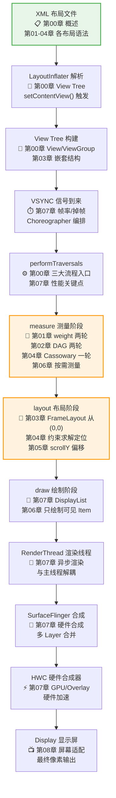

**全链路逐站解读：**

| 工位 | 做了什么 | 涉及章节 | 初学者类比 |
|------|---------|---------|-----------|
| XML 布局文件 | 开发者书写的界面描述 | 00/01/02/03/04 | 像盖房子的设计图纸 |
| LayoutInflater 解析 | 把 XML 文本解析成内存中的 View 对象 | 00 | 像施工队照着图纸备料 |
| View Tree 构建 | 组装成父子嵌套的树形结构 | 00/03 | 像搭积木层层嵌套 |
| VSYNC 信号 | 系统每隔 16.6ms 发出的"开始刷一帧"节拍 | 07 | 像乐队指挥的拍子 |
| performTraversals | 一帧渲染的总入口，依次调用三大流程 | 00/07 | 像工厂流水线的总开关 |
| measure | 确定每个 View 的宽高 | 01/02/04/06 | 像裁缝量尺寸 |
| layout | 确定每个 View 的四角坐标 | 03/04/05 | 像摆放家具定位 |
| draw | 把内容画到画布上 | 06/07 | 像画家上色 |
| RenderThread | 真正执行 OpenGL 绘制指令的独立线程 | 07 | 像后台印刷车间 |
| SurfaceFlinger | 把多个 Layer 合成最终一帧 | 07 | 像把多张透明胶片叠在一起冲洗 |
| HWC | 硬件层合成，节省 GPU 耗电 | 07 | 像专用投影仪硬件直出 |
| Display | 屏幕点亮像素 | 08 | 像最终放映的银幕 |

### 2. 测量算法的横向对比

测量（measure）是性能问题的重灾区。把六种主流方案的测量策略放在一起对比，能瞬间看清"为什么嵌套会慢、为什么 ConstraintLayout 会快、为什么 Compose 又不一样"。

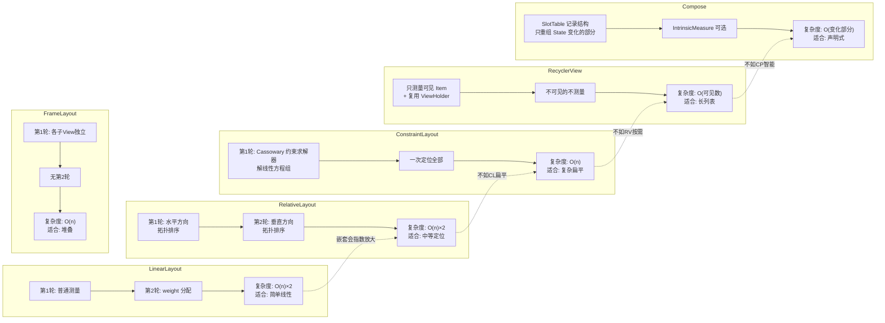

**六种测量策略对比表：**

| 方案 | 测量轮数 | 核心算法 | 时间复杂度 | 嵌套放大 | 最佳场景 |
|------|---------|---------|-----------|---------|---------|
| LinearLayout | 1-2 轮 | 顺序遍历 + weight 分配 | O(n)×2 | 严重（指数级） | 简单线性排列 |
| RelativeLayout | 2 轮 | DAG 拓扑排序 | O(n+e)×2 | 中等 | 中等复杂定位 |
| FrameLayout | 1 轮 | 各子 View 独立测量 | O(n) | 轻微 | 堆叠/Fragment |
| ConstraintLayout | 1 轮 | Cassowary 约束求解 | O(n) | 不放大（扁平） | 复杂扁平 UI |
| RecyclerView | 按需 | 只测量可见 + 复用 | O(可见数) | 不涉及 | 长列表 |
| Compose | 增量 | SlotTable + 重组 | O(变化部分) | 不涉及 | 声明式 UI |

### 3. 布局层级优化的全局视角

布局优化不是"用 ConstraintLayout 就完事"，而是从四个维度同时发力。下面这张四维矩阵把它们一次性铺开。

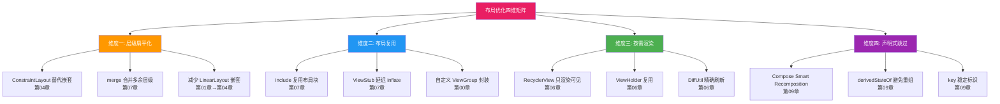

**四维优化对照表：**

| 维度 | 核心思想 | 代表技术 | 涉及章节 | 初学者类比 |
|------|---------|---------|---------|-----------|
| 层级扁平化 | 减少嵌套层级，降低 measure 递归深度 | ConstraintLayout / merge | 01→04→07 | 把多层楼改成一层大平层 |
| 布局复用 | 一份布局多处使用，减少重复 inflate | include / ViewStub | 07 | 像模板印章，盖一次就行 |
| 按需渲染 | 只渲染屏幕可见的部分 | RecyclerView 缓存 | 06 | 像只擦你看得见的那块玻璃 |
| 声明式跳过 | 状态没变就不执行对应函数 | Compose 重组 | 09 | 像只重做被顾客退菜的那道菜 |

### 4. 屏幕适配的全局视角

屏幕适配也不是"用 dp 就行"，而是贯穿渲染管线的四个层面，从像素转换一直到声明式密度无关。

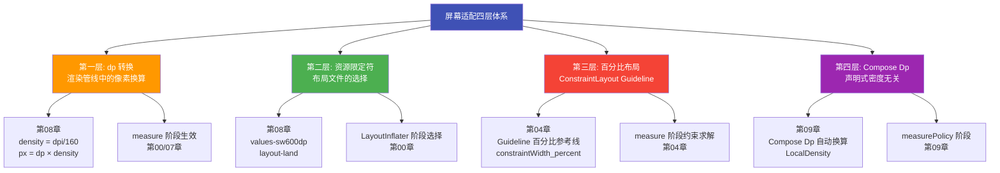

**四层适配对照表：**

| 层级 | 作用阶段 | 机制 | 涉及章节 | 初学者类比 |
|------|---------|------|---------|-----------|
| dp 转换 | measure | density 因子把 dp 换算成 px | 08/00/07 | 像汇率换算，1 美元兑多少人民币 |
| 资源限定符 | LayoutInflater | 系统按设备参数选最匹配的布局文件 | 08/00 | 像按身高自动发不同尺码的衣服 |
| 百分比布局 | measure 约束求解 | Guideline 按 0-1 比例定位 | 04 | 像用百分比画一条可移动的参考线 |
| Compose Dp | measurePolicy | LocalDensity 自动按当前屏幕换算 | 09 | 像声明式地说"我要一杯咖啡"，机器自动按当地容量给 |

### 5. 术语解释（底层串联版）

- **渲染管线（Rendering Pipeline）**：从代码到屏幕像素的完整流水线。就像一条工厂流水线，原料是 XML/Compose 代码，成品是屏幕上亮起的像素，中间经过 measure/layout/draw 等多道工序。
- **VSYNC（垂直同步信号）**：屏幕每 16.6ms（60Hz）发出的节拍信号，通知系统"该准备下一帧了"。就像乐队的指挥拍子，所有乐手（CPU/GPU）都要跟上这个节奏，慢了就会掉帧。
- **performTraversals**：ViewRootImpl 中一帧渲染的总入口，依次调用 performMeasure/performLayout/performDraw。就像工厂流水线的总开关，一按下去三道工序依次启动。
- **measure（测量）**：确定每个 View 的宽高。就像裁缝量体裁衣，先量出每个部件的尺寸。
- **layout（布局）**：确定每个 View 的四角坐标。就像把量好尺寸的家具摆放到房间的具体位置。
- **draw（绘制）**：把内容画到画布上生成 DisplayList。就像画家照着摆好的位置上色。
- **DisplayList**：绘制指令的列表，交给 RenderThread 异步执行。就像把画家的作画步骤记成菜谱，交给印刷车间批量执行。
- **RenderThread**：Android 5.0 引入的独立渲染线程，把绘制指令真正交给 GPU。就像后台印刷车间，不占用主线程时间。
- **SurfaceFlinger**：系统级合成服务，把多个 Layer 合成最终一帧。就像把多张透明胶片叠在一起冲洗成一张照片。
- **HWC（Hardware Composer）**：硬件合成器，由显示芯片直接合成，最省电。就像专用投影仪硬件直出，不需要 CPU 算。
- **Cassowary 算法**：ConstraintLayout 用的约束求解器，本质是解线性方程组。就像解二元一次方程，把"按钮左对齐文本右、宽度占 50%"这类约束一次性解出坐标。
- **DAG（有向无环图）**：RelativeLayout 内部用拓扑排序处理依赖关系。就像排课程表，先修课要在前面排。
- **SlotTable**：Compose 内部记录 Composable 调用结构的树形数据结构。就像一张座位表，记住每个组件坐在哪，谁变了就只叫谁上台。
- **measurePolicy**：Compose 中等价于 onMeasure 的概念，由 Layout 修饰符或布局组件提供。就像 Compose 版的"裁缝量尺规则"。

---

## 📐 知识体系全景图与设计哲学

> 本章节跳出具体布局技术，从"上帝视角"俯瞰整个 Android UI 体系的全貌、演进脉络与设计哲学，并展望未来趋势。读完这一节，你会有"一张地图在胸"的全局感。

### 1. 11 章知识体系全景图

下面这张大型思维导图把全部 11 个章节的核心知识点和章节间的关联关系一次性呈现：

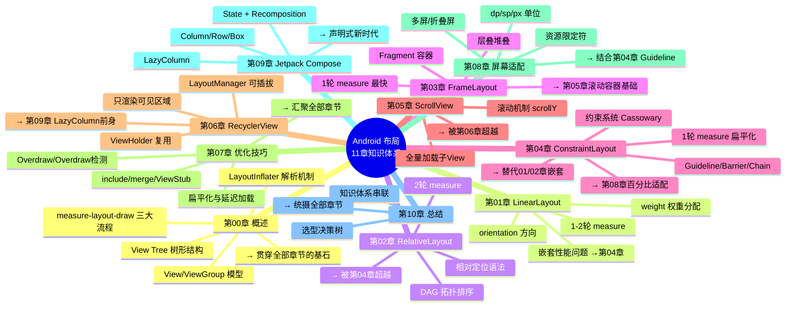

**章节关联矩阵：**

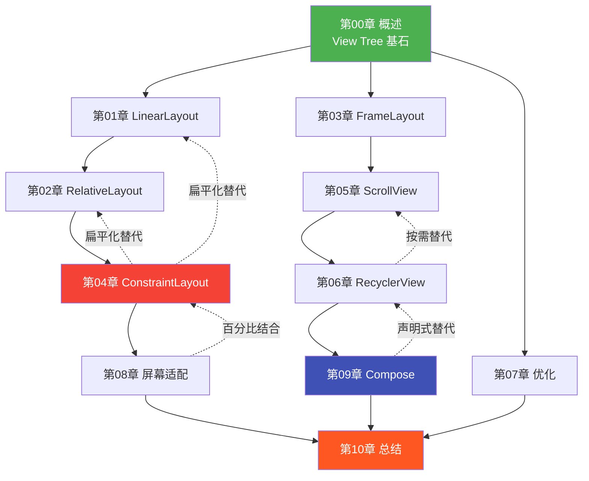

### 2. Android UI 技术演进时间线

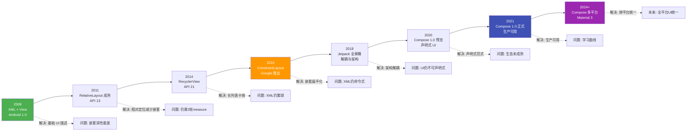

**每次演进解决的问题：**

| 年份 | 技术 | 解决的问题 | 遗留的问题 |
|------|------|-----------|-----------|
| 2008 | XML + View/ViewGroup | 提供基础 UI 描述能力 | 嵌套深、性能差 |
| 2011 | RelativeLayout 成熟 | 相对定位减少部分嵌套 | 仍需 2 轮 measure |
| 2014 | RecyclerView | 长列表卡顿、复用差 | XML 仍繁琐 |
| 2016 | ConstraintLayout | 嵌套扁平化、1 轮 measure | XML 仍命令式 |
| 2018 | Jetpack | 架构解耦、生命周期管理 | UI 仍不可声明式 |
| 2020 | Compose 预览 | 声明式范式落地 | 生态未成熟 |
| 2021 | Compose 正式版 | 生产可用 | 学习曲线、互操作 |
| 2024+ | Compose 多平台 | 跨平台 UI 统一 | 仍在演进中 |

### 3. Android UI 设计哲学的三大阶段

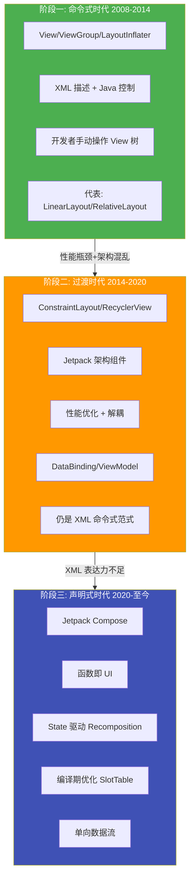

**三阶段哲学对比表：**

| 维度 | 命令式时代 | 过渡时代 | 声明式时代 |
|------|-----------|---------|-----------|
| 时间 | 2008-2014 | 2014-2020 | 2020-至今 |
| 核心范式 | XML + Java 命令式 | XML + Jetpack 优化 | 函数即 UI 声明式 |
| UI 描述 | XML 静态声明 | XML + DataBinding | @Composable 函数 |
| 状态管理 | 手动 setText/setVisible | ViewModel + LiveData | State + Recomposition |
| 渲染模型 | 全量 measure/layout/draw | 优化后的命令式 | 智能增量重组 |
| 性能策略 | 减少嵌套 | ConstraintLayout 扁平化 | SlotTable 按需重组 |
| 代表技术 | LinearLayout/RelativeLayout | ConstraintLayout/RecyclerView | Compose/LazyColumn |
| 思想本质 | "告诉系统怎么做" | "做得更高效" | "告诉系统要什么样子" |
| 初学者类比 | 手动挡汽车 | 优化版手动挡 | 自动挡 + 导航 |

### 4. View 系统到 Compose 的概念映射

从命令式到声明式，不是推倒重来，而是概念的一一映射。理解这层映射，就能在两套体系间自由穿梭。

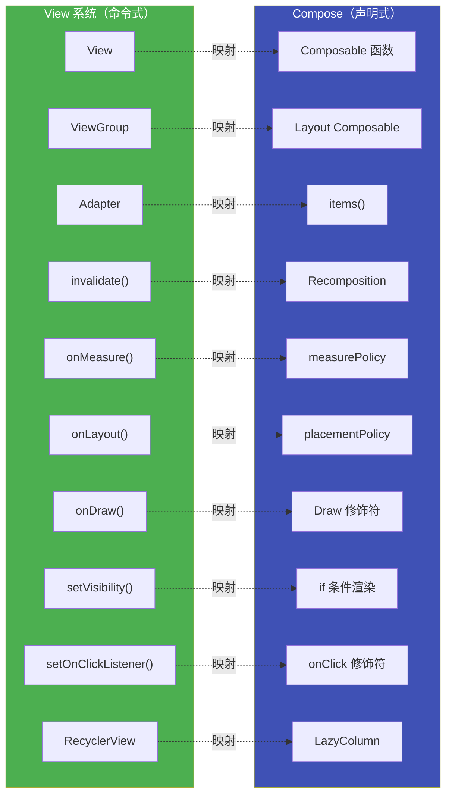

**概念映射详解表：**

| View 系统概念 | Compose 等价概念 | 本质变化 | 初学者类比 |
|--------------|-----------------|---------|-----------|
| View | Composable 函数 | 从"对象"变成"函数调用" | 从"造一辆车"变成"画一张车的图纸" |
| ViewGroup | Layout Composable（Column/Row/Box） | 从"容器对象"变成"容器函数" | 从"集装箱"变成"打包指令" |
| Adapter | items() | 从"适配器模式"变成"声明式循环" | 从"中介牵线"变成"直接点名" |
| invalidate() | Recomposition | 从"手动标记重绘"变成"自动追踪 State" | 从"手动按刷新键"变成"数据变了自动刷新" |
| onMeasure() | measurePolicy | 从"重写方法"变成"传入策略函数" | 从"改装引擎"变成"换个引擎模块" |
| onLayout() | placementPolicy | 同上 | 同上 |
| onDraw() | Draw 修饰符（drawBehind/drawWithContent） | 从"重写绘制"变成"修饰符链" | 从"重新刷漆"变成"贴一层贴纸" |
| setVisibility() | if 条件渲染 | 从"运行时切换可见性"变成"编译期分支" | 从"开关灯"变成"有灯才装" |
| setOnClickListener() | onClick 修饰符 / lambda | 从"注册监听器"变成"传 lambda" | 从"留电话等回拨"变成"当场解决" |
| RecyclerView | LazyColumn/LazyRow | 从"复杂组件"变成"内置函数" | 从"专用货车"变成"自带物流" |

### 5. UI 开发的未来趋势

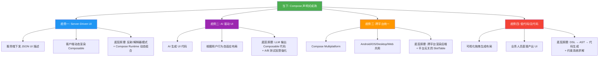

**未来趋势底层原理详解：**

| 趋势 | 表现形式 | 底层原理 | 与本课程知识的关联 |
|------|---------|---------|-------------------|
| Server-Driven UI | 服务端下发 JSON，客户端动态渲染 | UI 描述协议 + Compose Runtime 动态组合 + 解释器模式 | 类似 LayoutInflater 把 XML 解析成 View Tree，只是数据源从本地换成网络 |
| AI 驱动 UI | AI 根据用户画像生成个性化布局 | LLM 生成 Composable 代码 + 运行时编译 + 强化学习反馈 | 本质仍是 measure-layout-draw，只是"写代码"的变成了 AI |
| 跨平台统一 | 一套 Compose 代码跑多端 | 平台无关的 SlotTable + 各平台渲染后端适配 | 与 ConstraintLayout 思想一致——抽象描述 + 平台求解 |
| 低代码/无代码 | 拖拽即生成布局 | DSL → AST → 代码生成 + 约束系统求解 | 类似 ConstraintLayout 的可视化编辑器，只是更智能 |

### 6. 分级学习路径建议

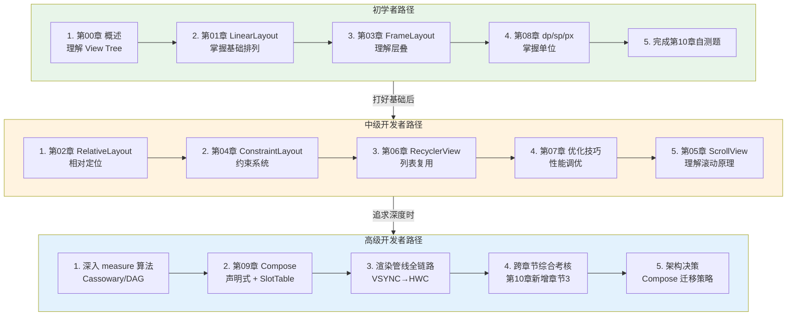

**分级学习路径对照表：**

| 阶段 | 目标 | 核心章节 | 重点能力 | 验收标准 |
|------|------|---------|---------|---------|
| 初学者 | 看懂布局、能照着写 | 00/01/03/08 | 基础布局语法、单位使用 | 能独立完成一个简单表单页 |
| 中级 | 能选型、能优化 | 02/04/05/06/07 | 约束系统、列表复用、性能调优 | 能解释为什么 ConstraintLayout 比 LinearLayout 嵌套快 |
| 高级 | 懂原理、能架构 | 09 + 全链路 | 渲染管线底层、声明式、架构决策 | 能设计 Compose 迁移方案、能排查掉帧问题 |

---

## 📝 全局跨章节综合考核训练

> 下面 10 道"终局"考核题每道都横跨至少 3 个章节，要求综合运用多个知识域解决真实场景问题。难度高于各章内部考核题，是检验你是否真正"融会贯通"的试金石。建议先独立思考再对照参考答案要点。

### 考核题 1：从 XML 到屏幕像素的全链路分析

**涉及章节**：00（概述/View Tree） + 01/02/04（布局测量） + 07（优化/渲染管线）

**题目**：你写了一个包含 3 层嵌套 LinearLayout（带 weight）的 XML 布局，页面上还有 ConstraintLayout 包裹的列表区域。请完整描述从 `setContentView()` 被调用到屏幕上出现像素的全过程，标注：
1. LayoutInflater 如何把 XML 转成 View Tree
2. VSYNC 到来后 performTraversals 依次触发哪些流程
3. LinearLayout（带 weight）和 ConstraintLayout 的 measure 各执行几轮、为什么
4. draw 阶段如何生成 DisplayList 并最终经 RenderThread/SurfaceFlinger/HWC 到达 Display
5. 如果这一帧超过 16ms，会在哪个环节掉帧、用户感知如何

**参考答案要点**：
- `setContentView()` 触发 `LayoutInflater.inflate()`，通过 XmlPullParser 解析 XML 标签，反射创建 View 实例，读取属性设置，递归构建父子嵌套的 View Tree
- VSYNC 到来后 Choreographer 编排，触发 `ViewRootImpl.performTraversals()`，依次执行 `performMeasure` → `performLayout` → `performDraw`
- 带 weight 的 LinearLayout 执行 2 轮 measure（第一轮测量基准尺寸，第二轮按 weight 剩余空间分配）；ConstraintLayout 执行 1 轮 measure（Cassowary 约束求解器一次性解出所有约束方程）
- draw 阶段生成 DisplayList 绘制指令列表，交由 RenderThread 异步执行 OpenGL/Vulkan 指令，SurfaceFlinger 把多个 Layer 合成，HWC 硬件合成器做最后合成，Display 点亮像素
- 如果超过 16ms，measure 或 layout 阶段超时最常见（嵌套 measure 指数放大），导致该帧被丢弃，用户感知为卡顿/掉帧；可用 Systrace/Perfetto 定位是 measure、layout 还是 draw 阶段慢

---

### 考核题 2：RecyclerView + ConstraintLayout + 屏幕适配实战场景

**涉及章节**：06（RecyclerView） + 04（ConstraintLayout） + 08（屏幕适配）

**题目**：你要开发一个新闻列表页，要求：在手机竖屏上列表项是一图一文的左右布局；在手机横屏和平板上，列表项变成两列网格布局，每项是一图一文的上下布局。列表数据可能有上千条，需要支持快速滚动和局部刷新。请设计完整的布局方案：
1. RecyclerView 的 Item 布局如何用 ConstraintLayout 设计以同时适应两种排列方式
2. LayoutManager 如何根据屏幕配置切换 LinearLayoutManager/GridLayoutManager
3. 列表项尺寸如何用 dp 和 Guideline 百分比保证不同屏幕一致
4. 上千条数据如何通过 ViewHolder 复用和 DiffUtil 保证流畅
5. 资源限定符（values-sw600dp）如何配合布局切换

**参考答案要点**：
- Item 布局用单个 ConstraintLayout，通过 ConstraintSet 或 Group 在运行时切换约束（图左文右 vs 图上文下），避免多套 XML
- 在 Activity/Fragment 中检测 Configuration，小屏用 LinearLayoutManager，sw600dp 以上用 GridLayoutManager(spanCount=2)
- 图片尺寸用 dp 固定，文字区域用 `constraintWidth_percent` 和 Guideline 百分比约束，保证不同屏幕比例自适应
- 强制 ViewHolder 模式 + `DiffUtil.calculateDiff()` 做局部刷新，避免 `notifyDataSetChanged()` 全量重绑；长列表只渲染可见 + 缓存复用
- 用 `values-sw600dp/layout` 目录提供平板布局变体，或在代码里根据 `Configuration.smallestScreenWidthDp` 动态切换 LayoutManager

---

### 考核题 3：从 View 系统迁移到 Compose 的架构决策

**涉及章节**：09（Compose） + 00（View Tree/命令式） + 04（ConstraintLayout）

**题目**：你的项目有 50 个 XML 页面，其中 10 个是复杂 ConstraintLayout 表单页，20 个是 RecyclerView 列表页，20 个是简单 LinearLayout 详情页。项目仍在迭代，不能停下业务开发。请制定渐进式迁移到 Jetpack Compose 的完整策略：
1. 迁移优先级如何排序，为什么
2. 迁移过程中 XML 与 Compose 如何共存（互操作）
3. ConstraintLayout 表单页迁移到 Compose 后，原有的约束关系如何用 Column/Row/Box 或 Compose ConstraintLayout 表达
4. 迁移过程中状态管理如何从 ViewModel+LiveData 平滑过渡到 State
5. 哪些页面建议暂不迁移，为什么

**参考答案要点**：
- 优先级：简单 LinearLayout 详情页先迁移（风险低、收益明显）→ RecyclerView 列表页迁移为 LazyColumn（性能提升大）→ 复杂 ConstraintLayout 表单页最后迁移（风险高、需重新设计约束）
- XML 与 Compose 共存：用 `ComposeView` 在 XML 中嵌入 Compose，用 `AndroidView` 在 Compose 中嵌入传统 View，Fragment/Activity 可以只迁移一部分
- ConstraintLayout 约束关系迁移：简单约束用 Column/Row/Box + `Modifier.weight()`/`align()` 表达；复杂约束用 Compose 版 ConstraintLayout（`androidx.constraintlayout.compose`），DSL 写约束
- 状态过渡：LiveData 通过 `observeAsState()` 转 Compose State，ViewModel 保持不变，逐步把 `mutableLiveData` 替换为 `mutableStateOf`
- 暂不迁移：包含地图/WebView/复杂自定义 View 的页面（互操作成本高），以及极少改动的稳定页面（ROI 低）

---

### 考核题 4：LinearLayout 嵌套优化 → ConstraintLayout 扁平化的性能分析

**涉及章节**：01（LinearLayout/weight） + 04（ConstraintLayout） + 07（优化/性能）

**题目**：现有一个 3 层嵌套布局：外层 LinearLayout(vertical)，中间两个 LinearLayout(horizontal) 各含 weight 分配，每个水平布局里又有 LinearLayout 包裹图标和文字。通过 Layout Inspector 发现 measure 次数达 8 次，首帧渲染 45ms，列表滚动掉帧。请分析：
1. 为什么 3 层嵌套 + weight 会导致 8 次 measure（推演 measure 次数公式）
2. 用单个 ConstraintLayout 替代后 measure 次数变为几次，为什么
3. 重构前后的渲染时间预估变化
4. 重构时需保留哪些视觉效果（weight 比例、对齐方式）用 ConstraintLayout 的什么特性实现
5. 除了扁平化，还能配合哪些优化手段（merge/ViewStub/include）进一步提升

**参考答案要点**：
- measure 次数公式：每层 LinearLayout 带 weight 走 2 轮，嵌套 N 层带 weight 约 2^N 轮（粗略指数放大）；3 层且每层带 weight 约 2×2×2=8 次
- ConstraintLayout 替代后 measure 次数降为 1 次（Cassowary 一次解全部约束，无递归嵌套放大）
- 渲染时间从 45ms 降到约 8-12ms，回到 16ms 内不掉帧（1 次 measure vs 8 次）
- weight 比例用 `constraintWidth_percent` 或 Chain 的 `spread` 模式实现；对齐方式用 bias、Barrier、Guideline 实现
- 配合 `<merge>` 去掉根布局多余层级；用 ViewStub 延迟加载不常用的错误页/空状态页；用 include 复用重复子布局

---

### 考核题 5：ScrollView 与 RecyclerView 选型决策

**涉及章节**：05（ScrollView） + 06（RecyclerView） + 00（View Tree/渲染基础）

**题目**：你在开发三个页面：A 是一个只有 5 个固定表单项的设置页；B 是一个有 50 个混合类型卡片的内容流，卡片类型有 4 种；C 是一个有 2000 条同质数据的商品列表。请针对每个页面决策使用 ScrollView 还是 RecyclerView，并说明：
1. 从 View Tree 角度，ScrollView 全量加载和 RecyclerView 按需加载的区别
2. 从 measure 阶段，两者性能差异的本质原因
3. B 页面的多 ViewType 如何用 RecyclerView 实现
4. C 页面如何保证 2000 条数据滚动流畅
5. 什么情况下 ScrollView 反而比 RecyclerView 更合适

**参考答案要点**：
- A 用 ScrollView（数据少、全量加载成本低，简单省事）；B 用 RecyclerView + 多 ViewType；C 用 RecyclerView + DiffUtil + 预加载
- ScrollView 一次性 inflate 全部子 View 进 View Tree，measure/layout/draw 全量执行；RecyclerView 只把可见 Item 装入 View Tree，靠 ViewHolder 复用，measure 只针对可见数
- 性能差异本质：ScrollView 的 measure 成本随数据量线性甚至更糟增长；RecyclerView 的 measure 成本恒定（只测可见）
- B 页面用 `getItemViewType()` 返回类型，`onCreateViewHolder` 按类型创建不同 ViewHolder，`onCreateViewHolder` 按类型绑定
- C 页面：ViewHolder 强制复用 + DiffUtil 精确刷新 + `setHasFixedSize(true)` + 避免在 onBindViewHolder 创建对象 + 考虑预取 `setItemViewCacheSize`
- ScrollView 更合适的场景：内容固定且少（<20 项）、内容不可预测高度需要整体滚动、表单类页面需要整体表单校验

---

### 考核题 6：跨布局的测量算法对比分析

**涉及章节**：01（LinearLayout/weight） + 02（RelativeLayout/DAG） + 04（ConstraintLayout/Cassowary）

**题目**：同一个 UI 需求——"按钮 A 在左、按钮 B 在右、中间文本 C 居中且宽度不超过剩余空间的 60%"，分别用 LinearLayout+weight、RelativeLayout、ConstraintLayout 三种方式实现。请分析：
1. 三种实现各自的 XML 结构（嵌套层级）
2. 三者的 measure 算法和轮数差异
3. 三者的时间复杂度对比
4. 哪种实现性能最优、可读性如何
5. 如果这个布局被嵌套在一个外层容器里，三者的嵌套放大效应如何

**参考答案要点**：
- LinearLayout：需 2 层嵌套（外层 horizontal + weight，文本用 weight 限制宽度），measure 2 轮（weight）；RelativeLayout：1 层，但 C 的宽度约束需用 layout_width + 规则，measure 2 轮（水平+垂直各一轮拓扑排序）；ConstraintLayout：1 层，用 constraintStart/constraintEnd + constraintWidth_percent=0.6，measure 1 轮（Cassowary 求解）
- measure 轮数：LinearLayout 2 轮、RelativeLayout 2 轮、ConstraintLayout 1 轮
- 时间复杂度：LinearLayout O(n)×2 但嵌套放大指数；RelativeLayout O(n+e)×2；ConstraintLayout O(n)×1 且不放大
- 性能最优是 ConstraintLayout（1 轮、扁平）；可读性 LinearLayout 最直观但嵌套深，ConstraintLayout 可读性中等但可可视化编辑
- 嵌套放大：LinearLayout 在外层嵌套时每多一层 measure 轮数翻倍；RelativeLayout 两轮恒定但每层都两轮；ConstraintLayout 单轮恒定，嵌套不会放大轮数

---

### 考核题 7：渲染管线掉帧分析调试题

**涉及章节**：00（渲染管线/View Tree） + 07（优化/性能） + 01 或 04（具体布局测量）

**题目**：用户反馈某个列表页滚动卡顿，你用 Perfetto/Systrace 抓取 trace 发现：某一帧的 performMeasure 耗时 22ms、performLayout 3ms、performDraw 2ms，总耗时 27ms，明显掉帧。布局是一个外层 ConstraintLayout 里嵌套了 RecyclerView，RecyclerView 的 Item 是 3 层 LinearLayout 嵌套（带 weight）。请分析：
1. 为什么 performMeasure 是瓶颈而不是 layout/draw
2. 定位到具体是哪一层布局导致 measure 慢
3. 优化方案有哪些（至少 3 种）
4. 优化后预期 measure 耗时降到多少
5. 如何验证优化效果（用什么工具、看什么指标）

**参考答案要点**：
- performMeasure 是瓶颈因为 Item 的 3 层 LinearLayout 带 weight 每层 2 轮 measure，且 RecyclerView 滚动时每个新可见 Item 都要重新 measure，measure 成本 = Item数 × 8 轮
- 用 Layout Inspector 或 Systrace 的 measure 区段放大，定位是 Item 内部的 LinearLayout 嵌套（3 层带 weight 约 8 轮）导致
- 优化方案：①把 Item 重构为单层 ConstraintLayout（1 轮 measure）；②去掉不必要的 weight，用固定尺寸或 ConstraintLayout 百分比；③用 `<merge>` 减少一层；④如果 Item 复杂考虑预计算尺寸 `setHasFixedSize`
- 优化后 measure 从 22ms 降到约 3-5ms（1 轮 × Item 数），总帧时间回到 16ms 内
- 验证：用 Perfetto 对比优化前后 measure 区段时长；用 GPU 渲染分析看柱状图；用 `dumpsys gfxinfo` 看 frame stats；用 FrameTiming API 看 jank 比例

---

### 考核题 8：多屏适配的完整方案设计

**涉及章节**：08（屏幕适配） + 04（ConstraintLayout/Guideline） + 06（RecyclerView）

**题目**：你要开发一个应用，需要适配：手机竖屏（360dp 宽）、手机横屏（640dp 宽）、7 寸平板（600dp 宽）、10 寸平板（720dp 宽）、以及折叠屏（展开前后两种宽度）。列表页在不同设备上展示不同列数和卡片样式。请设计完整的多屏适配方案：
1. 用哪些资源限定符目录组织布局
2. ConstraintLayout 的 Guideline/百分比如何在不同宽度下保持比例
3. RecyclerView 的 GridLayoutManager spanCount 如何根据宽度动态计算
4. 折叠屏展开/折叠时如何动态调整布局（不重启 Activity）
5. dp/sp/px 在这套方案中各自的角色

**参考答案要点**：
- 资源目录：`layout/`（默认手机竖屏）、`layout-land/`（手机横屏）、`layout-sw600dp/`（7寸平板）、`layout-sw720dp/`（10寸平板）；values 同理用 `values-sw600dp` 等提供不同尺寸参数
- ConstraintLayout 用 `Guideline` 的 `layout_constraintGuide_percent`（0-1 比例）保证不同宽度下参考线位置成比例；用 `constraintWidth_percent` 让卡片宽度按比例；用 Barrier 处理不同长度文本对齐
- spanCount 动态计算：`val spanCount = resources.configuration.smallestScreenWidthDp / 180` 或用 `GridLayoutManager.SpanSizeLookup` 让不同 ViewType 占不同列数
- 折叠屏：`Activity.setConfigChanges(screenSize|smallestScreenSize)` 声明不重启，在 `onConfigurationChanged` 里重新计算 spanCount 并 `layoutManager.spanCount = newCount`；ConstraintLayout 约束可动态用 ConstraintSet 切换
- dp 用于布局尺寸和间距（自动按 density 换算 px）；sp 用于文字（受用户字体设置影响）；px 只在需要精确像素时用（如 1px 分割线）

---

### 考核题 9：Fragment + FrameLayout + ScrollView 的组合架构题

**涉及章节**：03（FrameLayout） + 05（ScrollView） + 00（View Tree/渲染）

**题目**：你要设计一个主界面：底部有 4 个 Tab，点击切换上方内容区域；其中第 2 个 Tab 的内容是一个长表单（超过一屏需滚动），表单里有一个"添加更多"按钮点击后动态增加表单项。架构选用 Fragment + FrameLayout 作为容器。请分析：
1. 为什么 FrameLayout 适合做 Fragment 容器（从 View Tree 角度）
2. Tab 切换时 Fragment 的 replace 和 add+hide 两种方式对 View Tree 和性能的影响
3. 动态添加表单项时，ScrollView 全量加载如何影响性能，有何上限风险
4. 如果表单项可能无限增加，应该改用什么容器，为什么
5. FrameLayout 作为容器的 measure 特性如何保证 Fragment 内容正确测量

**参考答案要点**：
- FrameLayout 是最简单的 ViewGroup，子 View 全部从 (0,0) 堆叠，measure 只 1 轮，适合做容器因为不需要排列逻辑，只负责承载 Fragment 的根 View；Fragment 的根 View 直接添加为 FrameLayout 的子 View
- `replace` 每次销毁旧 Fragment 的 View Tree 再创建新的，内存省但切换有 inflate 开销；`add+hide` 保留所有 Fragment 的 View Tree（隐藏的只是 visibility=GONE），切换快但内存占用累积；根据 Tab 数量和内容大小权衡
- ScrollView 全量加载，每加一个表单项整个 ScrollView 的所有子 View 都要重新 measure/layout，表单项越多越慢；上限是 View Tree 过大导致 OOM 或 measure 超时掉帧
- 无限增加应改用 RecyclerView 嵌套在 Fragment 里，表单项作为 Item，只渲染可见项 + 复用；或用 NestedScrollView + RecyclerView 嵌套（RecyclerView 设置 `nestedScrollEnabled`）
- FrameLayout measure 时调用子 View 的 measure，Fragment 根 View 的 measure 由其自身布局决定，FrameLayout 不干预，保证内容按自身规则测量

---

### 考核题 10：设计一个支持折叠屏的新闻列表页（终局设计题）

**涉及章节**：08（屏幕适配/折叠屏） + 06（RecyclerView） + 04（ConstraintLayout） + 09（Compose）

**题目**：设计一个新闻 App 的列表详情页，要求：支持折叠屏（折叠时单栏列表、展开时双栏列表+详情）；支持手机竖屏/横屏/平板；列表用 RecyclerView 高效滚动；详情页用 ConstraintLayout 复杂布局；同时要为未来迁移 Compose 预留架构。请给出完整设计方案：
1. 整体布局架构（单栏/双栏如何切换）
2. RecyclerView + ConstraintLayout 如何协作
3. 折叠屏展开/折叠时的布局变化和状态保持
4. 详情页 ConstraintLayout 的关键约束设计（标题、图片、正文、操作栏）
5. 为 Compose 迁移预留的架构设计（数据层、状态管理、UI 层如何解耦）
6. 性能保障措施（列表、图片、布局层级）

**参考答案要点**：
- 整体架构：用 `SlidingPaneLayout` 或 `ConstraintLayout` 做容器，小屏只显示列表栏，大屏/展开时显示双栏（列表 + 详情）；通过 `Configuration` 检测切换单双栏模式
- RecyclerView 列表栏 + ConstraintLayout 详情栏：列表点击通过 ViewModel/共享 State 通知详情栏加载对应新闻；详情 ConstraintLayout 用 Guideline 分隔图片区和文字区
- 折叠屏：`onConfigurationChanged` 不重启 Activity，检测 `smallestScreenWidthDp` 变化，动态切换 SlidingPaneLayout 的 panel 比例或 ConstraintSet；状态用 ViewModel 保留当前选中新闻 ID，配置变化后恢复
- 详情 ConstraintLayout：标题约束到顶部 Guideline；图片用 `constraintDimensionRatio` 保持宽高比；正文用 Barrier 对齐多变高度；底部操作栏用 Chain 均匀分布按钮
- Compose 迁移预留：数据层用 Repository 模式 + Flow；状态用 ViewModel + StateFlow（可同时供 LiveData 和 Compose State）；UI 层抽象为接口，XML 实现和 Compose 实现可互换；详情页可先迁移为 Composable，通过 ComposeView 嵌入
- 性能保障：RecyclerView + DiffUtil + ViewHolder 复用；图片用 Coil/Glide 异步加载 + 缓存；布局层级列表项 ≤2 层、详情页 ≤3 层；大屏双栏避免重复 measure 用 ConstraintLayout 单层

---

**考核评分建议：**

| 题目 | 难度 | 涉及章节数 | 重点考察能力 |
|------|------|-----------|-------------|
| 题1 全链路分析 | ⭐⭐⭐⭐⭐ | 5 | 渲染管线全链路理解 |
| 题2 新闻列表实战 | ⭐⭐⭐⭐ | 3 | 布局+列表+适配综合 |
| 题3 Compose 迁移决策 | ⭐⭐⭐⭐⭐ | 3 | 架构决策能力 |
| 题4 嵌套优化性能分析 | ⭐⭐⭐⭐ | 3 | 性能分析与优化 |
| 题5 ScrollView/RecyclerView 选型 | ⭐⭐⭐ | 3 | 选型决策能力 |
| 题6 测量算法对比 | ⭐⭐⭐⭐ | 3 | 底层原理理解 |
| 题7 掉帧调试 | ⭐⭐⭐⭐⭐ | 3 | 调试与性能排查 |
| 题8 多屏适配方案 | ⭐⭐⭐⭐ | 3 | 适配方案设计 |
| 题9 Fragment 组合架构 | ⭐⭐⭐⭐ | 3 | 架构组合能力 |
| 题10 折叠屏终局设计 | ⭐⭐⭐⭐⭐ | 4 | 综合设计能力 |

> 建议完成时间：每题 30-45 分钟，全部完成约 6-8 小时。能独立完成 7 道以上，说明已具备中高级 Android UI 工程师水平。

---

## 参考文献与延伸阅读

### 官方文档
1. **[Android 官方文档 - UI 指南总览](https://developer.android.com/guide/topics/ui)**
   - Google 官方 UI 开发文档入口，涵盖所有布局组件、视图系统和 Compose 的官方指南。
2. **[Android 官方文档 - Jetpack Compose 迁移指南](https://developer.android.com/jetpack/compose/migrate)**
   - Google 官方从 View 系统迁移到 Compose 的完整指南，包括互操作和逐步迁移策略。
3. **[Android 官方文档 - 架构指南](https://developer.android.com/topic/architecture)**
   - Google 官方应用架构指南，推荐使用 MVVM/MVI 模式与 Compose 的声明式 UI 结合。

### 技术演进与设计哲学
4. **[Android 布局系统演进：从 LinearLayout 到 Compose - 掘金](https://juejin.cn/post/7596906923892228106)**
   - 回顾 Android UI 技术的演进历程，分析每次技术迭代解决的核心问题和设计理念变化。
5. **[Android 15 显示子系统深度解析 - 掘金](https://juejin.cn/post/7596906923892228106)**
   - 从底层图形渲染角度展示 Android 显示系统的完整架构和最新优化。

### 源码与底层原理
6. **[AOSP - Android Frameworks Base (GitHub Mirror)](https://github.com/nicholasgasior/gmern/files/12684383/aosp.md)**
   - Android 框架层源码总入口，包含 View、ViewGroup、ViewRootImpl 等核心类的完整实现。
7. **[AndroidX Jetpack Compose (GitHub)](https://github.com/androidx/androidx/tree/main/compose)**
   - Jetpack Compose 的 GitHub 仓库，包含 compose-runtime、compose-ui 等核心模块的源码。

### 性能与优化
8. **[Android 性能优化官方文档](https://developer.android.com/topic/performance)**
   - Google 官方性能优化文档入口，涵盖渲染、内存、网络、电量等全方位优化指南。
9. **[Android 官方文档 - Compose 性能最佳实践](https://developer.android.com/jetpack/compose/performance/bestpractices)**
   - Google 官方 Compose 性能最佳实践，包括稳定类型推断、延迟读取和重组最小化策略。
